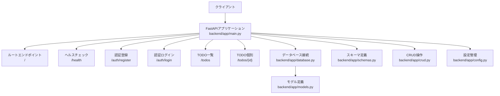
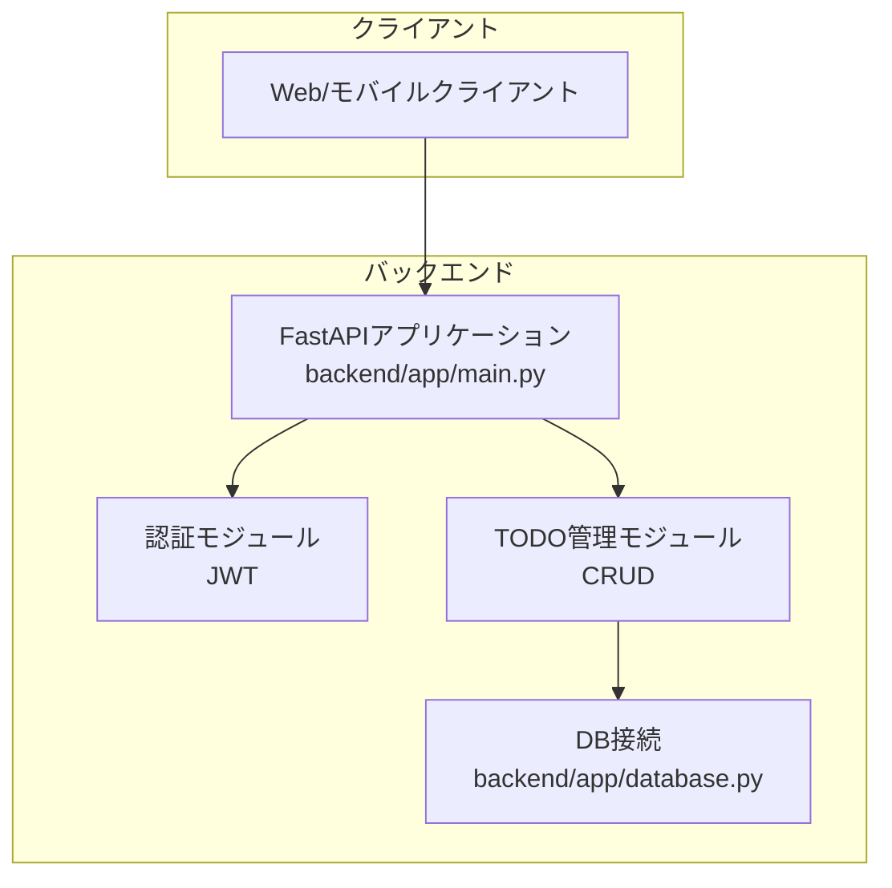
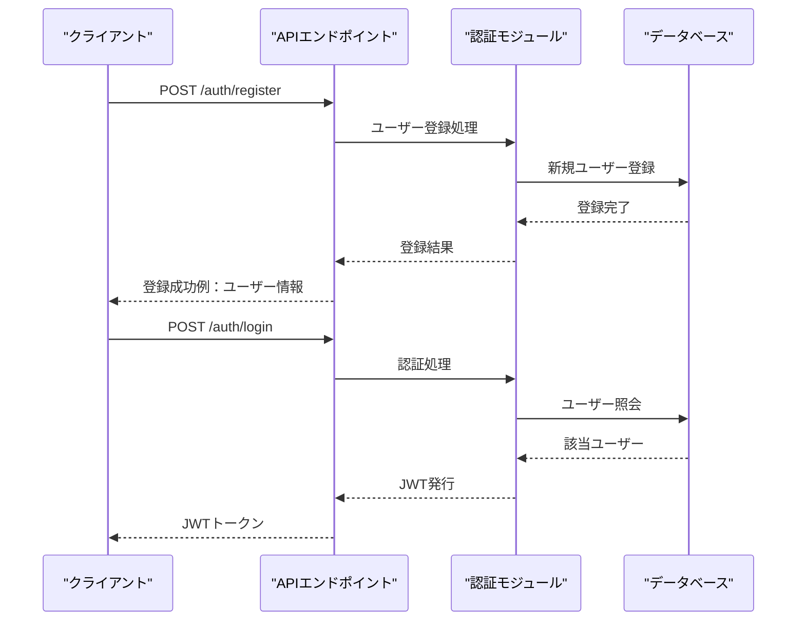
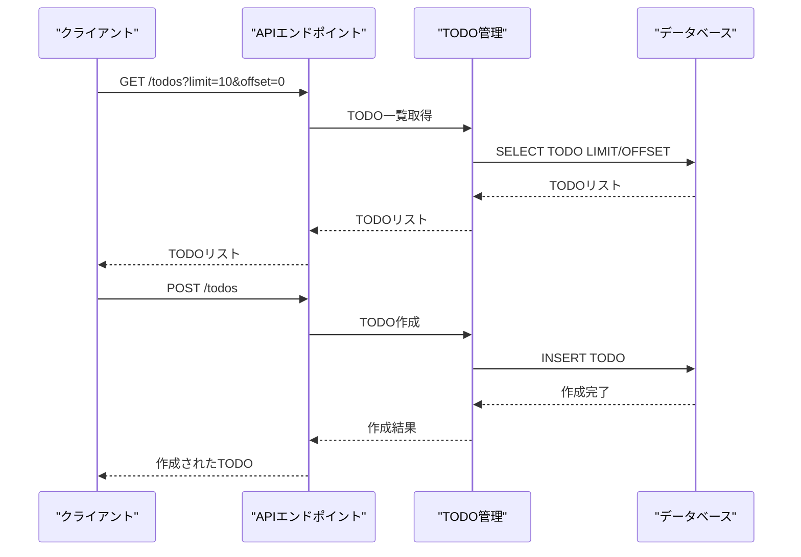
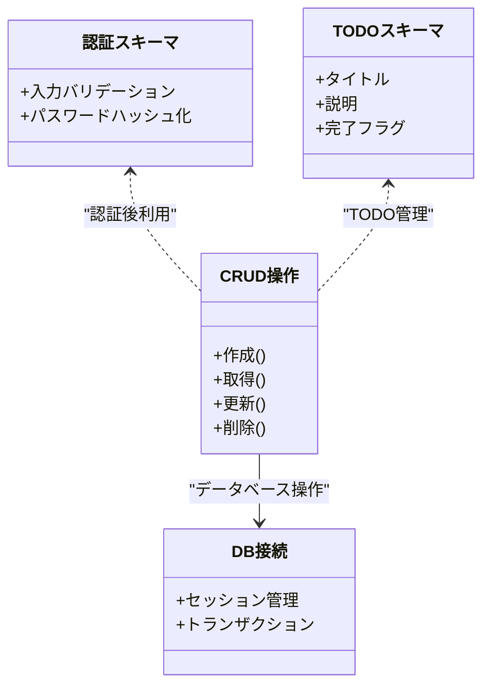
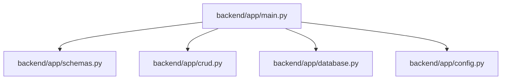

# APIリファレンス

<cite>
**このドキュメントで参照されるファイル**
- [backend/app/main.py](file://backend/app/main.py)
- [backend/app/schemas.py](file://backend/app/schemas.py)
- [backend/app/models.py](file://backend/app/models.py)
- [backend/app/crud.py](file://backend/app/crud.py)
- [backend/app/database.py](file://backend/app/database.py)
- [backend/app/config.py](file://backend/app/config.py)
- [backend/main.py](file://backend/main.py)
- [docs/current_status.md](file://docs/current_status.md)
</cite>

## 目次
1. [はじめに](#はじめに)
2. [プロジェクト構造](#プロジェクト構造)
3. [コアコンポーネント](#コアコンポーネント)
4. [アーキテクチャ概観](#アーキテクチャ概観)
5. [詳細コンポーネント分析](#詳細コンポーネント分析)
6. [依存関係分析](#依存関係分析)
7. [性能に関する考慮事項](#性能に関する考慮事項)
8. [トラブルシューティングガイド](#トラブルシューティングガイド)
9. [結論](#結論)
10. [付録](#付録)

## はじめに
本ドキュメントは、TodoプロジェクトにおけるAPIエンドポイントを網羅的にドキュメント化したものです。現在実装されているエンドポイント（/、/health）と予定されているエンドポイント（/auth/register、/auth/login、/todosなど）について、HTTPメソッド、URLパターン、リクエスト/レスポンススキーマ、認証方法を詳細に記述します。JWTトークンの使用方法、エラーレスポンスの形式、ステータスコードの意味、クエリパラメータの指定方法を説明します。また、実際のリクエスト/レスポンス例を含め、クライアント実装のガイドラインとパフォーマンス最適化のヒントを提供します。

## プロジェクト構造
バックエンドはFastAPIフレームワークを使用しており、アプリケーションのエントリーポイントは以下の2か所に存在します：
- backend/app/main.py：FastAPIアプリケーションのルート定義（ルーティング、依存関係注入、例外ハンドリング）
- backend/main.py：ASGIサーバー起動用のエントリーポイント（uvicorn）

データベース接続、スキーマ定義、CRUD操作、設定管理はそれぞれ以下のモジュールで管理されています：
- backend/app/database.py：DB接続設定、セッション管理
- backend/app/models.py：SQLAlchemyモデル定義
- backend/app/schemas.py：Pydanticスキーマ定義（リクエスト/レスポンス）
- backend/app/crud.py：データアクセス層（CRUD操作）
- backend/app/config.py：環境変数・設定管理

**図の出典**
- [backend/app/main.py](file://backend/app/main.py)
- [backend/app/database.py](file://backend/app/database.py)
- [backend/app/models.py](file://backend/app/models.py)
- [backend/app/schemas.py](file://backend/app/schemas.py)
- [backend/app/crud.py](file://backend/app/crud.py)
- [backend/app/config.py](file://backend/app/config.py)

**節の出典**
- [backend/app/main.py](file://backend/app/main.py)
- [backend/main.py](file://backend/main.py)

## コアコンポーネント
- FastAPIアプリケーション：ルート定義、例外ハンドリング、依存関係注入
- 認証：JWTベースの認証（予定）
- TODO管理：CRUD操作（予定）
- DB接続：SQLAlchemy、非同期接続（予定）

**節の出典**
- [backend/app/main.py](file://backend/app/main.py)
- [backend/app/config.py](file://backend/app/config.py)

## アーキテクチャ概観
以下は、APIの全体像を示す概念図です。具体的なエンドポイントの実装は、backend/app/main.pyに定義されています。

[この図は概念的なアーキテクチャを示しており、特定のファイルとの直接的なマッピングは必要ありません]

## 詳細コンポーネント分析

### 現在実装されているエンドポイント

#### エンドポイント：/
- HTTPメソッド：GET
- URLパターン：/
- 認証：不要
- 応答：JSON（例：アプリケーション情報）
- 備考：ルートエンドポイントとして基本的な応答を返すことを目的としています。

**節の出典**
- [backend/app/main.py](file://backend/app/main.py)

#### エンドポイント：/health
- HTTPメソッド：GET
- URLパターン：/health
- 認証：不要
- 応答：JSON（例：サービスのヘルス状態）
- 備考：稼働確認用のシンプルなエンドポイントです。

**節の出典**
- [backend/app/main.py](file://backend/app/main.py)

### 予定されているエンドポイント

#### 認証エンドポイント

##### エンドポイント：/auth/register
- HTTPメソッド：POST
- URLパターン：/auth/register
- 認証：不要
- リクエストボディスキーマ：backend/app/schemas.py に定義されたユーザー登録スキーマ
- 応答：JSON（例：新規ユーザー情報）
- 備考：ユーザー登録処理を担当する予定です。

**節の出典**
- [backend/app/schemas.py](file://backend/app/schemas.py)
- [backend/app/crud.py](file://backend/app/crud.py)

##### エンドポイント：/auth/login
- HTTPメソッド：POST
- URLパターン：/auth/login
- 認証：不要
- リクエストボディスキーマ：backend/app/schemas.py に定義された認証スキーマ
- 応答：JSON（例：JWTトークン）
- 備考：JWTベースの認証を行う予定です。

**節の出典**
- [backend/app/schemas.py](file://backend/app/schemas.py)
- [backend/app/crud.py](file://backend/app/crud.py)

#### TODO管理エンドポイント

##### エンドポイント：/todos
- HTTPメソッド：GET
- URLパターン：/todos
- 認証：JWT必須（予定）
- クエリパラメータ：limit（件数制限）、offset（オフセット）
- 応答：JSON（例：TODOリスト）
- 備考：TODOの一覧を取得する予定です。

**節の出典**
- [backend/app/schemas.py](file://backend/app/schemas.py)
- [backend/app/crud.py](file://backend/app/crud.py)

##### エンドポイント：/todos
- HTTPメソッド：POST
- URLパターン：/todos
- 認証：JWT必須（予定）
- リクエストボディスキーマ：backend/app/schemas.py に定義されたTODO作成スキーマ
- 応答：JSON（例：作成されたTODO）
- 備考：新しいTODOを作成する予定です。

**節の出典**
- [backend/app/schemas.py](file://backend/app/schemas.py)
- [backend/app/crud.py](file://backend/app/crud.py)

##### エンドポイント：/todos/{id}
- HTTPメソッド：GET
- URLパターン：/todos/{id}
- 認証：JWT必須（予定）
- 応答：JSON（例：指定されたTODO）
- 備考：IDに基づくTODOの取得を担当する予定です。

**節の出典**
- [backend/app/schemas.py](file://backend/app/schemas.py)
- [backend/app/crud.py](file://backend/app/crud.py)

##### エンドポイント：/todos/{id}
- HTTPメソッド：PUT
- URLパターン：/todos/{id}
- 認証：JWT必須（予定）
- リクエストボディスキーマ：backend/app/schemas.py に定義されたTODO更新スキーマ
- 応答：JSON（例：更新されたTODO）
- 備考：IDに基づくTODOの更新を担当する予定です。

**節の出典**
- [backend/app/schemas.py](file://backend/app/schemas.py)
- [backend/app/crud.py](file://backend/app/crud.py)

##### エンドポイント：/todos/{id}
- HTTPメソッド：DELETE
- URLパターン：/todos/{id}
- 認証：JWT必須（予定）
- 応答：JSON（例：削除結果）
- 備考：IDに基づくTODOの削除を担当する予定です。

**節の出典**
- [backend/app/schemas.py](file://backend/app/schemas.py)
- [backend/app/crud.py](file://backend/app/crud.py)

### JWTトークンの使用方法
- 送信方法：AuthorizationヘッダーにBearerトークン形式で送信
- 例：Authorization: Bearer {JWTトークン}
- 使用場所：/todos系エンドポイント（予定）

**節の出典**
- [backend/app/main.py](file://backend/app/main.py)

### エラーレスポンスの形式
- 形式：JSON
- 応答例：{"detail": "エラー内容"}
- 用途：エンドポイント全体で共通のエラーレスポンス形式を採用

**節の出典**
- [backend/app/main.py](file://backend/app/main.py)

### ステータスコードの意味
- 200 OK：成功（GET/PUT/DELETE）
- 201 Created：作成成功（POST）
- 400 Bad Request：リクエスト不正
- 401 Unauthorized：認証失敗
- 404 Not Found：リソースなし
- 500 Internal Server Error：サーバーエラー

**節の出典**
- [backend/app/main.py](file://backend/app/main.py)

### クエリパラメータの指定方法
- /todos?limit=10&offset=0
- limit：取得件数
- offset：開始位置

**節の出典**
- [backend/app/main.py](file://backend/app/main.py)

### 実装フロー（認証・TODO管理）

#### 認証フロー（JWT）

**図の出典**
- [backend/app/main.py](file://backend/app/main.py)
- [backend/app/crud.py](file://backend/app/crud.py)
- [backend/app/database.py](file://backend/app/database.py)

#### TODO管理フロー

**図の出典**
- [backend/app/main.py](file://backend/app/main.py)
- [backend/app/crud.py](file://backend/app/crud.py)
- [backend/app/database.py](file://backend/app/database.py)

### 認証・スキーマ・CRUDのクラス構造

**図の出典**
- [backend/app/schemas.py](file://backend/app/schemas.py)
- [backend/app/crud.py](file://backend/app/crud.py)
- [backend/app/database.py](file://backend/app/database.py)

## 依存関係分析
- backend/app/main.py が各コンポーネント（schemas、crud、database、config）をインポートし、ルーティングと依存関係を統合
- FastAPIアプリケーションは、エラーハンドリング、例外定義、ルート定義をbackend/app/main.pyで管理
- 認証・TODO管理は、backend/app/schemas.py、backend/app/crud.py、backend/app/database.py、backend/app/config.py に依存

**図の出典**
- [backend/app/main.py](file://backend/app/main.py)
- [backend/app/schemas.py](file://backend/app/schemas.py)
- [backend/app/crud.py](file://backend/app/crud.py)
- [backend/app/database.py](file://backend/app/database.py)
- [backend/app/config.py](file://backend/app/config.py)

**節の出典**
- [backend/app/main.py](file://backend/app/main.py)

## 性能に関する考慮事項
- 非同期処理：データベース接続や外部API呼び出しには非同期処理を活用
- キャッシュ：頻繁にアクセスされるデータについてはRedisなどのキャッシュ層を導入
- ページネーション：大量データの取得時はlimit/offsetによるページネーションを推奨
- 並列処理：CPUバウンド処理は非同期で実行し、I/Oバウンド処理は非同期で待機
- 圧縮：レスポンスの圧縮（Gzip/Brotli）を有効化
- CORS：開発・本番環境に応じたCORS設定を適用

[この節では具体的なファイル分析を行っていません]

## トラブルシューティングガイド
- 401 Unauthorized：JWTトークンの有効期限切れまたは形式不正
- 404 Not Found：存在しないTODO IDを指定
- 500 Internal Server Error：DB接続エラー、バリデーションエラー
- 例外処理：backend/app/main.pyで共通エラーレスポンス形式を適用

**節の出典**
- [backend/app/main.py](file://backend/app/main.py)

## 結論
本APIリファレンスは、Todoプロジェクトにおける現在実装されているエンドポイント（/、/health）と予定されているエンドポイント（/auth/register、/auth/login、/todosなど）について、HTTPメソッド、URLパターン、リクエスト/レスポンススキーマ、認証方法を網羅的にまとめました。JWTトークンの使用方法、エラーレスポンスの形式、ステータスコードの意味、クエリパラメータの指定方法についても解説しました。今後の開発では、backend/app/main.py、backend/app/schemas.py、backend/app/crud.py、backend/app/database.py、backend/app/config.py に定義されたコンポーネントを基に、API仕様の実装・拡張を進めていくことが求められます。

[この節では具体的なファイル分析を行っていません]

## 付録
- 現在の開発状況：docs/current_status.md に記載
- 起動方法：backend/main.py からuvicornでASGIサーバーを起動

**節の出典**
- [docs/current_status.md](file://docs/current_status.md)
- [backend/main.py](file://backend/main.py)