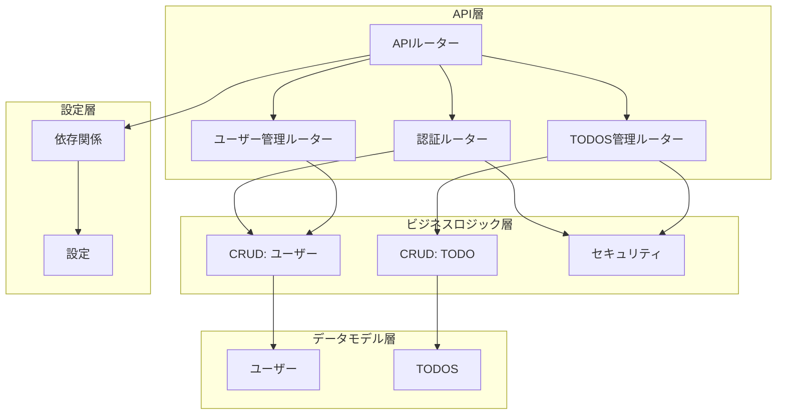
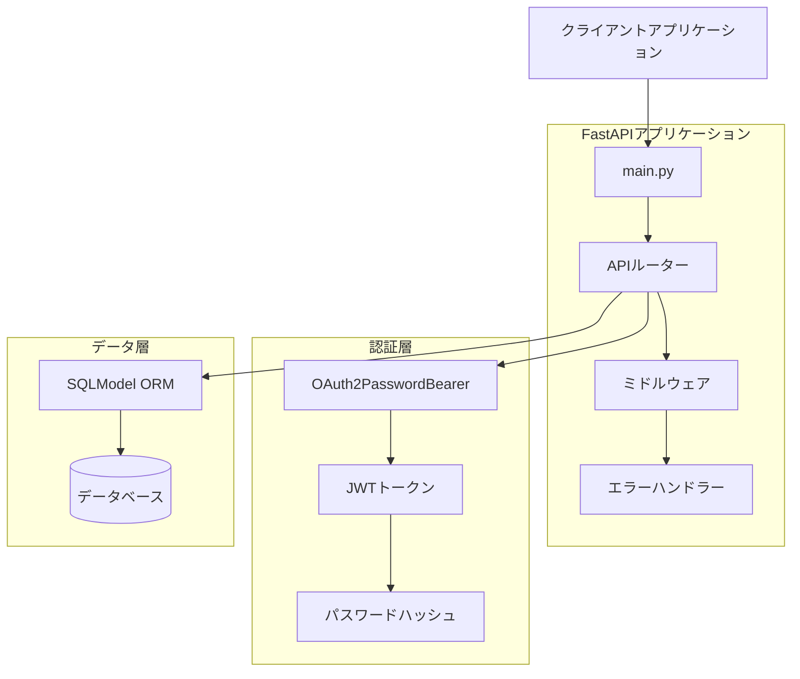
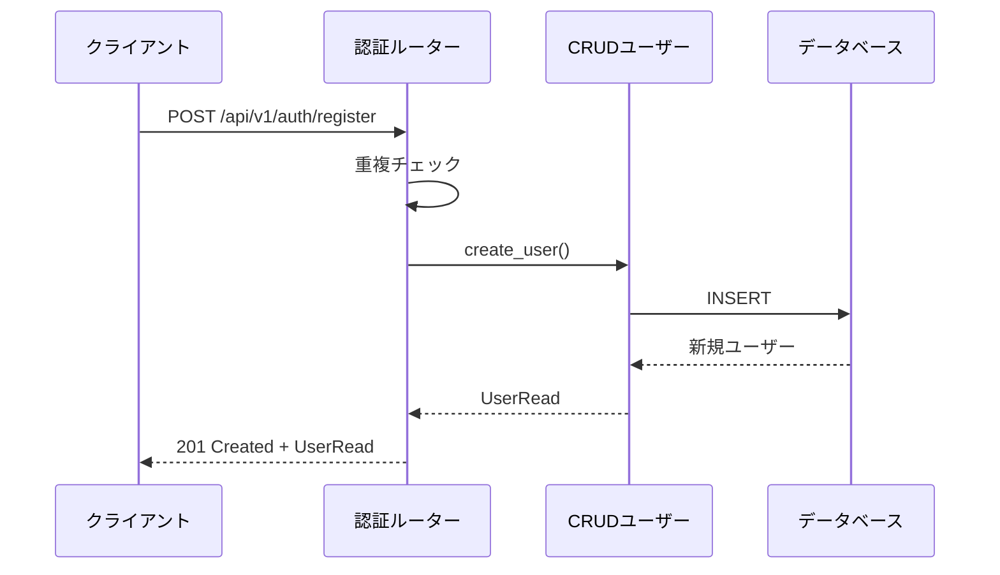
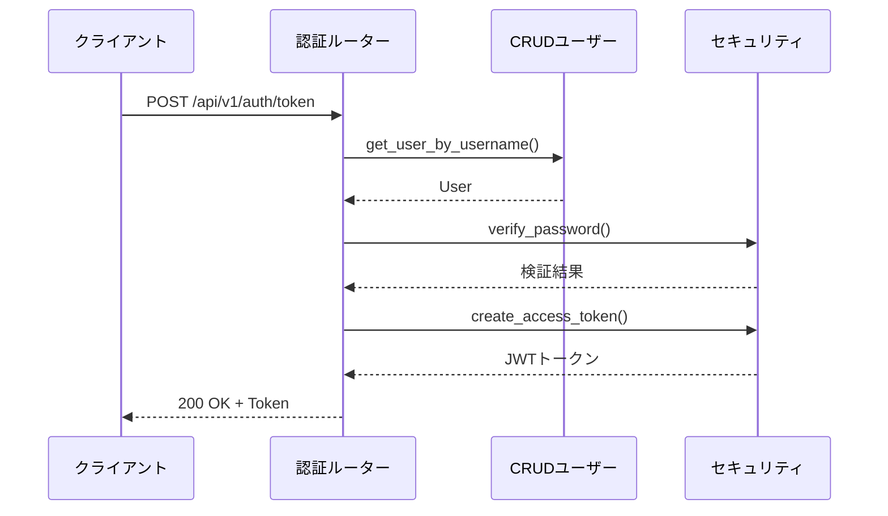
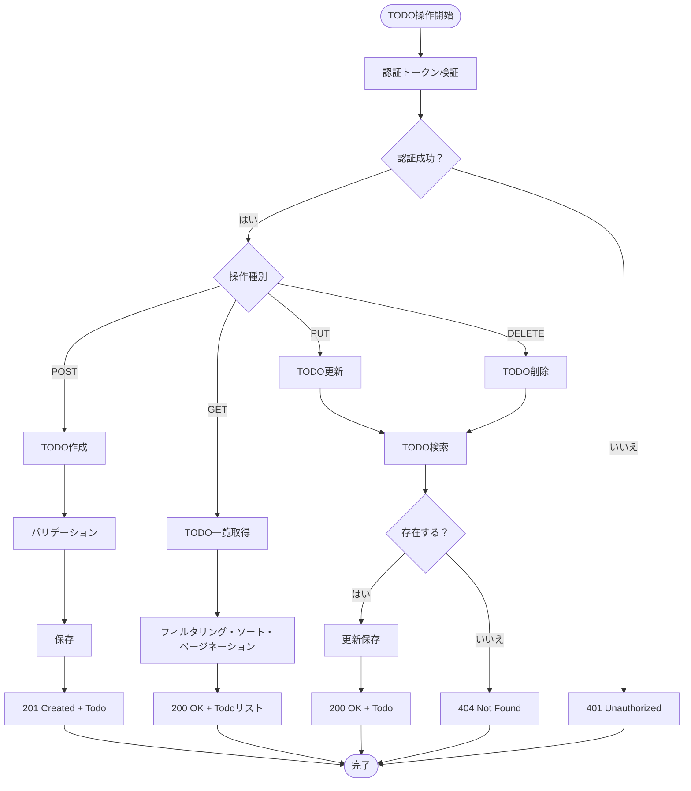
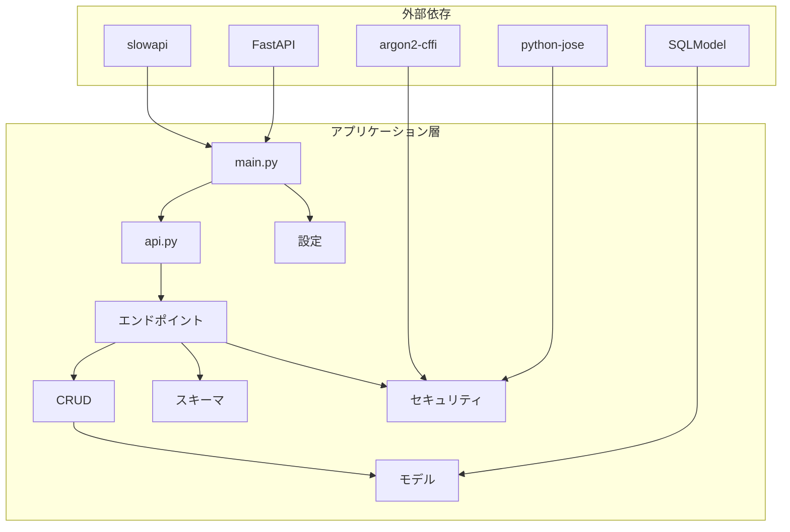
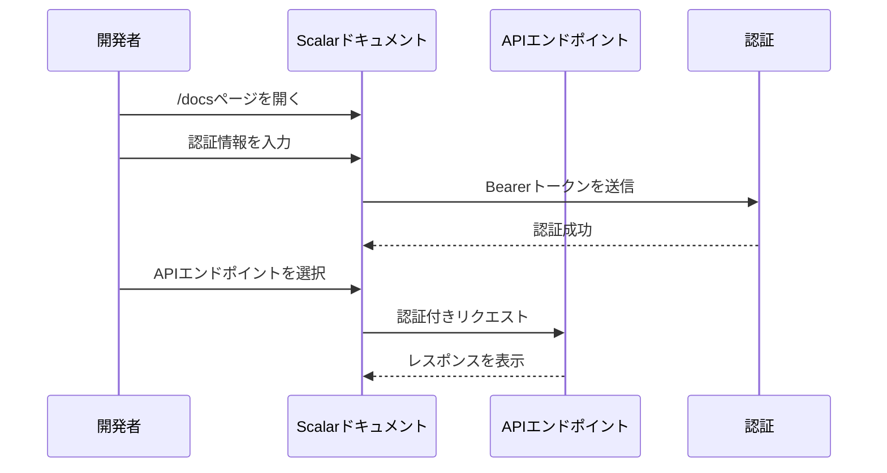
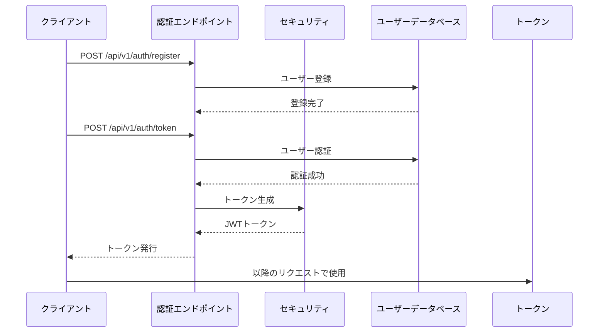

# APIリファレンス

<cite>
**この文書で参照されるファイル**
- [backend/app/main.py](file://backend/app/main.py)
- [backend/app/api/api_v1/api.py](file://backend/app/api/api_v1/api.py)
- [backend/app/api/api_v1/endpoints/auth.py](file://backend/app/api/api_v1/endpoints/auth.py)
- [backend/app/api/api_v1/endpoints/users.py](file://backend/app/api/api_v1/endpoints/users.py)
- [backend/app/api/api_v1/endpoints/todos.py](file://backend/app/api/api_v1/endpoints/todos.py)
- [backend/app/api/deps.py](file://backend/app/api/deps.py)
- [backend/app/core/config.py](file://backend/app/core/config.py)
- [backend/app/core/security.py](file://backend/app/core/security.py)
- [backend/app/models/user.py](file://backend/app/models/user.py)
- [backend/app/models/todo.py](file://backend/app/models/todo.py)
- [backend/app/schemas/user.py](file://backend/app/schemas/user.py)
- [backend/app/schemas/todo.py](file://backend/app/schemas/todo.py)
- [backend/app/schemas/token.py](file://backend/app/schemas/token.py)
- [backend/app/schemas/error.py](file://backend/app/schemas/error.py)
- [backend/app/crud/crud_user.py](file://backend/app/crud/crud_user.py)
- [backend/app/crud/crud_todo.py](file://backend/app/crud/crud_todo.py)
- [backend/app/middleware/error_handler.py](file://backend/app/middleware/error_handler.py)
- [backend/pyproject.toml](file://backend/pyproject.toml)
</cite>

## 目次
1. [はじめに](#はじめに)
2. [プロジェクト構造](#プロジェクト構造)
3. [コアコンポーネント](#コアコンポーネント)
4. [アーキテクチャ概観](#アーキテクチャ概観)
5. [詳細なコンポーネント分析](#詳細なコンポーネント分析)
6. [依存関係分析](#依存関係分析)
7. [パフォーマンス考慮事項](#パフォーマンス考慮事項)
8. [トラブルシューティングガイド](#トラブルシューティングガイド)
9. [結論](#結論)
10. [付録](#付録)

## はじめに
本APIリファレンスは、Todo管理システムのRESTful APIエンドポイントの詳細仕様を提供します。認証エンドポイント（/api/v1/auth/register、/api/v1/auth/token）、TODO管理エンドポイント（GET/POST/PUT/DELETE /api/v1/todos/）、ユーザー情報エンドポイント（/api/v1/users/me）について、HTTPメソッド、URLパターン、リクエスト/レスポンススキーマ、認証要件、エラーレスポンスを網羅的に記述します。また、APIドキュメント（Scalar、OpenAPI JSON）の利用方法についても説明します。

## プロジェクト構造
バックエンドアプリケーションはFastAPIフレームワークを使用し、以下の構造で構成されています：

**図の出典**
- [backend/app/api/api_v1/api.py:1-8](file://backend/app/api/api_v1/api.py#L1-L8)
- [backend/app/main.py:124](file://backend/app/main.py#L124)

**節の出典**
- [backend/app/api/api_v1/api.py:1-8](file://backend/app/api/api_v1/api.py#L1-L8)
- [backend/app/main.py:124](file://backend/app/main.py#L124)

## コアコンポーネント
本システムのコアコンポーネントは以下の通りです：

- **APIルーター**: `/api/v1`プレフィックスを持つ3つのサブルーター（auth、users、todos）
- **セキュリティ層**: JWTベースの認証、パスワードハッシュ化、トークン生成
- **CRUD層**: ユーザーとTODOのデータアクセスロジック
- **データモデル**: SQLModelを使用したORMモデル
- **エラーハンドリング**: 統一エラーレスポンススキーマ

**節の出典**
- [backend/app/api/api_v1/api.py:1-8](file://backend/app/api/api_v1/api.py#L1-L8)
- [backend/app/core/security.py:1-35](file://backend/app/core/security.py#L1-L35)
- [backend/app/crud/crud_user.py:1-22](file://backend/app/crud/crud_user.py#L1-L22)
- [backend/app/crud/crud_todo.py:1-119](file://backend/app/crud/crud_todo.py#L1-L119)

## アーキテクチャ概観
全体のアーキテクチャは以下のようになります：

**図の出典**
- [backend/app/main.py:49-102](file://backend/app/main.py#L49-L102)
- [backend/app/api/deps.py:10](file://backend/app/api/deps.py#L10)
- [backend/app/core/security.py:17-34](file://backend/app/core/security.py#L17-L34)

## 詳細なコンポーネント分析

### 認証エンドポイント

#### ユーザー登録エンドポイント
- **URL**: `/api/v1/auth/register`
- **メソッド**: POST
- **認証不要**: はい
- **リクエストボディ**: UserCreateスキーマ
  - username: 文字列（最大50文字、一意）
  - password: 文字列（ハッシュ化済み）
- **レスポンス**: UserReadスキーマ
  - id: UUID
  - username: 文字列
- **ステータスコード**:
  - 201: 登録成功
  - 400: 既存ユーザーまたはバリデーションエラー

**図の出典**
- [backend/app/api/api_v1/endpoints/auth.py:17-32](file://backend/app/api/api_v1/endpoints/auth.py#L17-L32)
- [backend/app/crud/crud_user.py:12-21](file://backend/app/crud/crud_user.py#L12-L21)

#### トークン取得エンドポイント
- **URL**: `/api/v1/auth/token`
- **メソッド**: POST
- **認証不要**: はい
- **リクエスト**: OAuth2PasswordRequestForm
  - username: 文字列
  - password: 文字列
- **レスポンス**: Tokenスキーマ
  - access_token: 文字列（JWT）
  - token_type: 文字列（bearer）
- **ステータスコード**:
  - 200: トークン発行成功
  - 401: 認証失敗

**図の出典**
- [backend/app/api/api_v1/endpoints/auth.py:34-52](file://backend/app/api/api_v1/endpoints/auth.py#L34-L52)
- [backend/app/core/security.py:17-27](file://backend/app/core/security.py#L17-L27)

**節の出典**
- [backend/app/api/api_v1/endpoints/auth.py:17-52](file://backend/app/api/api_v1/endpoints/auth.py#L17-L52)
- [backend/app/schemas/user.py:7-12](file://backend/app/schemas/user.py#L7-L12)
- [backend/app/schemas/token.py:4-6](file://backend/app/schemas/token.py#L4-L6)

### TODO管理エンドポイント

#### TODO一覧取得
- **URL**: `/api/v1/todos/`
- **メソッド**: GET
- **認証**: 必須（Bearerトークン）
- **クエリパラメータ**:
  - skip: 整数（デフォルト0、0以上）
  - limit: 整数（デフォルト100、1-100範囲）
  - search: 文字列（検索キーワード）
  - is_completed: 真偽値（完了状態フィルター）
  - priority: 文字列（high/medium/low）
  - tags: 文字列（カンマ区切りタグ）
  - sort_by: 文字列（created_at/priority/due_date、デフォルトcreated_at）
  - sort_order: 文字列（asc/desc、デフォルトdesc）
- **レスポンス**: TodoReadスキーマの配列
- **ステータスコード**: 200

#### TODO作成
- **URL**: `/api/v1/todos/`
- **メソッド**: POST
- **認証**: 必須（Bearerトークン）
- **リクエストボディ**: TodoCreateスキーマ
  - title: 文字列（必須、最大255文字）
  - is_completed: 真偽値（デフォルトfalse）
  - priority: 文字列（high/medium/low、デフォルトlow）
  - due_date: 日時（任意）
  - tags: 文字列（最大500文字、任意）
- **レスポンス**: TodoReadスキーマ
- **ステータスコード**: 201

#### TODO更新
- **URL**: `/api/v1/todos/{id}`
- **メソッド**: PUT
- **認証**: 必須（Bearerトークン）
- **パスパラメータ**: id: UUID
- **リクエストボディ**: TodoUpdateスキーマ（任意フィールド）
- **レスポンス**: TodoReadスキーマ
- **ステータスコード**:
  - 200: 更新成功
  - 404: TODO未検出

#### TODO削除
- **URL**: `/api/v1/todos/{id}`
- **メソッド**: DELETE
- **認証**: 必須（Bearerトークン）
- **パスパラメータ**: id: UUID
- **レスポンス**: 成功メッセージ（JSON）
- **ステータスコード**: 200

**図の出典**
- [backend/app/api/api_v1/endpoints/todos.py:13-79](file://backend/app/api/api_v1/endpoints/todos.py#L13-L79)
- [backend/app/crud/crud_todo.py:9-119](file://backend/app/crud/crud_todo.py#L9-L119)

**節の出典**
- [backend/app/api/api_v1/endpoints/todos.py:13-79](file://backend/app/api/api_v1/endpoints/todos.py#L13-L79)
- [backend/app/schemas/todo.py:13-33](file://backend/app/schemas/todo.py#L13-L33)

### ユーザー情報エンドポイント

#### 現在のユーザー情報取得
- **URL**: `/api/v1/users/me`
- **メソッド**: GET
- **認証**: 必須（Bearerトークン）
- **レスポンス**: UserReadスキーマ
  - id: UUID
  - username: 文字列
- **ステータスコード**: 200

**節の出典**
- [backend/app/api/api_v1/endpoints/users.py:9-13](file://backend/app/api/api_v1/endpoints/users.py#L9-L13)
- [backend/app/schemas/user.py:10-12](file://backend/app/schemas/user.py#L10-L12)

## 依存関係分析

**図の出典**
- [backend/pyproject.toml:7-22](file://backend/pyproject.toml#L7-L22)
- [backend/app/main.py:11-124](file://backend/app/main.py#L11-L124)

**節の出典**
- [backend/pyproject.toml:1-47](file://backend/pyproject.toml#L1-L47)

## パフォーマンス考慮事項
- **データベース接続**: 非同期SQLAlchemyを使用し、接続プールを活用
- **クエリ最適化**: 各テーブルに適切なインデックスを設定
- **認証**: JWTトークンによる状態なし認証
- **レート制限**: slowapiを使用したリクエスト制限
- **CORS**: 開発環境向けの柔軟なオリジン許可

## トラブルシューティングガイド

### 共通エラーレスポンススキーマ
すべてのエラーは以下の統一スキーマで返されます：
- status_code: 数値（HTTPステータスコード）
- detail: 文字列（技術的なエラー詳細）
- message: 文字列（ユーザーへの表示メッセージ）
- error_code: 文字列（エラーコード）
- details: 配列（バリデーションエラー詳細）

### 一般的なエラー状況
- **400 Bad Request**: 不正なリクエストパラメータ
- **401 Unauthorized**: 認証失敗または無効なトークン
- **403 Forbidden**: 権限がない操作
- **404 Not Found**: 存在しないリソース
- **422 Unprocessable Entity**: バリデーションエラー
- **429 Too Many Requests**: レート制限超過
- **500 Internal Server Error**: サーバー内部エラー

### APIドキュメントの利用方法

#### OpenAPI JSONの取得
- **URL**: `/api/v1/openapi.json`
- **用途**: API仕様の機械可読形式
- **使用例**: Swagger UIやPostmanでのインポート

#### Scalar API Referenceの利用
- **URL**: `/docs`
- **特徴**: インタラクティブなAPIドキュメント
- **認証**: Bearerトークンを使用してエンドポイントをテスト
- **使い方**:
  1. Scalarドキュメントページを開く
  2. 画面右上の「Authorize」ボタンをクリック
  3. `Bearer <JWTトークン>`を入力
  4. 各エンドポイントをテスト実行

**図の出典**
- [backend/app/main.py:116-122](file://backend/app/main.py#L116-L122)

**節の出典**
- [backend/app/middleware/error_handler.py:15-149](file://backend/app/middleware/error_handler.py#L15-L149)
- [backend/app/main.py:116-122](file://backend/app/main.py#L116-L122)

## 結論
本APIリファレンスは、Todo管理システムのRESTful APIの完全な仕様を提供しました。認証、TODO管理、ユーザー情報の各エンドポイントについて、HTTPメソッド、URLパターン、スキーマ定義、認証要件、エラーレスポンスを網羅的に記述しました。また、ScalarとOpenAPI JSONの利用方法も説明しました。これらの仕様に従ってクライアントアプリケーションを開発することで、システムとの統合がスムーズに行えるでしょう。

## 付録

### 認証フローの詳細

**図の出典**
- [backend/app/api/api_v1/endpoints/auth.py:17-52](file://backend/app/api/api_v1/endpoints/auth.py#L17-L52)
- [backend/app/core/security.py:17-27](file://backend/app/core/security.py#L17-L27)