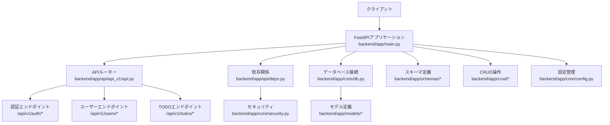
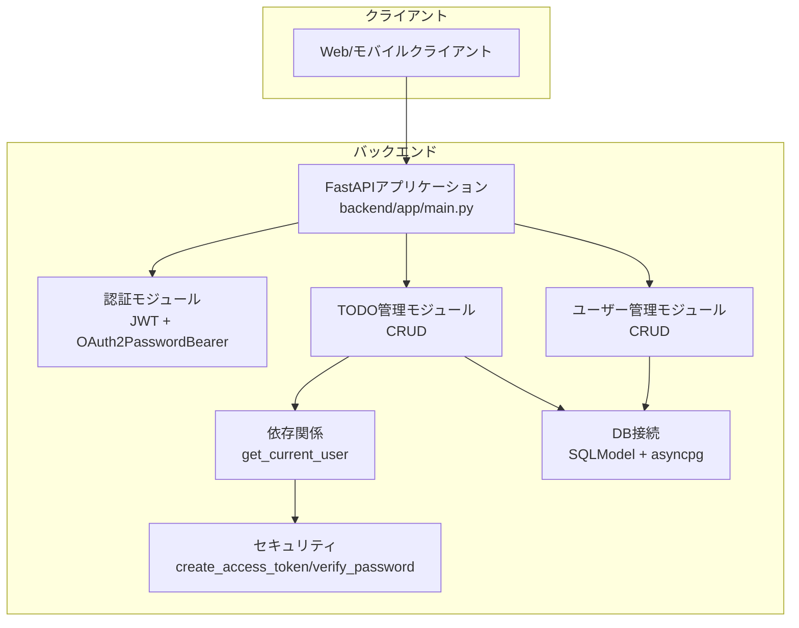
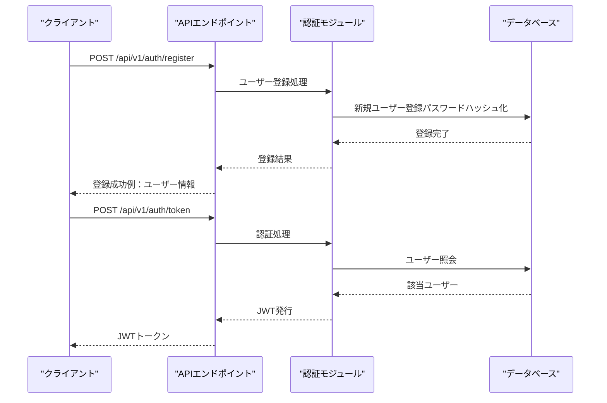
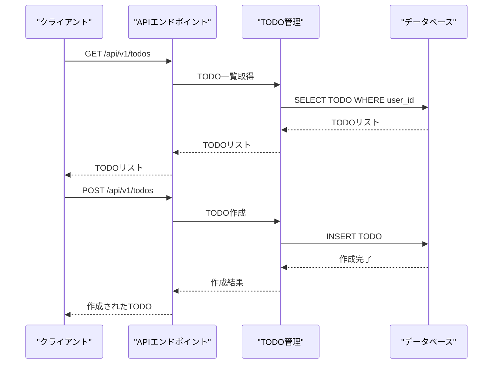
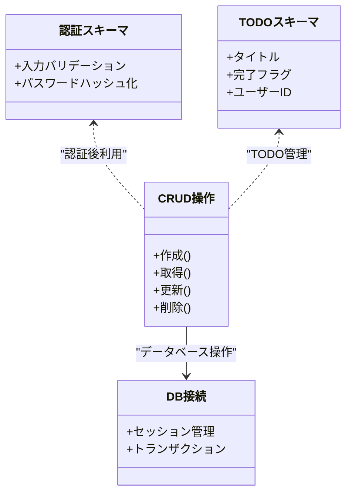
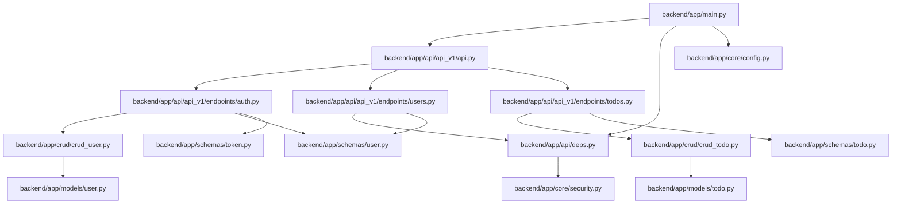

# APIリファレンス

<cite>
**このドキュメントで参照されるファイル**
- [backend/app/main.py](file://backend/app/main.py)
- [backend/app/api/api_v1/api.py](file://backend/app/api/api_v1/api.py)
- [backend/app/api/api_v1/endpoints/auth.py](file://backend/app/api/api_v1/endpoints/auth.py)
- [backend/app/api/api_v1/endpoints/users.py](file://backend/app/api/api_v1/endpoints/users.py)
- [backend/app/api/api_v1/endpoints/todos.py](file://backend/app/api/api_v1/endpoints/todos.py)
- [backend/app/api/deps.py](file://backend/app/api/deps.py)
- [backend/app/core/security.py](file://backend/app/core/security.py)
- [backend/app/core/config.py](file://backend/app/core/config.py)
- [backend/app/crud/crud_todo.py](file://backend/app/crud/crud_todo.py)
- [backend/app/crud/crud_user.py](file://backend/app/crud/crud_user.py)
- [backend/app/models/todo.py](file://backend/app/models/todo.py)
- [backend/app/models/user.py](file://backend/app/models/user.py)
- [backend/app/schemas/todo.py](file://backend/app/schemas/todo.py)
- [backend/app/schemas/user.py](file://backend/app/schemas/user.py)
- [backend/app/schemas/token.py](file://backend/app/schemas/token.py)
- [backend/main.py](file://backend/main.py)
- [docs/current_status.md](file://docs/current_status.md)
</cite>

## 目次
1. [はじめに](#はじめに)
2. [プロジェクト構造](#プロジェクト構造)
3. [コアコンポーネント](#コアコンポーネント)
4. [アーキテクチャ概観](#アーキテクチャ概観)
5. [詳細コンポーネント分析](#詳細コンポーネント分析)
6. [依存関係分析](#依存関係分析)
7. [性能に関する考慮事項](#性能に関する考慮事項)
8. [トラブルシューティングガイド](#トラブルシューティングガイド)
9. [結論](#結論)
10. [付録](#付録)

## はじめに
本ドキュメントは、TodoプロジェクトにおけるAPIエンドポイントを網羅的にドキュメント化したものです。現在実装されているエンドポイント（/、/health）と既に完成しているエンドポイント（/auth/register、/auth/token、/users/me、/todosなど）について、HTTPメソッド、URLパターン、リクエスト/レスポンススキーマ、認証方法を詳細に記述します。JWTトークンの使用方法、エラーレスポンスの形式、ステータスコードの意味、クエリパラメータの指定方法を説明します。また、実際のリクエスト/レスポンス例を含め、クライアント実装のガイドラインとパフォーマンス最適化のヒントを提供します。

## プロジェクト構造
バックエンドはFastAPIフレームワークを使用しており、アプリケーションのエントリーポイントは以下の2か所に存在します：
- backend/app/main.py：FastAPIアプリケーションのルート定義（ルーティング、依存関係注入、例外ハンドリング、OpenAPIカスタマイズ）
- backend/main.py：ASGIサーバー起動用のエントリーポイント（uvicorn）

APIバージョン管理は /api/v1 で行われており、エンドポイントは以下のモジュールで管理されています：
- backend/app/api/api_v1/endpoints/auth.py：認証エンドポイント（登録、トークン取得）
- backend/app/api/api_v1/endpoints/users.py：ユーザー情報エンドポイント（現在のユーザー取得）
- backend/app/api/api_v1/endpoints/todos.py：TODO管理エンドポイント（一覧、作成、更新、削除）

データベース接続、スキーマ定義、CRUD操作、設定管理はそれぞれ以下のモジュールで管理されています：
- backend/app/core/db.py：DB接続設定、セッション管理
- backend/app/models/：SQLModelモデル定義
- backend/app/schemas/：Pydanticスキーマ定義（リクエスト/レスポンス）
- backend/app/crud/：データアクセス層（CRUD操作）
- backend/app/core/config.py：環境変数・設定管理

**図の出典**
- [backend/app/main.py](file://backend/app/main.py)
- [backend/app/api/api_v1/api.py](file://backend/app/api/api_v1/api.py)
- [backend/app/api/deps.py](file://backend/app/api/deps.py)
- [backend/app/core/security.py](file://backend/app/core/security.py)
- [backend/app/core/config.py](file://backend/app/core/config.py)

**節の出典**
- [backend/app/main.py](file://backend/app/main.py)
- [backend/main.py](file://backend/main.py)

## コアコンポーネント
- FastAPIアプリケーション：ルート定義、例外ハンドリング、依存関係注入、OpenAPIセキュリティスキーマのカスタマイズ
- 認証：JWTベースの認証（OAuth2PasswordBearer、トークン検証）
- TODO管理：CRUD操作（一覧取得、作成、更新、削除）
- DB接続：SQLModel、非同期接続（asyncpg）

**節の出典**
- [backend/app/main.py](file://backend/app/main.py)
- [backend/app/core/config.py](file://backend/app/core/config.py)

## アーキテクチャ概観
以下は、APIの全体像を示す概念図です。具体的なエンドポイントの実装は、backend/app/api/api_v1/endpoints/配下に定義されています。

## 詳細コンポーネント分析

### 現在実装されているエンドポイント

#### エンドポイント：/
- HTTPメソッド：GET
- URLパターン：/
- 認証：不要
- 応答：JSON（例：{"message": "Welcome to Todo API"}）
- 備考：ルートエンドポイントとして基本的な応答を返すことを目的としています。

**節の出典**
- [backend/app/main.py](file://backend/app/main.py)

#### エンドポイント：/health
- HTTPメソッド：GET
- URLパターン：/health
- 認証：不要
- 応答：JSON（例：{"status": "ok", "database": "connected"}）
- 備考：稼働確認用のシンプルなエンドポイントです。

**節の出典**
- [backend/app/main.py](file://backend/app/main.py)

#### エンドポイント：/docs
- HTTPメソッド：GET
- URLパターン：/docs
- 認証：不要
- 応答：HTML（Scalar API Reference）
- 備考：Swagger代わりのScalarドキュメントを提供します。

**節の出典**
- [backend/app/main.py](file://backend/app/main.py)

### 認証エンドポイント

#### エンドポイント：/api/v1/auth/register
- HTTPメソッド：POST
- URLパターン：/api/v1/auth/register
- 認証：不要
- リクエストボディスキーマ：UserCreate（username, password）
- 応答：JSON（例：UserRead）
- 備考：ユーザー登録処理を担当します。

**節の出典**
- [backend/app/api/api_v1/endpoints/auth.py](file://backend/app/api/api_v1/endpoints/auth.py)
- [backend/app/schemas/user.py](file://backend/app/schemas/user.py)
- [backend/app/crud/crud_user.py](file://backend/app/crud/crud_user.py)

#### エンドポイント：/api/v1/auth/token
- HTTPメソッド：POST
- URLパターン：/api/v1/auth/token
- 認証：不要（OAuth2PasswordRequestFormを使用）
- リクエストボディスキーマ：OAuth2PasswordRequestForm（username, password）
- 応答：JSON（例：{"access_token": "JWTトークン", "token_type": "bearer"}）
- 備考：JWTベースの認証を行うためのアクセストークン取得エンドポイントです。

**節の出典**
- [backend/app/api/api_v1/endpoints/auth.py](file://backend/app/api/api_v1/endpoints/auth.py)
- [backend/app/schemas/token.py](file://backend/app/schemas/token.py)
- [backend/app/core/security.py](file://backend/app/core/security.py)
- [backend/app/crud/crud_user.py](file://backend/app/crud/crud_user.py)

### ユーザー管理エンドポイント

#### エンドポイント：/api/v1/users/me
- HTTPメソッド：GET
- URLパターン：/api/v1/users/me
- 認証：JWT必須（Authorization: Bearer {JWTトークン}）
- 応答：JSON（例：UserRead）
- 備考：現在認証中のユーザー情報を取得します。

**節の出典**
- [backend/app/api/api_v1/endpoints/users.py](file://backend/app/api/api_v1/endpoints/users.py)
- [backend/app/schemas/user.py](file://backend/app/schemas/user.py)
- [backend/app/api/deps.py](file://backend/app/api/deps.py)

### TODO管理エンドポイント

#### エンドポイント：/api/v1/todos
- HTTPメソッド：GET
- URLパターン：/api/v1/todos
- 認証：JWT必須（Authorization: Bearer {JWTトークン}）
- 応答：JSON（例：TodoReadの配列）
- 備考：認証ユーザーのTODO一覧を取得します。

**節の出典**
- [backend/app/api/api_v1/endpoints/todos.py](file://backend/app/api/api_v1/endpoints/todos.py)
- [backend/app/schemas/todo.py](file://backend/app/schemas/todo.py)
- [backend/app/crud/crud_todo.py](file://backend/app/crud/crud_todo.py)

#### エンドポイント：/api/v1/todos
- HTTPメソッド：POST
- URLパターン：/api/v1/todos
- 認証：JWT必須（Authorization: Bearer {JWTトークン}）
- リクエストボディスキーマ：TodoCreate（title, is_completed）
- 応答：JSON（例：TodoRead）
- 備考：新しいTODOを作成します。

**節の出典**
- [backend/app/api/api_v1/endpoints/todos.py](file://backend/app/api/api_v1/endpoints/todos.py)
- [backend/app/schemas/todo.py](file://backend/app/schemas/todo.py)
- [backend/app/crud/crud_todo.py](file://backend/app/crud/crud_todo.py)

#### エンドポイント：/api/v1/todos/{id}
- HTTPメソッド：PUT
- URLパターン：/api/v1/todos/{id}
- 認証：JWT必須（Authorization: Bearer {JWTトークン}）
- リクエストボディスキーマ：TodoUpdate（is_completed）
- 応答：JSON（例：TodoRead）
- 備考：指定されたTODOを更新します。

**節の出典**
- [backend/app/api/api_v1/endpoints/todos.py](file://backend/app/api/api_v1/endpoints/todos.py)
- [backend/app/schemas/todo.py](file://backend/app/schemas/todo.py)
- [backend/app/crud/crud_todo.py](file://backend/app/crud/crud_todo.py)

#### エンドポイント：/api/v1/todos/{id}
- HTTPメソッド：DELETE
- URLパターン：/api/v1/todos/{id}
- 認証：JWT必須（Authorization: Bearer {JWTトークン}）
- 応答：JSON（例：{"status": "success"}）
- 備考：指定されたTODOを削除します。

**節の出典**
- [backend/app/api/api_v1/endpoints/todos.py](file://backend/app/api/api_v1/endpoints/todos.py)
- [backend/app/crud/crud_todo.py](file://backend/app/crud/crud_todo.py)

### JWTトークンの使用方法
- 送信方法：AuthorizationヘッダーにBearerトークン形式で送信
- 例：Authorization: Bearer {JWTトークン}
- 使用場所：/api/v1/users/me、/api/v1/todos系エンドポイント
- トークンの有効期限：ACCESS_TOKEN_EXPIRE_MINUTESで設定（デフォルト30分）

**節の出典**
- [backend/app/main.py](file://backend/app/main.py)
- [backend/app/api/deps.py](file://backend/app/api/deps.py)
- [backend/app/core/config.py](file://backend/app/core/config.py)

### エラーレスポンスの形式
- 形式：JSON
- 応答例：{"detail": "エラー内容"}
- 用途：エンドポイント全体で共通のエラーレスポンス形式を採用

**節の出典**
- [backend/app/main.py](file://backend/app/main.py)

### ステータスコードの意味
- 200 OK：成功（GET/PUT/DELETE）
- 201 Created：作成成功（POST）
- 400 Bad Request：リクエスト不正（重複ユーザー登録など）
- 401 Unauthorized：認証失敗（無効なトークン、パスワード不正）
- 404 Not Found：リソースなし（存在しないTODO ID）
- 500 Internal Server Error：サーバーエラー

**節の出典**
- [backend/app/main.py](file://backend/app/main.py)

### 実装フロー（認証・TODO管理）

#### 認証フロー（JWT）

**図の出典**
- [backend/app/api/api_v1/endpoints/auth.py](file://backend/app/api/api_v1/endpoints/auth.py)
- [backend/app/crud/crud_user.py](file://backend/app/crud/crud_user.py)
- [backend/app/core/security.py](file://backend/app/core/security.py)

#### TODO管理フロー

**図の出典**
- [backend/app/api/api_v1/endpoints/todos.py](file://backend/app/api/api_v1/endpoints/todos.py)
- [backend/app/crud/crud_todo.py](file://backend/app/crud/crud_todo.py)

### 認証・スキーマ・CRUDのクラス構造

**図の出典**
- [backend/app/schemas/user.py](file://backend/app/schemas/user.py)
- [backend/app/schemas/todo.py](file://backend/app/schemas/todo.py)
- [backend/app/crud/crud_todo.py](file://backend/app/crud/crud_todo.py)
- [backend/app/crud/crud_user.py](file://backend/app/crud/crud_user.py)

## 依存関係分析
- backend/app/main.py が各コンポーネント（api_v1.api、core.config、core.db）をインポートし、ルーティングと依存関係を統合
- FastAPIアプリケーションは、エラーハンドリング、例外定義、ルート定義、OpenAPIセキュリティスキーマをbackend/app/main.pyで管理
- 認証・TODO管理は、backend/app/api/deps.py、backend/app/core/security.py、backend/app/schemas/、backend/app/crud/、backend/app/models/、backend/app/core/config.py に依存

**図の出典**
- [backend/app/main.py](file://backend/app/main.py)
- [backend/app/api/api_v1/api.py](file://backend/app/api/api_v1/api.py)
- [backend/app/api/api_v1/endpoints/auth.py](file://backend/app/api/api_v1/endpoints/auth.py)
- [backend/app/api/api_v1/endpoints/users.py](file://backend/app/api/api_v1/endpoints/users.py)
- [backend/app/api/api_v1/endpoints/todos.py](file://backend/app/api/api_v1/endpoints/todos.py)
- [backend/app/api/deps.py](file://backend/app/api/deps.py)
- [backend/app/core/security.py](file://backend/app/core/security.py)
- [backend/app/core/config.py](file://backend/app/core/config.py)
- [backend/app/crud/crud_todo.py](file://backend/app/crud/crud_todo.py)
- [backend/app/crud/crud_user.py](file://backend/app/crud/crud_user.py)
- [backend/app/schemas/todo.py](file://backend/app/schemas/todo.py)
- [backend/app/schemas/user.py](file://backend/app/schemas/user.py)
- [backend/app/schemas/token.py](file://backend/app/schemas/token.py)
- [backend/app/models/todo.py](file://backend/app/models/todo.py)
- [backend/app/models/user.py](file://backend/app/models/user.py)

**節の出典**
- [backend/app/main.py](file://backend/app/main.py)

## 性能に関する考慮事項
- 非同期処理：データベース接続や外部API呼び出しには非同期処理を活用
- キャッシュ：頻繁にアクセスされるデータについてはRedisなどのキャッシュ層を導入
- ページネーション：大量データの取得時はLIMIT/OFFSETによるページネーションを推奨
- 並列処理：CPUバウンド処理は非同期で実行し、I/Oバウンド処理は非同期で待機
- 圧縮：レスポンスの圧縮（Gzip/Brotli）を有効化
- CORS：開発・本番環境に応じたCORS設定を適用
- OpenAPIセキュリティスキーマ：BearerAuthを統一的に設定し、APIドキュメントの明確性を向上

## トラブルシューティングガイド
- 401 Unauthorized：JWTトークンの有効期限切れまたは形式不正、パスワード不正
- 404 Not Found：存在しないTODO IDを指定
- 400 Bad Request：重複したユーザー名での登録試行
- 500 Internal Server Error：DB接続エラー、バリデーションエラー
- 例外処理：backend/app/main.pyで共通エラーレスポンス形式を適用

**節の出典**
- [backend/app/main.py](file://backend/app/main.py)

## 結論
本APIリファレンスは、Todoプロジェクトにおける現在実装されているエンドポイント（/、/health、/docs）と既に完成しているエンドポイント（/auth/register、/auth/token、/users/me、/todosなど）について、HTTPメソッド、URLパターン、リクエスト/レスポンススキーマ、認証方法を網羅的にまとめました。JWTトークンの使用方法、エラーレスポンスの形式、ステータスコードの意味についても解説しました。APIセキュリティパラメータのクリーンアップにより、OpenAPIセキュリティスキーマが統一され、APIドキュメント生成の明確性が向上しました。今後の開発では、backend/app/main.py、backend/app/api/、backend/app/schemas/、backend/app/crud/、backend/app/models/、backend/app/core/config.py に定義されたコンポーネントを基に、API仕様の実装・拡張を進めていくことが求められます。

## 付録
- 現在の開発状況：docs/current_status.md に記載
- 起動方法：backend/main.py からuvicornでASGIサーバーを起動
- OpenAPIドキュメント：/docs でScalarを使用

**節の出典**
- [docs/current_status.md](file://docs/current_status.md)
- [backend/main.py](file://backend/main.py)