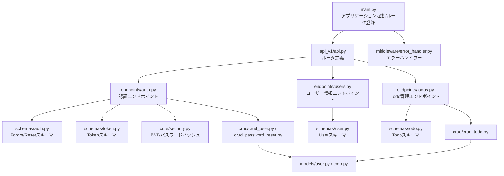
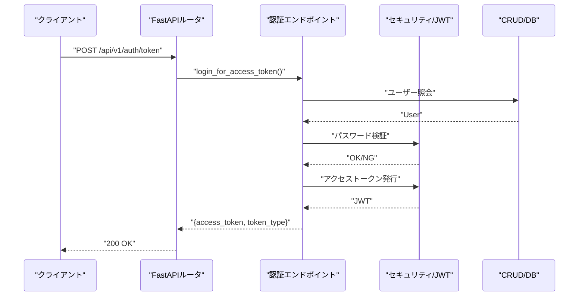
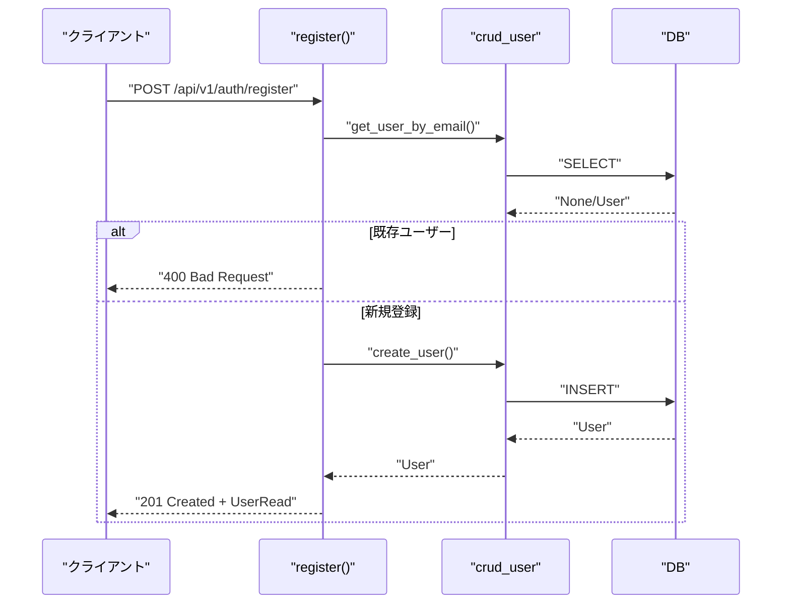
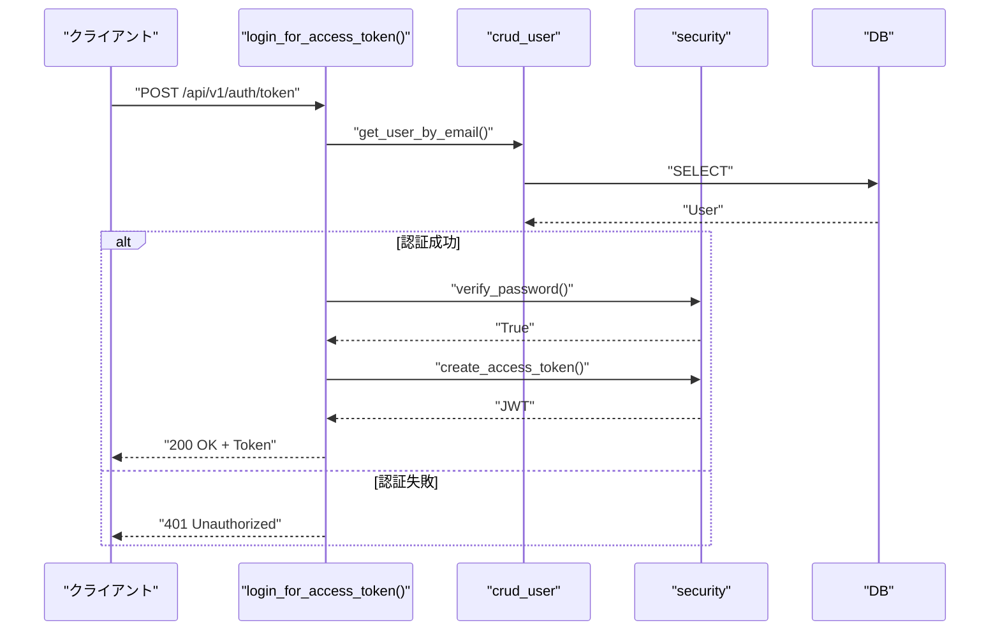
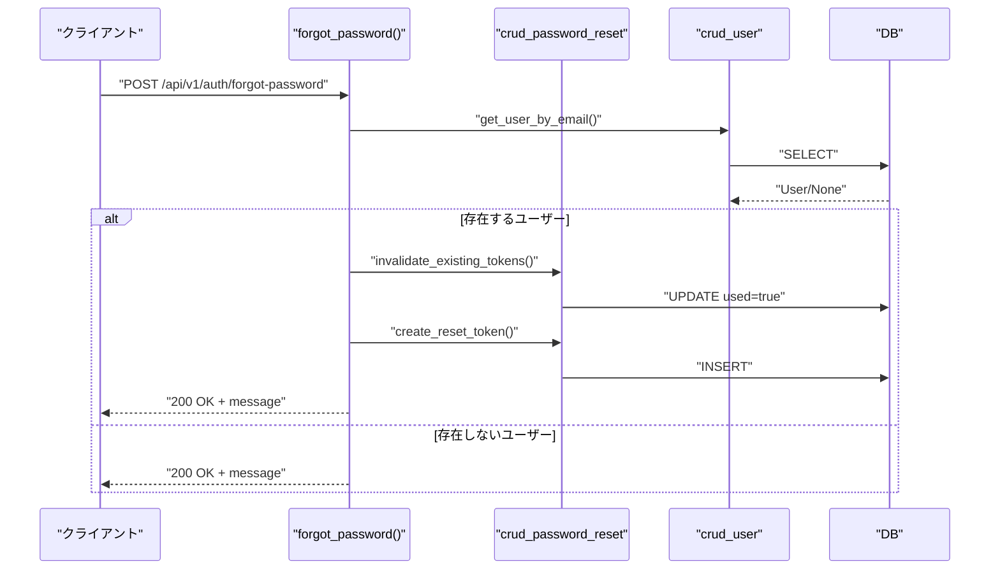
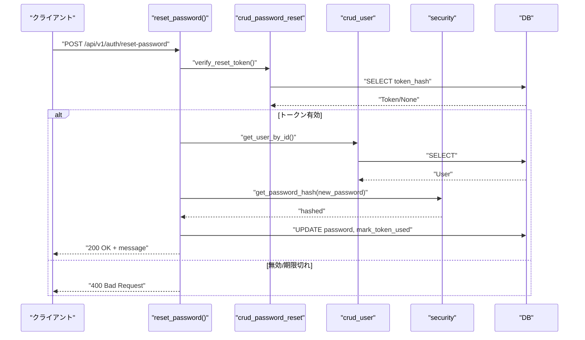
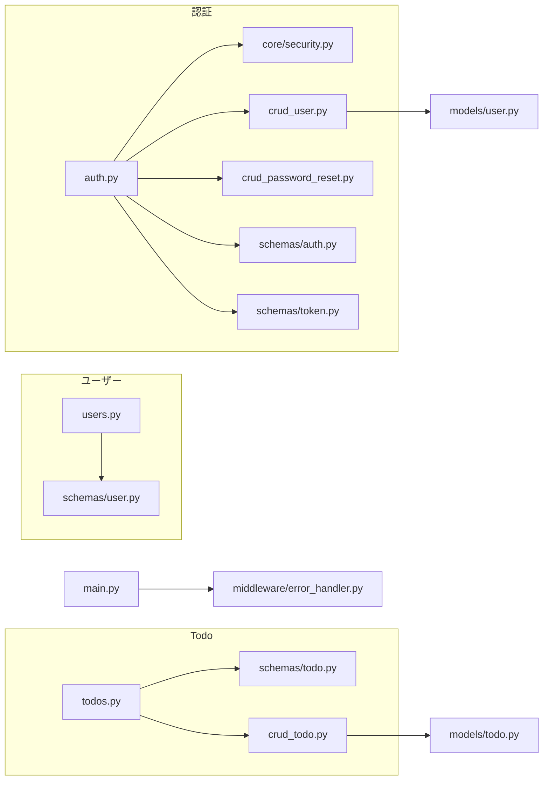
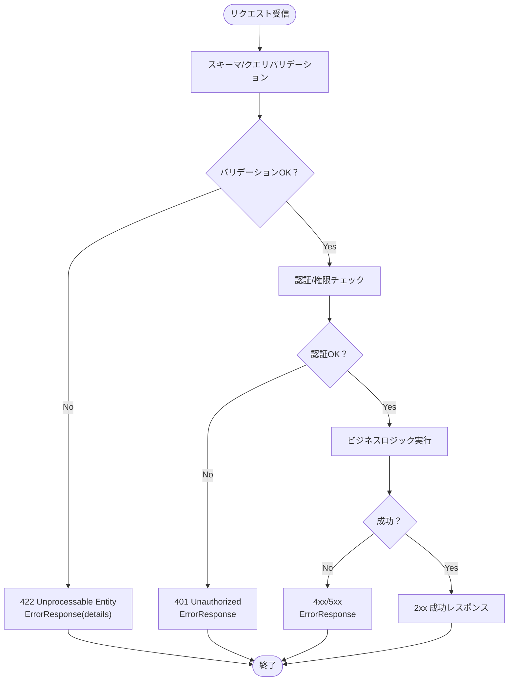

# APIリファレンス

<cite>
**この文書で参照されるファイル**
- [backend/app/main.py](file://backend/app/main.py)
- [backend/app/api/api_v1/api.py](file://backend/app/api/api_v1/api.py)
- [backend/app/api/api_v1/endpoints/auth.py](file://backend/app/api/api_v1/endpoints/auth.py)
- [backend/app/api/api_v1/endpoints/users.py](file://backend/app/api/api_v1/endpoints/users.py)
- [backend/app/api/api_v1/endpoints/todos.py](file://backend/app/api/api_v1/endpoints/todos.py)
- [backend/app/schemas/auth.py](file://backend/app/schemas/auth.py)
- [backend/app/schemas/user.py](file://backend/app/schemas/user.py)
- [backend/app/schemas/todo.py](file://backend/app/schemas/todo.py)
- [backend/app/schemas/token.py](file://backend/app/schemas/token.py)
- [backend/app/middleware/error_handler.py](file://backend/app/middleware/error_handler.py)
- [backend/app/core/security.py](file://backend/app/core/security.py)
- [backend/app/crud/crud_user.py](file://backend/app/crud/crud_user.py)
- [backend/app/crud/crud_todo.py](file://backend/app/crud/crud_todo.py)
- [backend/app/crud/crud_password_reset.py](file://backend/app/crud/crud_password_reset.py)
- [backend/app/models/user.py](file://backend/app/models/user.py)
- [backend/app/models/todo.py](file://backend/app/models/todo.py)
</cite>

## 目次
1. [はじめに](#はじめに)
2. [プロジェクト構造](#プロジェクト構造)
3. [コアコンポーネント](#コアコンポーネント)
4. [アーキテクチャ概観](#アーキテクチャ概観)
5. [詳細コンポーネント分析](#詳細コンポーネント分析)
6. [依存関係分析](#依存関係分析)
7. [パフォーマンス考慮事項](#パフォーマンス考慮事項)
8. [トラブルシューティングガイド](#トラブルシューティングガイド)
9. [結論](#結論)
10. [付録](#付録)

## はじめに
本リファレンスは、バックエンドAPI（FastAPI）におけるRESTfulエンドポイントの包括的な仕様を提供します。認証系、ユーザー系、Todo系の各エンドポイントについて、HTTPメソッド、URLパターン、リクエスト/レスポンススキーマ、認証要件、エラーコード、使用例、パラメータとバリデーションルール、エラーハンドリングの仕組みを詳細に記載しています。

## プロジェクト構造
APIはバージョンプレフィックス `/api/v1` 以下のルータに分割されており、認証、ユーザー、Todoの3つのカテゴリに分かれています。全体のエントリーポイントはアプリケーションルートで、OpenAPI仕様は `/api/v1/openapi.json` で公開され、Scalar UIは `/docs` で提供されます。

```mermaid
graph TB
A["main.py<br/>アプリケーション起動/ルータ登録"] --> B["api_v1/api.py<br/>ルータ定義"]
B --> C["endpoints/auth.py<br/>認証エンドポイント"]
B --> D["endpoints/users.py<br/>ユーザー情報エンドポイント"]
B --> E["endpoints/todos.py<br/>Todo管理エンドポイント"]
C --> F["schemas/auth.py<br/>Forgot/Resetスキーマ"]
C --> G["schemas/token.py<br/>Tokenスキーマ"]
D --> H["schemas/user.py<br/>Userスキーマ"]
E --> I["schemas/todo.py<br/>Todoスキーマ"]
A --> J["middleware/error_handler.py<br/>エラーハンドラー"]
C --> K["core/security.py<br/>JWT/パスワードハッシュ"]
C --> L["crud/crud_user.py / crud_password_reset.py"]
E --> M["crud/crud_todo.py"]
L --> N["models/user.py / todo.py"]
M --> N
```

**図の出典**
- [backend/app/main.py:128](file://backend/app/main.py#L128)
- [backend/app/api/api_v1/api.py:1-8](file://backend/app/api/api_v1/api.py#L1-L8)
- [backend/app/api/api_v1/endpoints/auth.py:1-117](file://backend/app/api/api_v1/endpoints/auth.py#L1-L117)
- [backend/app/api/api_v1/endpoints/users.py:1-14](file://backend/app/api/api_v1/endpoints/users.py#L1-L14)
- [backend/app/api/api_v1/endpoints/todos.py:1-102](file://backend/app/api/api_v1/endpoints/todos.py#L1-L102)
- [backend/app/schemas/auth.py:1-11](file://backend/app/schemas/auth.py#L1-L11)
- [backend/app/schemas/user.py:1-13](file://backend/app/schemas/user.py#L1-L13)
- [backend/app/schemas/todo.py:1-41](file://backend/app/schemas/todo.py#L1-L41)
- [backend/app/schemas/token.py:1-10](file://backend/app/schemas/token.py#L1-L10)
- [backend/app/middleware/error_handler.py:1-149](file://backend/app/middleware/error_handler.py#L1-L149)
- [backend/app/core/security.py:1-35](file://backend/app/core/security.py#L1-L35)
- [backend/app/crud/crud_user.py:1-28](file://backend/app/crud/crud_user.py#L1-L28)
- [backend/app/crud/crud_todo.py:1-152](file://backend/app/crud/crud_todo.py#L1-L152)
- [backend/app/crud/crud_password_reset.py:1-56](file://backend/app/crud/crud_password_reset.py#L1-L56)
- [backend/app/models/user.py:1-16](file://backend/app/models/user.py#L1-L16)
- [backend/app/models/todo.py:1-25](file://backend/app/models/todo.py#L1-L25)

**節の出典**
- [backend/app/main.py:128](file://backend/app/main.py#L128)
- [backend/app/api/api_v1/api.py:1-8](file://backend/app/api/api_v1/api.py#L1-L8)

## コアコンポーネント
- 認証系エンドポイント
  - POST /api/v1/auth/register：新規ユーザー登録（201 Created）
  - POST /api/v1/auth/token：アクセストークン取得（200 OK）
  - POST /api/v1/auth/forgot-password：パスワードリセットメール送信（200 OK）
  - POST /api/v1/auth/reset-password：パスワードリセット（200 OK）

- ユーザー系エンドポイント
  - GET /api/v1/users/me：現在のユーザー情報取得（200 OK）

- Todo系エンドポイント
  - GET /api/v1/todos/count：件数取得（200 OK）
  - GET /api/v1/todos：一覧取得（200 OK）
  - POST /api/v1/todos：作成（201 Created）
  - PUT /api/v1/todos/{id}：更新（200 OK、404 Not Found）
  - DELETE /api/v1/todos/{id}：削除（200 OK、404 Not Found）

認証方式
- Bearer JWT（Authorization: Bearer <token>）
- 認証不要：POST /api/v1/auth/register, POST /api/v1/auth/token, POST /api/v1/auth/forgot-password, POST /api/v1/auth/reset-password
- 認証必要：GET /api/v1/users/me, GET /api/v1/todos/*, POST /api/v1/todos, PUT /api/v1/todos/{id}, DELETE /api/v1/todos/{id}

**節の出典**
- [backend/app/api/api_v1/endpoints/auth.py:19-117](file://backend/app/api/api_v1/endpoints/auth.py#L19-L117)
- [backend/app/api/api_v1/endpoints/users.py:9-14](file://backend/app/api/api_v1/endpoints/users.py#L9-L14)
- [backend/app/api/api_v1/endpoints/todos.py:13-102](file://backend/app/api/api_v1/endpoints/todos.py#L13-L102)
- [backend/app/main.py:74-102](file://backend/app/main.py#L74-L102)

## アーキテクチャ概観
APIはFastAPIによる非同期SQLModelベースのマイクロサービスとして構成されています。エラーハンドリングは共通のJSONレスポンス形式で統一され、CORS、ロギング、レートリミットが適用されています。

```mermaid
sequenceDiagram
participant Client as "クライアント"
participant API as "FastAPIルータ"
participant Auth as "認証エンドポイント"
participant Sec as "セキュリティ/JWT"
participant DB as "CRUD/DB"
Client->>API : "POST /api/v1/auth/token"
API->>Auth : "login_for_access_token()"
Auth->>DB : "ユーザー照会"
DB-->>Auth : "User"
Auth->>Sec : "パスワード検証"
Sec-->>Auth : "OK/NG"
Auth->>Sec : "アクセストークン発行"
Sec-->>Auth : "JWT"
Auth-->>API : "{access_token, token_type}"
API-->>Client : "200 OK"
```

**図の出典**
- [backend/app/api/api_v1/endpoints/auth.py:36-54](file://backend/app/api/api_v1/endpoints/auth.py#L36-L54)
- [backend/app/core/security.py:17-27](file://backend/app/core/security.py#L17-L27)
- [backend/app/crud/crud_user.py:8-27](file://backend/app/crud/crud_user.py#L8-L27)

## 詳細コンポーネント分析

### 認証エンドポイント

#### POST /api/v1/auth/register
- 認証不要
- 説明：新規ユーザー登録
- リクエストスキーマ：UserCreate（email, password）
- 応答スキーマ：UserRead（id, email）
- 成功：201 Created
- 失敗：400 Bad Request（既存メールアドレス）

```mermaid
sequenceDiagram
participant C as "クライアント"
participant R as "register()"
participant U as "crud_user"
participant DB as "DB"
C->>R : "POST /api/v1/auth/register"
R->>U : "get_user_by_email()"
U->>DB : "SELECT"
DB-->>U : "None/User"
alt 既存ユーザー
R-->>C : "400 Bad Request"
else 新規登録
R->>U : "create_user()"
U->>DB : "INSERT"
DB-->>U : "User"
U-->>R : "User"
R-->>C : "201 Created + UserRead"
end
```

**図の出典**
- [backend/app/api/api_v1/endpoints/auth.py:19-34](file://backend/app/api/api_v1/endpoints/auth.py#L19-L34)
- [backend/app/crud/crud_user.py:18-27](file://backend/app/crud/crud_user.py#L18-L27)

**節の出典**
- [backend/app/api/api_v1/endpoints/auth.py:19-34](file://backend/app/api/api_v1/endpoints/auth.py#L19-L34)
- [backend/app/schemas/user.py:8-12](file://backend/app/schemas/user.py#L8-L12)
- [backend/app/crud/crud_user.py:18-27](file://backend/app/crud/crud_user.py#L18-L27)

#### POST /api/v1/auth/token
- 認証不要
- 説明：アクセストークン取得（OAuth2 Password認可）
- 認可：Basic認証（username: email, password）
- 応答スキーマ：Token（access_token, token_type）
- 成功：200 OK
- 失敗：401 Unauthorized（認証失敗）

```mermaid
sequenceDiagram
participant C as "クライアント"
participant T as "login_for_access_token()"
participant U as "crud_user"
participant S as "security"
participant DB as "DB"
C->>T : "POST /api/v1/auth/token"
T->>U : "get_user_by_email()"
U->>DB : "SELECT"
DB-->>U : "User"
alt 認証成功
T->>S : "verify_password()"
S-->>T : "True"
T->>S : "create_access_token()"
S-->>T : "JWT"
T-->>C : "200 OK + Token"
else 認証失敗
T-->>C : "401 Unauthorized"
end
```

**図の出典**
- [backend/app/api/api_v1/endpoints/auth.py:36-54](file://backend/app/api/api_v1/endpoints/auth.py#L36-L54)
- [backend/app/core/security.py:10-14](file://backend/app/core/security.py#L10-L14)
- [backend/app/core/security.py:17-27](file://backend/app/core/security.py#L17-L27)
- [backend/app/crud/crud_user.py:8-11](file://backend/app/crud/crud_user.py#L8-L11)

**節の出典**
- [backend/app/api/api_v1/endpoints/auth.py:36-54](file://backend/app/api/api_v1/endpoints/auth.py#L36-L54)
- [backend/app/schemas/token.py:4-6](file://backend/app/schemas/token.py#L4-L6)
- [backend/app/core/security.py:10-14](file://backend/app/core/security.py#L10-L14)

#### POST /api/v1/auth/forgot-password
- 認証不要
- 説明：パスワードリセットメール送信（ユーザーが存在しない場合でも200）
- リクエストスキーマ：ForgotPasswordRequest（email）
- 応答：200 OK（メッセージ）

```mermaid
sequenceDiagram
participant C as "クライアント"
participant FP as "forgot_password()"
participant PR as "crud_password_reset"
participant U as "crud_user"
participant DB as "DB"
C->>FP : "POST /api/v1/auth/forgot-password"
FP->>U : "get_user_by_email()"
U->>DB : "SELECT"
DB-->>U : "User/None"
alt 存在するユーザー
FP->>PR : "invalidate_existing_tokens()"
PR->>DB : "UPDATE used=true"
FP->>PR : "create_reset_token()"
PR->>DB : "INSERT"
FP-->>C : "200 OK + message"
else 存在しないユーザー
FP-->>C : "200 OK + message"
end
```

**図の出典**
- [backend/app/api/api_v1/endpoints/auth.py:57-78](file://backend/app/api/api_v1/endpoints/auth.py#L57-L78)
- [backend/app/crud/crud_password_reset.py:9-15](file://backend/app/crud/crud_password_reset.py#L9-L15)
- [backend/app/crud/crud_password_reset.py:40-55](file://backend/app/crud/crud_password_reset.py#L40-L55)
- [backend/app/crud/crud_user.py:8-11](file://backend/app/crud/crud_user.py#L8-L11)

**節の出典**
- [backend/app/api/api_v1/endpoints/auth.py:57-78](file://backend/app/api/api_v1/endpoints/auth.py#L57-L78)
- [backend/app/schemas/auth.py:4-5](file://backend/app/schemas/auth.py#L4-L5)
- [backend/app/crud/crud_password_reset.py:9-15](file://backend/app/crud/crud_password_reset.py#L9-L15)

#### POST /api/v1/auth/reset-password
- 認証不要
- 説明：パスワードリセットトークンを検証し、新しいパスワードを設定
- リクエストスキーマ：ResetPasswordRequest（token, new_password）
- 応答：200 OK（メッセージ）
- 失敗：400 Bad Request（無効/期限切れ）、404 Not Found（ユーザーなし）

```mermaid
sequenceDiagram
participant C as "クライアント"
participant RP as "reset_password()"
participant PR as "crud_password_reset"
participant U as "crud_user"
participant S as "security"
participant DB as "DB"
C->>RP : "POST /api/v1/auth/reset-password"
RP->>PR : "verify_reset_token()"
PR->>DB : "SELECT token_hash"
DB-->>PR : "Token/None"
alt トークン有効
RP->>U : "get_user_by_id()"
U->>DB : "SELECT"
DB-->>U : "User"
RP->>S : "get_password_hash(new_password)"
S-->>RP : "hashed"
RP->>DB : "UPDATE password, mark_token_used"
RP-->>C : "200 OK + message"
else 無効/期限切れ
RP-->>C : "400 Bad Request"
end
```

**図の出典**
- [backend/app/api/api_v1/endpoints/auth.py:87-117](file://backend/app/api/api_v1/endpoints/auth.py#L87-L117)
- [backend/app/crud/crud_password_reset.py:25-31](file://backend/app/crud/crud_password_reset.py#L25-L31)
- [backend/app/crud/crud_password_reset.py:34-37](file://backend/app/crud/crud_password_reset.py#L34-L37)
- [backend/app/crud/crud_user.py:13-16](file://backend/app/crud/crud_user.py#L13-L16)
- [backend/app/core/security.py:13](file://backend/app/core/security.py#L13)

**節の出典**
- [backend/app/api/api_v1/endpoints/auth.py:87-117](file://backend/app/api/api_v1/endpoints/auth.py#L87-L117)
- [backend/app/schemas/auth.py:8-11](file://backend/app/schemas/auth.py#L8-L11)
- [backend/app/crud/crud_password_reset.py:25-31](file://backend/app/crud/crud_password_reset.py#L25-L31)

### ユーザー情報エンドポイント

#### GET /api/v1/users/me
- 認証必要（Bearer JWT）
- 説明：現在のユーザー情報を取得
- 応答スキーマ：UserRead（id, email）
- 成功：200 OK

**節の出典**
- [backend/app/api/api_v1/endpoints/users.py:9-14](file://backend/app/api/api_v1/endpoints/users.py#L9-L14)
- [backend/app/schemas/user.py:11-13](file://backend/app/schemas/user.py#L11-L13)

### Todo管理エンドポイント

#### GET /api/v1/todos/count
- 認証必要（Bearer JWT）
- 説明：条件に一致するTodoの件数を取得
- クエリパラメータ：
  - search: 文字列（検索キーワード）
  - is_completed: 真偽値（完了状態）
  - priority: "high"|"medium"|"low"
  - tags: カンマ区切り文字列（タグ）
- 応答スキーマ：TodoCountResponse（total: int）
- 成功：200 OK

**節の出典**
- [backend/app/api/api_v1/endpoints/todos.py:13-30](file://backend/app/api/api_v1/endpoints/todos.py#L13-L30)
- [backend/app/schemas/todo.py:36-37](file://backend/app/schemas/todo.py#L36-L37)
- [backend/app/crud/crud_todo.py:73-98](file://backend/app/crud/crud_todo.py#L73-L98)

#### GET /api/v1/todos
- 認証必要（Bearer JWT）
- 説明：Todo一覧を取得（検索・フィルタ・ページネーション・ソート対応）
- クエリパラメータ：
  - skip: 整数（0以上）
  - limit: 整数（1～100）
  - search: 文字列
  - is_completed: 真偽値
  - priority: "high"|"medium"|"low"
  - tags: カンマ区切り文字列
  - sort_by: "created_at"|"priority"|"due_date"
  - sort_order: "asc"|"desc"
- 応答スキーマ：List[TodoRead]
- 成功：200 OK

**節の出典**
- [backend/app/api/api_v1/endpoints/todos.py:32-57](file://backend/app/api/api_v1/endpoints/todos.py#L32-L57)
- [backend/app/schemas/todo.py:30-34](file://backend/app/schemas/todo.py#L30-L34)
- [backend/app/crud/crud_todo.py:10-71](file://backend/app/crud/crud_todo.py#L10-L71)

#### POST /api/v1/todos
- 認証必要（Bearer JWT）
- 説明：Todoを新規作成
- リクエストスキーマ：TodoCreate
- 応答スキーマ：TodoRead
- 成功：201 Created

**節の出典**
- [backend/app/api/api_v1/endpoints/todos.py:59-67](file://backend/app/api/api_v1/endpoints/todos.py#L59-L67)
- [backend/app/schemas/todo.py:20-21](file://backend/app/schemas/todo.py#L20-L21)
- [backend/app/schemas/todo.py:30-34](file://backend/app/schemas/todo.py#L30-L34)
- [backend/app/crud/crud_todo.py:100-105](file://backend/app/crud/crud_todo.py#L100-L105)

#### PUT /api/v1/todos/{id}
- 認証必要（Bearer JWT）
- 説明：指定IDのTodoを更新（部分更新可能）
- パスパラメータ：id（UUID）
- リクエストスキーマ：TodoUpdate（title, is_completed, priority, due_date, tags）
- 応答スキーマ：TodoRead
- 成功：200 OK
- 失敗：404 Not Found（該当Todoなし）

**節の出典**
- [backend/app/api/api_v1/endpoints/todos.py:69-89](file://backend/app/api/api_v1/endpoints/todos.py#L69-L89)
- [backend/app/schemas/todo.py:23-28](file://backend/app/schemas/todo.py#L23-L28)
- [backend/app/schemas/todo.py:30-34](file://backend/app/schemas/todo.py#L30-L34)
- [backend/app/crud/crud_todo.py:107-142](file://backend/app/crud/crud_todo.py#L107-L142)

#### DELETE /api/v1/todos/{id}
- 認証必要（Bearer JWT）
- 説明：指定IDのTodoを削除
- パスパラメータ：id（UUID）
- 応答スキーマ：TodoDeleteResponse（status: "success"）
- 成功：200 OK
- 失敗：404 Not Found（該当Todoなし）

**節の出典**
- [backend/app/api/api_v1/endpoints/todos.py:91-102](file://backend/app/api/api_v1/endpoints/todos.py#L91-L102)
- [backend/app/schemas/todo.py:39-41](file://backend/app/schemas/todo.py#L39-L41)
- [backend/app/crud/crud_todo.py:144-151](file://backend/app/crud/crud_todo.py#L144-L151)

## 依存関係分析
- 認証系
  - auth.py → core/security.py（JWT/パスワードハッシュ）
  - auth.py → crud/crud_user.py, crud/crud_password_reset.py（DB操作）
  - auth.py → schemas/auth.py, schemas/token.py（スキーマ）
- ユーザー系
  - users.py → deps.get_current_user（認証依存）
  - users.py → schemas/user.py（スキーマ）
- Todo系
  - todos.py → deps.get_current_user（認証依存）
  - todos.py → crud/crud_todo.py（CRUD）
  - todos.py → schemas/todo.py（スキーマ）
- 共通
  - main.py → middleware/error_handler.py（エラーハンドラー登録）
  - models/user.py, models/todo.py（テーブル定義）

```mermaid
graph LR
subgraph "認証"
AUTH["auth.py"] --> SEC["core/security.py"]
AUTH --> CRU1["crud_user.py"]
AUTH --> CRU2["crud_password_reset.py"]
AUTH --> SCH1["schemas/auth.py"]
AUTH --> SCH2["schemas/token.py"]
end
subgraph "ユーザー"
USERS["users.py"] --> SCH3["schemas/user.py"]
end
subgraph "Todo"
TODOS["todos.py"] --> SCH4["schemas/todo.py"]
TODOS --> CRUDT["crud_todo.py"]
end
MAIN["main.py"] --> EH["middleware/error_handler.py"]
CRU1 --> M1["models/user.py"]
CRUDT --> M2["models/todo.py"]
```

**図の出典**
- [backend/app/api/api_v1/endpoints/auth.py:1-16](file://backend/app/api/api_v1/endpoints/auth.py#L1-L16)
- [backend/app/api/api_v1/endpoints/users.py:1-7](file://backend/app/api/api_v1/endpoints/users.py#L1-L7)
- [backend/app/api/api_v1/endpoints/todos.py:1-9](file://backend/app/api/api_v1/endpoints/todos.py#L1-L9)
- [backend/app/main.py:66-71](file://backend/app/main.py#L66-L71)
- [backend/app/models/user.py:1-16](file://backend/app/models/user.py#L1-L16)
- [backend/app/models/todo.py:1-25](file://backend/app/models/todo.py#L1-L25)

**節の出典**
- [backend/app/api/api_v1/endpoints/auth.py:1-16](file://backend/app/api/api_v1/endpoints/auth.py#L1-L16)
- [backend/app/api/api_v1/endpoints/users.py:1-7](file://backend/app/api/api_v1/endpoints/users.py#L1-L7)
- [backend/app/api/api_v1/endpoints/todos.py:1-9](file://backend/app/api/api_v1/endpoints/todos.py#L1-L9)
- [backend/app/main.py:66-71](file://backend/app/main.py#L66-L71)

## パフォーマンス考慮事項
- Todo一覧のソートとフィルタ
  - priority/due_date/created_atにはインデックスが設定されており、適切なクエリで効率的に取得可能
  - limitは1～100の範囲で制限されているため、大量データの取得を防ぐ
- 件数取得
  - count_todosはWHERE句で絞り込みながら集計を行うため、検索条件が適切であれば高速
- トークン管理
  - 既存の未使用トークンをリセット時に無効化することで、再利用防止とセキュリティ強化

**節の出典**
- [backend/app/models/todo.py:12-17](file://backend/app/models/todo.py#L12-L17)
- [backend/app/api/api_v1/endpoints/todos.py:36-43](file://backend/app/api/api_v1/endpoints/todos.py#L36-L43)
- [backend/app/crud/crud_todo.py:73-98](file://backend/app/crud/crud_todo.py#L73-L98)
- [backend/app/crud/crud_password_reset.py:40-55](file://backend/app/crud/crud_password_reset.py#L40-L55)

## トラブルシューティングガイド
- 共通エラーレスポンス形式
  - status_code, detail, message, error_code, details（バリデーションエラー時のみ）
- 一般的なHTTPエラー
  - 400 Bad Request, 401 Unauthorized, 403 Forbidden, 404 Not Found, 409 Conflict, 422 Unprocessable Entity, 429 Too Many Requests, 500 Internal Server Error
- 例外ハンドラー
  - RequestValidationError → 422（detailsに詳細）
  - Starlette/HTTPException → 各ステータスコードに応じた日本語メッセージ
  - Exception → 500（INTERNAL_ERROR）
  - RateLimitExceeded → 429（RATE_LIMIT_EXCEEDED）

```mermaid
flowchart TD
Start(["リクエスト受信"]) --> Validate["スキーマ/クエリバリデーション"]
Validate --> VOK{"バリデーションOK？"}
VOK --> |No| E422["422 Unprocessable Entity<br/>ErrorResponse(details)"]
VOK --> |Yes| Auth["認証/権限チェック"]
Auth --> AuthOK{"認証OK？"}
AuthOK --> |No| E401["401 Unauthorized<br/>ErrorResponse"]
AuthOK --> |Yes| Exec["ビジネスロジック実行"]
Exec --> ExecOK{"成功？"}
ExecOK --> |No| E4xx["4xx/5xx<br/>ErrorResponse"]
ExecOK --> |Yes| OK200["2xx 成功レスポンス"]
E422 --> End(["終了"])
E401 --> End
E4xx --> End
OK200 --> End
```

**図の出典**
- [backend/app/middleware/error_handler.py:15-49](file://backend/app/middleware/error_handler.py#L15-L49)
- [backend/app/middleware/error_handler.py:52-76](file://backend/app/middleware/error_handler.py#L52-L76)
- [backend/app/middleware/error_handler.py:79-104](file://backend/app/middleware/error_handler.py#L79-L104)
- [backend/app/middleware/error_handler.py:125-148](file://backend/app/middleware/error_handler.py#L125-L148)

**節の出典**
- [backend/app/middleware/error_handler.py:15-49](file://backend/app/middleware/error_handler.py#L15-L49)
- [backend/app/middleware/error_handler.py:52-76](file://backend/app/middleware/error_handler.py#L52-L76)
- [backend/app/middleware/error_handler.py:79-104](file://backend/app/middleware/error_handler.py#L79-L104)
- [backend/app/middleware/error_handler.py:125-148](file://backend/app/middleware/error_handler.py#L125-L148)

## 結論
本APIは、認証・ユーザー・Todoの3カテゴリに分かれたRESTfulエンドポイントを提供し、JWTによる認可、共通エラーハンドリング、スキーマバリデーション、レートリミット、CORS、ロギングなどの堅牢な設計が施されています。Todo系エンドポイントは検索・フィルタ・ページネーション・ソートに対応しており、パフォーマンスと可用性のバランスを考慮した実装となっています。

## 付録

### 使用例（認証フロー）
- 新規登録
  - POST /api/v1/auth/register
  - リクエスト：email, password
  - 応答：201 + UserRead
- ログイン
  - POST /api/v1/auth/token
  - 認可：Basic（username=email, password）
  - 応答：200 + Token
- Todo一覧取得
  - Authorization: Bearer <access_token>
  - GET /api/v1/todos?limit=20&sort_by=priority&sort_order=desc
  - 応答：200 + List[TodoRead]

### パラメータとバリデーションルール
- Todo一覧
  - limit: 1～100
  - sort_by: "created_at"|"priority"|"due_date"
  - sort_order: "asc"|"desc"
- ResetPasswordRequest
  - token: min_length=10
  - new_password: min_length=6

**節の出典**
- [backend/app/api/api_v1/endpoints/todos.py:36-43](file://backend/app/api/api_v1/endpoints/todos.py#L36-L43)
- [backend/app/schemas/auth.py:8-11](file://backend/app/schemas/auth.py#L8-L11)