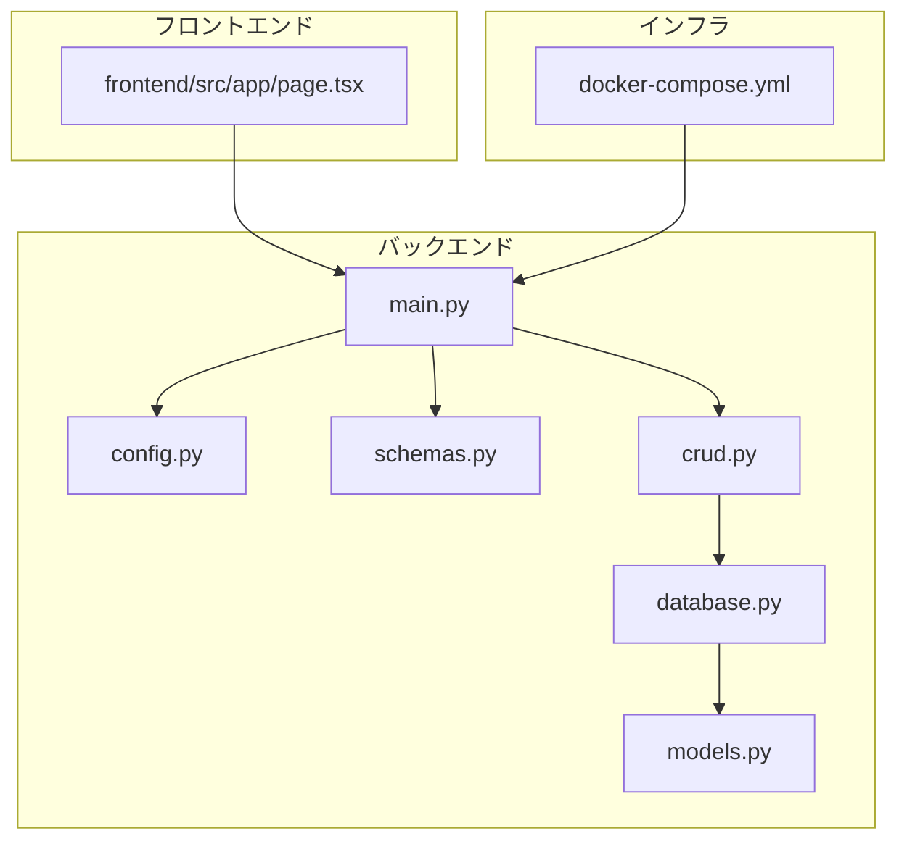
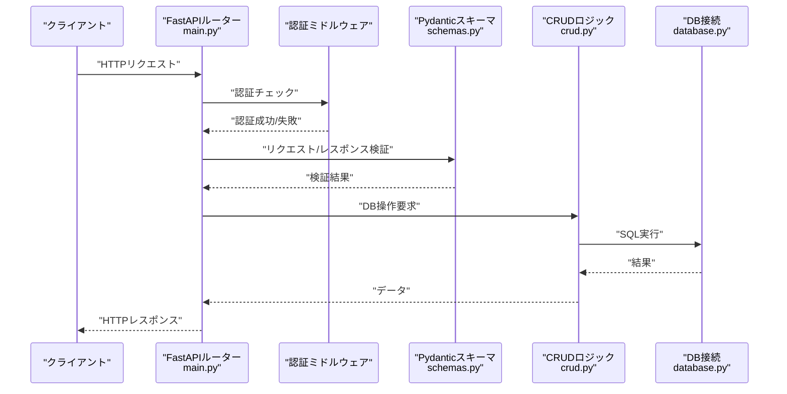
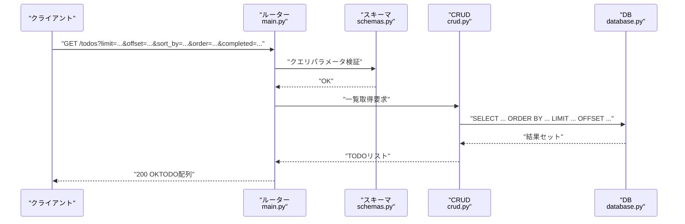
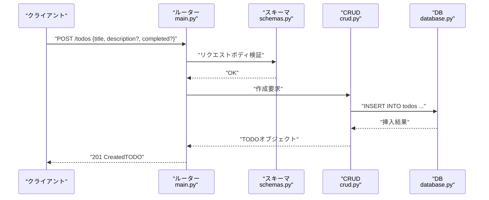
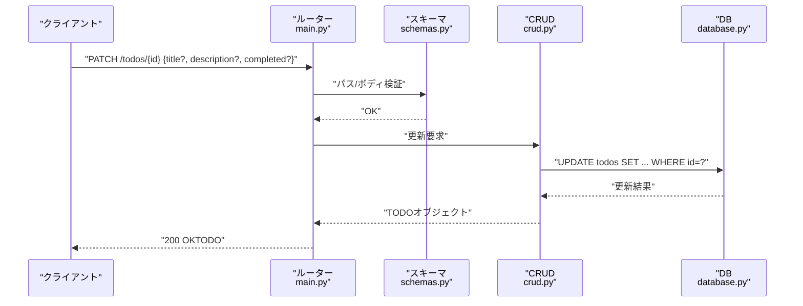
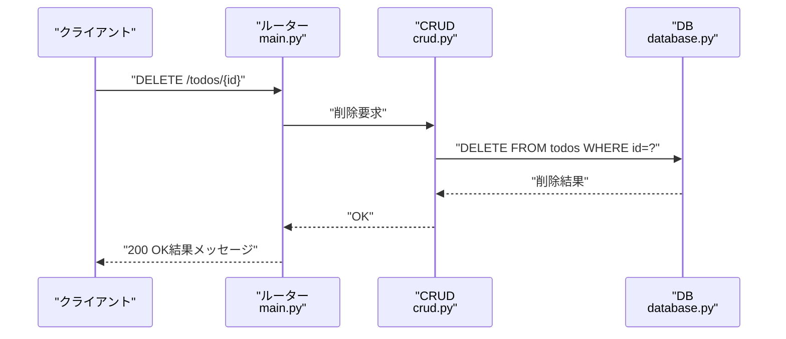
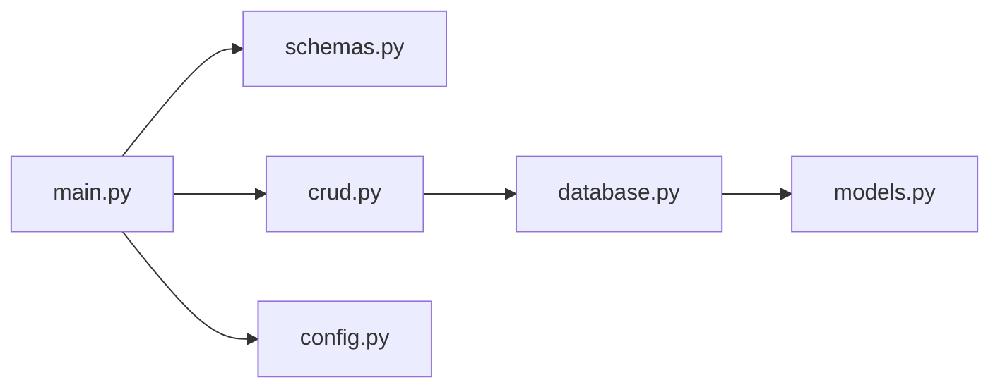

# TODO管理API

<cite>
**この文書で参照されるファイル**
- [backend/app/main.py](file://backend/app/main.py)
- [backend/app/crud.py](file://backend/app/crud.py)
- [backend/app/models.py](file://backend/app/models.py)
- [backend/app/schemas.py](file://backend/app/schemas.py)
- [backend/app/config.py](file://backend/app/config.py)
- [backend/app/database.py](file://backend/app/database.py)
- [backend/pyproject.toml](file://backend/pyproject.toml)
- [frontend/src/app/page.tsx](file://frontend/src/app/page.tsx)
- [docker-compose.yml](file://docker-compose.yml)
- [docs/current_status.md](file://docs/current_status.md)
</cite>

## 目次
1. [はじめに](#はじめに)
2. [プロジェクト構造](#プロジェクト構造)
3. [コアコンポーネント](#コアコンポーネント)
4. [アーキテクチャ概要](#アーキテクチャ概要)
5. [詳細コンポーネント分析](#詳細コンポーネント分析)
6. [依存関係分析](#依存関係分析)
7. [パフォーマンス考慮事項](#パフォーマンス考慮事項)
8. [トラブルシューティングガイド](#トラブルシューティングガイド)
9. [結論](#結論)
10. [付録](#付録)

## はじめに
本ドキュメントは、TODO管理APIのエンドポイントを網羅的にドキュメント化することを目的としています。具体的には以下のエンドポイントについて、HTTPメソッド、URLパターン、パスパラメータ、リクエストボディスキーマ、レスポンススキーマ、認証方式、クエリパラメータ、フィルタリング・ソート仕組み、エラーレスポンス形式、バリデーションエラー、データベースエラー対処法、API呼び出し例、クライアント実装のベストプラクティス、パフォーマンス最適化のヒントを示します。

- TODO一覧取得：GET /todos
- 新規TODO作成：POST /todos
- TODO更新：PATCH /todos/{id}
- TODO削除：DELETE /todos/{id}

## プロジェクト構造
バックエンドはFastAPIフレームワークを使用し、モジュール構成は以下の通りです：
- 設定：config.py
- DB接続：database.py
- モデル定義：models.py
- スキーマ定義：schemas.py
- CRUDロジック：crud.py
- エンドポイント定義：main.py
- 依存関係管理：pyproject.toml
- 前端サンプル：frontend/src/app/page.tsx
- DockerCompose：docker-compose.yml
- 開発状況：docs/current_status.md

**図の出典**
- [backend/app/main.py](file://backend/app/main.py)
- [backend/app/crud.py](file://backend/app/crud.py)
- [backend/app/models.py](file://backend/app/models.py)
- [backend/app/schemas.py](file://backend/app/schemas.py)
- [backend/app/config.py](file://backend/app/config.py)
- [backend/app/database.py](file://backend/app/database.py)
- [docker-compose.yml](file://docker-compose.yml)

**節の出典**
- [backend/app/main.py](file://backend/app/main.py)
- [backend/app/crud.py](file://backend/app/crud.py)
- [backend/app/models.py](file://backend/app/models.py)
- [backend/app/schemas.py](file://backend/app/schemas.py)
- [backend/app/config.py](file://backend/app/config.py)
- [backend/app/database.py](file://backend/app/database.py)
- [docker-compose.yml](file://docker-compose.yml)
- [docs/current_status.md](file://docs/current_status.md)

## コアコンポーネント
- 認証設定：JWT認証が有効化されており、AuthorizationヘッダーにBearerトークン形式で送信する必要があります。
- DB接続：SQLAlchemy ORMを使用し、PostgreSQLまたは同等のDBを想定しています。
- モデル：TODOエンティティのカラム（例：id、title、description、completed、created_at、updated_at）を定義。
- スキーマ：リクエスト/レスポンスのJSONスキーマ（Pydantic）を定義。
- CRUD：TODOの作成、読み取り、更新、削除ロジックを提供。
- API：FastAPIルーターを通じてエンドポイントを公開。

**節の出典**
- [backend/app/config.py](file://backend/app/config.py)
- [backend/app/database.py](file://backend/app/database.py)
- [backend/app/models.py](file://backend/app/models.py)
- [backend/app/schemas.py](file://backend/app/schemas.py)
- [backend/app/crud.py](file://backend/app/crud.py)
- [backend/app/main.py](file://backend/app/main.py)

## アーキテクチャ概要
APIエンドポイントはFastAPIのルーターに定義され、認証ミドルウェアを介して保護されています。リクエストはスキーマ検証を経て、CRUD層を介してDBにアクセスし、レスポンスはスキーマに基づいてシリアライズされます。

**図の出典**
- [backend/app/main.py](file://backend/app/main.py)
- [backend/app/schemas.py](file://backend/app/schemas.py)
- [backend/app/crud.py](file://backend/app/crud.py)
- [backend/app/database.py](file://backend/app/database.py)

## 詳細コンポーネント分析

### TODO一覧取得（GET /todos）
- HTTPメソッド：GET
- URL：/todos
- 認証：必須（Authorization: Bearer <token>）
- クエリパラメータ：
  - limit：取得件数（数値、省略可）
  - offset：オフセット（数値、省略可）
  - sort_by：ソートキー（title、created_at、updated_atなど、省略可）
  - order：昇順/降順（asc/desc、省略可）
  - completed：完了状態（true/false、省略可）
- リクエストボディ：なし
- 応答スキーマ：TODO項目の配列（各項目はTODOスキーマ）

**図の出典**
- [backend/app/main.py](file://backend/app/main.py)
- [backend/app/schemas.py](file://backend/app/schemas.py)
- [backend/app/crud.py](file://backend/app/crud.py)
- [backend/app/database.py](file://backend/app/database.py)

**節の出典**
- [backend/app/main.py](file://backend/app/main.py)
- [backend/app/schemas.py](file://backend/app/schemas.py)
- [backend/app/crud.py](file://backend/app/crud.py)

### 新規TODO作成（POST /todos）
- HTTPメソッド：POST
- URL：/todos
- 認証：必須（Authorization: Bearer <token>）
- パスパラメータ：なし
- リクエストボディスキーマ（例）：
  - title（文字列、必須）
  - description（文字列、任意）
  - completed（真偽値、任意、既定値はfalse）
- 応答スキーマ：作成されたTODO（TODOスキーマ）

**図の出典**
- [backend/app/main.py](file://backend/app/main.py)
- [backend/app/schemas.py](file://backend/app/schemas.py)
- [backend/app/crud.py](file://backend/app/crud.py)
- [backend/app/database.py](file://backend/app/database.py)

**節の出典**
- [backend/app/main.py](file://backend/app/main.py)
- [backend/app/schemas.py](file://backend/app/schemas.py)
- [backend/app/crud.py](file://backend/app/crud.py)

### TODO更新（PATCH /todos/{id}）
- HTTPメソッド：PATCH
- URL：/todos/{id}
- 認証：必須（Authorization: Bearer <token>）
- パスパラメータ：id（整数、必須）
- リクエストボディスキーマ（例）：
  - title（文字列、任意）
  - description（文字列、任意）
  - completed（真偽値、任意）
- 応答スキーマ：更新されたTODO（TODOスキーマ）

**図の出典**
- [backend/app/main.py](file://backend/app/main.py)
- [backend/app/schemas.py](file://backend/app/schemas.py)
- [backend/app/crud.py](file://backend/app/crud.py)
- [backend/app/database.py](file://backend/app/database.py)

**節の出典**
- [backend/app/main.py](file://backend/app/main.py)
- [backend/app/schemas.py](file://backend/app/schemas.py)
- [backend/app/crud.py](file://backend/app/crud.py)

### TODO削除（DELETE /todos/{id}）
- HTTPメソッド：DELETE
- URL：/todos/{id}
- 認証：必須（Authorization: Bearer <token>）
- パスパラメータ：id（整数、必須）
- リクエストボディ：なし
- 応答スキーマ：削除結果（例：{ "message": "削除しました" }）

**図の出典**
- [backend/app/main.py](file://backend/app/main.py)
- [backend/app/crud.py](file://backend/app/crud.py)
- [backend/app/database.py](file://backend/app/database.py)

**節の出典**
- [backend/app/main.py](file://backend/app/main.py)
- [backend/app/crud.py](file://backend/app/crud.py)

### 認証ヘッダー形式
- Authorization: Bearer <JWTトークン>
- トークンの有効期限、署名アルゴリズム、クレームについてはconfig.pyの設定を確認してください。

**節の出典**
- [backend/app/config.py](file://backend/app/config.py)
- [backend/app/main.py](file://backend/app/main.py)

### クエリパラメータの使用方法
- limit：1回のリクエストで取得する最大件数
- offset：スキップする先頭件数（ページネーション用）
- sort_by：ソート対象（title、created_at、updated_atなど）
- order：asc（昇順）または desc（降順）
- completed：true/falseで完了状態でのフィルタリング

**節の出典**
- [backend/app/main.py](file://backend/app/main.py)
- [backend/app/schemas.py](file://backend/app/schemas.py)

### フィルタリングとソートの仕組み
- クエリパラメータをもとにSQLのWHERE句やORDER BY句を動的に構築
- 入力値の妥当性はスキーマ検証で保証
- 未指定の場合はデフォルト値（例：completed=false、order=desc）が適用される可能性があります

**節の出典**
- [backend/app/main.py](file://backend/app/main.py)
- [backend/app/schemas.py](file://backend/app/schemas.py)

### エラーレスポンス形式
- 400 Bad Request：リクエスト形式不正、スキーマ違反
- 401 Unauthorized：認証ヘッダーなし、無効なトークン
- 403 Forbidden：権限不足（例：所有者でない）
- 404 Not Found：存在しないTODOへのアクセス
- 500 Internal Server Error：DBエラー、サーバ内部エラー

エラーレスポンスの共通スキーマ（例）：
- error_code（文字列）
- message（文字列）
- details（オプション：配列またはオブジェクト）

**節の出典**
- [backend/app/main.py](file://backend/app/main.py)
- [backend/app/schemas.py](file://backend/app/schemas.py)

### バリデーションエラーの詳細
- 入力値の型不一致、必須フィールド欠損、範囲外値
- FastAPIのValidationErrorにより自動的に422 Unprocessable Entityが返却される場合があります
- 400系エラーとして扱われる場合は、カスタムハンドラで上記共通スキーマに整形

**節の出典**
- [backend/app/schemas.py](file://backend/app/schemas.py)
- [backend/app/main.py](file://backend/app/main.py)

### DBエラーの対処法
- 接続エラー：DB接続情報の再確認、ネットワークの確認
- 制約違反：ユニーク制約、外部キー制約の確認
- トランザクションロールバック：エラー発生時にロールバックし、適切なHTTPステータスを返す
- パフォーマンス劣化：インデックスの追加、クエリの最適化

**節の出典**
- [backend/app/database.py](file://backend/app/database.py)
- [backend/app/crud.py](file://backend/app/crud.py)
- [backend/app/main.py](file://backend/app/main.py)

### 実際のAPI呼び出し例
- 一覧取得
  - curl -H "Authorization: Bearer <TOKEN>" "https://example.com/todos?limit=20&offset=0&sort_by=created_at&order=desc&completed=false"
- 新規作成
  - curl -X POST -H "Authorization: Bearer <TOKEN>" -H "Content-Type: application/json" -d '{"title":"新しいTODO","completed":false}' "https://example.com/todos"
- 更新
  - curl -X PATCH -H "Authorization: Bearer <TOKEN>" -H "Content-Type: application/json" -d '{"completed":true}' "https://example.com/todos/1"
- 削除
  - curl -X DELETE -H "Authorization: Bearer <TOKEN>" "https://example.com/todos/1"

### クライアント実装のベストプラクティス
- 認証トークンの安全な保存（例：HttpOnly Cookie、Secureなローカルストレージ）
- 再試行ロジック（指数バックオフ）とタイムアウト設定
- エラーハンドリング（401で再認証、403で権限確認）
- ページネーションの実装（limit/offsetの使い分け）
- フィルタリング/ソートの状態管理（クエリパラメータの永続化）

### パフォーマンス最適化のヒント
- SELECTカラムの絞り込み（不要な列を除外）
- ORDER BYに使用する列にインデックスを設定
- 大量データの取得にはcursorベースのページネーションを検討
- 一括更新/削除はトランザクション内で実施
- キャッシュ層（Redisなど）の導入を検討（一覧取得など）

**節の出典**
- [backend/app/main.py](file://backend/app/main.py)
- [backend/app/crud.py](file://backend/app/crud.py)
- [backend/app/database.py](file://backend/app/database.py)

## 依存関係分析
FastAPIアプリケーションの依存関係は以下のようになります：

**図の出典**
- [backend/app/main.py](file://backend/app/main.py)
- [backend/app/schemas.py](file://backend/app/schemas.py)
- [backend/app/crud.py](file://backend/app/crud.py)
- [backend/app/database.py](file://backend/app/database.py)
- [backend/app/models.py](file://backend/app/models.py)
- [backend/app/config.py](file://backend/app/config.py)

**節の出典**
- [backend/app/main.py](file://backend/app/main.py)
- [backend/app/schemas.py](file://backend/app/schemas.py)
- [backend/app/crud.py](file://backend/app/crud.py)
- [backend/app/database.py](file://backend/app/database.py)
- [backend/app/models.py](file://backend/app/models.py)
- [backend/app/config.py](file://backend/app/config.py)

## パフォーマンス考慮事項
- SQLクエリのN+1防止（関連データのプリロード）
- 絞込条件の効率的なインデックス設計
- JSONシリアライズのオーバーヘッド削減（スキーマの省略列）
- 非同期処理（非同期DB接続、非同期I/O）の導入

[この節は一般的なガイダンスであり、特定のファイルを直接分析していません]

## トラブルシューティングガイド
- 401 Unauthorized
  - トークン形式の確認（Bearer）
  - トークンの有効期限確認
  - 証明書/クロスオリジン設定の確認
- 403 Forbidden
  - 所有者権限の確認
  - ロールベースアクセス制御（RBAC）の確認
- 404 Not Found
  - 存在しないidの確認
  - 削除済みデータの再取得試行
- 500 Internal Server Error
  - DB接続ログの確認
  - 例外スタックトレースの確認
  - DBクエリの実行計画の確認

**節の出典**
- [backend/app/main.py](file://backend/app/main.py)
- [backend/app/database.py](file://backend/app/database.py)

## 結論
TODO管理APIは、認証付きのRESTエンドポイント群として設計されており、FastAPIによる堅牢なスキーマ検証、SQLAlchemyによるDB操作、そして柔軟なクエリパラメータによるフィルタリング/ソート機能を提供しています。クライアント側では認証トークン管理、エラーハンドリング、パフォーマンス最適化を意識した実装が求められます。

[この節は要約であり、特定のファイルを直接分析していません]

## 付録
- DockerComposeでの起動手順：docker-compose up -d
- 開発状況：docs/current_status.md

**節の出典**
- [docker-compose.yml](file://docker-compose.yml)
- [docs/current_status.md](file://docs/current_status.md)