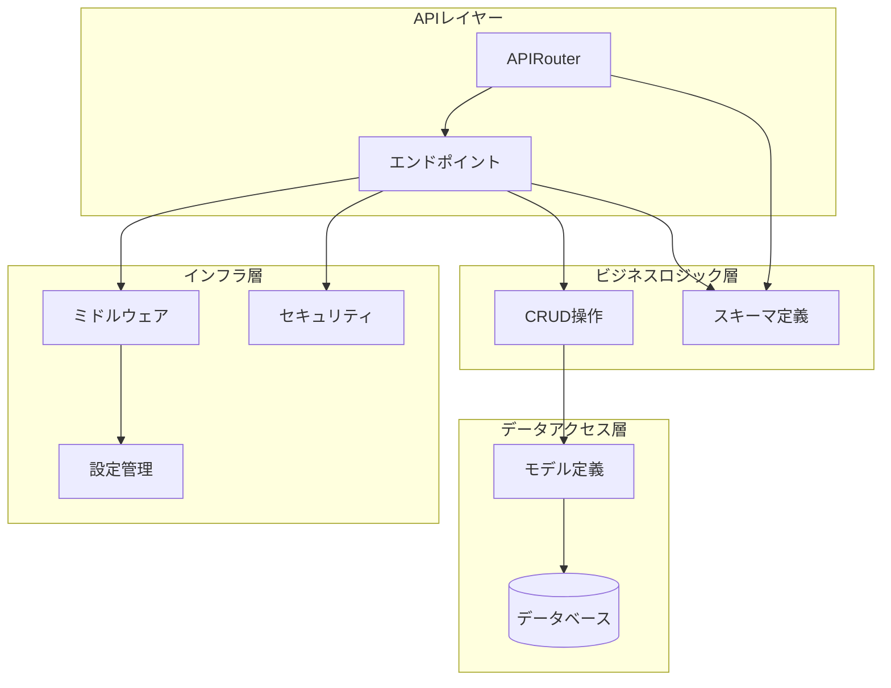
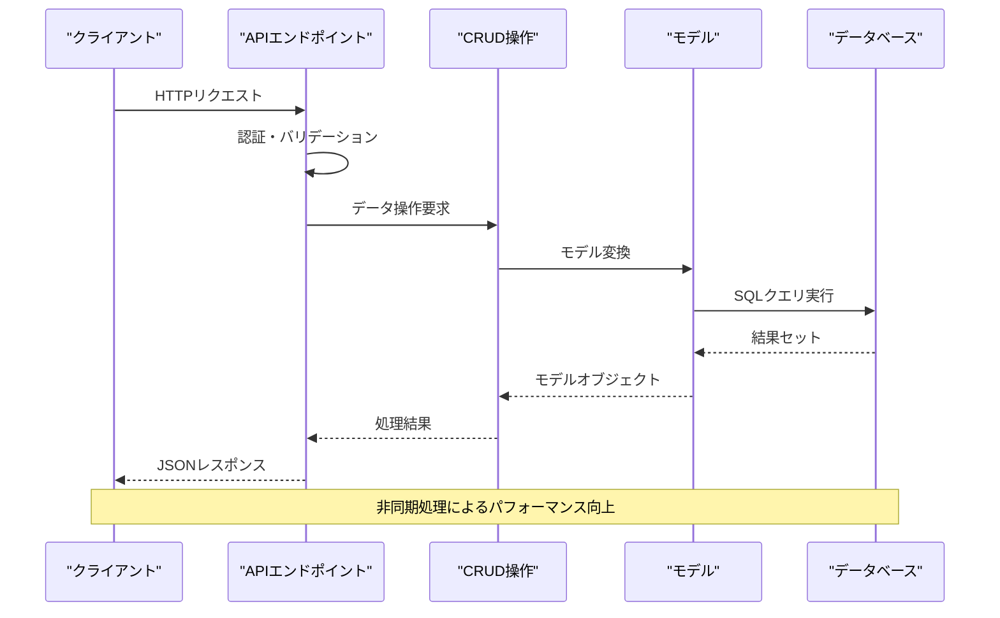
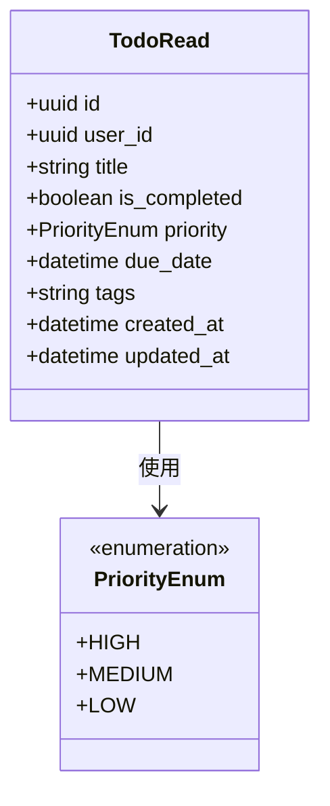
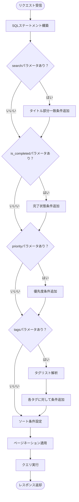
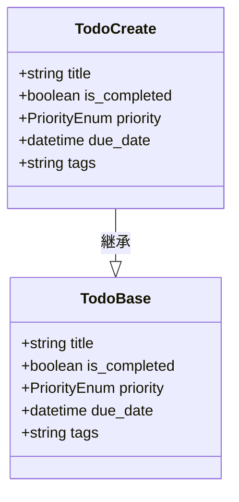
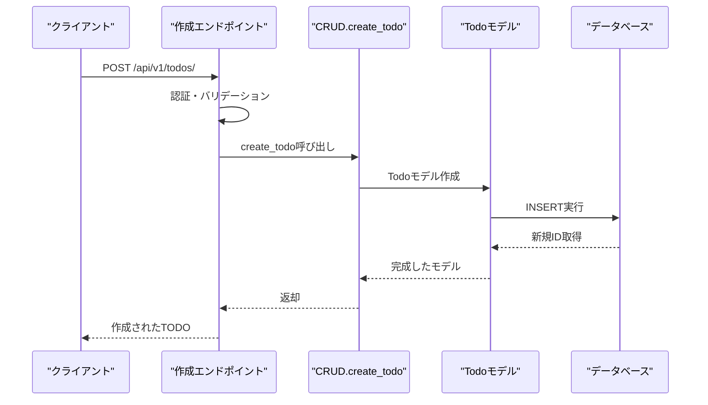
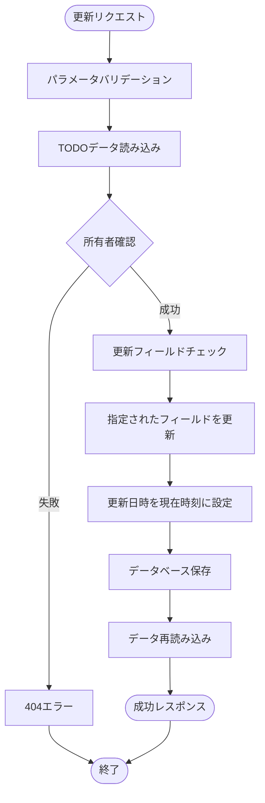
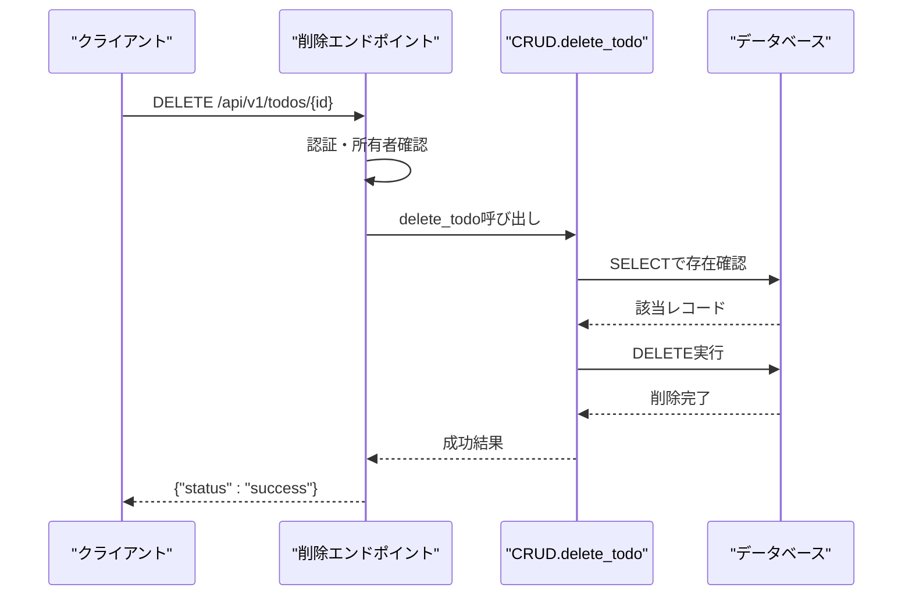
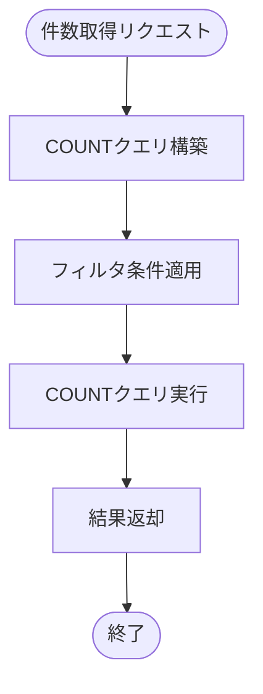
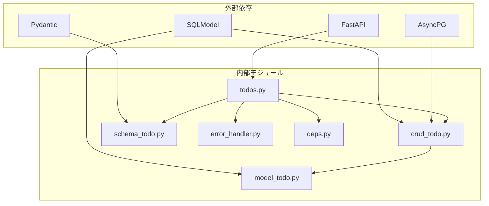

# TODO管理API

<cite>
**この文書で参照されるファイル**
- [backend/app/api/api_v1/endpoints/todos.py](file://backend/app/api/api_v1/endpoints/todos.py)
- [backend/app/schemas/todo.py](file://backend/app/schemas/todo.py)
- [backend/app/crud/crud_todo.py](file://backend/app/crud/crud_todo.py)
- [backend/app/models/todo.py](file://backend/app/models/todo.py)
- [backend/app/api/api_v1/api.py](file://backend/app/api/api_v1/api.py)
- [backend/app/middleware/error_handler.py](file://backend/app/middleware/error_handler.py)
- [backend/app/main.py](file://backend/app/main.py)
- [backend/app/api/deps.py](file://backend/app/api/deps.py)
- [backend/tests/test_todos.py](file://backend/tests/test_todos.py)
- [frontend/src/hooks/useTodos.ts](file://frontend/src/hooks/useTodos.ts)
- [backend/app/core/config.py](file://backend/app/core/config.py)
</cite>

## 目次
1. [導入](#導入)
2. [プロジェクト構造](#プロジェクト構造)
3. [コアコンポーネント](#コアコンポーネント)
4. [アーキテクチャ概要](#アーキテクチャ概要)
5. [詳細コンポーネント分析](#詳細コンポーネント分析)
6. [依存関係分析](#依存関係分析)
7. [パフォーマンス考慮事項](#パフォーマンス考慮事項)
8. [トラブルシューティングガイド](#トラブルシューティングガイド)
9. [結論](#結論)

## 導入
このTODO管理APIはFastAPIフレームワークを基盤としたRESTful APIで、ユーザーごとのTODOアイテムの作成・取得・更新・削除機能を提供します。SQLModelを使用した非同期データベース操作、JWTベースの認証、統一エラーハンドリング、リクエスト制限機能を備えています。

## プロジェクト構造
バックエンドはFastAPIアプリケーションとして設計されており、以下の層構造を持っています：

**図の出典**
- [backend/app/api/api_v1/api.py:1-8](file://backend/app/api/api_v1/api.py#L1-L8)
- [backend/app/api/api_v1/endpoints/todos.py:1-102](file://backend/app/api/api_v1/endpoints/todos.py#L1-L102)

**セクションの出典**
- [backend/app/main.py:1-168](file://backend/app/main.py#L1-L168)
- [backend/app/api/api_v1/api.py:1-8](file://backend/app/api/api_v1/api.py#L1-L8)

## コアコンポーネント
TODO管理APIの主なコンポーネントは以下の通りです：

### APIエンドポイント
- `/api/v1/todos/` - TODO一覧取得
- `/api/v1/todos/count` - TODO件数取得  
- `/api/v1/todos/` - TODO作成（POST）
- `/api/v1/todos/{id}` - TODO更新（PUT）
- `/api/v1/todos/{id}` - TODO削除（DELETE）

### データモデル
- TodoBase: 共通フィールド定義
- TodoCreate: 作成用スキーマ
- TodoUpdate: 更新用スキーマ
- TodoRead: 読み取り用スキーマ
- PriorityEnum: 優先度列挙型

**セクションの出典**
- [backend/app/api/api_v1/endpoints/todos.py:1-102](file://backend/app/api/api_v1/endpoints/todos.py#L1-L102)
- [backend/app/schemas/todo.py:1-41](file://backend/app/schemas/todo.py#L1-L41)

## アーキテクチャ概要
TODO管理APIはMVC（Model-View-Controller）パターンに従い、以下のアーキテクチャを採用しています：

**図の出典**
- [backend/app/api/api_v1/endpoints/todos.py:32-57](file://backend/app/api/api_v1/endpoints/todos.py#L32-L57)
- [backend/app/crud/crud_todo.py:10-71](file://backend/app/crud/crud_todo.py#L10-L71)

**セクションの出典**
- [backend/app/api/api_v1/endpoints/todos.py:1-102](file://backend/app/api/api_v1/endpoints/todos.py#L1-L102)
- [backend/app/crud/crud_todo.py:1-152](file://backend/app/crud/crud_todo.py#L1-L152)

## 詳細コンポーネント分析

### TODO一覧取得エンドポイント（GET /api/v1/todos/）
TODO一覧取得エンドポイントは、豊富なクエリパラメータをサポートし、高度な検索・フィルタリング・ソート・ページネーション機能を提供します。

#### クエリパラメータ仕様
| パラメータ名 | 型 | 必須 | 初期値 | 説明 |
|------------|----|------|--------|------|
| skip | integer | いいえ | 0 | スキップする件数（0以上） |
| limit | integer | いいえ | 100 | 取得件数（1-100の範囲） |
| search | string | いいえ | null | 検索キーワード（タイトル部分一致） |
| is_completed | boolean | いいえ | null | 完了状態でのフィルタ |
| priority | enum | いいえ | null | 優先度でのフィルタ（high/medium/low） |
| tags | string | いいえ | null | タグでのフィルタ（カンマ区切り） |
| sort_by | enum | いいえ | created_at | ソート対象（created_at/priority/due_date） |
| sort_order | enum | いいえ | desc | ソート順（asc/desc） |

#### 応答スキーマ

**図の出典**
- [backend/app/schemas/todo.py:30-35](file://backend/app/schemas/todo.py#L30-L35)
- [backend/app/schemas/todo.py:7-12](file://backend/app/schemas/todo.py#L7-L12)

#### 検索・フィルタリングアルゴリズム

**図の出典**
- [backend/app/crud/crud_todo.py:22-71](file://backend/app/crud/crud_todo.py#L22-L71)

**セクションの出典**
- [backend/app/api/api_v1/endpoints/todos.py:32-57](file://backend/app/api/api_v1/endpoints/todos.py#L32-L57)
- [backend/app/crud/crud_todo.py:10-71](file://backend/app/crud/crud_todo.py#L10-L71)

### TODO作成エンドポイント（POST /api/v1/todos/）
TODO作成エンドポイントは、新しいTODOアイテムをデータベースに作成します。

#### リクエストスキーマ

**図の出典**
- [backend/app/schemas/todo.py:20-21](file://backend/app/schemas/todo.py#L20-L21)
- [backend/app/schemas/todo.py:13-19](file://backend/app/schemas/todo.py#L13-L19)

#### バリデーションルール
- title: 必須、最大255文字、NULL不可
- is_completed: 省略時false
- priority: 優先度列挙型（high/medium/low）、省略時low
- due_date: 日付型、省略可
- tags: 最大500文字、省略可

#### 処理フロー

**図の出典**
- [backend/app/api/api_v1/endpoints/todos.py:59-67](file://backend/app/api/api_v1/endpoints/todos.py#L59-L67)
- [backend/app/crud/crud_todo.py:100-105](file://backend/app/crud/crud_todo.py#L100-L105)

**セクションの出典**
- [backend/app/api/api_v1/endpoints/todos.py:59-67](file://backend/app/api/api_v1/endpoints/todos.py#L59-L67)
- [backend/app/schemas/todo.py:20-28](file://backend/app/schemas/todo.py#L20-L28)

### TODO更新エンドポイント（PUT /api/v1/todos/{id}）
TODO更新エンドポイントは、既存のTODOアイテムを部分的または完全に更新できます。

#### 更新機能仕様
- 部分更新: 特定のフィールドのみ更新可能
- 完全更新: すべてのフィールドを一度に更新可能
- 条件付き更新: 所有者確認によるセキュリティ保護

#### 更新処理フロー

**図の出典**
- [backend/app/crud/crud_todo.py:117-142](file://backend/app/crud/crud_todo.py#L117-L142)

#### エラーハンドリング
- 404エラー: 存在しないTODOへのアクセス
- 401エラー: 認証失敗
- 403エラー: 所有者以外のアクセス試行

**セクションの出典**
- [backend/app/api/api_v1/endpoints/todos.py:69-89](file://backend/app/api/api_v1/endpoints/todos.py#L69-L89)
- [backend/app/crud/crud_todo.py:107-142](file://backend/app/crud/crud_todo.py#L107-L142)

### TODO削除エンドポイント（DELETE /api/v1/todos/{id}）
TODO削除エンドポイントは論理削除ではなく、物理削除を実行します。

#### 削除処理フロー

**図の出典**
- [backend/app/crud/crud_todo.py:144-151](file://backend/app/crud/crud_todo.py#L144-L151)

#### 削除戦略
- 物理削除: データベースから完全に削除
- 所有者確認: 同じuser_idを持つレコードのみ削除
- 結果確認: 削除されたレコードがあれば成功、なければ404

**セクションの出典**
- [backend/app/api/api_v1/endpoints/todos.py:91-101](file://backend/app/api/api_v1/endpoints/todos.py#L91-L101)
- [backend/app/crud/crud_todo.py:144-151](file://backend/app/crud/crud_todo.py#L144-L151)

### 件数取得エンドポイント（GET /api/v1/todos/count）
TODO件数取得エンドポイントは、フィルタ条件に一致するTODOの総数を返します。

#### 件数取得アルゴリズム

**図の出典**
- [backend/app/crud/crud_todo.py:73-98](file://backend/app/crud/crud_todo.py#L73-L98)

**セクションの出典**
- [backend/app/api/api_v1/endpoints/todos.py:13-30](file://backend/app/api/api_v1/endpoints/todos.py#L13-L30)
- [backend/app/crud/crud_todo.py:73-98](file://backend/app/crud/crud_todo.py#L73-L98)

## 依存関係分析
TODO管理APIの依存関係は以下の通りです：

**図の出典**
- [backend/pyproject.toml:7-22](file://backend/pyproject.toml#L7-L22)
- [backend/app/api/api_v1/endpoints/todos.py:1-11](file://backend/app/api/api_v1/endpoints/todos.py#L1-L11)

**セクションの出典**
- [backend/pyproject.toml:1-47](file://backend/pyproject.toml#L1-L47)
- [backend/app/api/api_v1/endpoints/todos.py:1-11](file://backend/app/api/api_v1/endpoints/todos.py#L1-L11)

### 認証とセキュリティ
TODO管理APIはJWTベースの認証を採用し、以下のセキュリティ機構を備えています：

- OAuth2 Bearerトークン認証
- トークンの有効期限管理
- 所有者確認によるリソース保護
- 統一エラーハンドリング

**セクションの出典**
- [backend/app/api/deps.py:1-31](file://backend/app/api/deps.py#L1-L31)
- [backend/app/middleware/error_handler.py:1-149](file://backend/app/middleware/error_handler.py#L1-L149)

## パフォーマンス考慮事項
TODO管理APIは以下のパフォーマンス最適化を実装しています：

### データベース最適化
- インデックス設計: created_at, is_completed, priority, due_dateフィールドにインデックス
- 非同期処理: SQLAlchemy AsyncIOを使用した非同期データベース操作
- クエリ最適化: 条件付きクエリ構築による不要なデータ転送の削減

### API最適化
- ページネーション: 1回のリクエストあたり最大100件の制限
- ソート最適化: 優先度と期限日のための専用インデックス
- キャッシュ対応: React Queryを使用したフロントエンド側のキャッシュ管理

### リクエスト制限
- 1分あたり100リクエストのデフォルト制限
- 認証系エンドポイントの個別制限設定

**セクションの出典**
- [backend/app/models/todo.py:12-17](file://backend/app/models/todo.py#L12-L17)
- [backend/app/core/config.py:62-66](file://backend/app/core/config.py#L62-L66)

## トラブルシューティングガイド

### 一般的なエラー対応
| エラーコード | 原因 | 対処法 |
|------------|------|--------|
| 400 | 不正なリクエスト | リクエストパラメータの形式を確認 |
| 401 | 認証失敗 | JWTトークンの再発行を試行 |
| 403 | 権限なし | 所有者であるか確認 |
| 404 | リソース不存在 | IDの誤りや削除済みの可能性 |
| 422 | バリデーションエラー | 入力データの形式を修正 |
| 429 | リクエスト制限超過 | 待機時間後に再度試行 |

### デバッグ手順
1. **認証確認**: Authorizationヘッダーに正しいJWTトークンが含まれているか
2. **パラメータ検証**: 必須パラメータとデータ型が正しいか
3. **データベース接続**: ヘルスチェックエンドポイントで接続状況を確認
4. **ログ確認**: サーバーのエラーログを確認

**セクションの出典**
- [backend/app/middleware/error_handler.py:107-122](file://backend/app/middleware/error_handler.py#L107-L122)
- [backend/app/main.py:134-167](file://backend/app/main.py#L134-L167)

## 結論
TODO管理APIは、堅牢な認証システム、豊富な検索・フィルタリング機能、非同期処理によるパフォーマンス、そして統一されたエラーハンドリングを特徴とする、実用的なRESTful APIです。フロントエンドとの連携も考慮された設計となっており、拡張性と保守性に優れています。