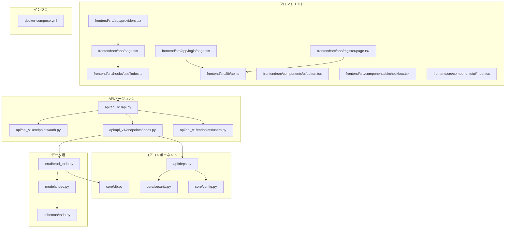
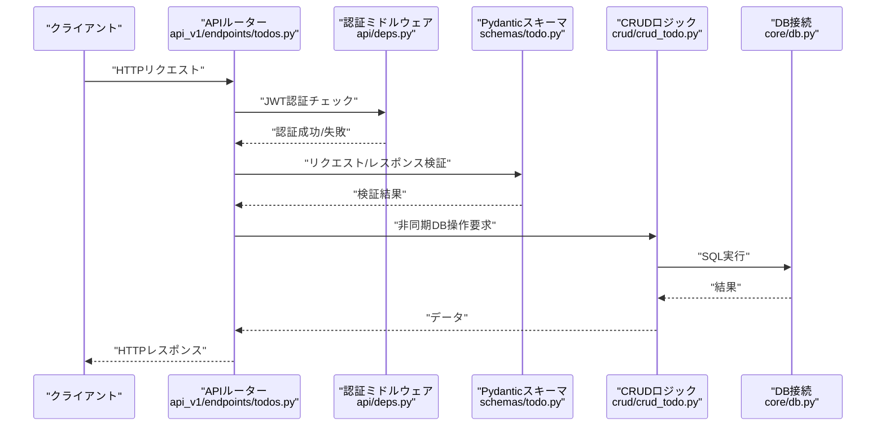
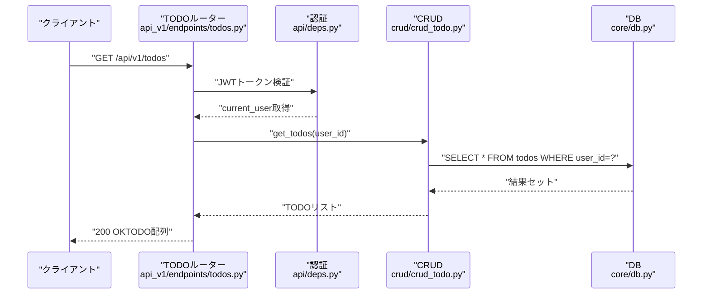
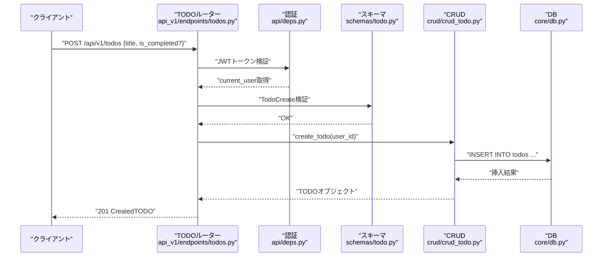
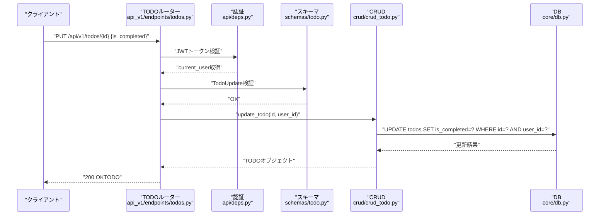
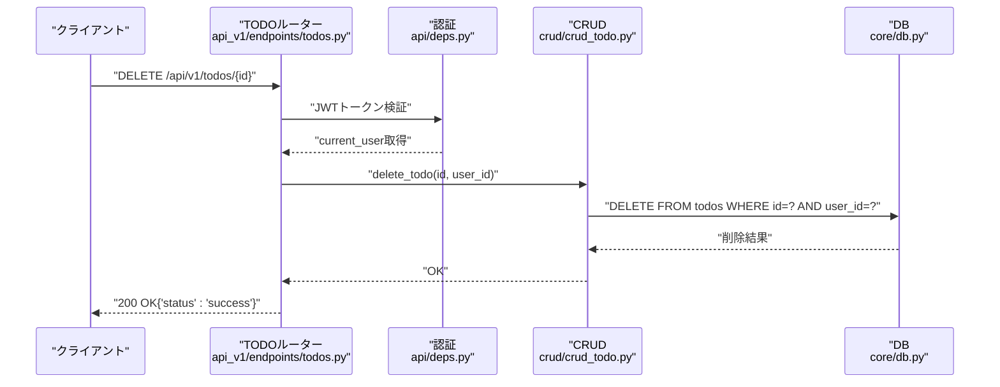
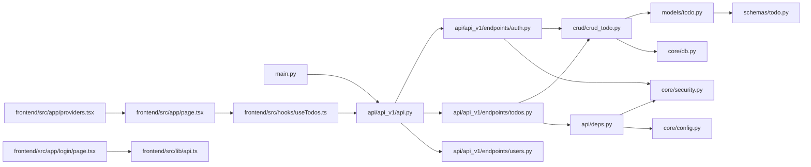

# TODO管理API

<cite>
**この文書で参照されるファイル**
- [backend/app/main.py](file://backend/app/main.py)
- [backend/app/api/api_v1/api.py](file://backend/app/api/api_v1/api.py)
- [backend/app/api/api_v1/endpoints/todos.py](file://backend/app/api/api_v1/endpoints/todos.py)
- [backend/app/api/api_v1/endpoints/auth.py](file://backend/app/api/api_v1/endpoints/auth.py)
- [backend/app/api/deps.py](file://backend/app/api/deps.py)
- [backend/app/crud/crud_todo.py](file://backend/app/crud/crud_todo.py)
- [backend/app/models/todo.py](file://backend/app/models/todo.py)
- [backend/app/schemas/todo.py](file://backend/app/schemas/todo.py)
- [backend/app/core/config.py](file://backend/app/core/config.py)
- [backend/app/core/security.py](file://backend/app/core/security.py)
- [backend/app/core/db.py](file://backend/app/core/db.py)
- [frontend/src/hooks/useTodos.ts](file://frontend/src/hooks/useTodos.ts)
- [frontend/src/app/page.tsx](file://frontend/src/app/page.tsx)
- [frontend/src/lib/api.ts](file://frontend/src/lib/api.ts)
- [frontend/src/app/providers.tsx](file://frontend/src/app/providers.tsx)
- [frontend/src/app/login/page.tsx](file://frontend/src/app/login/page.tsx)
- [frontend/src/app/register/page.tsx](file://frontend/src/app/register/page.tsx)
- [frontend/src/app/layout.tsx](file://frontend/src/app/layout.tsx)
- [frontend/src/components/ui/button.tsx](file://frontend/src/components/ui/button.tsx)
- [frontend/src/components/ui/checkbox.tsx](file://frontend/src/components/ui/checkbox.tsx)
- [frontend/src/components/ui/input.tsx](file://frontend/src/components/ui/input.tsx)
- [docker-compose.yml](file://docker-compose.yml)
- [docs/current_status.md](file://docs/current_status.md)
</cite>

## 更新概要
**変更内容**
- 新しいフロントエンドTODO管理インターフェースの追加（Next.js + TanStack React Query）
- CRUD操作の完全なフロントエンド実装（作成/読取/更新/削除）
- リアルタイム更新機能（TanStack React Queryのキャッシュ無効化）
- useTodosカスタムフックの導入
- タスク統計表示（保留中/完了数）の追加
- 認証フローの統合（ログイン/登録画面）
- UIコンポーネントの追加（Button、Checkbox、Input）

## 目次
1. [はじめに](#はじめに)
2. [プロジェクト構造](#プロジェクト構造)
3. [コアコンポーネント](#コアコンポーネント)
4. [アーキテクチャ概要](#アーキテクチャ概要)
5. [詳細コンポーネント分析](#詳細コンポーネント分析)
6. [フロントエンドインターフェース](#フロントエンドインターフェース)
7. [依存関係分析](#依存関係分析)
8. [パフォーマンス考慮事項](#パフォーマンス考慮事項)
9. [トラブルシューティングガイド](#トラブルシューティングガイド)
10. [結論](#結論)
11. [付録](#付録)

## はじめに
本ドキュメントは、完全に再設計されたTODO管理APIのエンドポイントを網羅的にドキュメント化することを目的としています。新しいFastAPIベースのアーキテクチャに加え、フロントエンドの完全なTODO管理インターフェースが追加されました。以下のエンドポイントについて、HTTPメソッド、URLパターン、パスパラメータ、リクエストボディスキーマ、レスポンススキーマ、認証方式、UUIDベースのID管理、エラーレスポンス形式、バリデーションエラー、データベースエラー対処法、API呼び出し例、クライアント実装のベストプラクティス、パフォーマンス最適化のヒント、リアルタイム更新機能を示します。

- TODO一覧取得：GET /api/v1/todos
- 新規TODO作成：POST /api/v1/todos
- TODO更新：PUT /api/v1/todos/{id}
- TODO削除：DELETE /api/v1/todos/{id}
- ユーザー登録：POST /api/v1/auth/register
- トークン取得：POST /api/v1/auth/token

## プロジェクト構造
バックエンドは完全に再設計されたFastAPIフレームワークを使用し、モジュール構成は以下の通りです：
- 設定：config.py（/api/v1プレフィックス、JWT設定）
- DB接続：core/db.py（非同期SQLAlchemy接続）
- モデル定義：models/todo.py（UUIDベースのTODOモデル）
- スキーマ定義：schemas/todo.py（Pydanticベースのスキーマ）
- CRUDロジック：crud/crud_todo.py（非同期操作）
- APIルーター：api/api_v1/api.py（バージョン管理）
- エンドポイント定義：api/api_v1/endpoints/todos.py、api/api_v1/endpoints/auth.py
- 依存関係管理：api/deps.py（JWT認証）
- 認証ロジック：core/security.py（JWTトークン処理）
- フロントエンド：frontend/src/hooks/useTodos.ts、frontend/src/app/page.tsx
- DockerCompose：docker-compose.yml
- 開発状況：docs/current_status.md

**図の出典**
- [backend/app/api/api_v1/api.py](file://backend/app/api/api_v1/api.py)
- [backend/app/api/api_v1/endpoints/todos.py](file://backend/app/api/api_v1/endpoints/todos.py)
- [backend/app/api/api_v1/endpoints/auth.py](file://backend/app/api/api_v1/endpoints/auth.py)
- [backend/app/api/deps.py](file://backend/app/api/deps.py)
- [backend/app/core/config.py](file://backend/app/core/config.py)
- [backend/app/core/security.py](file://backend/app/core/security.py)
- [backend/app/core/db.py](file://backend/app/core/db.py)
- [backend/app/crud/crud_todo.py](file://backend/app/crud/crud_todo.py)
- [backend/app/models/todo.py](file://backend/app/models/todo.py)
- [backend/app/schemas/todo.py](file://backend/app/schemas/todo.py)
- [frontend/src/hooks/useTodos.ts](file://frontend/src/hooks/useTodos.ts)
- [frontend/src/app/page.tsx](file://frontend/src/app/page.tsx)
- [frontend/src/app/login/page.tsx](file://frontend/src/app/login/page.tsx)
- [frontend/src/app/register/page.tsx](file://frontend/src/app/register/page.tsx)
- [frontend/src/app/providers.tsx](file://frontend/src/app/providers.tsx)
- [frontend/src/lib/api.ts](file://frontend/src/lib/api.ts)
- [frontend/src/components/ui/button.tsx](file://frontend/src/components/ui/button.tsx)
- [frontend/src/components/ui/checkbox.tsx](file://frontend/src/components/ui/checkbox.tsx)
- [frontend/src/components/ui/input.tsx](file://frontend/src/components/ui/input.tsx)
- [docker-compose.yml](file://docker-compose.yml)

**節の出典**
- [backend/app/main.py](file://backend/app/main.py)
- [backend/app/api/api_v1/api.py](file://backend/app/api/api_v1/api.py)
- [backend/app/api/api_v1/endpoints/todos.py](file://backend/app/api/api_v1/endpoints/todos.py)
- [backend/app/api/deps.py](file://backend/app/api/deps.py)
- [backend/app/core/config.py](file://backend/app/core/config.py)
- [backend/app/core/security.py](file://backend/app/core/security.py)
- [backend/app/core/db.py](file://backend/app/core/db.py)
- [backend/app/crud/crud_todo.py](file://backend/app/crud/crud_todo.py)
- [backend/app/models/todo.py](file://backend/app/models/todo.py)
- [backend/app/schemas/todo.py](file://backend/app/schemas/todo.py)
- [frontend/src/hooks/useTodos.ts](file://frontend/src/hooks/useTodos.ts)
- [frontend/src/app/page.tsx](file://frontend/src/app/page.tsx)
- [frontend/src/app/login/page.tsx](file://frontend/src/app/login/page.tsx)
- [frontend/src/app/register/page.tsx](file://frontend/src/app/register/page.tsx)
- [frontend/src/app/providers.tsx](file://frontend/src/app/providers.tsx)
- [frontend/src/lib/api.ts](file://frontend/src/lib/api.ts)
- [frontend/src/components/ui/button.tsx](file://frontend/src/components/ui/button.tsx)
- [frontend/src/components/ui/checkbox.tsx](file://frontend/src/components/ui/checkbox.tsx)
- [frontend/src/components/ui/input.tsx](file://frontend/src/components/ui/input.tsx)
- [docker-compose.yml](file://docker-compose.yml)
- [docs/current_status.md](file://docs/current_status.md)

## コアコンポーネント
- **認証設定**：JWT Bearer認証が有効化されており、AuthorizationヘッダーにBearerトークン形式で送信する必要があります。トークンは30分間有効です。
- **DB接続**：非同期SQLAlchemy ORMを使用し、PostgreSQLを想定しています。UUIDベースの主キーを使用します。
- **モデル**：TODOエンティティのカラム（id、title、is_completed、user_id、created_at）を定義。
- **スキーマ**：リクエスト/レスポンスのJSONスキーマ（Pydantic）を定義。
- **CRUD**：TODOの作成、読み取り、更新、削除ロジックを提供（非同期操作）。
- **API**：FastAPIルーターを通じてバージョン管理されたエンドポイントを公開。
- **フロントエンド**：TanStack React Queryを使用したリアルタイム更新、useTodosカスタムフック、認証フロー。

**節の出典**
- [backend/app/core/config.py](file://backend/app/core/config.py)
- [backend/app/core/security.py](file://backend/app/core/security.py)
- [backend/app/models/todo.py](file://backend/app/models/todo.py)
- [backend/app/schemas/todo.py](file://backend/app/schemas/todo.py)
- [backend/app/crud/crud_todo.py](file://backend/app/crud/crud_todo.py)
- [backend/app/api/api_v1/api.py](file://backend/app/api/api_v1/api.py)
- [frontend/src/hooks/useTodos.ts](file://frontend/src/hooks/useTodos.ts)

## アーキテクチャ概要
APIエンドポイントはFastAPIのバージョン管理されたルーターに定義され、JWT認証ミドルウェアを介して保護されています。リクエストはスキーマ検証を経て、非同期CRUD層を介してDBにアクセスし、レスポンスはスキーマに基づいてシリアライズされます。フロントエンドはTanStack React Queryを使用してリアルタイム更新を実現し、useTodosカスタムフックを通じてCRUD操作を抽象化します。

**図の出典**
- [backend/app/api/api_v1/endpoints/todos.py](file://backend/app/api/api_v1/endpoints/todos.py)
- [backend/app/api/deps.py](file://backend/app/api/deps.py)
- [backend/app/schemas/todo.py](file://backend/app/schemas/todo.py)
- [backend/app/crud/crud_todo.py](file://backend/app/crud/crud_todo.py)
- [backend/app/core/db.py](file://backend/app/core/db.py)

## 詳細コンポーネント分析

### TODO一覧取得（GET /api/v1/todos）
- **HTTPメソッド**：GET
- **URL**：/api/v1/todos
- **認証**：必須（Authorization: Bearer <JWTトークン>）
- **クエリパラメータ**：なし
- **パスパラメータ**：なし
- **リクエストボディ**：なし
- **応答スキーマ**：TODO項目の配列（各項目はTodoReadスキーマ）

**図の出典**
- [backend/app/api/api_v1/endpoints/todos.py](file://backend/app/api/api_v1/endpoints/todos.py)
- [backend/app/api/deps.py](file://backend/app/api/deps.py)
- [backend/app/crud/crud_todo.py](file://backend/app/crud/crud_todo.py)
- [backend/app/core/db.py](file://backend/app/core/db.py)

**節の出典**
- [backend/app/api/api_v1/endpoints/todos.py](file://backend/app/api/api_v1/endpoints/todos.py)
- [backend/app/api/deps.py](file://backend/app/api/deps.py)
- [backend/app/crud/crud_todo.py](file://backend/app/crud/crud_todo.py)

### 新規TODO作成（POST /api/v1/todos）
- **HTTPメソッド**：POST
- **URL**：/api/v1/todos
- **認証**：必須（Authorization: Bearer <JWTトークン>）
- **パスパラメータ**：なし
- **リクエストボディスキーマ**：
  - title（文字列、必須、最大255文字）
  - is_completed（真偽値、任意、既定値はfalse）
- **応答スキーマ**：作成されたTODO（TodoReadスキーマ）

**図の出典**
- [backend/app/api/api_v1/endpoints/todos.py](file://backend/app/api/api_v1/endpoints/todos.py)
- [backend/app/api/deps.py](file://backend/app/api/deps.py)
- [backend/app/schemas/todo.py](file://backend/app/schemas/todo.py)
- [backend/app/crud/crud_todo.py](file://backend/app/crud/crud_todo.py)
- [backend/app/core/db.py](file://backend/app/core/db.py)

**節の出典**
- [backend/app/api/api_v1/endpoints/todos.py](file://backend/app/api/api_v1/endpoints/todos.py)
- [backend/app/api/deps.py](file://backend/app/api/deps.py)
- [backend/app/schemas/todo.py](file://backend/app/schemas/todo.py)
- [backend/app/crud/crud_todo.py](file://backend/app/crud/crud_todo.py)

### TODO更新（PUT /api/v1/todos/{id}）
- **HTTPメソッド**：PUT
- **URL**：/api/v1/todos/{id}
- **認証**：必須（Authorization: Bearer <JWTトークン>）
- **パスパラメータ**：id（UUID、必須）
- **リクエストボディスキーマ**：
  - is_completed（真偽値、必須）
- **応答スキーマ**：更新されたTODO（TodoReadスキーマ）

**図の出典**
- [backend/app/api/api_v1/endpoints/todos.py](file://backend/app/api/api_v1/endpoints/todos.py)
- [backend/app/api/deps.py](file://backend/app/api/deps.py)
- [backend/app/schemas/todo.py](file://backend/app/schemas/todo.py)
- [backend/app/crud/crud_todo.py](file://backend/app/crud/crud_todo.py)
- [backend/app/core/db.py](file://backend/app/core/db.py)

**節の出典**
- [backend/app/api/api_v1/endpoints/todos.py](file://backend/app/api/api_v1/endpoints/todos.py)
- [backend/app/api/deps.py](file://backend/app/api/deps.py)
- [backend/app/schemas/todo.py](file://backend/app/schemas/todo.py)
- [backend/app/crud/crud_todo.py](file://backend/app/crud/crud_todo.py)

### TODO削除（DELETE /api/v1/todos/{id}）
- **HTTPメソッド**：DELETE
- **URL**：/api/v1/todos/{id}
- **認証**：必須（Authorization: Bearer <JWTトークン>）
- **パスパラメータ**：id（UUID、必須）
- **リクエストボディ**：なし
- **応答スキーマ**：削除結果（例：{"status": "success"}）

**図の出典**
- [backend/app/api/api_v1/endpoints/todos.py](file://backend/app/api/api_v1/endpoints/todos.py)
- [backend/app/api/deps.py](file://backend/app/api/deps.py)
- [backend/app/crud/crud_todo.py](file://backend/app/crud/crud_todo.py)
- [backend/app/core/db.py](file://backend/app/core/db.py)

**節の出典**
- [backend/app/api/api_v1/endpoints/todos.py](file://backend/app/api/api_v1/endpoints/todos.py)
- [backend/app/api/deps.py](file://backend/app/api/deps.py)
- [backend/app/crud/crud_todo.py](file://backend/app/crud/crud_todo.py)

### 認証エンドポイント
- **ユーザー登録**：POST /api/v1/auth/register
  - **リクエストボディ**：username（文字列、必須）、password（文字列、必須）
  - **応答スキーマ**：UserRead
- **トークン取得**：POST /api/v1/auth/token
  - **リクエストボディ**：username（OAuth2PasswordRequestForm）、password
  - **応答スキーマ**：Token（access_token、token_type）

**節の出典**
- [backend/app/api/api_v1/endpoints/auth.py](file://backend/app/api/api_v1/endpoints/auth.py)

### 認証ヘッダー形式
- **Authorization**: Bearer <JWTトークン>
- **トークンの有効期限**: 30分間
- **署名アルゴリズム**: HS256
- **認証エンドポイント**: /api/v1/auth/token

**節の出典**
- [backend/app/core/config.py](file://backend/app/core/config.py)
- [backend/app/core/security.py](file://backend/app/core/security.py)
- [backend/app/api/deps.py](file://backend/app/api/deps.py)

### UUIDベースのID管理
- **ID形式**: UUIDv4（32文字の16進数 + 4つのハイフン）
- **例**: "550e8400-e29b-41d4-a716-446655440000"
- **主キー**: todosテーブルのid列
- **外部キー**: user_id列（usersテーブルとの関連）

**節の出典**
- [backend/app/models/todo.py](file://backend/app/models/todo.py)
- [backend/app/schemas/todo.py](file://backend/app/schemas/todo.py)

### エラーレスポンス形式
- **400 Bad Request**: リクエスト形式不正、スキーマ違反
- **401 Unauthorized**: 認証ヘッダーなし、無効なトークン、ユーザー認証失敗
- **403 Forbidden**: 権限不足（所有者でない）
- **404 Not Found**: 存在しないTODOへのアクセス
- **500 Internal Server Error**: DBエラー、サーバ内部エラー

エラーレスポンスの共通スキーマ（例）：
- **error_code**（文字列）
- **message**（文字列）
- **details**（オプション：配列またはオブジェクト）

**節の出典**
- [backend/app/api/api_v1/endpoints/todos.py](file://backend/app/api/api_v1/endpoints/todos.py)
- [backend/app/api/deps.py](file://backend/app/api/deps.py)

### バリデーションエラーの詳細
- **入力値の型不一致**：UUID形式のID、文字列の長さ制限
- **必須フィールド欠損**：titleフィールドの必須性
- **範囲外値**：titleの最大255文字制限
- **FastAPIのValidationError**：自動的に422 Unprocessable Entityが返却される

**節の出典**
- [backend/app/schemas/todo.py](file://backend/app/schemas/todo.py)
- [backend/app/api/api_v1/endpoints/todos.py](file://backend/app/api/api_v1/endpoints/todos.py)

### DBエラーの対処法
- **接続エラー**：DATABASE_URLの確認、ネットワークの確認
- **制約違反**：UUIDの重複、外部キー制約の確認
- **トランザクションロールバック**：エラー発生時にロールバックし、適切なHTTPステータスを返す
- **パフォーマンス劣化**：UUIDのインデックス設定、クエリの最適化

**節の出典**
- [backend/app/core/db.py](file://backend/app/core/db.py)
- [backend/app/crud/crud_todo.py](file://backend/app/crud/crud_todo.py)

### 実際のAPI呼び出し例
- **一覧取得**
  - curl -H "Authorization: Bearer <JWTトークン>" "https://example.com/api/v1/todos"
- **新規作成**
  - curl -X POST -H "Authorization: Bearer <JWTトークン>" -H "Content-Type: application/json" -d '{"title":"新しいTODO","is_completed":false}' "https://example.com/api/v1/todos"
- **更新**
  - curl -X PUT -H "Authorization: Bearer <JWTトークン>" -H "Content-Type: application/json" -d '{"is_completed":true}' "https://example.com/api/v1/todos/550e8400-e29b-41d4-a716-446655440000"
- **削除**
  - curl -X DELETE -H "Authorization: Bearer <JWTトークン>" "https://example.com/api/v1/todos/550e8400-e29b-41d4-a716-446655440000"

### クライアント実装のベストプラクティス
- **認証トークンの安全な保存**：HttpOnly Cookie、Secureなローカルストレージ
- **再試行ロジック**：指数バックオフ、タイムアウト設定
- **エラーハンドリング**：401で再認証、403で権限確認
- **UUIDの処理**：クライアント側でもUUID形式を維持
- **リアルタイム更新**：React QueryのinvalidateQueriesを使用したキャッシュ更新
- **フォームバリデーション**：Zodを使用したクライアントサイドバリデーション

**節の出典**
- [frontend/src/hooks/useTodos.ts](file://frontend/src/hooks/useTodos.ts)
- [frontend/src/lib/api.ts](file://frontend/src/lib/api.ts)

### パフォーマンス最適化のヒント
- **SELECTカラムの絞り込み**：不要な列を除外
- **UUIDのインデックス設定**：user_id列にインデックスを設定
- **非同期処理の活用**：非同期DB接続、非同期I/O
- **キャッシュ戦略**：React Queryのキャッシュ設定
- **クエリ最適化**：単一ユーザーのTODO取得のみを対象に
- **コンポーネント最適化**：React.memo、useMemoの適切な使用

**節の出典**
- [backend/app/crud/crud_todo.py](file://backend/app/crud/crud_todo.py)
- [backend/app/core/db.py](file://backend/app/core/db.py)
- [frontend/src/hooks/useTodos.ts](file://frontend/src/hooks/useTodos.ts)

## フロントエンドインターフェース

### useTodosカスタムフック
TanStack React Queryを使用したカスタムフックで、TODOのCRUD操作を抽象化します。

**主な機能**：
- TODOリストの取得（useQuery）
- TODOの作成（useMutation）
- TODOの更新（useMutation）
- TODOの削除（useMutation）
- 自動キャッシュ無効化（invalidateQueries）

**節の出典**
- [frontend/src/hooks/useTodos.ts](file://frontend/src/hooks/useTodos.ts)

### メインページ（ホーム）
完全なTODO管理インターフェースを提供します。

**特徴**：
- 新しいTODOの追加フォーム
- TODOリストの表示（保留中/完了の可視化）
- TODOのチェックボックスによる状態変更
- TODOの削除ボタン
- 保留中/完了数の統計表示
- 認証状態の確認（401時はログインページへリダイレクト）

**節の出典**
- [frontend/src/app/page.tsx](file://frontend/src/app/page.tsx)

### 認証フロー
- **ログインページ**：ユーザー名とパスワードによる認証
- **登録ページ**：新しいユーザーの登録
- **API統合**：frontend/src/lib/api.tsを使用した認証フロー

**節の出典**
- [frontend/src/app/login/page.tsx](file://frontend/src/app/login/page.tsx)
- [frontend/src/app/register/page.tsx](file://frontend/src/app/register/page.tsx)
- [frontend/src/lib/api.ts](file://frontend/src/lib/api.ts)

### UIコンポーネント
- **Button**：Base UIコンポーネントをカスタマイズ
- **Checkbox**：TODOの完了状態表示
- **Input**：入力フォームの基本コンポーネント
- **Card**：UIのコンテナコンポーネント
- **Badge**：統計表示用のラベルコンポーネント

**節の出典**
- [frontend/src/components/ui/button.tsx](file://frontend/src/components/ui/button.tsx)
- [frontend/src/components/ui/checkbox.tsx](file://frontend/src/components/ui/checkbox.tsx)
- [frontend/src/components/ui/input.tsx](file://frontend/src/components/ui/input.tsx)

### React Query設定
- **QueryClientProvider**：アプリケーション全体でクエリを提供
- **デフォルトオプション**：60秒のstaleTime設定
- **ReactQueryDevtools**：開発時のクエリ状態確認

**節の出典**
- [frontend/src/app/providers.tsx](file://frontend/src/app/providers.tsx)

## 依存関係分析
完全に再設計されたFastAPIアプリケーションの依存関係は以下のようになります：

**図の出典**
- [backend/app/main.py](file://backend/app/main.py)
- [backend/app/api/api_v1/api.py](file://backend/app/api/api_v1/api.py)
- [backend/app/api/api_v1/endpoints/todos.py](file://backend/app/api/api_v1/endpoints/todos.py)
- [backend/app/api/api_v1/endpoints/auth.py](file://backend/app/api/api_v1/endpoints/auth.py)
- [backend/app/api/deps.py](file://backend/app/api/deps.py)
- [backend/app/crud/crud_todo.py](file://backend/app/crud/crud_todo.py)
- [backend/app/models/todo.py](file://backend/app/models/todo.py)
- [backend/app/schemas/todo.py](file://backend/app/schemas/todo.py)
- [backend/app/core/config.py](file://backend/app/core/config.py)
- [backend/app/core/security.py](file://backend/app/core/security.py)
- [backend/app/core/db.py](file://backend/app/core/db.py)
- [frontend/src/hooks/useTodos.ts](file://frontend/src/hooks/useTodos.ts)
- [frontend/src/app/page.tsx](file://frontend/src/app/page.tsx)
- [frontend/src/app/login/page.tsx](file://frontend/src/app/login/page.tsx)
- [frontend/src/app/providers.tsx](file://frontend/src/app/providers.tsx)
- [frontend/src/lib/api.ts](file://frontend/src/lib/api.ts)

**節の出典**
- [backend/app/main.py](file://backend/app/main.py)
- [backend/app/api/api_v1/api.py](file://backend/app/api/api_v1/api.py)
- [backend/app/api/api_v1/endpoints/todos.py](file://backend/app/api/api_v1/endpoints/todos.py)
- [backend/app/api/deps.py](file://backend/app/api/deps.py)
- [backend/app/crud/crud_todo.py](file://backend/app/crud/crud_todo.py)
- [backend/app/models/todo.py](file://backend/app/models/todo.py)
- [backend/app/schemas/todo.py](file://backend/app/schemas/todo.py)
- [backend/app/core/config.py](file://backend/app/core/config.py)
- [backend/app/core/security.py](file://backend/app/core/security.py)
- [backend/app/core/db.py](file://backend/app/core/db.py)
- [frontend/src/hooks/useTodos.ts](file://frontend/src/hooks/useTodos.ts)
- [frontend/src/app/page.tsx](file://frontend/src/app/page.tsx)
- [frontend/src/app/login/page.tsx](file://frontend/src/app/login/page.tsx)
- [frontend/src/app/providers.tsx](file://frontend/src/app/providers.tsx)
- [frontend/src/lib/api.ts](file://frontend/src/lib/api.ts)

## パフォーマンス考慮事項
- **非同期処理の活用**：非同期DB接続、非同期I/O操作
- **UUIDのインデックス設計**：user_id列にインデックスを設定
- **N+1問題の防止**：関連データのプリロード（必要に応じて）
- **JSONシリアライズの最適化**：スキーマの省略列を使用
- **キャッシュ戦略**：React Queryのキャッシュ設定
- **コンポーネントのメモ化**：React.memo、useMemoの適切な使用
- **条件付きレンダリング**：データの存在確認による不要な描画の回避

## トラブルシューティングガイド
- **401 Unauthorized**
  - トークン形式の確認（Bearer）
  - トークンの有効期限確認（30分間）
  - 認証エンドポイントの確認（/api/v1/auth/token）
  - localStorageにトークンが保存されているか確認
- **403 Forbidden**
  - 所有者権限の確認
  - UUIDの正しさの確認
- **404 Not Found**
  - 存在しないUUIDの確認
  - 削除済みデータの再取得試行
- **500 Internal Server Error**
  - DB接続ログの確認
  - 例外スタックトレースの確認
  - UUIDの形式確認
- **フロントエンドエラー**
  - React Queryのエラーハンドリング
  - APIエラーメッセージの確認
  - キャッシュのクリア（invalidateQueries）

**節の出典**
- [backend/app/api/api_v1/endpoints/todos.py](file://backend/app/api/api_v1/endpoints/todos.py)
- [backend/app/api/deps.py](file://backend/app/api/deps.py)
- [backend/app/core/db.py](file://backend/app/core/db.py)
- [frontend/src/hooks/useTodos.ts](file://frontend/src/hooks/useTodos.ts)
- [frontend/src/lib/api.ts](file://frontend/src/lib/api.ts)

## 結論
完全に再設計されたTODO管理APIは、バージョン管理されたFastAPIエンドポイント群として設計されており、JWTベースの認証、UUIDベースのID管理、非同期DB操作、そして堅牢なスキーマ検証を提供しています。フロントエンドではTanStack React Queryを使用したリアルタイム更新、useTodosカスタムフック、認証フロー、UIコンポーネントが統合され、完全なTODO管理インターフェースが提供されています。クライアント側では認証トークン管理、UUID処理、エラーハンドリング、パフォーマンス最適化を意識した実装が求められます。

## 付録
- **DockerComposeでの起動手順**：docker-compose up -d
- **開発状況**：docs/current_status.md
- **APIドキュメント**：/docs（Scalar API Reference）
- **フロントエンド依存関係**：@tanstack/react-query、@hookform/resolvers、lucide-react、sonner

**節の出典**
- [docker-compose.yml](file://docker-compose.yml)
- [docs/current_status.md](file://docs/current_status.md)
- [backend/app/main.py](file://backend/app/main.py)
- [frontend/package.json](file://frontend/package.json)