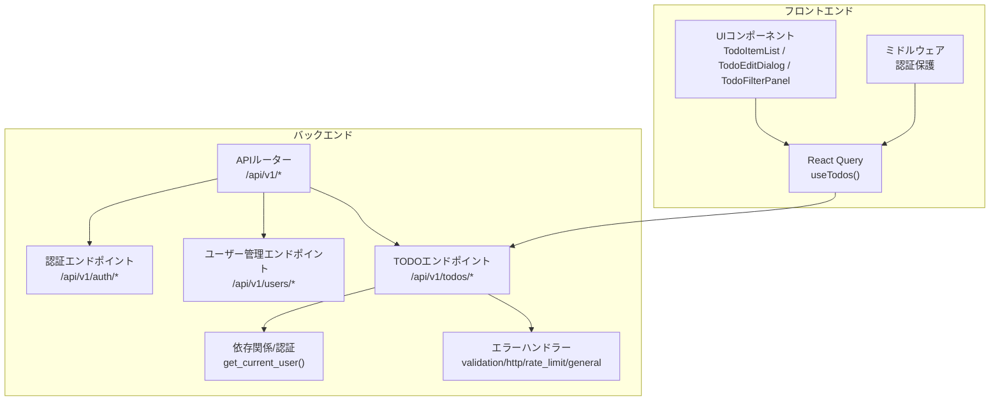
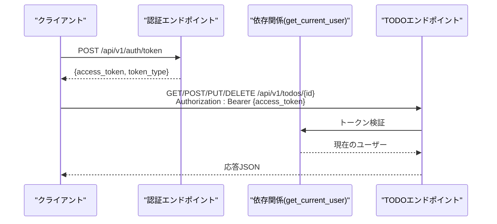
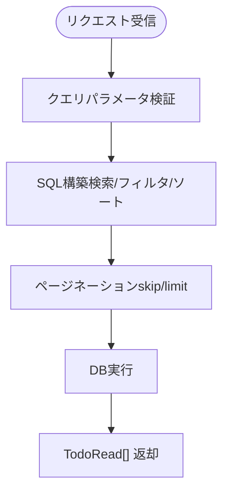
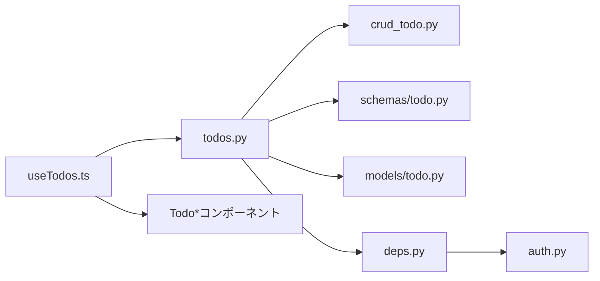

# TodoAPI

<cite>
**この文書で参照されるファイル**
- [backend/app/api/api_v1/endpoints/todos.py](file://backend/app/api/api_v1/endpoints/todos.py)
- [backend/app/schemas/todo.py](file://backend/app/schemas/todo.py)
- [backend/app/crud/crud_todo.py](file://backend/app/crud/crud_todo.py)
- [backend/app/models/todo.py](file://backend/app/models/todo.py)
- [backend/app/api/api_v1/api.py](file://backend/app/api/api_v1/api.py)
- [backend/app/api/deps.py](file://backend/app/api/deps.py)
- [backend/app/middleware/error_handler.py](file://backend/app/middleware/error_handler.py)
- [frontend/src/hooks/useTodos.ts](file://frontend/src/hooks/useTodos.ts)
- [frontend/src/app/_components/TodoItemList.tsx](file://frontend/src/app/_components/TodoItemList.tsx)
- [frontend/src/app/_components/TodoEditDialog.tsx](file://frontend/src/app/_components/TodoEditDialog.tsx)
- [frontend/src/app/_components/TodoFilterPanel.tsx](file://frontend/src/app/_components/TodoFilterPanel.tsx)
- [frontend/src/middleware.ts](file://frontend/src/middleware.ts)
</cite>

## 目次
1. [はじめに](#はじめに)
2. [プロジェクト構造](#プロジェクト構造)
3. [コアコンポーネント](#コアコンポーネント)
4. [アーキテクチャ概観](#アーキテクチャ概観)
5. [詳細コンポーネント分析](#詳細コンポーネント分析)
6. [依存関係分析](#依存関係分析)
7. [パフォーマンス考慮事項](#パフォーマンス考慮事項)
8. [トラブルシューティングガイド](#トラブルシューティングガイド)
9. [結論](#結論)
10. [付録](#付録)

## はじめに
本ドキュメントは、Todo管理関連のRESTful APIエンドポイントの詳細なリファレンスです。Todoの作成、読み取り、更新、削除、一覧表示機能に加え、高度なフィルタリング（検索、フィルター、ソート）、ページネーション、タグ管理、優先度設定、認証要件、エラーコード、フロントエンドでの実装パターンについて網羅的に解説します。

## プロジェクト構造
バックエンドはFastAPI + SQLModelで構成され、APIルーターはバージョン付きで管理されています。フロントエンドはNext.js + React Queryで構成され、認証フローはCookie/ローカルストレージによるトークン管理とミドルウェアによる保護が行われています。

**図の出典**
- [backend/app/api/api_v1/api.py:1-8](file://backend/app/api/api_v1/api.py#L1-L8)
- [backend/app/api/deps.py:1-37](file://backend/app/api/deps.py#L1-L37)
- [backend/app/middleware/error_handler.py:1-149](file://backend/app/middleware/error_handler.py#L1-L149)
- [frontend/src/hooks/useTodos.ts:1-119](file://frontend/src/hooks/useTodos.ts#L1-L119)
- [frontend/src/middleware.ts:1-35](file://frontend/src/middleware.ts#L1-L35)

**節の出典**
- [backend/app/api/api_v1/api.py:1-8](file://backend/app/api/api_v1/api.py#L1-L8)
- [backend/app/api/deps.py:1-37](file://backend/app/api/deps.py#L1-L37)
- [frontend/src/middleware.ts:1-35](file://frontend/src/middleware.ts#L1-L35)

## コアコンポーネント
- APIルーター
  - /api/v1/todos にTodoエンドポイントが定義されています。
- 認証
  - OAuth2 Bearerトークンによる認証。/api/v1/auth/token でアクセストークン取得。
- モデル/スキーマ
  - Todoモデルには優先度（高/中/低）、期限日、タグ（カンマ区切り文字列）が含まれます。
- CRUD
  - Todo一覧取得、件数取得、作成、更新、削除の操作が非同期で実装されています。

**節の出典**
- [backend/app/api/api_v1/endpoints/todos.py:1-102](file://backend/app/api/api_v1/endpoints/todos.py#L1-L102)
- [backend/app/schemas/todo.py:1-41](file://backend/app/schemas/todo.py#L1-L41)
- [backend/app/crud/crud_todo.py:1-152](file://backend/app/crud/crud_todo.py#L1-L152)
- [backend/app/models/todo.py:1-25](file://backend/app/models/todo.py#L1-L25)

## アーキテクチャ概観
APIの認証フローは以下の通りです。クライアントは /api/v1/auth/token でログインし、Bearerトークンを取得します。その後、/api/v1/todos へのリクエストにAuthorization: Bearerヘッダーを含めて実施します。

**図の出典**
- [backend/app/api/api_v1/endpoints/auth.py:36-54](file://backend/app/api/api_v1/endpoints/auth.py#L36-L54)
- [backend/app/api/deps.py:13-36](file://backend/app/api/deps.py#L13-L36)
- [backend/app/api/api_v1/endpoints/todos.py:59-101](file://backend/app/api/api_v1/endpoints/todos.py#L59-L101)

## 詳細コンポーネント分析

### API仕様：Todo一覧取得
- HTTPメソッド
  - GET
- URL
  - /api/v1/todos/
- 認証
  - 必須（Bearerトークン）
- クエリパラメータ
  - skip: 数値（0以上、デフォルト0）
  - limit: 数値（1～100、デフォルト100）
  - search: 文字列（部分一致）
  - is_completed: 真偽値（未完了/完了）
  - priority: "high"|"medium"|"low"
  - tags: カンマ区切り文字列（各タグは部分一致）
  - sort_by: "created_at"|"priority"|"due_date"（デフォルト"created_at"）
  - sort_order: "asc"|"desc"（デフォルト"desc"）
- 応答
  - 200 OK: TodoRead[]（JSON配列）

**図の出典**
- [backend/app/api/api_v1/endpoints/todos.py:32-57](file://backend/app/api/api_v1/endpoints/todos.py#L32-L57)
- [backend/app/crud/crud_todo.py:10-71](file://backend/app/crud/crud_todo.py#L10-L71)

**節の出典**
- [backend/app/api/api_v1/endpoints/todos.py:32-57](file://backend/app/api/api_v1/endpoints/todos.py#L32-L57)
- [backend/app/crud/crud_todo.py:10-71](file://backend/app/crud/crud_todo.py#L10-L71)

### API仕様：Todo件数取得
- HTTPメソッド
  - GET
- URL
  - /api/v1/todos/count
- 認証
  - 必須（Bearerトークン）
- クエリパラメータ
  - 同上（検索/フィルタ/ソート条件を適用）
- 応答
  - 200 OK: { total: number }

**節の出典**
- [backend/app/api/api_v1/endpoints/todos.py:13-30](file://backend/app/api/api_v1/endpoints/todos.py#L13-L30)
- [backend/app/crud/crud_todo.py:73-98](file://backend/app/crud/crud_todo.py#L73-L98)

### API仕様：Todo作成
- HTTPメソッド
  - POST
- URL
  - /api/v1/todos/
- 認証
  - 必須（Bearerトークン）
- リクエストボディ
  - TodoCreate（title, priority, due_date, tags）
- 応答
  - 201 Created: TodoRead

**節の出典**
- [backend/app/api/api_v1/endpoints/todos.py:59-67](file://backend/app/api/api_v1/endpoints/todos.py#L59-L67)
- [backend/app/schemas/todo.py:20-21](file://backend/app/schemas/todo.py#L20-L21)
- [backend/app/crud/crud_todo.py:100-105](file://backend/app/crud/crud_todo.py#L100-L105)

### API仕様：Todo更新
- HTTPメソッド
  - PUT
- URL
  - /api/v1/todos/{id}
- 認証
  - 必須（Bearerトークン）
- パスパラメータ
  - id: UUID
- リクエストボディ
  - TodoUpdate（title, is_completed, priority, due_date, tags）
- 応答
  - 200 OK: TodoRead
  - 404 Not Found: 存在しない場合

**節の出典**
- [backend/app/api/api_v1/endpoints/todos.py:69-89](file://backend/app/api/api_v1/endpoints/todos.py#L69-L89)
- [backend/app/schemas/todo.py:23-28](file://backend/app/schemas/todo.py#L23-L28)
- [backend/app/crud/crud_todo.py:107-142](file://backend/app/crud/crud_todo.py#L107-L142)

### API仕様：Todo削除
- HTTPメソッド
  - DELETE
- URL
  - /api/v1/todos/{id}
- 認証
  - 必須（Bearerトークン）
- パスパラメータ
  - id: UUID
- 応答
  - 200 OK: { status: "success" }
  - 404 Not Found: 存在しない場合

**節の出典**
- [backend/app/api/api_v1/endpoints/todos.py:91-101](file://backend/app/api/api_v1/endpoints/todos.py#L91-L101)
- [backend/app/crud/crud_todo.py:144-151](file://backend/app/crud/crud_todo.py#L144-L151)

### 認証フロー
- トークン取得
  - POST /api/v1/auth/token
  - 入力: OAuth2PasswordRequestForm（username/password）
  - 応答: { access_token, token_type }
- 保護ルート
  - /api/v1/todos/* にアクセスする際、Authorization: Bearer {access_token} を設定

**節の出典**
- [backend/app/api/api_v1/endpoints/auth.py:36-54](file://backend/app/api/api_v1/endpoints/auth.py#L36-L54)
- [backend/app/api/deps.py:11-36](file://backend/app/api/deps.py#L11-L36)

### データスキーマ
- PriorityEnum
  - "high"|"medium"|"low"
- TodoCreate
  - title（必須、最大255文字）、priority（デフォルト"low"）、due_date（任意）、tags（任意、最大500文字）
- TodoUpdate
  - 上記のオプションフィールド
- TodoRead
  - 上記に加え、id、user_id、created_at、updated_at

**節の出典**
- [backend/app/schemas/todo.py:7-41](file://backend/app/schemas/todo.py#L7-L41)

### フィルタリング・ソート・ページネーション
- 検索
  - titleの部分一致
- フィルタ
  - is_completed（真偽値）
  - priority（"high"|"medium"|"low"）
  - tags（カンマ区切り、各タグの部分一致）
- ソート
  - created_at（デフォルトdesc）
  - priority（高→中→低、asc/desc）
  - due_date（asc/desc）
- ページネーション
  - skip（0以上）、limit（1～100）

**節の出典**
- [backend/app/crud/crud_todo.py:22-71](file://backend/app/crud/crud_todo.py#L22-L71)
- [backend/app/api/api_v1/endpoints/todos.py:36-43](file://backend/app/api/api_v1/endpoints/todos.py#L36-L43)

### フロントエンド実装パターン
- React Query
  - useTodos(): Todo一覧、件数、CRUDミューテーションを管理
  - TodoFilters: 検索、ステータス、優先度、ソート、ページネーションパラメータ
- UIコンポーネント
  - TodoItemList: 表示、タグクリック、削除、編集ボタン
  - TodoEditDialog: 編集ダイアログ（タイトル、優先度、期限、タグ）
  - TodoFilterPanel: 検索バー、フィルタパネル、並び替え
- 認証保護
  - middleware.ts: 認証不要パス以外はCookieにトークンがあるか確認し、なければログインへリダイレクト

**節の出典**
- [frontend/src/hooks/useTodos.ts:1-119](file://frontend/src/hooks/useTodos.ts#L1-L119)
- [frontend/src/app/_components/TodoItemList.tsx:1-182](file://frontend/src/app/_components/TodoItemList.tsx#L1-L182)
- [frontend/src/app/_components/TodoEditDialog.tsx:1-137](file://frontend/src/app/_components/TodoEditDialog.tsx#L1-L137)
- [frontend/src/app/_components/TodoFilterPanel.tsx:1-105](file://frontend/src/app/_components/TodoFilterPanel.tsx#L1-L105)
- [frontend/src/middleware.ts:1-35](file://frontend/src/middleware.ts#L1-L35)

## 依存関係分析
- Todoエンドポイントは、DBセッション、現在のユーザー、CRUDモジュール、スキーマを介して動作します。
- 認証はOAuth2 Bearerトークンを経由し、get_current_user()によってユーザーIDを取得し、その存在を検証します。
- エラーハンドラーは、バリデーションエラー、HTTP例外、レート制限、その他の例外に対して統一されたレスポンスを返します。

**図の出典**
- [backend/app/api/api_v1/endpoints/todos.py:1-102](file://backend/app/api/api_v1/endpoints/todos.py#L1-L102)
- [backend/app/crud/crud_todo.py:1-152](file://backend/app/crud/crud_todo.py#L1-L152)
- [backend/app/schemas/todo.py:1-41](file://backend/app/schemas/todo.py#L1-L41)
- [backend/app/models/todo.py:1-25](file://backend/app/models/todo.py#L1-L25)
- [backend/app/api/deps.py:1-37](file://backend/app/api/deps.py#L1-L37)
- [frontend/src/hooks/useTodos.ts:1-119](file://frontend/src/hooks/useTodos.ts#L1-L119)

**節の出典**
- [backend/app/api/api_v1/endpoints/todos.py:1-102](file://backend/app/api/api_v1/endpoints/todos.py#L1-L102)
- [backend/app/api/deps.py:1-37](file://backend/app/api/deps.py#L1-L37)
- [frontend/src/hooks/useTodos.ts:1-119](file://frontend/src/hooks/useTodos.ts#L1-L119)

## パフォーマンス考慮事項
- ソートとフィルタ
  - priority/due_date/created_atにインデックスが設定されており、適切なクエリ設計により効率的に取得できます。
- ページネーション
  - limitの上限（100）を設けることで、大量データの取得を防ぎます。
- タグフィルタ
  - カンマ区切りの複数タグを部分一致でフィルタリングするため、必要に応じて前方一致や完全一致のオプションを検討すると良いでしょう。

**節の出典**
- [backend/app/models/todo.py:12-17](file://backend/app/models/todo.py#L12-L17)
- [backend/app/api/api_v1/endpoints/todos.py:36-43](file://backend/app/api/api_v1/endpoints/todos.py#L36-L43)

## トラブルシューティングガイド
- 認証エラー（401 Unauthorized）
  - 有効なBearerトークンをAuthorizationヘッダーに含める
  - トークンの期限切れや無効な形式には注意
- 検索/フィルタの結果が空
  - search/tagsは部分一致であるため、より広いキーワードを試す
  - is_completed/priorityの組み合わせによって該当データが存在しない場合があります
- 422 Validation Error
  - TodoCreate/Updateのフィールド長や型に誤りがないか確認
  - priorityは"high"|"medium"|"low"のいずれかであること
- 429 Too Many Requests
  - 認証系エンドポイントにレート制限が適用されているため、一定時間待ってから再度お試しください

**節の出典**
- [backend/app/middleware/error_handler.py:15-49](file://backend/app/middleware/error_handler.py#L15-L49)
- [backend/app/api/api_v1/endpoints/auth.py:36-54](file://backend/app/api/api_v1/endpoints/auth.py#L36-L54)
- [backend/app/schemas/todo.py:13-28](file://backend/app/schemas/todo.py#L13-L28)

## 結論
本APIは、Todo管理の基本操作に加え、高度なフィルタリング、ページネーション、タグ管理、優先度設定を提供しており、認証・エラーハンドリングも統一された形で実装されています。フロントエンドではReact QueryとUIコンポーネントを用いて、直感的に操作できるインターフェースが提供されています。

## 付録
- 使用例（リクエスト/レスポンスの具体的な形式）
  - 一覧取得
    - GET /api/v1/todos/?search=プロジェクト&is_completed=false&priority=high&sort_by=priority&sort_order=desc&skip=0&limit=50
    - 200 OK: [ { id, title, is_completed, priority, due_date, tags, created_at, updated_at, user_id }, ... ]
  - 件数取得
    - GET /api/v1/todos/count?tags=タグ1,タグ2
    - 200 OK: { total: 3 }
  - 作成
    - POST /api/v1/todos/
    - 201 Created: { id, title, is_completed, priority, due_date, tags, created_at, updated_at, user_id }
  - 更新
    - PUT /api/v1/todos/{id}
    - 200 OK: { id, title, is_completed, priority, due_date, tags, created_at, updated_at, user_id }
  - 削除
    - DELETE /api/v1/todos/{id}
    - 200 OK: { status: "success" }

- パラメータバリデーションルール
  - TodoCreate/Update
    - title: 必須、最大255文字
    - priority: "high"|"medium"|"low"
    - due_date: 日時（任意）
    - tags: 最大500文字（カンマ区切り）
  - Todo一覧
    - skip: 0以上
    - limit: 1～100
    - sort_by: "created_at"|"priority"|"due_date"
    - sort_order: "asc"|"desc"

- エラーコード
  - 400: 不正なリクエスト
  - 401: 認証エラー
  - 403: 権限エラー
  - 404: リソースなし
  - 409: リソースの競合
  - 422: 検証エラー
  - 429: レート制限超過
  - 500: 内部サーバーエラー

- フロントエンドでの実装パターン
  - useTodos()でクエリパラメータを動的に構築し、一覧と件数を取得
  - TodoFilterPanelで検索・フィルタ・ソートを操作
  - TodoEditDialogで編集ダイアログを表示
  - middleware.tsで認証保護を適用

**節の出典**
- [backend/app/api/api_v1/endpoints/todos.py:32-101](file://backend/app/api/api_v1/endpoints/todos.py#L32-L101)
- [backend/app/schemas/todo.py:13-41](file://backend/app/schemas/todo.py#L13-L41)
- [frontend/src/hooks/useTodos.ts:26-119](file://frontend/src/hooks/useTodos.ts#L26-L119)
- [frontend/src/app/_components/TodoFilterPanel.tsx:25-104](file://frontend/src/app/_components/TodoFilterPanel.tsx#L25-L104)
- [frontend/src/app/_components/TodoEditDialog.tsx:38-136](file://frontend/src/app/_components/TodoEditDialog.tsx#L38-L136)
- [frontend/src/middleware.ts:1-35](file://frontend/src/middleware.ts#L1-L35)