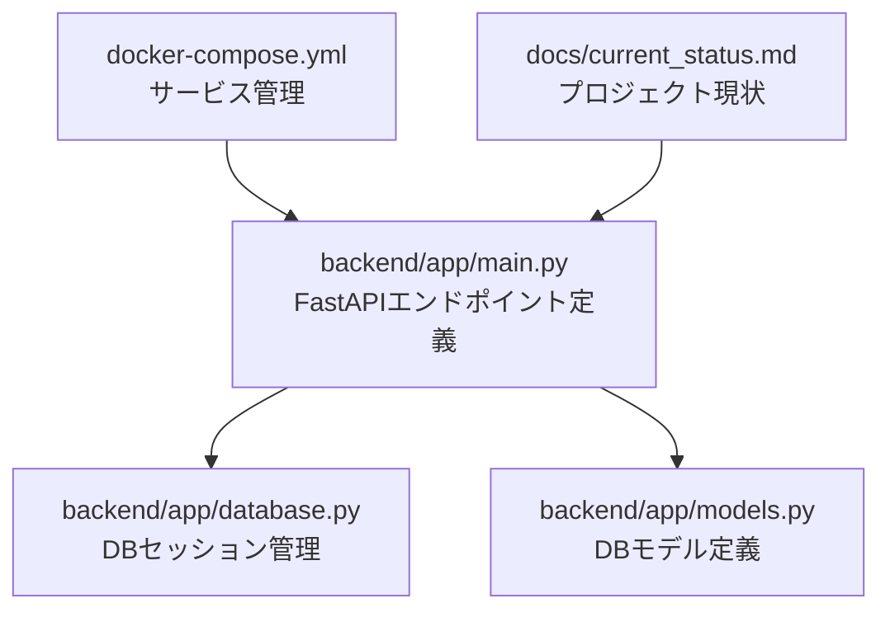
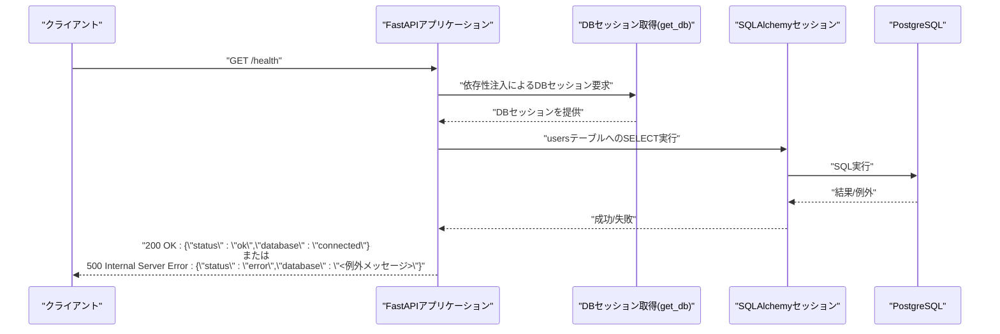
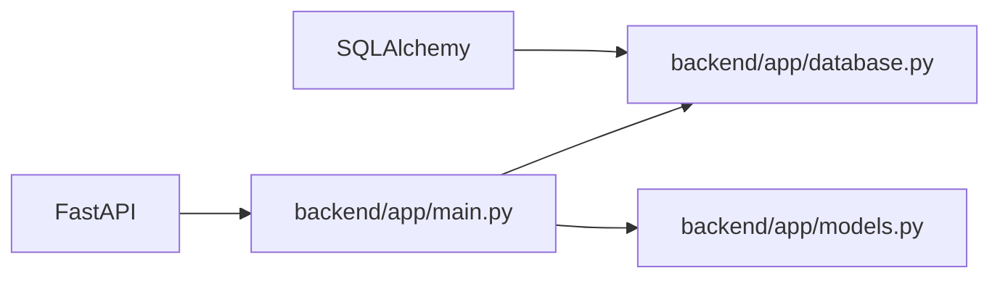

# ヘルスチェックAPI

<cite>
**本文で参照するファイル**
- [backend/app/main.py](file://backend/app/main.py)
- [backend/app/database.py](file://backend/app/database.py)
- [backend/app/models.py](file://backend/app/models.py)
- [docker-compose.yml](file://docker-compose.yml)
- [docs/current_status.md](file://docs/current_status.md)
</cite>

## 目次
1. [はじめに](#はじめに)
2. [プロジェクト構造](#プロジェクト構造)
3. [コアコンポーネント](#コアコンポーネント)
4. [アーキテクチャ概観](#アーキテクチャ概観)
5. [詳細コンポーネント分析](#詳細コンポーネント分析)
6. [依存関係分析](#依存関係分析)
7. [パフォーマンスに関する考慮事項](#パフォーマンスに関する考慮事項)
8. [トラブルシューティングガイド](#トラブルシューティングガイド)
9. [運用・監視連携の具体例](#運用監視連携の具体例)
10. [結論](#結論)

## はじめに
本ドキュメントは、TodoプロジェクトにおけるヘルスチェックAPIエンドポイント（/health）について、その目的、動作仕様、レスポンス形式、ステータスコード、運用監視やロードバランサとの連携方法、障害時の対応手順、Dockerコンテナ起動確認およびCI/CDパイプラインでの使用例を網羅的に解説します。エンドポイントはHTTP GETメソッドでアクセスでき、主にデータベース接続の確認とサーバー稼働状況の監視に使用されます。

## プロジェクト構造
- APIエンドポイントはFastAPIフレームワーク上で実装されています。
- /healthエンドポイントはアプリケーションルート直下に定義されており、データベース接続の簡易確認を行うための最小限のロジックが含まれます。
- Docker Composeによるサービス管理が行われており、コンテナ起動後の起動確認にも活用できます。



**図の出典**
- [backend/app/main.py:15-22](file://backend/app/main.py#L15-L22)
- [backend/app/database.py:11-16](file://backend/app/database.py#L11-L16)
- [backend/app/models.py](file://backend/app/models.py)
- [docker-compose.yml](file://docker-compose.yml)
- [docs/current_status.md:1-55](file://docs/current_status.md#L1-L55)

**節の出典**
- [docs/current_status.md:1-55](file://docs/current_status.md#L1-L55)

## コアコンポーネント
- /healthエンドポイント
  - HTTPメソッド: GET
  - 処理内容: DBセッションを取得し、usersテーブルに対してSELECTクエリを実行して接続確認を行う。
  - 成功時: {"status": "ok", "database": "connected"}を返す。
  - 失敗時: {"status": "error", "database": "<例外メッセージ>"}を返す。
- DBセッション管理
  - get_db関数によりFastAPIの依存性注入経由でDBセッションが提供され、処理終了後にクローズされる。
- DBモデル
  - usersテーブルの存在を前提としているため、モデル定義が適切にマッピングされている必要があります。

**節の出典**
- [backend/app/main.py:15-22](file://backend/app/main.py#L15-L22)
- [backend/app/database.py:11-16](file://backend/app/database.py#L11-L16)
- [backend/app/models.py](file://backend/app/models.py)

## アーキテクチャ概観
以下は、/healthエンドポイントのリクエスト/レスポンスフローです。



**図の出典**
- [backend/app/main.py:15-22](file://backend/app/main.py#L15-L22)
- [backend/app/database.py:11-16](file://backend/app/database.py#L11-L16)

## 詳細コンポーネント分析

### /healthエンドポイントのロジック
- 実装ポイント
  - DB接続確認: usersテーブルに対してSELECTクエリを実行。
  - 例外処理: 例外発生時はその内容を文字列化してレスポンスに含める。
- 応答形式
  - 成功時: {"status": "ok", "database": "connected"}
  - 失敗時: {"status": "error", "database": "<例外メッセージ>"}
- HTTPステータスコード
  - 成功時: 200 OK
  - 失敗時: 500 Internal Server Error（FastAPIのデフォルト挙動）

```mermaid
flowchart TD
Start(["リクエスト受信: GET /health"]) --> TryDB["DBセッション取得"]
TryDB --> ExecSel["usersテーブル SELECT 実行"]
ExecSel --> ExecOK{"クエリ成功？"}
ExecOK --> |はい| OkResp["レスポンス: {\"status\":\"ok\",\"database\":\"connected\"}"]
ExecOK --> |いいえ| ErrResp["レスポンス: {\"status\":\"error\",\"database\":\"<例外メッセージ>\"}"]
OkResp --> End(["終了"])
ErrResp --> End
```

**図の出典**
- [backend/app/main.py:15-22](file://backend/app/main.py#L15-L22)

**節の出典**
- [backend/app/main.py:15-22](file://backend/app/main.py#L15-L22)

### DBセッション管理
- get_db関数はFastAPIの依存性注入により呼び出され、DBセッションを生成・提供し、finally節でクローズされる。
- この設計により、/healthエンドポイントも同様のセッションライフサイクルに従う。

**節の出典**
- [backend/app/database.py:11-16](file://backend/app/database.py#L11-L16)

### DBモデル（usersテーブル）
- /healthエンドポイントはusersテーブルの存在を前提としているため、モデル定義が正しくマッピングされている必要があります。
- 本プロジェクトの現状文書によれば、PostgreSQLが利用可能であり、Docker Composeで管理されているため、DB準備が整っていれば問題なく動作します。

**節の出典**
- [docs/current_status.md:21-24](file://docs/current_status.md#L21-L24)

## 依存関係分析
- /healthエンドポイントは以下のモジュールに依存しています。
  - FastAPI: エンドポイント定義とHTTP処理
  - SQLAlchemy: DBセッション管理
  - usersテーブル: ORMモデル（DBスキーマ）



**図の出典**
- [backend/app/main.py:15-22](file://backend/app/main.py#L15-L22)
- [backend/app/database.py:11-16](file://backend/app/database.py#L11-L16)
- [backend/app/models.py](file://backend/app/models.py)

**節の出典**
- [backend/app/main.py:15-22](file://backend/app/main.py#L15-L22)
- [backend/app/database.py:11-16](file://backend/app/database.py#L11-L16)
- [backend/app/models.py](file://backend/app/models.py)

## パフォーマンスに関する考慮事項
- /healthエンドポイントは軽量なSELECTクエリのみを実行するため、通常の負荷に与える影響は最小限です。
- ただし、DB接続プールやPostgreSQLの負荷状況によっては、エンドポイント自体のレイテンシが変動する可能性があります。監視頻度は運用基準に従って調整してください。

## トラブルシューティングガイド
- 異常時のレスポンス例
  - {"status":"error","database":"<例外メッセージ>"}
  - 例外メッセージには、DB接続エラー、SQL実行エラー、またはORM関連のエラー内容が含まれます。
- 常に200 OKが返らない場合の原因候補
  - DB接続情報（ホスト、ポート、認証情報）の不備
  - usersテーブルが存在しない（スキーマ未適用）
  - DBサーバーの停止またはネットワーク不通
  - Dockerコンテナ間のネットワーク設定ミス
- すぐに確認できる手順
  - /healthエンドポイントにGETリクエストを送信し、レスポンスのdatabaseフィールドを確認
  - docker-compose経由でサービス全体の起動状況を確認
  - DBコンテナが正常に起動しているか、ログを確認

**節の出典**
- [backend/app/main.py:15-22](file://backend/app/main.py#L15-L22)
- [docker-compose.yml](file://docker-compose.yml)

## 運用・監視連携の具体例
- ロードバランサでの使用
  - HTTP GET /healthを定期的に実行し、200 OK以外の場合は対象サーバーをトラフィックから除外
  - 応答時間のしきい値を設定し、遅延が継続する場合は警告を発報
- 監視ツールとの連携
  - Prometheus/Alertmanager: /healthエンドポイントをHTTPエクスポーターとして登録し、可用性と応答時間のメトリクスを収集
  - Datadog/NewRelic: HTTPモニタリングで/healthをカスタムチェックとして設定
- 障害時の対応手順
  - 200 OKが継続的に得られない場合: DB再接続試行、DBコンテナ再起動、ネットワーク確認
  - databaseフィールドにエラー内容が含まれる場合: DBのエラーログを確認し、スキーマ適用や権限の再確認を行う
- Dockerコンテナの起動確認
  - docker-compose up -d 後、curlまたはブラウザで http://<ホスト>:<ポート>/health にアクセスし、200 OKかつdatabaseが"connected"であることを確認
- CI/CDパイプラインでの使用例
  - デプロイ完了後、/healthエンドポイントの200 OKを待機条件として追加
  - テストステップでcurlまたはHTTPリクエストツールを使ってレスポンスをバリデーション

**節の出典**
- [docs/current_status.md:42-55](file://docs/current_status.md#L42-L55)
- [docker-compose.yml](file://docker-compose.yml)

## 結論
/healthエンドポイントは、Todoプロジェクトにおける基本的な可用性監視のためのシンプルかつ効果的な手段です。FastAPIの依存性注入とSQLAlchemyのDBセッション管理により、軽量なDB接続確認が可能となっています。運用・監視・ロードバランサ連携においては、200 OKの有無とdatabaseフィールドの内容をもとに判断することが鍵となります。障害発生時には、レスポンスのdatabaseフィールドに記録されたエラー内容と、DBコンテナの起動状況、ネットワーク設定を重点的に確認してください。