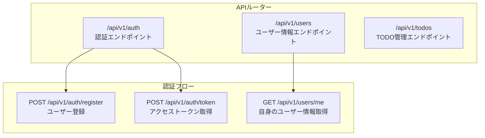
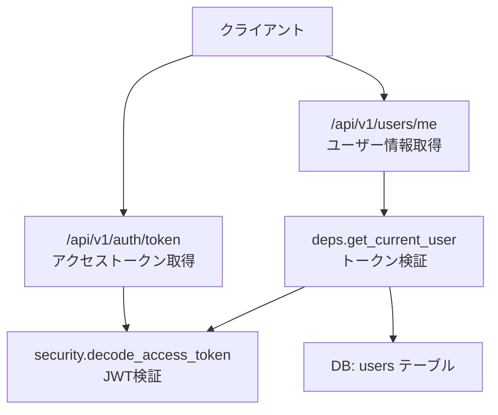
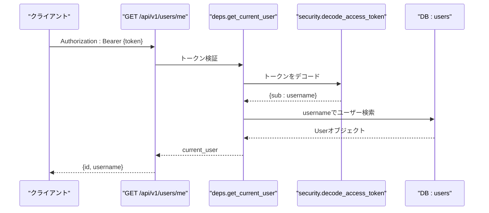
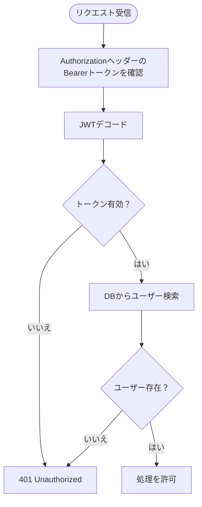
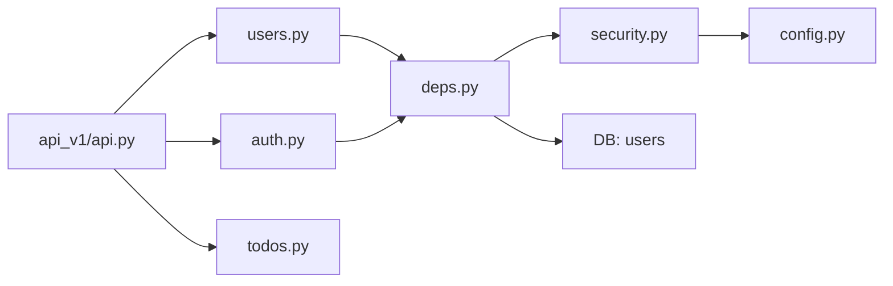

# ユーザーAPI

<cite>
**この文書で参照されているファイル**
- [backend/app/api/api_v1/endpoints/users.py](file://backend/app/api/api_v1/endpoints/users.py)
- [backend/app/api/api_v1/endpoints/auth.py](file://backend/app/api/api_v1/endpoints/auth.py)
- [backend/app/api/deps.py](file://backend/app/api/deps.py)
- [backend/app/core/security.py](file://backend/app/core/security.py)
- [backend/app/core/config.py](file://backend/app/core/config.py)
- [backend/app/schemas/user.py](file://backend/app/schemas/user.py)
- [backend/app/models/user.py](file://backend/app/models/user.py)
- [backend/app/crud/crud_user.py](file://backend/app/crud/crud_user.py)
- [backend/app/api/api_v1/api.py](file://backend/app/api/api_v1/api.py)
- [backend/app/main.py](file://backend/app/main.py)
</cite>

## 目次
1. [はじめに](#はじめに)
2. [プロジェクト構造](#プロジェクト構造)
3. [コアコンポーネント](#コアコンポーネント)
4. [アーキテクチャ概要](#アーキテクチャ概要)
5. [詳細コンポーネント分析](#詳細コンポーネント分析)
6. [依存関係分析](#依存関係分析)
7. [パフォーマンス考慮事項](#パフォーマンス考慮事項)
8. [トラブルシューティングガイド](#トラブルシューティングガイド)
9. [結論](#結論)

## はじめに
本ドキュメントは、Todoアプリケーションにおける「ユーザー情報管理」のRESTful APIエンドポイントについての詳細仕様を提供します。特に以下のエンドポイントを網羅的に解説します：
- ユーザー情報取得エンドポイント：GET /api/v1/users/me
- ユーザー情報更新エンドポイント：PUT /api/v1/users/me（現状未実装）
- ユーザー削除エンドポイント：DELETE /api/v1/users/me（現状未実装）
- 認証トークン管理、セッション有効期限、再認証プロセス

また、保護されたフィールド（例：パスワードハッシュ）の扱い方や、認証フロー、レスポンススキーマについても説明します。

## プロジェクト構造
バックエンドはFastAPIフレームワークを採用し、APIバージョン管理として「/api/v1」プレフィックスが使用されています。ユーザー関連のエンドポイントは「/api/v1/users」配下に配置され、認証はJWT BearerトークンによるOAuth2パスワードフローで行われます。

**図の出典**
- [backend/app/api/api_v1/api.py:1-8](file://backend/app/api/api_v1/api.py#L1-L8)
- [backend/app/api/api_v1/endpoints/auth.py:1-53](file://backend/app/api/api_v1/endpoints/auth.py#L1-L53)
- [backend/app/api/api_v1/endpoints/users.py:1-14](file://backend/app/api/api_v1/endpoints/users.py#L1-L14)

**節の出典**
- [backend/app/api/api_v1/api.py:1-8](file://backend/app/api/api_v1/api.py#L1-L8)
- [backend/app/main.py:128-128](file://backend/app/main.py#L128-L128)

## コアコンポーネント
- 認証ルーター（/api/v1/auth）：ユーザー登録、アクセストークン取得（JWT Bearer）を行う。
- ユーザールーター（/api/v1/users）：現在のユーザー情報取得（GET /me）のみ実装済み。
- 依存関係ヘルパー（deps.py）：OAuth2 Bearerトークンの検証、現在のユーザー取得。
- セキュリティユーティリティ（security.py）：パスワードハッシュ化、JWTトークンの生成・検証。
- 設定（config.py）：SECRET_KEY、アルゴリズム、アクセストークン有効期限、レートリミットなど。
- スキーマ（schemas/user.py）：UserBase、UserCreate、UserRead（レスポンス用）。
- モデル（models/user.py）：DBテーブル定義、パスワードハッシュフィールド。
- CRUD（crud/crud_user.py）：ユーザーの登録、ユーザー名での検索。

**節の出典**
- [backend/app/api/api_v1/endpoints/auth.py:1-53](file://backend/app/api/api_v1/endpoints/auth.py#L1-L53)
- [backend/app/api/api_v1/endpoints/users.py:1-14](file://backend/app/api/api_v1/endpoints/users.py#L1-L14)
- [backend/app/api/deps.py:1-31](file://backend/app/api/deps.py#L1-L31)
- [backend/app/core/security.py:1-35](file://backend/app/core/security.py#L1-L35)
- [backend/app/core/config.py:1-73](file://backend/app/core/config.py#L1-L73)
- [backend/app/schemas/user.py:1-12](file://backend/app/schemas/user.py#L1-L12)
- [backend/app/models/user.py:1-16](file://backend/app/models/user.py#L1-L16)
- [backend/app/crud/crud_user.py:1-22](file://backend/app/crud/crud_user.py#L1-L22)

## アーキテクチャ概要
認証・ユーザー管理の全体像は以下の通りです。JWT Bearer認証がOpenAPIセキュリティスキーマとして定義され、各エンドポイントは依存関係ヘルパーを通じて現在のユーザーを取得します。

**図の出典**
- [backend/app/main.py:73-102](file://backend/app/main.py#L73-L102)
- [backend/app/api/deps.py:10-31](file://backend/app/api/deps.py#L10-L31)
- [backend/app/core/security.py:29-35](file://backend/app/core/security.py#L29-L35)
- [backend/app/models/user.py:12-13](file://backend/app/models/user.py#L12-L13)

## 詳細コンポーネント分析

### GET /api/v1/users/me（ユーザー情報取得）
- 認証要件
  - Bearerトークンが必要。トークンはAuthorization: Bearer {token}形式で送信。
  - トークンの検証はdeps.get_current_userが行い、失敗時は401エラー。
- 処理フロー
  - 依存関係：dbセッション、OAuth2 Bearerトークン。
  - トークンからユーザー名を抽出し、DBから該当ユーザーを取得。
  - 見つからない場合は401エラー。
- 応答スキーマ（UserRead）
  - id: UUID（レスポンスに含まれる）
  - username: 文字列（レスポンスに含まれる）
  - 注意：hashed_password（パスワードハッシュ）はレスポンスには含まれない（保護されたフィールド）
- 保護されたフィールド
  - hashed_passwordはDBには保存されますが、APIレスポンスには含まれません。

**図の出典**
- [backend/app/api/deps.py:12-31](file://backend/app/api/deps.py#L12-L31)
- [backend/app/core/security.py:29-35](file://backend/app/core/security.py#L29-L35)
- [backend/app/models/user.py:12-13](file://backend/app/models/user.py#L12-L13)
- [backend/app/schemas/user.py:10-12](file://backend/app/schemas/user.py#L10-L12)

**節の出典**
- [backend/app/api/api_v1/endpoints/users.py:9-14](file://backend/app/api/api_v1/endpoints/users.py#L9-L14)
- [backend/app/api/deps.py:12-31](file://backend/app/api/deps.py#L12-L31)
- [backend/app/schemas/user.py:10-12](file://backend/app/schemas/user.py#L10-L12)
- [backend/app/models/user.py:12-13](file://backend/app/models/user.py#L12-L13)

### PUT /api/v1/users/me（ユーザー情報更新）【現状未実装】
- 現状の実装
  - 対応するエンドポイントは未実装です。
- 今後の実装案（提案）
  - 認証要件：同上（Bearerトークン必須）。
  - 入力バリデーション：usernameの重複チェック、既存ユーザー名の変更可否。
  - パスワード変更処理：現在のパスワード検証、新しいパスワードのハッシュ化。
  - プロフィール更新：usernameなどの基本情報更新。
  - 応答スキーマ：UserRead（変更後のユーザー情報）。
- 保護されたフィールド
  - hashed_passwordは更新処理経路で変更しない（内部的にハッシュ化された値のみ扱う）。

備考：現時点ではこのエンドポイントは利用できません。実装予定の詳細については、開発チームにお問い合わせください。

### DELETE /api/v1/users/me（ユーザー削除）【現状未実装】
- 現状の実装
  - 対応するエンドポイントは未実装です。
- 今後の実装案（提案）
  - 認証要件：同上（Bearerトークン必須）。
  - 削除プロセス：本人確認（現在のユーザー）に基づく削除。
  - データクリーンアップ：関連するtodosレコードの処理（論理削除または物理削除）。
  - 確認ダイアログ：フロントエンドでユーザーに削除の確認を求めるUIを提供。
  - 応答スキーマ：削除結果を示すJSON（例：{ "status": "success" }）。
- 保護されたフィールド
  - hashed_passwordは削除対象外（DBから物理削除される）。

備考：現時点ではこのエンドポイントは利用できません。実装予定の詳細については、開発チームにお問い合わせください。

### 認証トークン管理、セッション有効期限、再認証プロセス
- トークン管理
  - JWT Bearerトークンを使用。認証エンドポイントはPOST /api/v1/auth/token。
  - トークンの有効期限はACCESS_TOKEN_EXPIRE_MINUTESで設定可能。
- 有効期限
  - トークン生成時にexpを設定し、期限切れの場合は401エラー。
- 再認証プロセス
  - トークンが期限切れまたは無効な場合、再度ログイン（/api/v1/auth/token）が必要。
- OpenAPIセキュリティスキーマ
  - BearerAuthがOpenAPIに定義されており、Swagger/UI上で認証を設定可能。

**図の出典**
- [backend/app/api/deps.py:12-31](file://backend/app/api/deps.py#L12-L31)
- [backend/app/core/security.py:29-35](file://backend/app/core/security.py#L29-L35)

**節の出典**
- [backend/app/api/api_v1/endpoints/auth.py:34-53](file://backend/app/api/api_v1/endpoints/auth.py#L34-L53)
- [backend/app/core/config.py:51-53](file://backend/app/core/config.py#L51-L53)
- [backend/app/main.py:73-102](file://backend/app/main.py#L73-L102)

## 依存関係分析
- APIルーターのinclude
  - /api/v1/auth、/api/v1/users、/api/v1/todosが統合。
- 認証依存関係
  - OAuth2PasswordBearerがtokenUrlとして「/api/v1/auth/token」を使用。
  - deps.get_current_userがsecurity.decode_access_tokenとcrud_user.get_user_by_usernameに依存。
- 設定依存
  - SECRET_KEY、ALGORITHM、ACCESS_TOKEN_EXPIRE_MINUTES、RATE_LIMIT_*が設定で管理。

**図の出典**
- [backend/app/api/api_v1/api.py:1-8](file://backend/app/api/api_v1/api.py#L1-L8)
- [backend/app/api/deps.py:10-31](file://backend/app/api/deps.py#L10-L31)
- [backend/app/core/security.py:1-35](file://backend/app/core/security.py#L1-L35)
- [backend/app/core/config.py:51-53](file://backend/app/core/config.py#L51-L53)

**節の出典**
- [backend/app/api/api_v1/api.py:1-8](file://backend/app/api/api_v1/api.py#L1-L8)
- [backend/app/api/deps.py:10-31](file://backend/app/api/deps.py#L10-L31)

## パフォーマンス考慮事項
- トークン検証のオーバーヘッド
  - 各リクエストでJWTデコードとDB検索が発生するため、キャッシュ戦略（例：Redis）を検討。
- DBクエリ
  - usersテーブルへの単純なusername検索はインデックスにより高速だが、頻繁な更新は考慮。
- トークン有効期限
  - 短い有効期限はセキュリティ向上だが、認可エラーの頻発を招く可能性あり。
- レート制限
  - 認証・登録エンドポイントにはレートリミットが適用されているため、API利用に注意。

## トラブルシューティングガイド
- 401 Unauthorized
  - トークンが無効、期限切れ、またはAuthorizationヘッダーが不足している。
  - 再ログインし、正しいBearerトークンを使用。
- 404 Not Found（ユーザー情報取得時）
  - DBに該当ユーザーが存在しない。ユーザーが削除された可能性。
- 500 Internal Server Error
  - JWTデコードエラー、DB接続エラー、その他のサーバーエラー。
  - ログを確認し、設定（SECRET_KEY、DB接続文字列）を再確認。

**節の出典**
- [backend/app/api/deps.py:17-30](file://backend/app/api/deps.py#L17-L30)
- [backend/app/core/security.py:33-35](file://backend/app/core/security.py#L33-L35)
- [backend/app/main.py:67-71](file://backend/app/main.py#L67-L71)

## 結論
- 現状、GET /api/v1/users/me（ユーザー情報取得）のみが実装されており、PUT（更新）およびDELETE（削除）エンドポイントは未実装です。
- 認証はJWT BearerトークンによるOAuth2パスワードフローで行われ、セキュリティ設定（SECRET_KEY、アルゴリズム、有効期限）はconfig.pyで管理されています。
- 保護されたフィールド（hashed_password）はレスポンスには含まれず、DB内でのみ保持されます。
- 今後の開発では、PUT/DELETEエンドポイントの実装、バリデーションルール、パスワード変更処理、データクリーンアップ、確認ダイアログのフロントエンド連携を推奨します。