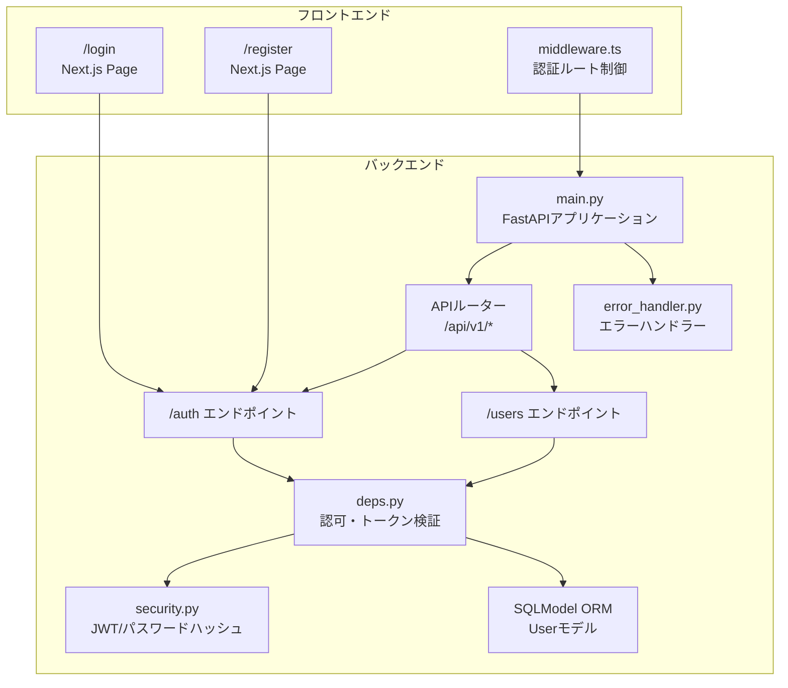
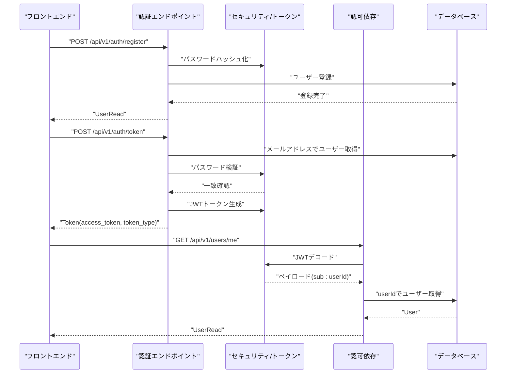
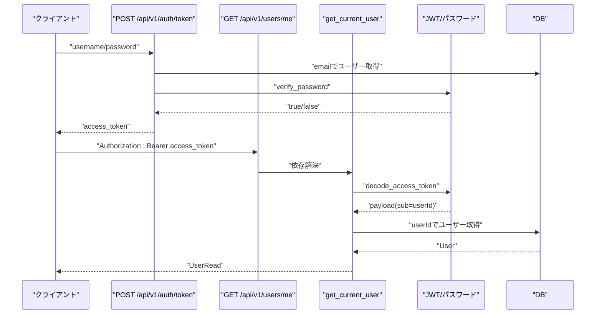
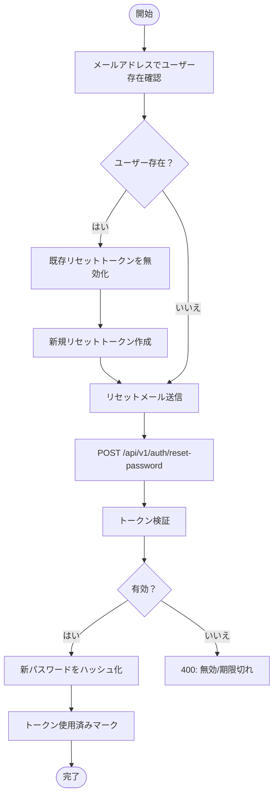
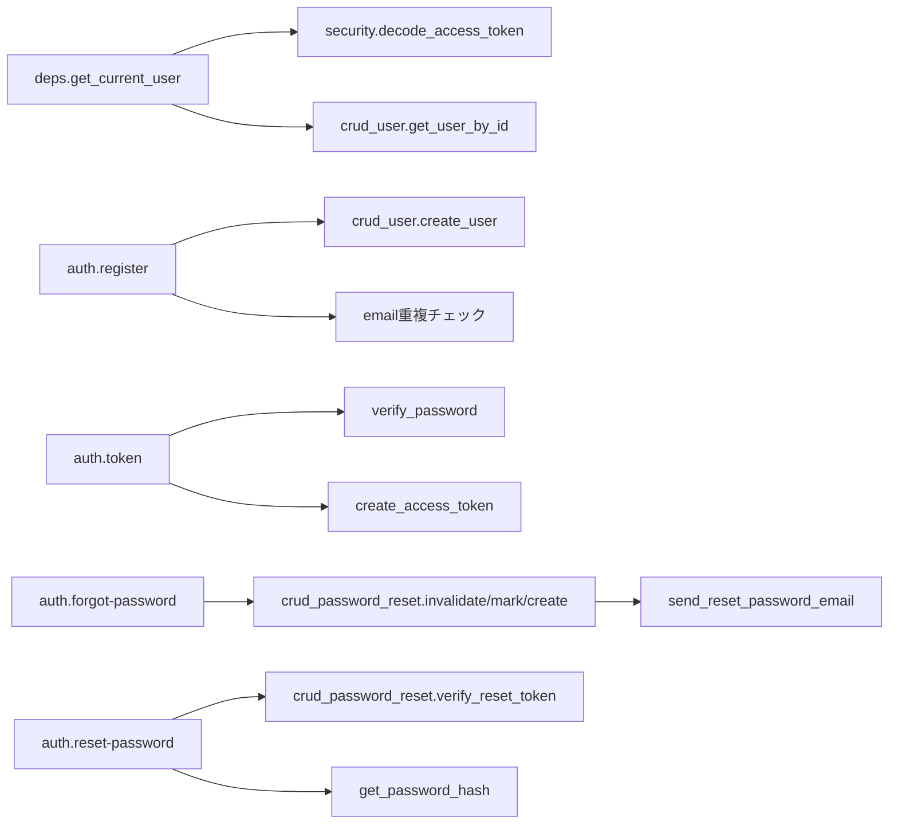

# ユーザーAPI

<cite>
**このドキュメントで参照されているファイル**
- [backend/app/api/api_v1/endpoints/users.py](file://backend/app/api/api_v1/endpoints/users.py)
- [backend/app/api/api_v1/endpoints/auth.py](file://backend/app/api/api_v1/endpoints/auth.py)
- [backend/app/api/deps.py](file://backend/app/api/deps.py)
- [backend/app/core/security.py](file://backend/app/core/security.py)
- [backend/app/models/user.py](file://backend/app/models/user.py)
- [backend/app/schemas/user.py](file://backend/app/schemas/user.py)
- [backend/app/schemas/token.py](file://backend/app/schemas/token.py)
- [backend/app/middleware/error_handler.py](file://backend/app/middleware/error_handler.py)
- [backend/app/main.py](file://backend/app/main.py)
- [frontend/src/app/login/page.tsx](file://frontend/src/app/login/page.tsx)
- [frontend/src/app/register/page.tsx](file://frontend/src/app/register/page.tsx)
- [frontend/src/middleware.ts](file://frontend/src/middleware.ts)
</cite>

## 目次
1. [はじめに](#はじめに)
2. [プロジェクト構造](#プロジェクト構造)
3. [コアコンポーネント](#コアコンポーネント)
4. [アーキテクチャ概観](#アーキテクチャ概観)
5. [詳細コンポーネント分析](#詳細コンポーネント分析)
6. [依存関係分析](#依存関係分析)
7. [パフォーマンス考慮事項](#パフォーマンス考慮事項)
8. [トラブルシューティングガイド](#トラブルシューティングガイド)
9. [結論](#結論)

## はじめに
本ドキュメントは、Todoアプリケーションにおける「ユーザー管理」関連のRESTful APIエンドポイントの詳細なリファレンスです。主に以下の機能を網羅します：
- 現在のユーザー情報取得（GET /api/v1/users/me）
- JWT認証トークンを使用した認可プロセス
- 認証・ユーザー権限の検証フロー
- パスワード変更機能（Forgot/Reset）
- リクエスト/レスポンススキーマ、認証要件、エラーコード
- フロントエンドでの実装パターン

本APIはFastAPIで実装されており、JWT Bearer認証を用います。エラーハンドリングは共通のミドルウェアによって一貫した形式で返却されます。

## プロジェクト構造
バックエンドはFastAPI、ORMとしてSQLModelを使用。認証・ユーザー管理・エラーハンドリングの各層が分離されています。フロントエンドはNext.jsで実装され、認証不要なページ（ログイン/登録/パスワードリセット）と認証が必要なページ（Todo一覧など）があります。

```mermaid
graph TB
subgraph "フロントエンド"
FE_Login["/login<br/>Next.js Page"]
FE_Register["/register<br/>Next.js Page"]
FE_MW["middleware.ts<br/>認証ルート制御"]
end
subgraph "バックエンド"
BE_Main["main.py<br/>FastAPIアプリケーション"]
BE_Router["APIルーター<br/>/api/v1/*"]
BE_Auth["/auth エンドポイント"]
BE_Users["/users エンドポイント"]
BE_Deps["deps.py<br/>認可・トークン検証"]
BE_Security["security.py<br/>JWT/パスワードハッシュ"]
BE_DB["SQLModel ORM<br/>Userモデル"]
BE_Err["error_handler.py<br/>エラーハンドラー"]
end
FE_Login --> BE_Auth
FE_Register --> BE_Auth
FE_MW --> BE_Main
BE_Main --> BE_Router
BE_Router --> BE_Auth
BE_Router --> BE_Users
BE_Users --> BE_Deps
BE_Auth --> BE_Deps
BE_Deps --> BE_Security
BE_Deps --> BE_DB
BE_Main --> BE_Err
```

**図の出典**
- [backend/app/main.py:1-168](file://backend/app/main.py#L1-L168)
- [backend/app/api/api_v1/endpoints/auth.py:1-117](file://backend/app/api/api_v1/endpoints/auth.py#L1-L117)
- [backend/app/api/api_v1/endpoints/users.py:1-14](file://backend/app/api/api_v1/endpoints/users.py#L1-L14)
- [backend/app/api/deps.py:1-37](file://backend/app/api/deps.py#L1-L37)
- [backend/app/core/security.py:1-35](file://backend/app/core/security.py#L1-L35)
- [backend/app/models/user.py:1-16](file://backend/app/models/user.py#L1-L16)
- [backend/app/middleware/error_handler.py:1-149](file://backend/app/middleware/error_handler.py#L1-L149)

**節の出典**
- [backend/app/main.py:1-168](file://backend/app/main.py#L1-L168)
- [frontend/src/middleware.ts:1-35](file://frontend/src/middleware.ts#L1-L35)

## コアコンポーネント
- 認証エンドポイント（/api/v1/auth）
  - POST /api/v1/auth/register：新規ユーザー登録（レスポンススキーマ：UserRead）
  - POST /api/v1/auth/token：ログイン（JWTアクセストークン取得、レスポンススキーマ：Token）
  - POST /api/v1/auth/forgot-password：パスワードリセットメール送信
  - POST /api/v1/auth/reset-password：パスワードリセット（トークン検証＋新パスワード設定）

- ユーザー情報エンドポイント（/api/v1/users）
  - GET /api/v1/users/me：現在の認証中のユーザー情報を取得（レスポンススキーマ：UserRead）

- 認可・セキュリティ
  - OAuth2PasswordBearer（/api/v1/auth/token）によるトークン取得
  - get_current_user によるJWTペイロード検証とユーザー取得
  - create_access_token / decode_access_token によるJWT生成・解析
  - verify_password / get_password_hash によるパスワード検証・ハッシュ化

- エラーハンドリング
  - 共通エラーレスポンス形式（ErrorResponse）への整形
  - 422（バリデーションエラー）、400/401/403/404/429/500などのステータスコード対応

**節の出典**
- [backend/app/api/api_v1/endpoints/auth.py:1-117](file://backend/app/api/api_v1/endpoints/auth.py#L1-L117)
- [backend/app/api/api_v1/endpoints/users.py:1-14](file://backend/app/api/api_v1/endpoints/users.py#L1-L14)
- [backend/app/api/deps.py:1-37](file://backend/app/api/deps.py#L1-L37)
- [backend/app/core/security.py:1-35](file://backend/app/core/security.py#L1-L35)
- [backend/app/middleware/error_handler.py:1-149](file://backend/app/middleware/error_handler.py#L1-L149)

## アーキテクチャ概観
JWT認証フローの全体像を以下に示します。フロントエンドは認証不要なページ（ログイン/登録/パスワードリセット）と認証が必要なページ（Todo一覧など）に分かれ、認証が必要なページにはmiddlewareでトークンの有無をチェックしています。

```mermaid
sequenceDiagram
participant FE as "フロントエンド"
participant AUTH as "認証エンドポイント"
participant SEC as "セキュリティ/トークン"
participant DEPS as "認可依存"
participant DB as "データベース"
FE->>AUTH : "POST /api/v1/auth/register"
AUTH->>SEC : "パスワードハッシュ化"
AUTH->>DB : "ユーザー登録"
DB-->>AUTH : "登録完了"
AUTH-->>FE : "UserRead"
FE->>AUTH : "POST /api/v1/auth/token"
AUTH->>DB : "メールアドレスでユーザー取得"
AUTH->>SEC : "パスワード検証"
SEC-->>AUTH : "一致確認"
AUTH->>SEC : "JWTトークン生成"
AUTH-->>FE : "Token(access_token, token_type)"
FE->>DEPS : "GET /api/v1/users/me"
DEPS->>SEC : "JWTデコード"
SEC-->>DEPS : "ペイロード(sub : userId)"
DEPS->>DB : "userIdでユーザー取得"
DB-->>DEPS : "User"
DEPS-->>FE : "UserRead"
```

**図の出典**
- [backend/app/api/api_v1/endpoints/auth.py:1-117](file://backend/app/api/api_v1/endpoints/auth.py#L1-L117)
- [backend/app/api/deps.py:1-37](file://backend/app/api/deps.py#L1-L37)
- [backend/app/core/security.py:1-35](file://backend/app/core/security.py#L1-L35)
- [backend/app/models/user.py:1-16](file://backend/app/models/user.py#L1-L16)

## 詳細コンポーネント分析

### 認証エンドポイント（/api/v1/auth）
- POST /api/v1/auth/register
  - 認証要件：なし
  - 概要：新規ユーザー登録
  - リクエストスキーマ：UserCreate（email, password）
  - 応答スキーマ：UserRead（id, email）
  - 重複エラー：400（メールアドレス重複時）
  - 成功コード：201
  - 実装ポイント：emailの一意性チェック、パスワードハッシュ化、DB登録

- POST /api/v1/auth/token
  - 認証要件：なし
  - 概要：ログインしJWTアクセストークンを取得
  - 認証方式：OAuth2PasswordRequestForm（username, password）
  - 応答スキーマ：Token（access_token, token_type）
  - 失敗エラー：401（認証情報不正時）
  - 成功コード：200
  - 実装ポイント：email→hashed_password照合、ACCESS_TOKEN_EXPIRE_MINUTESに基づく有効期限付与

- POST /api/v1/auth/forgot-password
  - 認証要件：なし
  - 概要：パスワードリセットメール送信（ユーザーが存在しない場合でも200）
  - リクエストスキーマ：ForgotPasswordRequest（email）
  - 応答スキーマ：JSONメッセージ
  - 実装ポイント：既存トークンの無効化→新トークン作成→メール送信

- POST /api/v1/auth/reset-password
  - 認証要件：なし
  - 概要：パスワードリセット（トークン検証＋新パスワード設定）
  - リクエストスキーマ：ResetPasswordRequest（token, new_password）
  - 応答スキーマ：JSONメッセージ
  - 失敗エラー：400（無効/期限切れ）、404（ユーザー不在）
  - 実装ポイント：トークン検証→ユーザー取得→新パスワードハッシュ化→トークン使用済みマーク

**節の出典**
- [backend/app/api/api_v1/endpoints/auth.py:1-117](file://backend/app/api/api_v1/endpoints/auth.py#L1-L117)
- [backend/app/schemas/user.py:1-13](file://backend/app/schemas/user.py#L1-L13)
- [backend/app/schemas/token.py:1-10](file://backend/app/schemas/token.py#L1-L10)
- [backend/app/core/security.py:1-35](file://backend/app/core/security.py#L1-L35)

### ユーザー情報エンドポイント（/api/v1/users）
- GET /api/v1/users/me
  - 認証要件：JWT Bearer（Authorization: Bearer <token>）
  - 概要：現在の認証中のユーザー情報を取得
  - 応答スキーマ：UserRead（id, email）
  - 失敗エラー：401（トークン無効/ユーザー不在時）
  - 実装ポイント：get_current_user 依存により、sub（userId）からDB取得

**節の出典**
- [backend/app/api/api_v1/endpoints/users.py:1-14](file://backend/app/api/api_v1/endpoints/users.py#L1-L14)
- [backend/app/api/deps.py:1-37](file://backend/app/api/deps.py#L1-L37)
- [backend/app/schemas/user.py:1-13](file://backend/app/schemas/user.py#L1-L13)

### 認可・セキュリティ
- OAuth2PasswordBearer
  - tokenUrl：/api/v1/auth/token
  - /users/me などで Depends によりトークン検証

- JWTトークン
  - 生成：create_access_token（sub: userId, 有効期限）
  - 解析：decode_access_token（JWTError時はNone）
  - 検証：get_current_user でペイロードのsub→UUID変換→DB取得

- パスワード
  - verify_password（平文 vs hashed_password）
  - get_password_hash（パスワードハッシュ化）

**節の出典**
- [backend/app/api/deps.py:1-37](file://backend/app/api/deps.py#L1-L37)
- [backend/app/core/security.py:1-35](file://backend/app/core/security.py#L1-L35)

### データモデル
- User（SQLModel）
  - id（UUID, PK）
  - email（Unique, Index, EmailStr）
  - hashed_password（str, 非NULL）
  - todos（Relationship）

- UserCreate/UserRead（Pydantic）
  - UserCreate：email, password
  - UserRead：id, email

- Token（Pydantic）
  - access_token, token_type

**節の出典**
- [backend/app/models/user.py:1-16](file://backend/app/models/user.py#L1-L16)
- [backend/app/schemas/user.py:1-13](file://backend/app/schemas/user.py#L1-L13)
- [backend/app/schemas/token.py:1-10](file://backend/app/schemas/token.py#L1-L10)

### APIワークフロー（認証→ユーザー情報取得）

```mermaid
sequenceDiagram
participant Client as "クライアント"
participant Auth as "POST /api/v1/auth/token"
participant Users as "GET /api/v1/users/me"
participant Deps as "get_current_user"
participant Sec as "JWT/パスワード"
participant DB as "DB"
Client->>Auth : "username/password"
Auth->>DB : "emailでユーザー取得"
Auth->>Sec : "verify_password"
Sec-->>Auth : "true/false"
Auth-->>Client : "access_token"
Client->>Users : "Authorization : Bearer access_token"
Users->>Deps : "依存解決"
Deps->>Sec : "decode_access_token"
Sec-->>Deps : "payload(sub=userId)"
Deps->>DB : "userIdでユーザー取得"
DB-->>Deps : "User"
Deps-->>Client : "UserRead"
```

**図の出典**
- [backend/app/api/api_v1/endpoints/auth.py:36-54](file://backend/app/api/api_v1/endpoints/auth.py#L36-L54)
- [backend/app/api/api_v1/endpoints/users.py:9-13](file://backend/app/api/api_v1/endpoints/users.py#L9-L13)
- [backend/app/api/deps.py:13-36](file://backend/app/api/deps.py#L13-L36)
- [backend/app/core/security.py:29-34](file://backend/app/core/security.py#L29-L34)

### 認証フロー（Forgot/Reset）

```mermaid
flowchart TD
Start(["開始"]) --> CheckUser["メールアドレスでユーザー存在確認"]
CheckUser --> Exists{"ユーザー存在？"}
Exists --> |はい| Invalidate["既存リセットトークンを無効化"]
Invalidate --> CreateToken["新規リセットトークン作成"]
CreateToken --> SendMail["リセットメール送信"]
Exists --> |いいえ| SendMail
SendMail --> Reset["POST /api/v1/auth/reset-password"]
Reset --> VerifyToken["トークン検証"]
VerifyToken --> Valid{"有効？"}
Valid --> |はい| HashNew["新パスワードをハッシュ化"]
HashNew --> MarkUsed["トークン使用済みマーク"]
MarkUsed --> Done(["完了"])
Valid --> |いいえ| Error400["400: 無効/期限切れ"]
```

**図の出典**
- [backend/app/api/api_v1/endpoints/auth.py:57-117](file://backend/app/api/api_v1/endpoints/auth.py#L57-L117)

## 依存関係分析
- 認可依存（get_current_user）
  - OAuth2PasswordBearer からトークン取得
  - decode_access_token でペイロード検証
  - DBからuserIdに対応するUserを取得
  - トークン無効/ユーザー不在時は401

- 認証エンドポイント
  - register：email重複チェック、create_user
  - token：email→hashed_password照合、JWT生成
  - forgot-password：既存トークン無効化＋新トークン＋メール送信
  - reset-password：トークン検証→ユーザー取得→パスワード更新→トークン使用済み

- エラーハンドリング
  - Validation Error → 422（ErrorResponse）
  - HTTPException → 各ステータスコード（ErrorResponse）
  - RateLimitExceeded → 429（ErrorResponse）
  - その他の例外 → 500（ErrorResponse）

```mermaid
graph LR
D["deps.get_current_user"] --> S["security.decode_access_token"]
D --> U["crud_user.get_user_by_id"]
A["auth.register"] --> C["crud_user.create_user"]
A --> V["email重複チェック"]
T["auth.token"] --> P["verify_password"]
T --> J["create_access_token"]
F["auth.forgot-password"] --> R["crud_password_reset.invalidate/mark/create"]
R --> M["send_reset_password_email"]
RP["auth.reset-password"] --> VT["crud_password_reset.verify_reset_token"]
RP --> HP["get_password_hash"]
```

**図の出典**
- [backend/app/api/deps.py:1-37](file://backend/app/api/deps.py#L1-L37)
- [backend/app/core/security.py:1-35](file://backend/app/core/security.py#L1-L35)
- [backend/app/api/api_v1/endpoints/auth.py:1-117](file://backend/app/api/api_v1/endpoints/auth.py#L1-L117)

**節の出典**
- [backend/app/api/deps.py:1-37](file://backend/app/api/deps.py#L1-L37)
- [backend/app/middleware/error_handler.py:1-149](file://backend/app/middleware/error_handler.py#L1-L149)

## パフォーマンス考慮事項
- JWTペイロードの検証は軽量（署名検証＋ペイロード抽出）だが、get_current_user はDBアクセスを伴うため、頻繁な/users/me呼び出しには注意。
- 認証系エンドポイントにはレートリミットが適用されているため、API利用頻度に応じて設定値を見直す必要がある。
- DB接続プールやインデックス（email）の適切な設定が重要。

[この節は一般的なガイダンスであり、特定のファイルを直接分析していません]

## トラブルシューティングガイド
- 401 Unauthorized
  - 無効なトークン、期限切れ、subのUUID変換エラー、ユーザー不在
  - 対応：再ログイン、トークン再取得

- 400 Bad Request（パスワードリセット）
  - 無効または期限切れのトークン
  - 対応：再度「パスワードを忘れた方」からリセット手続き

- 404 Not Found（パスワードリセット）
  - トークンは有効だが、該当ユーザーが削除された
  - 対応：再度登録または管理者に問い合わせ

- 422 Unprocessable Entity（バリデーションエラー）
  - email形式不正、パスワード長不足、必須フィールド欠損
  - 対応：フロント側でエラーメッセージを表示し修正

- 429 Too Many Requests（レートリミット超過）
  - 短時間でのリクエスト回数超過
  - 対応：一定時間待機後再試行

**節の出典**
- [backend/app/middleware/error_handler.py:1-149](file://backend/app/middleware/error_handler.py#L1-L149)
- [backend/app/api/api_v1/endpoints/auth.py:28-34](file://backend/app/api/api_v1/endpoints/auth.py#L28-L34)
- [backend/app/api/deps.py:18-36](file://backend/app/api/deps.py#L18-L36)

## 結論
本APIはJWT Bearer認証を基盤としたシンプルかつ堅牢なユーザー管理エンドポイント群です。認可フロー（/auth/token）→保護エンドポイント（/users/me）の流れが明確であり、エラーハンドリングが一貫しています。フロントエンドでは認証不要なページ（/login, /register, /forgot-password, /reset-password）と認証が必要なページ（Todo一覧など）があり、middlewareでトークンの有無をチェックしています。パスワードリセット機能は安全なトークン管理を前提としており、フロントエンドでのエラーハンドリングとユーザー体験向上が求められます。