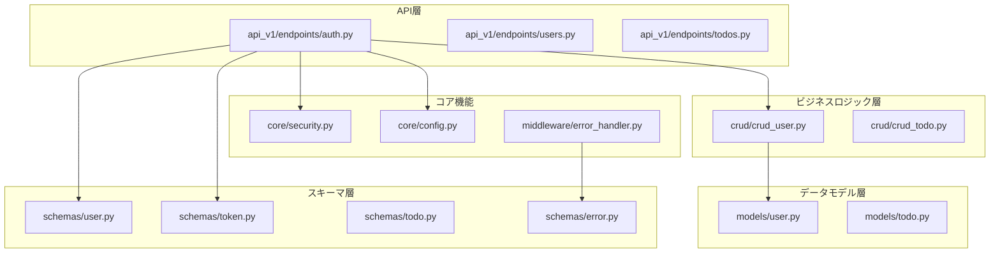
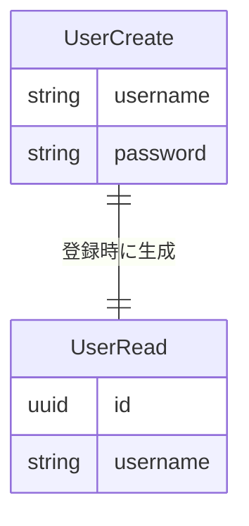
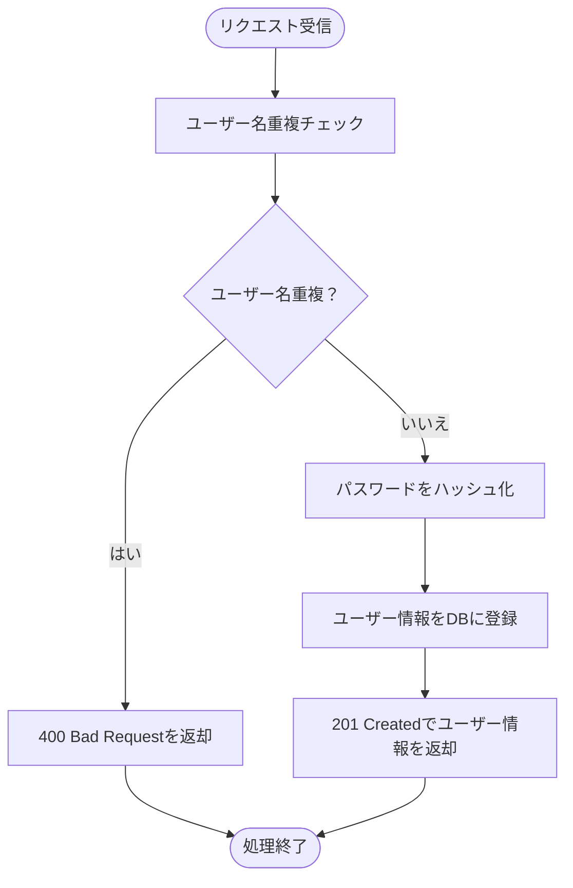
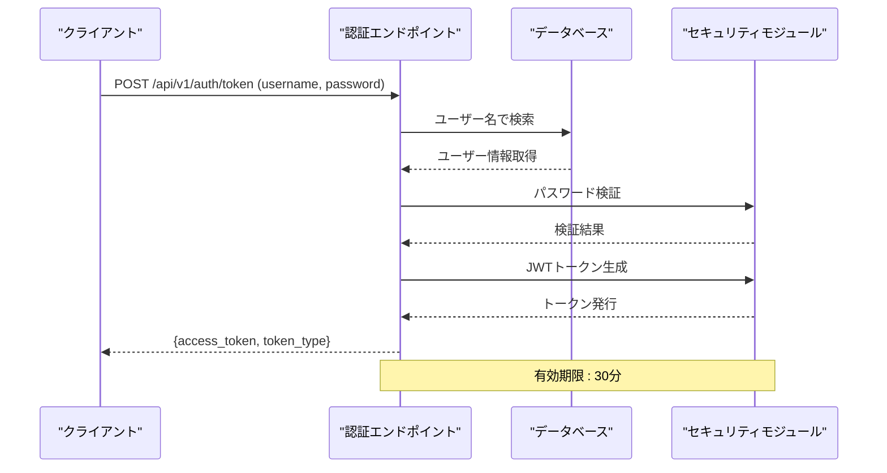
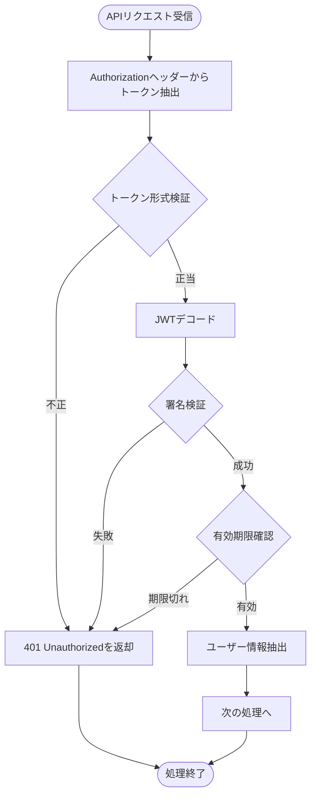
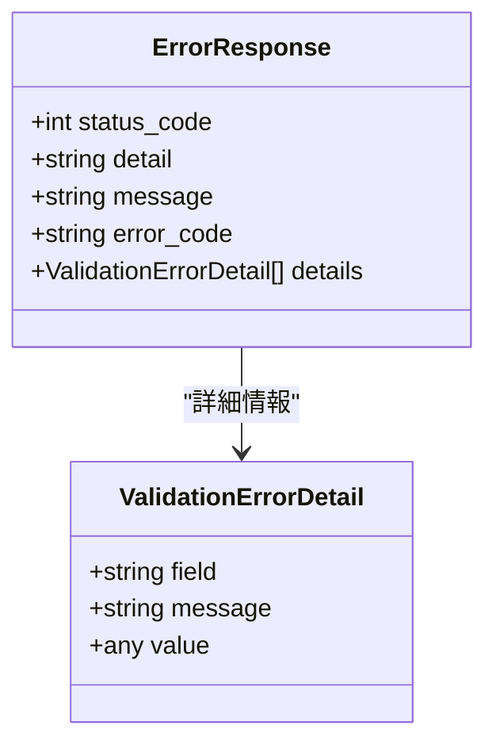

# 認証API

<cite>
**本文で参照されるファイル**
- [auth.py](file://backend/app/api/api_v1/endpoints/auth.py)
- [token.py](file://backend/app/schemas/token.py)
- [security.py](file://backend/app/core/security.py)
- [config.py](file://backend/app/core/config.py)
- [user.py](file://backend/app/schemas/user.py)
- [crud_user.py](file://backend/app/crud/crud_user.py)
- [user_model.py](file://backend/app/models/user.py)
- [error_handler.py](file://backend/app/middleware/error_handler.py)
- [error_schema.py](file://backend/app/schemas/error.py)
- [api.py](file://backend/app/api/api_v1/api.py)
- [auth_specification.md](file://docs/auth_specification.md)
- [test_auth.py](file://backend/tests/test_auth.py)
</cite>

## 目次
1. [導入](#導入)
2. [プロジェクト構造](#プロジェクト構造)
3. [認証APIの概要](#認証apiの概要)
4. [ユーザー登録エンドポイント](#ユーザー登録エンドポイント)
5. [ログインエンドポイント](#ログインエンドポイント)
6. [認証ミドルウェアとトークン検証](#認証ミドルウェアとトークン検証)
7. [エラーハンドリング](#エラーハンドリング)
8. [セキュリティ対策](#セキュリティ対策)
9. [実装例とベストプラクティス](#実装例とベストプラクティス)
10. [トラブルシューティング](#トラブルシューティング)
11. [結論](#結論)

## 導入
本ドキュメントは、Todoアプリケーションにおける認証関連のRESTful APIエンドポイントの詳細仕様を提供します。JWTベースの認証システムを実装しており、ユーザー登録とログイン機能を網羅的に解説します。

## プロジェクト構造
認証機能は以下のディレクトリ構造で実装されています：



**図の出典**
- [auth.py:1-53](file://backend/app/api/api_v1/endpoints/auth.py#L1-L53)
- [crud_user.py:1-22](file://backend/app/crud/crud_user.py#L1-L22)
- [security.py:1-35](file://backend/app/core/security.py#L1-L35)

**セクションの出典**
- [auth.py:1-53](file://backend/app/api/api_v1/endpoints/auth.py#L1-L53)
- [api.py:1-8](file://backend/app/api/api_v1/api.py#L1-L8)

## 認証APIの概要
認証APIはFastAPIフレームワークを使用して実装されており、以下の特徴を持っています：

- **JWTベースのステートレス認証**: トークンをクライアント側で管理
- **OAuth2パスワードフロー準拠**: 標準的な認証プロトコルに準拠
- **パスワードハッシュ化**: Argon2アルゴリズムを使用した安全なパスワード保存
- **リクエスト制限**: 5回/分のレート制限を適用
- **統一エラーハンドリング**: 全てのエラーを統一された形式で返す

## ユーザー登録エンドポイント

### エンドポイント仕様
- **URL**: `POST /api/v1/auth/register`
- **ステータスコード**: 201 Created (成功時)
- **レスポンススキーマ**: UserRead

### リクエストスキーマ
ユーザー登録エンドポイントのリクエストボディは以下の通りです：



**図の出典**
- [user.py:7-12](file://backend/app/schemas/user.py#L7-L12)

### 応答スキーマ
成功時のレスポンスは以下の形式になります：

| フィールド | 型 | 説明 |
|------------|----|------|
| id | UUID | 生成されたユーザーID |
| username | string | 登録されたユーザー名 |

### 認証要件
- 認証不要（匿名ユーザーも可能）

### 処理フロー


**図の出典**
- [auth.py:17-32](file://backend/app/api/api_v1/endpoints/auth.py#L17-L32)
- [crud_user.py:12-21](file://backend/app/crud/crud_user.py#L12-L21)

### エラーレスポンス
- **400 Bad Request**: 既に使用されているユーザー名の場合
- **429 Too Many Requests**: レート制限超過の場合

**セクションの出典**
- [auth.py:17-32](file://backend/app/api/api_v1/endpoints/auth.py#L17-L32)
- [config.py:62-65](file://backend/app/core/config.py#L62-L65)

## ログインエンドポイント

### エンドポイント仕様
- **URL**: `POST /api/v1/auth/token`
- **ステータスコード**: 200 OK (成功時)
- **レスポンススキーマ**: Token

### JWTトークン発行プロセス
ログインエンドポイントのJWTトークン発行プロセスは以下の手順で行われます：



**図の出典**
- [auth.py:34-52](file://backend/app/api/api_v1/endpoints/auth.py#L34-L52)
- [security.py:17-27](file://backend/app/core/security.py#L17-L27)

### リクエストパラメータ
ログインエンドポイントはOAuth2標準のform-data形式をサポートしています：

| パラメータ | 型 | 必須 | 説明 |
|------------|----|------|------|
| username | string | はい | ユーザー名 |
| password | string | はい | パスワード |

### 応答フォーマット
成功時のレスポンスは以下のJSON形式です：

| フィールド | 型 | 説明 |
|------------|----|------|
| access_token | string | 発行されたJWTトークン |
| token_type | string | トークンの種類（常に"bearer"） |

### トークンの有効期限
- **有効期間**: 30分（設定可能）
- **アルゴリズム**: HS256
- **シークレットキー**: 環境変数から取得

**セクションの出典**
- [auth.py:34-52](file://backend/app/api/api_v1/endpoints/auth.py#L34-L52)
- [config.py:51-53](file://backend/app/core/config.py#L51-L53)
- [security.py:17-27](file://backend/app/core/security.py#L17-L27)

## 認証ミドルウェアとトークン検証

### トークン検証プロセス
JWTトークンの検証プロセスは以下の通りです：



**図の出典**
- [security.py:29-34](file://backend/app/core/security.py#L29-L34)

### セキュリティ対策
- **パスワードハッシュ化**: Argon2アルゴリズムを使用
- **CSRF対策**: トークンベースの認証
- **レート制限**: 5回/分の制限を適用
- **CORS設定**: 開発環境用のオリジンリスト

**セクションの出典**
- [security.py:8](file://backend/app/core/security.py#L8)
- [config.py:62-65](file://backend/app/core/config.py#L62-L65)

## エラーハンドリング
認証APIでは統一されたエラーレスポンススキーマを使用しています：



**図の出典**
- [error_schema.py:5-23](file://backend/app/schemas/error.py#L5-L23)

### エラーレスポンススキーマ
| フィールド | 型 | 説明 |
|------------|----|------|
| status_code | int | HTTPステータスコード |
| detail | string | 技術的なエラー詳細 |
| message | string | ユーザーに表示されるメッセージ |
| error_code | string | エラーコード |
| details | array | 詳細なエラー情報（バリデーションエラー時のみ） |

### 対応するエラー状態
- **400 Bad Request**: 不正なリクエスト
- **401 Unauthorized**: 認証失敗
- **404 Not Found**: リソースなし
- **422 Unprocessable Entity**: バリデーションエラー
- **429 Too Many Requests**: レート制限超過
- **500 Internal Server Error**: サーバー内部エラー

**セクションの出典**
- [error_handler.py:15-148](file://backend/app/middleware/error_handler.py#L15-L148)
- [error_schema.py:5-23](file://backend/app/schemas/error.py#L5-L23)

## セキュリティ対策
認証APIは以下のセキュリティ対策を実装しています：

### 1. 認証方式
- **JWTベースのステートレス認証**
- **OAuth2パスワードフロー準拠**
- **Bearerトークン形式**

### 2. パスワード管理
- **Argon2アルゴリズムによるパスワードハッシュ化**
- **Salt付きハッシュ化**
- **安全なパスワード比較**

### 3. トークン管理
- **30分の有効期限**
- **HS256アルゴリズム**
- **環境変数によるシークレットキー管理**

### 4. 保護対象
- **ユーザー登録**: 匿名ユーザー可
- **ログイン**: 匿名ユーザー可
- **認可**: トークン必須（他のAPIエンドポイント）

**セクションの出典**
- [security.py:8](file://backend/app/core/security.py#L8)
- [config.py:51-53](file://backend/app/core/config.py#L51-L53)

## 実装例とベストプラクティス

### APIコール例
以下は認証APIの実際の使用例です：

#### ユーザー登録
```bash
curl -X POST "http://localhost:8000/api/v1/auth/register" \
  -H "Content-Type: application/json" \
  -d '{"username": "testuser", "password": "securepassword"}'
```

#### ログイン
```bash
curl -X POST "http://localhost:8000/api/v1/auth/token" \
  -H "Content-Type: application/x-www-form-urlencoded" \
  -d "username=testuser&password=securepassword"
```

### トークン使用例
```bash
curl -X GET "http://localhost:8000/api/v1/users/me" \
  -H "Authorization: Bearer eyJhbGciOiJI..."
```

### ベストプラクティス
1. **エラーハンドリング**: 全てのAPI呼び出しでエラーハンドリングを実装
2. **トークン保存**: セキュアなCookieまたはLocalStorageを使用
3. **再認証**: トークンの有効期限を考慮した再認証処理
4. **セキュリティ**: HTTPS経由での通信を推奨
5. **ログ管理**: 認証イベントの監視とログ記録

**セクションの出典**
- [test_auth.py:4-61](file://backend/tests/test_auth.py#L4-L61)
- [auth_specification.md:13-46](file://docs/auth_specification.md#L13-L46)

## トラブルシューティング

### 一般的な問題と解決方法

#### 1. 認証エラー (401 Unauthorized)
- **原因**: 無効なユーザー名またはパスワード
- **解決**: 正しい資格情報を確認し、再試行

#### 2. トークンエラー
- **原因**: 期限切れのトークン、無効な形式、不正な署名
- **解決**: 再度ログインして新しいトークンを取得

#### 3. レート制限エラー (429 Too Many Requests)
- **原因**: 短時間内のリクエスト数が多すぎる
- **解決**: 一定時間待ってから再試行

#### 4. データベース接続エラー
- **原因**: DB接続情報の誤り
- **解決**: 環境変数の確認と修正

**セクションの出典**
- [error_handler.py:125-148](file://backend/app/middleware/error_handler.py#L125-L148)
- [config.py:62-65](file://backend/app/core/config.py#L62-L65)

## 結論
本認証APIは、JWTベースのステートレス認証を実装し、OAuth2標準に準拠した設計となっています。パスワードハッシュ化、レート制限、統一エラーハンドリングなどのセキュリティ対策を講じており、実運用に適した堅牢な認証システムを提供しています。今後の開発では、認可ミドルウェアの実装やセキュリティ強化が求められます。