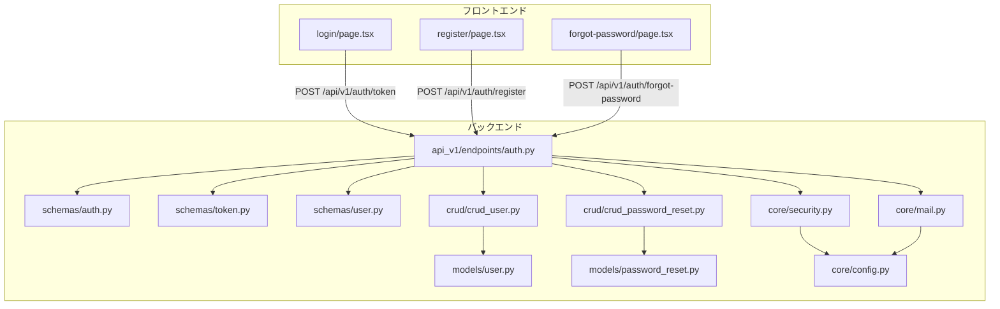
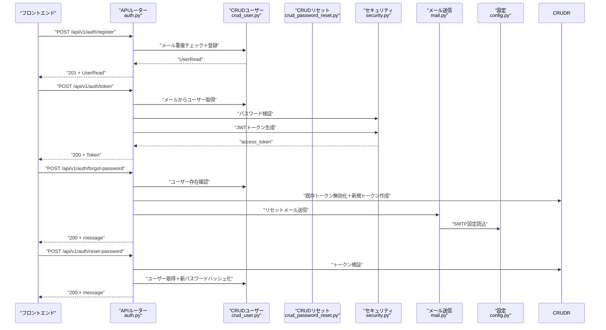
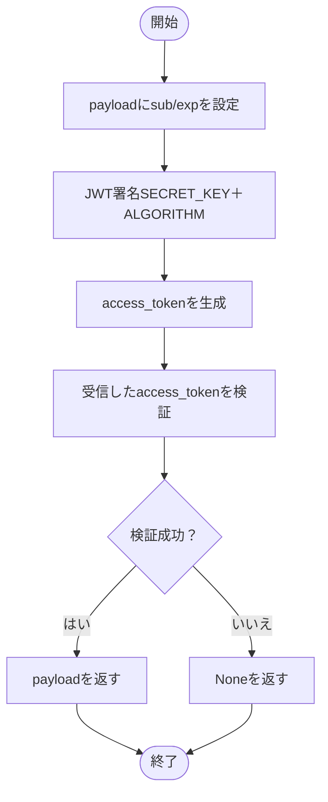
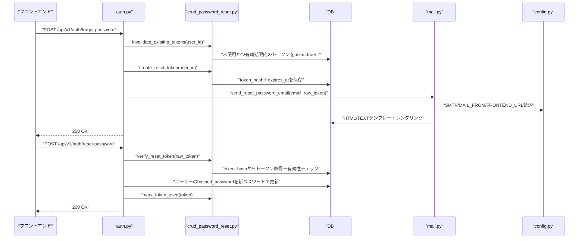
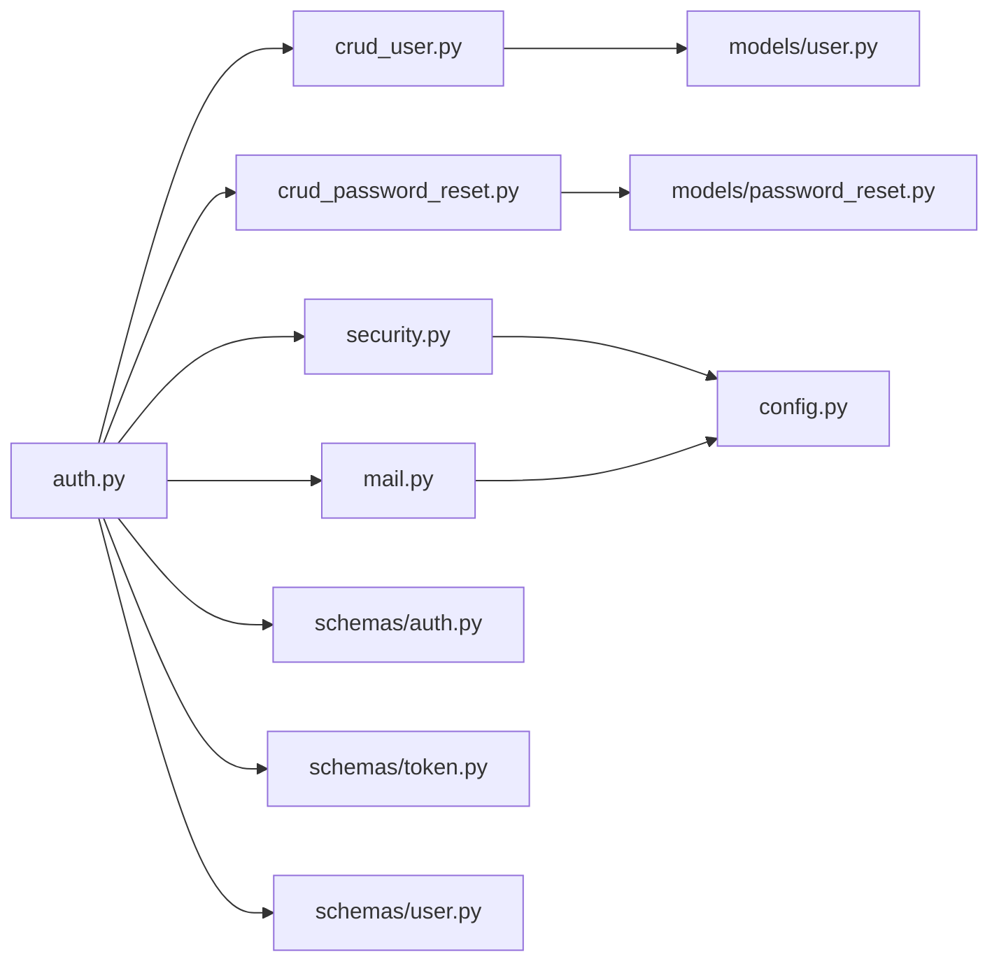

# 認証API

<cite>
**この文書で参照されるファイル**
- [backend/app/api/api_v1/endpoints/auth.py](file://backend/app/api/api_v1/endpoints/auth.py)
- [backend/app/schemas/auth.py](file://backend/app/schemas/auth.py)
- [backend/app/schemas/token.py](file://backend/app/schemas/token.py)
- [backend/app/schemas/user.py](file://backend/app/schemas/user.py)
- [backend/app/crud/crud_user.py](file://backend/app/crud/crud_user.py)
- [backend/app/crud/crud_password_reset.py](file://backend/app/crud/crud_password_reset.py)
- [backend/app/models/password_reset.py](file://backend/app/models/password_reset.py)
- [backend/app/models/user.py](file://backend/app/models/user.py)
- [backend/app/core/security.py](file://backend/app/core/security.py)
- [backend/app/core/mail.py](file://backend/app/core/mail.py)
- [backend/app/core/config.py](file://backend/app/core/config.py)
- [backend/tests/test_auth.py](file://backend/tests/test_auth.py)
- [frontend/src/app/login/page.tsx](file://frontend/src/app/login/page.tsx)
- [frontend/src/app/register/page.tsx](file://frontend/src/app/register/page.tsx)
- [frontend/src/app/forgot-password/page.tsx](file://frontend/src/app/forgot-password/page.tsx)
</cite>

## 目次
1. [はじめに](#はじめに)
2. [プロジェクト構造](#プロジェクト構造)
3. [コアコンポーネント](#コアコンポーネント)
4. [アーキテクチャ概観](#アーキテクチャ概観)
5. [詳細なコンポーネント分析](#詳細なコンポーネント分析)
6. [依存関係分析](#依存関係分析)
7. [パフォーマンス考慮事項](#パフォーマンス考慮事項)
8. [トラブルシューティングガイド](#トラブルシューティングガイド)
9. [結論](#結論)
10. [付録](#付録)

## はじめに
本ドキュメントは、Todoアプリケーションにおける認証関連のRESTful APIエンドポイントの詳細なリファレンスです。対象となる機能には以下のものがあります：
- ユーザー登録
- ログイン（アクセストークン取得）
- パスワードリセット（リセットメール送信）
- パスワードリセット（トークン検証と新規パスワード設定）

また、JWTトークンの生成・検証プロセス、パスワードハッシュ化、メール送信の仕組みについても説明します。HTTPメソッド、URLパターン、リクエスト/レスポンススキーマ、認証要件、エラーコード、パラメータバリデーションルール、エラーハンドリングの詳細なコード例を提供します。

## プロジェクト構造
認証APIはFastAPIによるバックエンド（Python）とNext.jsによるフロントエンド（TypeScript/React）の2層構造で構成されています。認証ロジックの主な場所は以下の通りです：
- APIエンドポイント：backend/app/api/api_v1/endpoints/auth.py
- スキーマ定義：backend/app/schemas/auth.py, token.py, user.py
- CRUDロジック：backend/app/crud/crud_user.py, crud_password_reset.py
- モデル定義：backend/app/models/user.py, password_reset.py
- セキュリティ：backend/app/core/security.py
- メール送信：backend/app/core/mail.py
- 設定：backend/app/core/config.py
- 統合テスト：backend/tests/test_auth.py
- フロントエンド画面：frontend/src/app/login, register, forgot-password

```mermaid
graph TB
subgraph "フロントエンド"
FE_Login["login/page.tsx"]
FE_Register["register/page.tsx"]
FE_Forgot["forgot-password/page.tsx"]
end
subgraph "バックエンド"
API_Auth["api_v1/endpoints/auth.py"]
Schema_Auth["schemas/auth.py"]
Schema_Token["schemas/token.py"]
Schema_User["schemas/user.py"]
CRUD_User["crud/crud_user.py"]
CRUD_Reset["crud/crud_password_reset.py"]
Model_User["models/user.py"]
Model_Reset["models/password_reset.py"]
Security["core/security.py"]
Mail["core/mail.py"]
Config["core/config.py"]
end
FE_Login --> |"POST /api/v1/auth/token"| API_Auth
FE_Register --> |"POST /api/v1/auth/register"| API_Auth
FE_Forgot --> |"POST /api/v1/auth/forgot-password"| API_Auth
API_Auth --> CRUD_User
API_Auth --> CRUD_Reset
API_Auth --> Security
API_Auth --> Mail
API_Auth --> Schema_Auth
API_Auth --> Schema_Token
API_Auth --> Schema_User
CRUD_User --> Model_User
CRUD_Reset --> Model_Reset
Security --> Config
Mail --> Config
```

**図の出典**
- [backend/app/api/api_v1/endpoints/auth.py:1-117](file://backend/app/api/api_v1/endpoints/auth.py#L1-L117)
- [backend/app/schemas/auth.py:1-11](file://backend/app/schemas/auth.py#L1-L11)
- [backend/app/schemas/token.py:1-10](file://backend/app/schemas/token.py#L1-L10)
- [backend/app/schemas/user.py:1-13](file://backend/app/schemas/user.py#L1-L13)
- [backend/app/crud/crud_user.py:1-28](file://backend/app/crud/crud_user.py#L1-L28)
- [backend/app/crud/crud_password_reset.py:1-56](file://backend/app/crud/crud_password_reset.py#L1-L56)
- [backend/app/models/user.py:1-16](file://backend/app/models/user.py#L1-L16)
- [backend/app/models/password_reset.py:1-52](file://backend/app/models/password_reset.py#L1-L52)
- [backend/app/core/security.py:1-35](file://backend/app/core/security.py#L1-L35)
- [backend/app/core/mail.py:1-53](file://backend/app/core/mail.py#L1-L53)
- [backend/app/core/config.py:1-91](file://backend/app/core/config.py#L1-L91)

**節の出典**
- [backend/app/api/api_v1/endpoints/auth.py:1-117](file://backend/app/api/api_v1/endpoints/auth.py#L1-L117)
- [backend/app/core/config.py:1-91](file://backend/app/core/config.py#L1-L91)

## コアコンポーネント
- APIルーター：/api/v1/auth にタグ付きで定義され、認証関連エンドポイントを提供
- 認証スキーマ：ForgotPasswordRequest、ResetPasswordRequest、Token、UserCreate、UserRead
- CRUD層：ユーザー登録、パスワードリセットトークン管理
- セキュリティ：パスワードハッシュ化（Argon2）、JWTトークン生成・検証
- メール：Jinja2テンプレートによるHTML/テキストメール送信
- 設定：SECRET_KEY、アルゴリズム、JWT有効期限、レートリミット、SMTP、フロントエンドURL

**節の出典**
- [backend/app/api/api_v1/endpoints/auth.py:17-117](file://backend/app/api/api_v1/endpoints/auth.py#L17-L117)
- [backend/app/schemas/auth.py:1-11](file://backend/app/schemas/auth.py#L1-L11)
- [backend/app/schemas/token.py:1-10](file://backend/app/schemas/token.py#L1-L10)
- [backend/app/schemas/user.py:1-13](file://backend/app/schemas/user.py#L1-L13)
- [backend/app/crud/crud_user.py:1-28](file://backend/app/crud/crud_user.py#L1-L28)
- [backend/app/crud/crud_password_reset.py:1-56](file://backend/app/crud/crud_password_reset.py#L1-L56)
- [backend/app/core/security.py:1-35](file://backend/app/core/security.py#L1-L35)
- [backend/app/core/mail.py:1-53](file://backend/app/core/mail.py#L1-L53)
- [backend/app/core/config.py:50-84](file://backend/app/core/config.py#L50-L84)

## アーキテクチャ概観
認証APIの全体像は以下の通りです。フロントエンドからのリクエストがFastAPIルーターに到着し、各CRUD/セキュリティ/メール処理が連携して処理されます。

```mermaid
sequenceDiagram
participant FE as "フロントエンド"
participant API as "APIルーター<br/>auth.py"
participant CRUDU as "CRUDユーザー<br/>crud_user.py"
participant CRDR as "CRUDリセット<br/>crud_password_reset.py"
participant SEC as "セキュリティ<br/>security.py"
participant MAIL as "メール送信<br/>mail.py"
participant CFG as "設定<br/>config.py"
FE->>API : "POST /api/v1/auth/register"
API->>CRUDU : "メール重複チェック＋登録"
CRUDU-->>API : "UserRead"
API-->>FE : "201 + UserRead"
FE->>API : "POST /api/v1/auth/token"
API->>CRUDU : "メールからユーザー取得"
API->>SEC : "パスワード検証"
API->>SEC : "JWTトークン生成"
SEC-->>API : "access_token"
API-->>FE : "200 + Token"
FE->>API : "POST /api/v1/auth/forgot-password"
API->>CRUDU : "ユーザー存在確認"
API->>CRUDR : "既存トークン無効化＋新規トークン作成"
API->>MAIL : "リセットメール送信"
MAIL->>CFG : "SMTP設定読込"
API-->>FE : "200 + message"
FE->>API : "POST /api/v1/auth/reset-password"
API->>CRUDR : "トークン検証"
API->>CRUDU : "ユーザー取得＋新パスワードハッシュ化"
API-->>FE : "200 + message"
```

**図の出典**
- [backend/app/api/api_v1/endpoints/auth.py:19-117](file://backend/app/api/api_v1/endpoints/auth.py#L19-L117)
- [backend/app/crud/crud_user.py:8-27](file://backend/app/crud/crud_user.py#L8-L27)
- [backend/app/crud/crud_password_reset.py:9-55](file://backend/app/crud/crud_password_reset.py#L9-L55)
- [backend/app/core/security.py:10-34](file://backend/app/core/security.py#L10-L34)
- [backend/app/core/mail.py:27-52](file://backend/app/core/mail.py#L27-L52)
- [backend/app/core/config.py:69-84](file://backend/app/core/config.py#L69-L84)

## 詳細なコンポーネント分析

### APIエンドポイント一覧
- 基底URL：/api/v1/auth
- 全体のエンドポイントは以下の通りです（HTTPメソッド、URL、概要、認証要件、レスポンスコード）：
  - POST /register
    - 説明：ユーザー登録
    - 認証：不要
    - 成功：201 Created + UserRead
    - 失敗：400 Bad Request（メール重複時）
  - POST /token
    - 説明：アクセストークン取得（OAuth2 Password）
    - 認証：不要
    - 成功：200 OK + Token
    - 失敗：401 Unauthorized（認証失敗時）
  - POST /forgot-password
    - 説明：パスワードリセットメール送信
    - 認証：不要
    - 成功：200 OK + message
    - 失敗：なし（存在しないユーザーでも200）
  - POST /reset-password
    - 説明：パスワードリセット（トークン検証＋新パスワード設定）
    - 認証：不要
    - 成功：200 OK + message
    - 失敗：400 Bad Request（無効/期限切れ）、404 Not Found（ユーザー不在）

**節の出典**
- [backend/app/api/api_v1/endpoints/auth.py:19-117](file://backend/app/api/api_v1/endpoints/auth.py#L19-L117)
- [backend/tests/test_auth.py:6-66](file://backend/tests/test_auth.py#L6-L66)

### JWTトークンの生成・検証プロセス
- 生成
  - 入力：ユーザーID（UUID文字列）＋有効期限（分）
  - 処理：現在時刻＋有効期限をpayloadに追加し、SECRET_KEY＋ALGORITHM（HS256）で署名
  - 出力：access_token（文字列）
- 検証
  - 入力：access_token
  - 処理：SECRET_KEY＋ALGORITHMで検証し、JWTError発生時は失敗
  - 出力：payload（辞書）またはNone

```mermaid
flowchart TD
Start(["開始"]) --> BuildPayload["payloadにsub/expを設定"]
BuildPayload --> Encode["JWT署名SECRET_KEY＋ALGORITHM"]
Encode --> Token["access_tokenを生成"]
Token --> Verify["受信したaccess_tokenを検証"]
Verify --> Ok{"検証成功？"}
Ok --> |はい| Payload["payloadを返す"]
Ok --> |いいえ| Fail["Noneを返す"]
Payload --> End(["終了"])
Fail --> End
```

**図の出典**
- [backend/app/core/security.py:17-34](file://backend/app/core/security.py#L17-L34)
- [backend/app/core/config.py:51-53](file://backend/app/core/config.py#L51-L53)

**節の出典**
- [backend/app/core/security.py:10-34](file://backend/app/core/security.py#L10-L34)
- [backend/app/core/config.py:51-53](file://backend/app/core/config.py#L51-L53)

### パスワードリセットの仕組み
- トークン生成
  - 生のトークンを安全なランダム文字列として生成
  - SHA-256でハッシュ化し、DBに保存（有効期限付き）
- トークン検証
  - 生のトークンをハッシュ化し、DBから照会
  - 未使用かつ有効期限内か判定
- トークン使用済み化
  - 検証成功後に「used=true」でマーク
- メール送信
  - Jinja2テンプレート（HTML/テキスト）を使用
  - 送信先：MAIL_FROM、SMTP設定（SMTP_HOST/PORT/TLS/SSL）
  - URL：FRONTEND_URL/reset-password?token={raw_token}

```mermaid
sequenceDiagram
participant FE as "フロントエンド"
participant API as "auth.py"
participant CRDR as "crud_password_reset.py"
participant DB as "DB"
participant MAIL as "mail.py"
participant CFG as "config.py"
FE->>API : "POST /api/v1/auth/forgot-password"
API->>CRDR : "invalidate_existing_tokens(user_id)"
CRDR->>DB : "未使用かつ有効期限内のトークンをused=trueに"
API->>CRDR : "create_reset_token(user_id)"
CRDR->>DB : "token_hash＋expires_atを保存"
API->>MAIL : "send_reset_password_email(email, raw_token)"
MAIL->>CFG : "SMTP/MAIL_FROM/FRONTEND_URL読込"
MAIL->>DB : "HTML/TEXTテンプレートレンダリング"
API-->>FE : "200 OK"
FE->>API : "POST /api/v1/auth/reset-password"
API->>CRDR : "verify_reset_token(raw_token)"
CRDR->>DB : "token_hashからトークン取得＋有効性チェック"
API->>DB : "ユーザーのhashed_passwordを新パスワードで更新"
API->>CRDR : "mark_token_used(token)"
API-->>FE : "200 OK"
```

**図の出典**
- [backend/app/api/api_v1/endpoints/auth.py:57-117](file://backend/app/api/api_v1/endpoints/auth.py#L57-L117)
- [backend/app/crud/crud_password_reset.py:9-55](file://backend/app/crud/crud_password_reset.py#L9-L55)
- [backend/app/models/password_reset.py:34-51](file://backend/app/models/password_reset.py#L34-L51)
- [backend/app/core/mail.py:27-52](file://backend/app/core/mail.py#L27-L52)
- [backend/app/core/config.py:69-84](file://backend/app/core/config.py#L69-L84)

**節の出典**
- [backend/app/models/password_reset.py:11-51](file://backend/app/models/password_reset.py#L11-L51)
- [backend/app/crud/crud_password_reset.py:25-55](file://backend/app/crud/crud_password_reset.py#L25-L55)
- [backend/app/core/mail.py:27-52](file://backend/app/core/mail.py#L27-L52)
- [backend/app/core/config.py:79-84](file://backend/app/core/config.py#L79-L84)

### パスワードハッシュ化
- 使用アルゴリズム：Argon2（passlib.CryptContext）
- 処理：平文パスワードをハッシュ化してDB保存
- 検証：平文パスワード＋ハッシュをverifyで照合

**節の出典**
- [backend/app/core/security.py:8-14](file://backend/app/core/security.py#L8-L14)
- [backend/app/crud/crud_user.py:18-27](file://backend/app/crud/crud_user.py#L18-L27)

### API仕様詳細

#### 1) ユーザー登録（POST /api/v1/auth/register）
- 認証要件：不要
- Content-Type：application/json
- リクエストボディ（UserCreate）
  - email: 文字列（メール形式、ユニーク）
  - password: 文字列（6文字以上）
- 応答：UserRead
  - id: UUID
  - email: 文字列（メール形式）
- エラーコード：400（メール重複時）
- 例（リクエスト）：
  - {"email": "user@example.com", "password": "securepass"}
- 例（レスポンス）：
  - {"id": "xxxxxxxx-xxxx-xxxx-xxxx-xxxxxxxxxxxx", "email": "user@example.com"}

**節の出典**
- [backend/app/api/api_v1/endpoints/auth.py:19-34](file://backend/app/api/api_v1/endpoints/auth.py#L19-L34)
- [backend/app/schemas/user.py:8-12](file://backend/app/schemas/user.py#L8-L12)
- [backend/tests/test_auth.py:6-17](file://backend/tests/test_auth.py#L6-L17)

#### 2) ログイン（アクセストークン取得）（POST /api/v1/auth/token）
- 認証要件：不要
- Content-Type：application/x-www-form-urlencoded
- 送信データ（OAuth2PasswordRequestForm）
  - username: 文字列（メールアドレス）
  - password: 文字列
- 応答：Token
  - access_token: 文字列（JWT）
  - token_type: 文字列（bearer）
- 認証方法：Authorization: Bearer {access_token}
- エラーコード：401（認証失敗時）
- 例（リクエスト）：
  - username=user@example.com&password=securepass
- 例（レスポンス）：
  - {"access_token": "eyJhb...","token_type":"bearer"}

**節の出典**
- [backend/app/api/api_v1/endpoints/auth.py:36-54](file://backend/app/api/api_v1/endpoints/auth.py#L36-L54)
- [backend/tests/test_auth.py:36-56](file://backend/tests/test_auth.py#L36-L56)

#### 3) パスワードリセットメール送信（POST /api/v1/auth/forgot-password）
- 認証要件：不要
- Content-Type：application/json
- リクエストボディ（ForgotPasswordRequest）
  - email: 文字列（メール形式）
- 応答：JSON
  - message: 文字列（送信完了メッセージ）
- 動作：ユーザーが存在してもいなくても200を返す
- 例（リクエスト）：
  - {"email": "user@example.com"}
- 例（レスポンス）：
  - {"message": "パスワードリセットのメールを送信しました。メールボックスをご確認ください。"}

**節の出典**
- [backend/app/api/api_v1/endpoints/auth.py:57-78](file://backend/app/api/api_v1/endpoints/auth.py#L57-L78)
- [backend/app/schemas/auth.py:4-5](file://backend/app/schemas/auth.py#L4-L5)

#### 4) パスワードリセット（POST /api/v1/auth/reset-password）
- 認証要件：不要
- Content-Type：application/json
- リクエストボディ（ResetPasswordRequest）
  - token: 文字列（最小長10）
  - new_password: 文字列（最小長6）
- 応答：JSON
  - message: 文字列（完了メッセージ）
- エラーコード：400（無効/期限切れ）、404（ユーザー不在）
- 例（リクエスト）：
  - {"token": "raw_token_string", "new_password": "newsecurepass"}
- 例（レスポンス）：
  - {"message": "パスワードが正常に変更されました。新しいパスワードでログインしてください。"}

**節の出典**
- [backend/app/api/api_v1/endpoints/auth.py:81-117](file://backend/app/api/api_v1/endpoints/auth.py#L81-L117)
- [backend/app/schemas/auth.py:8-11](file://backend/app/schemas/auth.py#L8-L11)

### フロントエンドとの連携例
- ログイン画面（Next.js）
  - 入力バリデーション：メール形式、パスワード6文字以上
  - 送信：application/x-www-form-urlencoded
  - 成功時：トークンをローカルに保存し、ホームへ遷移
- 登録画面
  - 入力バリデーション：メール形式、パスワード6文字以上
  - 成功時：通知＋ログイン画面への遷移
- パスワードリセット画面
  - 入力バリデーション：メール形式
  - 成功時：送信完了表示＋ログイン画面への遷移

**節の出典**
- [frontend/src/app/login/page.tsx:15-18](file://frontend/src/app/login/page.tsx#L15-L18)
- [frontend/src/app/register/page.tsx:16-19](file://frontend/src/app/register/page.tsx#L16-L19)
- [frontend/src/app/forgot-password/page.tsx:16-18](file://frontend/src/app/forgot-password/page.tsx#L16-L18)

## 依存関係分析
- APIエンドポイントはCRUD、セキュリティ、メール、設定、スキーマに依存
- CRUDユーザー：パスワードハッシュ化（security.get_password_hash）を使用
- CRUDリセット：モデル（password_reset）のトークン生成・検証ロジックを活用
- セキュリティ：JWT生成/検証、パスワードハッシュ化
- メール：SMTP設定、テンプレート（HTML/TEXT）、送信先URL

```mermaid
graph LR
Auth["auth.py"] --> CRUDU["crud_user.py"]
Auth --> CRDR["crud_password_reset.py"]
Auth --> SEC["security.py"]
Auth --> MAIL["mail.py"]
Auth --> SCHEMA_A["schemas/auth.py"]
Auth --> SCHEMA_T["schemas/token.py"]
Auth --> SCHEMA_U["schemas/user.py"]
CRUDU --> MODEL_U["models/user.py"]
CRDR --> MODEL_R["models/password_reset.py"]
SEC --> CFG["config.py"]
MAIL --> CFG
```

**図の出典**
- [backend/app/api/api_v1/endpoints/auth.py:1-17](file://backend/app/api/api_v1/endpoints/auth.py#L1-L17)
- [backend/app/crud/crud_user.py:1-6](file://backend/app/crud/crud_user.py#L1-L6)
- [backend/app/crud/crud_password_reset.py:1-6](file://backend/app/crud/crud_password_reset.py#L1-L6)
- [backend/app/core/security.py:1-5](file://backend/app/core/security.py#L1-L5)
- [backend/app/core/mail.py:1-4](file://backend/app/core/mail.py#L1-L4)
- [backend/app/core/config.py:1-91](file://backend/app/core/config.py#L1-L91)

**節の出典**
- [backend/app/api/api_v1/endpoints/auth.py:1-17](file://backend/app/api/api_v1/endpoints/auth.py#L1-L17)
- [backend/app/crud/crud_user.py:1-6](file://backend/app/crud/crud_user.py#L1-L6)
- [backend/app/crud/crud_password_reset.py:1-6](file://backend/app/crud/crud_password_reset.py#L1-L6)
- [backend/app/core/security.py:1-5](file://backend/app/core/security.py#L1-L5)
- [backend/app/core/mail.py:1-4](file://backend/app/core/mail.py#L1-L4)
- [backend/app/core/config.py:1-91](file://backend/app/core/config.py#L1-L91)

## パフォーマンス考慮事項
- トークン有効期限：ACCESS_TOKEN_EXPIRE_MINUTES（デフォルト30分）で短めに設定することで、セキュリティと軽減効果を両立
- レートリミット：LOGIN/RATE_LIMIT_REGISTER/FORGOT_PASSWORD/RESET_PASSWORDでAPI利用を制限
- DBアクセス：CRUDはSQLModelのselectを使用し、必要最小限のクエリで済むよう設計
- メール送信：非同期（FastAPI-Mail）で送信処理を軽減

[この節は一般的な説明であり、特定のファイルを直接分析していません]

## トラブルシューティングガイド
- 400 Bad Request（ユーザー登録）
  - 症状：メールアドレスが既に登録されている
  - 対処：別のメールアドレスを使用
  - 参考：[backend/app/api/api_v1/endpoints/auth.py:28-32](file://backend/app/api/api_v1/endpoints/auth.py#L28-L32)
- 401 Unauthorized（ログイン）
  - 症状：メールアドレスまたはパスワードが間違っている
  - 対処：正しい資格情報を入力、パスワードリセットの利用を検討
  - 参考：[backend/app/api/api_v1/endpoints/auth.py:44-49](file://backend/app/api/api_v1/endpoints/auth.py#L44-L49)
- 400 Bad Request（パスワードリセット）
  - 症状：トークンが無効または期限切れ
  - 対処：再び「パスワードリセットメール送信」を実施
  - 参考：[backend/app/api/api_v1/endpoints/auth.py:95-99](file://backend/app/api/api_v1/endpoints/auth.py#L95-L99)
- 404 Not Found（パスワードリセット）
  - 症状：トークンは有効だがユーザーが存在しない
  - 対処：管理者に問い合わせ
  - 参考：[backend/app/api/api_v1/endpoints/auth.py:103-107](file://backend/app/api/api_v1/endpoints/auth.py#L103-L107)
- SMTP設定不備（メール送信失敗）
  - 症状：パスワードリセットメールが届かない
  - 対処：SMTP_HOST/PORT/TLS/SSL/USER/PASSWORD/MAIL_FROMを確認
  - 参考：[backend/app/core/mail.py:11-22](file://backend/app/core/mail.py#L11-L22), [backend/app/core/config.py:69-78](file://backend/app/core/config.py#L69-L78)

**節の出典**
- [backend/app/api/api_v1/endpoints/auth.py:28-32](file://backend/app/api/api_v1/endpoints/auth.py#L28-L32)
- [backend/app/api/api_v1/endpoints/auth.py:44-49](file://backend/app/api/api_v1/endpoints/auth.py#L44-L49)
- [backend/app/api/api_v1/endpoints/auth.py:95-99](file://backend/app/api/api_v1/endpoints/auth.py#L95-L99)
- [backend/app/api/api_v1/endpoints/auth.py:103-107](file://backend/app/api/api_v1/endpoints/auth.py#L103-L107)
- [backend/app/core/mail.py:11-22](file://backend/app/core/mail.py#L11-L22)
- [backend/app/core/config.py:69-78](file://backend/app/core/config.py#L69-L78)

## 結論
本認証APIは、FastAPI＋SQLModel＋JWT＋Argon2＋SMTPの組み合わせにより堅牢な認証・セキュリティを実現しています。ユーザー登録、ログイン、パスワードリセットの3つの主要フローに対応し、レートリミット、トークン有効期限、メール送信の仕組みを通じて、UXとセキュリティのバランスを取っています。フロントエンドとの連携も型安全なバリデーションと統合テストにより、安定した運用が可能です。

[この節は要約であり、特定のファイルを直接分析していません]

## 付録

### 設定項目（重要）
- SECRET_KEY：JWT署名に使用（本番環境では必須）
- ALGORITHM：JWTアルゴリズム（デフォルトHS256）
- ACCESS_TOKEN_EXPIRE_MINUTES：アクセストークン有効時間（分）
- RESET_TOKEN_EXPIRE_HOURS：パスワードリセットトークン有効時間（時間）
- SMTP_*：SMTPサーバー設定（HOST/PORT/TLS/SSL/USER/PASSWORD）
- MAIL_FROM／MAIL_FROM_NAME：送信元アドレス・名称
- FRONTEND_URL：リセットURLのベースURL
- RATE_LIMIT_*：各エンドポイントのレートリミット

**節の出典**
- [backend/app/core/config.py:51-84](file://backend/app/core/config.py#L51-L84)

### API使用例（フロントエンド）
- 登録
  - URL: POST /api/v1/auth/register
  - Body: {"email": "...", "password": "..."}
  - 成功ステータス: 201
- ログイン
  - URL: POST /api/v1/auth/token
  - Header: Content-Type: application/x-www-form-urlencoded
  - Body: username=...&password=...
  - 成功ステータス: 200
- パスワードリセットメール送信
  - URL: POST /api/v1/auth/forgot-password
  - Body: {"email": "..."}
  - 成功ステータス: 200
- パスワードリセット
  - URL: POST /api/v1/auth/reset-password
  - Body: {"token": "...", "new_password": "..."}
  - 成功ステータス: 200

**節の出典**
- [frontend/src/app/register/page.tsx:34-41](file://frontend/src/app/register/page.tsx#L34-L41)
- [frontend/src/app/login/page.tsx:33-41](file://frontend/src/app/login/page.tsx#L33-L41)
- [frontend/src/app/forgot-password/page.tsx:32-46](file://frontend/src/app/forgot-password/page.tsx#L32-L46)
- [backend/tests/test_auth.py:6-66](file://backend/tests/test_auth.py#L6-L66)