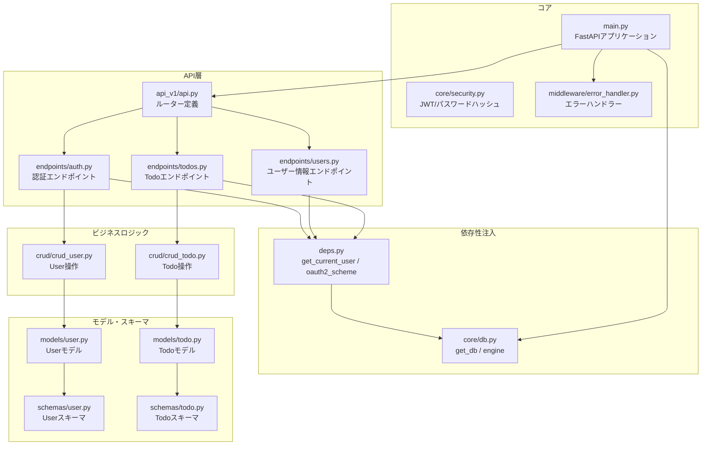
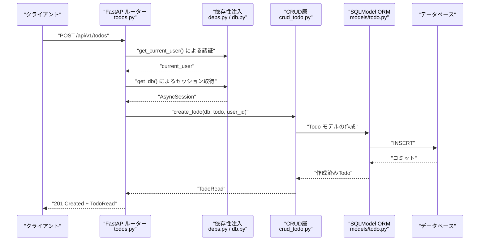
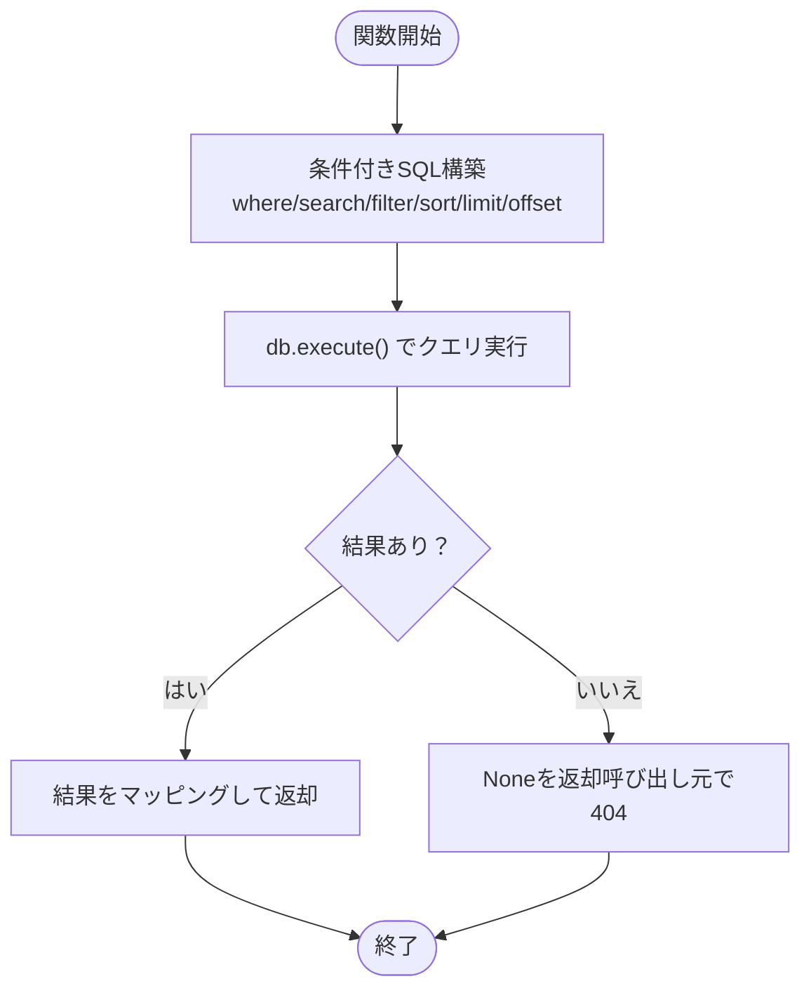
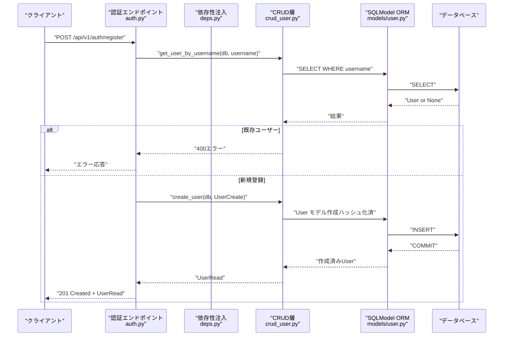
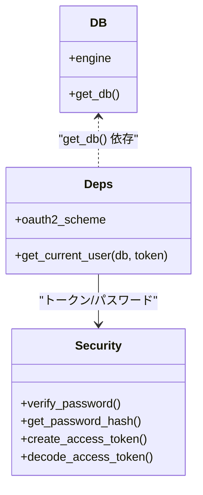
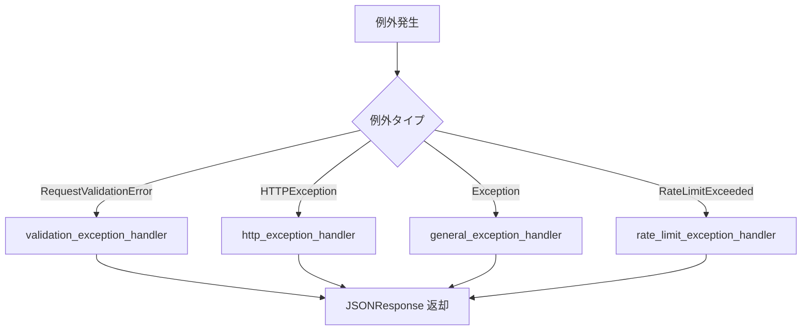
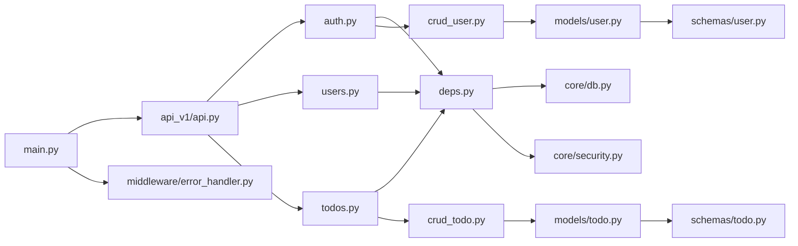

# CRUD操作

<cite>
**本文で参照するファイル**
- [backend/app/main.py](file://backend/app/main.py)
- [backend/app/api/api_v1/api.py](file://backend/app/api/api_v1/api.py)
- [backend/app/api/api_v1/endpoints/todos.py](file://backend/app/api/api_v1/endpoints/todos.py)
- [backend/app/api/api_v1/endpoints/users.py](file://backend/app/api/api_v1/endpoints/users.py)
- [backend/app/api/api_v1/endpoints/auth.py](file://backend/app/api/api_v1/endpoints/auth.py)
- [backend/app/api/deps.py](file://backend/app/api/deps.py)
- [backend/app/core/db.py](file://backend/app/core/db.py)
- [backend/app/core/security.py](file://backend/app/core/security.py)
- [backend/app/crud/crud_todo.py](file://backend/app/crud/crud_todo.py)
- [backend/app/crud/crud_user.py](file://backend/app/crud/crud_user.py)
- [backend/app/models/todo.py](file://backend/app/models/todo.py)
- [backend/app/models/user.py](file://backend/app/models/user.py)
- [backend/app/schemas/todo.py](file://backend/app/schemas/todo.py)
- [backend/app/schemas/user.py](file://backend/app/schemas/user.py)
- [backend/app/middleware/error_handler.py](file://backend/app/middleware/error_handler.py)
</cite>

## 目次
1. [はじめに](#はじめに)
2. [プロジェクト構造](#プロジェクト構造)
3. [コアコンポーネント](#コアコンポーネント)
4. [アーキテクチャ概要](#アーキテクチャ概要)
5. [詳細コンポーネント分析](#詳細コンポーネント分析)
6. [依存関係分析](#依存関係分析)
7. [パフォーマンス考慮事項](#パフォーマンス考慮事項)
8. [トラブルシューティングガイド](#トラブルシューティングガイド)
9. [結論](#結論)

## はじめに
本ドキュメントは、Todo と User の CRUD 操作における技術的設計を詳細に解説します。主なトピックは以下の通りです：
- SQLModel ORM によるデータベース操作
- 依存性注入（DI）の実装
- トランザクション管理
- エラーハンドリング
- Todo 作成/読取/更新/削除の具体的な実装例
- User 管理ロジック
- API エンドポイントからの呼び出しフロー

## プロジェクト構造
バックエンドは FastAPI で構築され、非同期 SQLModel による ORM と、依存性注入、JWT 認証、カスタムミドルウェア、エラーハンドリングが組み合わされています。

**図の出典**
- [backend/app/api/api_v1/api.py:1-8](file://backend/app/api/api_v1/api.py#L1-L8)
- [backend/app/api/api_v1/endpoints/auth.py:1-53](file://backend/app/api/api_v1/endpoints/auth.py#L1-L53)
- [backend/app/api/api_v1/endpoints/users.py:1-14](file://backend/app/api/api_v1/endpoints/users.py#L1-L14)
- [backend/app/api/api_v1/endpoints/todos.py:1-102](file://backend/app/api/api_v1/endpoints/todos.py#L1-L102)
- [backend/app/api/deps.py:1-31](file://backend/app/api/deps.py#L1-L31)
- [backend/app/core/db.py:1-17](file://backend/app/core/db.py#L1-L17)
- [backend/app/crud/crud_user.py:1-22](file://backend/app/crud/crud_user.py#L1-L22)
- [backend/app/crud/crud_todo.py:1-152](file://backend/app/crud/crud_todo.py#L1-L152)
- [backend/app/models/user.py:1-16](file://backend/app/models/user.py#L1-L16)
- [backend/app/models/todo.py:1-25](file://backend/app/models/todo.py#L1-L25)
- [backend/app/schemas/user.py:1-12](file://backend/app/schemas/user.py#L1-L12)
- [backend/app/schemas/todo.py:1-41](file://backend/app/schemas/todo.py#L1-L41)
- [backend/app/core/security.py:1-35](file://backend/app/core/security.py#L1-L35)
- [backend/app/middleware/error_handler.py:1-149](file://backend/app/middleware/error_handler.py#L1-L149)
- [backend/app/main.py:1-168](file://backend/app/main.py#L1-L168)

**節の出典**
- [backend/app/main.py:1-168](file://backend/app/main.py#L1-L168)
- [backend/app/api/api_v1/api.py:1-8](file://backend/app/api/api_v1/api.py#L1-L8)

## コアコンポーネント
- FastAPI アプリケーションとライフサイクル管理、CORS、ロギング、Scalar ドキュメント、OpenAPI カスタマイズ、ヘルスチェックエンドポイントを提供します。
- 非同期 SQLModel 接続、セッション管理、DB 初期化（開発時）。
- JWT Bearer 認証、パスワードハッシュ化、トークン生成/検証。
- Todo と User の CRUD 操作を提供する CRUDe 層。
- 全般的なバリデーションエラー、HTTP エラー、一般エラー、レート制限エラーの統一ハンドリング。

**節の出典**
- [backend/app/main.py:1-168](file://backend/app/main.py#L1-L168)
- [backend/app/core/db.py:1-17](file://backend/app/core/db.py#L1-L17)
- [backend/app/core/security.py:1-35](file://backend/app/core/security.py#L1-L35)
- [backend/app/middleware/error_handler.py:1-149](file://backend/app/middleware/error_handler.py#L1-L149)

## アーキテクチャ概要
以下は、Todo 作成/更新/削除/一覧取得のエンドポイントからデータベース操作までの呼び出しフローです。

**図の出典**
- [backend/app/api/api_v1/endpoints/todos.py:59-67](file://backend/app/api/api_v1/endpoints/todos.py#L59-L67)
- [backend/app/api/deps.py:12-31](file://backend/app/api/deps.py#L12-L31)
- [backend/app/core/db.py:14-17](file://backend/app/core/db.py#L14-L17)
- [backend/app/crud/crud_todo.py:100-105](file://backend/app/crud/crud_todo.py#L100-L105)
- [backend/app/models/todo.py:10-25](file://backend/app/models/todo.py#L10-L25)

## 詳細コンポーネント分析

### Todo CRUD（CRUD 操作の詳細）
- 一覧取得：検索、フィルター（完了状態、優先度、タグ）、ソート（created_at/priority/due_date）、昇順/降順、ページネーション（skip/limit）。
- 件数取得：同様のフィルター条件で件数をカウント。
- 作成：TodoCreate → Todo モデルへ変換（user_id 付与）→ INSERT → COMMIT → REFRESH。
- 更新：指定 ID と user_id で存在確認 → 部分更新（title/is_completed/priority/due_date/tags）→ UPDATE → COMMIT → REFRESH。
- 削除：指定 ID と user_id で存在確認 → DELETE → COMMIT。

**図の出典**
- [backend/app/crud/crud_todo.py:10-71](file://backend/app/crud/crud_todo.py#L10-L71)
- [backend/app/crud/crud_todo.py:107-142](file://backend/app/crud/crud_todo.py#L107-L142)
- [backend/app/crud/crud_todo.py:144-151](file://backend/app/crud/crud_todo.py#L144-L151)

**節の出典**
- [backend/app/crud/crud_todo.py:1-152](file://backend/app/crud/crud_todo.py#L1-L152)
- [backend/app/models/todo.py:1-25](file://backend/app/models/todo.py#L1-L25)
- [backend/app/schemas/todo.py:1-41](file://backend/app/schemas/todo.py#L1-L41)

### User CRUD（CRUD 操作の詳細）
- 一覧取得：現状は「/users/me」のみ提供（現在のユーザー情報取得）。
- 作成：重複ユーザー名チェック → パスワードハッシュ化 → INSERT → COMMIT → REFRESH。

**図の出典**
- [backend/app/api/api_v1/endpoints/auth.py:17-32](file://backend/app/api/api_v1/endpoints/auth.py#L17-L32)
- [backend/app/crud/crud_user.py:7-21](file://backend/app/crud/crud_user.py#L7-L21)
- [backend/app/models/user.py:9-16](file://backend/app/models/user.py#L9-L16)

**節の出典**
- [backend/app/api/api_v1/endpoints/users.py:1-14](file://backend/app/api/api_v1/endpoints/users.py#L1-L14)
- [backend/app/api/api_v1/endpoints/auth.py:1-53](file://backend/app/api/api_v1/endpoints/auth.py#L1-L53)
- [backend/app/crud/crud_user.py:1-22](file://backend/app/crud/crud_user.py#L1-L22)
- [backend/app/models/user.py:1-16](file://backend/app/models/user.py#L1-L16)
- [backend/app/schemas/user.py:1-12](file://backend/app/schemas/user.py#L1-L12)

### 依存性注入（DI）の実装
- get_db：非同期セッションを提供し、リクエストごとにクローズされないように設定。
- get_current_user：OAuth2 Bearer トークンを検証 → ユーザー名を取得 → DB から User 取得 → 存在しない場合は 401。
- OAuth2PasswordBearer：/api/v1/auth/token でトークン取得エンドポイント。

**図の出典**
- [backend/app/core/db.py:1-17](file://backend/app/core/db.py#L1-L17)
- [backend/app/api/deps.py:1-31](file://backend/app/api/deps.py#L1-L31)
- [backend/app/core/security.py:1-35](file://backend/app/core/security.py#L1-L35)

**節の出典**
- [backend/app/core/db.py:1-17](file://backend/app/core/db.py#L1-L17)
- [backend/app/api/deps.py:1-31](file://backend/app/api/deps.py#L1-L31)
- [backend/app/core/security.py:1-35](file://backend/app/core/security.py#L1-L35)

### トランザクション管理
- 非同期セッションを使用しており、各 CRUD 操作内で明示的に commit および refresh が実施されています。
- トランザクション境界はリクエスト単位（FastAPI 依存関数）であり、DB 関数内での commit によってコミットされます。

**節の出典**
- [backend/app/core/db.py:14-17](file://backend/app/core/db.py#L14-L17)
- [backend/app/crud/crud_todo.py:100-105](file://backend/app/crud/crud_todo.py#L100-L105)
- [backend/app/crud/crud_todo.py:116-142](file://backend/app/crud/crud_todo.py#L116-L142)
- [backend/app/crud/crud_todo.py:144-151](file://backend/app/crud/crud_todo.py#L144-L151)
- [backend/app/crud/crud_user.py:12-21](file://backend/app/crud/crud_user.py#L12-L21)

### エラーハンドリング
- FastAPI 例外ハンドラーとして、バリデーションエラー、HTTP 例外、一般例外、レート制限超過を一貫した形式で返却。
- 各種ステータスコードに対応する日本語メッセージを提供。

**図の出典**
- [backend/app/middleware/error_handler.py:15-149](file://backend/app/middleware/error_handler.py#L15-L149)
- [backend/app/main.py:66-72](file://backend/app/main.py#L66-L72)

**節の出典**
- [backend/app/middleware/error_handler.py:1-149](file://backend/app/middleware/error_handler.py#L1-L149)
- [backend/app/main.py:1-168](file://backend/app/main.py#L1-L168)

## 依存関係分析
- API ルーターは endpoints に依存し、endpoints は deps と crud に依存。
- deps は db と security に依存。
- crud は models に依存。
- models は schemas に依存。
- main は router、middleware、db、security に依存。

**図の出典**
- [backend/app/main.py:1-168](file://backend/app/main.py#L1-L168)
- [backend/app/api/api_v1/api.py:1-8](file://backend/app/api/api_v1/api.py#L1-L8)
- [backend/app/api/api_v1/endpoints/auth.py:1-53](file://backend/app/api/api_v1/endpoints/auth.py#L1-L53)
- [backend/app/api/api_v1/endpoints/users.py:1-14](file://backend/app/api/api_v1/endpoints/users.py#L1-L14)
- [backend/app/api/api_v1/endpoints/todos.py:1-102](file://backend/app/api/api_v1/endpoints/todos.py#L1-L102)
- [backend/app/api/deps.py:1-31](file://backend/app/api/deps.py#L1-L31)
- [backend/app/core/db.py:1-17](file://backend/app/core/db.py#L1-L17)
- [backend/app/core/security.py:1-35](file://backend/app/core/security.py#L1-L35)
- [backend/app/crud/crud_user.py:1-22](file://backend/app/crud/crud_user.py#L1-L22)
- [backend/app/crud/crud_todo.py:1-152](file://backend/app/crud/crud_todo.py#L1-L152)
- [backend/app/models/user.py:1-16](file://backend/app/models/user.py#L1-L16)
- [backend/app/models/todo.py:1-25](file://backend/app/models/todo.py#L1-L25)
- [backend/app/schemas/user.py:1-12](file://backend/app/schemas/user.py#L1-L12)
- [backend/app/schemas/todo.py:1-41](file://backend/app/schemas/todo.py#L1-L41)
- [backend/app/middleware/error_handler.py:1-149](file://backend/app/middleware/error_handler.py#L1-L149)

**節の出典**
- [backend/app/main.py:1-168](file://backend/app/main.py#L1-L168)
- [backend/app/api/api_v1/api.py:1-8](file://backend/app/api/api_v1/api.py#L1-L8)

## パフォーマンス考慮事項
- 非同期 ORM による I/O 処理の並列化を活かす。
- Todo モデルには複数のインデックス（created_at、is_completed、priority、due_date）が設定されており、検索・フィルター・ソートのパフォーマンス向上に寄与。
- Todo 一覧取得時のページネーション（skip/limit）は、大量データでのクエリコストを抑えるために有効。
- 件数取得（count）は、フィルター条件に応じて効率的に集計を行う。

**節の出典**
- [backend/app/models/todo.py:10-25](file://backend/app/models/todo.py#L10-L25)
- [backend/app/crud/crud_todo.py:10-71](file://backend/app/crud/crud_todo.py#L10-L71)
- [backend/app/crud/crud_todo.py:73-98](file://backend/app/crud/crud_todo.py#L73-L98)

## トラブルシューティングガイド
- 認証エラー（401）：トークンの有効期限、形式、署名、ペイロードの sub が欠けている場合。
- トークン検証失敗：decode_access_token が None を返す（JWTError 例外）。
- DB 接続エラー：ヘルスチェックで SELECT 1 に失敗。
- 重複ユーザー登録：username が既に存在する場合、400 エラー。
- Todo が見つからない：更新/削除時に該当レコードが存在しない場合、404 エラー。
- 一般エラー：500 Internal Server Error が返る（ログに詳細が記録される）。

**節の出典**
- [backend/app/api/deps.py:12-31](file://backend/app/api/deps.py#L12-L31)
- [backend/app/core/security.py:29-35](file://backend/app/core/security.py#L29-L35)
- [backend/app/main.py:134-167](file://backend/app/main.py#L134-L167)
- [backend/app/api/api_v1/endpoints/auth.py:25-31](file://backend/app/api/api_v1/endpoints/auth.py#L25-L31)
- [backend/app/crud/crud_todo.py:116-142](file://backend/app/crud/crud_todo.py#L116-L142)
- [backend/app/crud/crud_todo.py:144-151](file://backend/app/crud/crud_todo.py#L144-L151)
- [backend/app/middleware/error_handler.py:79-104](file://backend/app/middleware/error_handler.py#L79-L104)

## 結論
本システムは、FastAPI と SQLModel、JWT 認証、依存性注入、カスタムエラーハンドリングを統合し、Todo と User に対する堅牢な CRUD 操作を提供しています。非同期セッションによるトランザクション管理、インデックス付きの Todo モデル、フィルター/ソート/ページネーション対応の一覧取得、そして一貫したエラーレスポンス形式により、拡張性と保守性を両立しています。