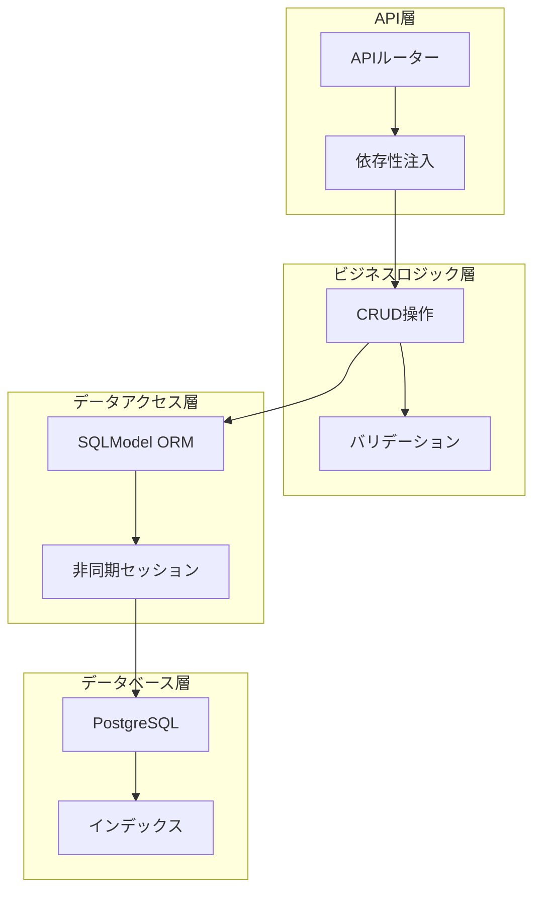
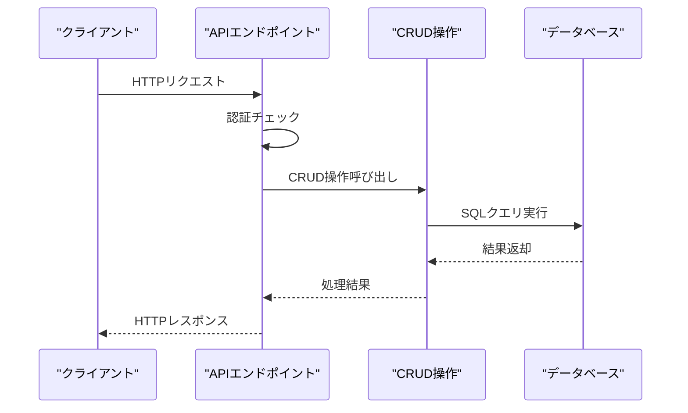
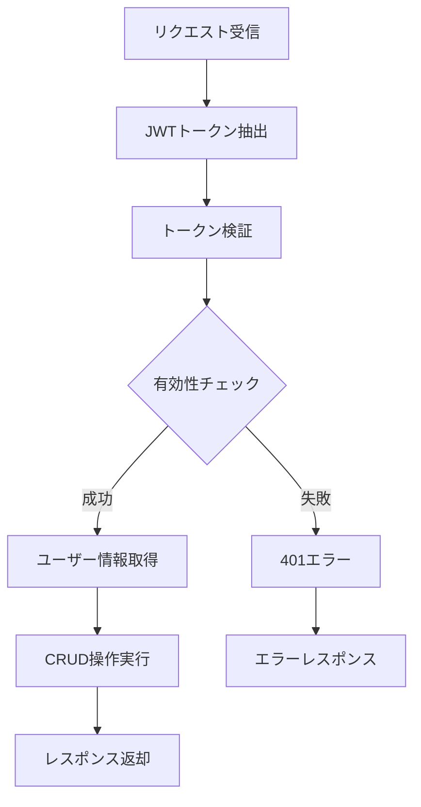
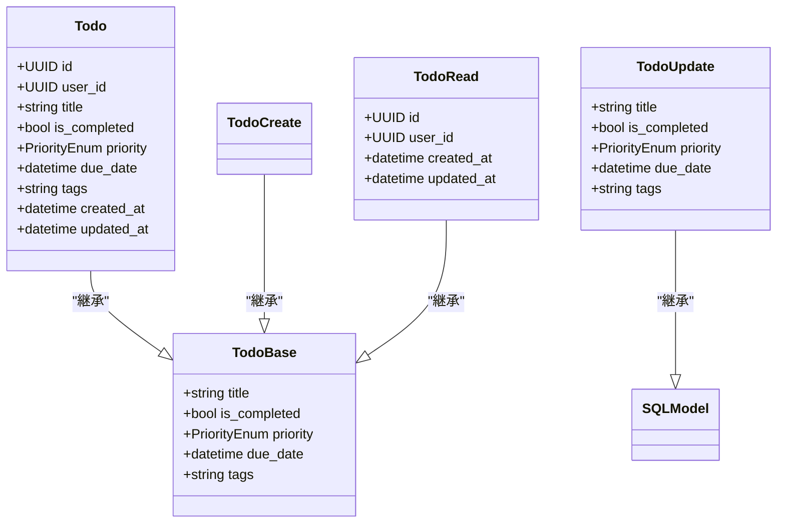
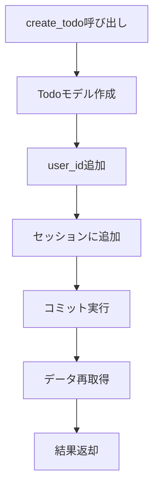
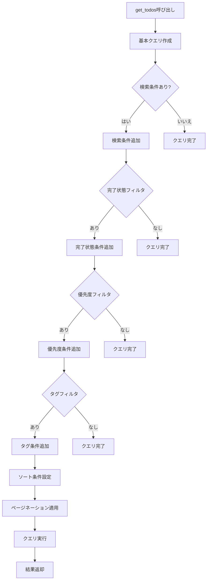
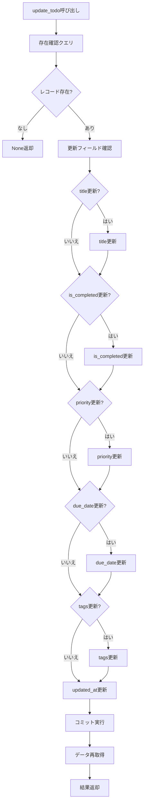
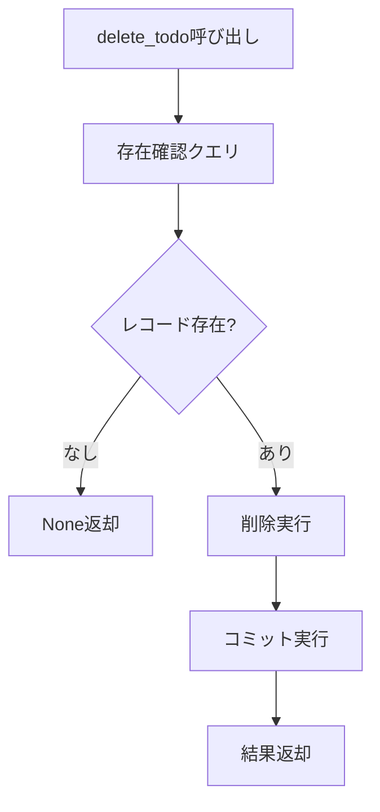
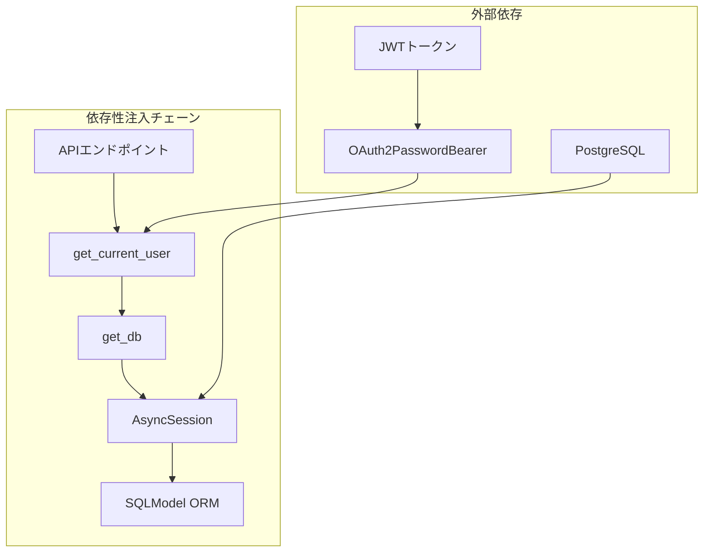
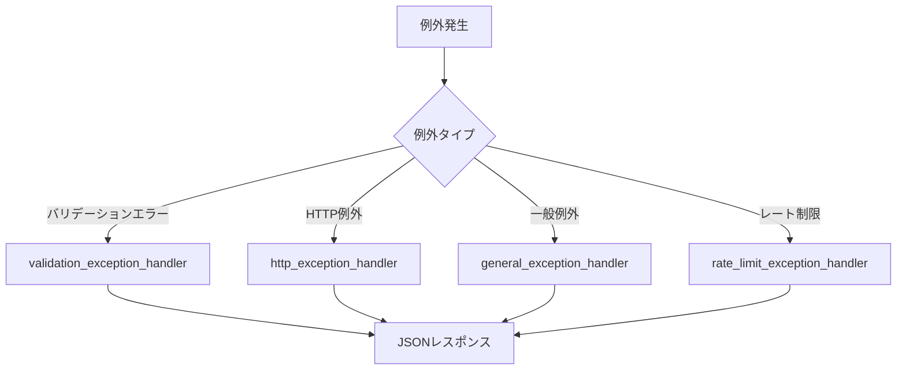

# TODO CRUD操作

<cite>
**この文書で参照されるファイル**
- [backend/app/models/todo.py](file://backend/app/models/todo.py)
- [backend/app/crud/crud_todo.py](file://backend/app/crud/crud_todo.py)
- [backend/app/api/api_v1/endpoints/todos.py](file://backend/app/api/api_v1/endpoints/todos.py)
- [backend/app/schemas/todo.py](file://backend/app/schemas/todo.py)
- [backend/app/core/db.py](file://backend/app/core/db.py)
- [backend/app/api/deps.py](file://backend/app/api/deps.py)
- [backend/app/core/config.py](file://backend/app/core/config.py)
- [backend/app/main.py](file://backend/app/main.py)
- [backend/app/middleware/error_handler.py](file://backend/app/middleware/error_handler.py)
- [backend/app/api/api_v1/api.py](file://backend/app/api/api_v1/api.py)
- [backend/tests/test_todos.py](file://backend/tests/test_todos.py)
</cite>

## 目次
1. [導入](#導入)
2. [プロジェクト構造](#プロジェクト構造)
3. [コアコンポーネント](#コアコンポーネント)
4. [アーキテクチャ概要](#アーキテクチャ概要)
5. [詳細コンポーネント分析](#詳細コンポーネント分析)
6. [依存性分析](#依存性分析)
7. [パフォーマンス考慮事項](#パフォーマンス考慮事項)
8. [トラブルシューティングガイド](#トラブルシューティングガイド)
9. [結論](#結論)

## 導入
本ドキュメントは、SQLModel ORMを使用したTODO管理システムのCRUD操作の詳細な技術設計を説明します。このシステムはFastAPIフレームワークを基盤としており、非同期データベース操作、依存性注入、トランザクション管理、バリデーション処理、エラーハンドリングを包括的に実装しています。

## プロジェクト構造
TODO管理システムは、モダンなレイヤードアーキテクチャに従って設計されており、以下の主要なコンポーネントから構成されています。

**図の出典**
- [backend/app/api/api_v1/endpoints/todos.py:1-102](file://backend/app/api/api_v1/endpoints/todos.py#L1-L102)
- [backend/app/crud/crud_todo.py:1-152](file://backend/app/crud/crud_todo.py#L1-L152)
- [backend/app/core/db.py:1-17](file://backend/app/core/db.py#L1-L17)

**セクションの出典**
- [backend/app/main.py:1-168](file://backend/app/main.py#L1-L168)
- [backend/app/api/api_v1/api.py:1-8](file://backend/app/api/api_v1/api.py#L1-L8)

## コアコンポーネント
TODO管理システムのコアコンポーネントは以下の通りです：

### モデル定義
TodoモデルはSQLModelを使用して定義されており、UUIDを主キーとして使用し、ユーザーとのリレーションシップを保持しています。

### CRUD操作
CRUD操作は非同期処理を採用し、複数のフィルタリングオプションを提供しています。

### APIエンドポイント
RESTful APIエンドポイントは、認証されたユーザーのみがアクセスできるよう設計されています。

**セクションの出典**
- [backend/app/models/todo.py:1-25](file://backend/app/models/todo.py#L1-L25)
- [backend/app/crud/crud_todo.py:1-152](file://backend/app/crud/crud_todo.py#L1-L152)
- [backend/app/api/api_v1/endpoints/todos.py:1-102](file://backend/app/api/api_v1/endpoints/todos.py#L1-L102)

## アーキテクチャ概要
TODO管理システムは、MVC（Model-View-Controller）パターンに似たレイヤードアーキテクチャを採用しています。

**図の出典**
- [backend/app/api/api_v1/endpoints/todos.py:59-67](file://backend/app/api/api_v1/endpoints/todos.py#L59-L67)
- [backend/app/crud/crud_todo.py:100-105](file://backend/app/crud/crud_todo.py#L100-L105)
- [backend/app/core/db.py:14-16](file://backend/app/core/db.py#L14-L16)

### 認証フロー
APIエンドポイントはJWTベアラー認証を使用し、依存性注入を通じて現在のユーザーを取得します。

**図の出典**
- [backend/app/api/deps.py:12-30](file://backend/app/api/deps.py#L12-L30)

**セクションの出典**
- [backend/app/api/deps.py:1-31](file://backend/app/api/deps.py#L1-L31)
- [backend/app/api/api_v1/endpoints/todos.py:1-102](file://backend/app/api/api_v1/endpoints/todos.py#L1-L102)

## 詳細コンポーネント分析

### Todoモデル分析
TodoモデルはSQLModelの`table=True`属性を使用してデータベーステーブルとして定義されており、以下の特徴を持っています。

**図の出典**
- [backend/app/models/todo.py:10-24](file://backend/app/models/todo.py#L10-L24)
- [backend/app/schemas/todo.py:13-34](file://backend/app/schemas/todo.py#L13-L34)

#### データベースインデックス
Todoモデルには複数のインデックスが設定されており、パフォーマンス向上を目的としています。

**セクションの出典**
- [backend/app/models/todo.py:12-17](file://backend/app/models/todo.py#L12-L17)
- [backend/app/schemas/todo.py:1-41](file://backend/app/schemas/todo.py#L1-L41)

### CRUD操作の詳細分析

#### 作成操作 (Create)
TODO作成操作は以下の手順で実行されます：

**図の出典**
- [backend/app/crud/crud_todo.py:100-105](file://backend/app/crud/crud_todo.py#L100-L105)

#### 読み取り操作 (Read)
TODO一覧取得操作は高度なフィルタリング機能を提供します。

**図の出典**
- [backend/app/crud/crud_todo.py:10-71](file://backend/app/crud/crud_todo.py#L10-L71)

#### 更新操作 (Update)
TODO更新操作は部分的なフィールド更新に対応しています。

**図の出典**
- [backend/app/crud/crud_todo.py:107-142](file://backend/app/crud/crud_todo.py#L107-L142)

#### 削除操作 (Delete)
TODO削除操作はシンプルな削除処理を提供します。

**図の出典**
- [backend/app/crud/crud_todo.py:144-151](file://backend/app/crud/crud_todo.py#L144-L151)

**セクションの出典**
- [backend/app/crud/crud_todo.py:1-152](file://backend/app/crud/crud_todo.py#L1-L152)

### APIエンドポイント分析
TODO管理APIエンドポイントは以下の4つの主要な操作を提供します：

#### 一覧取得エンドポイント
- エンドポイント: `GET /api/v1/todos/`
- 機能: 検索、フィルタリング、ソート、ページネーション対応
- 応答形式: `List[TodoRead]`

#### 件数取得エンドポイント
- エンドポイント: `GET /api/v1/todos/count`
- 機能: 検索、フィルタリング対応
- 応答形式: `TodoCountResponse`

#### 作成エンドポイント
- エンドポイント: `POST /api/v1/todos/`
- 機能: 新しいTODOの作成
- 応答形式: `TodoRead`

#### 更新エンドポイント
- エンドポイント: `PUT /api/v1/todos/{id}`
- 機能: 指定されたTODOの部分的更新
- 応答形式: `TodoRead`

#### 削除エンドポイント
- エンドポイント: `DELETE /api/v1/todos/{id}`
- 機能: 指定されたTODOの削除
- 応答形式: `TodoDeleteResponse`

**セクションの出典**
- [backend/app/api/api_v1/endpoints/todos.py:1-102](file://backend/app/api/api_v1/endpoints/todos.py#L1-L102)

## 依存性分析
依存性注入は、FastAPIのDependsを使用して実装されており、以下のコンポーネント間の依存関係が管理されています。

**図の出典**
- [backend/app/api/deps.py:12-30](file://backend/app/api/deps.py#L12-L30)
- [backend/app/core/db.py:14-16](file://backend/app/core/db.py#L14-L16)

### トランザクション管理
非同期セッションを使用したトランザクション管理が実装されており、各CRUD操作は以下の順序で実行されます：

1. **セッション開始**: `async with async_session() as session:`
2. **データ操作**: CRUD操作の実行
3. **コミット**: `await db.commit()`
4. **セッション終了**: 自動クローズ

**セクションの出典**
- [backend/app/core/db.py:14-16](file://backend/app/core/db.py#L14-L16)
- [backend/app/crud/crud_todo.py:100-105](file://backend/app/crud/crud_todo.py#L100-L105)

## パフォーマンス考慮事項
TODO管理システムは以下のパフォーマンス最適化を実装しています：

### インデックス戦略
- `created_at`カラム用のインデックス
- `is_completed`カラム用のインデックス  
- `priority`カラム用のインデックス
- `due_date`カラム用のインデックス

### 非同期処理
- SQLAlchemy AsyncEngineを使用した非同期データベース操作
- FastAPIの非同期リクエスト処理

### クエリ最適化
- 条件付きクエリ構築による不要なデータのフェッチ回避
- ソート条件のSQL式によるデータベース側での並び替え

**セクションの出典**
- [backend/app/models/todo.py:12-17](file://backend/app/models/todo.py#L12-L17)
- [backend/app/core/db.py:5-12](file://backend/app/core/db.py#L5-L12)

## トラブルシューティングガイド

### 一般的なエラー処理
システムは以下のエラーハンドリングを実装しています：

**図の出典**
- [backend/app/middleware/error_handler.py:15-148](file://backend/app/middleware/error_handler.py#L15-L148)

### 認証エラー対応
- 401エラー: 認証情報の検証に失敗
- 403エラー: 権限がない操作
- 404エラー: 存在しないリソース

### データベース接続問題
- 接続文字列の確認
- PostgreSQLサーバーの稼働状況
- セッションの有効期限

**セクションの出典**
- [backend/app/middleware/error_handler.py:1-149](file://backend/app/middleware/error_handler.py#L1-L149)
- [backend/app/main.py:134-167](file://backend/app/main.py#L134-L167)

## 結論
TODO管理システムは、SQLModel ORMとFastAPIを活用した堅牢なCRUD操作を実現しています。非同期処理、依存性注入、トランザクション管理、バリデーション処理、エラーハンドリングを包括的に実装しており、拡張性と保守性に優れています。特に以下の点が強みです：

- **非同期アーキテクチャ**: 高性能なリクエスト処理を実現
- **堅牢な認証システム**: JWTベアラー認証によるセキュアなアクセス制御
- **高度なフィルタリング**: 検索、フィルタリング、ソート、ページネーション機能
- **完全なエラーハンドリング**: 一貫したエラーレスポンス形式
- **パフォーマンス最適化**: インデックス戦略とクエリ最適化

この設計は、将来的な機能拡張やメンテナンスにおいても柔軟に対応できる基盤を提供しています。