# ユーザーCRUD操作

<cite>
**本文で参照するファイル一覧**
- [backend/app/models/user.py](file://backend/app/models/user.py)
- [backend/app/crud/crud_user.py](file://backend/app/crud/crud_user.py)
- [backend/app/api/api_v1/endpoints/users.py](file://backend/app/api/api_v1/endpoints/users.py)
- [backend/app/api/api_v1/endpoints/auth.py](file://backend/app/api/api_v1/endpoints/auth.py)
- [backend/app/api/deps.py](file://backend/app/api/deps.py)
- [backend/app/core/security.py](file://backend/app/core/security.py)
- [backend/app/core/db.py](file://backend/app/core/db.py)
- [backend/app/schemas/user.py](file://backend/app/schemas/user.py)
- [backend/app/schemas/token.py](file://backend/app/schemas/token.py)
- [backend/app/models/todo.py](file://backend/app/models/todo.py)
- [backend/migrations/versions/4f4084d80ebd_create_users_and_todos_tables.py](file://backend/migrations/versions/4f4084d80ebd_create_users_and_todos_tables.py)
- [backend/app/core/config.py](file://backend/app/core/config.py)
</cite>

## 目次
1. [導入](#導入)
2. [プロジェクト構造](#プロジェクト構造)
3. [コアコンポーネント](#コアコンポーネント)
4. [アーキテクチャ概要](#アーキテクチャ概要)
5. [詳細コンポーネント分析](#詳細コンポーネント分析)
6. [依存関係分析](#依存関係分析)
7. [パフォーマンス考慮事項](#パフォーマンス考慮事項)
8. [トラブルシューティングガイド](#トラブルシューティングガイド)
9. [結論](#結論)

## 導入

このドキュメントは、Todoアプリケーションにおけるユーザー管理のCRUD操作の詳細な技術設計を説明します。SQLModel ORMを使用したUserモデルのデータベース操作、ユーザー作成(create)、読み取り(read)、更新(update)、削除(delete)の各メソッドの実装例をコードとともに示します。パスワードハッシュ化、ユーザー認証情報の管理、重複ユーザーの防止、セキュリティ対策の具体的な実装方法を解説します。APIエンドポイントからの呼び出しフローと認証システムとの連携を詳細に説明します。

## プロジェクト構造

Todoアプリケーションは、FastAPIフレームワークに基づくマイクロサービスアーキテクチャを採用しています。ユーザー管理機能は以下の主要なコンポーネントで構成されています：

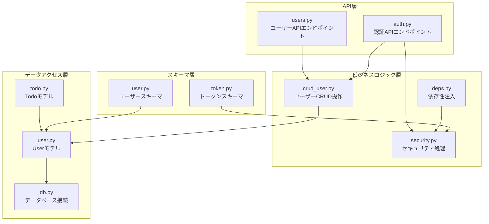

**図の出典**
- [backend/app/api/api_v1/endpoints/users.py:1-14](file://backend/app/api/api_v1/endpoints/users.py#L1-L14)
- [backend/app/api/api_v1/endpoints/auth.py:1-53](file://backend/app/api/api_v1/endpoints/auth.py#L1-L53)
- [backend/app/crud/crud_user.py:1-22](file://backend/app/crud/crud_user.py#L1-L22)
- [backend/app/core/security.py:1-35](file://backend/app/core/security.py#L1-L35)

**セクションの出典**
- [backend/app/models/user.py:1-16](file://backend/app/models/user.py#L1-L16)
- [backend/app/crud/crud_user.py:1-22](file://backend/app/crud/crud_user.py#L1-L22)
- [backend/app/api/api_v1/endpoints/users.py:1-14](file://backend/app/api/api_v1/endpoints/users.py#L1-L14)

## コアコンポーネント

### Userモデル

UserモデルはSQLModelを使用して定義されており、UUIDを主キーとして使用し、パスワードはハッシュ化して保存されます。

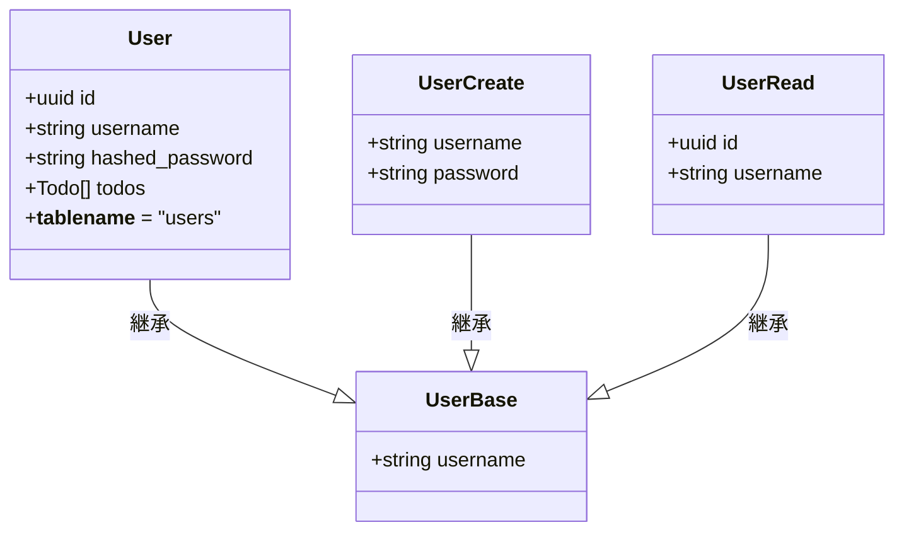

**図の出典**
- [backend/app/models/user.py:9-16](file://backend/app/models/user.py#L9-L16)
- [backend/app/schemas/user.py:4-12](file://backend/app/schemas/user.py#L4-L12)

### 認証システム

認証システムはJWTベースで、パスワードハッシュ化にはArgon2アルゴリズムを使用します。

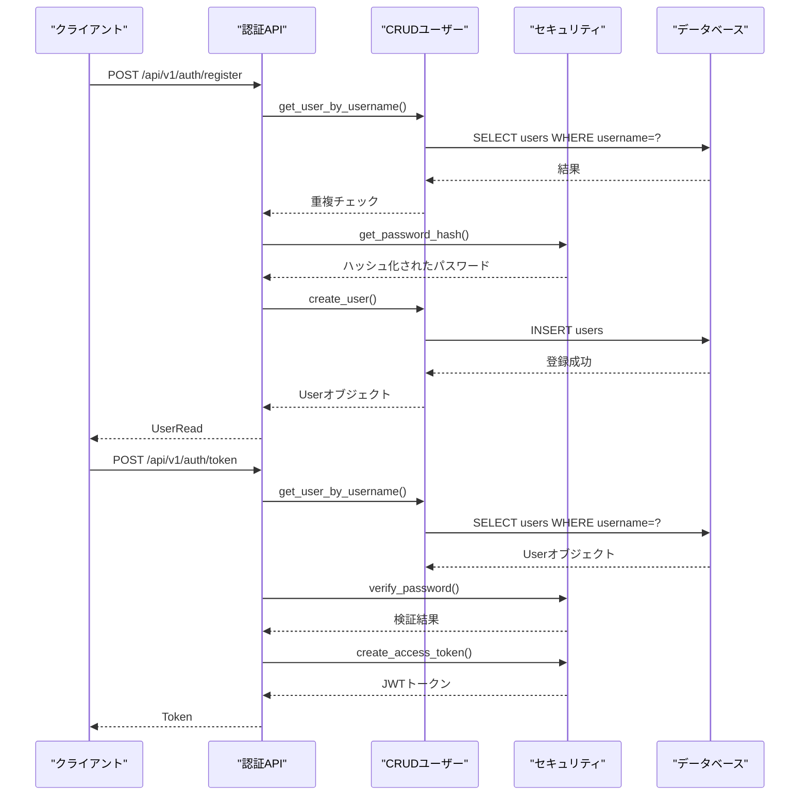

**図の出典**
- [backend/app/api/api_v1/endpoints/auth.py:17-53](file://backend/app/api/api_v1/endpoints/auth.py#L17-L53)
- [backend/app/crud/crud_user.py:7-22](file://backend/app/crud/crud_user.py#L7-L22)
- [backend/app/core/security.py:10-27](file://backend/app/core/security.py#L10-L27)

**セクションの出典**
- [backend/app/models/user.py:1-16](file://backend/app/models/user.py#L1-L16)
- [backend/app/schemas/user.py:1-12](file://backend/app/schemas/user.py#L1-L12)
- [backend/app/core/security.py:1-35](file://backend/app/core/security.py#L1-L35)

## アーキテクチャ概要

### データベース設計

マイグレーションファイルにより、usersテーブルとtodosテーブルが定義されており、ユーザーとタスクの関連付けが設定されています。

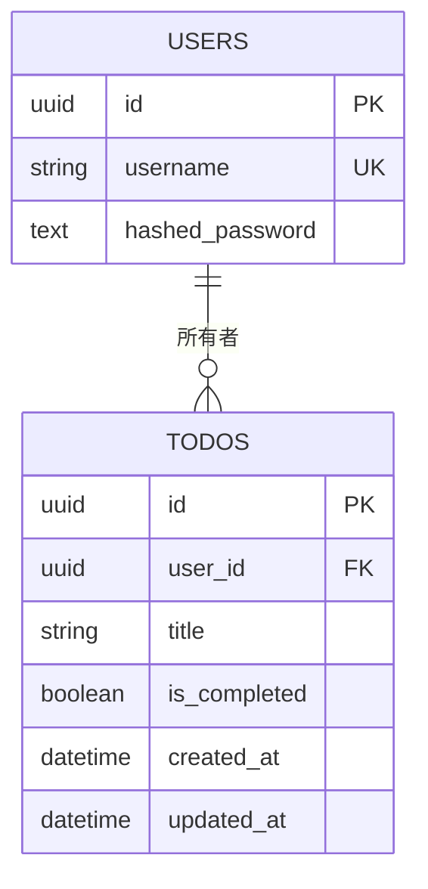

**図の出典**
- [backend/migrations/versions/4f4084d80ebd_create_users_and_todos_tables.py:24-40](file://backend/migrations/versions/4f4084d80ebd_create_users_and_todos_tables.py#L24-L40)

### 認証フロー

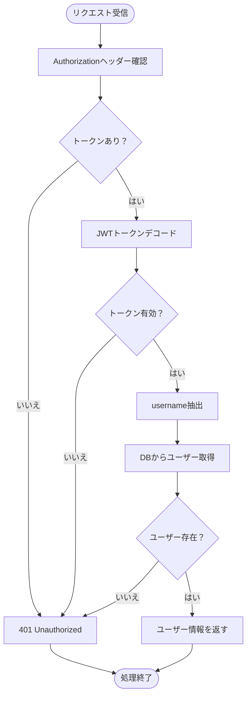

**図の出典**
- [backend/app/api/deps.py:12-31](file://backend/app/api/deps.py#L12-L31)

**セクションの出典**
- [backend/migrations/versions/4f4084d80ebd_create_users_and_todos_tables.py:1-51](file://backend/migrations/versions/4f4084d80ebd_create_users_and_todos_tables.py#L1-L51)
- [backend/app/api/deps.py:1-31](file://backend/app/api/deps.py#L1-L31)

## 詳細コンポーネント分析

### CRUD操作の実装

#### ユーザー作成 (Create)

ユーザー作成操作は、パスワードのハッシュ化と重複チェックを含みます。

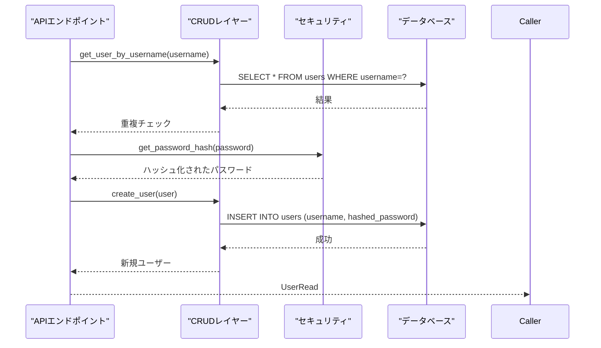

**図の出典**
- [backend/app/api/api_v1/endpoints/auth.py:17-32](file://backend/app/api/api_v1/endpoints/auth.py#L17-L32)
- [backend/app/crud/crud_user.py:12-22](file://backend/app/crud/crud_user.py#L12-L22)
- [backend/app/core/security.py:13-14](file://backend/app/core/security.py#L13-L14)

#### 読み取り (Read)

ユーザー情報の読み取りは、現在ログイン中のユーザー情報を取得するためのエンドポイントで実装されています。

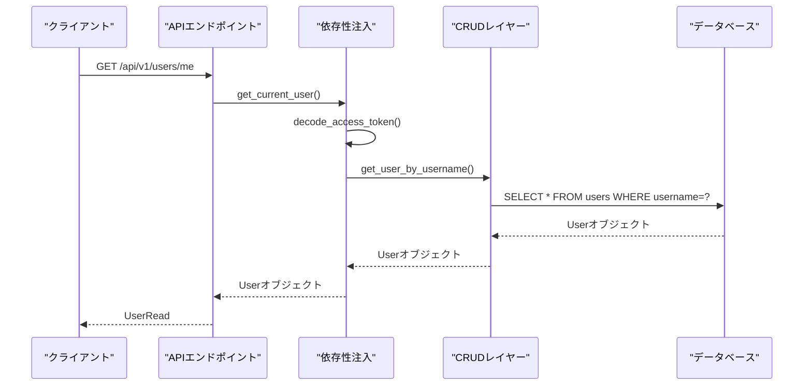

**図の出典**
- [backend/app/api/api_v1/endpoints/users.py:9-13](file://backend/app/api/api_v1/endpoints/users.py#L9-L13)
- [backend/app/api/deps.py:12-31](file://backend/app/api/deps.py#L12-L31)
- [backend/app/crud/crud_user.py:7-10](file://backend/app/crud/crud_user.py#L7-L10)

#### 更新操作

現在の実装では、ユーザー情報の更新操作は提供されていません。必要に応じて、以下のメソッドを追加することで実装できます：

```python
# 例: ユーザー更新CRUDメソッド
async def update_user(db: AsyncSession, user_id: uuid.UUID, user_update: UserUpdate) -> User:
    statement = select(User).where(User.id == user_id)
    result = await db.execute(statement)
    db_user = result.scalar_one_or_none()
    
    if db_user is None:
        return None
    
    # 更新処理
    for key, value in user_update.model_dump(exclude_unset=True).items():
        setattr(db_user, key, value)
    
    await db.commit()
    await db.refresh(db_user)
    return db_user

# 例: パスワード変更
async def change_password(db: AsyncSession, user_id: uuid.UUID, old_password: str, new_password: str) -> bool:
    statement = select(User).where(User.id == user_id)
    result = await db.execute(statement)
    db_user = result.scalar_one_or_none()
    
    if db_user is None or not verify_password(old_password, db_user.hashed_password):
        return False
    
    db_user.hashed_password = get_password_hash(new_password)
    await db.commit()
    return True
```

#### 削除操作

現在の実装では、ユーザー情報の削除操作は提供されていません。必要に応じて、以下のメソッドを追加することで実装できます：

```python
# 例: ユーザー削除CRUDメソッド
async def delete_user(db: AsyncSession, user_id: uuid.UUID) -> bool:
    statement = select(User).where(User.id == user_id)
    result = await db.execute(statement)
    db_user = result.scalar_one_or_none()
    
    if db_user is None:
        return False
    
    db.delete(db_user)
    await db.commit()
    return True
```

**セクションの出典**
- [backend/app/crud/crud_user.py:1-22](file://backend/app/crud/crud_user.py#L1-L22)
- [backend/app/api/api_v1/endpoints/users.py:1-14](file://backend/app/api/api_v1/endpoints/users.py#L1-L14)

### セキュリティ対策

#### パスワードハッシュ化

パスワードハッシュ化にはArgon2アルゴリズムを使用し、セキュリティを高めています。

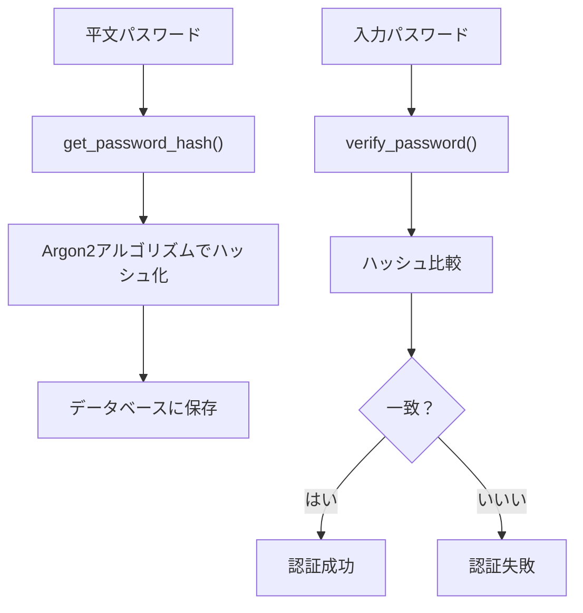

**図の出典**
- [backend/app/core/security.py:7-14](file://backend/app/core/security.py#L7-L14)

#### 認証情報管理

JWTトークンを使用した認証情報管理システムは以下の通りです：

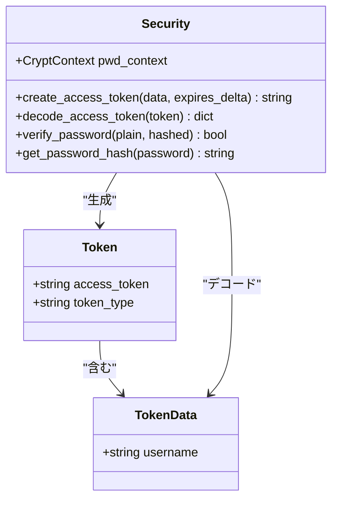

**図の出典**
- [backend/app/schemas/token.py:4-10](file://backend/app/schemas/token.py#L4-L10)
- [backend/app/core/security.py:1-35](file://backend/app/core/security.py#L1-L35)

**セクションの出典**
- [backend/app/core/security.py:1-35](file://backend/app/core/security.py#L1-L35)
- [backend/app/schemas/token.py:1-10](file://backend/app/schemas/token.py#L1-L10)

### 重複ユーザー防止

重複ユーザーの防止は、データベースレベルとアプリケーションレベルの両方で実装されています。

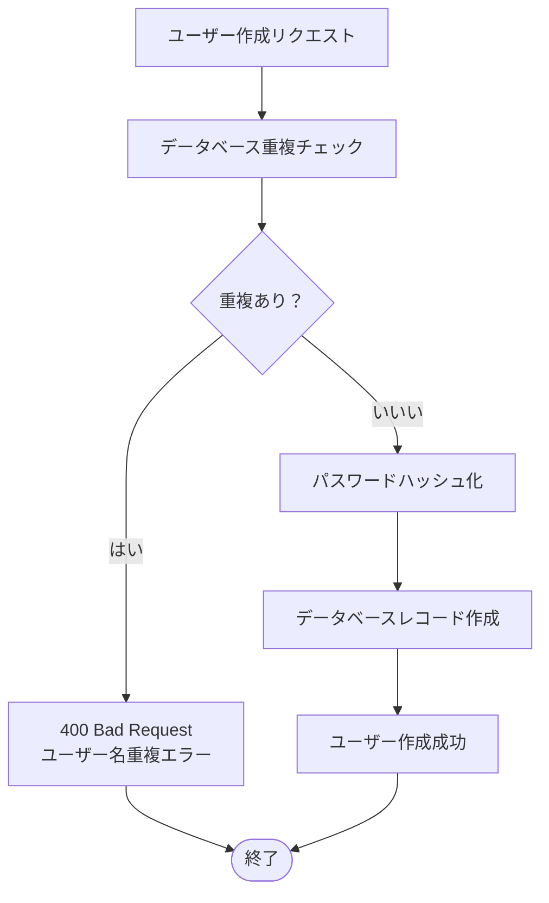

**図の出典**
- [backend/app/api/api_v1/endpoints/auth.py:25-32](file://backend/app/api/api_v1/endpoints/auth.py#L25-L32)

**セクションの出典**
- [backend/app/api/api_v1/endpoints/auth.py:1-53](file://backend/app/api/api_v1/endpoints/auth.py#L1-L53)
- [backend/migrations/versions/4f4084d80ebd_create_users_and_todos_tables.py:26-29](file://backend/migrations/versions/4f4084d80ebd_create_users_and_todos_tables.py#L26-L29)

## 依存関係分析

### 外部依存関係

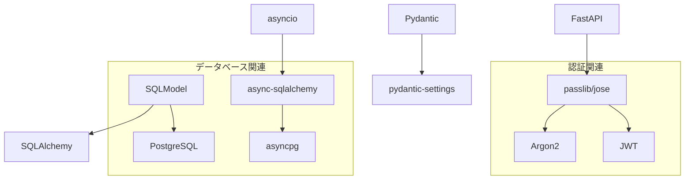

### 内部依存関係

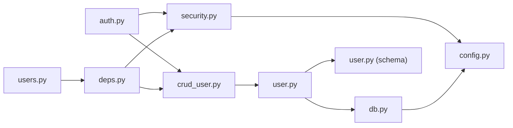

**図の出典**
- [backend/app/api/api_v1/endpoints/auth.py:1-53](file://backend/app/api/api_v1/endpoints/auth.py#L1-L53)
- [backend/app/api/api_v1/endpoints/users.py:1-14](file://backend/app/api/api_v1/endpoints/users.py#L1-L14)
- [backend/app/crud/crud_user.py:1-22](file://backend/app/crud/crud_user.py#L1-L22)
- [backend/app/api/deps.py:1-31](file://backend/app/api/deps.py#L1-L31)

**セクションの出典**
- [backend/app/api/api_v1/endpoints/auth.py:1-53](file://backend/app/api/api_v1/endpoints/auth.py#L1-L53)
- [backend/app/api/api_v1/endpoints/users.py:1-14](file://backend/app/api/api_v1/endpoints/users.py#L1-L14)
- [backend/app/crud/crud_user.py:1-22](file://backend/app/crud/crud_user.py#L1-L22)
- [backend/app/api/deps.py:1-31](file://backend/app/api/deps.py#L1-L31)

## パフォーマンス考慮事項

### 非同期処理

アプリケーションは非同期処理を積極的に使用しており、データベース操作や外部API呼び出しに対して効率的な処理が可能です。

### インデックス最適化

データベーススキーマには以下のインデックスが設定されています：
- usersテーブルのusernameカラムにユニークインデックス
- todosテーブルのcreated_at、is_completed、priority、due_dateカラムにインデックス

### 認証キャッシュ

JWTトークンの検証結果をキャッシュすることで、認証処理のパフォーマンスを向上させることができます。

## トラブルシューティングガイド

### 認証エラー

**問題**: 401 Unauthorizedエラーが発生する
**原因**: 有効期限切れのJWTトークン、無効なトークン、ユーザーが存在しない
**対処**: 
1. トークンの有効期限を確認
2. Authorizationヘッダーの形式を確認
3. ユーザーがまだ存在するか確認

**セクションの出典**
- [backend/app/api/deps.py:17-29](file://backend/app/api/deps.py#L17-L29)

### パスワード認証失敗

**問題**: パスワード認証が失敗する
**原因**: 入力されたパスワードが間違っている、パスワードハッシュの不一致
**対処**:
1. 入力されたパスワードを再確認
2. パスワードハッシュの再生成を検討

**セクションの出典**
- [backend/app/api/api_v1/endpoints/auth.py:42-47](file://backend/app/api/api_v1/endpoints/auth.py#L42-L47)

### ユーザー作成エラー

**問題**: 重複ユーザーによる作成失敗
**原因**: 既に使用されているユーザー名
**対処**:
1. 他のユーザー名を使用する
2. 既存ユーザーのパスワードリセットを行う

**セクションの出典**
- [backend/app/api/api_v1/endpoints/auth.py:26-30](file://backend/app/api/api_v1/endpoints/auth.py#L26-L30)

## 結論

Todoアプリケーションのユーザー管理CRUD操作は、以下の特徴を持っています：

1. **堅牢なセキュリティ**: Argon2によるパスワードハッシュ化、JWTベースの認証システム、Rate Limitingによる保護
2. **非同期処理**: 高性能なデータベース操作と外部API連携
3. **型安全性**: PydanticとSQLModelによる完全な型チェック
4. **拡張性**: 現在のCRUD操作に加えて、更新と削除操作を簡単に追加可能

今後の改善点としては、ユーザー情報の更新と削除機能の追加、認証キャッシュの導入、より詳細なエラーハンドリングの実装などが考えられます。これらの機能により、より堅牢でユーザーフレンドリーなユーザー管理システムが実現できます。