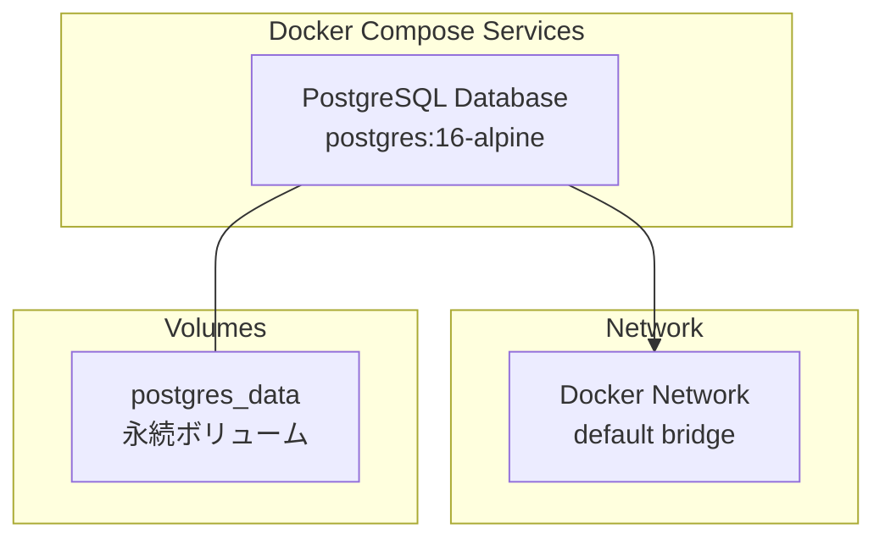
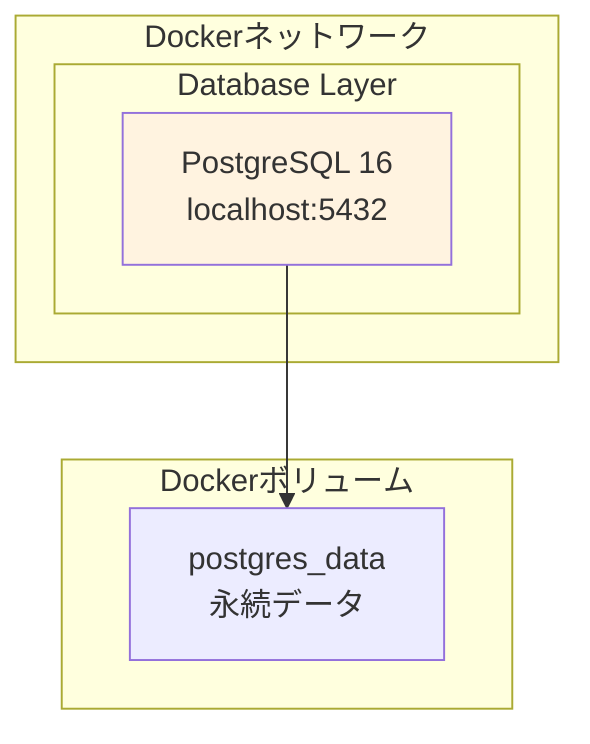
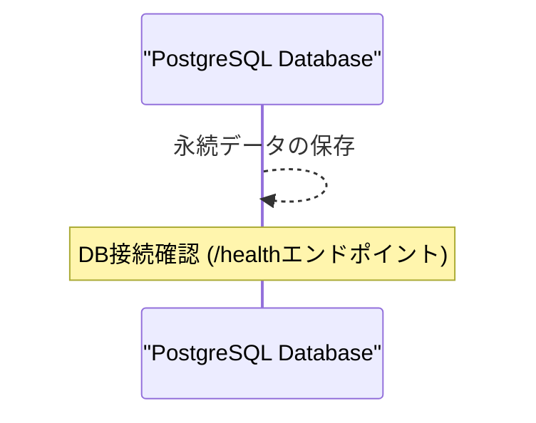
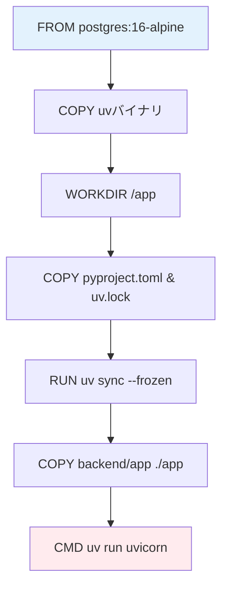
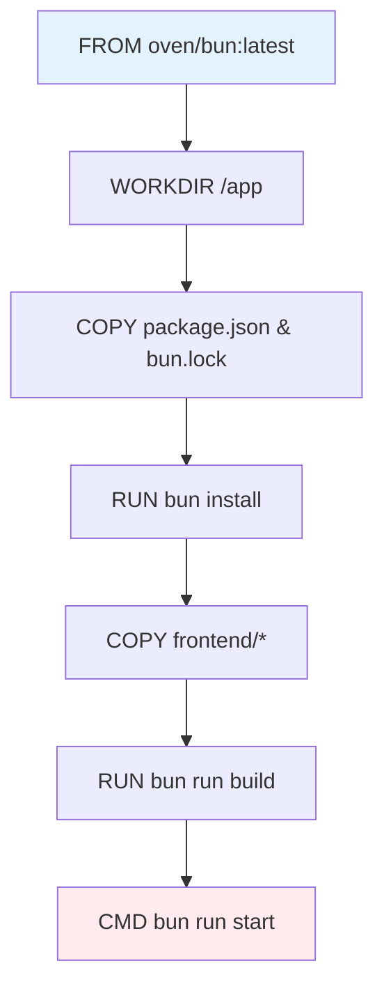
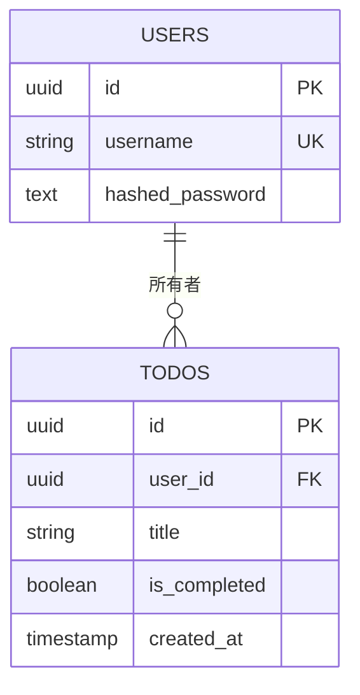
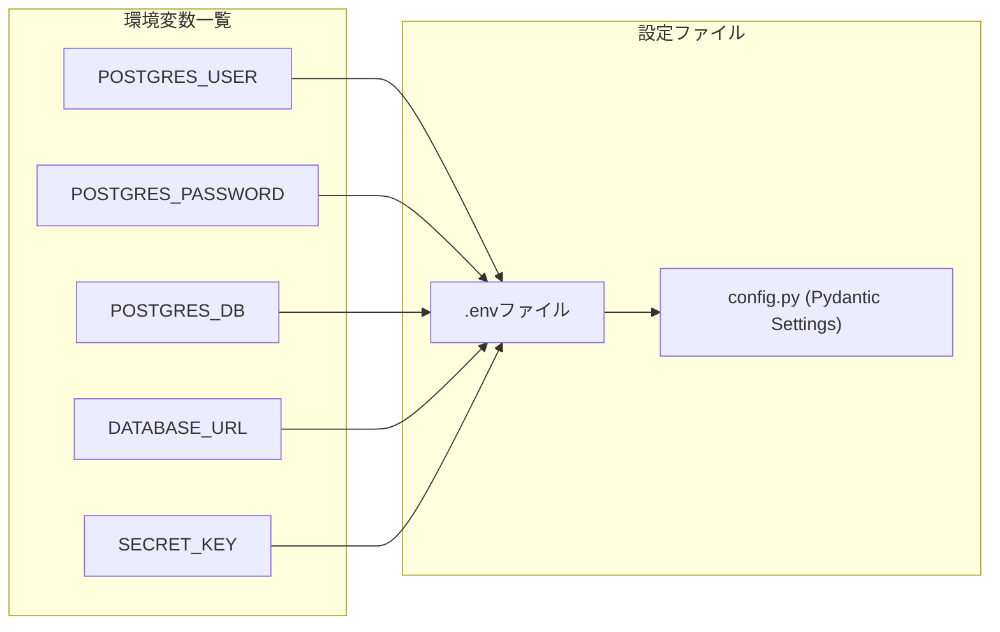
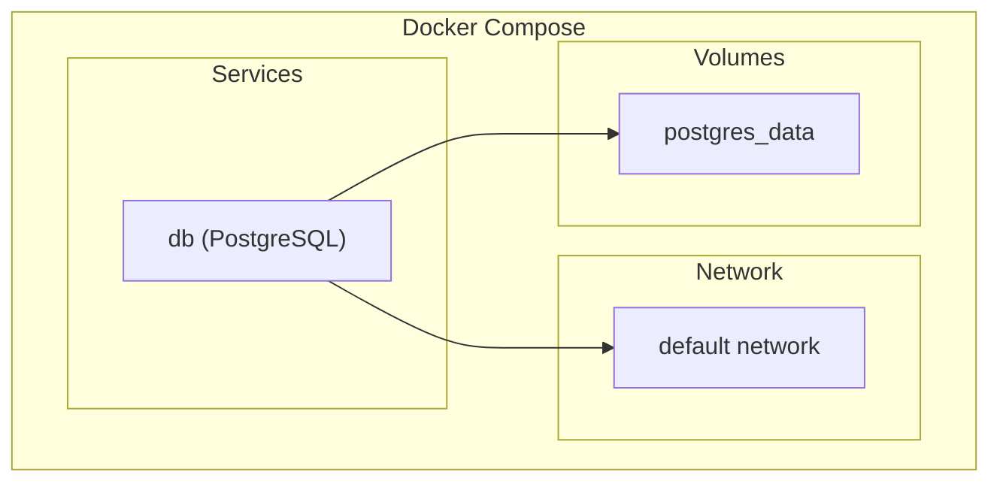

# Dockerコンテナ化

<cite>
**このドキュメントで参照されるファイル**
- [docker-compose.yml](file://docker-compose.yml)
- [backend/Dockerfile](file://docker/backend/Dockerfile)
- [frontend/Dockerfile](file://docker/frontend/Dockerfile)
- [backend/pyproject.toml](file://backend/pyproject.toml)
- [frontend/package.json](file://frontend/package.json)
- [backend/uv.lock](file://backend/uv.lock)
- [frontend/bun.lock](file://frontend/bun.lock)
- [backend/app/main.py](file://backend/app/main.py)
- [backend/app/core/config.py](file://backend/app/core/config.py)
- [backend/app/database.py](file://backend/app/database.py)
- [backend/app/models.py](file://backend/app/models.py)
- [justfile](file://justfile)
</cite>

## 目次
1. [はじめに](#はじめに)
2. [プロジェクト構造](#プロジェクト構造)
3. [コアコンポーネント](#コアコンポーネント)
4. [アーキテクチャ概観](#アーキテクチャ概観)
5. [詳細コンポーネント解析](#詳細コンポーネント解析)
6. [依存関係分析](#依存関係分析)
7. [パフォーマンス考慮事項](#パフォーマンス考慮事項)
8. [トラブルシューティングガイド](#トラブルシューティングガイド)
9. [本番環境へのデプロイ手順](#本番環境へのデプロイ手順)
10. [結論](#結論)

## はじめに
本プロジェクトはTodoアプリケーションをDockerコンテナ化することで、開発・テスト・本番環境の一貫した実行環境を提供しています。このドキュメントでは、サービス構成（databaseのみ）、Dockerfileの内容、docker-compose.ymlの構成要素、ネットワーク設定、ボリュームマウント、環境変数の渡し方について詳細に説明します。また、コンテナの起動手順、ログの確認方法、トラブルシューティングの方法、本番環境へのデプロイ手順も網羅的に記載します。

**更新**: Docker Compose構成が大幅に簡略化され、現在はdatabaseサービスのみが定義されています。backendとfrontendのコンテナ化は個別の手順で行う必要があります。

## プロジェクト構造
プロジェクトは以下のコンポーネントから構成されています：
- **database service**: PostgreSQL 16-alpineイメージを使用し、永続的なデータストレージを提供



**図の出典**
- [docker-compose.yml:1-16](file://docker-compose.yml#L1-L16)

**セクションの出典**
- [docker-compose.yml:1-16](file://docker-compose.yml#L1-L16)

## コアコンポーネント
本プロジェクトのDockerコンテナ化には以下のコンポーネントが含まれます：

### Database Service (PostgreSQL)
- **イメージ**: postgres:16-alpine
- **ポート**: 5432:5432
- **永続ボリューム**: postgres_data
- **環境変数**: POSTGRES_USER, POSTGRES_PASSWORD, POSTGRES_DB

**セクションの出典**
- [docker-compose.yml:2-12](file://docker-compose.yml#L2-L12)

## アーキテクチャ概観
全体のシステムアーキテクチャは以下の通りです：



**図の出典**
- [docker-compose.yml:1-16](file://docker-compose.yml#L1-L16)
- [backend/app/main.py:1-23](file://backend/app/main.py#L1-L23)

### サービス間通信フロー


**図の出典**
- [backend/app/main.py:92-99](file://backend/app/main.py#L92-L99)

## 詳細コンポーネント解析

### Database Dockerfile解析
databaseサービスのDockerfileは以下の構成になっています：



**図の出典**
- [docker/backend/Dockerfile:1-10](file://docker/backend/Dockerfile#L1-L10)

#### 依存関係管理
- **パッケージマネージャー**: uv (Astral Sh)
- **依存関係**: FastAPI, SQLAlchemy, Pydantic, Uvicornなど
- **Pythonバージョン**: >=3.10

**セクションの出典**
- [docker/backend/Dockerfile:1-10](file://docker/backend/Dockerfile#L1-L10)
- [backend/pyproject.toml:1-22](file://backend/pyproject.toml#L1-L22)

### Frontend Dockerfile解析
frontend/Dockerfileは以下の構成になっています：



**図の出典**
- [docker/frontend/Dockerfile:1-8](file://docker/frontend/Dockerfile#L1-L8)

#### Next.js設定
- **フレームワーク**: Next.js 16.2.4
- **ランタイム**: Bun (Bun Runtime)
- **依存関係**: React 19.2.4, TypeScript, TailwindCSS

**セクションの出典**
- [docker/frontend/Dockerfile:1-8](file://docker/frontend/Dockerfile#L1-L8)
- [frontend/package.json:1-50](file://frontend/package.json#L1-L50)

### Database設定解析
PostgreSQLサービスの設定は以下の通りです：



**図の出典**
- [backend/app/models.py:7-22](file://backend/app/models.py#L7-L22)

#### 接続設定
- **接続文字列**: DATABASE_URL (環境変数経由)
- **認証情報**: POSTGRES_USER, POSTGRES_PASSWORD, POSTGRES_DB
- **永続化**: postgres_dataボリューム

**セクションの出典**
- [docker-compose.yml:2-12](file://docker-compose.yml#L2-L12)
- [backend/app/core/config.py:24-37](file://backend/app/core/config.py#L24-L37)

### 設定管理
環境変数の管理は以下の通りです：



**図の出典**
- [docker-compose.yml:5-8](file://docker-compose.yml#L5-L8)
- [backend/app/core/config.py:24-48](file://backend/app/core/config.py#L24-L48)

**セクションの出典**
- [docker-compose.yml:5-8](file://docker-compose.yml#L5-L8)
- [backend/app/core/config.py:24-48](file://backend/app/core/config.py#L24-L48)

## 依存関係分析
サービス間の依存関係とネットワーク構成は以下の通りです：



**図の出典**
- [docker-compose.yml:1-16](file://docker-compose.yml#L1-L16)

### 依存関係の詳細
- **db**: 常に起動（restart: always）
- **backend**: dbの起動後に起動（depends_on: db）
- **frontend**: backendの起動後に起動（depends_on: backend）

**セクションの出典**
- [docker-compose.yml:1-16](file://docker-compose.yml#L1-L16)

## パフォーマンス考慮事項
Dockerコンテナ化によるパフォーマンス特性について以下の点が重要です：

### 画像サイズと起動時間
- **database**: Alpine Linuxベースの軽量イメージ

### リソース最適化
- **依存関係の固定**: uv sync --frozenにより、依存関係の固定化
- **マルチステージビルド**: 依存関係のキャッシュと再利用
- **ボリュームの永続化**: データの永続保存とコンテナの再作成時のデータ保持

### ネットワーク効率
- **内部ネットワーク**: Dockerの内部ネットワークを使用し、ホストとの通信を最小限に
- **ポートマッピング**: 必要なポートのみをホストにマッピング

## トラブルシューティングガイド

### 基本的なトラブルシューティング手順
1. **サービスの状態確認**
   ```bash
   docker compose ps
   ```

2. **ログの確認**
   ```bash
   docker compose logs -f
   docker compose logs -f db
   ```

3. **コンテナの再起動**
   ```bash
   docker compose down
   docker compose up -d
   ```

### 共通問題と解決策

#### Database接続エラー
- **症状**: backendサービスがDBに接続できない
- **原因**: DATABASE_URLの設定ミス、DBコンテナの起動遅延
- **解決**: 
  - 環境変数の確認
  - `depends_on`の使用による起動順序の調整
  - `/health`エンドポイントでのDB接続確認

#### Port衝突エラー
- **症状**: ポート5432が使用中
- **解決**: 
  - 使用中のプロセスを確認して終了
  - docker-compose.ymlのポートマッピングを変更

#### 依存関係の問題
- **症状**: uv syncまたはbun installが失敗
- **解決**: 
  - `uv.lock`または`bun.lock`の更新
  - インターネット接続の確認
  - キャッシュのクリア

**セクションの出典**
- [justfile:11-25](file://justfile#L11-L25)
- [docker-compose.yml:1-16](file://docker-compose.yml#L1-L16)

### 高度なトラブルシューティング
1. **コンテナ内のシェルアクセス**
   ```bash
   docker compose exec db psql -U username -d dbname
   ```

2. **依存関係の確認**
   ```bash
   docker compose exec backend ls -la /app
   docker compose exec frontend ls -la /app
   ```

3. **ネットワークの診断**
   ```bash
   docker network ls
   docker network inspect <network_name>
   ```

## 本番環境へのデプロイ手順

### 前準備
1. **環境変数の設定**
   - `.env`ファイルの作成
   - 本番用のDATABASE_URL、SECRET_KEYの設定

2. **イメージのビルド**
   ```bash
   docker compose build
   ```

3. **サービスの起動**
   ```bash
   docker compose up -d
   ```

### 本番環境での設定変更
- **ポート**: 外部に公開する必要のあるポートのみをマッピング
- **ボリューム**: 永続ボリュームの設定をクラウドストレージに変更
- **セキュリティ**: 
  - 認証情報の暗号化
  - HTTPSの設定
  - ファイアウォールの設定

### モニタリングとロギング
1. **コンテナの監視**
   ```bash
   docker compose ps
   docker compose stats
   ```

2. **ログの収集**
   - Dockerのログ出力設定
   - 外部ロギングサービスへの統合

3. **ヘルスチェック**
   - `/health`エンドポイントの定期監視
   - DB接続の定期確認

### スケーラビリティの考慮
- **ロードバランシング**: 複数のバックエンドコンテナの起動
- **データベースのクラスタリング**: PostgreSQLのレプリケーション設定
- **キャッシュ層**: Redisなどのキャッシュサービスの追加

## 結論
本プロジェクトのDockerコンテナ化は、以下の利点を提供します：
- **一貫性**: 開発・テスト・本番環境での実行環境の統一
- **移動性**: コンテナの再作成による迅速な環境セットアップ
- **スケーラビリティ**: サービスの独立性による拡張性
- **保守性**: 明確な依存関係と設定管理による運用の簡素化

**更新**: Docker Compose構成が大幅に簡略化され、databaseサービスのみが現在の標準構成となっています。backendとfrontendのコンテナ化は個別の手順で行う必要があります。これらのコンテナ化手法により、Todoアプリケーションは効率的かつ信頼性の高い形で運用可能になります。トラブルシューティングや本番環境へのデプロイにおいても、Docker Composeの強力な機能を活用することで、迅速な対応が可能です。