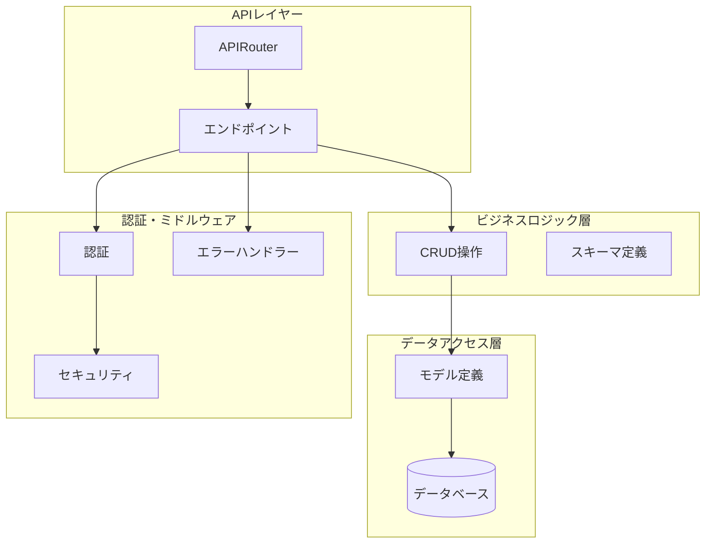
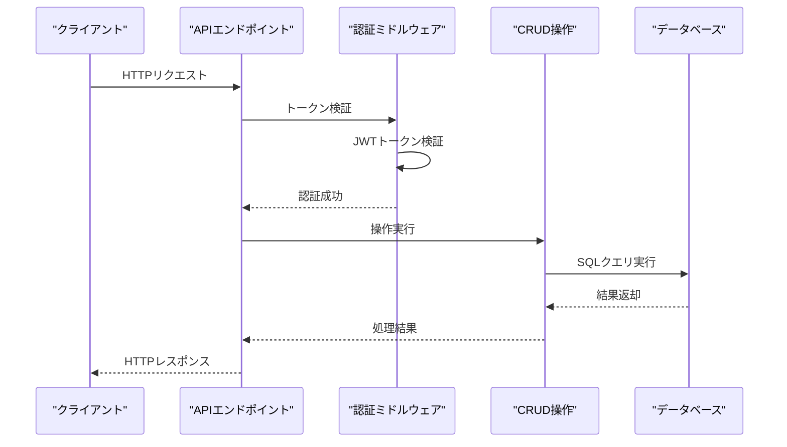
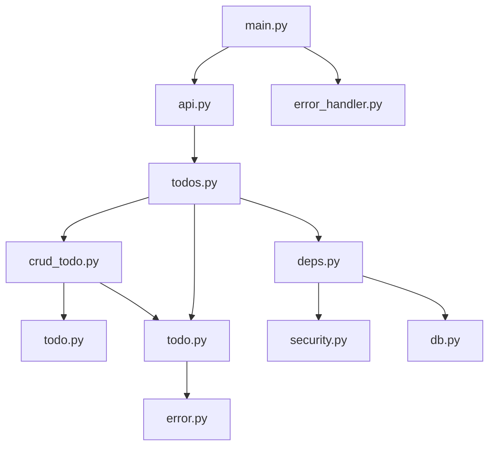

# CRUD操作

<cite>
**この文書で参照されるファイル**
- [backend/app/api/api_v1/endpoints/todos.py](file://backend/app/api/api_v1/endpoints/todos.py)
- [backend/app/crud/crud_todo.py](file://backend/app/crud/crud_todo.py)
- [backend/app/models/todo.py](file://backend/app/models/todo.py)
- [backend/app/schemas/todo.py](file://backend/app/schemas/todo.py)
- [backend/app/api/deps.py](file://backend/app/api/deps.py)
- [backend/app/middleware/error_handler.py](file://backend/app/middleware/error_handler.py)
- [backend/app/core/db.py](file://backend/app/core/db.py)
- [backend/app/api/api_v1/api.py](file://backend/app/api/api_v1/api.py)
- [backend/app/schemas/error.py](file://backend/app/schemas/error.py)
- [backend/app/core/security.py](file://backend/app/core/security.py)
- [backend/app/main.py](file://backend/app/main.py)
- [backend/tests/test_todos.py](file://backend/tests/test_todos.py)
</cite>

## 目次
1. [導入](#導入)
2. [プロジェクト構造](#プロジェクト構造)
3. [コアコンポーネント](#コアコンポーネント)
4. [アーキテクチャ概観](#アーキテクチャ概観)
5. [詳細コンポーネント分析](#詳細コンポーネント分析)
6. [依存関係分析](#依存関係分析)
7. [パフォーマンス考慮事項](#パフォーマンス考慮事項)
8. [トラブルシューティングガイド](#トラブルシューティングガイド)
9. [結論](#結論)

## 導入
本ドキュメントは、TodoアプリケーションにおけるCRUD操作（作成、読み取り、更新、削除）の詳細なAPI仕様と実装方法を提供します。FastAPIフレームワークを使用し、SQLAlchemyとSQLModelによる非同期データベース操作、Pydanticによるスキーマ定義、JWTによる認証を実装しています。

## プロジェクト構造
Todo関連のAPIは以下の層構造で実装されています：

**図の出典**
- [backend/app/api/api_v1/endpoints/todos.py:1-102](file://backend/app/api/api_v1/endpoints/todos.py#L1-L102)
- [backend/app/api/api_v1/api.py:1-8](file://backend/app/api/api_v1/api.py#L1-L8)

**セクションの出典**
- [backend/app/api/api_v1/endpoints/todos.py:1-102](file://backend/app/api/api_v1/endpoints/todos.py#L1-L102)
- [backend/app/api/api_v1/api.py:1-8](file://backend/app/api/api_v1/api.py#L1-L8)

## コアコンポーネント
Todo CRUD操作に関連する主要なコンポーネントは以下の通りです：

### APIエンドポイント
- `/api/v1/todos/` - Todo一覧取得、作成
- `/api/v1/todos/count` - Todo件数取得
- `/api/v1/todos/{id}` - Todo更新、削除

### データモデル
- Todoモデル：UUID主キー、ユーザーID外部キー、作成日時、更新日時
- 優先度：HIGH/MEDIUM/LOWのEnum値
- タグ：カンマ区切りの文字列

### CRUD操作
- 一覧取得：検索、フィルタリング、ソート、ページネーション対応
- 件数取得：検索、フィルタリング対応
- 作成：TodoCreateスキーマに基づくバリデーション
- 更新：TodoUpdateスキーマに基づく部分更新
- 削除：論理削除ではなく物理削除

**セクションの出典**
- [backend/app/models/todo.py:1-25](file://backend/app/models/todo.py#L1-L25)
- [backend/app/schemas/todo.py:1-41](file://backend/app/schemas/todo.py#L1-L41)
- [backend/app/crud/crud_todo.py:1-152](file://backend/app/crud/crud_todo.py#L1-L152)

## アーキテクチャ概観
Todo CRUD操作の全体像は以下の通りです：

**図の出典**
- [backend/app/api/deps.py:13-37](file://backend/app/api/deps.py#L13-L37)
- [backend/app/crud/crud_todo.py:10-152](file://backend/app/crud/crud_todo.py#L10-L152)
- [backend/app/api/api_v1/endpoints/todos.py:1-102](file://backend/app/api/api_v1/endpoints/todos.py#L1-L102)

## 詳細コンポーネント分析

### APIエンドポイント設計

#### GET /api/v1/todos/count
- **目的**: Todo件数の取得
- **認証**: 必須（JWT Bearer）
- **クエリパラメータ**:
  - `search`: 検索キーワード（部分一致）
  - `is_completed`: 完了状態でのフィルタ
  - `priority`: 優先度でのフィルタ
  - `tags`: タグでのフィルタ（カンマ区切り）

#### GET /api/v1/todos
- **目的**: Todo一覧の取得
- **認証**: 必須（JWT Bearer）
- **クエリパラメータ**:
  - `skip`: スキップする件数（デフォルト: 0）
  - `limit`: 取得件数（デフォルト: 100、最小: 1、最大: 100）
  - `search`: 検索キーワード
  - `is_completed`: 完了状態でのフィルタ
  - `priority`: 優先度でのフィルタ
  - `tags`: タグでのフィルタ（カンマ区切り）
  - `sort_by`: ソート対象（created_at/priority/due_date、デフォルト: created_at）
  - `sort_order`: ソート順（asc/desc、デフォルト: desc）

#### POST /api/v1/todos
- **目的**: 新しいTodoの作成
- **認証**: 必須（JWT Bearer）
- **リクエストボディ**: TodoCreateスキーマ
- **レスポンス**: TodoReadスキーマ

#### PUT /api/v1/todos/{id}
- **目的**: 指定Todoの更新
- **認証**: 必須（JWT Bearer）
- **パスパラメータ**: id（UUID）
- **リクエストボディ**: TodoUpdateスキーマ（任意フィールドのみ）
- **レスポンス**: TodoReadスキーマ

#### DELETE /api/v1/todos/{id}
- **目的**: 指定Todoの削除
- **認証**: 必須（JWT Bearer）
- **パスパラメータ**: id（UUID）
- **レスポンス**: TodoDeleteResponseスキーマ

**セクションの出典**
- [backend/app/api/api_v1/endpoints/todos.py:13-102](file://backend/app/api/api_v1/endpoints/todos.py#L13-L102)

### データスキーマ定義

#### TodoCreateスキーマ
- `title`: 文字列（必須、最大255文字）
- `is_completed`: 真偽値（デフォルト: false）
- `priority`: 優先度Enum（HIGH/MEDIUM/LOW、デフォルト: LOW）
- `due_date`: 日時（任意）
- `tags`: タグ文字列（最大500文字、任意）

#### TodoUpdateスキーマ
- 各フィールドがOptional（部分更新対応）

#### TodoReadスキーマ
- TodoCreateスキーマに加えて：
  - `id`: UUID
  - `user_id`: UUID
  - `created_at`: 日時
  - `updated_at`: 日時

**セクションの出典**
- [backend/app/schemas/todo.py:13-41](file://backend/app/schemas/todo.py#L13-L41)

### 認証とセキュリティ

#### JWT Bearer認証
- トークンURL: `/api/v1/auth/token`
- トークン検証フロー：
  1. トークンのJWTデコード
  2. 有効期限の確認
  3. ユーザーIDの抽出
  4. DBからのユーザー情報取得

#### 認証ミドルウェア
- FastAPIのDependsを使用した依存性注入
- 401エラー時の適切なエラーレスポンス

**セクションの出典**
- [backend/app/api/deps.py:11-37](file://backend/app/api/deps.py#L11-L37)
- [backend/app/core/security.py:29-35](file://backend/app/core/security.py#L29-L35)

### CRUD操作の実装パターン

#### 一覧取得（get_todos）
- **検索フィルタ**: titleの部分一致検索
- **複数フィルタ**: is_completed、priority、tags（カンマ区切り）
- **ソート対象**: created_at、priority、due_date
- **ページネーション**: offset/limit
- **戻り値**: TodoReadオブジェクトのリスト

#### 件数取得（count_todos）
- **フィルタリング**: 検索条件を適用したCOUNTクエリ
- **戻り値**: 整数（件数）

#### 作成（create_todo）
- **バリデーション**: Pydanticスキーマによる検証
- **ユーザー紐付け**: current_user.idを自動設定
- **戻り値**: 作成されたTodoReadオブジェクト

#### 更新（update_todo）
- **部分更新**: 渡されたフィールドのみ更新
- **タイムスタンプ**: updated_atを現在時刻に更新
- **戻り値**: 更新されたTodoReadオブジェクト（存在しない場合はNone）

#### 削除（delete_todo）
- **物理削除**: DBからレコードを削除
- **戻り値**: 削除されたTodoオブジェクト

**セクションの出典**
- [backend/app/crud/crud_todo.py:10-152](file://backend/app/crud/crud_todo.py#L10-L152)

### データベース操作ロジック

#### SQLModel使用
- 非同期対応のAsyncSession
- select文によるクエリ構築
- Relationshipによる関連データ取得

#### インデックス最適化
- created_at、is_completed、priority、due_dateにインデックス
- 検索パフォーマンス向上

#### トランザクション管理
- 自動コミットとリフレッシュ
- 例外発生時のロールバック

**セクションの出典**
- [backend/app/models/todo.py:10-25](file://backend/app/models/todo.py#L10-L25)
- [backend/app/core/db.py:1-17](file://backend/app/core/db.py#L1-L17)

### エラーハンドリング実装

#### 統一エラーレスポンス
- ErrorResponseスキーマ
- 各HTTPステータスに対応した日本語メッセージ
- バリデーションエラーの詳細情報

#### 例外ハンドラー
- RequestValidationError: 422エラー
- HTTPException: 4xxエラー
- Exception: 500エラー
- RateLimitExceeded: 429エラー

#### ロギング統合
- 各エラー種別ごとのログレベル設定
- 詳細なエラーメタ情報の収集

**セクションの出典**
- [backend/app/middleware/error_handler.py:15-149](file://backend/app/middleware/error_handler.py#L15-L149)
- [backend/app/schemas/error.py:5-23](file://backend/app/schemas/error.py#L5-L23)

## 依存関係分析

**図の出典**
- [backend/app/api/api_v1/endpoints/todos.py:1-102](file://backend/app/api/api_v1/endpoints/todos.py#L1-L102)
- [backend/app/crud/crud_todo.py:1-152](file://backend/app/crud/crud_todo.py#L1-L152)
- [backend/app/api/deps.py:1-37](file://backend/app/api/deps.py#L1-L37)

### 外部依存関係
- **FastAPI**: Webフレームワーク
- **SQLAlchemy**: ORMと非同期対応
- **SQLModel**: モデル定義とスキーマ
- **Pydantic**: データバリデーション
- **JWTS**: JWTトークン処理
- **Passlib**: パスワードハッシュ化

**セクションの出典**
- [backend/app/main.py:1-168](file://backend/app/main.py#L1-L168)

## パフォーマンス考慮事項
- **インデックス最適化**: 検索頻度の高いカラムにインデックスを設定
- **クエリ最適化**: LIKE演算子の使用を避けるためのcontainsメソッド使用
- **ページネーション**: limitパラメータによる結果制限
- **非同期処理**: AsyncSessionによる非同期データベースアクセス
- **キャッシュ対応**: 今後の拡張としてRedisなどのキャッシュ機構の導入可能性

## トラブルシューティングガイド

### 共通エラー対応
- **401 Unauthorized**: トークンの有効性確認、再認証
- **404 Not Found**: 存在しないTodoの更新/削除操作
- **422 Unprocessable Entity**: リクエストスキーマのバリデーションエラー
- **500 Internal Server Error**: 予期しないサーバーエラー

### 認証関連問題
- トークンの期限切れ
- 不正なJWT形式
- DBに存在しないユーザーID

### データベース関連問題
- 接続エラー
- トランザクションの失敗
- インデックスの欠如

**セクションの出典**
- [backend/app/middleware/error_handler.py:107-122](file://backend/app/middleware/error_handler.py#L107-L122)
- [backend/tests/test_todos.py:147-151](file://backend/tests/test_todos.py#L147-L151)

## 結論
Todo CRUD操作は、堅牢な認証システム、明確なスキーマ定義、効率的なデータベース操作、統一されたエラーハンドリングによって実装されています。FastAPIとSQLModelの組み合わせにより、型安全で保守性の高いAPIが提供されています。今後の改善点としては、より高度なフィルタリング機能、キャッシュ機構、監視メトリクスの追加などが考えられます。