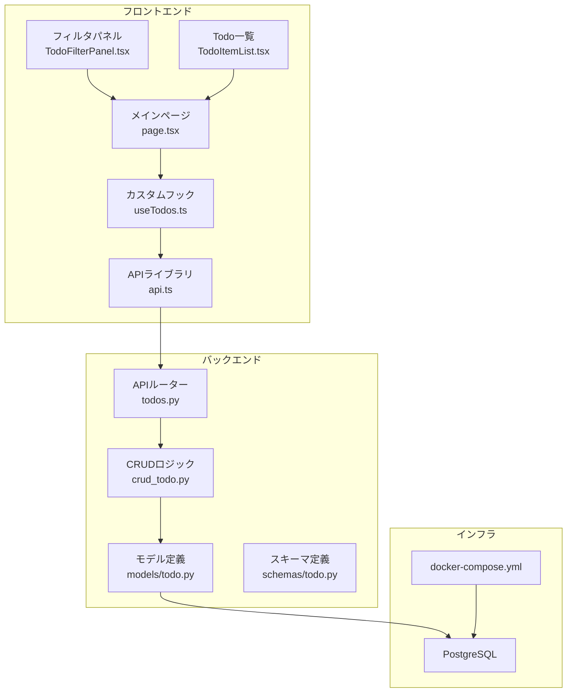
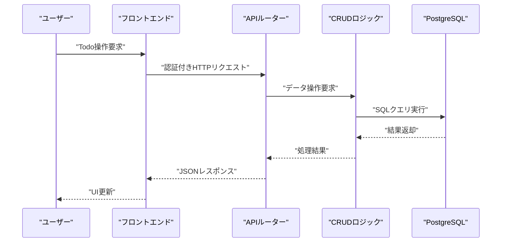
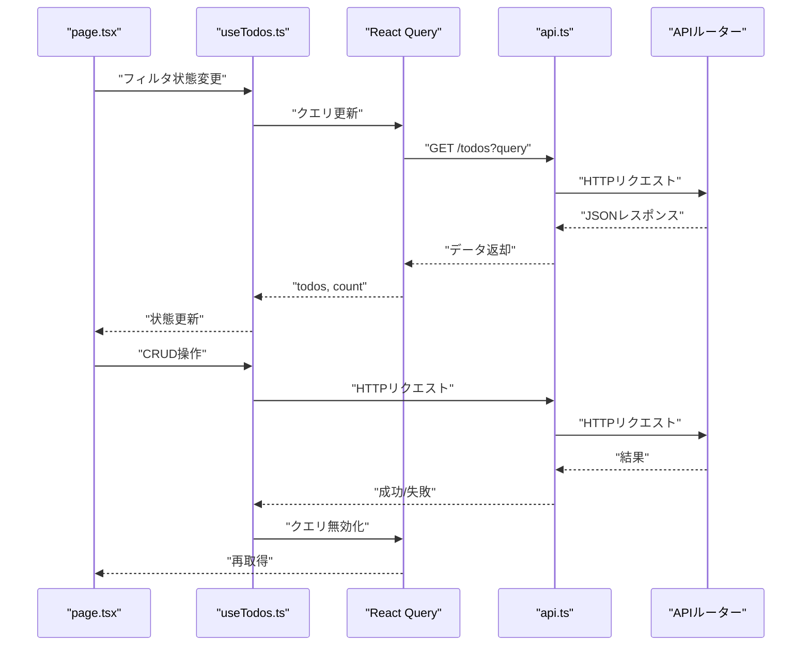
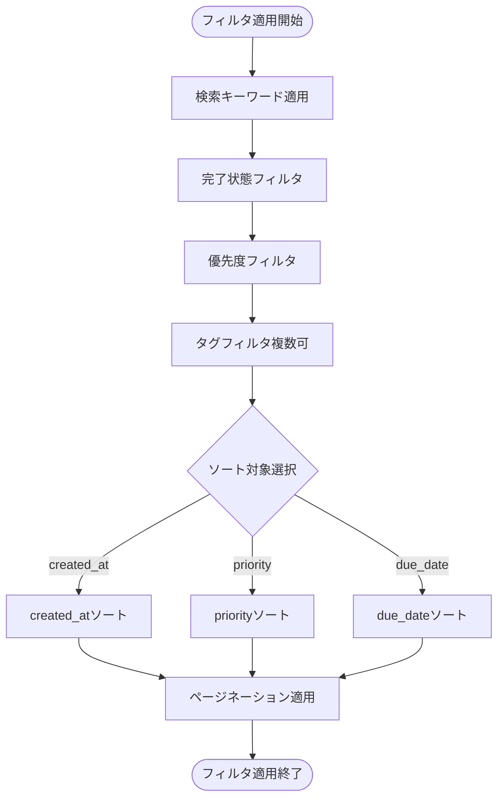
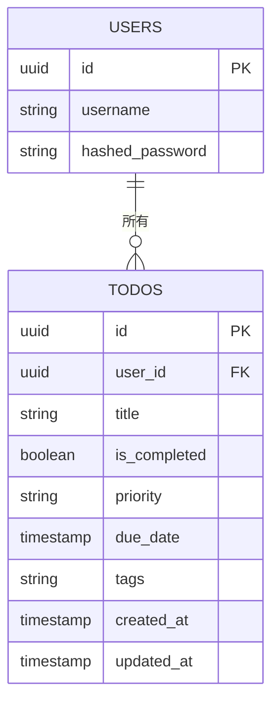
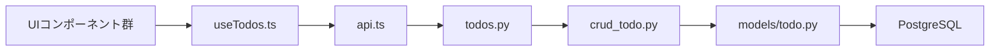

# Todo管理機能

<cite>
**この文書で参照されるファイル**
- [SPECIFICATION.md](file://SPECIFICATION.md)
- [backend/app/api/api_v1/endpoints/todos.py](file://backend/app/api/api_v1/endpoints/todos.py)
- [backend/app/crud/crud_todo.py](file://backend/app/crud/crud_todo.py)
- [backend/app/models/todo.py](file://backend/app/models/todo.py)
- [backend/app/schemas/todo.py](file://backend/app/schemas/todo.py)
- [frontend/src/hooks/useTodos.ts](file://frontend/src/hooks/useTodos.ts)
- [frontend/src/lib/api.ts](file://frontend/src/lib/api.ts)
- [frontend/src/app/_components/TodoFilterPanel.tsx](file://frontend/src/app/_components/TodoFilterPanel.tsx)
- [frontend/src/app/_components/TodoItemList.tsx](file://frontend/src/app/_components/TodoItemList.tsx)
- [frontend/src/app/page.tsx](file://frontend/src/app/page.tsx)
- [backend/tests/test_todos.py](file://backend/tests/test_todos.py)
- [docker-compose.yml](file://docker-compose.yml)
</cite>

## 目次
1. [導入](#導入)
2. [プロジェクト構造](#プロジェクト構造)
3. [コアコンポーネント](#コアコンポーネント)
4. [アーキテクチャ概要](#アーキテクチャ概要)
5. [詳細コンポーネント分析](#詳細コンポーネント分析)
6. [依存関係分析](#依存関係分析)
7. [パフォーマンス考慮事項](#パフォーマンス考慮事項)
8. [トラブルシューティングガイド](#トラブルシューティングガイド)
9. [結論](#結論)

## 導入
本ドキュメントは、TodoリストのCRUD操作と高度なフィルタリング機能に関する詳細仕様を提供します。バックエンドではFastAPI、フロントエンドではNext.jsを採用しており、JWT認証を介した認可されたユーザーのみがTodoデータにアクセス可能です。APIは検索、フィルタ、ソート、ページネーションをサポートし、フロントエンドではReact Queryによる状態管理、リアルタイム更新、エラーハンドリングが実装されています。

## プロジェクト構造
全体のプロジェクトは以下のディレクトリ構成で構成されています：
- backend: FastAPIによるAPIサーバー、CRUDロジック、モデル定義、スキーマ定義、認証・エラーハンドリング
- frontend: Next.jsによるフロントエンド、カスタムフック、UIコンポーネント、状態管理
- docker-compose: PostgreSQLとMailpitのコンテナ化環境



**図の出典**
- [backend/app/api/api_v1/endpoints/todos.py:1-102](file://backend/app/api/api_v1/endpoints/todos.py#L1-L102)
- [backend/app/crud/crud_todo.py:1-152](file://backend/app/crud/crud_todo.py#L1-L152)
- [backend/app/models/todo.py:1-25](file://backend/app/models/todo.py#L1-L25)
- [backend/app/schemas/todo.py:1-41](file://backend/app/schemas/todo.py#L1-L41)
- [frontend/src/hooks/useTodos.ts:1-119](file://frontend/src/hooks/useTodos.ts#L1-L119)
- [frontend/src/lib/api.ts:1-113](file://frontend/src/lib/api.ts#L1-L113)
- [frontend/src/app/_components/TodoFilterPanel.tsx:1-105](file://frontend/src/app/_components/TodoFilterPanel.tsx#L1-L105)
- [frontend/src/app/_components/TodoItemList.tsx:1-182](file://frontend/src/app/_components/TodoItemList.tsx#L1-L182)
- [frontend/src/app/page.tsx:1-298](file://frontend/src/app/page.tsx#L1-L298)
- [docker-compose.yml:1-29](file://docker-compose.yml#L1-L29)

**節の出典**
- [SPECIFICATION.md:1-147](file://SPECIFICATION.md#L1-L147)
- [docker-compose.yml:1-29](file://docker-compose.yml#L1-L29)

## コアコンポーネント
- APIエンドポイント: `/api/v1/todos` にTodoのCRUD操作を提供
- CRUDロジック: 検索・フィルタ・ソート・ページネーションに対応
- モデル定義: SQLModelによるTodoエンティティ定義
- スキーマ定義: PydanticベースのTodoCreate/TodoUpdate/TodoRead
- フロントエンドフック: React Queryによるクエリ管理、ミューテーション、エラーハンドリング
- UIコンポーネント: Todoフィルタパネル、Todo一覧表示、編集ダイアログ

**節の出典**
- [SPECIFICATION.md:72-96](file://SPECIFICATION.md#L72-L96)
- [backend/app/api/api_v1/endpoints/todos.py:1-102](file://backend/app/api/api_v1/endpoints/todos.py#L1-L102)
- [backend/app/crud/crud_todo.py:1-152](file://backend/app/crud/crud_todo.py#L1-L152)
- [backend/app/models/todo.py:1-25](file://backend/app/models/todo.py#L1-L25)
- [backend/app/schemas/todo.py:1-41](file://backend/app/schemas/todo.py#L1-L41)
- [frontend/src/hooks/useTodos.ts:1-119](file://frontend/src/hooks/useTodos.ts#L1-L119)
- [frontend/src/app/_components/TodoFilterPanel.tsx:1-105](file://frontend/src/app/_components/TodoFilterPanel.tsx#L1-L105)
- [frontend/src/app/_components/TodoItemList.tsx:1-182](file://frontend/src/app/_components/TodoItemList.tsx#L1-L182)

## アーキテクチャ概要
バックエンドはFastAPIのルーターがエンドポイントを提供し、CRUDロジックがSQLModelを使用してデータベース操作を行います。フロントエンドはNext.js上で動作し、カスタムフック(useTodos)がReact Queryを使用してAPIと連携します。認証はJWTトークンを介して行われ、APIリクエストにはAuthorizationヘッダーが必要です。



**図の出典**
- [frontend/src/lib/api.ts:25-62](file://frontend/src/lib/api.ts#L25-L62)
- [backend/app/api/api_v1/endpoints/todos.py:32-57](file://backend/app/api/api_v1/endpoints/todos.py#L32-L57)
- [backend/app/crud/crud_todo.py:10-71](file://backend/app/crud/crud_todo.py#L10-L71)

## 詳細コンポーネント分析

### API仕様（Todo）
- 一覧取得: GET `/api/v1/todos`
  - クエリパラメータ: search, is_completed, priority, tags, sort_by, sort_order, skip, limit
  - 応答: TodoRead配列
- 件数取得: GET `/api/v1/todos/count`
  - 応答: TodoCountResponse
- 作成: POST `/api/v1/todos`
  - リクエスト: TodoCreate
  - 応答: TodoRead
- 更新: PUT `/api/v1/todos/{id}`
  - パスパラメータ: id
  - リクエスト: TodoUpdate
  - 応答: TodoRead
- 削除: DELETE `/api/v1/todos/{id}`
  - 応答: TodoDeleteResponse

```mermaid
flowchart TD
Start(["APIリクエスト受信"]) --> Route{"エンドポイント判定"}
Route --> |GET /todos| List["一覧取得処理"]
Route --> |GET /todos/count| Count["件数取得処理"]
Route --> |POST /todos| Create["作成処理"]
Route --> |PUT /todos/{id}| Update["更新処理"]
Route --> |DELETE /todos/{id}| Delete["削除処理"]
List --> Filters["検索/フィルタ適用"]
Filters --> Sort["ソート適用"]
Sort --> Paginate["ページネーション適用"]
Paginate --> ReturnList["TodoRead配列返却"]
Count --> FiltersC["検索/フィルタ適用"]
FiltersC --> ReturnCount["合計件数返却"]
Create --> Validate["TodoCreateバリデーション"]
Validate --> Persist["DB保存"]
Persist --> ReturnCreate["TodoRead返却"]
Update --> Find["IDと所有者確認"]
Find --> Apply["変更内容適用"]
Apply --> PersistU["DB更新"]
PersistU --> ReturnUpdate["TodoRead返却"]
Delete --> FindD["IDと所有者確認"]
FindD --> Remove["DB削除"]
Remove --> ReturnDelete["削除結果返却"]
```

**図の出典**
- [backend/app/api/api_v1/endpoints/todos.py:13-101](file://backend/app/api/api_v1/endpoints/todos.py#L13-L101)
- [backend/app/crud/crud_todo.py:10-152](file://backend/app/crud/crud_todo.py#L10-L152)

**節の出典**
- [SPECIFICATION.md:82-95](file://SPECIFICATION.md#L82-L95)
- [backend/app/api/api_v1/endpoints/todos.py:13-101](file://backend/app/api/api_v1/endpoints/todos.py#L13-L101)

### フロントエンド状態管理（React Query）
- useTodosカスタムフックがTodo一覧、件数、CRUD操作を一元管理
- queryKey: ["todos", queryEntries] によりクエリの変更を検知
- invalidateQueriesでCRUD後に自動的に再取得
- toastによるユーザーへのフィードバック



**図の出典**
- [frontend/src/hooks/useTodos.ts:26-119](file://frontend/src/hooks/useTodos.ts#L26-L119)
- [frontend/src/lib/api.ts:25-62](file://frontend/src/lib/api.ts#L25-L62)
- [frontend/src/app/page.tsx:42-152](file://frontend/src/app/page.tsx#L42-L152)

**節の出典**
- [frontend/src/hooks/useTodos.ts:1-119](file://frontend/src/hooks/useTodos.ts#L1-L119)
- [frontend/src/app/page.tsx:1-298](file://frontend/src/app/page.tsx#L1-L298)

### 高度なフィルタリング機能
- 検索: titleの部分一致
- 完了状態: true/falseでフィルタ
- 優先度: high/medium/low
- タグ: カンマ区切りで複数指定可能（部分一致）
- ソート: created_at/priority/due_date、asc/desc
- ページネーション: skip/limit（最大100件）



**図の出典**
- [backend/app/crud/crud_todo.py:22-71](file://backend/app/crud/crud_todo.py#L22-L71)
- [frontend/src/app/_components/TodoFilterPanel.tsx:55-101](file://frontend/src/app/_components/TodoFilterPanel.tsx#L55-L101)

**節の出典**
- [SPECIFICATION.md:83-91](file://SPECIFICATION.md#L83-L91)
- [backend/app/crud/crud_todo.py:10-98](file://backend/app/crud/crud_todo.py#L10-L98)
- [frontend/src/app/_components/TodoFilterPanel.tsx:1-105](file://frontend/src/app/_components/TodoFilterPanel.tsx#L1-L105)

### データモデル
Todoエンティティは以下のフィールッドを持ちます：
- id: UUID（主キー）
- user_id: UUID（外部キー: users.id）
- title: 文字列（必須、最大255文字）
- is_completed: 真偽値（デフォルト: false）
- priority: 優先度（high/medium/low、デフォルト: low）
- due_date: 日時（任意）
- tags: タグ（カンマ区切り、最大500文字）
- created_at/updated_at: 日時（自動設定）



**図の出典**
- [SPECIFICATION.md:57-68](file://SPECIFICATION.md#L57-L68)
- [backend/app/models/todo.py:10-24](file://backend/app/models/todo.py#L10-L24)
- [backend/app/schemas/todo.py:13-34](file://backend/app/schemas/todo.py#L13-L34)

**節の出典**
- [SPECIFICATION.md:48-68](file://SPECIFICATION.md#L48-L68)
- [backend/app/models/todo.py:1-25](file://backend/app/models/todo.py#L1-L25)
- [backend/app/schemas/todo.py:1-41](file://backend/app/schemas/todo.py#L1-L41)

## 依存関係分析
- APIルーターはCRUDロジックに依存
- CRUDロジックはモデル定義に依存
- フロントエンドはAPIライブラリ経由でAPIルーターに依存
- PostgreSQLはCRUDロジックによって直接利用



**図の出典**
- [backend/app/api/api_v1/endpoints/todos.py:1-102](file://backend/app/api/api_v1/endpoints/todos.py#L1-L102)
- [backend/app/crud/crud_todo.py:1-152](file://backend/app/crud/crud_todo.py#L1-L152)
- [backend/app/models/todo.py:1-25](file://backend/app/models/todo.py#L1-L25)
- [frontend/src/hooks/useTodos.ts:1-119](file://frontend/src/hooks/useTodos.ts#L1-L119)
- [frontend/src/lib/api.ts:1-113](file://frontend/src/lib/api.ts#L1-L113)

**節の出典**
- [SPECIFICATION.md:1-147](file://SPECIFICATION.md#L1-L147)
- [docker-compose.yml:1-29](file://docker-compose.yml#L1-L29)

## パフォーマンス考慮事項
- ソートとフィルタはSQLレベルで処理されるため、適切なインデックスが重要
- ページネーションのlimitは100件までに制限されており、大量データの取得を防ぐ
- React Queryのキャッシュと無効化により、不要なリクエストを抑制
- タグフィルタは複数指定可能だが、SQLのCONTAINS句を使用しているため、パフォーマンスへの影響を考慮

## トラブルシューティングガイド
- 認証エラー（401）: APIから401エラーが返された場合、自動的にログインページにリダイレクトされます
- APIエラーハンドリング: api.tsのApiErrorクラスがエラーを処理し、toastでユーザーに通知
- CRUD操作失敗: 各ミューテーションのonErrorハンドラでエラーを表示
- データベース接続: docker-composeでPostgreSQLが起動しているか確認

**節の出典**
- [frontend/src/app/page.tsx:49-54](file://frontend/src/app/page.tsx#L49-L54)
- [frontend/src/lib/api.ts:17-23](file://frontend/src/lib/api.ts#L17-L23)
- [frontend/src/hooks/useTodos.ts:58-108](file://frontend/src/hooks/useTodos.ts#L58-L108)
- [docker-compose.yml:1-29](file://docker-compose.yml#L1-L29)

## 結論
本Todo管理機能は、認証付きのCRUD操作、高度なフィルタリング、リアルタイム更新、堅牢なエラーハンドリングを実現しています。バックエンドのFastAPIとSQLModel、フロントエンドのNext.jsとReact Queryの組み合わせにより、拡張性と保守性に優れたアーキテクチャを実現しています。今後の改善点として、タグフィルタのパフォーマンス向上や、より詳細なエラーログの追加が考えられます。