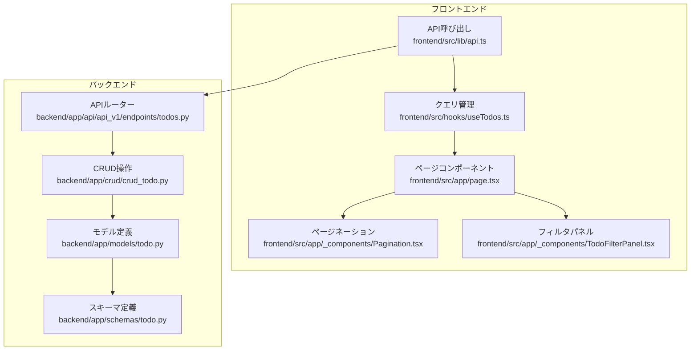
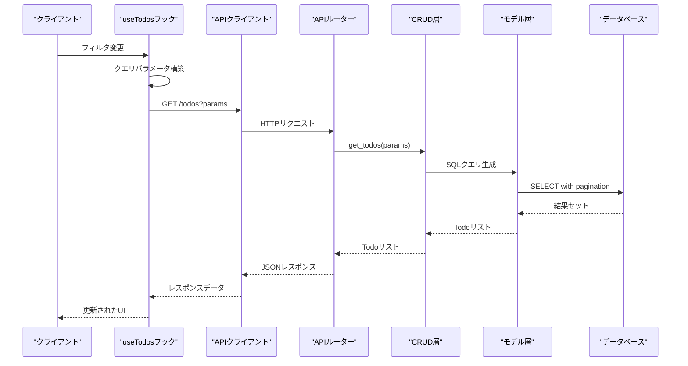
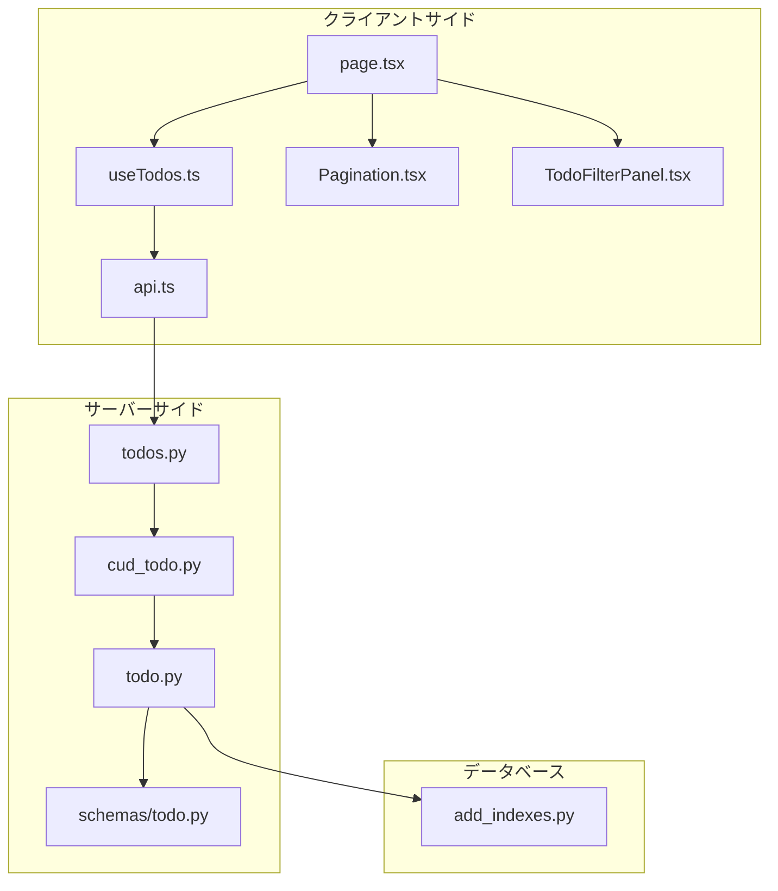

# ページネーションとソート

<cite>
**この文書で参照されるファイル**
- [backend/app/api/api_v1/endpoints/todos.py](file://backend/app/api/api_v1/endpoints/todos.py)
- [backend/app/crud/crud_todo.py](file://backend/app/crud/crud_todo.py)
- [backend/app/models/todo.py](file://backend/app/models/todo.py)
- [backend/migrations/versions/add_indexes.py](file://backend/migrations/versions/add_indexes.py)
- [backend/app/schemas/todo.py](file://backend/app/schemas/todo.py)
- [frontend/src/hooks/useTodos.ts](file://frontend/src/hooks/useTodos.ts)
- [frontend/src/lib/api.ts](file://frontend/src/lib/api.ts)
- [frontend/src/app/page.tsx](file://frontend/src/app/page.tsx)
- [frontend/src/app/_components/Pagination.tsx](file://frontend/src/app/_components/Pagination.tsx)
- [frontend/src/app/_components/TodoFilterPanel.tsx](file://frontend/src/app/_components/TodoFilterPanel.tsx)
- [frontend/src/app/_components/TodoItemList.tsx](file://frontend/src/app/_components/TodoItemList.tsx)
</cite>

## 目次
1. [導入](#導入)
2. [プロジェクト構造](#プロジェクト構造)
3. [コアコンポーネント](#コアコンポーネント)
4. [アーキテクチャ概要](#アーキテクチャ概要)
5. [詳細コンポーネント分析](#詳細コンポーネント分析)
6. [依存関係分析](#依存関係分析)
7. [パフォーマンス考慮事項](#パフォーマンス考慮事項)
8. [トラブルシューティングガイド](#トラブルシューティングガイド)
9. [結論](#結論)

## 導入
本ドキュメントは、Todoリストアプリケーションにおけるページネーションとソート機能の詳細仕様を提供します。クエリパラメータ（limit、offset、sort、order）の仕組みと使用方法、フロントエンドでのページネーションコンポーネント実装、無限スクロールの代替案、バックエンドでのクエリ最適化手法について詳しく説明します。

## プロジェクト構造
Todoリストシステムは、FastAPIによるバックエンドとNext.jsによるフロントエンドで構成されています。ページネーションとソート機能は、API層、CRUD層、モデル層、フロントエンドクエリ層で連携して実現されています。



**図の出典**
- [frontend/src/lib/api.ts:25-62](file://frontend/src/lib/api.ts#L25-L62)
- [frontend/src/hooks/useTodos.ts:26-50](file://frontend/src/hooks/useTodos.ts#L26-L50)
- [backend/app/api/api_v1/endpoints/todos.py:32-57](file://backend/app/api/api_v1/endpoints/todos.py#L32-L57)

**セクションの出典**
- [frontend/src/app/page.tsx:27-298](file://frontend/src/app/page.tsx#L27-L298)
- [backend/app/api/api_v1/endpoints/todos.py:11-102](file://backend/app/api/api_v1/endpoints/todos.py#L11-L102)

## コアコンポーネント
ページネーションとソート機能のコアコンポーネントは以下の通りです：

### APIエンドポイント
- `/todos/` - Todo一覧取得（ページネーション対応）
- `/todos/count` - Todo件数取得（フィルタリング対応）

### クエリパラメータ仕様
- `skip`: スキップする件数（デフォルト: 0）
- `limit`: 取得件数（デフォルト: 100、最小: 1、最大: 100）
- `sort_by`: ソート対象（デフォルト: "created_at"、可選択: "created_at"|"priority"|"due_date"）
- `sort_order`: ソート順（デフォルト: "desc"、可選択: "asc"|"desc"）

### フロントエンドクエリ管理
- React Queryを使用したクエリ管理
- 決定論的クエリパラメータ構築
- 自動クエリ再実行機能

**セクションの出典**
- [backend/app/api/api_v1/endpoints/todos.py:32-57](file://backend/app/api/api_v1/endpoints/todos.py#L32-L57)
- [frontend/src/hooks/useTodos.ts:15-24](file://frontend/src/hooks/useTodos.ts#L15-L24)
- [frontend/src/hooks/useTodos.ts:29-40](file://frontend/src/hooks/useTodos.ts#L29-L40)

## アーキテクチャ概要
ページネーションとソート機能は、クライアントサイドのクエリ管理層とサーバーサイドのAPI層で連携して動作します。



**図の出典**
- [frontend/src/hooks/useTodos.ts:42-45](file://frontend/src/hooks/useTodos.ts#L42-L45)
- [backend/app/api/api_v1/endpoints/todos.py:32-57](file://backend/app/api/api_v1/endpoints/todos.py#L32-L57)
- [backend/app/crud/crud_todo.py:10-71](file://backend/app/crud/crud_todo.py#L10-L71)

## 詳細コンポーネント分析

### バックエンドAPI層
APIエンドポイントは、FastAPIのQueryパラメータを使用してページネーションとソート機能を提供します。

#### エンドポイント定義
- **GET /todos/**: Todo一覧取得
  - 必須パラメータ: `skip`（int）、`limit`（int）
  - オプションパラメータ: `sort_by`（str）、`sort_order`（str）
  - 追加フィルタ: `search`、`is_completed`、`priority`、`tags`

- **GET /todos/count**: Todo件数取得
  - 同じフィルタ条件を適用
  - 件数のみを返す

#### クエリパラメータバリデーション
- `skip`: 0以上の整数
- `limit`: 1から100までの整数
- `sort_by`: 指定された3つの値のみ許可
- `sort_order`: 指定された2つの値のみ許可

**セクションの出典**
- [backend/app/api/api_v1/endpoints/todos.py:32-57](file://backend/app/api/api_v1/endpoints/todos.py#L32-L57)
- [backend/app/api/api_v1/endpoints/todos.py:13-30](file://backend/app/api/api_v1/endpoints/todos.py#L13-L30)

### CRUD層の実装
CRUD層は、SQLAlchemyのSQLModelを使用してページネーションとソート処理を実装しています。

#### ページネーション処理
- `OFFSET`句を使用したページネーション
- `LIMIT`句による件数制限
- `skip`パラメータの計算: `skip = (page - 1) × limit`

#### ソート処理
- `created_at`フィールドの昇順/降順ソート
- `priority`フィールドの優先度順（high > medium > low）
- `due_date`フィールドの昇順/降順ソート

#### フィルタリング処理
- `search`: タイトルの部分一致検索
- `is_completed`: 完了状態でのフィルタ
- `priority`: 優先度でのフィルタ
- `tags`: カンマ区切りの複数タグフィルタ

**セクションの出典**
- [backend/app/crud/crud_todo.py:10-71](file://backend/app/crud/crud_todo.py#L10-L71)
- [backend/app/crud/crud_todo.py:73-98](file://backend/app/crud/crud_todo.py#L73-L98)

### モデル層とインデックス
モデル層は、パフォーマンス向上のための複数のインデックスを定義しています。

#### インデックス定義
- `ix_todos_user_id`: ユーザーIDでのクエリ高速化
- `ix_todos_created_at`: 作成日時のクエリ高速化
- `ix_todos_is_completed`: 完了状態でのクエリ高速化
- `ix_todos_priority`: 優先度でのクエリ高速化
- `ix_todos_due_date`: 期限日のクエリ高速化

**セクションの出典**
- [backend/app/models/todo.py:10-25](file://backend/app/models/todo.py#L10-L25)
- [backend/migrations/versions/add_indexes.py:20-41](file://backend/migrations/versions/add_indexes.py#L20-L41)

### フロントエンドクエリ管理
フロントエンドはReact Queryを使用してクエリ管理を実装し、ページネーション機能を提供します。

#### useTodosフックの機能
- **クエリパラメータ構築**: 決定論的順序でパラメータを構築
- **自動クエリ再実行**: フィルタ変更時に自動的に再クエリ
- **件数取得**: `/todos/count`エンドポイントとの連携
- **ミューテーション処理**: CRUD操作の非同期処理

#### 決定論的クエリパラメータ構築
```typescript
// クエリパラメータを決定論的な順序で構築
const queryEntries: [string, string][] = [];
if (filters?.search) queryEntries.push(["search", filters.search]);
if (filters?.is_completed !== undefined) queryEntries.push(["is_completed", String(filters.is_completed)]);
if (filters?.priority) queryEntries.push(["priority", filters.priority]);
if (filters?.tags) queryEntries.push(["tags", filters.tags]);
if (filters?.sort_by) queryEntries.push(["sort_by", filters.sort_by]);
if (filters?.sort_order) queryEntries.push(["sort_order", filters.sort_order]);
if (filters?.skip !== undefined) queryEntries.push(["skip", String(filters.skip)]);
if (filters?.limit !== undefined) queryEntries.push(["limit", String(filters.limit)]);
```

**セクションの出典**
- [frontend/src/hooks/useTodos.ts:29-40](file://frontend/src/hooks/useTodos.ts#L29-L40)
- [frontend/src/hooks/useTodos.ts:42-50](file://frontend/src/hooks/useTodos.ts#L42-L50)

### ページネーションコンポーネント
Paginationコンポーネントは、フロントエンドでのページネーション表示を提供します。

#### コンポーネント機能
- **ページ計算**: `totalPages = Math.ceil(totalItems / pageSize)`
- **ナビゲーションボタン**: 前へ/次への移動
- **表示範囲**: 現在のページの表示範囲を表示
- **無効状態**: 最初/最後のページでのボタン無効化

#### ページネーションロジック
```typescript
const currentPage = Math.floor((filters.skip ?? 0) / (filters.limit ?? 10)) + 1;
const pageSize = filters.limit ?? 10;
const totalPages = Math.max(1, Math.ceil(totalItems / pageSize));
```

**セクションの出典**
- [frontend/src/app/_components/Pagination.tsx:13-48](file://frontend/src/app/_components/Pagination.tsx#L13-L48)
- [frontend/src/app/page.tsx:42-47](file://frontend/src/app/page.tsx#L42-L47)

### 無限スクロールの代替案
現在の実装では、無限スクロールではなく、伝統的なページネーションを採用しています。これは以下の利点があります：

#### ページネーションの利点
- **パフォーマンス**: 過剰なデータ読み込みを防ぐ
- **メモリ効率**: 一度に必要な分だけメモリを使用
- **SEO対応**: URLの変更によりページャーの状態を保持可能
- **ユーザー体験**: 明確なページ移動感覚

#### 無限スクロールの代替案
```typescript
// 無限スクロールの実装例（コメントアウト）
/*
const observer = useRef<IntersectionObserver>();
const lastElementRef = useCallback((node: HTMLDivElement) => {
  if (loading) return;
  if (observer.current) observer.current.disconnect();
  observer.current = new IntersectionObserver(entries => {
    if (entries[0].isIntersecting && hasMore) {
      loadMore();
    }
  });
  if (node) observer.current.observe(node);
}, [loading, hasMore]);
*/
```

**セクションの出典**
- [frontend/src/app/_components/Pagination.tsx:13-48](file://frontend/src/app/_components/Pagination.tsx#L13-L48)

## 依存関係分析
ページネーションとソート機能の依存関係は以下の通りです。



**図の出典**
- [frontend/src/hooks/useTodos.ts:1-119](file://frontend/src/hooks/useTodos.ts#L1-L119)
- [backend/app/api/api_v1/endpoints/todos.py:1-102](file://backend/app/api/api_v1/endpoints/todos.py#L1-L102)
- [backend/app/crud/crud_todo.py:1-152](file://backend/app/crud/crud_todo.py#L1-L152)

### 外部依存関係
- **React Query**: クエリ管理とキャッシュ
- **SQLAlchemy**: ORM操作
- **FastAPI**: APIフレームワーク
- **Next.js**: フロントエンドフレームワーク

**セクションの出典**
- [frontend/src/lib/api.ts:25-62](file://frontend/src/lib/api.ts#L25-L62)
- [backend/app/crud/crud_todo.py:1-152](file://backend/app/crud/crud_todo.py#L1-L152)

## パフォーマンス考慮事項
ページネーションとソート機能のパフォーマンスを最適化するための戦略を以下に示します。

### SQLクエリ最適化
1. **インデックスの活用**
   - `user_id`インデックス: ユーザーごとのデータ取得を高速化
   - `created_at`インデックス: 日付ベースのソートを高速化
   - `priority`インデックス: 優先度でのフィルタリングを高速化

2. **クエリの制限**
   - `LIMIT`句による結果数の制限
   - `OFFSET`句によるページネーションの効率的な実装

### フロントエンド最適化
1. **クエリキャッシュ**
   - React Queryの自動キャッシュ機能
   - 変更されたフィルタでのクエリ再実行

2. **APIエラーハンドリング**
   - 決定論的クエリパラメータ構築によるキャッシュヒット率向上
   - 認証エラー時の自動リダイレクト

### データベース最適化
1. **インデックス戦略**
   - 頻繁にクエリされるカラムにインデックスを設定
   - 複合インデックスの使用を検討

2. **クエリプランの監視**
   - EXPLAINを使用したクエリプランの分析
   - パフォーマンスの遅いクエリの特定

**セクションの出典**
- [backend/migrations/versions/add_indexes.py:20-41](file://backend/migrations/versions/add_indexes.py#L20-L41)
- [frontend/src/hooks/useTodos.ts:29-40](file://frontend/src/hooks/useTodos.ts#L29-L40)

## トラブルシューティングガイド

### 共通エラー対応
1. **認証エラー (401)**
   - 自動的にログインページにリダイレクト
   - トークンの有効性確認

2. **APIエラーハンドリング**
   - `ApiError`クラスによるエラー処理
   - バリデーションエラーの詳細表示

3. **クエリパラメータエラー**
   - FastAPIのQueryパラメータバリデーション
   - 指定された範囲外の値に対するエラー

### デバッグ手順
1. **クエリパラメータの確認**
   - URLのクエリ文字列を確認
   - React DevToolsでuseTodosの状態を確認

2. **APIレスポンスの確認**
   - NetworkタブでAPIリクエストを確認
   - レスポンスのJSON形式を確認

3. **データベースクエリの確認**
   - SQLAlchemyのログ出力を確認
   - EXPLAINを使用したクエリプラン分析

**セクションの出典**
- [frontend/src/lib/api.ts:17-62](file://frontend/src/lib/api.ts#L17-L62)
- [frontend/src/app/page.tsx:49-54](file://frontend/src/app/page.tsx#L49-L54)

## 結論
Todoリストアプリケーションのページネーションとソート機能は、効率的でユーザーフレンドリーな設計を実現するために、フロントエンドのクエリ管理層とバックエンドのAPI層で連携して動作しています。以下の主要な特徴を持っています：

1. **堅牢なAPI設計**: FastAPIのQueryパラメータバリデーションにより、安全で信頼性のあるAPIを提供
2. **パフォーマンス最適化**: インデックス戦略とクエリ制限により、大規模データでも高速な応答を実現
3. **ユーザーエクスペリエンス**: 決定論的クエリパラメータ構築により、予測可能な動作を提供
4. **保守性**: 分離されたコンポーネント設計により、機能の追加や変更が容易

この実装は、スケーラブルなTodoリストアプリケーションの基盤を提供し、今後の機能拡張にも柔軟に対応できます。