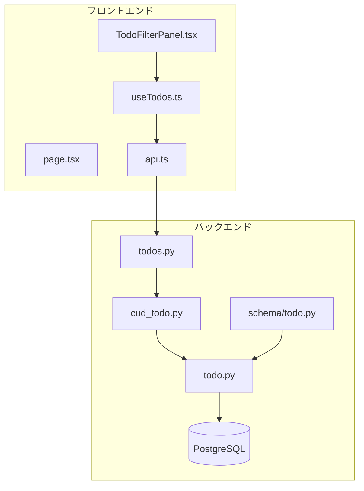
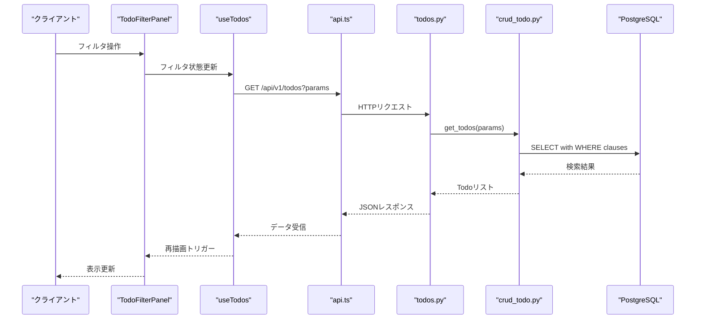
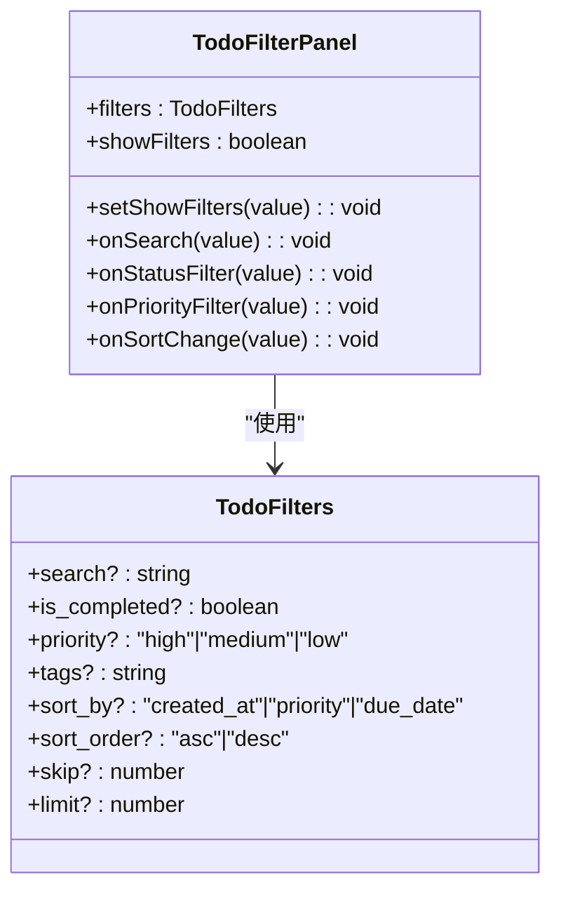
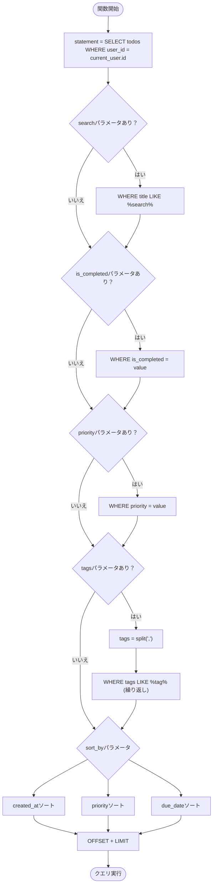
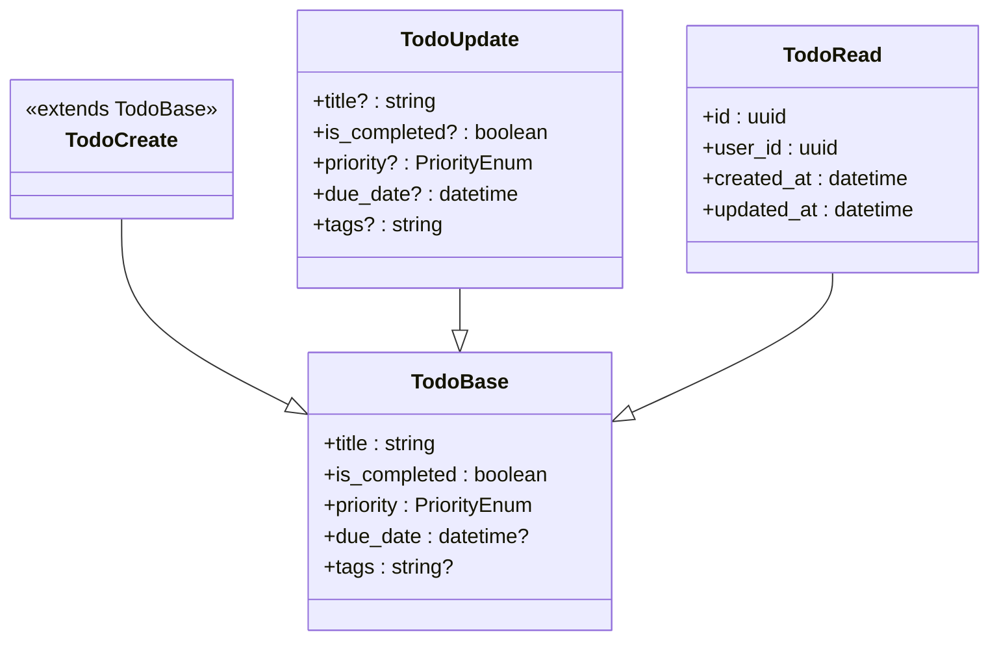
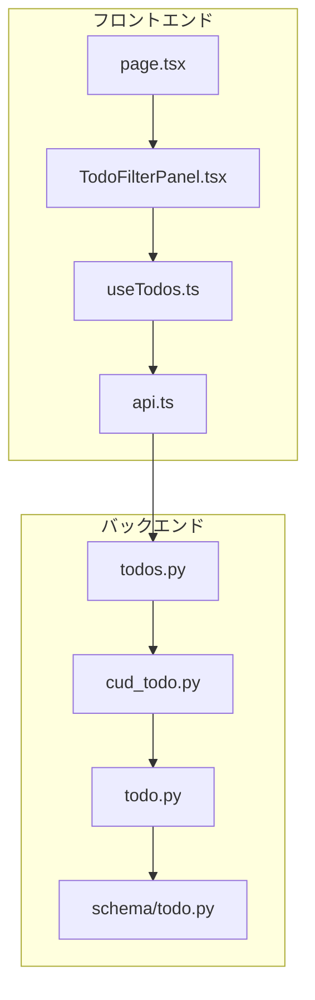

# 検索とフィルタリング

<cite>
**この文書で参照されるファイル**
- [SPECIFICATION.md](file://SPECIFICATION.md)
- [backend/app/models/todo.py](file://backend/app/models/todo.py)
- [backend/app/schemas/todo.py](file://backend/app/schemas/todo.py)
- [backend/app/crud/crud_todo.py](file://backend/app/crud/crud_todo.py)
- [backend/app/api/api_v1/endpoints/todos.py](file://backend/app/api/api_v1/endpoints/todos.py)
- [backend/migrations/versions/add_indexes.py](file://backend/migrations/versions/add_indexes.py)
- [frontend/src/app/_components/TodoFilterPanel.tsx](file://frontend/src/app/_components/TodoFilterPanel.tsx)
- [frontend/src/hooks/useTodos.ts](file://frontend/src/hooks/useTodos.ts)
- [frontend/src/app/page.tsx](file://frontend/src/app/page.tsx)
- [frontend/src/lib/api.ts](file://frontend/src/lib/api.ts)
- [backend/tests/test_todos.py](file://backend/tests/test_todos.py)
</cite>

## 目次
1. [導入](#導入)
2. [プロジェクト構造](#プロジェクト構造)
3. [コアコンポーネント](#コアコンポーネント)
4. [アーキテクチャ概要](#アーキテクチャ概要)
5. [詳細コンポーネント分析](#詳細コンポーネント分析)
6. [依存関係分析](#依存関係分析)
7. [パフォーマンス考慮事項](#パフォーマンス考慮事項)
8. [トラブルシューティングガイド](#トラブルシューティングガイド)
9. [結論](#結論)

## 導入
この文書は、Todoリストアプリケーションの検索とフィルタリング機能の詳細仕様を提供します。クエリパラメータの種類（title、is_completed、priority、due_date、tags）とその値の形式について説明し、フロントエンドでのフィルタパネルの実装、リアルタイムフィルタリングの実装方法、バックエンドでのSQLクエリ生成ロジックを含めます。

## プロジェクト構造
Todoリストアプリケーションは、Next.js（フロントエンド）とFastAPI（バックエンド）を基盤としたマイクロサービスアーキテクチャです。検索とフィルタリング機能は、以下の構成で実装されています：

**図の出典**
- [frontend/src/app/_components/TodoFilterPanel.tsx:1-105](file://frontend/src/app/_components/TodoFilterPanel.tsx#L1-L105)
- [frontend/src/hooks/useTodos.ts:1-119](file://frontend/src/hooks/useTodos.ts#L1-L119)
- [frontend/src/app/page.tsx:1-298](file://frontend/src/app/page.tsx#L1-L298)
- [frontend/src/lib/api.ts:1-113](file://frontend/src/lib/api.ts#L1-L113)
- [backend/app/api/api_v1/endpoints/todos.py:1-102](file://backend/app/api/api_v1/endpoints/todos.py#L1-L102)
- [backend/app/crud/crud_todo.py:1-152](file://backend/app/crud/crud_todo.py#L1-L152)
- [backend/app/models/todo.py:1-25](file://backend/app/models/todo.py#L1-L25)
- [backend/app/schemas/todo.py:1-41](file://backend/app/schemas/todo.py#L1-L41)

**セクションの出典**
- [SPECIFICATION.md:72-96](file://SPECIFICATION.md#L72-L96)
- [SPECIFICATION.md:48-69](file://SPECIFICATION.md#L48-L69)

## コアコンポーネント
検索とフィルタリング機能のコアコンポーネントは以下の通りです：

### APIエンドポイント
- `/api/v1/todos/` - Todo一覧取得（検索・フィルタ・ソート・ページネーション対応）
- `/api/v1/todos/count` - Todo件数取得（フィルタ条件を引き継ぐ）

### クエリパラメータ仕様
- `search`: 文字列（タイトル部分一致検索）
- `is_completed`: 真偽値（true/false）
- `priority`: 優先度（high/medium/low）
- `tags`: カンマ区切り文字列（複数タグ指定可）
- `sort_by`: ソート項目（created_at/priority/due_date）
- `sort_order`: ソート順（asc/desc）
- `skip`: スキップ件数（ページネーション）
- `limit`: 取得件数上限（デフォルト100、最大100）

**セクションの出典**
- [SPECIFICATION.md:82-95](file://SPECIFICATION.md#L82-L95)
- [backend/app/api/api_v1/endpoints/todos.py:13-57](file://backend/app/api/api_v1/endpoints/todos.py#L13-L57)

## アーキテクチャ概要
検索とフィルタリング機能は、以下の層構造で実装されています：

**図の出典**
- [frontend/src/app/_components/TodoFilterPanel.tsx:25-104](file://frontend/src/app/_components/TodoFilterPanel.tsx#L25-L104)
- [frontend/src/hooks/useTodos.ts:26-50](file://frontend/src/hooks/useTodos.ts#L26-L50)
- [frontend/src/lib/api.ts:25-62](file://frontend/src/lib/api.ts#L25-L62)
- [backend/app/api/api_v1/endpoints/todos.py:32-57](file://backend/app/api/api_v1/endpoints/todos.py#L32-L57)
- [backend/app/crud/crud_todo.py:10-71](file://backend/app/crud/crud_todo.py#L10-L71)

## 詳細コンポーネント分析

### フロントエンド実装

#### TodoFilterPanelコンポーネント
TodoFilterPanelコンポーネントは、ユーザーインターフェースのフィルタパネルを提供します。以下の機能を実装しています：

**図の出典**
- [frontend/src/app/_components/TodoFilterPanel.tsx:15-23](file://frontend/src/app/_components/TodoFilterPanel.tsx#L15-L23)
- [frontend/src/hooks/useTodos.ts:15-24](file://frontend/src/hooks/useTodos.ts#L15-L24)

#### useTodosフック
useTodosフックは、検索とフィルタリングのロジックを実装しています。クエリパラメータを決定論的な順序で構築し、React Queryを使用してデータを管理します。

**セクションの出典**
- [frontend/src/app/_components/TodoFilterPanel.tsx:25-104](file://frontend/src/app/_components/TodoFilterPanel.tsx#L25-L104)
- [frontend/src/hooks/useTodos.ts:26-50](file://frontend/src/hooks/useTodos.ts#L26-L50)

### バックエンド実装

#### APIエンドポイント
todos.pyは、検索とフィルタリングのAPIエンドポイントを実装しています。以下のクエリパラメータを処理します：

- `search`: タイトルの部分一致検索
- `is_completed`: 完了状態フィルタ
- `priority`: 優先度フィルタ
- `tags`: タグフィルタ（カンマ区切り）
- `sort_by`: ソート項目（created_at/priority/due_date）
- `sort_order`: ソート順（asc/desc）
- `skip`: スキップ件数
- `limit`: 取得件数

**セクションの出典**
- [backend/app/api/api_v1/endpoints/todos.py:32-57](file://backend/app/api/api_v1/endpoints/todos.py#L32-L57)

#### CRUDロジック
crud_todo.pyは、SQLクエリ生成ロジックを実装しています。各フィルタ条件に応じてWHERE句を動的に構築します。

**図の出典**
- [backend/app/crud/crud_todo.py:10-71](file://backend/app/crud/crud_todo.py#L10-L71)

**セクションの出典**
- [backend/app/crud/crud_todo.py:10-71](file://backend/app/crud/crud_todo.py#L10-L71)

#### モデル定義
todo.pyは、Todoモデルを定義し、インデックスを設定しています。以下のインデックスが作成されています：

- `ix_todos_user_id`: user_idカラム
- `ix_todos_created_at`: created_atカラム
- `ix_todos_is_completed`: is_completedカラム
- `ix_todos_priority`: priorityカラム
- `ix_todos_due_date`: due_dateカラム

**セクションの出典**
- [backend/app/models/todo.py:10-25](file://backend/app/models/todo.py#L10-L25)
- [backend/migrations/versions/add_indexes.py:20-41](file://backend/migrations/versions/add_indexes.py#L20-L41)

### データ構造

#### Todoスキーマ
Todoスキーマは、以下のフィールドを定義しています：

**図の出典**
- [backend/app/schemas/todo.py:13-35](file://backend/app/schemas/todo.py#L13-L35)

**セクションの出典**
- [backend/app/schemas/todo.py:13-35](file://backend/app/schemas/todo.py#L13-L35)

## 依存関係分析
検索とフィルタリング機能の依存関係は以下の通りです：

**図の出典**
- [frontend/src/app/_components/TodoFilterPanel.tsx:1-105](file://frontend/src/app/_components/TodoFilterPanel.tsx#L1-L105)
- [frontend/src/hooks/useTodos.ts:1-119](file://frontend/src/hooks/useTodos.ts#L1-L119)
- [frontend/src/app/page.tsx:1-298](file://frontend/src/app/page.tsx#L1-L298)
- [frontend/src/lib/api.ts:1-113](file://frontend/src/lib/api.ts#L1-L113)
- [backend/app/api/api_v1/endpoints/todos.py:1-102](file://backend/app/api/api_v1/endpoints/todos.py#L1-L102)
- [backend/app/crud/crud_todo.py:1-152](file://backend/app/crud/crud_todo.py#L1-L152)
- [backend/app/models/todo.py:1-25](file://backend/app/models/todo.py#L1-L25)
- [backend/app/schemas/todo.py:1-41](file://backend/app/schemas/todo.py#L1-L41)

**セクションの出典**
- [SPECIFICATION.md:48-69](file://SPECIFICATION.md#L48-L69)

## パフォーマンス考慮事項
検索とフィルタリング機能のパフォーマンスを最適化するために以下の点が考慮されています：

1. **インデックスの活用**: 各フィルタ条件に対応したインデックスが作成されています
2. **部分一致検索**: LIKE演算子を使用した効率的な検索
3. **ページネーション**: LIMITとOFFSETを使用したデータの断片化
4. **クエリキャッシュ**: React Queryを使用したクエリ結果のキャッシュ

**セクションの出典**
- [backend/migrations/versions/add_indexes.py:20-41](file://backend/migrations/versions/add_indexes.py#L20-L41)
- [backend/app/crud/crud_todo.py:68-71](file://backend/app/crud/crud_todo.py#L68-L71)

## トラブルシューティングガイド
検索とフィルタリング機能に関する一般的な問題と解決方法：

### 共通問題
1. **認証エラー（401）**: JWTトークンの期限切れまたは無効
2. **検索結果が空**: 検索条件が厳しすぎる可能性
3. **フィルタが効かない**: URLパラメータの形式が正しくない

### 前端側のトラブルシューティング
- `useTodos.ts`のクエリパラメータ構築ロジックを確認
- `TodoFilterPanel.tsx`のフィルタ状態管理を確認
- React Queryのエラーハンドリングを確認

### バックエンド側のトラブルシューティング
- `todos.py`のクエリパラメータバリデーションを確認
- `crud_todo.py`のSQLクエリ生成ロジックを確認
- PostgreSQLのインデックス使用状況を確認

**セクションの出典**
- [frontend/src/hooks/useTodos.ts:26-50](file://frontend/src/hooks/useTodos.ts#L26-L50)
- [frontend/src/app/_components/TodoFilterPanel.tsx:25-104](file://frontend/src/app/_components/TodoFilterPanel.tsx#L25-L104)
- [backend/app/api/api_v1/endpoints/todos.py:32-57](file://backend/app/api/api_v1/endpoints/todos.py#L32-L57)
- [backend/app/crud/crud_todo.py:10-71](file://backend/app/crud/crud_todo.py#L10-L71)

## 結論
Todoリストアプリケーションの検索とフィルタリング機能は、効率的なクエリ処理と直感的なユーザーインターフェースを実現するための包括的なアーキテクチャを採用しています。フロントエンドのリアルタイムフィルタリングとバックエンドのSQLクエリ生成ロジックが連携することで、ユーザーは柔軟にTodoを検索・管理できます。