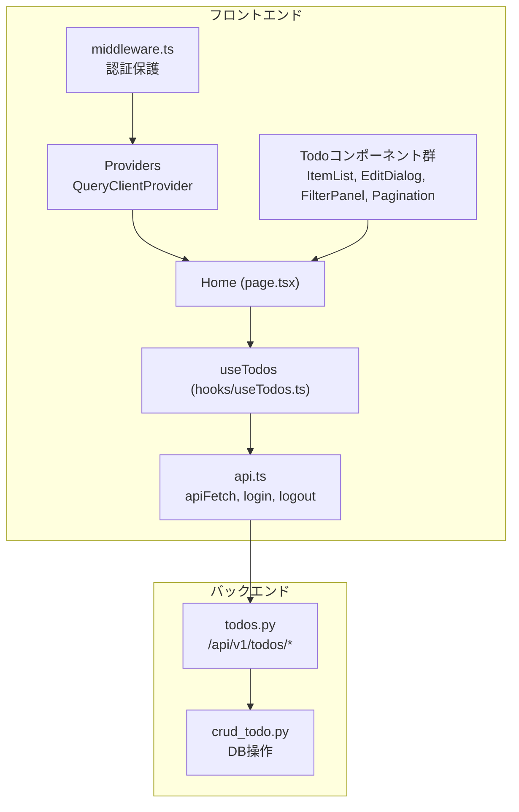
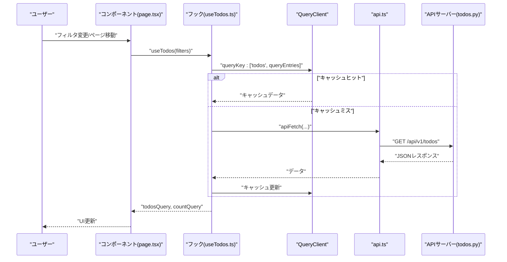
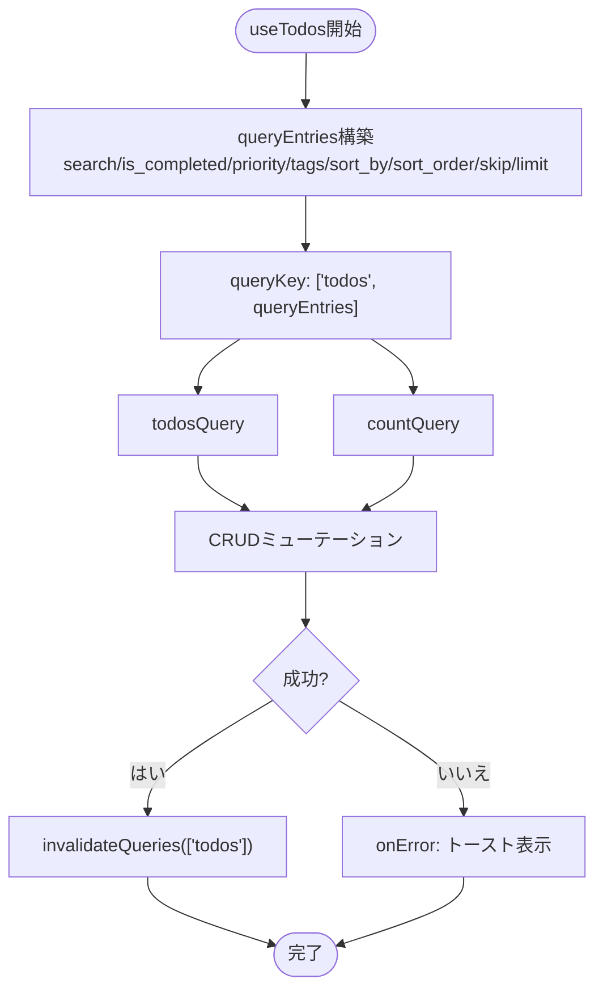
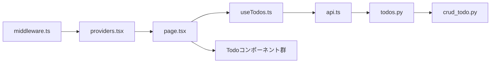

# 状態管理

<cite>
**この文書で参照されるファイル**
- [frontend/src/hooks/useTodos.ts](file://frontend/src/hooks/useTodos.ts)
- [frontend/src/app/providers.tsx](file://frontend/src/app/providers.tsx)
- [frontend/src/lib/api.ts](file://frontend/src/lib/api.ts)
- [frontend/src/app/page.tsx](file://frontend/src/app/page.tsx)
- [frontend/src/app/_components/TodoItemList.tsx](file://frontend/src/app/_components/TodoItemList.tsx)
- [frontend/src/app/_components/TodoEditDialog.tsx](file://frontend/src/app/_components/TodoEditDialog.tsx)
- [frontend/src/app/_components/TodoFilterPanel.tsx](file://frontend/src/app/_components/TodoFilterPanel.tsx)
- [frontend/src/app/_components/Pagination.tsx](file://frontend/src/app/_components/Pagination.tsx)
- [frontend/src/middleware.ts](file://frontend/src/middleware.ts)
- [backend/app/api/api_v1/endpoints/todos.py](file://backend/app/api/api_v1/endpoints/todos.py)
- [backend/app/crud/crud_todo.py](file://backend/app/crud/crud_todo.py)
</cite>

## 目次
1. [導入](#導入)
2. [プロジェクト構造](#プロジェクト構造)
3. [コアコンポーネント](#コアコンポーネント)
4. [アーキテクチャ概要](#アーキテクチャ概要)
5. [詳細コンポーネント分析](#詳細コンポーネント分析)
6. [依存関係分析](#依存関係分析)
7. [パフォーマンス考慮事項](#パフォーマンス考慮事項)
8. [トラブルシューティングガイド](#トラブルシューティングガイド)
9. [結論](#結論)

## 導入
本ドキュメントは、Todo管理フロントエンドにおける状態管理の詳細仕様を提供します。主にTanStack Query（React Query）を用いたキャッシュ管理、クエリの有効期限設定、リアルタイム更新の実装方法について説明します。また、エラーハンドリング、ローディング状態の管理、データの再取得戦略についても網羅的に解説します。

## プロジェクト構造
フロントエンドはNext.js 16.2.4を基盤としており、状態管理にはTanStack React Queryが使用されています。認証フローはミドルウェアによって保護されており、API通信は共通のapiFetch関数を通じて行われます。

**図の出典**
- [frontend/src/app/providers.tsx:1-26](file://frontend/src/app/providers.tsx#L1-L26)
- [frontend/src/app/page.tsx:1-298](file://frontend/src/app/page.tsx#L1-L298)
- [frontend/src/hooks/useTodos.ts:1-119](file://frontend/src/hooks/useTodos.ts#L1-L119)
- [frontend/src/lib/api.ts:1-113](file://frontend/src/lib/api.ts#L1-L113)
- [frontend/src/middleware.ts:1-35](file://frontend/src/middleware.ts#L1-L35)
- [backend/app/api/api_v1/endpoints/todos.py:1-102](file://backend/app/api/api_v1/endpoints/todos.py#L1-L102)
- [backend/app/crud/crud_todo.py:1-152](file://backend/app/crud/crud_todo.py#L1-L152)

**節の出典**
- [frontend/src/app/providers.tsx:1-26](file://frontend/src/app/providers.tsx#L1-L26)
- [frontend/src/app/page.tsx:1-298](file://frontend/src/app/page.tsx#L1-L298)
- [frontend/src/hooks/useTodos.ts:1-119](file://frontend/src/hooks/useTodos.ts#L1-L119)
- [frontend/src/lib/api.ts:1-113](file://frontend/src/lib/api.ts#L1-L113)
- [frontend/src/middleware.ts:1-35](file://frontend/src/middleware.ts#L1-L35)
- [backend/app/api/api_v1/endpoints/todos.py:1-102](file://backend/app/api/api_v1/endpoints/todos.py#L1-L102)
- [backend/app/crud/crud_todo.py:1-152](file://backend/app/crud/crud_todo.py#L1-L152)

## コアコンポーネント
- QueryClientProvider：アプリケーション全体でTanStack Queryのクライアントを提供し、キャッシュと再取得戦略を管理します。
- useTodosカスタムフック：Todo一覧、件数、CRUD操作を一括で管理し、クエリキーとフィルタリング条件を統合的に扱います。
- apiFetch：APIとの通信を行う汎用関数。認証ヘッダーの自動付与、エラーレスポンスの解析、通知の表示を担当します。
- 各UIコンポーネント：Todoリスト、編集ダイアログ、フィルタパネル、ページネーションがuseTodosの状態に依存して描画されます。

**節の出典**
- [frontend/src/app/providers.tsx:8-25](file://frontend/src/app/providers.tsx#L8-L25)
- [frontend/src/hooks/useTodos.ts:26-118](file://frontend/src/hooks/useTodos.ts#L26-L118)
- [frontend/src/lib/api.ts:25-62](file://frontend/src/lib/api.ts#L25-L62)
- [frontend/src/app/_components/TodoItemList.tsx:34-181](file://frontend/src/app/_components/TodoItemList.tsx#L34-L181)
- [frontend/src/app/_components/TodoEditDialog.tsx:38-136](file://frontend/src/app/_components/TodoEditDialog.tsx#L38-L136)
- [frontend/src/app/_components/TodoFilterPanel.tsx:25-104](file://frontend/src/app/_components/TodoFilterPanel.tsx#L25-L104)
- [frontend/src/app/_components/Pagination.tsx:13-48](file://frontend/src/app/_components/Pagination.tsx#L13-L48)

## アーキテクチャ概要
TanStack Queryのクエリキーは「todos」とフィルタ条件の配列（queryEntries）を組み合わせて定義されています。これにより、フィルタ条件ごとに独立したキャッシュが維持され、ページ遷移やフィルタ変更時に適切に再利用されます。クエリの有効期限（staleTime）は60秒に設定されており、一定期間内は再取得が抑制されます。認証エラー（401）発生時は自動的にログインページにリダイレクトされます。

**図の出典**
- [frontend/src/app/page.tsx:42-44](file://frontend/src/app/page.tsx#L42-L44)
- [frontend/src/hooks/useTodos.ts:42-50](file://frontend/src/hooks/useTodos.ts#L42-L50)
- [frontend/src/lib/api.ts:25-62](file://frontend/src/lib/api.ts#L25-L62)
- [backend/app/api/api_v1/endpoints/todos.py:32-57](file://backend/app/api/api_v1/endpoints/todos.py#L32-L57)

**節の出典**
- [frontend/src/app/providers.tsx:9-15](file://frontend/src/app/providers.tsx#L9-L15)
- [frontend/src/app/page.tsx:49-54](file://frontend/src/app/page.tsx#L49-L54)
- [frontend/src/hooks/useTodos.ts:42-50](file://frontend/src/hooks/useTodos.ts#L42-L50)

## 詳細コンポーネント分析

### useTodosフック（状態管理の中心）
- クエリキー構築：queryEntriesを決定論的な順序で構築し、URLSearchParamsに変換してクエリ文字列を生成。これにより、フィルタ条件ごとに一意なクエリキーが保証されます。
- Todo一覧クエリ：/todos/にGETリクエストを送信し、todosQueryで管理。件数クエリ：/todos/count/にGETリクエストを送信し、countQueryで管理。
- 変更系ミューテーション：追加、更新、削除、完了状態のトグル。成功時はQueryClientの['todos']クエリを無効化（invalidateQueries）し、キャッシュを再取得するように指示。
- 通知：成功・失敗時にsonnerによるトースト通知を表示。
- エラーハンドリング：apiFetchがエラーを投げた場合、useTodos側でonErrorコールバックが呼び出され、エラー内容がトーストで表示されます。

**図の出典**
- [frontend/src/hooks/useTodos.ts:29-40](file://frontend/src/hooks/useTodos.ts#L29-L40)
- [frontend/src/hooks/useTodos.ts:42-50](file://frontend/src/hooks/useTodos.ts#L42-L50)
- [frontend/src/hooks/useTodos.ts:52-108](file://frontend/src/hooks/useTodos.ts#L52-L108)

**節の出典**
- [frontend/src/hooks/useTodos.ts:26-118](file://frontend/src/hooks/useTodos.ts#L26-L118)

### QueryClient設定（キャッシュと有効期限）
- defaultOptions.queries.staleTime: 60秒。これにより、クエリが新鮮（fresh）な状態を維持する期間が定義され、不要なネットワークリクエストを抑制します。
- ReactQueryDevtools: 開発時のみ表示され、クエリのキャッシュ状態や再取得タイミングを視覚的に確認できます。

**節の出典**
- [frontend/src/app/providers.tsx:9-15](file://frontend/src/app/providers.tsx#L9-L15)

### API通信（apiFetch）
- 認証：localStorageからトークンを取得し、Authorizationヘッダーに追加。失敗時はエラーレスポンスを解析し、詳細なエラーメッセージをトーストで表示。
- 入力エラー：backendのバリデーションエラー（details）がある場合、フィールドごとのエラーメッセージを整形して表示。
- 成功時：JSONを返却。失敗時：ApiErrorをthrowし、呼び出し元で処理を委ねる。

**節の出典**
- [frontend/src/lib/api.ts:25-62](file://frontend/src/lib/api.ts#L25-L62)

### 認証保護（middleware）
- 認証不要なパス：/login, /register, /forgot-password, /reset-password。
- その他のパス：cookieにトークンが存在しない場合、ログインページにリダイレクトし、callbackUrlを付与して戻り先を保持。

**節の出典**
- [frontend/src/middleware.ts:4-25](file://frontend/src/middleware.ts#L4-L25)

### Todo一覧（TodoItemList）
- ローディング：todosQuery.isLoadingがtrueの場合、中央寄せのローディング表示。
- 空状態：データが空の場合、ユーザーに追加を促すカードを表示。
- 期限表示：期限切れ、まもなく期限、期限日表示を状況に応じてバッジで表現。
- タグクリック：タグをクリックするとフィルタが適用され、ページング位置を初期化。

**節の出典**
- [frontend/src/app/_components/TodoItemList.tsx:34-181](file://frontend/src/app/_components/TodoItemList.tsx#L34-L181)

### Todo編集ダイアログ（TodoEditDialog）
- 初期値設定：todoが変更された際、requestAnimationFrameで状態をセット。編集中の入力値が破棄されないように配慮。
- 保存：タイトルは必須、それ以外は任意。保存ボタンはローディング中は無効化。

**節の出典**
- [frontend/src/app/_components/TodoEditDialog.tsx:38-136](file://frontend/src/app/_components/TodoEditDialog.tsx#L38-L136)

### フィルタパネル（TodoFilterPanel）
- 検索：入力値を即時反映（遅延なし）。
- ステータス/優先度/並び替え：選択値を親コンポーネントに渡し、skipを0にリセットして最新結果を表示。

**節の出典**
- [frontend/src/app/_components/TodoFilterPanel.tsx:25-104](file://frontend/src/app/_components/TodoFilterPanel.tsx#L25-L104)

### ページネーション（Pagination）
- 総件数から総ページ数を計算。現在ページと表示範囲を表示。前/次ボタンで移動可能。

**節の出典**
- [frontend/src/app/_components/Pagination.tsx:13-48](file://frontend/src/app/_components/Pagination.tsx#L13-L48)

### バックエンドAPI（todos.py, crud_todo.py）
- GET /todos：skip/limit、検索、フィルタ、並び替えに対応。最大100件まで取得可能。
- GET /todos/count：同条件での件数を取得。
- POST /todos：新規作成。
- PUT /todos/{id}：部分更新（title/is_completed/priority/due_date/tags）。
- DELETE /todos/{id}：削除。

**節の出典**
- [backend/app/api/api_v1/endpoints/todos.py:13-101](file://backend/app/api/api_v1/endpoints/todos.py#L13-L101)
- [backend/app/crud/crud_todo.py:10-151](file://backend/app/crud/crud_todo.py#L10-L151)

## 依存関係分析
- useTodos → apiFetch → backend todosエンドポイント
- homeページ → useTodos → QueryClient（キャッシュ）
- TodoItemList/TodoEditDialog → homeページ（props経由）
- middleware → Providers（認証保護）

**図の出典**
- [frontend/src/app/page.tsx:42](file://frontend/src/app/page.tsx#L42)
- [frontend/src/hooks/useTodos.ts:42-50](file://frontend/src/hooks/useTodos.ts#L42-L50)
- [frontend/src/lib/api.ts:34-61](file://frontend/src/lib/api.ts#L34-L61)
- [backend/app/api/api_v1/endpoints/todos.py:32-57](file://backend/app/api/api_v1/endpoints/todos.py#L32-L57)
- [frontend/src/middleware.ts:7-25](file://frontend/src/middleware.ts#L7-L25)
- [frontend/src/app/providers.tsx:17-23](file://frontend/src/app/providers.tsx#L17-L23)

**節の出典**
- [frontend/src/app/page.tsx:42-44](file://frontend/src/app/page.tsx#L42-L44)
- [frontend/src/hooks/useTodos.ts:42-50](file://frontend/src/hooks/useTodos.ts#L42-L50)
- [frontend/src/lib/api.ts:34-61](file://frontend/src/lib/api.ts#L34-L61)
- [backend/app/api/api_v1/endpoints/todos.py:32-57](file://backend/app/api/api_v1/endpoints/todos.py#L32-L57)
- [frontend/src/middleware.ts:7-25](file://frontend/src/middleware.ts#L7-L25)
- [frontend/src/app/providers.tsx:17-23](file://frontend/src/app/providers.tsx#L17-L23)

## パフォーマンス考慮事項
- キャッシュ有効期限（staleTime）：60秒間は再取得を抑制。フィルタ条件ごとに独立したキャッシュが存在するため、条件変更時の再取得が効率的に行われます。
- 無効化（invalidateQueries）：CRUD操作成功後に['todos']クエリを無効化することで、即座に最新データを取得し直すようクライアントに指示します。
- ページネーション：最大100件まで取得可能で、skip/limitを適切に設定することで、大量データのロードを抑制します。
- 並び替え：created_at/priority/due_dateの3種類のみ許容され、SQL側でのorder_byが最適化に寄与します。

[この節は一般的なパフォーマンスに関する考察であり、特定のファイルを直接分析していないため、節の出典はありません]

## トラブルシューティングガイド
- 認証エラー（401）：todosQuery.isErrorかつApiError.statusが401の場合、自動的にログインページにリダイレクトされます。再度試行する前にトークンの有効性を確認してください。
- APIエラー：apiFetchがエラーを投げた場合、エラーメッセージ（message/detail）がトーストで表示されます。詳細なバリデーションエラー（details）がある場合はフィールドごとのエラーメッセージが一覧表示されます。
- トグル/編集/削除失敗：各ミューテーションのonErrorハンドラでエラー内容がトースト表示されます。ネットワーク状況やバックエンドのエラーレスポンスを確認してください。
- データが更新されない：CRUD成功後にinvalidateQueriesが実行されているか確認してください。QueryClientのキャッシュが新しいデータで置き換えられるまでしばらく時間がかかることがあります。

**節の出典**
- [frontend/src/app/page.tsx:49-54](file://frontend/src/app/page.tsx#L49-L54)
- [frontend/src/lib/api.ts:39-59](file://frontend/src/lib/api.ts#L39-L59)
- [frontend/src/hooks/useTodos.ts:58-64](file://frontend/src/hooks/useTodos.ts#L58-L64)
- [frontend/src/hooks/useTodos.ts:73-79](file://frontend/src/hooks/useTodos.ts#L73-L79)
- [frontend/src/hooks/useTodos.ts:87-93](file://frontend/src/hooks/useTodos.ts#L87-L93)
- [frontend/src/hooks/useTodos.ts:101-107](file://frontend/src/hooks/useTodos.ts#L101-L107)

## 結論
本プロジェクトでは、TanStack Queryを活用した堅牢な状態管理が実現されています。クエリキーの設計により、フィルタ条件ごとのキャッシュが効率的に管理され、staleTimeによる再取得抑制と、CRUD操作後の無効化戦略により、最新かつ高速なデータ表示が可能になっています。エラーハンドリングとローディング状態の管理も適切に実装されており、ユーザー体験の向上に大きく貢献しています。