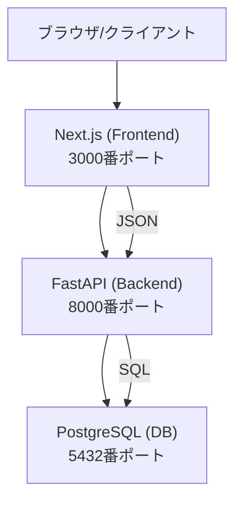
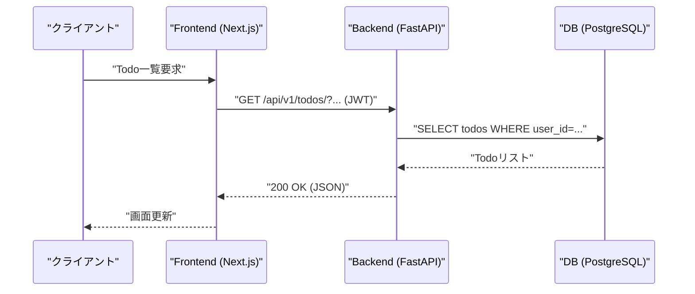
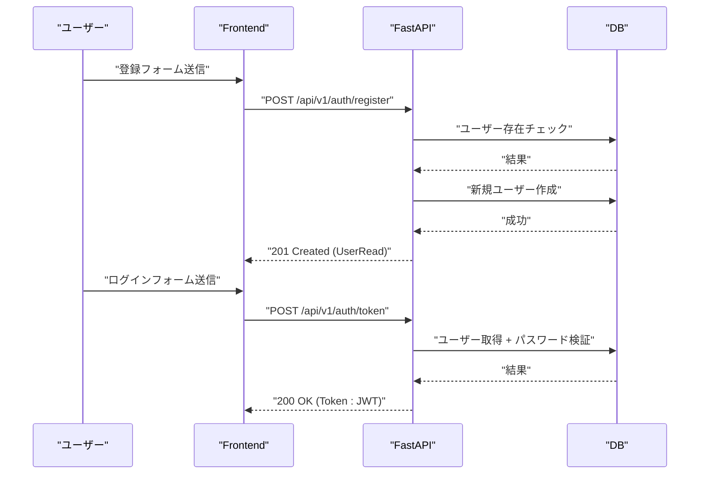
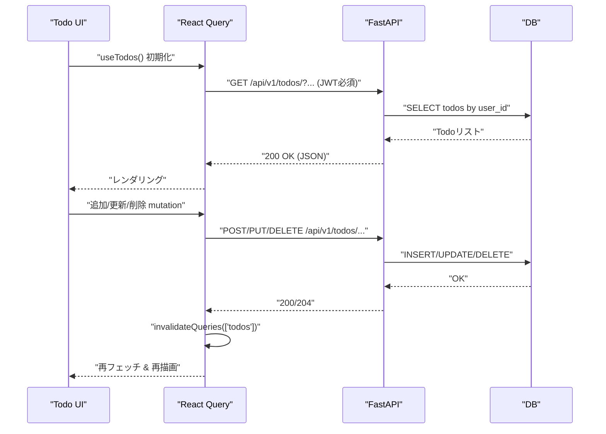
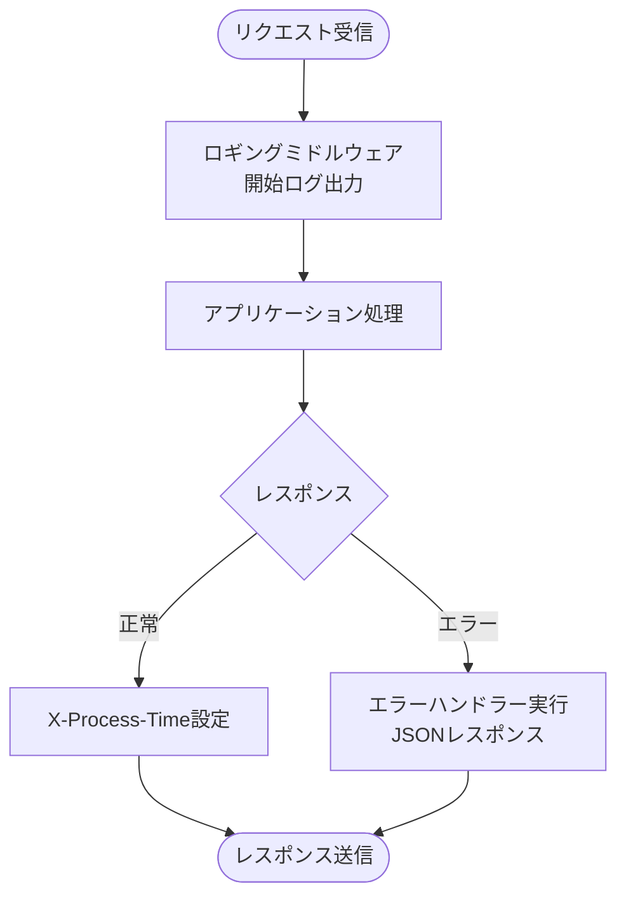
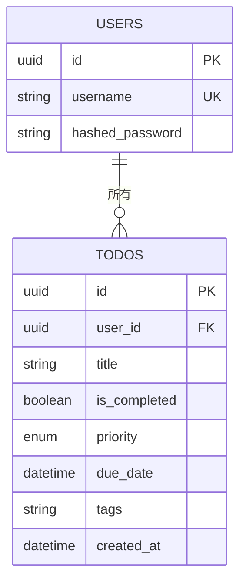
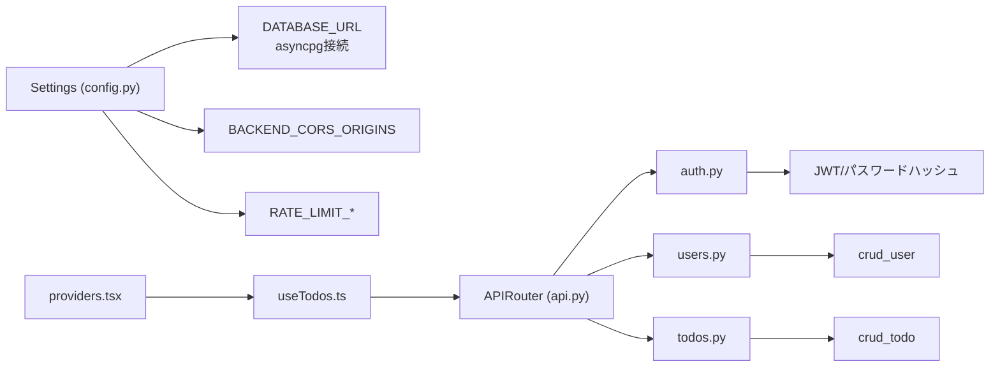

# アーキテクチャ

<cite>
**この文書で参照されるファイル**
- [README.md](file://README.md)
- [docker-compose.yml](file://docker-compose.yml)
- [pyproject.toml](file://backend/pyproject.toml)
- [package.json](file://frontend/package.json)
- [backend/app/main.py](file://backend/app/main.py)
- [frontend/src/app/layout.tsx](file://frontend/src/app/layout.tsx)
- [frontend/src/app/providers.tsx](file://frontend/src/app/providers.tsx)
- [frontend/src/hooks/useTodos.ts](file://frontend/src/hooks/useTodos.ts)
- [backend/app/api/api_v1/api.py](file://backend/app/api/api_v1/api.py)
- [backend/app/api/api_v1/endpoints/auth.py](file://backend/app/api/api_v1/endpoints/auth.py)
- [backend/app/api/api_v1/endpoints/todos.py](file://backend/app/api/api_v1/endpoints/todos.py)
- [backend/app/api/api_v1/endpoints/users.py](file://backend/app/api/api_v1/endpoints/users.py)
- [backend/app/core/config.py](file://backend/app/core/config.py)
- [backend/app/middleware/error_handler.py](file://backend/app/middleware/error_handler.py)
- [backend/app/middleware/logging.py](file://backend/app/middleware/logging.py)
- [backend/app/models/todo.py](file://backend/app/models/todo.py)
- [backend/app/models/user.py](file://backend/app/models/user.py)
- [backend/app/schemas/todo.py](file://backend/app/schemas/todo.py)
</cite>

## 目次
1. [導入](#導入)
2. [プロジェクト構造](#プロジェクト構造)
3. [コアコンポーネント](#コアコンポーネント)
4. [アーキテクチャ概要](#アーキテクチャ概要)
5. [詳細コンポーネント分析](#詳細コンポーネント分析)
6. [依存関係分析](#依存関係分析)
7. [パフォーマンス考慮事項](#パフォーマンス考慮事項)
8. [トラブルシューティングガイド](#トラブルシューティングガイド)
9. [結論](#結論)

## 導入
本Todoアプリケーションは、Next.js（フロントエンド）とFastAPI（バックエンド）による統合型フルスタックWebアプリケーションです。JWTベースの認証、リアルタイム性を考慮したUI更新、APIレート制限、構造化ログ、ヘルスチェック機能を備えています。開発と運用の両面で現代的な技術スタックを活用し、教育・ポートフォリオ目的として設計されています。

## プロジェクト構造
全体のプロジェクトは以下の要素で構成されます：
- フロントエンド：Next.js 16（App Router）、TypeScript、Bun、Tailwind CSS、shadcn/ui、TanStack React Query、React Hook Form + Zod、Sonner（通知）
- バックエンド：FastAPI、Python 3.10+、uv、PostgreSQL（asyncpg）、SQLModel、JWT（python-jose）、パスワードハッシュ（Argon2 + Bcrypt）、SlowAPI（レート制限）、python-json-logger（構造化ログ）
- インフラ：Docker、Docker Compose、Jujutsu（バージョン管理）

```mermaid
graph TB
subgraph "フロントエンド"
FE_Next["Next.js (App Router)<br/>TypeScript + Bun"]
FE_UI["UIコンポーネント<br/>Tailwind CSS + shadcn/ui"]
FE_Query["TanStack React Query<br/>リアルタイム更新"]
end
subgraph "バックエンド"
BE_API["FastAPI<br/>APIルーター"]
BE_DB["PostgreSQL<br/>asyncpg + SQLModel"]
BE_SEC["JWT認証<br/>パスワードハッシュ"]
BE_RATE["SlowAPIレート制限"]
BE_LOG["構造化ログ<br/>python-json-logger"]
end
FE_Next --> |"HTTP(JSON)"| BE_API
BE_API --> |"SQL"|" BE_DB
BE_API --> |"JWT"|" FE_Next
```

**図の出典**
- [README.md:60-84](file://README.md#L60-L84)
- [frontend/package.json:14-32](file://frontend/package.json#L14-L32)
- [backend/pyproject.toml:7-23](file://backend/pyproject.toml#L7-L23)

**節の出典**
- [README.md:30-56](file://README.md#L30-L56)
- [README.md:158-184](file://README.md#L158-L184)

## コアコンポーネント
- 認証（JWT）：ユーザー登録、アクセストークン取得（/api/v1/auth/register、/api/v1/auth/token）
- Todo管理：一覧取得、作成、更新、削除（/api/v1/todos/）
- ユーザー情報：現在のユーザー取得（/api/v1/users/me）
- ヘルスチェック：/health（DB接続状況を含む）
- APIドキュメント：/docs（Scalar）

**節の出典**
- [README.md:70-84](file://README.md#L70-L84)
- [backend/app/api/api_v1/api.py:1-8](file://backend/app/api/api_v1/api.py#L1-L8)
- [backend/app/api/api_v1/endpoints/auth.py:17-53](file://backend/app/api/api_v1/endpoints/auth.py#L17-L53)
- [backend/app/api/api_v1/endpoints/todos.py:13-80](file://backend/app/api/api_v1/endpoints/todos.py#L13-L80)
- [backend/app/api/api_v1/endpoints/users.py:9-14](file://backend/app/api/api_v1/endpoints/users.py#L9-L14)
- [backend/app/main.py:126-164](file://backend/app/main.py#L126-L164)

## アーキテクチャ概要
本アプリケーションは、以下の3層構造で動作します：
- フロントエンド（Next.js）：UI表示、ユーザー操作、API呼び出し（TanStack React Query）
- バックエンド（FastAPI）：認証、業務ロジック、DBアクセス、ミドルウェア（CORS、ロギング、エラーハンドリング、レート制限）
- データベース（PostgreSQL）：永続化、asyncpgによる非同期接続



**図の出典**
- [README.md:62-68](file://README.md#L62-L68)
- [docker-compose.yml:1-16](file://docker-compose.yml#L1-L16)
- [backend/app/core/config.py:24-37](file://backend/app/core/config.py#L24-L37)

**節の出典**
- [README.md:60-84](file://README.md#L60-L84)
- [docker-compose.yml:1-16](file://docker-compose.yml#L1-L16)

## 詳細コンポーネント分析

### APIエンドポイントとルーティング
- APIバージョン：/api/v1
- 認証エンドポイント：register（POST）、token（POST）
- Todoエンドポイント：todos（GET/POST）、todos/{id}（PUT/DELETE）
- ユーザー情報：users/me（GET）
- ヘルスチェック：/health



**図の出典**
- [backend/app/api/api_v1/api.py:1-8](file://backend/app/api/api_v1/api.py#L1-L8)
- [backend/app/api/api_v1/endpoints/todos.py:13-38](file://backend/app/api/api_v1/endpoints/todos.py#L13-L38)
- [backend/app/core/config.py:22](file://backend/app/core/config.py#L22)

**節の出典**
- [backend/app/api/api_v1/endpoints/auth.py:17-53](file://backend/app/api/api_v1/endpoints/auth.py#L17-L53)
- [backend/app/api/api_v1/endpoints/todos.py:40-80](file://backend/app/api/api_v1/endpoints/todos.py#L40-L80)
- [backend/app/api/api_v1/endpoints/users.py:9-14](file://backend/app/api/api_v1/endpoints/users.py#L9-L14)

### 認証フロー（JWT）
- 登録：ユニークなユーザー名の確認後、新規ユーザー作成
- ログイン：パスワード検証後、JWTアクセストークン発行（有効期限付き）



**図の出典**
- [backend/app/api/api_v1/endpoints/auth.py:17-53](file://backend/app/api/api_v1/endpoints/auth.py#L17-L53)

**節の出典**
- [backend/app/api/api_v1/endpoints/auth.py:17-53](file://backend/app/api/api_v1/endpoints/auth.py#L17-L53)

### Todo管理フロー（React Query + API）
- 一覧取得：URLクエリパラメータ（検索、フィルタ、ソート、ページネーション）を活用
- 作成/更新/削除：mutation後にクエリ無効化（invalidateQueries）により即時反映



**図の出典**
- [frontend/src/hooks/useTodos.ts:26-96](file://frontend/src/hooks/useTodos.ts#L26-L96)
- [backend/app/api/api_v1/endpoints/todos.py:13-80](file://backend/app/api/api_v1/endpoints/todos.py#L13-L80)

**節の出典**
- [frontend/src/hooks/useTodos.ts:26-96](file://frontend/src/hooks/useTodos.ts#L26-L96)

### ミドルウェアとエラーハンドリング
- CORS：設定されたオリジンからのアクセスを許可
- ロギング：リクエスト開始/完了/エラーを構造化ログ出力（X-Process-Time付与）
- エラーハンドリング：Validation、HTTP、一般例外、レート制限超過を統一レスポンス形式で返却



**図の出典**
- [backend/app/middleware/logging.py:10-67](file://backend/app/middleware/logging.py#L10-L67)
- [backend/app/middleware/error_handler.py:15-149](file://backend/app/middleware/error_handler.py#L15-L149)

**節の出典**
- [backend/app/main.py:104-124](file://backend/app/main.py#L104-L124)
- [backend/app/middleware/logging.py:10-67](file://backend/app/middleware/logging.py#L10-L67)
- [backend/app/middleware/error_handler.py:15-149](file://backend/app/middleware/error_handler.py#L15-L149)

### DBスキーマと関係性
- User：複数のTodoを持つ
- Todo：Userに属し、複数のインデックス（user_id、created_at、is_completed、priority、due_date）を保持



**図の出典**
- [backend/app/models/user.py:9-19](file://backend/app/models/user.py#L9-L19)
- [backend/app/models/todo.py:10-25](file://backend/app/models/todo.py#L10-L25)
- [backend/app/schemas/todo.py:13-33](file://backend/app/schemas/todo.py#L13-L33)

**節の出典**
- [backend/app/models/user.py:9-19](file://backend/app/models/user.py#L9-L19)
- [backend/app/models/todo.py:10-25](file://backend/app/models/todo.py#L10-L25)
- [backend/app/schemas/todo.py:13-33](file://backend/app/schemas/todo.py#L13-L33)

## 依存関係分析
- 設定管理：SettingsクラスがDB接続文字列、JWT、CORS、レート制限設定を提供
- DB接続：asyncpg + SQLModel、非同期セッション管理
- API構造：APIRouterによるモジュール化（auth、users、todos）
- 前後端通信：JSON形式、Authorization: Bearer（JWT）



**図の出典**
- [backend/app/core/config.py:4-60](file://backend/app/core/config.py#L4-L60)
- [backend/app/api/api_v1/api.py:1-8](file://backend/app/api/api_v1/api.py#L1-L8)
- [frontend/src/app/providers.tsx:8-25](file://frontend/src/app/providers.tsx#L8-L25)
- [frontend/src/hooks/useTodos.ts:1-96](file://frontend/src/hooks/useTodos.ts#L1-L96)

**節の出典**
- [backend/app/core/config.py:4-60](file://backend/app/core/config.py#L4-L60)
- [backend/app/api/api_v1/api.py:1-8](file://backend/app/api/api_v1/api.py#L1-L8)
- [frontend/src/app/providers.tsx:8-25](file://frontend/src/app/providers.tsx#L8-L25)
- [frontend/src/hooks/useTodos.ts:1-96](file://frontend/src/hooks/useTodos.ts#L1-L96)

## パフォーマンス考慮事項
- 非同期DB接続：asyncpgによる非同期I/OによりDBレイテンシを軽減
- React Queryのキャッシング：staleTime設定により不要なリクエストを抑制
- レスポンスタイム監視：X-Process-Timeヘッダーによる遅延の可視化
- インデックス最適化：Todoモデルに複数のインデックスを設定（user_id、created_at、is_completed、priority、due_date）

**節の出典**
- [frontend/src/app/providers.tsx:9-15](file://frontend/src/app/providers.tsx#L9-L15)
- [backend/app/middleware/logging.py:47-48](file://backend/app/middleware/logging.py#L47-L48)
- [backend/app/models/todo.py:12-18](file://backend/app/models/todo.py#L12-L18)

## トラブルシューティングガイド
- 認証エラー（401）：JWTトークンの有効期限切れまたは不正な形式
- 入力バリデーションエラー（422）：リクエストボディの形式不正
- レート制限超過（429）：認証系APIに短時間での過剰リクエスト
- DB接続エラー（5xx）：/healthエンドポイントでDB接続状況を確認
- CORSエラー：BACKEND_CORS_ORIGINSにFrontendオリジン（localhost:3000）が含まれているか確認

**節の出典**
- [backend/app/middleware/error_handler.py:15-149](file://backend/app/middleware/error_handler.py#L15-L149)
- [backend/app/main.py:130-164](file://backend/app/main.py#L130-L164)
- [backend/app/core/config.py:44-48](file://backend/app/core/config.py#L44-L48)

## 結論
本Todoアプリケーションは、Next.jsとFastAPIの統合により、堅牢かつ拡張可能なフルスタックアーキテクチャを提供しています。JWT認証、レート制限、構造化ログ、非同期DBアクセス、React Queryによるリアルタイム更新が組み合わさり、教育・実務双方に適した実装例となっています。Dockerコンテナ化により開発・本番環境の一貫性が保たれています。