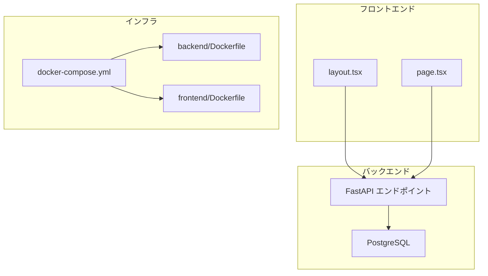
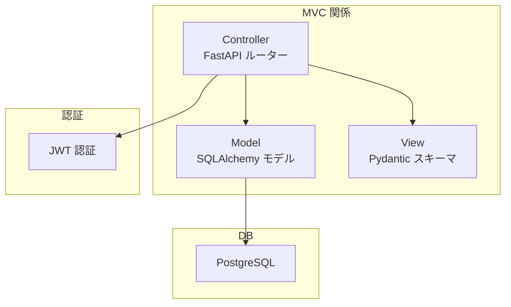
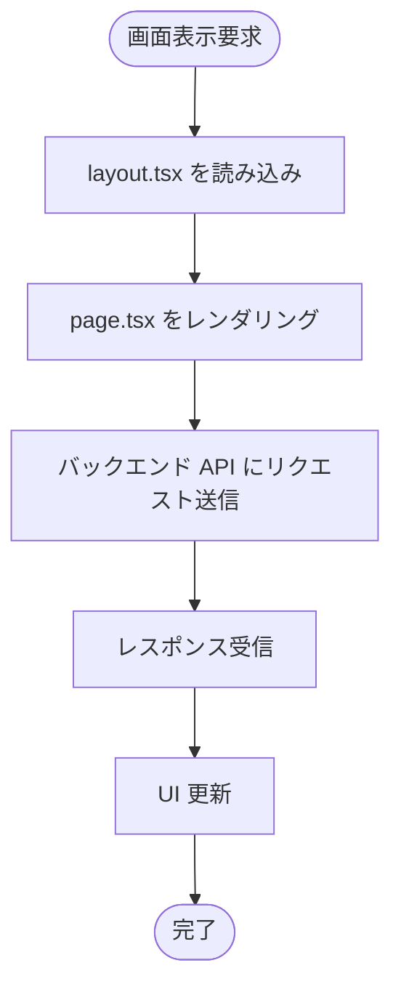
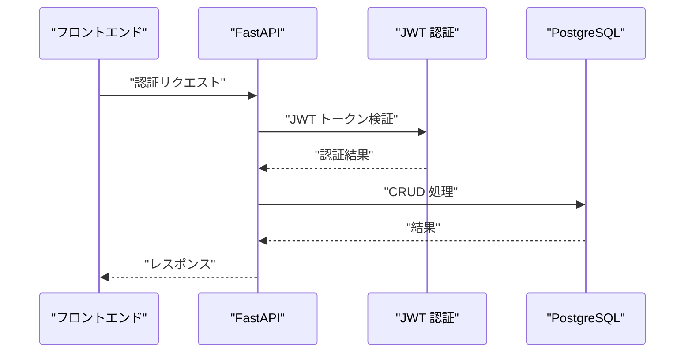
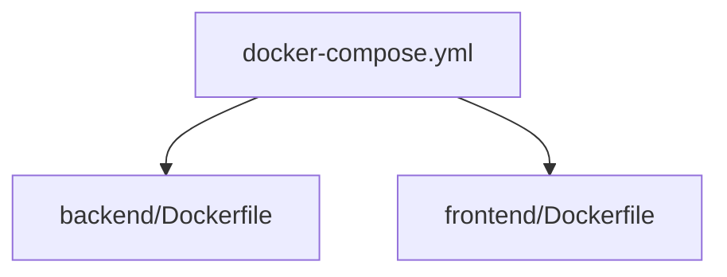
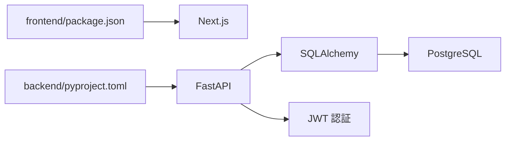

# アーキテクチャ

<cite>
**このドキュメントで参照されるファイル**
- [backend/app/main.py](file://backend/app/main.py)
- [backend/app/database.py](file://backend/app/database.py)
- [backend/app/models.py](file://backend/app/models.py)
- [backend/app/schemas.py](file://backend/app/schemas.py)
- [backend/app/crud.py](file://backend/app/crud.py)
- [backend/app/config.py](file://backend/app/config.py)
- [frontend/src/app/layout.tsx](file://frontend/src/app/layout.tsx)
- [frontend/src/app/page.tsx](file://frontend/src/app/page.tsx)
- [docker-compose.yml](file://docker-compose.yml)
- [docker/backend/Dockerfile](file://docker/backend/Dockerfile)
- [docker/frontend/Dockerfile](file://docker/frontend/Dockerfile)
- [backend/pyproject.toml](file://backend/pyproject.toml)
- [frontend/package.json](file://frontend/package.json)
</cite>

## 目次
1. [導入](#導入)
2. [プロジェクト構造](#プロジェクト構造)
3. [コアコンポーネント](#コアコンポーネント)
4. [アーキテクチャ概観](#アーキテクチャ概観)
5. [詳細コンポーネント分析](#詳細コンポーネント分析)
6. [依存関係分析](#依存関係分析)
7. [パフォーマンス考慮事項](#パフォーマンス考慮事項)
8. [トラブルシューティングガイド](#トラブルシューティングガイド)
9. [結論](#結論)

## 導入
本プロジェクトは、Next.js（フロントエンド）と FastAPI（バックエンド）による Todo システムであり、Docker によるコンテナ化されたマイクロサービス構成を採用しています。データ永続化には PostgreSQL が利用され、JWT 認証を通じてセキュアな API 通信が実現されます。本ドキュメントでは、MVC パターンの適用、依存性注入の仕組み、RESTful API の設計原則、セキュリティ寢措、システム境界、コンポーネント間のデータフロー、インフラ構成、スケーラビリティについて、コードベースに基づいて詳細に解説します。

## プロジェクト構造
全体の構成は以下の通りです：
- フロントエンド：Next.js（App Router、TypeScript、CSS Modules）
- バックエンド：FastAPI（Python、Pydantic、SQLAlchemy ORM）
- インフラ：Docker によるコンテナ化、docker-compose によるサービス連携
- データベース：PostgreSQL（SQLAlchemy ORM によるモデル定義）

**図の出典**
- [docker-compose.yml](file://docker-compose.yml)
- [docker/backend/Dockerfile](file://docker/backend/Dockerfile)
- [docker/frontend/Dockerfile](file://docker/frontend/Dockerfile)
- [frontend/src/app/layout.tsx](file://frontend/src/app/layout.tsx)
- [frontend/src/app/page.tsx](file://frontend/src/app/page.tsx)
- [backend/app/main.py](file://backend/app/main.py)
- [backend/app/database.py](file://backend/app/database.py)

**節の出典**
- [docker-compose.yml](file://docker-compose.yml)
- [docker/backend/Dockerfile](file://docker/backend/Dockerfile)
- [docker/frontend/Dockerfile](file://docker/frontend/Dockerfile)
- [frontend/src/app/layout.tsx](file://frontend/src/app/layout.tsx)
- [frontend/src/app/page.tsx](file://frontend/src/app/page.tsx)
- [backend/app/main.py](file://backend/app/main.py)
- [backend/app/database.py](file://backend/app/database.py)

## コアコンポーネント
- フロントエンド（Next.js）
  - App Router によるルーティング、グローバルスタイル、ページコンポーネント
  - API 呼び出し先としてバックエンドエンドポイントを想定
- バックエンド（FastAPI）
  - RESTful API エンドポイント定義、依存性注入、JWT 認証
  - SQLAlchemy ORM によるデータベース操作（CRUD）
  - Pydantic スキーマによるリクエスト/レスポンスバリデーション
- インフラ（Docker）
  - backend/Dockerfile と frontend/Dockerfile によるコンテナビルド
  - docker-compose.yml によるサービス起動・ネットワーク連携

**節の出典**
- [frontend/src/app/layout.tsx](file://frontend/src/app/layout.tsx)
- [frontend/src/app/page.tsx](file://frontend/src/app/page.tsx)
- [backend/app/main.py](file://backend/app/main.py)
- [backend/app/crud.py](file://backend/app/crud.py)
- [backend/app/schemas.py](file://backend/app/schemas.py)
- [backend/app/models.py](file://backend/app/models.py)
- [backend/app/database.py](file://backend/app/database.py)
- [backend/app/config.py](file://backend/app/config.py)
- [docker/backend/Dockerfile](file://docker/backend/Dockerfile)
- [docker/frontend/Dockerfile](file://docker/frontend/Dockerfile)
- [docker-compose.yml](file://docker-compose.yml)

## アーキテクチャ概観
本システムは、MVC（Model-View-Controller）の概念を応用し、FastAPI がコントローラー（ルーター）として振る舞い、Pydantic スキーマがビュー（リクエスト/レスポンス定義）、SQLAlchemy モデルがモデル（データ永続化）として機能します。依存性注入は FastAPI によって提供され、DB 接続や認証ロジックがモジュール単位で管理されます。JWT 認証により、API へのアクセス制御が実現され、セキュリティが強化されています。

**図の出典**
- [backend/app/main.py](file://backend/app/main.py)
- [backend/app/models.py](file://backend/app/models.py)
- [backend/app/schemas.py](file://backend/app/schemas.py)
- [backend/app/database.py](file://backend/app/database.py)
- [backend/app/config.py](file://backend/app/config.py)

## 詳細コンポーネント分析

### フロントエンド（Next.js）
- layout.tsx：アプリケーションの共通レイアウト、グローバルスタイル適用
- page.tsx：Todo 機能の画面コンポーネント、API 呼び出しを行う想定
- 依存関係：package.json に Next.js および関連ツールの定義あり

**節の出典**
- [frontend/src/app/layout.tsx](file://frontend/src/app/layout.tsx)
- [frontend/src/app/page.tsx](file://frontend/src/app/page.tsx)
- [frontend/package.json](file://frontend/package.json)

### バックエンド（FastAPI）
- main.py：エントリーポイント、ルート定義、依存性注入設定
- database.py：DB 接続設定、Engine 作成、セッション管理
- models.py：SQLAlchemy モデル定義（Todo など）
- schemas.py：Pydantic スキーマ（リクエスト/レスポンス）
- crud.py：CRUD 操作（DB へのアクセスロジック）
- config.py：JWT 認証設定（シークレットキー、トークン有効期限など）

**図の出典**
- [backend/app/main.py](file://backend/app/main.py)
- [backend/app/database.py](file://backend/app/database.py)
- [backend/app/models.py](file://backend/app/models.py)
- [backend/app/schemas.py](file://backend/app/schemas.py)
- [backend/app/crud.py](file://backend/app/crud.py)
- [backend/app/config.py](file://backend/app/config.py)

**節の出典**
- [backend/app/main.py](file://backend/app/main.py)
- [backend/app/database.py](file://backend/app/database.py)
- [backend/app/models.py](file://backend/app/models.py)
- [backend/app/schemas.py](file://backend/app/schemas.py)
- [backend/app/crud.py](file://backend/app/crud.py)
- [backend/app/config.py](file://backend/app/config.py)

### Docker と docker-compose
- backend/Dockerfile：バックエンドコンテナのビルド（Python 環境、依存ライブラリ）
- frontend/Dockerfile：フロントエンドコンテナのビルド（Next.js、ビルドツール）
- docker-compose.yml：サービス間のネットワーク、ポートマッピング、依存関係定義

**図の出典**
- [docker-compose.yml](file://docker-compose.yml)
- [docker/backend/Dockerfile](file://docker/backend/Dockerfile)
- [docker/frontend/Dockerfile](file://docker/frontend/Dockerfile)

**節の出典**
- [docker-compose.yml](file://docker-compose.yml)
- [docker/backend/Dockerfile](file://docker/backend/Dockerfile)
- [docker/frontend/Dockerfile](file://docker/frontend/Dockerfile)

## 依存関係分析
- フロントエンド依存：Next.js、TypeScript、CSS Modules、API 呼び出し先（バックエンド）
- バックエンド依存：FastAPI、SQLAlchemy、Pydantic、PostgreSQL、JWT 認証
- インフラ依存：Docker、docker-compose、ネットワーク設定

**図の出典**
- [frontend/package.json](file://frontend/package.json)
- [backend/pyproject.toml](file://backend/pyproject.toml)
- [backend/app/database.py](file://backend/app/database.py)
- [backend/app/config.py](file://backend/app/config.py)

**節の出典**
- [frontend/package.json](file://frontend/package.json)
- [backend/pyproject.toml](file://backend/pyproject.toml)
- [backend/app/database.py](file://backend/app/database.py)
- [backend/app/config.py](file://backend/app/config.py)

## パフォーマンス考慮事項
- DB 接続プーリング：接続数の最適化、トランザクションの短縮
- API 応答時間：非同期処理、キャッシュ機構（必要に応じて）
- Docker リソース管理：CPU/メモリ制限、スケーラビリティ向上
- 依存ライブラリの軽量化：不要な依存を除外、バンドルサイズの削減

## トラブルシューティングガイド
- 起動時エラー
  - docker-compose でのサービス起動確認、ポート競合のチェック
  - Dockerfile 内の依存ライブラリのビルドエラー確認
- API 呼び出し失敗
  - JWT トークンの有効期限、署名の一致確認
  - FastAPI のルート定義、スキーマバリデーションエラーの確認
- DB 接続エラー
  - PostgreSQL の起動状態、接続文字列、認証情報の確認
  - SQLAlchemy による ORM クエリのエラーメッセージを確認

**節の出典**
- [docker-compose.yml](file://docker-compose.yml)
- [docker/backend/Dockerfile](file://docker/backend/Dockerfile)
- [docker/frontend/Dockerfile](file://docker/frontend/Dockerfile)
- [backend/app/main.py](file://backend/app/main.py)
- [backend/app/database.py](file://backend/app/database.py)
- [backend/app/config.py](file://backend/app/config.py)

## 結論
本プロジェクトは、Next.js と FastAPI による明確な層別アーキテクチャを採用し、Docker によるコンテナ化と JWT 認証、SQLAlchemy によるデータ永続化を統合して構築されています。MVC パターン、依存性注入、RESTful API 設計原則、セキュリティ対策が組み合わさり、スケーラブルかつ保守しやすい構成となっています。今後の拡張としては、API のバージョニング、監視・ロギングの強化、CI/CD パイプラインの導入が挙げられます。