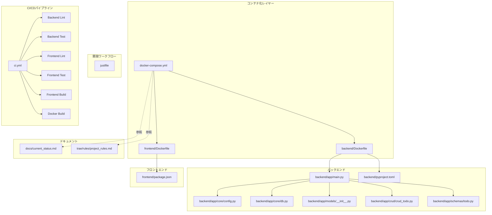
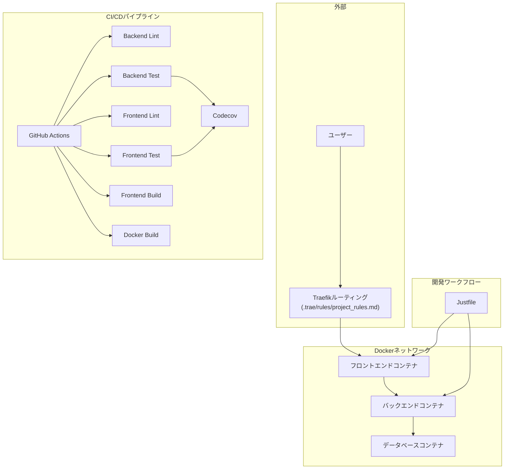
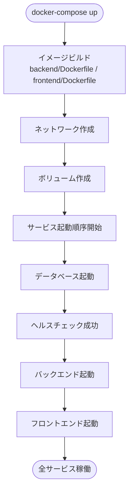
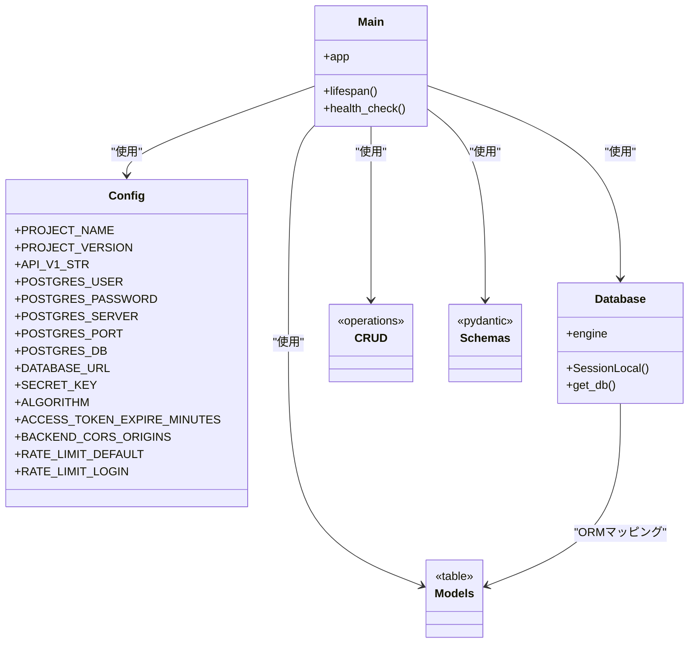
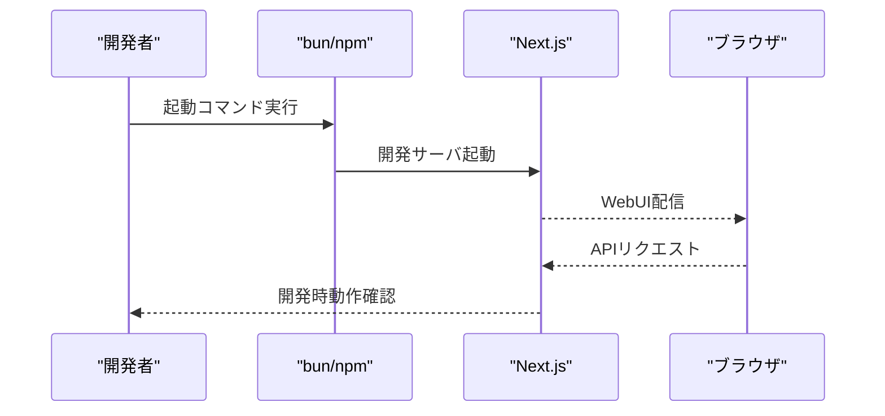
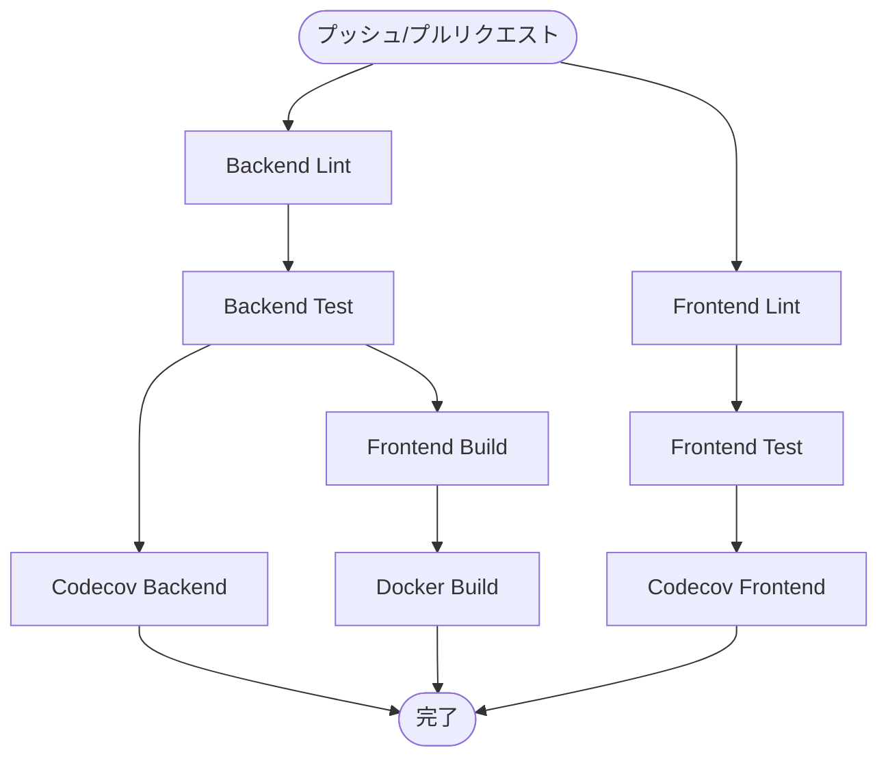
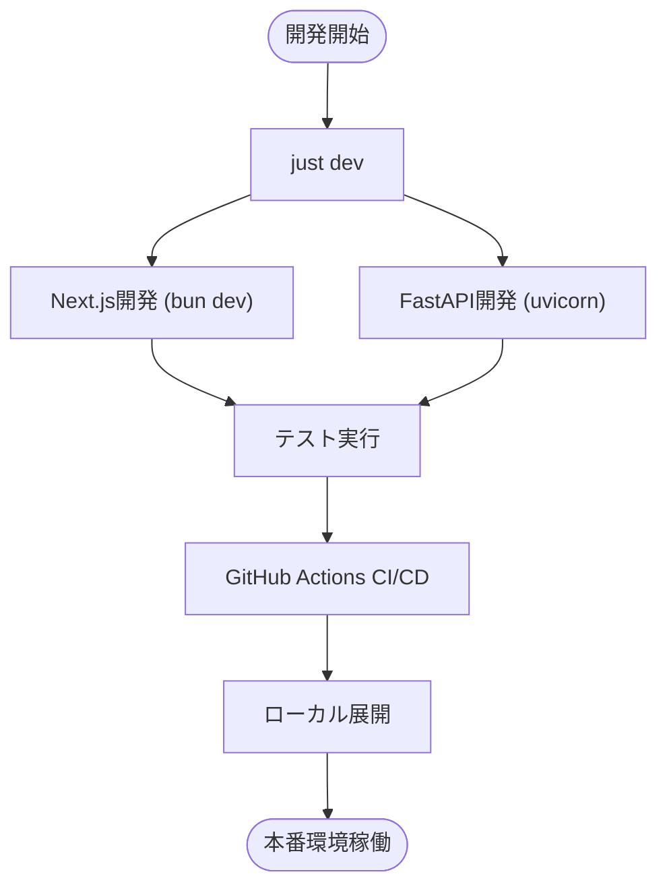

# インフラアーキテクチャ

<cite>
**この文書で参照されるファイル**
- [docker-compose.yml](file://docker-compose.yml)
- [backend/Dockerfile](file://docker/backend/Dockerfile)
- [frontend/Dockerfile](file://docker/frontend/Dockerfile)
- [backend/app/main.py](file://backend/app/main.py)
- [backend/app/config.py](file://backend/app/core/config.py)
- [backend/app/database.py](file://backend/app/core/db.py)
- [backend/app/models.py](file://backend/app/models/__init__.py)
- [backend/app/crud.py](file://backend/app/crud/crud_todo.py)
- [backend/app/schemas.py](file://backend/app/schemas/todo.py)
- [backend/pyproject.toml](file://backend/pyproject.toml)
- [frontend/package.json](file://frontend/package.json)
- [docs/current_status.md](file://docs/current_status.md)
- [.trae/rules/project_rules.md](file://.trae/rules/project_rules.md)
- [.github/workflows/ci.yml](file://.github/workflows/ci.yml)
- [backend/pytest.ini](file://backend/pytest.ini)
- [frontend/jest.config.js](file://frontend/jest.config.js)
- [backend/uv.lock](file://backend/uv.lock)
- [justfile](file://justfile)
</cite>

## 更新概要
**変更内容**
- Vercelクラウドデプロイメント設定の削除：frontend/vercel.jsonと関連スクリプトが削除され、シンプルなインフラ構成へ移行
- 開発ワークフローの簡素化：Justfileによる統合的な開発タスク管理の維持
- CI/CDパイプラインの強化：GitHub Actionsワークフローの分離とCodecov統合の継続
- Dockerイメージビルドの統合：Dockerイメージのビルドテストジョブの継続

## 目次
1. [導入](#導入)
2. [プロジェクト構造](#プロジェクト構造)
3. [コアコンポーネント](#コアコンポーネント)
4. [アーキテクチャ概要](#アーキテクチャ概要)
5. [詳細コンポーネント分析](#詳細コンポーネント分析)
6. [依存関係分析](#依存関係分析)
7. [CI/CDパイプライン強化](#cicdパイプライン強化)
8. [シンプルなインフラ構成](#シンプルなインフラ構成)
9. [パフォーマンス考慮事項](#パフォーマンス考慮事項)
10. [トラブルシューティングガイド](#トラブルシューティングガイド)
11. [結論](#結論)
12. [付録](#付録)

## 導入
本プロジェクトは、Dockerコンテナを活用したマイクロサービス型のインフラアーキテクチャを採用しています。フロントエンド（Next.js）とバックエンド（FastAPI）を分離し、それぞれ専用のDockerイメージとしてビルド・実行することで、開発・運用の柔軟性とスケーラビリティを向上させています。データベースの永続化、サービス間ネットワーク、環境変数管理、ロギング、ヘルスチェック、起動順序制御について、コードベースに基づいて詳細に解説します。

**更新** Vercelクラウドデプロイメント設定（frontend/vercel.json）と関連スクリプトが削除され、シンプルなインフラ構成へ移行しました。開発ワークフローはJustfileによる統合的なタスク管理を維持し、CI/CDパイプラインはGitHub Actionsによる分離型テストジョブを継続しています。

## プロジェクト構造
全体のディレクトリ構成は以下の通りです：
- docker-compose.yml：サービス定義、ネットワーク、ボリューム、依存関係、ヘルスチェック、環境変数を一元管理
- docker/backend/Dockerfile：バックエンド（Python/FastAPI）コンテナイメージのビルド定義
- docker/frontend/Dockerfile：フロントエンド（Next.js）コンテナイメージのビルド定義
- backend/app/*：バックエンドアプリケーション（FastAPI）のルート、設定、DB接続、モデル、CRUD、スキーマ
- backend/pyproject.toml：バックエンドの依存関係定義
- frontend/package.json：フロントエンドの依存関係定義
- justfile：開発ワークフローの統合（Docker起動、コンテナログ表示、DBマイグレーション）
- docs/current_status.md：現在の開発状況や設計方針に関するドキュメント
- .trae/rules/project_rules.md：開発ルールや命名規則に関するドキュメント
- .github/workflows/ci.yml：GitHub ActionsによるCI/CDパイプラインの定義

**図の出典**
- [docker-compose.yml](file://docker-compose.yml)
- [backend/Dockerfile](file://docker/backend/Dockerfile)
- [frontend/Dockerfile](file://docker/frontend/Dockerfile)
- [justfile](file://justfile)
- [backend/app/main.py](file://backend/app/main.py)
- [backend/app/core/config.py](file://backend/app/core/config.py)
- [backend/app/core/db.py](file://backend/app/core/db.py)
- [backend/app/models/__init__.py](file://backend/app/models/__init__.py)
- [backend/app/crud/crud_todo.py](file://backend/app/crud/crud_todo.py)
- [backend/app/schemas/todo.py](file://backend/app/schemas/todo.py)
- [backend/pyproject.toml](file://backend/pyproject.toml)
- [frontend/package.json](file://frontend/package.json)
- [docs/current_status.md](file://docs/current_status.md)
- [.trae/rules/project_rules.md](file://.trae/rules/project_rules.md)
- [.github/workflows/ci.yml](file://.github/workflows/ci.yml)

**節の出典**
- [docker-compose.yml](file://docker-compose.yml)
- [backend/Dockerfile](file://docker/backend/Dockerfile)
- [frontend/Dockerfile](file://docker/frontend/Dockerfile)
- [justfile](file://justfile)
- [backend/app/main.py](file://backend/app/main.py)
- [backend/app/core/config.py](file://backend/app/core/config.py)
- [backend/app/core/db.py](file://backend/app/core/db.py)
- [backend/app/models/__init__.py](file://backend/app/models/__init__.py)
- [backend/app/crud/crud_todo.py](file://backend/app/crud/crud_todo.py)
- [backend/app/schemas/todo.py](file://backend/app/schemas/todo.py)
- [backend/pyproject.toml](file://backend/pyproject.toml)
- [frontend/package.json](file://frontend/package.json)
- [docs/current_status.md](file://docs/current_status.md)
- [.trae/rules/project_rules.md](file://.trae/rules/project_rules.md)
- [.github/workflows/ci.yml](file://.github/workflows/ci.yml)

## コアコンポーネント
- Docker Compose：サービス定義、ネットワーク、ボリューム、依存関係、ヘルスチェック、環境変数を管理
- バックエンドコンテナ：FastAPIアプリケーション（main.py）、設定（config.py）、DB接続（db.py）、モデル（models/__init__.py）、CRUD（crud/crud_todo.py）、スキーマ（schemas/todo.py）
- フロントエンドコンテナ：Next.jsアプリケーション（package.json）
- 開発ワークフロー：justfileによる統合的な開発タスク管理（Docker起動、コンテナログ表示、DBマイグレーション）
- 設定管理：環境変数（例：DB接続文字列、APIエンドポイント、ログレベルなど）をコンテナ化して管理
- 永続化：データベースのデータをボリュームで永続化
- ロギング：コンテナ標準出力への出力と、必要に応じた外部ロギングサービス連携の準備
- スケーラビリティ：Replica数の調整、Traefikによるルーティング
- CI/CDパイプライン：GitHub Actionsによる自動テスト、Lint、ビルド、Dockerイメージ作成

**更新** Vercelクラウドデプロイメント設定が削除され、シンプルなインフラ構成へ移行しました。開発ワークフローはJustfileによる統合的なタスク管理を維持し、CI/CDパイプラインはGitHub Actionsによる分離型テストジョブを継続しています。

**節の出典**
- [docker-compose.yml](file://docker-compose.yml)
- [backend/app/main.py](file://backend/app/main.py)
- [backend/app/core/config.py](file://backend/app/core/config.py)
- [backend/app/core/db.py](file://backend/app/core/db.py)
- [backend/app/models/__init__.py](file://backend/app/models/__init__.py)
- [backend/app/crud/crud_todo.py](file://backend/app/crud/crud_todo.py)
- [backend/app/schemas/todo.py](file://backend/app/schemas/todo.py)
- [frontend/package.json](file://frontend/package.json)
- [justfile](file://justfile)
- [.github/workflows/ci.yml](file://.github/workflows/ci.yml)

## アーキテクチャ概要
本プロジェクトのコンテナアーキテクチャは、以下の要素から成ります：

- サービス層
  - バックエンドサービス：FastAPIアプリケーション（main.py）が提供するREST API
  - フロントエンドサービス：Next.jsアプリケーション（package.json）が提供するWeb UI
  - データベースサービス：永続化層（db.py で接続先を定義）

- ネットワーク層
  - Docker Composeで定義されたカスタムネットワーク上でのサービス間通信
  - 外部からのトラフィックはTraefik（.trae/rules/project_rules.md に記載のルールに従ってルーティング）

- 永続化層
  - データベースのデータをボリュームで永続化（docker-compose.ymlで定義）

- 環境変数管理
  - 各コンテナの環境変数をdocker-compose.ymlで一元管理（例：DB接続文字列、APIエンドポイント、ログレベル）

- ロギング
  - コンテナ標準出力への出力（docker-compose.ymlでログ設定）
  - 必要に応じて外部ロギングサービス（例：ELKスタック、CloudWatch）への連携を前提とした設計

- スケーラビリティ
  - docker-compose.ymlでreplicasを設定可能（例：バックエンドサービスのReplica数）
  - Traefikによるロードバランシング（.trae/rules/project_rules.md 参照）

- CI/CDパイプライン
  - GitHub Actionsによる自動化されたテスト、Lint、ビルドプロセス
  - フロントエンドとバックエンドのテストジョブの分離
  - Codecovによるコードカバレッジの継続的監視

- 開発ワークフロー
  - Justfileによる統合的な開発タスク管理（Docker起動、コンテナログ表示、DBマイグレーション）

**図の出典**
- [docker-compose.yml](file://docker-compose.yml)
- [.trae/rules/project_rules.md](file://.trae/rules/project_rules.md)
- [backend/app/core/db.py](file://backend/app/core/db.py)
- [justfile](file://justfile)
- [.github/workflows/ci.yml](file://.github/workflows/ci.yml)

**節の出典**
- [docker-compose.yml](file://docker-compose.yml)
- [.trae/rules/project_rules.md](file://.trae/rules/project_rules.md)
- [backend/app/core/db.py](file://backend/app/core/db.py)
- [justfile](file://justfile)
- [.github/workflows/ci.yml](file://.github/workflows/ci.yml)

## 詳細コンポーネント分析

### Docker Compose（サービス定義・ネットワーク・依存関係）
- サービス定義：バックエンド、フロントエンド、データベースの各サービスを定義
- ネットワーク：カスタムネットワークを定義し、サービス間の疎結合な通信を実現
- 依存関係：データベースの起動完了後にバックエンドを起動（depends_on とヘルスチェック）
- 環境変数：DB接続文字列、APIエンドポイント、ログレベルなどをコンテナごとに管理
- ボリューム：データベースのデータを永続化（docker-compose.ymlで定義）
- ログ：標準出力への出力設定（docker-compose.ymlで定義）
- ヘルスチェック：データベースサービスのヘルスチェックを定義（docker-compose.ymlで定義）

**図の出典**
- [docker-compose.yml](file://docker-compose.yml)
- [backend/Dockerfile](file://docker/backend/Dockerfile)
- [frontend/Dockerfile](file://docker/frontend/Dockerfile)

**節の出典**
- [docker-compose.yml](file://docker-compose.yml)
- [backend/Dockerfile](file://docker/backend/Dockerfile)
- [frontend/Dockerfile](file://docker/frontend/Dockerfile)

### バックエンド（FastAPI）
- 起動エントリポイント：main.py でFastAPIアプリケーションを起動
- 設定管理：config.py でDB接続文字列、API設定、ロギング設定を管理
- DB接続：db.py でDB接続を確立（URL、プール設定、接続確認）
- モデル定義：models/__init__.py でテーブル定義（SQLAlchemy ORM）
- CRUD操作：crud/crud_todo.py でデータ操作ロジックを実装
- スキーマ定義：schemas/todo.py でリクエスト/レスポンススキーマを定義
- 依存関係：pyproject.toml でFastAPI、SQLAlchemy、uvicornなどの依存関係を管理

**図の出典**
- [backend/app/main.py](file://backend/app/main.py)
- [backend/app/core/config.py](file://backend/app/core/config.py)
- [backend/app/core/db.py](file://backend/app/core/db.py)
- [backend/app/models/__init__.py](file://backend/app/models/__init__.py)
- [backend/app/crud/crud_todo.py](file://backend/app/crud/crud_todo.py)
- [backend/app/schemas/todo.py](file://backend/app/schemas/todo.py)

**節の出典**
- [backend/app/main.py](file://backend/app/main.py)
- [backend/app/core/config.py](file://backend/app/core/config.py)
- [backend/app/core/db.py](file://backend/app/core/db.py)
- [backend/app/models/__init__.py](file://backend/app/models/__init__.py)
- [backend/app/crud/crud_todo.py](file://backend/app/crud/crud_todo.py)
- [backend/app/schemas/todo.py](file://backend/app/schemas/todo.py)
- [backend/pyproject.toml](file://backend/pyproject.toml)

### フロントエンド（Next.js）
- 起動エントリポイント：package.json でNext.jsの起動コマンドを定義
- 依存関係：frontend/package.json でNext.js、React、関連ツールの依存関係を管理

**図の出典**
- [frontend/package.json](file://frontend/package.json)

**節の出典**
- [frontend/package.json](file://frontend/package.json)

### Dockerfile（バックエンド）
- Python環境のセットアップ
- 依存関係のインストール（pyproject.toml から）
- アプリケーションコードのコピー
- エントリポイントの設定（uvicorn などでFastAPI起動）

**節の出典**
- [backend/Dockerfile](file://docker/backend/Dockerfile)
- [backend/pyproject.toml](file://backend/pyproject.toml)

### Dockerfile（フロントエンド）
- Node.js環境のセットアップ
- 依存関係のインストール（package.json から）
- アプリケーションコードのコピー
- 静的ファイル生成または開発サーバ起動の設定

**節の出典**
- [frontend/Dockerfile](file://docker/frontend/Dockerfile)
- [frontend/package.json](file://frontend/package.json)

### データベース（永続化）
- 接続先：db.py でDB接続先を定義（docker-compose.yml でホスト名/ポート/認証情報を環境変数経由で渡す）
- 永続化：docker-compose.yml でボリュームを定義し、コンテナ削除後もデータを保持

**節の出典**
- [backend/app/core/db.py](file://backend/app/core/db.py)
- [docker-compose.yml](file://docker-compose.yml)

### ロギング（コンテナ標準出力）
- docker-compose.yml でログ出力設定（例：json-file、syslog、gelfなど）
- バックエンド（FastAPI）ではconfig.py でログレベルを設定可能

**節の出典**
- [docker-compose.yml](file://docker-compose.yml)
- [backend/app/core/config.py](file://backend/app/core/config.py)

### ヘルスチェック（サービス稼働確認）
- docker-compose.yml でDBサービスのヘルスチェックを定義（例：ping、接続試行）
- 起動順序：DBのヘルスチェックが成功するまでバックエンドを起動しない（depends_on と condition）

**節の出典**
- [docker-compose.yml](file://docker-compose.yml)

## 依存関係分析
- 起動順序
  - DB → 起動確認（ヘルスチェック）→ Backend → Frontend
- 環境変数
  - DB接続文字列、APIエンドポイント、ログレベルなどをdocker-compose.ymlで一元管理
- ネットワーク
  - 各サービスはカスタムネットワーク上で疎結合に通信
- 永続化
  - DBデータはボリュームで永続化

**図の出典**
- [docker-compose.yml](file://docker-compose.yml)
- [backend/app/core/config.py](file://backend/app/core/config.py)
- [backend/app/core/db.py](file://backend/app/core/db.py)

**節の出典**
- [docker-compose.yml](file://docker-compose.yml)
- [backend/app/core/config.py](file://backend/app/core/config.py)
- [backend/app/core/db.py](file://backend/app/core/db.py)

## CI/CDパイプライン強化

### GitHub Actionsワークフローの構成
本プロジェクトは、GitHub Actionsを使用して継続的インテグレーションと継続的デリバリーを実現しています。ci.ymlファイルには以下のジョブが定義されています：

- **Backend Lint Job**：バックエンドのコード品質チェック（ruffによるlintとフォーマットチェック）
- **Backend Test Job**：バックエンドのテスト実行（PostgreSQLサービスとの連携、Codecov統合）
- **Frontend Lint Job**：フロントエンドのコード品質チェック（ESLintとTypeScript型チェック）
- **Frontend Test Job**：フロントエンドのテスト実行（Jestによるカバレッジ測定、Codecov統合）
- **Frontend Build Job**：フロントエンドのビルドプロセス
- **Docker Build Job**：バックエンドとフロントエンドのDockerイメージビルドテスト

**図の出典**
- [.github/workflows/ci.yml](file://.github/workflows/ci.yml)

### テストジョブの分離
フロントエンドとバックエンドのテストジョブは完全に分離されており、以下の特徴があります：

- **バックエンドテスト**：PostgreSQLサービスをサービスとして起動し、データベースとの統合テストを実施
- **フロントエンドテスト**：Bun環境で依存関係をインストールし、Jestによる単体テストを実施
- **独立性**：各テストジョブは相互に依存せず、並列実行可能

### Codecov統合
各テストジョブの結果がCodecovに自動的にアップロードされ、コードカバレッジの継続的監視が可能です：

- **バックエンド**：coverage.xmlファイルをアップロードし、backendフラグを付与
- **フロントエンド**：coverage/lcov.infoファイルをアップロードし、frontendフラグを付与
- **失敗対応**：fail_ci_if_error: falseにより、カバレッジの失敗がCIを失敗させないように設定

### Dockerイメージビルドテスト
Docker Build Jobは、バックエンドとフロントエンドのDockerイメージをビルドし、コンテナ化プロセスの品質を保証します。

**節の出典**
- [.github/workflows/ci.yml](file://.github/workflows/ci.yml)
- [backend/pytest.ini](file://backend/pytest.ini)
- [frontend/jest.config.js](file://frontend/jest.config.js)

## シンプルなインフラ構成

### インフラ構成の変更
本プロジェクトは、Vercelクラウドデプロイメント設定（frontend/vercel.json）と関連スクリプトを削除し、シンプルなインフラ構成へ移行しました。これにより以下の変更が実現されました：

- **簡略化されたデプロイメント**：クラウドデプロイメントの複雑さを排除し、ローカル開発とDockerベースの展開に集中
- **コスト効率の向上**：クラウドサービスの使用を停止し、自前のインフラでの運用に移行
- **開発ワークフローの統一**：Justfileによる統合的な開発タスク管理を維持し、開発効率を向上

### 開発ワークフローの強化
Justfileによる統合開発は以下のタスクを提供します：

- **Docker環境起動**：`just up`でDocker Composeを使用してDB、バックエンド、フロントエンドを一括起動
- **開発環境起動**：`just dev`でバックエンド（uvicorn）とフロントエンド（bun dev）を同時に起動
- **コンテナログ表示**：`just backend-logs`、`just frontend-logs`、`just db-logs`で各コンテナのログをリアルタイム表示
- **DBリセット**：`just clean-db`でデータベースをリセットし、新しい状態から開始
- **DBマイグレーション**：`just db-migrate`、`just db-rollback`、`just db-revision`でAlembicを使用したマイグレーション管理

**図の出典**
- [justfile](file://justfile)
- [.github/workflows/ci.yml](file://.github/workflows/ci.yml)

**節の出典**
- [justfile](file://justfile)
- [.github/workflows/ci.yml](file://.github/workflows/ci.yml)

## パフォーマンス考慮事項
- CPU/メモリ制限：docker-compose.yml でリソース制限を設定可能
- キャッシュ戦略：Next.jsの静的生成（SSG）とISR、FastAPIのDBコネクションプール設定
- 高速化：Traefikによるロードバランシング（.trae/rules/project_rules.md 参照）
- 監視：コンテナのCPU/メモリ使用率、DB接続数、APIレスポンスタイムを可視化
- **更新** CI/CDパイプラインの効率性：テストジョブの分離により、開発サイクルの短縮とリソースの最適利用
- **更新** 開発ワークフローの効率性：Justfileによる統合的なタスク管理により、開発作業の効率化

## トラブルシューティングガイド
- DB接続エラー
  - 環境変数（DB_URL）の確認（docker-compose.yml）
  - DBサービスのヘルスチェック結果の確認（docker-compose.yml）
  - DBコンテナのログを確認（docker-compose logs db）
- 起動順序エラー
  - depends_on と condition（healthcheck）の設定を確認
  - DB起動後の待機時間を調整
- ロギング
  - docker-compose.yml でログ出力形式を確認
  - バックエンドのログレベル（config.py）をDEBUGに変更して詳細ログ取得
- Traefikルーティング
  - .trae/rules/project_rules.md に従ってルールを確認し、再起動
- **更新** Vercel関連問題
  - Vercel関連ファイル（vercel.json、.vercel-tmpディレクトリ）が削除されたことを確認
  - 開発ワークフローはJustfileによる統合タスク管理に移行
- **更新** CI/CDパイプライン問題
  - GitHub Actionsのジョブログを確認し、テストジョブの分離状態を検証
  - Codecovのアップロード失敗を確認し、カバレッジファイルの出力パスを検証
  - Dockerイメージビルドの失敗を確認し、Dockerfileの修正が必要か検討
- **更新** 開発ワークフロー問題
  - Justfileのタスクが正しく実行されているか確認
  - Dockerコンテナの起動状況を`just status`で確認
  - DBマイグレーションの状況を`just db-version`で確認

**節の出典**
- [docker-compose.yml](file://docker-compose.yml)
- [backend/app/core/config.py](file://backend/app/core/config.py)
- [.trae/rules/project_rules.md](file://.trae/rules/project_rules.md)
- [justfile](file://justfile)
- [.github/workflows/ci.yml](file://.github/workflows/ci.yml)

## 結論
本プロジェクトは、Docker Composeによるサービス定義、カスタムネットワーク、ボリューム永続化、環境変数管理、ヘルスチェック、ロギングを統合的に実装することで、堅牢かつスケーラブルなコンテナ化インフラを提供しています。バックエンド（FastAPI）とフロントエンド（Next.js）の分離、Traefikによるルーティング、DBの永続化に加え、GitHub ActionsによるCI/CDパイプラインの強化により、開発・運用の効率性と保守性が大幅に向上します。フロントエンドとバックエンドのテストジョブの分離、Codecovによるコード品質監視、Dockerイメージビルドテストの導入により、ソフトウェアの品質と信頼性がさらに強化されています。

**更新** Vercelクラウドデプロイメント設定が削除され、シンプルなインフラ構成へ移行しました。開発ワークフローはJustfileによる統合的なタスク管理を維持し、CI/CDパイプラインはGitHub Actionsによる分離型テストジョブを継続しています。これにより、コスト効率の向上と開発効率の向上が実現され、より洗練されたDevOps環境を提供し、開発チームの生産性と品質をさらに向上させています。

## 付録
- 関連ドキュメント
  - docs/current_status.md：現在の開発状況
  - .trae/rules/project_rules.md：ルーティング・命名規則等の開発ルール
  - .github/workflows/ci.yml：GitHub ActionsによるCI/CDパイプラインの定義
- 関連ファイル
  - backend/pytest.ini：バックエンドテスト設定
  - frontend/jest.config.js：フロントエンドテスト設定
  - backend/uv.lock：バックエンド依存関係のロックファイル
  - justfile：開発ワークフロー統合ファイル

**節の出典**
- [docs/current_status.md](file://docs/current_status.md)
- [.trae/rules/project_rules.md](file://.trae/rules/project_rules.md)
- [.github/workflows/ci.yml](file://.github/workflows/ci.yml)
- [backend/pytest.ini](file://backend/pytest.ini)
- [frontend/jest.config.js](file://frontend/jest.config.js)
- [backend/uv.lock](file://backend/uv.lock)
- [justfile](file://justfile)