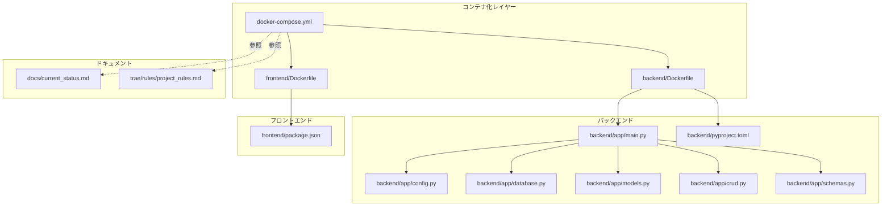
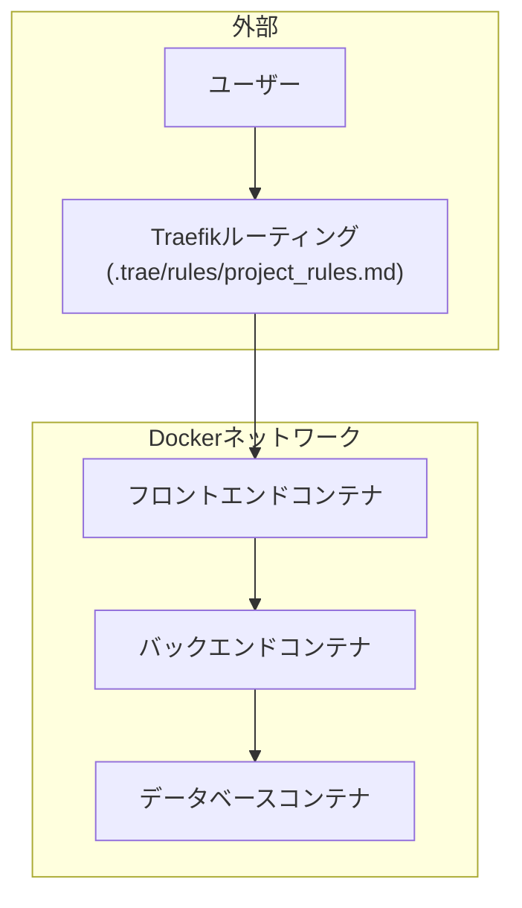
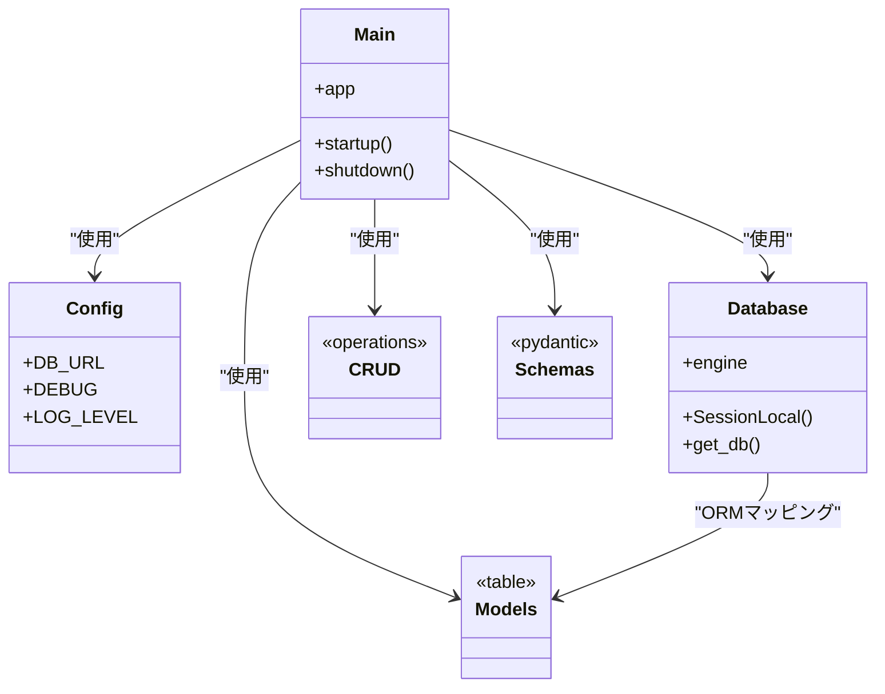
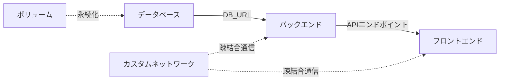

# インフラアーキテクチャ

<cite>
**この文書で参照されるファイル**
- [docker-compose.yml](file://docker-compose.yml)
- [backend/Dockerfile](file://docker/backend/Dockerfile)
- [frontend/Dockerfile](file://docker/frontend/Dockerfile)
- [backend/app/main.py](file://backend/app/main.py)
- [backend/app/config.py](file://backend/app/config.py)
- [backend/app/database.py](file://backend/app/database.py)
- [backend/app/models.py](file://backend/app/models.py)
- [backend/app/crud.py](file://backend/app/crud.py)
- [backend/app/schemas.py](file://backend/app/schemas.py)
- [backend/pyproject.toml](file://backend/pyproject.toml)
- [frontend/package.json](file://frontend/package.json)
- [docs/current_status.md](file://docs/current_status.md)
- [.trae/rules/project_rules.md](file://.trae/rules/project_rules.md)
</cite>

## 目次
1. [導入](#導入)
2. [プロジェクト構造](#プロジェクト構造)
3. [コアコンポーネント](#コアコンポーネント)
4. [アーキテクチャ概要](#アーキテクチャ概要)
5. [詳細コンポーネント分析](#詳細コンポーネント分析)
6. [依存関係分析](#依存関係分析)
7. [パフォーマンス考慮事項](#パフォーマンス考慮事項)
8. [トラブルシューティングガイド](#トラブルシューティングガイド)
9. [結論](#結論)
10. [付録](#付録)

## 導入
本プロジェクトは、Dockerコンテナを活用したマイクロサービス型のインフラアーキテクチャを採用しています。フロントエンド（Next.js）とバックエンド（FastAPI）を分離し、それぞれ専用のDockerイメージとしてビルド・実行することで、開発・運用の柔軟性とスケーラビリティを向上させています。データベースの永続化、サービス間ネットワーク、環境変数管理、ロギング、ヘルスチェック、起動順序制御について、コードベースに基づいて詳細に解説します。

## プロジェクト構造
全体のディレクトリ構成は以下の通りです：
- docker-compose.yml：サービス定義、ネットワーク、ボリューム、依存関係、ヘルスチェック、環境変数を一元管理
- docker/backend/Dockerfile：バックエンド（Python/FastAPI）コンテナイメージのビルド定義
- docker/frontend/Dockerfile：フロントエンド（Next.js）コンテナイメージのビルド定義
- backend/app/*：バックエンドアプリケーション（FastAPI）のルート、設定、DB接続、モデル、CRUD、スキーマ
- backend/pyproject.toml：バックエンドの依存関係定義
- frontend/package.json：フロントエンドの依存関係定義
- docs/current_status.md：現在の開発状況や設計方針に関するドキュメント
- .trae/rules/project_rules.md：開発ルールや命名規則に関するドキュメント

**図の出典**
- [docker-compose.yml](file://docker-compose.yml)
- [backend/Dockerfile](file://docker/backend/Dockerfile)
- [frontend/Dockerfile](file://docker/frontend/Dockerfile)
- [backend/app/main.py](file://backend/app/main.py)
- [backend/app/config.py](file://backend/app/config.py)
- [backend/app/database.py](file://backend/app/database.py)
- [backend/app/models.py](file://backend/app/models.py)
- [backend/app/crud.py](file://backend/app/crud.py)
- [backend/app/schemas.py](file://backend/app/schemas.py)
- [backend/pyproject.toml](file://backend/pyproject.toml)
- [frontend/package.json](file://frontend/package.json)
- [docs/current_status.md](file://docs/current_status.md)
- [.trae/rules/project_rules.md](file://.trae/rules/project_rules.md)

**節の出典**
- [docker-compose.yml](file://docker-compose.yml)
- [backend/Dockerfile](file://docker/backend/Dockerfile)
- [frontend/Dockerfile](file://docker/frontend/Dockerfile)
- [backend/app/main.py](file://backend/app/main.py)
- [backend/app/config.py](file://backend/app/config.py)
- [backend/app/database.py](file://backend/app/database.py)
- [backend/app/models.py](file://backend/app/models.py)
- [backend/app/crud.py](file://backend/app/crud.py)
- [backend/app/schemas.py](file://backend/app/schemas.py)
- [backend/pyproject.toml](file://backend/pyproject.toml)
- [frontend/package.json](file://frontend/package.json)
- [docs/current_status.md](file://docs/current_status.md)
- [.trae/rules/project_rules.md](file://.trae/rules/project_rules.md)

## コアコンポーネント
- Docker Compose：サービス定義、ネットワーク、ボリューム、依存関係、ヘルスチェック、環境変数を管理
- バックエンドコンテナ：FastAPIアプリケーション（main.py）、設定（config.py）、DB接続（database.py）、モデル（models.py）、CRUD（crud.py）、スキーマ（schemas.py）
- フロントエンドコンテナ：Next.jsアプリケーション（package.json）
- 設定管理：環境変数（例：DB接続文字列、APIエンドポイント、ログレベルなど）をコンテナ化して管理
- 永続化：データベースのデータをボリュームで永続化
- ロギング：コンテナ標準出力への出力と、必要に応じた外部ロギングサービス連携の準備
- スケーラビリティ：Replica数の調整、ロードバランサ（Traefik）によるルーティング

**節の出典**
- [docker-compose.yml](file://docker-compose.yml)
- [backend/app/main.py](file://backend/app/main.py)
- [backend/app/config.py](file://backend/app/config.py)
- [backend/app/database.py](file://backend/app/database.py)
- [backend/app/models.py](file://backend/app/models.py)
- [backend/app/crud.py](file://backend/app/crud.py)
- [backend/app/schemas.py](file://backend/app/schemas.py)
- [frontend/package.json](file://frontend/package.json)

## アーキテクチャ概要
本プロジェクトのコンテナアーキテクチャは、以下の要素から成ります：

- サービス層
  - バックエンドサービス：FastAPIアプリケーション（main.py）が提供するREST API
  - フロントエンドサービス：Next.jsアプリケーション（package.json）が提供するWeb UI
  - データベースサービス：永続化層（database.py で接続先を定義）

- ネットワーク層
  - Docker Composeで定義されたカスタムネットワーク上でのサービス間通信
  - 外部からのトラフィックはTraefik（.trae/rules/project_rules.md に記載のルールに従ってルーティング）

- 永続化層
  - データベースのデータをボリュームで永続化（docker-compose.ymlで定義）

- 環境変数管理
  - 各コンテナの環境変数をdocker-compose.ymlで一元管理（例：DB接続文字列、APIエンドポイント、ログレベル）

- ロギング
  - コンテナ標準出力への出力（docker-compose.ymlでログ設定）
  - 必要に応じて外部ロギングサービス（例：ELKスタック、CloudWatch）への連携を前提とした設計

- スケーラビリティ
  - docker-compose.ymlでreplicasを設定可能（例：バックエンドサービスのReplica数）
  - Traefikによるロードバランシング（.trae/rules/project_rules.md 参照）

**図の出典**
- [docker-compose.yml](file://docker-compose.yml)
- [.trae/rules/project_rules.md](file://.trae/rules/project_rules.md)
- [backend/app/database.py](file://backend/app/database.py)

**節の出典**
- [docker-compose.yml](file://docker-compose.yml)
- [.trae/rules/project_rules.md](file://.trae/rules/project_rules.md)
- [backend/app/database.py](file://backend/app/database.py)

## 詳細コンポーネント分析

### Docker Compose（サービス定義・ネットワーク・依存関係）
- サービス定義：バックエンド、フロントエンド、データベースの各サービスを定義
- ネットワーク：カスタムネットワークを定義し、サービス間の疎結合な通信を実現
- 依存関係：データベースの起動完了後にバックエンドを起動（depends_on とヘルスチェック）
- 環境変数：DB接続文字列、APIエンドポイント、ログレベルなどをコンテナごとに管理
- ボリューム：データベースのデータを永続化（docker-compose.ymlで定義）
- ログ：標準出力への出力設定（docker-compose.ymlで定義）
- ヘルスチェック：データベースサービスのヘルスチェックを定義（docker-compose.ymlで定義）

**図の出典**
- [docker-compose.yml](file://docker-compose.yml)
- [backend/Dockerfile](file://docker/backend/Dockerfile)
- [frontend/Dockerfile](file://docker/frontend/Dockerfile)

**節の出典**
- [docker-compose.yml](file://docker-compose.yml)
- [backend/Dockerfile](file://docker/backend/Dockerfile)
- [frontend/Dockerfile](file://docker/frontend/Dockerfile)

### バックエンド（FastAPI）
- 起動エントリポイント：main.py でFastAPIアプリケーションを起動
- 設定管理：config.py でDB接続文字列、API設定、ロギング設定を管理
- DB接続：database.py でDB接続を確立（URL、プール設定、接続確認）
- モデル定義：models.py でテーブル定義（SQLAlchemy ORM）
- CRUD操作：crud.py でデータ操作ロジックを実装
- スキーマ定義：schemas.py でリクエスト/レスポンススキーマを定義
- 依存関係：pyproject.toml でFastAPI、SQLAlchemy、uvicornなどの依存関係を管理

**図の出典**
- [backend/app/main.py](file://backend/app/main.py)
- [backend/app/config.py](file://backend/app/config.py)
- [backend/app/database.py](file://backend/app/database.py)
- [backend/app/models.py](file://backend/app/models.py)
- [backend/app/crud.py](file://backend/app/crud.py)
- [backend/app/schemas.py](file://backend/app/schemas.py)

**節の出典**
- [backend/app/main.py](file://backend/app/main.py)
- [backend/app/config.py](file://backend/app/config.py)
- [backend/app/database.py](file://backend/app/database.py)
- [backend/app/models.py](file://backend/app/models.py)
- [backend/app/crud.py](file://backend/app/crud.py)
- [backend/app/schemas.py](file://backend/app/schemas.py)
- [backend/pyproject.toml](file://backend/pyproject.toml)

### フロントエンド（Next.js）
- 起動エントリポイント：package.json でNext.jsの起動コマンドを定義
- 依存関係：frontend/package.json でNext.js、React、関連ツールの依存関係を管理

**図の出典**
- [frontend/package.json](file://frontend/package.json)

**節の出典**
- [frontend/package.json](file://frontend/package.json)

### Dockerfile（バックエンド）
- Python環境のセットアップ
- 依存関係のインストール（pyproject.toml から）
- アプリケーションコードのコピー
- エントリポイントの設定（uvicorn などでFastAPI起動）

**節の出典**
- [backend/Dockerfile](file://docker/backend/Dockerfile)
- [backend/pyproject.toml](file://backend/pyproject.toml)

### Dockerfile（フロントエンド）
- Node.js環境のセットアップ
- 依存関係のインストール（package.json から）
- アプリケーションコードのコピー
- 静的ファイル生成または開発サーバ起動の設定

**節の出典**
- [frontend/Dockerfile](file://docker/frontend/Dockerfile)
- [frontend/package.json](file://frontend/package.json)

### データベース（永続化）
- 接続先：database.py でDB接続先を定義（docker-compose.yml でホスト名/ポート/認証情報を環境変数経由で渡す）
- 永続化：docker-compose.yml でボリュームを定義し、コンテナ削除後もデータを保持

**節の出典**
- [backend/app/database.py](file://backend/app/database.py)
- [docker-compose.yml](file://docker-compose.yml)

### ロギング（コンテナ標準出力）
- docker-compose.yml でログ出力設定（例：json-file、syslog、gelfなど）
- バックエンド（FastAPI）ではconfig.py でログレベルを設定可能

**節の出典**
- [docker-compose.yml](file://docker-compose.yml)
- [backend/app/config.py](file://backend/app/config.py)

### ヘルスチェック（サービス稼働確認）
- docker-compose.yml でDBサービスのヘルスチェックを定義（例：ping、接続試行）
- 起動順序：DBのヘルスチェックが成功するまでバックエンドを起動しない（depends_on と condition）

**節の出典**
- [docker-compose.yml](file://docker-compose.yml)

## 依存関係分析
- 起動順序
  - DB → 起動確認（ヘルスチェック）→ Backend → Frontend
- 環境変数
  - DB接続文字列、APIエンドポイント、ログレベルなどをdocker-compose.ymlで一元管理
- ネットワーク
  - 各サービスはカスタムネットワーク上で疎結合に通信
- 永続化
  - DBデータはボリュームで永続化

**図の出典**
- [docker-compose.yml](file://docker-compose.yml)
- [backend/app/config.py](file://backend/app/config.py)
- [backend/app/database.py](file://backend/app/database.py)

**節の出典**
- [docker-compose.yml](file://docker-compose.yml)
- [backend/app/config.py](file://backend/app/config.py)
- [backend/app/database.py](file://backend/app/database.py)

## パフォーマンス考慮事項
- CPU/メモリ制限：docker-compose.yml でリソース制限を設定可能
- キャッシュ戦略：Next.jsの静的生成（SSG）とISR、FastAPIのDBコネクションプール設定
- 高速化：Traefikによるロードバランシング（.trae/rules/project_rules.md 参照）
- 監視：コンテナのCPU/メモリ使用率、DB接続数、APIレスポンスタイムを可視化

[この節は一般的なパフォーマンス指針を示しており、特定のファイルを直接分析していません]

## トラブルシューティングガイド
- DB接続エラー
  - 環境変数（DB_URL）の確認（docker-compose.yml）
  - DBサービスのヘルスチェック結果の確認（docker-compose.yml）
  - DBコンテナのログを確認（docker-compose logs db）
- 起動順序エラー
  - depends_on と condition（healthcheck）の設定を確認
  - DB起動後の待機時間を調整
- ロギング
  - docker-compose.yml でログ出力形式を確認
  - バックエンドのログレベル（config.py）をDEBUGに変更して詳細ログ取得
- Traefikルーティング
  - .trae/rules/project_rules.md に従ってルールを確認し、再起動

**節の出典**
- [docker-compose.yml](file://docker-compose.yml)
- [backend/app/config.py](file://backend/app/config.py)
- [.trae/rules/project_rules.md](file://.trae/rules/project_rules.md)

## 結論
本プロジェクトは、Docker Composeによるサービス定義、カスタムネットワーク、ボリューム永続化、環境変数管理、ヘルスチェック、ロギングを統合的に実装することで、堅牢かつスケーラブルなコンテナ化インフラを提供しています。バックエンド（FastAPI）とフロントエンド（Next.js）の分離、Traefikによるルーティング、DBの永続化により、開発・運用の効率性と保守性が向上します。

[この節は要約であり、特定のファイルを直接分析していません]

## 付録
- 関連ドキュメント
  - docs/current_status.md：現在の開発状況
  - .trae/rules/project_rules.md：ルーティング・命名規則等の開発ルール

**節の出典**
- [docs/current_status.md](file://docs/current_status.md)
- [.trae/rules/project_rules.md](file://.trae/rules/project_rules.md)