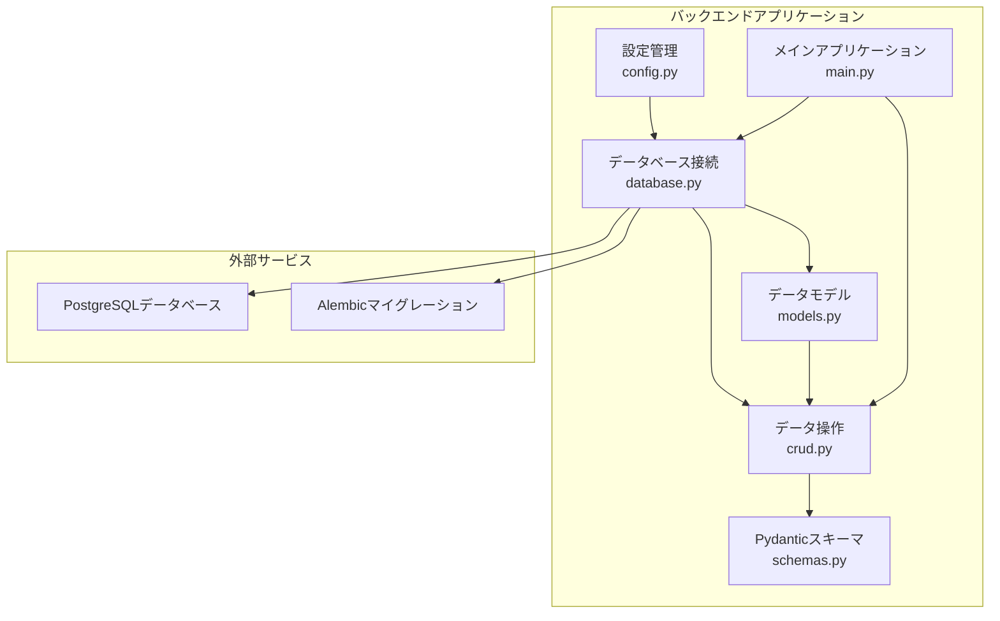
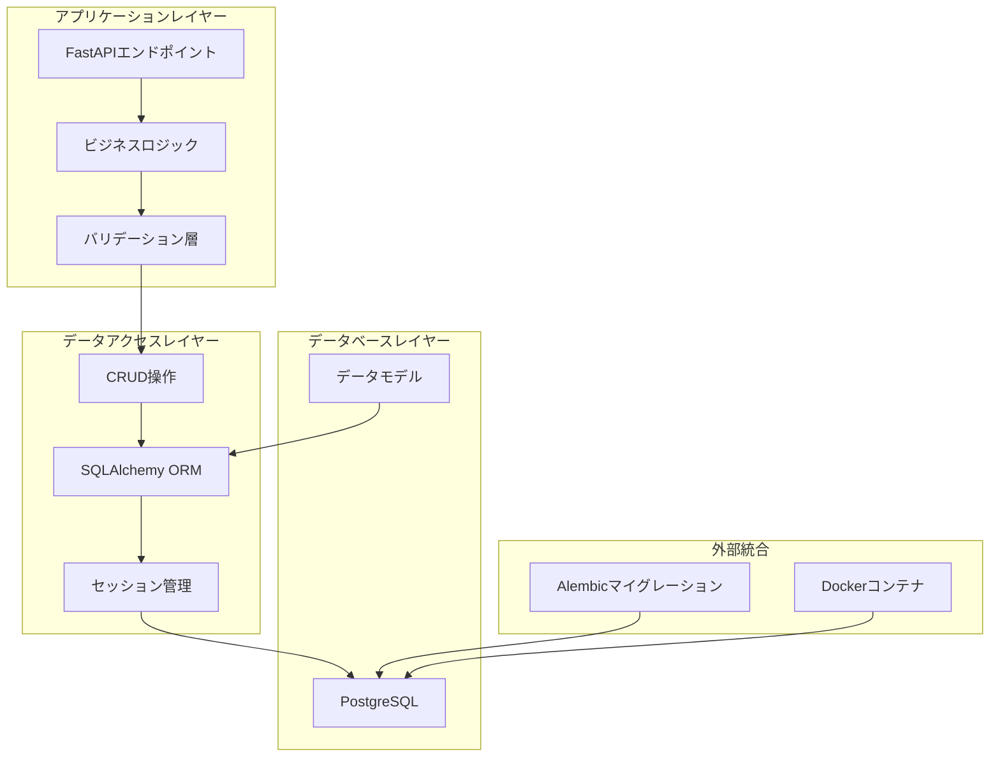
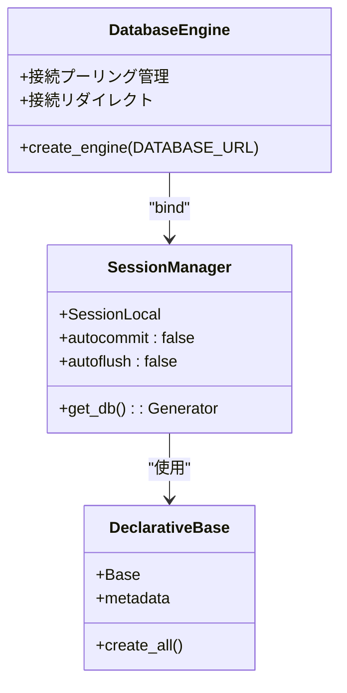
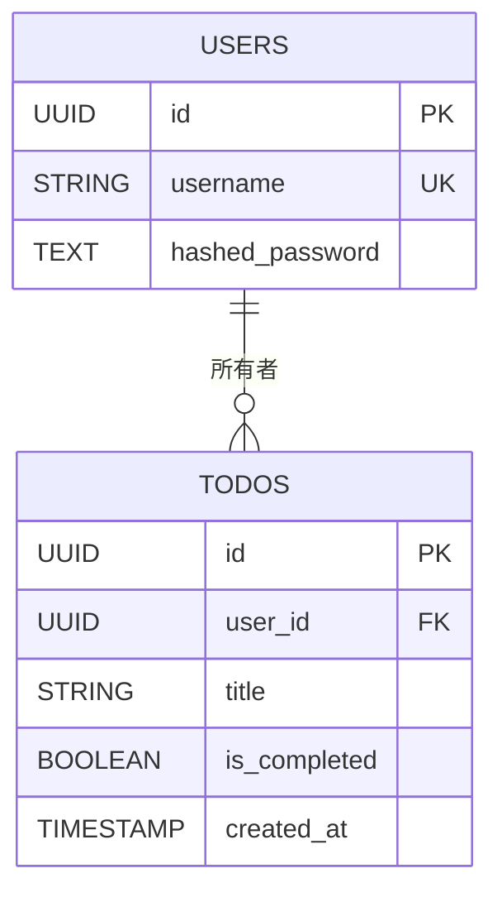
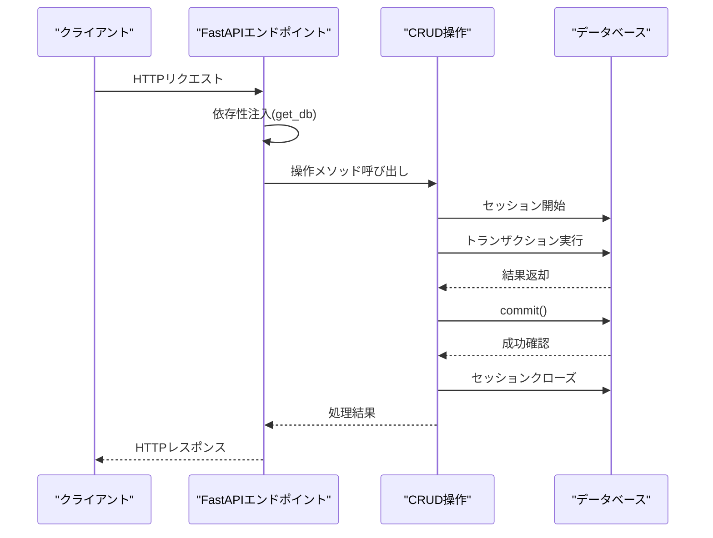
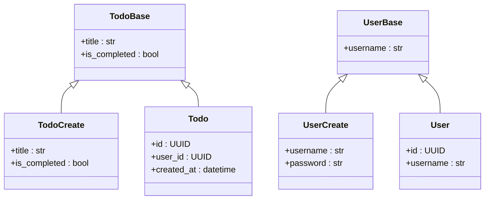
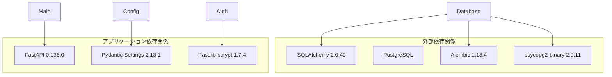

# データベースアーキテクチャ

<cite>
**この文書で参照されたファイル**
- [database.py](file://backend/app/database.py)
- [models.py](file://backend/app/models.py)
- [crud.py](file://backend/app/crud.py)
- [config.py](file://backend/app/config.py)
- [schemas.py](file://backend/app/schemas.py)
- [main.py](file://backend/app/main.py)
- [pyproject.toml](file://backend/pyproject.toml)
- [docker-compose.yml](file://docker-compose.yml)
</cite>

## 目次
1. [イントロダクション](#イントロダクション)
2. [プロジェクト構造](#プロジェクト構造)
3. [コアコンポーネント](#コアコンポーネント)
4. [アーキテクチャ概観](#アーキテクチャ概観)
5. [詳細コンポーネント分析](#詳細コンポーネント分析)
6. [依存関係分析](#依存関係分析)
7. [パフォーマンス考慮事項](#パフォーマンス考慮事項)
8. [トラブルシューティングガイド](#トラブルシューティングガイド)
9. [結論](#結論)

## イントロダクション
このTodoアプリケーションは、FastAPIフレームワークとSQLAlchemy ORMを使用したPythonバックエンドを備えています。PostgreSQLデータベースを統合し、ユーザーとタスクの2つの主要なエンティティを管理しています。本ドキュメントでは、データベースアーキテクチャ、SQLAlchemy ORM設計、データモデル定義、リレーションシップ構築、スキーマ設計、インデックス設計、制約条件、データ型選択理由、接続プーリング、トランザクション管理、データ移行戦略について詳細に説明します。

## プロジェクト構造
バックエンドアプリケーションは、以下の主要なコンポーネントで構成されています：

**図のソース**
- [database.py:1-17](file://backend/app/database.py#L1-L17)
- [models.py:1-22](file://backend/app/models.py#L1-L22)
- [crud.py:1-19](file://backend/app/crud.py#L1-L19)
- [config.py:1-12](file://backend/app/config.py#L1-L12)
- [main.py:1-23](file://backend/app/main.py#L1-L23)

**セクションのソース**
- [database.py:1-17](file://backend/app/database.py#L1-L17)
- [models.py:1-22](file://backend/app/models.py#L1-L22)
- [crud.py:1-19](file://backend/app/crud.py#L1-L19)
- [config.py:1-12](file://backend/app/config.py#L1-L12)
- [main.py:1-23](file://backend/app/main.py#L1-L23)

## コアコンポーネント
このアプリケーションのデータベースアーキテクチャは、以下の4つの主要なコンポーネントによって支えられています：

### 1. 設定管理コンポーネント
設定コンポーネントは、環境変数からデータベース接続情報を取得し、Pydantic Settingsを使用して型安全な設定管理を提供します。

### 2. データベース接続コンポーネント
SQLAlchemy EngineとSessionの作成、接続プーリングの設定、依存性注入によるセッション管理を担当します。

### 3. データモデルコンポーネント
2つの主要なエンティティ（UserとTodo）を定義し、SQLAlchemy ORMマッピングを提供します。

### 4. CRUD操作コンポーネント
データベース操作（読み取り、作成、更新、削除）を実装し、トランザクション管理を処理します。

**セクションのソース**
- [config.py:1-12](file://backend/app/config.py#L1-L12)
- [database.py:1-17](file://backend/app/database.py#L1-L17)
- [models.py:1-22](file://backend/app/models.py#L1-L22)
- [crud.py:1-19](file://backend/app/crud.py#L1-L19)

## アーキテクチャ概観
アプリケーション全体のデータベースアーキテクチャは、以下のレイヤー構造を採用しています：

**図のソース**
- [main.py:1-23](file://backend/app/main.py#L1-L23)
- [crud.py:1-19](file://backend/app/crud.py#L1-L19)
- [database.py:1-17](file://backend/app/database.py#L1-L17)
- [models.py:1-22](file://backend/app/models.py#L1-L22)

## 詳細コンポーネント分析

### データベース接続アーキテクチャ
データベース接続は、SQLAlchemyのEngineとSessionmakerを使用して構築されています。接続プーリングはデフォルト設定を使用し、各リクエストごとに新しいセッションが作成されます。

**図のソース**
- [database.py:6-9](file://backend/app/database.py#L6-L9)

**セクションのソース**
- [database.py:1-17](file://backend/app/database.py#L1-L17)

### データモデル設計
アプリケーションは2つの主要なエンティティを定義しています：

#### Userエンティティ
- **ID**: UUID型（as_uuid=True）を使用し、一意性を保証
- **username**: 文字列型（最大50文字）、一意制約、インデックス付き
- **hashed_password**: テキスト型、パスワードハッシュ保存用

#### Todoエンティティ
- **ID**: UUID型（as_uuid=True）を使用し、一意性を保証
- **user_id**: 外部キー制約（users.id）
- **title**: 文字列型（最大255文字）、必須
- **is_completed**: 真偽値型、デフォルトFalse
- **created_at**: 日時型（タイムゾーン対応）、サーバーデフォルト

**図のソース**
- [models.py:7-22](file://backend/app/models.py#L7-L22)

**セクションのソース**
- [models.py:1-22](file://backend/app/models.py#L1-L22)

### CRUD操作アーキテクチャ
CRUD操作は、セッション管理とトランザクション処理を適切に行っています：

**図のソース**
- [crud.py:10-18](file://backend/app/crud.py#L10-L18)
- [database.py:11-16](file://backend/app/database.py#L11-L16)

**セクションのソース**
- [crud.py:1-19](file://backend/app/crud.py#L1-L19)

### Pydanticスキーマ設計
スキーマ層は、データ検証とシリアライゼーションのためにPydanticを使用しています：

**図のソース**
- [schemas.py:7-29](file://backend/app/schemas.py#L7-L29)

**セクションのソース**
- [schemas.py:1-38](file://backend/app/schemas.py#L1-L38)

## 依存関係分析
アプリケーションの依存関係は以下の通りです：

**図のソース**
- [pyproject.toml:7-16](file://backend/pyproject.toml#L7-L16)

**セクションのソース**
- [pyproject.toml:1-17](file://backend/pyproject.toml#L1-L17)

## パフォーマンス考慮事項

### 接続プーリングの最適化
- 現在の設定では、SQLAlchemyのデフォルト接続プールを使用
- 生産環境では、プールサイズや接続寿命を調整することを推奨
- `pool_size`、`max_overflow`、`pool_recycle`などのパラメータを設定

### インデックス設計の改善
- 現在のインデックス：username（一意）、user_id（外部キー）
- 追加のインデックス提案：
  - todos.user_id（クエリパフォーマンス向上）
  - todos.is_completed（フィルタリングパフォーマンス向上）
  - todos.created_at（日付範囲クエリの高速化）

### SQL最適化
- N+1クエリ問題の回避
- 遅延ロードと即時ロードの適切な選択
- クエリのキャッシュ戦略の導入

## トラブルシューティングガイド

### 接続エラーの診断
1. **データベース接続確認**：
   - `/health`エンドポイントを使用して接続状態を確認
   - 環境変数のDATABASE_URLが正しいか確認

2. **認証エラーの解決**：
   - PostgreSQLの認証方法を確認
   - ユーザー権限の確認

3. **マイグレーションの問題**：
   - 現在は`create_all()`を使用しているため、Alembicの導入が必要

### トランザクションエラーの対処
1. **コミットエラー**：
   - 一意制約違反の確認
   - 外部キー制約の確認

2. **セッション管理**：
   - `get_db`関数のfinally節でのセッションクローズを確実にする

**セクションのソース**
- [main.py:15-22](file://backend/app/main.py#L15-L22)
- [database.py:11-16](file://backend/app/database.py#L11-L16)

## 結論
このTodoアプリケーションのデータベースアーキテクチャは、堅牢で拡張可能な設計を備えています。SQLAlchemy ORMを使用したオブジェクト指向なデータアクセス、適切なUUID設計、外部キー制約、Pydanticスキーマによるデータ検証が組み合わさって、信頼性の高いデータベース層を形成しています。

今後の改善点として、Alembicを使用した正式なマイグレーション戦略の導入、インデックスの最適化、接続プーリングのカスタマイズ、より高度なトランザクション管理の実装が挙げられます。これらの改善により、生産環境での運用がさらに安定し、パフォーマンスも向上するでしょう。