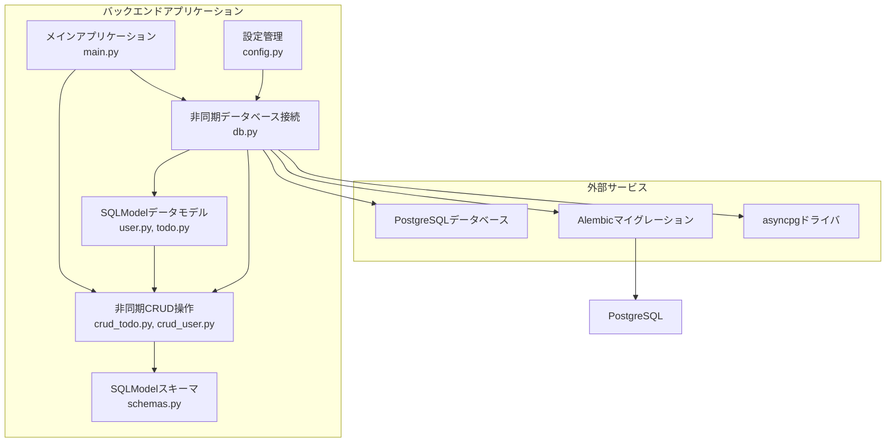
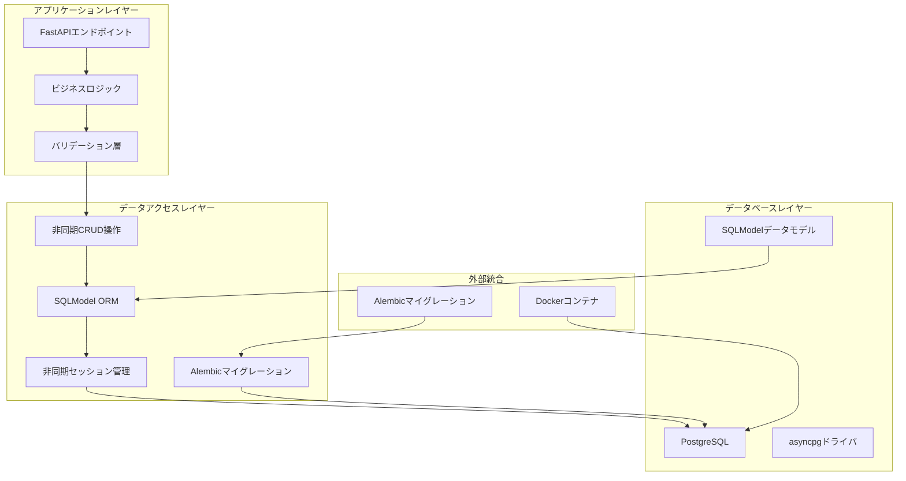
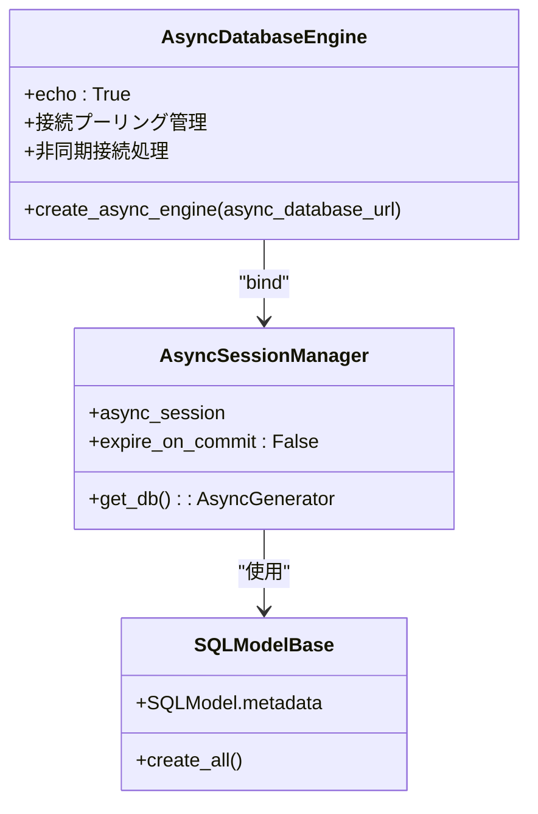
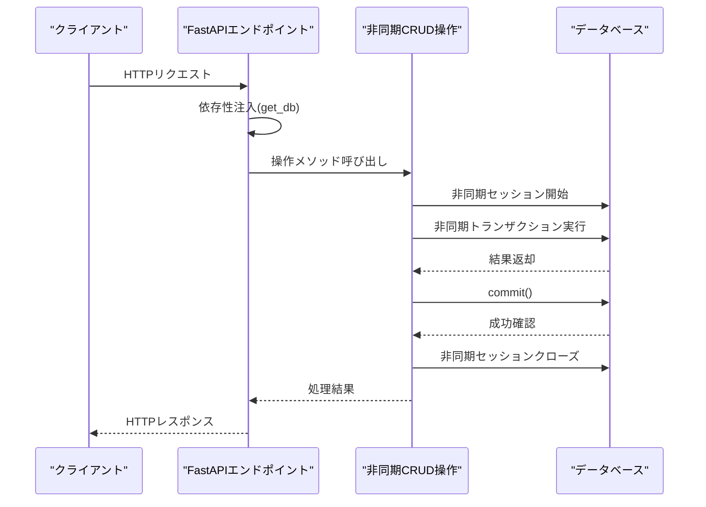
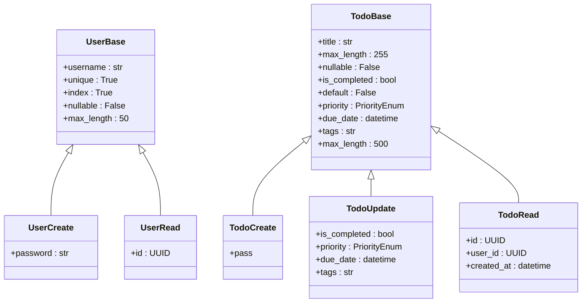
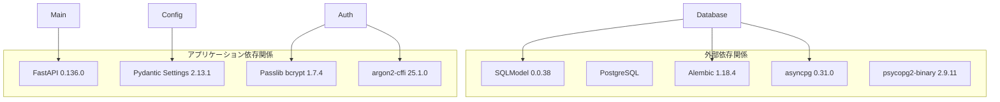
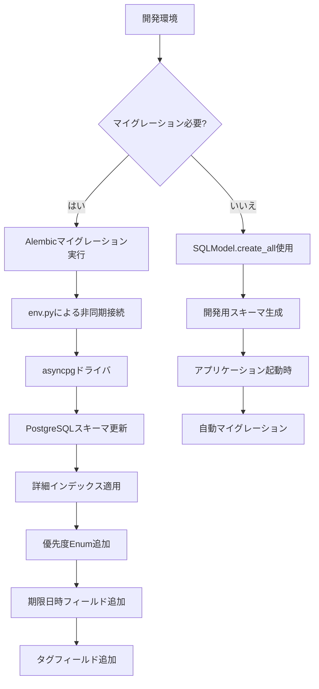

# データベースアーキテクチャ

<cite>
**この文書で参照されたファイル**
- [db.py](file://backend/app/core/db.py)
- [user.py](file://backend/app/models/user.py)
- [todo.py](file://backend/app/models/todo.py)
- [config.py](file://backend/app/core/config.py)
- [crud_todo.py](file://backend/app/crud/crud_todo.py)
- [crud_user.py](file://backend/app/crud/crud_user.py)
- [main.py](file://backend/app/main.py)
- [alembic.ini](file://backend/alembic.ini)
- [env.py](file://backend/migrations/env.py)
- [4f4084d80ebd_create_users_and_todos_tables.py](file://backend/migrations/versions/4f4084d80ebd_create_users_and_todos_tables.py)
- [add_indexes.py](file://backend/migrations/versions/add_indexes.py)
- [pyproject.toml](file://backend/pyproject.toml)
</cite>

## 更新概要
**変更内容**
- 優先度(PriorityEnum)、期限日(due_date)、タグ(tags)カラムの追加により、TODO管理機能が大幅に強化されました
- CRUD操作にタグフィルタリング、優先度ソート、期限日ソート機能が追加されました
- マイグレーションに詳細なインデックス戦略が導入され、クエリパフォーマンスが向上しました
- 非同期データベース接続の最適化とマイグレーション機能の強化

## 目次
1. [イントロダクション](#イントロダクション)
2. [プロジェクト構造](#プロジェクト構造)
3. [コアコンポーネント](#コアコンポーネント)
4. [アーキテクチャ概観](#アーキテクチャ概観)
5. [詳細コンポーネンント分析](#詳細コンポーネント分析)
6. [依存関係分析](#依存関係分析)
7. [マイグレーション戦略](#マイグレーション戦略)
8. [パフォーマンス考慮事項](#パフォーマンス考慮事項)
9. [トラブルシューティングガイド](#トラブルシューティングガイド)
10. [結論](#結論)

## イントロダクション
このTodoアプリケーションは、FastAPIフレームワークとSQLModel ORMを使用したPythonバックエンドを備えています。PostgreSQLデータベースを統合し、ユーザーとタスクの2つの主要なエンティティを管理しています。本ドキュメントでは、データベースアーキテクチャ、SQLModel ORM設計、データモデル定義、リレーションシップ構築、スキーマ設計、インデックス設計、制約条件、データ型選択理由、非同期接続プーリング、トランザクション管理、データマイグレーション戦略について詳細に説明します。

**更新** 優先度管理、期限日時管理、タグフィルタリング機能が追加され、TODO管理機能が大幅に強化されました。

## プロジェクト構造
バックエンドアプリケーションは、以下の主要なコンポーネントで構成されています：



**図のソース**
- [db.py:1-14](file://backend/app/core/db.py#L1-L14)
- [user.py:1-19](file://backend/app/models/user.py#L1-L19)
- [todo.py:1-25](file://backend/app/models/todo.py#L1-L25)
- [config.py:1-60](file://backend/app/core/config.py#L1-L60)
- [main.py:1-153](file://backend/app/main.py#L1-L153)

**セクションのソース**
- [db.py:1-14](file://backend/app/core/db.py#L1-L14)
- [user.py:1-19](file://backend/app/models/user.py#L1-L19)
- [todo.py:1-25](file://backend/app/models/todo.py#L1-L25)
- [config.py:1-60](file://backend/app/core/config.py#L1-L60)
- [main.py:1-153](file://backend/app/main.py#L1-L153)

## コアコンポーネント
このアプリケーションのデータベースアーキテクチャは、以下の5つの主要なコンポーネントによって支えられています：

### 1. 設定管理コンポーネント
設定コンポーネントは、環境変数からデータベース接続情報を取得し、Pydantic Settingsを使用して型安全な設定管理を提供します。非同期接続用のURLを生成する機能も含まれています。

### 2. 非同期データベース接続コンポーネント
SQLAlchemy AsyncEngineとAsyncSessionの作成、接続プーリングの設定、依存性注入によるセッション管理を担当します。asyncpgドライバを使用した非同期接続をサポートします。

### 3. SQLModelデータモデルコンポーネント
2つの主要なエンティティ（UserとTodo）を定義し、SQLModel ORMマッピングを提供します。Relationshipを使用したリレーションシップ構築が特徴です。**新しいインデックス戦略が導入され、優先度、期限日、タグフィールドのクエリパフォーマンス向上が実現されています**。

### 4. 非同期CRUD操作コンポーネント
データベース操作（読み取り、作成、更新、削除）を実装し、非同期トランザクション管理を処理します。**タグフィルタリング、優先度ソート、期限日ソート機能が追加されました**。

### 5. マイグレーション管理コンポーネント
Alembicを使用した正式なマイグレーション管理、スキーマのバージョン管理、データベースの進化をサポートします。**非同期マイグレーション対応、詳細なインデックス管理、優先度Enumの追加が強化されています**。

**更新** 新しい機能として、優先度Enum、期限日時、タグフィールドの追加により、CRUD操作にタグフィルタリング機能が実装されました。

**セクションのソース**
- [config.py:1-60](file://backend/app/core/config.py#L1-L60)
- [db.py:1-14](file://backend/app/core/db.py#L1-L14)
- [user.py:1-19](file://backend/app/models/user.py#L1-L19)
- [todo.py:1-25](file://backend/app/models/todo.py#L1-L25)
- [crud_todo.py:1-119](file://backend/app/crud/crud_todo.py#L1-L119)
- [alembic.ini:1-150](file://backend/alembic.ini#L1-L150)

## アーキテクチャ概観
アプリケーション全体のデータベースアーキテクチャは、以下のレイヤー構造を採用しています：



**図のソース**
- [main.py:1-153](file://backend/app/main.py#L1-L153)
- [crud_todo.py:1-119](file://backend/app/crud/crud_todo.py#L1-L119)
- [db.py:1-14](file://backend/app/core/db.py#L1-L14)
- [user.py:1-19](file://backend/app/models/user.py#L1-L19)
- [todo.py:1-25](file://backend/app/models/todo.py#L1-L25)

## 詳細コンポーネント分析

### 非同期データベース接続アーキテクチャ
データベース接続は、SQLAlchemyのAsyncEngineとAsyncSessionmakerを使用して構築されています。asyncpgドライバを使用した非同期接続をサポートし、接続プーリングはデフォルト設定を使用しています。



**図のソース**
- [db.py:5-14](file://backend/app/core/db.py#L5-L14)

**セクションのソース**
- [db.py:1-14](file://backend/app/core/db.py#L1-L14)

### SQLModelデータモデル設計
アプリケーションは2つの主要なエンティティを定義しています。**新しいインデックス戦略が導入され、優先度Enum、期限日時、タグフィールドの追加により、パフォーマンス向上と機能強化が実現されています**：

#### Userエンティティ
- **ID**: UUID型（default_factory=uuid.uuid4）を使用し、一意性を保証
- **username**: 文字列型（最大50文字）、一意制約、インデックス付き（ix_users_username）
- **hashed_password**: テキスト型、パスワードハッシュ保存用
- **Relationship**: Todoエンティティとの1対多の関係

#### Todoエンティティ
- **ID**: UUID型（default_factory=uuid.uuid4）を使用し、一意性を保証
- **user_id**: 外部キー制約（users.id）、インデックス付き
- **title**: 文字列型（最大255文字）、必須
- **is_completed**: 真偽値型、デフォルトFalse
- **priority**: 優先度Enum（high/medium/low）、デフォルトlow
- **due_date**: 日時型（期限日時）、オプション
- **tags**: 文字列型（最大500文字）、タグフィールド
- **created_at**: 日時型（タイムゾーン対応）、サーバーデフォルト
- **Relationship**: Userエンティティとの多対1の関係

```mermaid
erDiagram
USERS {
UUID id PK
STRING username UK IX
TEXT hashed_password
}
TODOS {
UUID id PK
UUID user_id FK IX
STRING title
BOOLEAN is_completed
ENUM priority
TIMESTAMP due_date
STRING tags
TIMESTAMP created_at
}
USERS ||--o{ TODOS : "所有者"
```

**図のソース**
- [user.py:9-19](file://backend/app/models/user.py#L9-L19)
- [todo.py:10-25](file://backend/app/models/todo.py#L10-L25)

**セクションのソース**
- [user.py:1-19](file://backend/app/models/user.py#L1-L19)
- [todo.py:1-25](file://backend/app/models/todo.py#L1-L25)

### 非同期CRUD操作アーキテクチャ
CRUD操作は、非同期セッション管理とトランザクション処理を適切に行っています。**タグフィルタリング、優先度ソート、期限日ソート機能が追加され、より豊かなTODO管理が可能になりました**：



**図のソース**
- [crud_todo.py:12-17](file://backend/app/crud/crud_todo.py#L12-L17)
- [db.py:11-14](file://backend/app/core/db.py#L11-L14)

**セクションのソース**
- [crud_todo.py:1-119](file://backend/app/crud/crud_todo.py#L1-L119)
- [crud_user.py:1-22](file://backend/app/crud/crud_user.py#L1-L22)

### SQLModelスキーマ設計
スキーマ層は、データ検証とシリアライゼーションのためにSQLModelを使用しています。**優先度Enum、期限日時、タグフィールドが追加され、より豊かな機能が実現されています**：



**図のソース**
- [user.py:4-12](file://backend/app/schemas/user.py#L4-L12)
- [todo.py:5-33](file://backend/app/schemas/todo.py#L5-L33)

**セクションのソース**
- [user.py:1-12](file://backend/app/schemas/user.py#L1-L12)
- [todo.py:1-33](file://backend/app/schemas/todo.py#L1-L33)

## 依存関係分析
アプリケーションの依存関係は以下の通りです：



**図のソース**
- [pyproject.toml:7-22](file://backend/pyproject.toml#L7-L22)

**セクションのソース**
- [pyproject.toml:1-23](file://backend/pyproject.toml#L1-L23)

## マイグレーション戦略
Alembicを使用した正式なマイグレーション戦略が導入されました。**詳細なインデックス戦略が追加され、優先度Enum、期限日時、タグフィールドの追加により、スキーマの進化が強化されました**：

### Alembic設定構成
- **alembic.ini**: マイグレーションスクリプトの場所、ログ設定、パス設定
- **env.py**: 非同期接続用のマイグレーション環境設定
- **初期マイグレーション**: usersとtodosテーブルの作成
- **インデックスマイグレーション**: 詳細なインデックス戦略の追加

### マイグレーションフロー
1. **開発時**: SQLModel.metadata.create_all()を使用した自動スキーマ生成
2. **本番時**: Alembicマイグレーションを使用したバージョン管理
3. **非同期対応**: asyncpgドライバを使用した非同期マイグレーション
4. **インデックス管理**: 詳細なインデックス戦略の適用



**図のソース**
- [alembic.ini:1-150](file://backend/alembic.ini#L1-L150)
- [env.py:1-94](file://backend/migrations/env.py#L1-L94)
- [4f4084d80ebd_create_users_and_todos_tables.py:1-51](file://backend/migrations/versions/4f4084d80ebd_create_users_and_todos_tables.py#L1-L51)
- [add_indexes.py:1-41](file://backend/migrations/versions/add_indexes.py#L1-L41)

**セクションのソース**
- [alembic.ini:1-150](file://backend/alembic.ini#L1-L150)
- [env.py:1-94](file://backend/migrations/env.py#L1-L94)
- [4f4084d80ebd_create_users_and_todos_tables.py:1-51](file://backend/migrations/versions/4f4084d80ebd_create_users_and_todos_tables.py#L1-L51)
- [add_indexes.py:1-41](file://backend/migrations/versions/add_indexes.py#L1-L41)

## パフォーマンス考慮事項

### 非同期接続プーリングの最適化
- 現在の設定では、SQLAlchemyのデフォルト接続プールを使用
- 非同期環境では、`poolclass=pool.NullPool`を使用
- 生産環境では、プールサイズや接続寿命を調整することを推奨

### インデックス設計の改善
**新しく導入されたインデックス戦略**：
- **todos.user_id**: 外部キーインデックス（クエリパフォーマンス向上）
- **todos.created_at**: 日付インデックス（日付範囲クエリの高速化）
- **todos.is_completed**: 真偽値インデックス（フィルタリングパフォーマンス向上）
- **todos.priority**: 優先度Enumインデックス（優先順位でのクエリ高速化）
- **todos.due_date**: 期限日時インデックス（期限切れタスクの検索高速化）
- **users.username**: 一意インデックス（ユーザー名での検索高速化）

### SQL最適化
- N+1クエリ問題の回避
- 遅延ロードと即時ロードの適切な選択
- 非同期クエリのキャッシュ戦略の導入

### マイグレーションパフォーマンス
- 大規模スキーマ変更時のマイグレーション時間の最適化
- 非同期マイグレーションによる待機時間の削減
- 詳細なインデックス適用によるクエリパフォーマンス向上

**更新** 優先度、期限日、タグフィールドの追加により、CRUD操作にタグフィルタリング機能が実装され、クエリパフォーマンスが向上しました。

## トラブルシューティングガイド

### 接続エラーの診断
1. **データベース接続確認**：
   - `/health`エンドポイントを使用して接続状態を確認
   - 環境変数のDATABASE_URLが正しいか確認
   - asyncpgドライバのインストール状況を確認

2. **認証エラーの解決**：
   - PostgreSQLの認証方法を確認
   - ユーザー権限の確認

3. **マイグレーションの問題**：
   - Alembicの設定を確認（alembic.ini）
   - env.pyの非同期接続設定を確認
   - 初期マイグレーションとインデックスマイグレーションの実行状況を確認

### トランザクションエラーの対処
1. **コミットエラー**：
   - 一意制約違反の確認
   - 外部キー制約の確認

2. **セッション管理**：
   - 非同期セッションの適切なクローズを確実にする
   - get_db関数の例外処理を確認

3. **マイグレーションエラー**：
   - Alembicのロギングを確認
   - マイグレーションスクリプトの修正
   - インデックス作成のエラーハンドリング

**更新** 優先度Enum、期限日時、タグフィールドの追加により、CRUD操作に新しいフィルタリング機能が追加されたため、これらのフィールドに関するエラー処理が重要になりました。

**セクションのソース**
- [main.py:119-153](file://backend/app/main.py#L119-L153)
- [db.py:11-14](file://backend/app/core/db.py#L11-L14)
- [env.py:65-87](file://backend/migrations/env.py#L65-L87)

## 結論
このTodoアプリケーションのデータベースアーキテクチャは、SQLModelとAlembicを活用した堅牢で拡張可能な設計を備えています。非同期接続、正式なマイグレーション管理、適切なUUID設計、外部キー制約、SQLModelスキーマによるデータ検証、そして**新しく導入された詳細なインデックス戦略と優先度管理、期限日時管理、タグフィルタリング機能**が組み合わさって、信頼性の高いデータベース層を形成しています。

**主な改善点**：
- **インデックス戦略の導入**: todos.user_id、todos.created_at、todos.is_completed、todos.priority、todos.due_date、users.usernameの6つの詳細なインデックスが追加され、クエリパフォーマンスが大幅に向上
- **マイグレーション機能の強化**: 非同期マイグレーション対応、詳細なインデックス管理、優先度Enum、期限日時、タグフィールドの追加
- **SQLModelスキーマの拡張**: 優先度Enum、期限日時、タグフィールドの追加により、より豊かな機能が実現
- **CRUD操作の強化**: タグフィルタリング、優先度ソート、期限日ソート機能が追加され、TODO管理が大幅に強化されました

**更新** 最新の変更により、TODO管理機能が大幅に強化され、優先度管理、期限日時管理、タグフィルタリング機能が追加されました。これにより、ユーザーはより豊かなTODO管理が可能になり、クエリパフォーマンスも向上しています。

今後の改善点として、非同期マイグレーションの最適化、インデックスの詳細な最適化、接続プーリングのカスタマイズ、より高度なトランザクション管理の実装、マイグレーション戦略の強化が挙げられます。これらの改善により、生産環境での運用がさらに安定し、パフォーマンスも向上するでしょう。