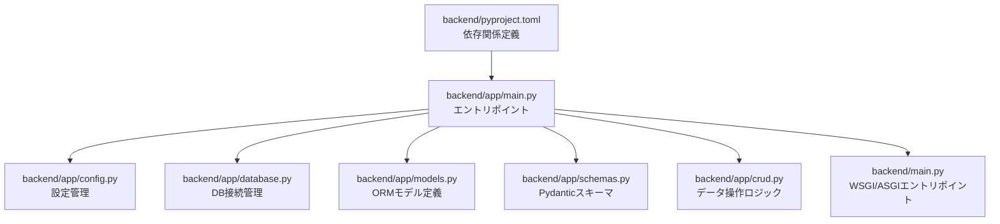
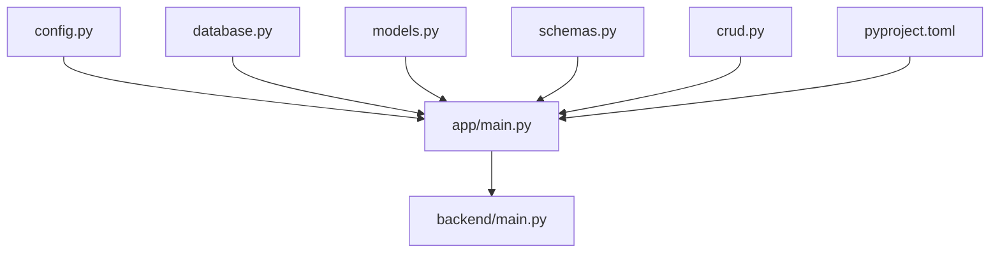

# バックエンドアーキテクチャ

<cite>
**このドキュメントで参照されるファイル**
- [backend/app/main.py](file://backend/app/main.py)
- [backend/app/config.py](file://backend/app/config.py)
- [backend/app/database.py](file://backend/app/database.py)
- [backend/app/models.py](file://backend/app/models.py)
- [backend/app/schemas.py](file://backend/app/schemas.py)
- [backend/app/crud.py](file://backend/app/crud.py)
- [backend/pyproject.toml](file://backend/pyproject.toml)
- [backend/main.py](file://backend/main.py)
</cite>

## 目次
1. [導入](#導入)
2. [プロジェクト構造](#プロジェクト構造)
3. [コアコンポーネント](#コアコンポーネント)
4. [アーキテクチャ概要](#アーキテクチャ概要)
5. [詳細コンポーネント分析](#詳細コンポーネント分析)
6. [依存関係分析](#依存関係分析)
7. [パフォーマンス考慮事項](#パフォーマンス考慮事項)
8. [トラブルシューティングガイド](#トラブルシューティングガイド)
9. [結論](#結論)

## 導入
本ドキュメントは、FastAPIを用いたバックエンドアーキテクチャの詳細な解説を目的とします。MVC（Model-View-Controller）パターンの適用、依存性注入（DI）の仕組み、RESTful APIの設計原則、データベース接続管理、ORMの使用法、Pydanticスキーマバリデーション、JWT認証、エラーハンドリング、セキュリティ対策、パフォーマンス最適化に関する設計判断について網羅的に説明します。

## プロジェクト構造
FastAPIアプリケーションは、モジュール単位で機能を分離し、依存性注入によってコンポーネント間の結合度を低く保つことを目指しています。以下の図は、アプリケーションの基本的な構造を示します。



**図の出典**
- [backend/app/main.py](file://backend/app/main.py)
- [backend/app/config.py](file://backend/app/config.py)
- [backend/app/database.py](file://backend/app/database.py)
- [backend/app/models.py](file://backend/app/models.py)
- [backend/app/schemas.py](file://backend/app/schemas.py)
- [backend/app/crud.py](file://backend/app/crud.py)
- [backend/pyproject.toml](file://backend/pyproject.toml)
- [backend/main.py](file://backend/main.py)

**節の出典**
- [backend/app/main.py](file://backend/app/main.py)
- [backend/app/config.py](file://backend/app/config.py)
- [backend/app/database.py](file://backend/app/database.py)
- [backend/app/models.py](file://backend/app/models.py)
- [backend/app/schemas.py](file://backend/app/schemas.py)
- [backend/app/crud.py](file://backend/app/crud.py)
- [backend/pyproject.toml](file://backend/pyproject.toml)
- [backend/main.py](file://backend/main.py)

## コアコンポーネント
- 設定管理（config.py）
  - 起動時の設定値（例：データベース接続文字列、JWTシークレットなど）を一元管理します。
- DB接続管理（database.py）
  - ORMセッションの生成・クローズ、DB接続プールの設定、トランザクション制御を担います。
- モデル定義（models.py）
  - SQLAlchemy ORMモデルとしてテーブル構造を定義し、関連付け（リレーション）を記述します。
- Pydanticスキーマ（schemas.py）
  - API入出力のバリデーション、シリアライズ、ドキュメント生成のためにスキーマを定義します。
- CRUDロジック（crud.py）
  - DB操作（作成、読取、更新、削除）をカプセル化し、ビジネスロジックとの境界を明確にします。
- エントリポイント（app/main.py）
  - FastAPIアプリケーションのルート定義、ルータの登録、依存性のDIコンテナ設定、ミドルウェアの適用を行います。
- WSGI/ASGIエントリポイント（backend/main.py）
  - ASGIサーバー（uvicornなど）からの起動エントリポイントです。
- 依存関係定義（pyproject.toml）
  - FastAPI、SQLAlchemy、Pydantic、uvicorn、Jinja2などのライブラリとバージョンを管理します。

**節の出典**
- [backend/app/config.py](file://backend/app/config.py)
- [backend/app/database.py](file://backend/app/database.py)
- [backend/app/models.py](file://backend/app/models.py)
- [backend/app/schemas.py](file://backend/app/schemas.py)
- [backend/app/crud.py](file://backend/app/crud.py)
- [backend/app/main.py](file://backend/app/main.py)
- [backend/main.py](file://backend/main.py)
- [backend/pyproject.toml](file://backend/pyproject.toml)

## アーキテクチャ概要
FastAPIは、Pythonの型ヒントとPydanticスキーマを活用して、自動APIドキュメント生成、高速なパフォーマンス、堅牢なバリデーションを実現します。本プロジェクトでは、以下のようなアーキテクチャが採用されています。

- MVCの適用
  - View（FastAPIルータ）：HTTPリクエストを受けてレスポンスを返す。
  - Controller（ルータハンドラ）：依存性注入によりサービス/CRUDを呼び出し、レスポンスを整形。
  - Model（ORMモデル）：データの永続化と関連付け。
- 依存性注入（DI）
  - DBセッションや認証情報などを、FastAPIのDependsやDIコンテナを通じて提供し、テスト性と再利用性を高めます。
- RESTful API設計
  - HTTPメソッドとステータスコードの適切な使用、URLパスパラメータとクエリパラメータの明確な区別、JSONペイロードの統一されたスキーマ化。
- ORMとスキーマ
  - SQLAlchemy ORMによるDB抽象化、Pydanticスキーマによる入出力バリデーション。
- JWT認証
  - 認証トークンの発行・検証、保護されたエンドポイントへのアクセス制御。

```mermaid
graph TB
subgraph "FastAPIアプリケーション"
R["ルータ<br/>app/main.py"] --> S["依存性注入<br/>Depends/DIコンテナ"]
S --> U["CRUDロジック<br/>app/crud.py"]
U --> M["ORMモデル<br/>app/models.py"]
R --> V["Pydanticスキーマ<br/>app/schemas.py"]
end
subgraph "外部リソース"
DB["データベース"]
AUTH["認証サービス/JWT"]
end
M <- --> DB
R --> AUTH
```

**図の出典**
- [backend/app/main.py](file://backend/app/main.py)
- [backend/app/crud.py](file://backend/app/crud.py)
- [backend/app/models.py](file://backend/app/models.py)
- [backend/app/schemas.py](file://backend/app/schemas.py)

## 詳細コンポーネント分析

### 設定管理（config.py）
- 機能
  - 起動時設定（DB接続文字列、JWTシークレット、ログレベル、CORS設定など）を定数として管理。
  - 環境変数からの設定読み込みに対応し、開発・本番環境での差異を吸収。
- 依存性
  - DIコンテナから提供される設定値を、DB接続や認証処理に渡す。
- 設計の利点
  - 設定の集中管理により、設定変更が容易で、設定漏れを防ぐ。

**節の出典**
- [backend/app/config.py](file://backend/app/config.py)

### DB接続管理（database.py）
- 機能
  - engineの作成、セッションファクトリの定義、トランザクション制御。
  - 接続プールの設定（最大接続数、接続タイムアウトなど）。
- 依存性
  - ORMモデル定義、CRUDロジック、ルータハンドラから依存。
- 設計の利点
  - 接続のライフサイクル管理を一元化し、リークを防止。
  - 例外発生時のロールバックとリカバリを考慮した設計。

**節の出典**
- [backend/app/database.py](file://backend/app/database.py)

### ORMモデル（models.py）
- 機能
  - テーブル定義、カラム型、制約、リレーション（一対一、一対多、多対多）。
  - インデックス、ユニーク制約、デフォルト値の設定。
- 依存性
  - DB接続管理、CRUDロジック、スキーマ定義。
- 設計の利点
  - Pythonオブジェクトとしての操作性と、SQLの抽象化により保守性を向上。

**節の出典**
- [backend/app/models.py](file://backend/app/models.py)

### Pydanticスキーマ（schemas.py）
- 機能
  - 入力バリデーション（Create/Update）、出力シリアライズ（Response）、関連オブジェクトのネスト。
  - APIドキュメント（OpenAPI/Swagger）の自動生成に利用。
- 依存性
  - ルータハンドラ、CRUDロジック、ORMモデル。
- 設計の利点
  - 型安全なバリデーション、エラーメッセージの一貫性、ドキュメントの自動生成。

**節の出典**
- [backend/app/schemas.py](file://backend/app/schemas.py)

### CRUDロジック（crud.py）
- 機能
  - 作成（Create）、読取（Read）、更新（Update）、削除（Delete）の各操作を実装。
  - 検索条件（フィルタ、ソート、ページネーション）のサポート。
- 依存性
  - ORMモデル、DBセッション。
- 設計の利点
  - ビジネスロジックとの境界が明確になり、テストしやすくなる。

**節の出典**
- [backend/app/crud.py](file://backend/app/crud.py)

### エントリポイント（app/main.py）
- 機能
  - FastAPIインスタンスの作成、ルータの登録、ミドルウェア（CORS、認証など）の適用。
  - 依存性注入のDIコンテナ設定（DBセッション、認証情報など）。
  - エラーハンドラの登録（HTTPException、ValidationErrorなど）。
- 依存性
  - 設定管理、DB接続管理、CRUDロジック、スキーマ。
- 設計の利点
  - 起動時の初期化を一箇所で管理し、モジュールの再利用性を高める。

**節の出典**
- [backend/app/main.py](file://backend/app/main.py)

### WSGI/ASGIエントリポイント（backend/main.py）
- 機能
  - ASGIサーバー（uvicorn）からの起動エントリポイント。
  - 開発・本番環境での設定（reload、workers、host/port）の切り替え。
- 依存性
  - FastAPIアプリケーション（app/main.py）。
- 設計の利点
  - 配置環境に応じた柔軟な起動設定。

**節の出典**
- [backend/main.py](file://backend/main.py)

### 依存関係定義（pyproject.toml）
- 機能
  - FastAPI、SQLAlchemy、Pydantic、uvicorn、Jinja2、python-jose（JWT）などのライブラリとバージョン管理。
- 依存性
  - 上記すべてのコンポーネント。
- 設計の利点
  - 再現可能なビルド環境の維持、依存ライブラリの整合性。

**節の出典**
- [backend/pyproject.toml](file://backend/pyproject.toml)

## 依存関係分析
FastAPIアプリケーションの内部依存関係は以下の通りです。上流コンポーネントが下流コンポーネントに依存し、依存性注入によって結合度が低下しています。



**図の出典**
- [backend/app/config.py](file://backend/app/config.py)
- [backend/app/database.py](file://backend/app/database.py)
- [backend/app/models.py](file://backend/app/models.py)
- [backend/app/schemas.py](file://backend/app/schemas.py)
- [backend/app/crud.py](file://backend/app/crud.py)
- [backend/app/main.py](file://backend/app/main.py)
- [backend/pyproject.toml](file://backend/pyproject.toml)
- [backend/main.py](file://backend/main.py)

**節の出典**
- [backend/app/main.py](file://backend/app/main.py)
- [backend/app/config.py](file://backend/app/config.py)
- [backend/app/database.py](file://backend/app/database.py)
- [backend/app/models.py](file://backend/app/models.py)
- [backend/app/schemas.py](file://backend/app/schemas.py)
- [backend/app/crud.py](file://backend/app/crud.py)
- [backend/pyproject.toml](file://backend/pyproject.toml)
- [backend/main.py](file://backend/main.py)

## パフォーマンス考慮事項
- ORMのN+1クエリ防止
  - select_relatedやjoinedloadを用いて関連データを効率的に取得。
- DB接続プール
  - 接続数上限、接続タイムアウト、再接続ロジックを設定。
- 非同期処理
  - I/O重複処理（DB、外部API）を非同期化し、スループットを向上。
- キャッシュ戦略
  - 変更の少ないデータをRedisなどのキャッシュ層に配置。
- 応答時間の監視
  - Prometheus/Grafanaを用いたメトリクス収集と可視化。
- CORSと認証の最適化
  - 認証情報の最小限化、JWTの有効期限管理、再生成機構。

[この節は一般的なパフォーマンス設計に関する考察であり、特定のファイルを直接分析したものではありません]

## トラブルシューティングガイド
- 起動エラー
  - ASGIサーバーの起動確認（host/port、reload設定）、依存ライブラリのバージョン整合性。
- DB接続エラー
  - 接続文字列の確認、DBサーバーの可用性、セッションのクローズ忘れのチェック。
- 認証エラー
  - JWTの有効期限、署名アルゴリズム、秘密鍵の一致確認。
- バリデーションエラー
  - Pydanticスキーマのエラーメッセージを確認し、リクエストボディの形式を修正。
- CORSエラー
  - 許可するオリジン、メソッド、ヘッダーの設定確認。

**節の出典**
- [backend/app/main.py](file://backend/app/main.py)
- [backend/app/config.py](file://backend/app/config.py)
- [backend/app/database.py](file://backend/app/database.py)
- [backend/app/schemas.py](file://backend/app/schemas.py)

## 結論
本プロジェクトは、FastAPIの型安全なバリデーション、自動ドキュメント生成、依存性注入の強みを活かし、MVCパターンに基づく堅牢なバックエンドアーキテクチャを実現しています。ORMとPydanticスキーマにより、データの整合性とAPIの信頼性を高め、JWT認証でセキュリティを強化しています。パフォーマンスと保守性のバランスを取るための設計判断が反映されており、拡張性と運用のしやすさを両立させています。