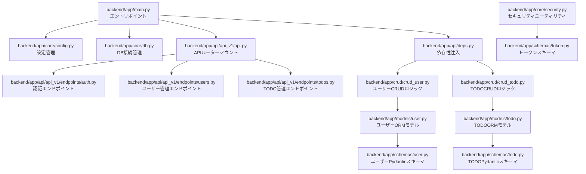
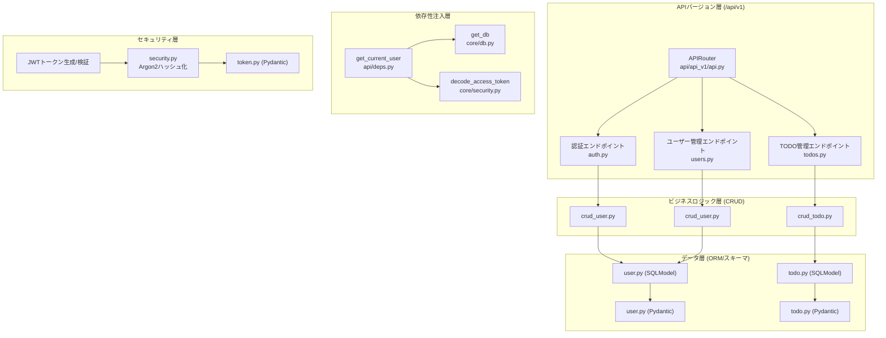
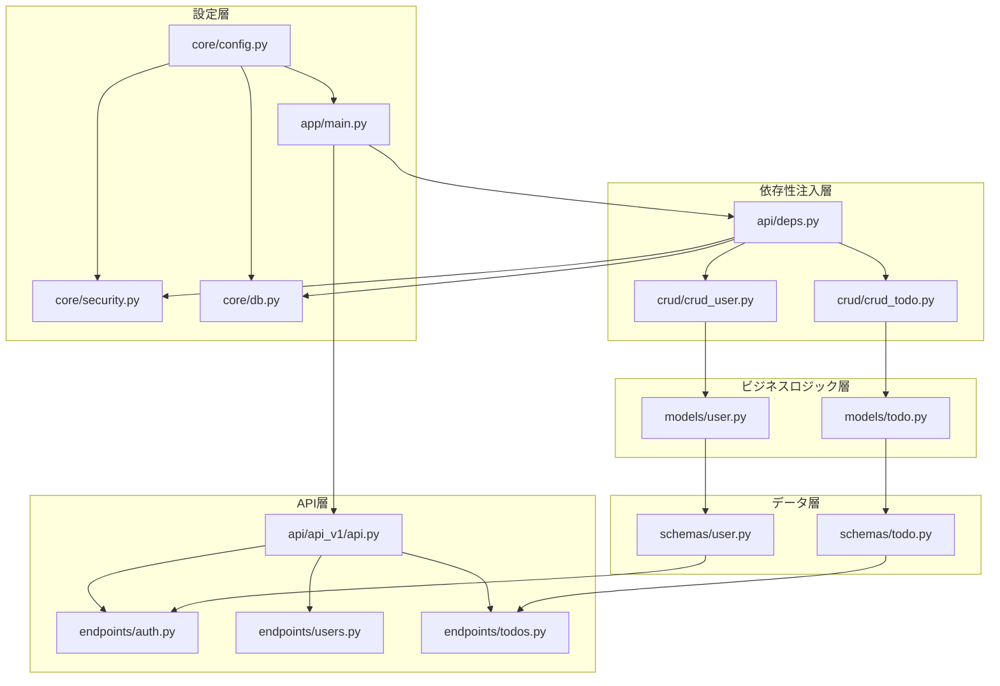

# バックエンドアーキテクチャ

<cite>
**このドキュメントで参照されるファイル**
- [backend/app/main.py](file://backend/app/main.py)
- [backend/app/api/api_v1/api.py](file://backend/app/api/api_v1/api.py)
- [backend/app/api/deps.py](file://backend/app/api/deps.py)
- [backend/app/api/api_v1/endpoints/auth.py](file://backend/app/api/api_v1/endpoints/auth.py)
- [backend/app/api/api_v1/endpoints/users.py](file://backend/app/api/api_v1/endpoints/users.py)
- [backend/app/api/api_v1/endpoints/todos.py](file://backend/app/api/api_v1/endpoints/todos.py)
- [backend/app/core/config.py](file://backend/app/core/config.py)
- [backend/app/core/db.py](file://backend/app/core/db.py)
- [backend/app/core/security.py](file://backend/app/core/security.py)
- [backend/app/crud/crud_user.py](file://backend/app/crud/crud_user.py)
- [backend/app/crud/crud_todo.py](file://backend/app/crud/crud_todo.py)
- [backend/app/models/user.py](file://backend/app/models/user.py)
- [backend/app/models/todo.py](file://backend/app/models/todo.py)
- [backend/app/schemas/user.py](file://backend/app/schemas/user.py)
- [backend/app/schemas/todo.py](file://backend/app/schemas/todo.py)
- [backend/app/schemas/token.py](file://backend/app/schemas/token.py)
</cite>

## 目次
1. [導入](#導入)
2. [プロジェクト構造](#プロジェクト構造)
3. [コアコンポーネント](#コアコンポーネント)
4. [アーキテクチャ概要](#アーキテクチャ概要)
5. [詳細コンポーネント分析](#詳細コンポーネント分析)
6. [依存関係分析](#依存関係分析)
7. [パフォーマンス考慮事項](#パフォーマンス考慮事項)
8. [トラブルシューティングガイド](#トラブルシューティングガイド)
9. [結論](#結論)

## 導入
本ドキュメントは、FastAPIを用いた刷新されたバックエンドアーキテクチャの詳細な解説を目的とします。APIバージョン管理（/api/v1）に基づくモジュール構造、MVC（Model-View-Controller）パターンの適用、依存性注入（DI）の仕組み、RESTful APIの設計原則、非同期データベース接続、SQLModel ORMの使用法、Pydanticスキーマバリデーション、JWT認証、エラーハンドリング、セキュリティ対策、パフォーマンス最適化に関する設計判断について網羅的に説明します。

## プロジェクト構造
刷新されたFastAPIアプリケーションは、APIバージョン管理とモジュール単位の機能分離を徹底し、依存性注入によってコンポーネント間の結合度を低く保つことを目指しています。以下の図は、新アーキテクチャの基本的な構造を示します。

**図の出典**
- [backend/app/main.py](file://backend/app/main.py)
- [backend/app/api/api_v1/api.py](file://backend/app/api/api_v1/api.py)
- [backend/app/api/deps.py](file://backend/app/api/deps.py)
- [backend/app/api/api_v1/endpoints/auth.py](file://backend/app/api/api_v1/endpoints/auth.py)
- [backend/app/api/api_v1/endpoints/users.py](file://backend/app/api/api_v1/endpoints/users.py)
- [backend/app/api/api_v1/endpoints/todos.py](file://backend/app/api/api_v1/endpoints/todos.py)
- [backend/app/core/config.py](file://backend/app/core/config.py)
- [backend/app/core/db.py](file://backend/app/core/db.py)
- [backend/app/core/security.py](file://backend/app/core/security.py)
- [backend/app/crud/crud_user.py](file://backend/app/crud/crud_user.py)
- [backend/app/crud/crud_todo.py](file://backend/app/crud/crud_todo.py)
- [backend/app/models/user.py](file://backend/app/models/user.py)
- [backend/app/models/todo.py](file://backend/app/models/todo.py)
- [backend/app/schemas/user.py](file://backend/app/schemas/user.py)
- [backend/app/schemas/todo.py](file://backend/app/schemas/todo.py)
- [backend/app/schemas/token.py](file://backend/app/schemas/token.py)

**節の出典**
- [backend/app/main.py](file://backend/app/main.py)
- [backend/app/api/api_v1/api.py](file://backend/app/api/api_v1/api.py)
- [backend/app/api/deps.py](file://backend/app/api/deps.py)
- [backend/app/api/api_v1/endpoints/auth.py](file://backend/app/api/api_v1/endpoints/auth.py)
- [backend/app/api/api_v1/endpoints/users.py](file://backend/app/api/api_v1/endpoints/users.py)
- [backend/app/api/api_v1/endpoints/todos.py](file://backend/app/api/api_v1/endpoints/todos.py)
- [backend/app/core/config.py](file://backend/app/core/config.py)
- [backend/app/core/db.py](file://backend/app/core/db.py)
- [backend/app/core/security.py](file://backend/app/core/security.py)
- [backend/app/crud/crud_user.py](file://backend/app/crud/crud_user.py)
- [backend/app/crud/crud_todo.py](file://backend/app/crud/crud_todo.py)
- [backend/app/models/user.py](file://backend/app/models/user.py)
- [backend/app/models/todo.py](file://backend/app/models/todo.py)
- [backend/app/schemas/user.py](file://backend/app/schemas/user.py)
- [backend/app/schemas/todo.py](file://backend/app/schemas/todo.py)
- [backend/app/schemas/token.py](file://backend/app/schemas/token.py)

## コアコンポーネント
- 設定管理（core/config.py）
  - 起動時の設定値（例：APIバージョン、データベース接続文字列、JWTシークレット、CORS設定など）を一元管理します。
  - Pydantic Settingsを使用した環境変数からの設定読み込みに対応し、開発・本番環境での差異を吸収します。
- DB接続管理（core/db.py）
  - 非同期SQLAlchemyエンジンの作成、セッションファクトリの定義、DB接続プールの設定、トランザクション制御を担います。
- セキュリティユーティリティ（core/security.py）
  - Argon2によるパスワードハッシュ化、JWTトークンの生成・検証、パスワード検証機能を提供します。
- CRUDロジック（crud/）
  - DB操作（作成、読取、更新、削除）をカプセル化し、ビジネスロジックとの境界を明確にします。
  - 非同期処理に対応したCRUD操作を実装します。
- ORMモデル（models/）
  - SQLModel ORMモデルとしてテーブル構造を定義し、関連付け（リレーション）を記述します。
  - UUID主キーとタイムスタンプフィールドを標準化します。
- Pydanticスキーマ（schemas/）
  - API入出力のバリデーション、シリアライズ、ドキュメント生成のためにスキーマを定義します。
  - CRUD操作に特化したスキーマ（Create/Update/Read）を分離して管理します。
- APIエンドポイント（api/api_v1/endpoints/）
  - FastAPIルーターハンドラとしてHTTPリクエストを受けてレスポンスを返します。
  - JWT Bearer認証を適用した保護されたエンドポイントを提供します。
- 依存性注入（api/deps.py）
  - DBセッションや認証情報などを、FastAPIのDependsを通じて提供し、テスト性と再利用性を高めます。
- エントリポイント（app/main.py）
  - FastAPIアプリケーションのルート定義、ルータの登録、依存性のDIコンテナ設定、ミドルウェアの適用を行います。
  - Scalar API Referenceを統合したカスタムドキュメントインターフェースを提供します。

**節の出典**
- [backend/app/core/config.py](file://backend/app/core/config.py)
- [backend/app/core/db.py](file://backend/app/core/db.py)
- [backend/app/core/security.py](file://backend/app/core/security.py)
- [backend/app/crud/crud_user.py](file://backend/app/crud/crud_user.py)
- [backend/app/crud/crud_todo.py](file://backend/app/crud/crud_todo.py)
- [backend/app/models/user.py](file://backend/app/models/user.py)
- [backend/app/models/todo.py](file://backend/app/models/todo.py)
- [backend/app/schemas/user.py](file://backend/app/schemas/user.py)
- [backend/app/schemas/todo.py](file://backend/app/schemas/todo.py)
- [backend/app/schemas/token.py](file://backend/app/schemas/token.py)
- [backend/app/api/api_v1/endpoints/auth.py](file://backend/app/api/api_v1/endpoints/auth.py)
- [backend/app/api/api_v1/endpoints/users.py](file://backend/app/api/api_v1/endpoints/users.py)
- [backend/app/api/api_v1/endpoints/todos.py](file://backend/app/api/api_v1/endpoints/todos.py)
- [backend/app/api/deps.py](file://backend/app/api/deps.py)
- [backend/app/main.py](file://backend/app/main.py)

## アーキテクチャ概要
刷新されたFastAPIアーキテクチャは、APIバージョン管理（/api/v1）を基盤とした階層的なモジュール構造を採用し、以下のような設計原則を実現しています。

- APIバージョン管理
  - /api/v1配下に認証、ユーザー、TODOの各機能モジュールを配置し、APIの進化をバージョン単位で管理します。
  - APIRouterを介したモジュール化により、機能ごとの独立性を高めます。
- MVCの適用
  - View（FastAPIルータ）：HTTPリクエストを受けてレスポンスを返す。
  - Controller（ルータハンドラ）：依存性注入によりCRUDを呼び出し、レスポンスを整形。
  - Model（SQLModel ORM）：データの永続化と関連付け。
- 依存性注入（DI）
  - DBセッションや認証情報などを、FastAPIのDependsを通じて提供し、テスト性と再利用性を高めます。
  - get_current_user依存関数を介したJWT認証フローを統一的に管理します。
- RESTful API設計
  - HTTPメソッドとステータスコードの適切な使用、URLパスパラメータとクエリパラメータの明確な区別、JSONペイロードの統一されたスキーマ化。
  - 各エンドポイントにタグ（auth、users、todos、health）を付与し、APIドキュメントの階層化を実現します。
- ORMとスキーマ
  - SQLModelによるDB抽象化、非同期対応、Pydanticスキーマによる入出力バリデーション。
- JWT認証
  - 認証トークンの発行・検証、保護されたエンドポイントへのアクセス制御、Scalar API Referenceによる統合ドキュメント。

**図の出典**
- [backend/app/api/api_v1/api.py](file://backend/app/api/api_v1/api.py)
- [backend/app/api/deps.py](file://backend/app/api/deps.py)
- [backend/app/core/db.py](file://backend/app/core/db.py)
- [backend/app/core/security.py](file://backend/app/core/security.py)
- [backend/app/crud/crud_user.py](file://backend/app/crud/crud_user.py)
- [backend/app/crud/crud_todo.py](file://backend/app/crud/crud_todo.py)
- [backend/app/models/user.py](file://backend/app/models/user.py)
- [backend/app/models/todo.py](file://backend/app/models/todo.py)
- [backend/app/schemas/user.py](file://backend/app/schemas/user.py)
- [backend/app/schemas/todo.py](file://backend/app/schemas/todo.py)
- [backend/app/schemas/token.py](file://backend/app/schemas/token.py)

## 詳細コンポーネント分析

### 設定管理（core/config.py）
- 機能
  - APIバージョン（API_V1_STR）、プロジェクト情報（PROJECT_NAME、VERSION、DESCRIPTION）の管理。
  - 環境変数からのデータベース接続文字列（DATABASE_URL、POSTGRES_*）の読み込み。
  - JWT設定（SECRET_KEY、ALGORITHM、ACCESS_TOKEN_EXPIRE_MINUTES）の管理。
  - CORSオリジン設定（BACKEND_CORS_ORIGINS）の管理。
  - 非同期データベースURL（async_database_url）の動的生成。
- 依存性
  - DB接続管理、セキュリティユーティリティ、エントリポイントから依存。
- 設計の利点
  - Pydantic Settingsによる型安全な設定管理。
  - 環境変数ベースの柔軟な設定変更。
  - 設定の集中管理により、設定漏れを防ぐ。

**節の出典**
- [backend/app/core/config.py](file://backend/app/core/config.py)

### DB接続管理（core/db.py）
- 機能
  - 非同期SQLAlchemyエンジンの作成（create_async_engine）。
  - AsyncSessionを使ったセッションファクトリの定義。
  - トランザクション制御（expire_on_commit=False）。
  - get_db依存関数によるDBセッション供給。
- 依存性
  - CRUDロジック、依存性注入、エントリポイントから依存。
- 設計の利点
  - 非同期処理によるパフォーマンス向上。
  - 例外発生時のロールバックとリカバリを考慮した設計。
  - セッションライフサイクル管理を一元化。

**節の出典**
- [backend/app/core/db.py](file://backend/app/core/db.py)

### セキュリティユーティリティ（core/security.py）
- 機能
  - Argon2によるパスワードハッシュ化（verify_password、get_password_hash）。
  - JWTトークン生成（create_access_token）と期限設定。
  - JWTトークン検証（decode_access_token）とエラーハンドリング。
- 依存性
  - 認証エンドポイント、依存性注入、スキーマから依存。
- 設計の利点
  - 最新の暗号アルゴリズム（Argon2）を使用したセキュアなパスワードハッシュ化。
  - JWTの標準的な署名アルゴリズム（HS256）の使用。
  - トークンの有効期限管理によるセキュリティ強化。

**節の出典**
- [backend/app/core/security.py](file://backend/app/core/security.py)

### CRUDロジック（crud/）
#### ユーザーCRUD（crud/crud_user.py）
- 機能
  - ユーザー検索（get_user_by_username）。
  - ユーザー作成（create_user）とパスワードハッシュ化。
  - 非同期処理に対応したCRUD操作。
- 依存性
  - ORMモデル（User）、スキーマ（UserCreate）、セキュリティユーティリティ。
- 設計の利点
  - パスワードの暗号化をCRUD層で処理。
  - 非同期DB操作によるスループット向上。

#### TODO CRUD（crud/crud_todo.py）
- 機能
  - TODO一覧取得（get_todos）とユーザーIDによるフィルタリング。
  - TODO作成（create_todo）とユーザーIDの自動設定。
  - TODO更新（update_todo）と削除（delete_todo）。
  - 所有者確認付きのCRUD操作。
- 依存性
  - ORMモデル（Todo）、スキーマ（TodoCreate/TodoUpdate）、セキュリティ。
- 設計の利点
  - 所有者確認によるセキュリティ強化。
  - SQLModelのmodel_validateによるデータ整合性確保。

**節の出典**
- [backend/app/crud/crud_user.py](file://backend/app/crud/crud_user.py)
- [backend/app/crud/crud_todo.py](file://backend/app/crud/crud_todo.py)

### ORMモデル（models/）
#### ユーザーモデル（models/user.py）
- 機能
  - UUID主キー（id）、ユニークなusername、ハッシュ化されたパスワード（hashed_password）。
  - Todoとの一対多リレーション（todos）。
  - SQLModelベースのテーブル定義。
- 依存性
  - スキーマ（UserBase）、リレーション先（Todo）。
- 設計の利点
  - UUIDによるグローバルユニークな識別子。
  - 明確なリレーション定義によるデータ整合性。

#### TODOモデル（models/todo.py）
- 機能
  - UUID主キー（id）、ユーザーID（user_id）による所有者管理。
  - タイトル（title）、完了状態（is_completed）、作成日時（created_at）。
  - Userとの多対一リレーション（user）。
- 依存性
  - スキーマ（TodoBase）、リレーション先（User）。
- 設計の利点
  - 所有者確認によるセキュリティ強化。
  - タイムスタンプによるデータの時系列管理。

**節の出典**
- [backend/app/models/user.py](file://backend/app/models/user.py)
- [backend/app/models/todo.py](file://backend/app/models/todo.py)

### Pydanticスキーマ（schemas/）
#### ユーザースキーマ（schemas/user.py）
- 機能
  - UserBase：共通フィールド（username）の定義。
  - UserCreate：登録用スキーマ（passwordを含む）。
  - UserRead：API出力用スキーマ（idを含む）。
- 依存性
  - ORMモデル、CRUDロジック。
- 設計の利点
  - CRUD操作に特化したスキーマ分離。
  - 入出力スキーマの明確な区別。

#### TODOスキーマ（schemas/todo.py）
- 機能
  - TodoBase：共通フィールド（title、is_completed）の定義。
  - TodoCreate：作成用スキーマ。
  - TodoUpdate：更新用スキーマ。
  - TodoRead：API出力用スキーマ（id、user_id、created_atを含む）。
- 依存性
  - ORMモデル、CRUDロジック。
- 設計の利点
  - 更新系スキーマの最小限化。
  - 出力スキーマでの全フィールド提供。

#### トークンスキーマ（schemas/token.py）
- 機能
  - Token：アクセストークンのレスポンススキーマ。
  - TokenData：JWTペイロードのスキーマ。
- 依存性
  - セキュリティユーティリティ、認証エンドポイント。
- 設計の利点
  - トークン関連のスキーマの集中管理。
  - JWTペイロードの明確な定義。

**節の出典**
- [backend/app/schemas/user.py](file://backend/app/schemas/user.py)
- [backend/app/schemas/todo.py](file://backend/app/schemas/todo.py)
- [backend/app/schemas/token.py](file://backend/app/schemas/token.py)

### APIエンドポイント（api/api_v1/endpoints/）
#### 認証エンドポイント（auth.py）
- 機能
  - ユーザー登録（/api/v1/auth/register）：ユニーク性チェックとパスワードハッシュ化。
  - トークン取得（/api/v1/auth/token）：OAuth2PasswordRequestFormによる認証。
  - JWTアクセストークンの発行。
- 依存性
  - CRUD（crud_user）、セキュリティ（security）、スキーマ（UserCreate、Token）。
- 設計の利点
  - OAuth2標準準拠の認証フロー。
  - トークン発行時の有効期限管理。

#### ユーザー管理エンドポイント（users.py）
- 機能
  - 現在のユーザー情報取得（/api/v1/users/me）：JWT認証必須。
  - 保護されたエンドポイントとしての設計。
- 依存性
  - 依存性注入（get_current_user）、スキーマ（UserRead）。
- 設計の利点
  - JWT認証によるセキュアなユーザー情報取得。
  - 認証済みユーザーの情報を直接提供。

#### TODO管理エンドポイント（todos.py）
- 機能
  - TODO一覧取得（/api/v1/todos/）：所有者によるフィルタリング。
  - TODO作成（/api/v1/todos/）：自動ユーザーID設定。
  - TODO更新（/api/v1/todos/{id}）：所有者確認付き更新。
  - TODO削除（/api/v1/todos/{id}）：所有者確認付き削除。
- 依存性
  - CRUD（crud_todo）、依存性注入（get_current_user）、スキーマ（TodoCreate、TodoUpdate、TodoRead）。
- 設計の利点
  - 所有者確認によるセキュリティ強化。
  - CRUD操作のRESTfulな設計。

**節の出典**
- [backend/app/api/api_v1/endpoints/auth.py](file://backend/app/api/api_v1/endpoints/auth.py)
- [backend/app/api/api_v1/endpoints/users.py](file://backend/app/api/api_v1/endpoints/users.py)
- [backend/app/api/api_v1/endpoints/todos.py](file://backend/app/api/api_v1/endpoints/todos.py)

### 依存性注入（api/deps.py）
- 機能
  - OAuth2PasswordBearerによるトークン認証。
  - get_current_user依存関数：JWTトークンの検証とユーザー取得。
  - DBセッションの提供。
- 依存性
  - セキュリティユーティリティ、CRUD、モデル、エントリポイント。
- 設計の利点
  - 認証フローの統一化。
  - 依存性の明確な定義によるテスト容易性。

**節の出典**
- [backend/app/api/deps.py](file://backend/app/api/deps.py)

### エントリポイント（app/main.py）
- 機能
  - FastAPIインスタンスの作成（タイトル、バージョン、説明）。
  - APIバージョンルータ（/api/v1）の登録。
  - CORSミドルウェアの適用。
  - Scalar API Referenceによる統合ドキュメント。
  - 依存性注入の設定（lifespan、get_db）。
  - ヘルスチェックエンドポイント（/health）。
- 依存性
  - 設定管理、DB接続管理、APIルータ。
- 設計の利点
  - APIバージョン管理による拡張性。
  - Scalarドキュメントによる開発体験の向上。
  - ヘルスチェックによる運用監視の強化。

**節の出典**
- [backend/app/main.py](file://backend/app/main.py)

## 依存関係分析
刷新されたFastAPIアプリケーションの内部依存関係は以下の通りです。上流コンポーネントが下流コンポーネントに依存し、APIバージョン管理と依存性注入によって結合度が低下しています。

**図の出典**
- [backend/app/main.py](file://backend/app/main.py)
- [backend/app/api/api_v1/api.py](file://backend/app/api/api_v1/api.py)
- [backend/app/api/deps.py](file://backend/app/api/deps.py)
- [backend/app/core/config.py](file://backend/app/core/config.py)
- [backend/app/core/db.py](file://backend/app/core/db.py)
- [backend/app/core/security.py](file://backend/app/core/security.py)
- [backend/app/crud/crud_user.py](file://backend/app/crud/crud_user.py)
- [backend/app/crud/crud_todo.py](file://backend/app/crud/crud_todo.py)
- [backend/app/models/user.py](file://backend/app/models/user.py)
- [backend/app/models/todo.py](file://backend/app/models/todo.py)
- [backend/app/schemas/user.py](file://backend/app/schemas/user.py)
- [backend/app/schemas/todo.py](file://backend/app/schemas/todo.py)

**節の出典**
- [backend/app/main.py](file://backend/app/main.py)
- [backend/app/api/api_v1/api.py](file://backend/app/api/api_v1/api.py)
- [backend/app/api/deps.py](file://backend/app/api/deps.py)
- [backend/app/core/config.py](file://backend/app/core/config.py)
- [backend/app/core/db.py](file://backend/app/core/db.py)
- [backend/app/core/security.py](file://backend/app/core/security.py)
- [backend/app/crud/crud_user.py](file://backend/app/crud/crud_user.py)
- [backend/app/crud/crud_todo.py](file://backend/app/crud/crud_todo.py)
- [backend/app/models/user.py](file://backend/app/models/user.py)
- [backend/app/models/todo.py](file://backend/app/models/todo.py)
- [backend/app/schemas/user.py](file://backend/app/schemas/user.py)
- [backend/app/schemas/todo.py](file://backend/app/schemas/todo.py)

## パフォーマンス考慮事項
- 非同期データベース処理
  - SQLAlchemy AsyncEngineとAsyncSessionによる非同期DB操作。
  - select_relatedやjoinedloadではなく、SQLModelのリレーション機能を活用。
- DB接続プール
  - 非同期接続プールの設定（max_overflow、pool_sizeなど）。
  - 接続タイムアウトと再接続ロジックの設定。
- JWT認証の最適化
  - トークンの有効期限短縮（ACCESS_TOKEN_EXPIRE_MINUTES）。
  - トークン検証のキャッシュ機構の導入。
- APIバージョン管理の恩恵
  - 新しいAPIバージョンの追加による互換性の維持。
  - 古いAPIの廃止によるメンテナンス負荷の軽減。
- Scalar API Referenceの活用
  - 統合ドキュメントによる開発効率の向上。
  - 実際のAPI呼び出しによるデバッグの容易化。
- CORS設定の最適化
  - 許可するオリジンの絞り込み。
  - 認証情報の最小限化によるセキュリティ強化。

## トラブルシューティングガイド
- 起動エラー
  - ASGIサーバー（uvicorn）の起動確認（host/port、reload設定）。
  - 依存ライブラリのバージョン整合性（FastAPI、SQLModel、Pydanticなど）。
  - 環境変数の設定確認（DATABASE_URL、SECRET_KEYなど）。
- DB接続エラー
  - 非同期DB接続文字列の確認（async_database_url）。
  - DBサーバーの可用性とネットワーク接続の確認。
  - セッションのクローズ忘れやリークのチェック。
- 認証エラー
  - JWTトークンの有効期限（ACCESS_TOKEN_EXPIRE_MINUTES）確認。
  - 署名アルゴリズム（ALGORITHM）と秘密鍵（SECRET_KEY）の一致確認。
  - OAuth2PasswordBearerのtokenUrl（/api/v1/auth/token）の確認。
- バリデーションエラー
  - Pydanticスキーマのエラーメッセージを確認し、リクエストボディの形式を修正。
  - SQLModelスキーマのフィールド制約（max_length、nullableなど）の確認。
- CORSエラー
  - 許可するオリジン（BACKEND_CORS_ORIGINS）の設定確認。
  - 認証ヘッダー（Authorization）の送信確認。
- APIバージョンエラー
  - APIエンドポイントのプレフィックス（/api/v1）の確認。
  - APIRouterのinclude_router設定の確認。

**節の出典**
- [backend/app/main.py](file://backend/app/main.py)
- [backend/app/core/config.py](file://backend/app/core/config.py)
- [backend/app/core/db.py](file://backend/app/core/db.py)
- [backend/app/core/security.py](file://backend/app/core/security.py)
- [backend/app/api/deps.py](file://backend/app/api/deps.py)
- [backend/app/api/api_v1/api.py](file://backend/app/api/api_v1/api.py)

## 結論
本プロジェクトは、刷新されたFastAPIアーキテクチャを活かし、APIバージョン管理、非同期処理、依存性注入、JWT認証、SQLModel ORM、Pydanticスキーマの統合により、堅牢で拡張可能なバックエンドシステムを実現しています。階層的なモジュール構造により、各コンポーネントの責任範囲が明確になり、保守性とテスト性が向上しています。Scalar API Referenceによる統合ドキュメントと、ヘルスチェック機能による運用監視により、開発体験と運用効率の両面で優れたバランスを実現しています。今後の機能拡張やパフォーマンス最適化においても、このアーキテクチャが堅実な基盤となるでしょう。