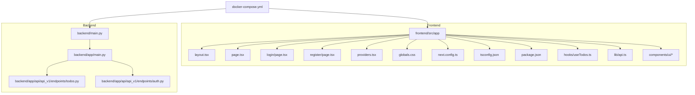
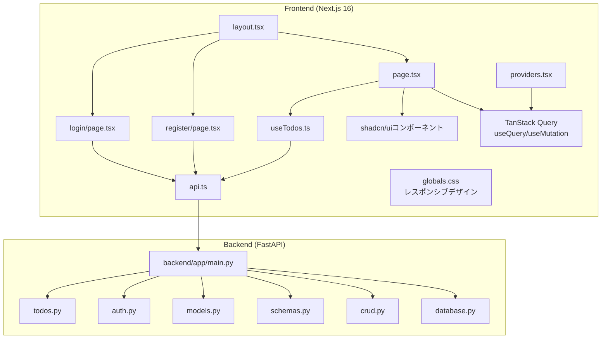
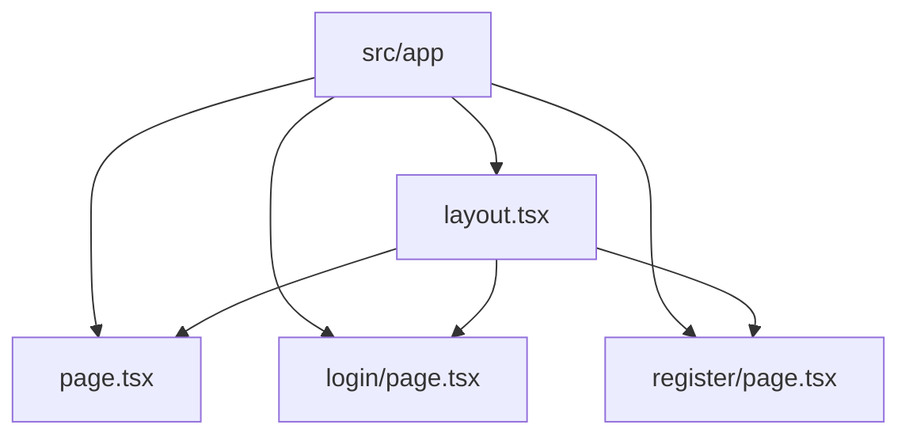
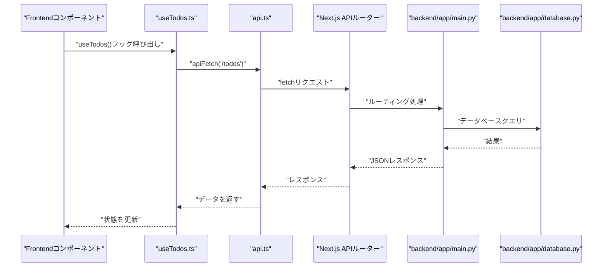
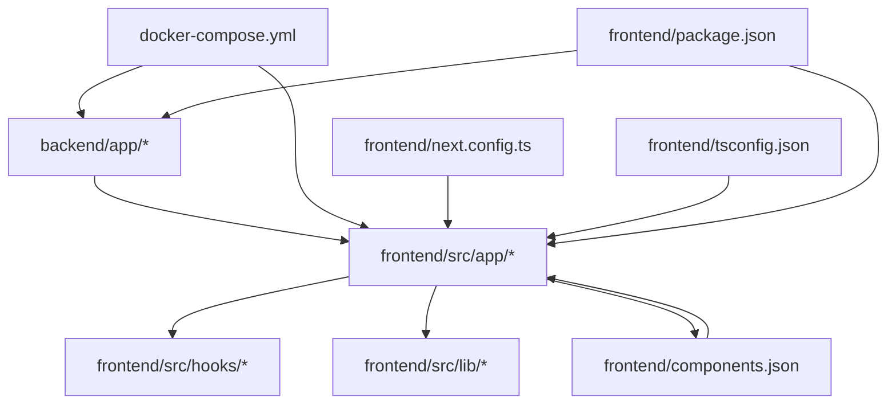

# フロントエンドアーキテクチャ

<cite>
**この文書で参照されるファイル**
- [layout.tsx](file://frontend/src/app/layout.tsx)
- [page.tsx](file://frontend/src/app/page.tsx)
- [login/page.tsx](file://frontend/src/app/login/page.tsx)
- [register/page.tsx](file://frontend/src/app/register/page.tsx)
- [providers.tsx](file://frontend/src/app/providers.tsx)
- [useTodos.ts](file://frontend/src/hooks/useTodos.ts)
- [api.ts](file://frontend/src/lib/api.ts)
- [globals.css](file://frontend/src/app/globals.css)
- [button.tsx](file://frontend/src/components/ui/button.tsx)
- [input.tsx](file://frontend/src/components/ui/input.tsx)
- [components.json](file://frontend/components.json)
- [package.json](file://frontend/package.json)
- [next.config.ts](file://frontend/next.config.ts)
- [tsconfig.json](file://frontend/tsconfig.json)
- [docker-compose.yml](file://docker-compose.yml)
- [backend/main.py](file://backend/main.py)
- [backend/app/main.py](file://backend/app/main.py)
- [backend/app/api/api_v1/endpoints/todos.py](file://backend/app/api/api_v1/endpoints/todos.py)
- [backend/app/api/api_v1/endpoints/auth.py](file://backend/app/api/api_v1/endpoints/auth.py)
</cite>

## 更新概要
**変更内容**
- Next.js 16のApp Routerベースの新規構造（/app/login、/app/register、/hooks/useTodos）の導入
- TanStack Queryの統合によるデータ取得・状態管理の刷新
- shadcn/uiコンポーネントの使用によるUIコンポーネント標準化
- Bunパッケージマネージャーの導入（依存関係管理）
- 認証フロー（ログイン/登録）の新規追加
- React 19の新機能（Server Components、クライアントコンポーネント連携）の活用

## 目次
1. [導入](#導入)
2. [プロジェクト構造](#プロジェクト構造)
3. [コアコンポーネント](#コアコンポーネント)
4. [アーキテクチャ概観](#アーキテクチャ概観)
5. [詳細コンポーネント分析](#詳細コンポーネント分析)
6. [依存関係分析](#依存関係分析)
7. [パフォーマンス考慮事項](#パフォーマンス考慮事項)
8. [トラブルシューティングガイド](#トラブルシューティングガイド)
9. [結論](#結論)
10. [付録](#付録)

## 導入
本プロジェクトは、Next.js 16（App Router）をベースとしたフロントエンドと、Python（FastAPI）を用いたバックエンドを統合した単一リポジトリ構成です。フロントエンドはTypeScript、CSS Variables、Next.jsの最新機能（React 19、Server Components、クライアントコンポーネント連携）を活用し、TanStack Queryによる効率的なデータ管理、shadcn/uiコンポーネントによる一貫したUI設計を実現しています。本ドキュメントでは、App Routerの構造、コンポーネント階層、型定義、スタイリング戦略、API連携レイヤー、状態管理、レスポンシブデザイン、そしてServer Componentsの活用方法について詳しく解説します。

## プロジェクト構造
Next.jsのApp Routerでは、ルートディレクトリ以下に`src/app`が存在し、その配下に`layout.tsx`（グローバルレイアウト）、`page.tsx`（ルートページ）、`login/page.tsx`（ログインページ）、`register/page.tsx`（登録ページ）が配置されています。これらは、アプリケーションのルートコンポーネントとして振る舞い、各ページの共通要素（ヘッダー、ナビゲーション、フッターなど）を定義します。`providers.tsx`はReact QueryのProviderコンポーネントで、グローバルなデータ取得・状態管理を提供します。`hooks/useTodos.ts`はカスタムフックで、TodoリストのCRUD操作を抽象化しています。`globals.css`はグローバルスタイルを提供し、`next.config.ts`はNext.jsのビルド設定、`tsconfig.json`はTypeScriptのコンパイル設定、`package.json`は依存関係管理を担っています。全体の構成は以下の通りです。

**図の出典**
- [layout.tsx](file://frontend/src/app/layout.tsx)
- [page.tsx](file://frontend/src/app/page.tsx)
- [login/page.tsx](file://frontend/src/app/login/page.tsx)
- [register/page.tsx](file://frontend/src/app/register/page.tsx)
- [providers.tsx](file://frontend/src/app/providers.tsx)
- [useTodos.ts](file://frontend/src/hooks/useTodos.ts)
- [api.ts](file://frontend/src/lib/api.ts)
- [globals.css](file://frontend/src/app/globals.css)
- [next.config.ts](file://frontend/next.config.ts)
- [tsconfig.json](file://frontend/tsconfig.json)
- [package.json](file://frontend/package.json)
- [docker-compose.yml](file://docker-compose.yml)
- [backend/main.py](file://backend/main.py)
- [backend/app/main.py](file://backend/app/main.py)
- [backend/app/api/api_v1/endpoints/todos.py](file://backend/app/api/api_v1/endpoints/todos.py)
- [backend/app/api/api_v1/endpoints/auth.py](file://backend/app/api/api_v1/endpoints/auth.py)

**節の出典**
- [layout.tsx](file://frontend/src/app/layout.tsx)
- [page.tsx](file://frontend/src/app/page.tsx)
- [login/page.tsx](file://frontend/src/app/login/page.tsx)
- [register/page.tsx](file://frontend/src/app/register/page.tsx)
- [providers.tsx](file://frontend/src/app/providers.tsx)
- [useTodos.ts](file://frontend/src/hooks/useTodos.ts)
- [api.ts](file://frontend/src/lib/api.ts)
- [globals.css](file://frontend/src/app/globals.css)
- [next.config.ts](file://frontend/next.config.ts)
- [tsconfig.json](file://frontend/tsconfig.json)
- [package.json](file://frontend/package.json)
- [docker-compose.yml](file://docker-compose.yml)

## コアコンポーネント
- **layout.tsx**：グローバルレイアウトコンポーネント。全ページに適用されるHTML構造、メタ情報、テーマ設定、共通コンポーネント（例：ナビゲーション）を提供します。Next.jsのApp Routerでは、ルートのlayout.tsxがルートレベルのコンテキストを提供し、子コンポーネント（page.tsx、login/page.tsx、register/page.tsxなど）がその中に描画されます。`Toaster`コンポーネントによる通知表示も含まれます。
- **page.tsx**：ルートページコンポーネント。URL `/` に対応する画面を描画します。Todoリストの表示、新規追加、完了状態の切り替え、削除機能を備え、`useTodos`カスタムフックを通じてデータ管理を行います。認証状態の確認とエラーハンドリングも実装されています。
- **login/page.tsx**：ログインページコンポーネント。ユーザー認証を提供し、`react-hook-form`と`zod`によるフォームバリデーション、`react-hook-form/resolvers/zod`によるエラーハンドリング、`sonner`による通知表示を実装しています。
- **register/page.tsx**：登録ページコンポーネント。新規ユーザー登録を提供し、同様のフォームバリデーションとエラーハンドリングを実装しています。
- **providers.tsx**：React QueryのProviderコンポーネント。`QueryClientProvider`と`ReactQueryDevtools`を提供し、グローバルなデータ取得・状態管理を実現します。`staleTime`によるキャッシュ戦略も設定されています。
- **useTodos.ts**：カスタムフック。`useQuery`、`useMutation`、`useQueryClient`を統合し、TodoリストのCRUD操作を抽象化しています。`apiFetch`関数を通じてバックエンドAPIと連携します。
- **api.ts**：API連携ライブラリ。`apiFetch`、`login`、`logout`関数を提供し、認証トークンの管理、エラーハンドリング、バックエンドAPIとの通信を実装しています。
- **globals.css**：グローバルスタイルシート。アプリケーション全体で共有されるスタイル（フォント、ベースカラー、レイアウト基準など）を定義します。レスポンシブデザインの基盤となるスタイルを提供します。

これらのコンポーネントは、Next.jsのApp Routerのルート構造において最も基本的な役割を果たしており、それぞれの責務は以下の通りです：
- **layout.tsx**：ルートレベルのコンテキスト、共通UI、メタ情報、通知表示
- **page.tsx**：ルートページのコンテンツ、データ取得、表示ロジック、認証管理
- **login/page.tsx**：認証フォーム、バリデーション、エラーハンドリング
- **register/page.tsx**：登録フォーム、バリデーション、エラーハンドリング
- **providers.tsx**：グローバルなデータ管理、キャッシュ戦略
- **useTodos.ts**：TodoリストのCRUD操作の抽象化
- **api.ts**：API通信、認証トークン管理
- **globals.css**：グローバルなスタイリング、レスポンシブ基準

**節の出典**
- [layout.tsx](file://frontend/src/app/layout.tsx)
- [page.tsx](file://frontend/src/app/page.tsx)
- [login/page.tsx](file://frontend/src/app/login/page.tsx)
- [register/page.tsx](file://frontend/src/app/register/page.tsx)
- [providers.tsx](file://frontend/src/app/providers.tsx)
- [useTodos.ts](file://frontend/src/hooks/useTodos.ts)
- [api.ts](file://frontend/src/lib/api.ts)
- [globals.css](file://frontend/src/app/globals.css)

## アーキテクチャ概観
フロントエンド（Next.js 16）とバックエンド（FastAPI）はDocker Composeによって統合された開発環境で動作します。フロントエンドはNext.jsのApp Routerを使用し、Server Components（React 18以降の機能）を活用してサーバー側でのレンダリングやデータフェッチを実現します。クライアントコンポーネントとの連携は、必要に応じてuse clientディレクティブを用いて行います。API連携レイヤーとしては、バックエンドのFastAPIエンドポイント（例：`/api/v1/todos`、`/api/v1/auth/token`など）を呼び出す形で、データの取得・更新・削除・認証が行われます。状態管理については、TanStack Queryの導入により、効率的なキャッシュ管理、自動再検索、エラーハンドリングが実現されています。

**図の出典**
- [layout.tsx](file://frontend/src/app/layout.tsx)
- [page.tsx](file://frontend/src/app/page.tsx)
- [login/page.tsx](file://frontend/src/app/login/page.tsx)
- [register/page.tsx](file://frontend/src/app/register/page.tsx)
- [providers.tsx](file://frontend/src/app/providers.tsx)
- [useTodos.ts](file://frontend/src/hooks/useTodos.ts)
- [api.ts](file://frontend/src/lib/api.ts)
- [globals.css](file://frontend/src/app/globals.css)
- [backend/app/main.py](file://backend/app/main.py)
- [backend/app/api/api_v1/endpoints/todos.py](file://backend/app/api/api_v1/endpoints/todos.py)
- [backend/app/api/api_v1/endpoints/auth.py](file://backend/app/api/api_v1/endpoints/auth.py)
- [backend/app/models.py](file://backend/app/models.py)
- [backend/app/schemas.py](file://backend/app/schemas.py)
- [backend/app/crud.py](file://backend/app/crud.py)
- [backend/app/database.py](file://backend/app/database.py)

## 詳細コンポーネント分析

### App Router構造とコンポーネント階層
Next.jsのApp Routerでは、`src/app`以下のディレクトリ構造がURLパスに直接対応します。ルートには`layout.tsx`（グローバルレイアウト）、`page.tsx`（ルートページ）、`login/page.tsx`（ログインページ）、`register/page.tsx`（登録ページ）が存在し、これらが親子関係で描画されます。`layout.tsx`は全ページに適用される共通要素を提供し、`page.tsx`は認証済みユーザー向けのTodoリスト表示、`login/page.tsx`と`register/page.tsx`は認証フローを担当します。これにより、階層的にコンポーネントを構成し、再利用性と保守性を高めることができます。

**図の出典**
- [layout.tsx](file://frontend/src/app/layout.tsx)
- [page.tsx](file://frontend/src/app/page.tsx)
- [login/page.tsx](file://frontend/src/app/login/page.tsx)
- [register/page.tsx](file://frontend/src/app/register/page.tsx)

**節の出典**
- [layout.tsx](file://frontend/src/app/layout.tsx)
- [page.tsx](file://frontend/src/app/page.tsx)
- [login/page.tsx](file://frontend/src/app/login/page.tsx)
- [register/page.tsx](file://frontend/src/app/register/page.tsx)

### TypeScript型定義
TypeScriptの型定義は`tsconfig.json`で管理されており、コンパイルオプションや型チェックの設定が含まれます。Next.jsのApp Routerでは、型安全なコンポーネント定義、propsの型付け、APIレスポンスの型定義（backendの`schemas.py`から派生）が推奨されます。`useTodos.ts`では`Todo`インターフェースを定義し、`api.ts`では`apiFetch`関数の型定義、認証関連の型定義が実装されています。これにより、開発中のエラーチェックやIDEの補完精度が向上します。

**節の出典**
- [tsconfig.json](file://frontend/tsconfig.json)
- [useTodos.ts](file://frontend/src/hooks/useTodos.ts)
- [api.ts](file://frontend/src/lib/api.ts)
- [backend/app/schemas.py](file://backend/app/schemas.py)

### スタイリング戦略
グローバルスタイルは`globals.css`で管理され、レスポンシブデザインの基準となるスタイルが定義されています。Next.jsでは、CSS Variables、Tailwind CSS、shadcn/uiコンポーネントなどが選択可能ですが、本プロジェクトでは`components.json`でshadcn/uiコンポーネントの設定が行われており、`@/components/ui/*`からコンポーネントをインポートしています。`button.tsx`、`input.tsx`などのコンポーネントは`class-variance-authority`を使用してバリエーションを定義し、`cn`関数によるクラス名の結合が実装されています。これにより、テーマカラー、フォント、レイアウトの基本的なスタイルを一元管理できます。

**節の出典**
- [globals.css](file://frontend/src/app/globals.css)
- [components.json](file://frontend/components.json)
- [button.tsx](file://frontend/src/components/ui/button.tsx)
- [input.tsx](file://frontend/src/components/ui/input.tsx)

### API連携レイヤー
API連携は、フロントエンドのコンポーネント（例：`page.tsx`、`login/page.tsx`、`register/page.tsx`）から`api.ts`を通じてバックエンドのFastAPIエンドポイントを呼び出す形で実装されます。`api.ts`の`apiFetch`関数は認証トークンの自動追加、エラーハンドリング、JSONレスポンスの処理を実装しています。`login`関数はOAuth2のパスワードフローに対応し、`logout`関数はローカルストレージからトークンを削除します。バックエンドでは`backend/app/api/api_v1/endpoints/todos.py`と`backend/app/api/api_v1/endpoints/auth.py`がエンドポイントを提供し、`backend/app/main.py`がエントリーポイントです。フロントエンドでは、`useTodos.ts`の`useQuery`、`useMutation`を使用してAPIを呼び出し、レスポンスをコンポーネントに渡します。エラーハンドリングやローディング状態の管理は、コンポーネント内で適切に行われます。

**図の出典**
- [page.tsx](file://frontend/src/app/page.tsx)
- [useTodos.ts](file://frontend/src/hooks/useTodos.ts)
- [api.ts](file://frontend/src/lib/api.ts)
- [backend/app/main.py](file://backend/app/main.py)
- [backend/app/api/api_v1/endpoints/todos.py](file://backend/app/api/api_v1/endpoints/todos.py)
- [backend/app/database.py](file://backend/app/database.py)

**節の出典**
- [page.tsx](file://frontend/src/app/page.tsx)
- [useTodos.ts](file://frontend/src/hooks/useTodos.ts)
- [api.ts](file://frontend/src/lib/api.ts)
- [backend/app/main.py](file://backend/app/main.py)
- [backend/app/api/api_v1/endpoints/todos.py](file://backend/app/api/api_v1/endpoints/todos.py)
- [backend/app/database.py](file://backend/app/database.py)

### 状態管理の仕組み
Next.jsのApp Routerにおける状態管理は、TanStack Queryの導入により効率的かつ一貫性のあるアプローチが実現されています。`providers.tsx`で`QueryClientProvider`が設定され、`useTodos.ts`の`useQuery`、`useMutation`、`useQueryClient`がカスタムフックとして提供されています。`useQuery`はTodoリストの取得、`useMutation`はCRUD操作（追加、更新、削除）を抽象化し、`queryClient.invalidateQueries`による自動再検索が実装されています。これにより、コンポーネント内でのローカル状態（useState）とグローバル状態管理（TanStack Query）を適切に組み合わせて実装できます。エラーハンドリングや再フェッチロジックも含めて設計することが重要です。

**節の出典**
- [providers.tsx](file://frontend/src/app/providers.tsx)
- [useTodos.ts](file://frontend/src/hooks/useTodos.ts)

### レスポンシブデザインの実装方法
レスポンシブデザインは`globals.css`で定義されたグローバルスタイルを基盤とし、Tailwind CSSのユーティリティクラス（`min-h-screen`、`max-w-2xl`、`p-4 md:p-8`など）を使用して実装されます。`components.json`でTailwind CSSの設定が行われており、CSS Variablesによるテーマ対応（`dark:bg-black`、`text-zinc-500`など）が実装されています。コンポーネントごとにスタイリングを行う場合、shadcn/uiコンポーネントのバリエーション（`variant`、`size`）を使用してカプセル化することも可能です。画面サイズに応じたレイアウト変更、フォントサイズの調整、余白の最適化などを通じて、すべてのデバイスで適切な体験を提供します。

**節の出典**
- [globals.css](file://frontend/src/app/globals.css)
- [components.json](file://frontend/components.json)

### React 19の新機能とServer Componentsの活用
React 19では、Server Componentsの利点（サーバーでのレンダリング、バンドルサイズ削減、セキュリティ向上）がさらに強調されます。Next.jsのApp Routerでは、`layout.tsx`や`page.tsx`がServer Componentsとして動作し、クライアントコンポーネントとの連携は`use client`ディレクティブで明示的に指定します。`layout.tsx`では`Toaster`コンポーネントの配置、`providers.tsx`では`QueryClientProvider`の設定がクライアントコンポーネントとして実装されています。これにより、必要な部分だけをクライアントサイドでレンダリングし、効率的なパフォーマンスを実現できます。また、SuspenseやServer Actionsなどの新機能も活用することで、よりスムーズなユーザー体験が期待できます。

**節の出典**
- [layout.tsx](file://frontend/src/app/layout.tsx)
- [page.tsx](file://frontend/src/app/page.tsx)
- [providers.tsx](file://frontend/src/app/providers.tsx)

### 認証フローの実装
認証フローは`login/page.tsx`と`register/page.tsx`で実装されており、`react-hook-form`と`zod`によるフォームバリデーション、`react-hook-form/resolvers/zod`によるエラーハンドリング、`sonner`による通知表示が実装されています。`login`関数はOAuth2のパスワードフローに対応し、`localStorage`に`access_token`を保存します。`logout`関数はトークンの削除とルーティングのリダイレクトを実装しています。`page.tsx`では認証状態の確認と、認証エラー時の自動リダイレクトが実装されています。これにより、セキュアでユーザーフレンドリーな認証フローが実現されています。

**節の出典**
- [login/page.tsx](file://frontend/src/app/login/page.tsx)
- [register/page.tsx](file://frontend/src/app/register/page.tsx)
- [api.ts](file://frontend/src/lib/api.ts)
- [page.tsx](file://frontend/src/app/page.tsx)

## 依存関係分析
フロントエンド（Next.js 16）とバックエンド（FastAPI）の依存関係は、Docker Composeによって統合された開発環境で管理されています。`docker-compose.yml`により、フロントエンドのNext.jsアプリケーションとバックエンドのFastAPIアプリケーションが連携し、APIリクエストが疎通するようになります。Next.jsの設定（`next.config.ts`）とTypeScript設定（`tsconfig.json`）は、ビルドプロセスと型チェックの基盤を提供します。`package.json`は依存関係の管理を行い、`components.json`はshadcn/uiコンポーネントの設定を管理します。開発と本番の両方の環境を支えるために、`ignoreScripts`と`trustedDependencies`の設定が実装されています。

**図の出典**
- [docker-compose.yml](file://docker-compose.yml)
- [next.config.ts](file://frontend/next.config.ts)
- [tsconfig.json](file://frontend/tsconfig.json)
- [package.json](file://frontend/package.json)
- [components.json](file://frontend/components.json)
- [backend/app/main.py](file://backend/app/main.py)

**節の出典**
- [docker-compose.yml](file://docker-compose.yml)
- [next.config.ts](file://frontend/next.config.ts)
- [tsconfig.json](file://frontend/tsconfig.json)
- [package.json](file://frontend/package.json)
- [components.json](file://frontend/components.json)

## パフォーマンス考慮事項
- **Server Componentsの活用**：サーバーでのレンダリングにより、クライアントへの転送量を削減し、初期表示のパフォーマンスを向上させます。
- **クライアントコンポーネントの最小化**：`use client`ディレクティブを使用して、必要最小限のコンポーネントのみをクライアントサイドでレンダリングします。
- **TanStack Queryのキャッシュ戦略**：`staleTime`によるキャッシュ有効期限の設定により、不要なAPIリクエストを削減し、パフォーマンスを最適化します。
- **APIの非同期処理**：Suspenseやエラーハンドリングを適切に行い、ローディング状態をユーザーにフィードバックします。
- **CSSの最適化**：`globals.css`でのグローバルスタイル管理とshadcn/uiコンポーネントの使用により、不要なスタイルの重複を避け、バンドルサイズを抑制します。
- **開発環境の最適化**：`next.config.ts`と`tsconfig.json`の設定を見直し、ビルド時間と型チェックの効率を高めます。
- **認証トークンの効率的な管理**：`localStorage`を使用したトークン管理により、認証リクエストのオーバーヘッドを削減します。

## トラブルシューティングガイド
- **API接続エラー**：`api.ts`の`apiFetch`関数からバックエンドのエンドポイントにアクセスできない場合は、`backend/app/main.py`のルーティング設定と`docker-compose.yml`のネットワーク設定を確認してください。
- **認証エラー**：`login`関数が失敗する場合は、`/api/v1/auth/token`エンドポイントの認証ロジックと`localStorage`のトークン管理を確認してください。
- **Todoリストの表示エラー**：`useTodos.ts`の`useQuery`がエラーを返す場合は、`/api/v1/todos`エンドポイントのレスポンス形式と認証状態を確認してください。
- **型エラー**：`tsconfig.json`の設定や`backend/app/schemas.py`の型定義に問題がある場合、TypeScriptの型チェックエラーが発生します。型定義の整合性を確認してください。
- **スタイルの反映不具合**：`globals.css`の記述に誤りがあるか、shadcn/uiコンポーネントのバリエーションに問題がある場合があります。`components.json`の設定とコンポーネントのクラス名を確認してください。
- **Docker環境の起動失敗**：`docker-compose.yml`のサービス定義やポート設定に問題がある場合、コンテナが正常に起動しません。ログを確認し、依存関係の解決を試みてください。
- **TanStack Queryの動作異常**：`useQuery`や`useMutation`が正しく動作しない場合は、`providers.tsx`の`QueryClientProvider`設定と`queryClient.invalidateQueries`の呼び出しを確認してください。

**節の出典**
- [api.ts](file://frontend/src/lib/api.ts)
- [useTodos.ts](file://frontend/src/hooks/useTodos.ts)
- [login/page.tsx](file://frontend/src/app/login/page.tsx)
- [register/page.tsx](file://frontend/src/app/register/page.tsx)
- [backend/app/main.py](file://backend/app/main.py)
- [docker-compose.yml](file://docker-compose.yml)
- [tsconfig.json](file://frontend/tsconfig.json)
- [backend/app/schemas.py](file://backend/app/schemas.py)
- [globals.css](file://frontend/src/app/globals.css)
- [components.json](file://frontend/components.json)
- [providers.tsx](file://frontend/src/app/providers.tsx)

## 結論
本プロジェクトは、Next.js 16のApp Routerを活用したモダンなフロントエンドアーキテクチャを実現しており、Server Componentsの利点を最大限に活かしつつ、クライアントコンポーネントとの連携を適切に行っています。TanStack Queryによる効率的なデータ管理、shadcn/uiコンポーネントによる一貫したUI設計、React 19の新機能の活用、認証フローの実装が組み合わさって、堅牢かつ拡張可能なシステムを構築しています。今後の改善点として、状態管理の洗練化、パフォーマンスの継続的な最適化、テスト戦略の強化、より高度な認証機能の追加が挙げられます。

## 付録
- **補足情報**：`README.md`にはプロジェクトの概要や開発手順に関する記述が含まれています。詳細はそちらをご確認ください。
- **API仕様**：`backend/app/schemas.py`に定義されたデータモデルに基づくAPI仕様が存在します。これに従ってフロントエンドのAPI連携を設計してください。
- **コンポーネントガイド**：`components.json`の設定に従って、shadcn/uiコンポーネントの使用方法を確認してください。
- **パッケージマネージャー**：`package.json`の依存関係と`components.json`の設定に従って、Bunパッケージマネージャーの使用方法を確認してください。

**節の出典**
- [README.md](file://frontend/README.md)
- [backend/app/schemas.py](file://backend/app/schemas.py)
- [components.json](file://frontend/components.json)
- [package.json](file://frontend/package.json)