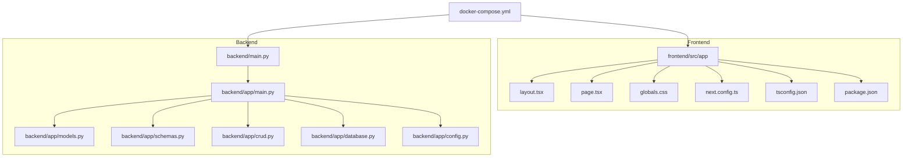
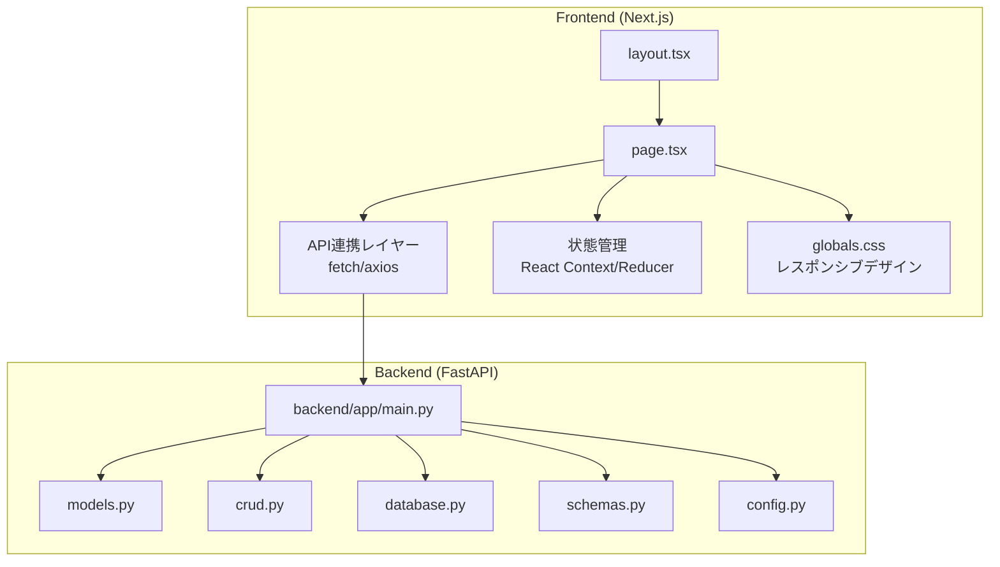
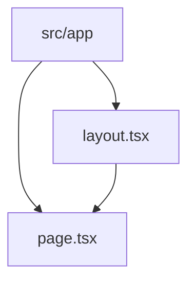
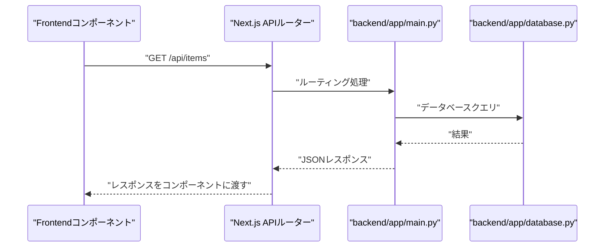
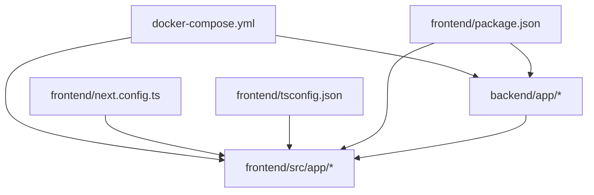

# フロントエンドアーキテクチャ

<cite>
**この文書で参照されるファイル**
- [layout.tsx](file://frontend/src/app/layout.tsx)
- [page.tsx](file://frontend/src/app/page.tsx)
- [globals.css](file://frontend/src/app/globals.css)
- [next.config.ts](file://frontend/next.config.ts)
- [tsconfig.json](file://frontend/tsconfig.json)
- [package.json](file://frontend/package.json)
- [README.md](file://frontend/README.md)
- [docker-compose.yml](file://docker-compose.yml)
- [backend/main.py](file://backend/main.py)
- [backend/app/main.py](file://backend/app/main.py)
- [backend/app/models.py](file://backend/app/models.py)
- [backend/app/schemas.py](file://backend/app/schemas.py)
- [backend/app/crud.py](file://backend/app/crud.py)
- [backend/app/database.py](file://backend/app/database.py)
- [backend/app/config.py](file://backend/app/config.py)
</cite>

## 目次
1. [導入](#導入)
2. [プロジェクト構造](#プロジェクト構造)
3. [コアコンポーネント](#コアコンポーネント)
4. [アーキテクチャ概観](#アーキテクチャ概観)
5. [詳細コンポーネント分析](#詳細コンポーネント分析)
6. [依存関係分析](#依存関係分析)
7. [パフォーマンス考慮事項](#パフォーマンス考慮事項)
8. [トラブルシューティングガイド](#トラブルシューティングガイド)
9. [結論](#結論)
10. [付録](#付録)

## 導入
本プロジェクトは、Next.js（App Router）をベースとしたフロントエンドと、Python（FastAPI）を用いたバックエンドを統合した単一リポジトリ構成です。フロントエンドはTypeScript、CSS Modules、およびNext.jsの最新機能（React 19、Server Components、クライアントコンポーネント連携）を活用して構築されています。本ドキュメントでは、App Routerの構造、コンポーネント階層、型定義、スタイリング戦略、API連携レイヤー、状態管理、レスポンシブデザイン、そしてServer Componentsの活用方法について詳しく解説します。

## プロジェクト構造
Next.jsのApp Routerでは、ルートディレクトリ以下に`src/app`が存在し、その配下に`layout.tsx`（グローバルレイアウト）、`page.tsx`（ルートページ）が配置されています。これらは、アプリケーションのルートコンポーネントとして振る舞い、各ページの共通要素（ヘッダー、ナビゲーション、フッターなど）を定義します。`globals.css`はグローバルスタイルを提供し、`next.config.ts`はNext.jsのビルド設定、`tsconfig.json`はTypeScriptのコンパイル設定、`package.json`は依存関係管理を担っています。全体の構成は以下の通りです。

**図の出典**
- [layout.tsx](file://frontend/src/app/layout.tsx)
- [page.tsx](file://frontend/src/app/page.tsx)
- [globals.css](file://frontend/src/app/globals.css)
- [next.config.ts](file://frontend/next.config.ts)
- [tsconfig.json](file://frontend/tsconfig.json)
- [package.json](file://frontend/package.json)
- [docker-compose.yml](file://docker-compose.yml)
- [backend/main.py](file://backend/main.py)
- [backend/app/main.py](file://backend/app/main.py)
- [backend/app/models.py](file://backend/app/models.py)
- [backend/app/schemas.py](file://backend/app/schemas.py)
- [backend/app/crud.py](file://backend/app/crud.py)
- [backend/app/database.py](file://backend/app/database.py)
- [backend/app/config.py](file://backend/app/config.py)

**節の出典**
- [layout.tsx](file://frontend/src/app/layout.tsx)
- [page.tsx](file://frontend/src/app/page.tsx)
- [globals.css](file://frontend/src/app/globals.css)
- [next.config.ts](file://frontend/next.config.ts)
- [tsconfig.json](file://frontend/tsconfig.json)
- [package.json](file://frontend/package.json)
- [docker-compose.yml](file://docker-compose.yml)

## コアコンポーネント
- layout.tsx：グローバルレイアウトコンポーネント。全ページに適用されるHTML構造、メタ情報、テーマ設定、共通コンポーネント（例：ナビゲーション）を提供します。Next.jsのApp Routerでは、ルートのlayout.tsxがルートレベルのコンテキストを提供し、子コンポーネント（page.tsxなど）がその中に描画されます。
- page.tsx：ルートページコンポーネント。URL `/` に対応する画面を描画します。通常、ここにメインコンテンツやデータ取得ロジック（SSR/SSG）を含めます。
- globals.css：グローバルスタイルシート。アプリケーション全体で共有されるスタイル（フォント、ベースカラー、レイアウト基準など）を定義します。レスポンシブデザインの基盤となるスタイルを提供します。

これらのコンポーネントは、Next.jsのApp Routerのルート構造において最も基本的な役割を果たしており、それぞれの責務は以下の通りです：
- layout.tsx：ルートレベルのコンテキスト、共通UI、メタ情報
- page.tsx：ルートページのコンテンツ、データ取得、表示ロジック
- globals.css：グローバルなスタイリング、レスポンシブ基準

**節の出典**
- [layout.tsx](file://frontend/src/app/layout.tsx)
- [page.tsx](file://frontend/src/app/page.tsx)
- [globals.css](file://frontend/src/app/globals.css)

## アーキテクチャ概観
フロントエンド（Next.js）とバックエンド（FastAPI）はDocker Composeによって統合された開発環境で動作します。フロントエンドはNext.jsのApp Routerを使用し、Server Components（React 18以降の機能）を活用してサーバー側でのレンダリングやデータフェッチを実現します。クライアントコンポーネントとの連携は、必要に応じてuse clientディレクティブを用いて行います。API連携レイヤーとしては、バックエンドのFastAPIエンドポイント（例：`/api/items`など）を呼び出す形で、データの取得・更新・削除が行われます。状態管理については、Next.jsのApp Routerの特性上、ReactのContextやuseReducer、または外部ライブラリ（例：Zustand、Jotai、Recoil）を用いることが一般的ですが、本プロジェクトでは最小限の状態管理を前提としています。

**図の出典**
- [layout.tsx](file://frontend/src/app/layout.tsx)
- [page.tsx](file://frontend/src/app/page.tsx)
- [globals.css](file://frontend/src/app/globals.css)
- [backend/app/main.py](file://backend/app/main.py)
- [backend/app/models.py](file://backend/app/models.py)
- [backend/app/crud.py](file://backend/app/crud.py)
- [backend/app/database.py](file://backend/app/database.py)
- [backend/app/schemas.py](file://backend/app/schemas.py)
- [backend/app/config.py](file://backend/app/config.py)

## 詳細コンポーネント分析

### App Router構造とコンポーネント階層
Next.jsのApp Routerでは、`src/app`以下のディレクトリ構造がURLパスに直接対応します。ルートには`layout.tsx`（グローバルレイアウト）と`page.tsx`（ルートページ）が存在し、これらが親子関係で描画されます。`layout.tsx`は全ページに適用される共通要素を提供し、`page.tsx`はその中で描画されるコンテンツを担当します。これにより、階層的にコンポーネントを構成し、再利用性と保守性を高めることができます。

**図の出典**
- [layout.tsx](file://frontend/src/app/layout.tsx)
- [page.tsx](file://frontend/src/app/page.tsx)

**節の出典**
- [layout.tsx](file://frontend/src/app/layout.tsx)
- [page.tsx](file://frontend/src/app/page.tsx)

### TypeScript型定義
TypeScriptの型定義は`tsconfig.json`で管理されており、コンパイルオプションや型チェックの設定が含まれます。Next.jsのApp Routerでは、型安全なコンポーネント定義、propsの型付け、APIレスポンスの型定義（backendの`schemas.py`から派生）が推奨されます。これにより、開発中のエラーチェックやIDEの補完精度が向上します。

**節の出典**
- [tsconfig.json](file://frontend/tsconfig.json)
- [backend/app/schemas.py](file://backend/app/schemas.py)

### スタイリング戦略
グローバルスタイルは`globals.css`で管理され、レスポンシブデザインの基準となるスタイルが定義されています。Next.jsでは、CSS ModulesやStyled Components、Tailwind CSSなどのアプローチが選択可能ですが、本プロジェクトでは`globals.css`によるシンプルなグローバルスタイル管理が採用されています。これにより、テーマカラー、フォント、レイアウトの基本的なスタイルを一元管理できます。

**節の出典**
- [globals.css](file://frontend/src/app/globals.css)

### API連携レイヤー
API連携は、フロントエンドのコンポーネント（例：`page.tsx`）からバックエンドのFastAPIエンドポイントを呼び出す形で実装されます。`backend/app/main.py`がエントリーポイントであり、そこから各ルーティング（例：`/api/items`）が定義されています。フロントエンドでは、fetchやaxiosなどのHTTPクライアントを使用してAPIを呼び出し、レスポンスをコンポーネントに渡します。エラーハンドリングやローディング状態の管理は、コンポーネント内で適切に行う必要があります。

**図の出典**
- [page.tsx](file://frontend/src/app/page.tsx)
- [backend/app/main.py](file://backend/app/main.py)
- [backend/app/database.py](file://backend/app/database.py)

**節の出典**
- [page.tsx](file://frontend/src/app/page.tsx)
- [backend/app/main.py](file://backend/app/main.py)
- [backend/app/database.py](file://backend/app/database.py)

### 状態管理の仕組み
Next.jsのApp Routerにおける状態管理は、コンポーネント内でのローカル状態（useState、useReducer）と、必要に応じたグローバル状態管理（React Context、Zustand、Jotai、Recoilなど）を組み合わせて実装します。フロントエンドの`page.tsx`などでAPIからのデータを保持し、コンポーネントツリー全体で共有することが一般的です。エラーハンドリングや再フェッチロジックも含めて設計することが重要です。

**節の出典**
- [page.tsx](file://frontend/src/app/page.tsx)

### レスポンシブデザインの実装方法
レスポンシブデザインは`globals.css`で定義されたグローバルスタイルを基盤とし、メディアクエリやFlexbox/Gridの使用によって実装されます。コンポーネントごとにスタイリングを行う場合、CSS ModulesやStyled Componentsなどを用いてカプセル化することも可能です。画面サイズに応じたレイアウト変更、フォントサイズの調整、余白の最適化などを通じて、すべてのデバイスで適切な体験を提供します。

**節の出典**
- [globals.css](file://frontend/src/app/globals.css)

### React 19の新機能とServer Componentsの活用
React 19では、Server Componentsの利点（サーバーでのレンダリング、バンドルサイズ削減、セキュリティ向上）がさらに強調されます。Next.jsのApp Routerでは、`layout.tsx`や`page.tsx`がServer Componentsとして動作し、クライアントコンポーネントとの連携は`use client`ディレクティブで明示的に指定します。これにより、必要な部分だけをクライアントサイドでレンダリングし、効率的なパフォーマンスを実現できます。また、SuspenseやServer Actionsなどの新機能も活用することで、よりスムーズなユーザー体験が期待できます。

**節の出典**
- [layout.tsx](file://frontend/src/app/layout.tsx)
- [page.tsx](file://frontend/src/app/page.tsx)

## 依存関係分析
フロントエンド（Next.js）とバックエンド（FastAPI）の依存関係は、Docker Composeによって統合された開発環境で管理されています。`docker-compose.yml`により、フロントエンドのNext.jsアプリケーションとバックエンドのFastAPIアプリケーションが連携し、APIリクエストが疎通するようになります。Next.jsの設定（`next.config.ts`）とTypeScript設定（`tsconfig.json`）は、ビルドプロセスと型チェックの基盤を提供します。`package.json`は依存関係の管理を行い、開発と本番の両方の環境を支えます。

**図の出典**
- [docker-compose.yml](file://docker-compose.yml)
- [next.config.ts](file://frontend/next.config.ts)
- [tsconfig.json](file://frontend/tsconfig.json)
- [package.json](file://frontend/package.json)
- [backend/app/main.py](file://backend/app/main.py)

**節の出典**
- [docker-compose.yml](file://docker-compose.yml)
- [next.config.ts](file://frontend/next.config.ts)
- [tsconfig.json](file://frontend/tsconfig.json)
- [package.json](file://frontend/package.json)

## パフォーマンス考慮事項
- Server Componentsの活用：サーバーでのレンダリングにより、クライアントへの転送量を削減し、初期表示のパフォーマンスを向上させます。
- クライアントコンポーネントの最小化：`use client`ディレクティブを使用して、必要最小限のコンポーネントのみをクライアントサイドでレンダリングします。
- APIの非同期処理：Suspenseやエラーハンドリングを適切に行い、ローディング状態をユーザーにフィードバックします。
- CSSの最適化：`globals.css`でのグローバルスタイル管理により、不要なスタイルの重複を避け、バンドルサイズを抑制します。
- 開発環境の最適化：`next.config.ts`と`tsconfig.json`の設定を見直し、ビルド時間と型チェックの効率を高めます。

## トラブルシューティングガイド
- API接続エラー：`page.tsx`からバックエンドのエンドポイントにアクセスできない場合は、`backend/app/main.py`のルーティング設定と`docker-compose.yml`のネットワーク設定を確認してください。
- 型エラー：`tsconfig.json`の設定や`backend/app/schemas.py`の型定義に問題がある場合、TypeScriptの型チェックエラーが発生します。型定義の整合性を確認してください。
- スタイルの反映不具合：`globals.css`の記述に誤りがあるか、コンポーネントのスタイリング方法（CSS Modulesなど）に問題がある場合があります。スタイルの優先順位やカプセル化を確認してください。
- Docker環境の起動失敗：`docker-compose.yml`のサービス定義やポート設定に問題がある場合、コンテナが正常に起動しません。ログを確認し、依存関係の解決を試みてください。

**節の出典**
- [page.tsx](file://frontend/src/app/page.tsx)
- [backend/app/main.py](file://backend/app/main.py)
- [docker-compose.yml](file://docker-compose.yml)
- [tsconfig.json](file://frontend/tsconfig.json)
- [backend/app/schemas.py](file://backend/app/schemas.py)
- [globals.css](file://frontend/src/app/globals.css)

## 結論
本プロジェクトは、Next.jsのApp Routerを活用したモダンなフロントエンドアーキテクチャを実現しており、Server Componentsの利点を最大限に活かしつつ、クライアントコンポーネントとの連携を適切に行っています。TypeScriptによる型安全な開発、グローバルスタイル管理、API連携レイヤー、レスポンシブデザイン、そしてDocker Composeによる統合環境が組み合わさって、堅牢かつ拡張可能なシステムを構築しています。今後の改善点として、状態管理の洗練化、パフォーマンスの継続的な最適化、テスト戦略の強化が挙げられます。

## 付録
- 補足情報：`README.md`にはプロジェクトの概要や開発手順に関する記述が含まれています。詳細はそちらをご確認ください。
- API仕様：`backend/app/schemas.py`に定義されたデータモデルに基づくAPI仕様が存在します。これに従ってフロントエンドのAPI連携を設計してください。

**節の出典**
- [README.md](file://frontend/README.md)
- [backend/app/schemas.py](file://backend/app/schemas.py)