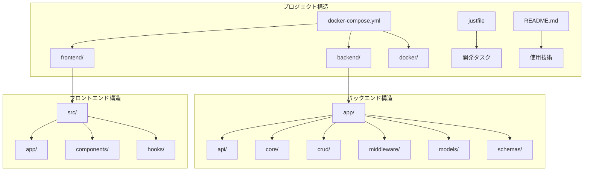
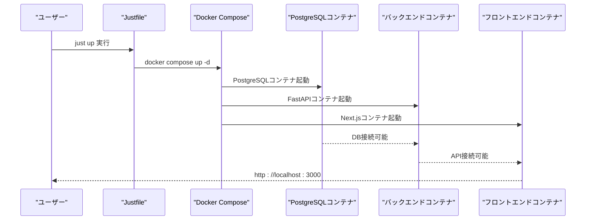
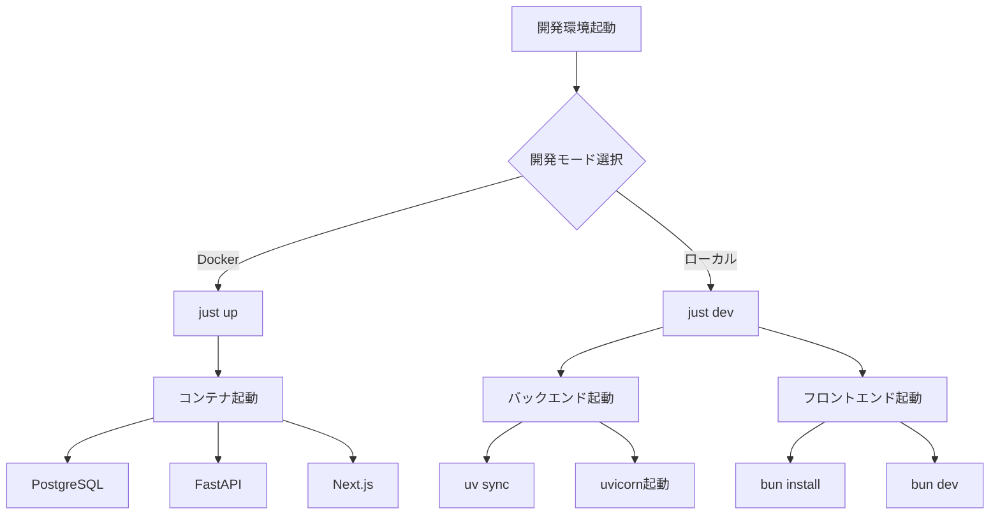
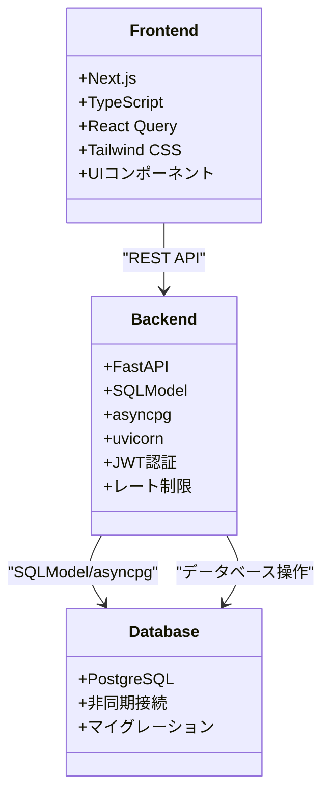

# クイックスタート

<cite>
**このドキュメントで参照されるファイル**
- [README.md](file://README.md)
- [docker-compose.yml](file://docker-compose.yml)
- [justfile](file://justfile)
- [backend/pyproject.toml](file://backend/pyproject.toml)
- [frontend/package.json](file://frontend/package.json)
- [docker/backend/Dockerfile](file://docker/backend/Dockerfile)
- [docker/frontend/Dockerfile](file://docker/frontend/Dockerfile)
- [backend/app/core/config.py](file://backend/app/core/config.py)
- [backend/app/main.py](file://backend/app/main.py)
- [backend/app/api/api_v1/endpoints/auth.py](file://backend/app/api/api_v1/endpoints/auth.py)
- [backend/app/api/api_v1/endpoints/todos.py](file://backend/app/api/api_v1/endpoints/todos.py)
</cite>

## 目次
1. [はじめに](#はじめに)
2. [プロジェクト構造](#プロジェクト構造)
3. [前提条件](#前提条件)
4. [クイックスタート手順](#クイックスタート手順)
5. [Dockerコンテナでの起動手順](#dockerコンテナでの起動手順)
6. [ローカル開発環境の構築方法](#ローカル開発環境の構築方法)
7. [環境変数の設定](#環境変数の設定)
8. [サービスの開始/停止手順](#サービスの開始停止手順)
9. [ポート番号と各サービスへのアクセス方法](#ポート番号と各サービスへのアクセス方法)
10. [依存関係分析](#依存関係分析)
11. [パフォーマンス考慮事項](#パフォーマンス考慮事項)
12. [トラブルシューティングガイド](#トラブルシューティングガイド)
13. [結論](#結論)

## はじめに
本ドキュメントは、Todoアプリケーションの迅速なセットアップ手順を提供することを目的としています。Dockerコンテナでの起動手順、ローカル開発環境の構築方法、環境変数の設定、サービスの開始/停止手順について詳細に説明します。また、ポート番号（3000:フロントエンド、8000:バックエンド、5432:PostgreSQL）と各サービスへのアクセス方法も記載しています。

## プロジェクト構造
Todoアプリケーションは、以下の構造で構成されています：
- backend/: FastAPIによるバックエンドAPI
- frontend/: Next.jsによるフロントエンド
- docker/: Dockerコンテナの設定
- docker-compose.yml: Docker Composeの全体設定
- justfile: 開発用タスクランナー



**図の出典**
- [README.md:158-184](file://README.md#L158-L184)
- [docker-compose.yml:1-16](file://docker-compose.yml#L1-L16)

**節の出典**
- [README.md:158-184](file://README.md#L158-L184)
- [docker-compose.yml:1-16](file://docker-compose.yml#L1-L16)

## 前提条件
以下のソフトウェアがインストールされている必要があります：

- Docker & Docker Compose
- Bun (フロントエンド開発用)
- Python 3.10+ & uv (バックエンド開発用)
- Jujutsu (バージョン管理用)

これらの前提条件は、README.mdの「Getting Started」セクションで明示されています。

**節の出典**
- [README.md:87-92](file://README.md#L87-L92)

## クイックスタート手順
Dockerコンテナを使用したクイックスタート手順は以下の通りです：

1. **リポジトリのクローン**
   - git clone <repository-url> でリポジトリをクローン
   - cd Todo でディレクトリに移動

2. **環境変数の設定**
   - .env.example を .env にコピー
   - .env ファイルを編集して必要な設定を追加

3. **サービスの起動**
   - just up で全サービスを起動

4. **アプリケーションへのアクセス**
   - フロントエンド: http://localhost:3000
   - バックエンドAPI: http://localhost:8000
   - APIドキュメント: http://localhost:8000/docs

5. **ログの確認**
   - just logs でログを表示

6. **サービスの停止**
   - just down で全サービスを停止

**節の出典**
- [README.md:94-127](file://README.md#L94-L127)

## Dockerコンテナでの起動手順
Dockerコンテナを使用した起動手順は以下の通りです：



**図の出典**
- [justfile:4-5](file://justfile#L4-L5)
- [docker-compose.yml:1-16](file://docker-compose.yml#L1-L16)

Dockerコンテナの設定は以下の通りです：

- PostgreSQLコンテナ
  - イメージ: postgres:16-alpine
  - ポート: 5432:5432
  - 環境変数: POSTGRES_USER, POSTGRES_PASSWORD, POSTGRES_DB
  - ボリューム: postgres_data

- Dockerfileのビルドプロセス
  - Python 3.10-slim-bookwormベース
  - uvを使用した依存関係の同期
  - UvicornによるFastAPIサーバー起動

**節の出典**
- [docker-compose.yml:2-12](file://docker-compose.yml#L2-L12)
- [docker/backend/Dockerfile:1-10](file://docker/backend/Dockerfile#L1-L10)
- [docker/frontend/Dockerfile:1-8](file://docker/frontend/Dockerfile#L1-L8)

## ローカル開発環境の構築方法
ローカル開発環境の構築手順は以下の通りです：

### バックエンドのセットアップ
1. backendディレクトリに移動
2. uv sync で依存関係をインストール
3. just backend-dev または uv run uvicorn app.main:app --reload --host 0.0.0.0 --port 8000 で開発サーバーを起動

### フロントエンドのセットアップ
1. frontendディレクトリに移動
2. bun install で依存関係をインストール
3. just frontend-dev または bun dev で開発サーバーを起動



**図の出典**
- [justfile:8-15](file://justfile#L8-L15)
- [justfile:29-35](file://justfile#L29-L35)

**節の出典**
- [README.md:128-156](file://README.md#L128-L156)
- [justfile:8-15](file://justfile#L8-L15)

## 環境変数の設定
環境変数の設定方法は以下の通りです：

1. .env.example を .env にコピー
2. .envファイルを編集して以下の設定を行う
3. 設定ファイルの場所: backend/app/core/config.py

重要な環境変数の種類：
- PostgreSQL接続情報: POSTGRES_USER, POSTGRES_PASSWORD, POSTGRES_SERVER, POSTGRES_PORT, POSTGRES_DB
- JWT設定: SECRET_KEY, ALGORITHM, ACCESS_TOKEN_EXPIRE_MINUTES
- CORS設定: BACKEND_CORS_ORIGINS
- レート制限設定: RATE_LIMIT_DEFAULT, RATE_LIMIT_LOGIN

**節の出典**
- [README.md:102-106](file://README.md#L102-L106)
- [backend/app/core/config.py:24-57](file://backend/app/core/config.py#L24-L57)

## サービスの開始/停止手順
サービスの開始/停止手順は以下の通りです：

### 開始手順
- 全サービス起動: just up
- 開発環境起動: just dev (DB, Backend, Frontendを同時に起動)
- バックエンドのみ起動: just backend-dev
- フロントエンドのみ起動: just frontend-dev

### 停止手順
- 全サービス停止: just down
- DBのみ停止: just clean-db

### ログ確認
- DBログ: just db-logs
- Backendログ: just backend-logs
- Frontendログ: just frontend-logs

**節の出典**
- [justfile:4-69](file://justfile#L4-L69)

## ポート番号と各サービスへのアクセス方法
ポート番号と各サービスへのアクセス方法は以下の通りです：

### ポート番号
- 3000: Next.jsフロントエンド
- 8000: FastAPIバックエンド
- 5432: PostgreSQLデータベース

### 各サービスへのアクセス
- フロントエンド: http://localhost:3000
- バックエンドAPI: http://localhost:8000
- APIドキュメント: http://localhost:8000/docs
- ヘルスチェック: http://localhost:8000/health

```mermaid
graph LR
subgraph "ローカル環境"
A[3000: Next.js] --> B[フロントエンド]
C[8000: FastAPI] --> D[バックエンドAPI]
E[5432: PostgreSQL] --> F[データベース]
end
subgraph "APIエンドポイント"
D --> G[/api/v1/auth/register]
D --> H[/api/v1/auth/token]
D --> I[/api/v1/todos/]
D --> J[/health]
end
```

**図の出典**
- [README.md:62-68](file://README.md#L62-L68)
- [README.md:70-84](file://README.md#L70-L84)

**節の出典**
- [README.md:62-68](file://README.md#L62-L68)
- [README.md:113-116](file://README.md#L113-L116)

## 依存関係分析
プロジェクトの依存関係は以下の通りです：

### バックエンドの依存関係
- FastAPI: Webフレームワーク
- SQLModel: ORMとPydantic統合
- asyncpg: 非同期PostgreSQL接続
- uvicorn: ASGIサーバー
- Alembic: データベースマイグレーション
- python-jose: JWT認証
- argon2-cffi: パスワードハッシュ
- slowapi: レート制限

### フロントエンドの依存関係
- Next.js 16: Reactフレームワーク
- TypeScript: 型付きJavaScript
- TanStack React Query: サーバーステート管理
- shadcn/ui: UIコンポーネント
- Tailwind CSS: スタイリング
- Sonner: 通知



**図の出典**
- [backend/pyproject.toml:7-23](file://backend/pyproject.toml#L7-L23)
- [frontend/package.json:14-32](file://frontend/package.json#L14-L32)

**節の出典**
- [backend/pyproject.toml:1-47](file://backend/pyproject.toml#L1-L47)
- [frontend/package.json:1-60](file://frontend/package.json#L1-L60)

## パフォーマンス考慮事項
パフォーマンスに関する考慮事項は以下の通りです：

- 非同期処理: asyncpgを使用した非同期データベース接続
- キャッシュ: React Queryによるクライアントサイドキャッシュ
- レート制限: SlowAPIによるAPI保護
- 構造化ログ: python-json-loggerによるパフォーマンス監視
- 非効率なクエリ: SQLModelの最適化

## トラブルシューティングガイド
よくある問題とその解決方法：

### 接続エラー
- PostgreSQL接続失敗: docker-compose.ymlの環境変数確認
- API接続拒否: CORS設定の確認 (BACKEND_CORS_ORIGINS)

### 起動エラー
- DB初期化失敗: Alembicマイグレーションの実行
- 依存関係エラー: uv syncの再実行

### 認証エラー
- JWTトークン無効: SECRET_KEYの確認
- 認証エラー: レート制限の確認 (5/分)

**節の出典**
- [backend/app/core/config.py:44-52](file://backend/app/core/config.py#L44-L52)
- [backend/app/api/api_v1/endpoints/auth.py:18-52](file://backend/app/api/api_v1/endpoints/auth.py#L18-L52)

## 結論
Todoアプリケーションは、Dockerコンテナとローカル開発環境の両方に対応した迅速なセットアップを提供しています。以下の手順ですぐに開発を開始できます：

1. 前提条件の確認とインストール
2. 環境変数の設定
3. Dockerコンテナの起動またはローカル開発環境のセットアップ
4. 各サービスへのアクセス確認

このドキュメントで紹介した手順に従うことで、3000番ポートのフロントエンド、8000番ポートのバックエンド、5432番ポートのPostgreSQLデータベースを迅速に起動し、開発を開始することが可能です。