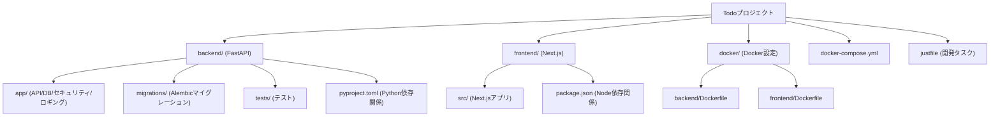

# クイックスタート

<cite>
**このドキュメントで参照されるファイル**
- [README.md](file://README.md)
- [SPECIFICATION.md](file://SPECIFICATION.md)
- [docker-compose.yml](file://docker-compose.yml)
- [justfile](file://justfile)
- [backend/pyproject.toml](file://backend/pyproject.toml)
- [frontend/package.json](file://frontend/package.json)
- [backend/app/core/config.py](file://backend/app/core/config.py)
- [backend/alembic.ini](file://backend/alembic.ini)
- [docker/backend/Dockerfile](file://docker/backend/Dockerfile)
- [docker/frontend/Dockerfile](file://docker/frontend/Dockerfile)
</cite>

## 目次
1. [はじめに](#はじめに)
2. [プロジェクト構造](#プロジェクト構造)
3. [前提条件](#前提条件)
4. [Dockerコンテナ化された開発環境の起動手順](#dockerコンテナ化された開発環境の起動手順)
5. [ローカル開発環境のセットアップ方法](#ローカル開発環境のセットアップ方法)
6. [justコマンドの使用方法](#justコマンドの使用方法)
7. [環境変数の設定](#環境変数の設定)
8. [初回起動時の注意点](#初回起動時の注意点)
9. [基本的な使用例](#基本的な使用例)
10. [トラブルシューティング](#トラブルシューティング)
11. [結論](#結論)

## はじめに
本プロジェクトは、FastAPI（バックエンド）、Next.js（フロントエンド）、PostgreSQL（データベース）を用いたモダンなTodoアプリケーションです。Dockerコンテナ化された開発環境を提供しており、すぐに動作確認できます。本ガイドでは、インストール手順、セットアップ手順、必要条件、justコマンドの使い方、環境変数の設定、初回起動時の注意点、そして基本的な使用例について詳しく説明します。

## プロジェクト構造
全体のプロジェクト構造は以下の通りです。バックエンド（FastAPI）、フロントエンド（Next.js）、Dockerコンテナ、開発支援ツール（just）が分離されています。

```mermaid
graph TB
A["Todoプロジェクト"] --> B["backend/ (FastAPI)"]
A --> C["frontend/ (Next.js)"]
A --> D["docker/ (Docker設定)"]
A --> E["docker-compose.yml"]
A --> F["justfile (開発タスク)"]
B --> B1["app/ (API/DB/セキュリティ/ロギング)"]
B --> B2["migrations/ (Alembicマイグレーション)"]
B --> B3["tests/ (テスト)"]
B --> B4["pyproject.toml (Python依存関係)"]
C --> C1["src/ (Next.jsアプリ)"]
C --> C2["package.json (Node依存関係)"]
D --> D1["backend/Dockerfile"]
D --> D2["frontend/Dockerfile"]
```

**図の出典**
- [SPECIFICATION.md:101-115](file://SPECIFICATION.md#L101-L115)
- [README.md:218-242](file://README.md#L218-L242)

**節の出典**
- [SPECIFICATION.md:101-115](file://SPECIFICATION.md#L101-L115)
- [README.md:218-242](file://README.md#L218-L242)

## 前提条件
動作させるために必要なソフトウェアとツールを以下に示します。

- Docker および Docker Compose
- Bun（フロントエンド開発用）
- Python 3.10 以上および uv（バックエンド開発用）
- Jujutsu（jj）バージョン管理ツール

これらの前提条件が整っていれば、Dockerコンテナ経由での起動またはローカルでの直接起動が可能です。

**節の出典**
- [README.md:145-150](file://README.md#L145-L150)
- [SPECIFICATION.md:8-27](file://SPECIFICATION.md#L8-L27)

## Dockerコンテナ化された開発環境の起動手順
Dockerコンテナ化された開発環境を起動するには、以下の手順を実施します。

1. **リポジトリのクローンとディレクトリ移動**
   - [README.md:154-158](file://README.md#L154-L158)

2. **環境変数の設定**
   - .env.exampleを.envにコピーし、必要に応じて編集します。
   - [README.md:160-164](file://README.md#L160-L164)

3. **全サービスの起動**
   - just upでDockerコンテナを起動します。
   - [README.md:166-169](file://README.md#L166-L169)

4. **アプリケーションへのアクセス**
   - フロントエンド: http://localhost:3000
   - バックエンドAPI: http://localhost:8000
   - APIドキュメント: http://localhost:8000/docs
   - [README.md:171-174](file://README.md#L171-L174)

5. **ログの確認**
   - just logsでコンテナのログを確認できます。
   - [README.md:176-179](file://README.md#L176-L179)

6. **サービスの停止**
   - just downでコンテナを停止します。
   - [README.md:181-184](file://README.md#L181-L184)

**節の出典**
- [README.md:154-184](file://README.md#L154-L184)

## ローカル開発環境のセットアップ方法
Dockerを使わず、ローカル環境でバックエンドとフロントエンドをそれぞれ起動する方法を以下に示します。

- **バックエンド（FastAPI）**
  - backendディレクトリに移動し、uv syncで依存関係をインストールします。
  - その後、just backend-devまたはuv run uvicorn ...で開発サーバーを起動します。
  - [README.md:188-200](file://README.md#L188-L200)

- **フロントエンド（Next.js）**
  - frontendディレクトリに移動し、bun installで依存関係をインストールします。
  - その後、just frontend-devまたはbun devで開発サーバーを起動します。
  - [README.md:202-214](file://README.md#L202-L214)

**節の出典**
- [README.md:188-214](file://README.md#L188-L214)

## justコマンドの使用方法
開発を効率的に行うためのjustコマンドの一覧を以下に示します。

- **DBのみ起動**
  - just up: Docker ComposeでDBサービスを起動します。
  - [justfile:4-5](file://justfile#L4-L5)

- **開発環境一括起動（DB＋バックエンド＋フロントエンド）**
  - just dev: DB、バックエンド、フロントエンドを同時に起動します。
  - [justfile:8-15](file://justfile#L8-L15)

- **各サービスのログ表示**
  - just db-logs: DBコンテナのログを表示します。
  - just backend-logs: バックエンドコンテナのログを表示します。
  - just frontend-logs: フロントエンドコンテナのログを表示します。
  - [justfile:18-27](file://justfile#L18-L27)

- **ローカル開発用起動**
  - just backend-dev: uvでバックエンドをローカル起動します。
  - just frontend-dev: bunでフロントエンドをローカル起動します。
  - [justfile:29-35](file://justfile#L29-L35)

- **データベースリセット**
  - just clean-db: DBコンテナを停止し、ボリュームごと削除して再起動します。
  - [justfile:38-40](file://justfile#L38-L40)

- **マイグレーション管理（Alembic）**
  - just db-migrate: 最新バージョンへマイグレーションを適用します。
  - just db-rollback: 1つ前のバージョンへロールバックします。
  - just db-revision: 新しいマイグレーションファイルを作成します（MESSAGE引数が必要）。
  - just db-version: 現在のマイグレーションバージョンを表示します。
  - just db-history: マイグレーション履歴を表示します。
  - [justfile:42-64](file://justfile#L42-L64)

- **プロジェクト状態確認**
  - just status: Docker Composeで起動中のサービスを確認します。
  - [justfile:67-69](file://justfile#L67-L69)

**節の出典**
- [justfile:1-69](file://justfile#L1-L69)

## 環境変数の設定
環境変数は.backend/app/core/config.pyで定義されており、.envファイルから読み込まれます。以下に主な設定項目を示します。

- **データベース接続情報**
  - POSTGRES_USER: PostgreSQLのユーザー名
  - POSTGRES_PASSWORD: PostgreSQLのパスワード
  - POSTGRES_SERVER: PostgreSQLのホスト
  - POSTGRES_PORT: PostgreSQLのポート
  - POSTGRES_DB: 使用するデータベース名
  - DATABASE_URL: 明示的な接続文字列（任意）

- **JWT設定**
  - SECRET_KEY: JWT署名に使用するシークレットキー
  - ALGORITHM: JWTアルゴリズム（デフォルト: HS256）
  - ACCESS_TOKEN_EXPIRE_MINUTES: トークンの有効期限（分）

- **CORS設定**
  - BACKEND_CORS_ORIGINS: 許可するオリジン（例: localhost:3000, localhost:8000）

- **レート制限設定**
  - RATE_LIMIT_DEFAULT: 通常のAPIレート（例: 100/minute）
  - RATE_LIMIT_LOGIN: ログインエンドポイントのレート（例: 5/minute）
  - RATE_LIMIT_REGISTER: 登録エンドポイントのレート（例: 5/minute）
  - RATE_LIMIT_FORGOT_PASSWORD: パスワードリセットリクエストのレート（例: 3/hour）
  - RATE_LIMIT_RESET_PASSWORD: トークンリセットエンドポイントのレート（例: 5/minute）

- **メール設定**
  - SMTP_HOST: SMTPサーバー
  - SMTP_PORT: SMTPポート
  - SMTP_USER: SMTPユーザー
  - SMTP_PASSWORD: SMTPパスワード
  - SMTP_TLS: TLSを使用するか（true/false）
  - SMTP_SSL: SSLを使用するか（true/false）
  - MAIL_FROM: 送信元メールアドレス
  - MAIL_FROM_NAME: 送信元名前

- **フロントエンドURL**
  - FRONTEND_URL: パスワードリセットリンクなどに使用されるフロントエンドのベースURL

- **パスワードリセットトークンの有効期限**
  - RESET_TOKEN_EXPIRE_HOURS: トークンの有効時間（時間）

- **環境ファイルの場所**
  - .envファイルはプロジェクトルートに配置され、Settingsクラスによって読み込まれます。
  - [backend/app/core/config.py:85-88](file://backend/app/core/config.py#L85-L88)

**節の出典**
- [backend/app/core/config.py:1-91](file://backend/app/core/config.py#L1-L91)

## 初回起動時の注意点
初回起動時には以下の点にご注意ください。

- **データベースのマイグレーション**
  - Dockerコンテナ起動後、データベーススキーマを適用するためにAlembicのマイグレーションを実行する必要があります。
  - [justfile:42-44](file://justfile#L42-L44)

- **メールサーバーの利用**
  - 開発中はMailpitが起動しており、SMTP経由のメール送信を行うことができます。
  - [docker-compose.yml:14-25](file://docker-compose.yml#L14-L25)

- **ポートの競合**
  - 既にポート8000（バックエンド）や3000（フロントエンド）が使用されている場合は、起動前に解放してください。
  - [README.md:171-174](file://README.md#L171-L174)

- **CORS設定**
  - 本番環境ではBACKEND_CORS_ORIGINSを厳密に設定し、開発環境でのみ許可するオリジンを指定してください。
  - [backend/app/core/config.py:56-60](file://backend/app/core/config.py#L56-L60)

**節の出典**
- [docker-compose.yml:14-25](file://docker-compose.yml#L14-L25)
- [justfile:42-44](file://justfile#L42-L44)
- [README.md:171-174](file://README.md#L171-L174)
- [backend/app/core/config.py:56-60](file://backend/app/core/config.py#L56-L60)

## 基本的な使用例
以下は、アプリケーションの基本的な使用例です。認証とTodo管理の流れを示します。

- **ユーザー登録**
  - 認証エンドポイントのPOST /api/v1/auth/registerを使用して新規ユーザーを登録します。
  - [README.md:130-132](file://README.md#L130-L132)

- **ログイン（トークン取得）**
  - 認証エンドポイントのPOST /api/v1/auth/tokenでJWTアクセストークンを取得します。
  - [README.md:130-132](file://README.md#L130-L132)

- **Todo一覧の取得**
  - トークンをAuthorizationヘッダーに設定して、GET /api/v1/todos/でTodo一覧を取得します。
  - [README.md:134-136](file://README.md#L134-L136)

- **Todoの作成・更新・削除**
  - POST /api/v1/todos/で新規作成、PUT /api/v1/todos/{id}で更新、DELETE /api/v1/todos/{id}で削除します。
  - [README.md:136-138](file://README.md#L136-L138)

- **ヘルスチェック**
  - GET /healthでシステムのヘルス状態を確認できます。
  - [README.md:140-141](file://README.md#L140-L141)

**節の出典**
- [README.md:130-141](file://README.md#L130-L141)

## トラブルシューティング
開発中に起こりやすい問題とその対処法を以下に示します。

- **Dockerコンテナの起動に失敗する**
  - Docker Composeのサービス状態を確認し、エラー内容をログから把握します。
  - [justfile:67-69](file://justfile#L67-L69)

- **データベース接続エラー**
  - 環境変数のDB接続情報（POSTGRES_USER、POSTGRES_PASSWORD、POSTGRES_SERVER、POSTGRES_PORT、POSTGRES_DB）が正しいか確認してください。
  - [backend/app/core/config.py:36-48](file://backend/app/core/config.py#L36-L48)

- **JWTトークンの認証エラー**
  - SECRET_KEYが適切に設定されており、ACCESS_TOKEN_EXPIRE_MINUTESの値が適切か確認してください。
  - [backend/app/core/config.py:51-53](file://backend/app/core/config.py#L51-L53)

- **CORSエラー**
  - BACKEND_CORS_ORIGINSにフロントエンドのオリジン（例: localhost:3000）が含まれているか確認してください。
  - [backend/app/core/config.py:56-60](file://backend/app/core/config.py#L56-L60)

- **レート制限エラー**
  - RATE_LIMIT_DEFAULT、RATE_LIMIT_LOGIN、RATE_LIMIT_REGISTERなどの設定値が適切か確認し、必要に応じて調整してください。
  - [backend/app/core/config.py:62-67](file://backend/app/core/config.py#L62-L67)

- **メール送信の問題**
  - SMTP設定（SMTP_HOST、SMTP_PORT、SMTP_USER、SMTP_PASSWORD、SMTP_TLS、SMTP_SSL）が正しいか確認し、Mailpitが起動しているか確認してください。
  - [docker-compose.yml:14-25](file://docker-compose.yml#L14-L25)
  - [backend/app/core/config.py:69-77](file://backend/app/core/config.py#L69-L77)

**節の出典**
- [backend/app/core/config.py:36-77](file://backend/app/core/config.py#L36-L77)
- [docker-compose.yml:14-25](file://docker-compose.yml#L14-L25)
- [justfile:67-69](file://justfile#L67-L69)

## 結論
本ガイドでは、Dockerコンテナ化された開発環境の起動手順、ローカル開発環境のセットアップ方法、justコマンドの使用方法、環境変数の設定、初回起動時の注意点、そして基本的な使用例について説明しました。これらの手順に従ってセットアップすることで、すぐにTodoアプリケーションを動作させ、開発を開始することが可能です。問題が発生した場合は、トラブルシューティングの項を参考にしてください。