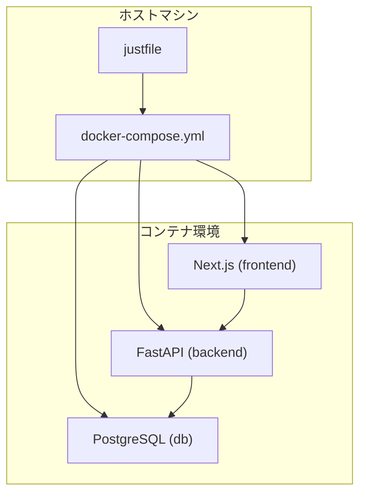
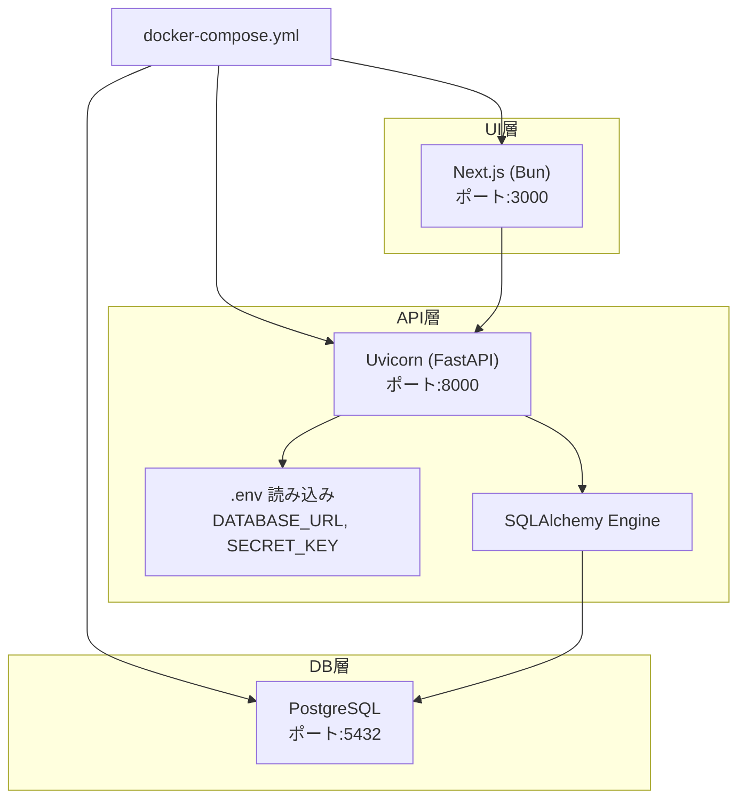
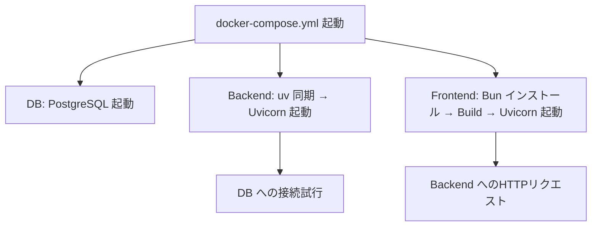
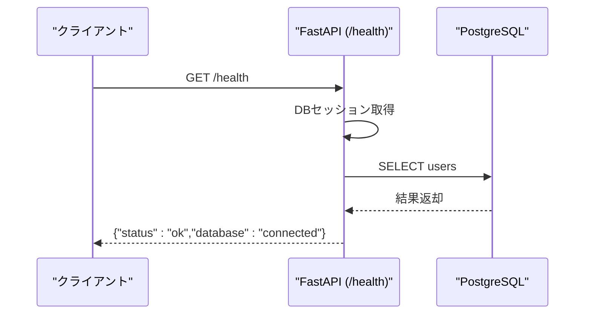

# クイックスタートガイド

<cite>
**このドキュメントで参照されるファイル**
- [docker-compose.yml](file://docker-compose.yml)
- [justfile](file://justfile)
- [backend/Dockerfile](file://docker/backend/Dockerfile)
- [frontend/Dockerfile](file://docker/frontend/Dockerfile)
- [backend/pyproject.toml](file://backend/pyproject.toml)
- [frontend/package.json](file://frontend/package.json)
- [backend/app/config.py](file://backend/app/config.py)
- [backend/app/database.py](file://backend/app/database.py)
- [backend/app/main.py](file://backend/app/main.py)
- [backend/app/models.py](file://backend/app/models.py)
- [backend/main.py](file://backend/main.py)
- [frontend/README.md](file://frontend/README.md)
</cite>

## 目次
1. [はじめに](#はじめに)
2. [プロジェクト構造](#プロジェクト構造)
3. [コアコンポーネント](#コアコンポーネント)
4. [アーキテクチャ概観](#アーキテクチャ概観)
5. [詳細コンポーネント解析](#詳細コンポーネント解析)
6. [依存関係解析](#依存関係解析)
7. [パフォーマンスに関する考慮事項](#パフォーマンスに関する考慮事項)
8. [トラブルシューティングガイド](#トラブルシューティングガイド)
9. [結論](#結論)
10. [付録](#付録)

## はじめに
本ガイドでは、Todoプロジェクトを迅速にセットアップ・起動し、ローカルで開発を開始するための手順を提供します。Docker Composeによるコンテナ環境構築、Python仮想環境の作成、Node.jsパッケージのインストール、データベースの初期化、そしてバックエンド・フロントエンドそれぞれの開発サーバー起動までを網羅的に説明します。また、各ステップで発生しやすいエラーとその解決法、環境変数の設定方法、ポート番号の確認方法も含まれています。

## プロジェクト構造
プロジェクトは以下の3つの主要な部分で構成されています：
- Docker Compose：PostgreSQL、バックエンド、フロントエンドの3サービスを定義し、ポートマッピングや依存関係を管理します。
- Backend（Python/FastAPI）：SQLAlchemy ORM、Pydantic Settings、UvicornによるAPIサーバー。
- Frontend（Next.js/Bun）：Next.jsアプリケーション、Bunによるビルド・開発サーバー。

**図の出典**
- [docker-compose.yml:1-37](file://docker-compose.yml#L1-L37)
- [justfile:1-38](file://justfile#L1-L38)

**節の出典**
- [docker-compose.yml:1-37](file://docker-compose.yml#L1-L37)
- [justfile:1-38](file://justfile#L1-L38)

## コアコンポーネント
- Docker Compose：DB、バックエンド、フロントエンドの3サービスを定義。DBはPostgreSQL 16、バックエンドはPython 3.10、フロントエンドはBunイメージを使用。ポートはそれぞれ5432（DB）、8000（バックエンド）、3000（フロントエンド）にマッピング。
- Backend（Python）：FastAPI + SQLAlchemy + Uvicorn。設定はPydantic Settingsで.envから読み込み。DB接続はSQLAlchemy Engine経由。
- Frontend（Next.js）：Next.js 16、TypeScript、TailwindCSS。開発サーバーはBunで起動。

**節の出典**
- [docker-compose.yml:1-37](file://docker-compose.yml#L1-L37)
- [backend/app/config.py:1-12](file://backend/app/config.py#L1-L12)
- [backend/app/database.py:1-17](file://backend/app/database.py#L1-L17)
- [backend/app/main.py:1-23](file://backend/app/main.py#L1-L23)
- [frontend/package.json:1-35](file://frontend/package.json#L1-L35)

## アーキテクチャ概観
下図は、Docker Composeによるサービス間の依存関係と通信フローを示します。

**図の出典**
- [docker-compose.yml:1-37](file://docker-compose.yml#L1-L37)
- [backend/app/config.py:1-12](file://backend/app/config.py#L1-L12)
- [backend/app/database.py:1-17](file://backend/app/database.py#L1-L17)
- [backend/app/main.py:1-23](file://backend/app/main.py#L1-L23)

## 詳細コンポーネント解析

### Docker Composeの設定
- DBサービス：PostgreSQL 16、永続ボリュームpostgres_data、環境変数POSTGRES_USER/PASSWORD/DBを経由して認証情報を渡す。
- Backendサービス：uvによるPythonパッケージ同期、Uvicornで8000番ポートで公開。依存先としてDBを指定。
- Frontendサービス：Bunによるビルド・起動、3000番ポートで公開。依存先としてBackendを指定。

**図の出典**
- [docker-compose.yml:1-37](file://docker-compose.yml#L1-L37)
- [backend/app/main.py:15-22](file://backend/app/main.py#L15-L22)

**節の出典**
- [docker-compose.yml:1-37](file://docker-compose.yml#L1-L37)

### Backend（Python/FastAPI）
- 設定：Pydantic Settingsにより.envからDATABASE_URL、SECRET_KEYを読み込みます。
- DB接続：SQLAlchemy Engine + SessionLocal、get_db()でDI。
- 初期化：開発用にテーブルを自動作成（Alembic導入前）。
- エンドポイント：ルートパスと/health（DB接続確認）。

**図の出典**
- [backend/app/main.py:15-22](file://backend/app/main.py#L15-L22)
- [backend/app/database.py:11-16](file://backend/app/database.py#L11-L16)

**節の出典**
- [backend/app/config.py:1-12](file://backend/app/config.py#L1-L12)
- [backend/app/database.py:1-17](file://backend/app/database.py#L1-L17)
- [backend/app/main.py:1-23](file://backend/app/main.py#L1-L23)
- [backend/app/models.py:1-22](file://backend/app/models.py#L1-L22)

### Frontend（Next.js/Bun）
- 開発サーバー：Bunで起動（ポート3000）。Next.jsの開発フローに従い、app/page.tsxを編集すると自動更新。
- 依存関係：package.jsonにNext.js、React、TypeScript、TailwindCSSなどの依存が記述。

**節の出典**
- [frontend/package.json:1-35](file://frontend/package.json#L1-L35)
- [frontend/README.md:1-37](file://frontend/README.md#L1-L37)

## 依存関係解析
- BackendはPostgreSQLに依存し、DB接続文字列（DATABASE_URL）を.envから取得。
- FrontendはBackend APIに依存し、Next.jsの開発サーバーが3000番ポートで待ち受け。
- Docker Composeはサービス間の依存関係（depends_on）とポートマッピングを管理。

**図の出典**
- [docker-compose.yml:14-33](file://docker-compose.yml#L14-L33)
- [backend/app/config.py:4](file://backend/app/config.py#L4)

**節の出典**
- [docker-compose.yml:1-37](file://docker-compose.yml#L1-L37)

## パフォーマンスに関する考慮事項
- Dockerイメージのビルド：uv（Python）とBun（Node）を使用することで、依存パッケージのインストール・同期が高速化されます。
- 開発時の再読み込み：Backend（Uvicorn）とFrontend（Next.js/Bun）は再読み込み機能により、変更を即時に反映できます。
- DB接続：SQLAlchemyのEngineとSessionLocalを適切に使用し、不要な接続を避けることで、接続プールの効率を高められます。

## トラブルシューティングガイド

### 環境変数の設定
- Backendの設定は.envから読み込まれます。必須項目はDATABASE_URLとSECRET_KEYです。設定ファイルの場所は以下です：
  - [backend/app/config.py:9](file://backend/app/config.py#L9)
- Docker Composeでは環境変数がサービスに渡されています。以下のキーが利用可能です：
  - POSTGRES_USER, POSTGRES_PASSWORD, POSTGRES_DB（DB）
  - DATABASE_URL, SECRET_KEY（Backend）

**節の出典**
- [backend/app/config.py:1-12](file://backend/app/config.py#L1-L12)
- [docker-compose.yml:5-22](file://docker-compose.yml#L5-L22)

### ポート番号の確認方法
- DB: 5432（ホスト:コンテナ）
- Backend: 8000（ホスト:コンテナ）
- Frontend: 3000（ホスト:コンテナ）
- 確認コマンド例：
  - Docker Composeのサービス状態：[justfile:36-37](file://justfile#L36-L37)
  - 各サービスのログ表示：
    - 全体ログ：[justfile:11-13](file://justfile#L11-L13)
    - DBログ：[justfile:15-17](file://justfile#L15-L17)
    - Backendログ：[justfile:19-21](file://justfile#L19-L21)
    - Frontendログ：[justfile:23-25](file://justfile#L23-L25)

**節の出典**
- [docker-compose.yml:9-31](file://docker-compose.yml#L9-L31)
- [justfile:11-25](file://justfile#L11-L25)

### 一般的なエラーと解決法
- DB接続失敗（Backend）：
  - 症状：/healthエンドポイントでdatabaseエラーが返る。
  - 原因：DATABASE_URLが不正、DBが起動していない、ネットワーク設定ミス。
  - 対処：Docker ComposeのDBサービスを確認し、DBが5432番ポートで起動しているか確認。Backendの.envのDATABASE_URLを修正。
  - 参考：[backend/app/main.py:15-22](file://backend/app/main.py#L15-L22)
- DB初期化（開発時）：
  - 症状：テーブルが存在しないエラー。
  - 原因：Alembic未導入のため、開発用にcreate_allで作成。
  - 対処：Backend起動時に自動作成されるため、DBが起動後に再度アクセスしてください。
  - 参考：[backend/app/main.py:6-7](file://backend/app/main.py#L6-L7)
- Frontend起動エラー：
  - 症状：3000番ポートが使用中、またはNext.jsの開発サーバーが起動しない。
  - 原因：他のプロセスが3000番ポートを使用している、Bunの依存パッケージが不足している。
  - 対処：ポートの競合を解消し、frontendディレクトリでBunの依存をインストール後、再度起動。
  - 参考：[frontend/package.json:5-14](file://frontend/package.json#L5-L14)
- Dockerビルドエラー：
  - 症状：uvまたはBunのインストールに失敗。
  - 原因：ネットワーク環境、キャッシュ、権限。
  - 対処：インターネット接続を確認し、必要に応じてイメージキャッシュをクリーンアップして再実行。
  - 参考：[backend/Dockerfile:6](file://docker/backend/Dockerfile#L6), [frontend/Dockerfile:4](file://docker/frontend/Dockerfile#L4)

## 結論
本ガイドでは、Docker Compose、Python仮想環境、Node.jsパッケージ、データベース、開発サーバーの起動までの一連の流れを説明しました。環境変数の設定、ポート番号の確認、そしてよくあるエラーとその対処法についても記載しています。これらの手順に従って、すぐに開発を始めることができます。

## 付録

### Docker Composeによる一括起動
- 全サービス起動（バックグラウンド＋再ビルド）：
  - [justfile:4-5](file://justfile#L4-L5)
- 全サービス停止：
  - [justfile:7-9](file://justfile#L7-L9)
- サービス状態確認：
  - [justfile:36-37](file://justfile#L36-L37)

### 開発サーバー起動（ローカル）
- Backend（uv + Uvicorn）：
  - [justfile:27-29](file://justfile#L27-L29)
- Frontend（Bun）：
  - [justfile:31-33](file://justfile#L31-L33)

### Backendの依存パッケージ
- Pythonパッケージ定義：
  - [backend/pyproject.toml:7-16](file://backend/pyproject.toml#L7-L16)

### Frontendの依存パッケージ
- Node.jsパッケージ定義：
  - [frontend/package.json:11-25](file://frontend/package.json#L11-L25)