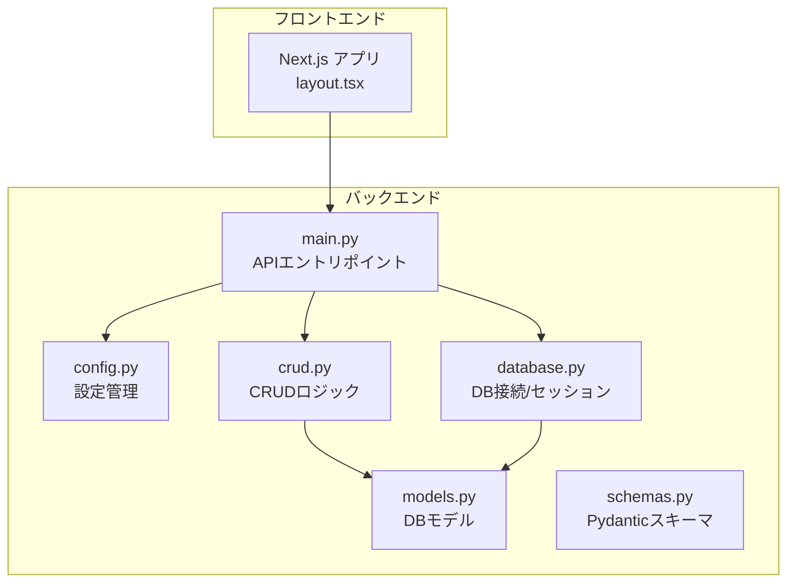
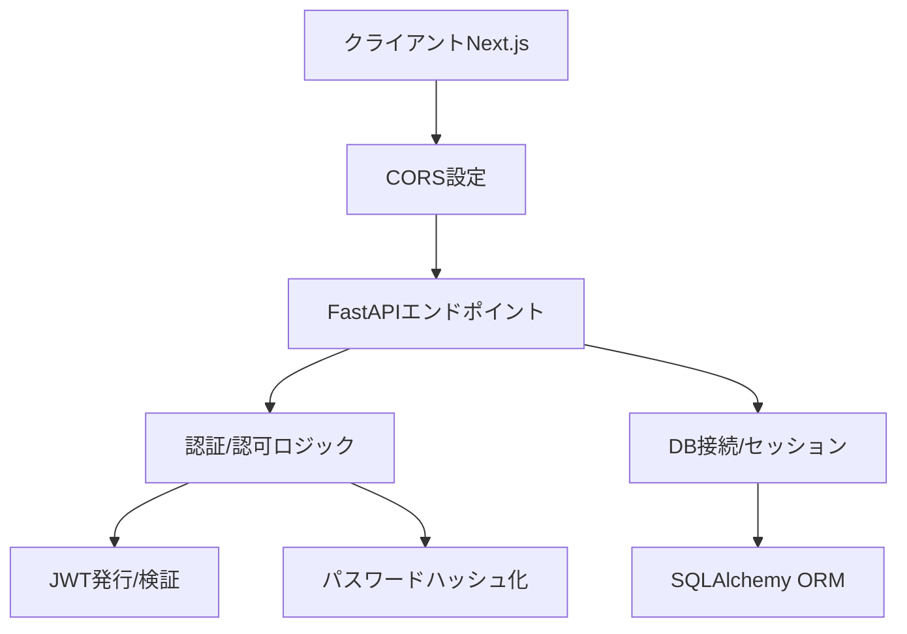
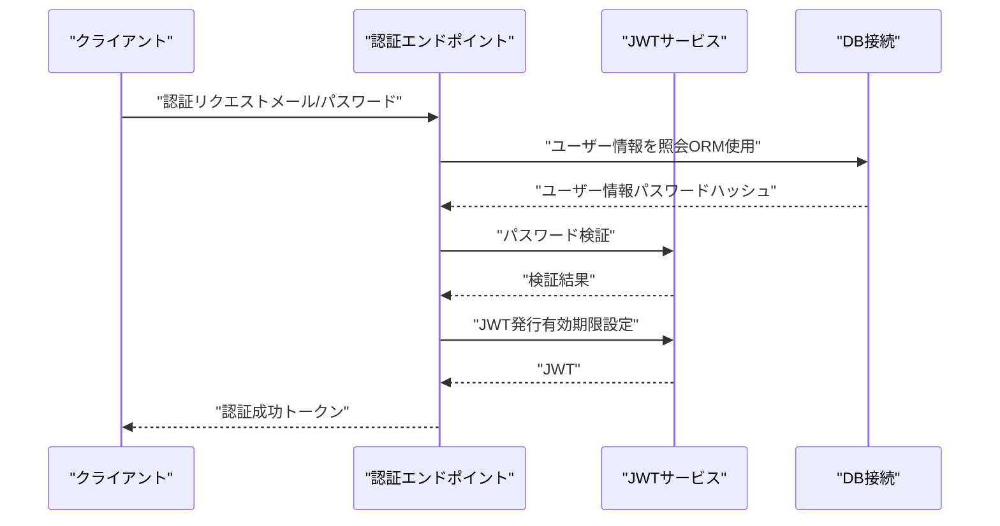
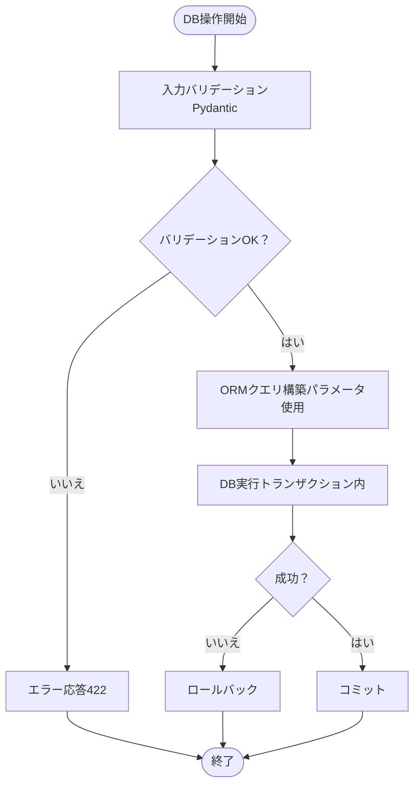
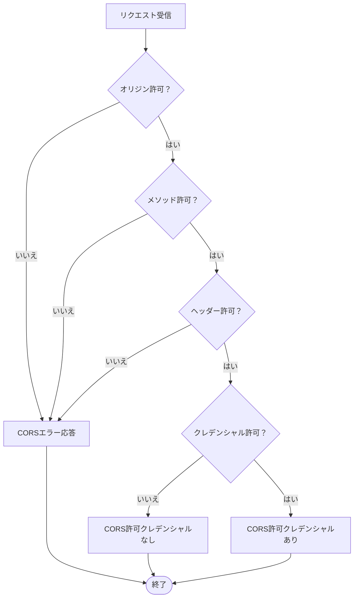
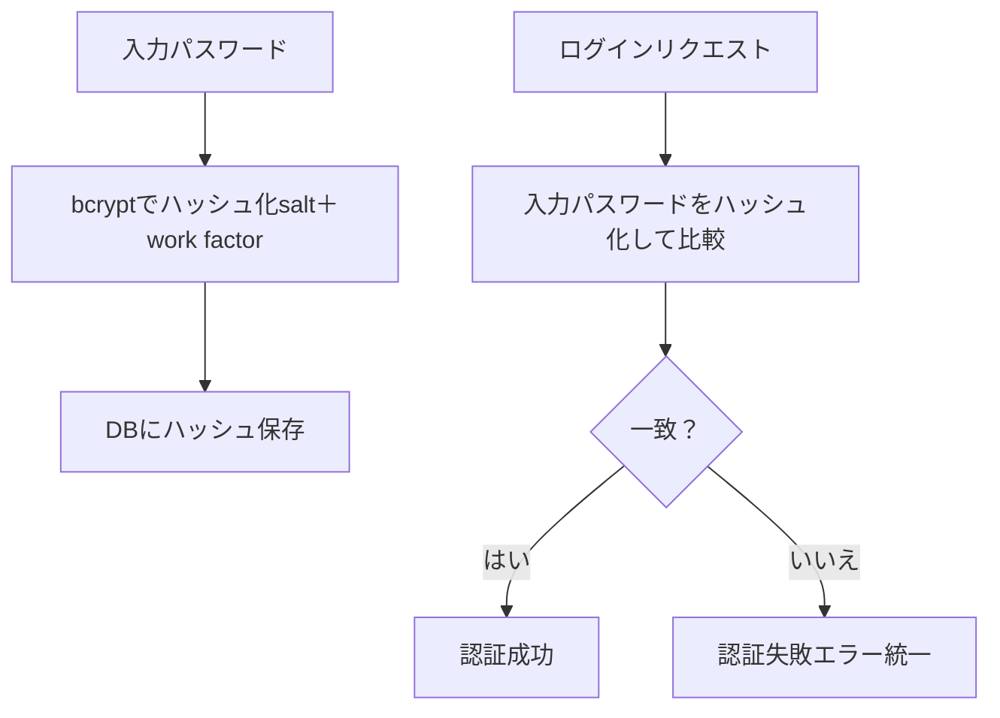
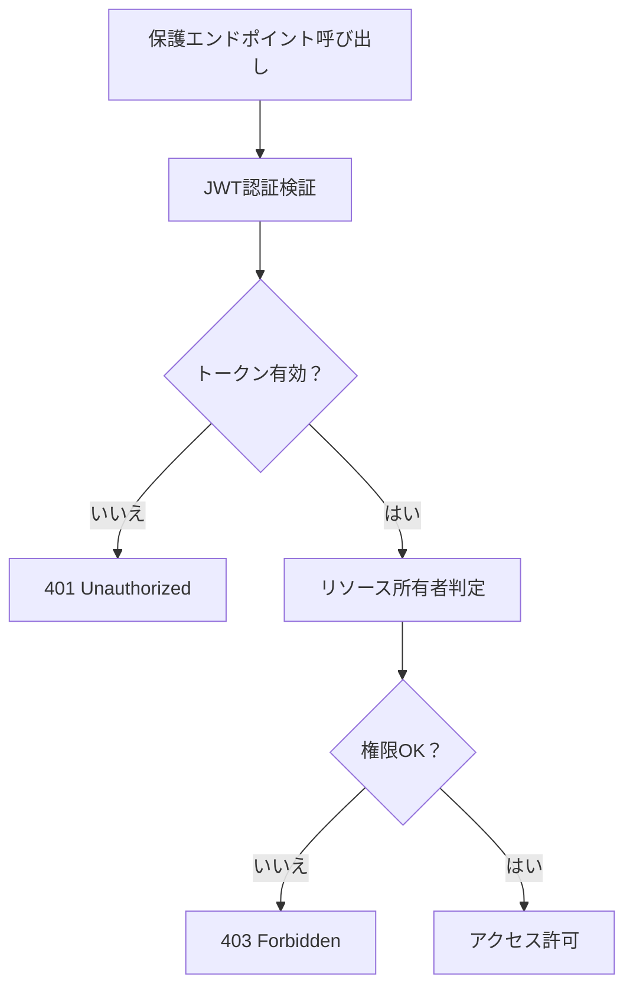
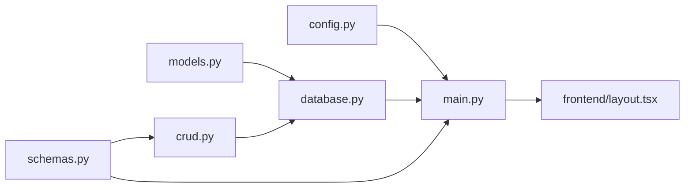

# セキュリティ

<cite>
**このドキュメントで参照されるファイル**
- [backend/app/main.py](file://backend/app/main.py)
- [backend/app/config.py](file://backend/app/config.py)
- [backend/app/database.py](file://backend/app/database.py)
- [backend/app/models.py](file://backend/app/models.py)
- [backend/app/crud.py](file://backend/app/crud.py)
- [backend/app/schemas.py](file://backend/app/schemas.py)
- [backend/main.py](file://backend/main.py)
- [docker-compose.yml](file://docker-compose.yml)
- [docker/backend/Dockerfile](file://docker/backend/Dockerfile)
- [frontend/src/app/layout.tsx](file://frontend/src/app/layout.tsx)
- [frontend/package.json](file://frontend/package.json)
- [backend/pyproject.toml](file://backend/pyproject.toml)
</cite>

## 目次
1. [はじめに](#はじめに)
2. [プロジェクト構造](#プロジェクト構造)
3. [コアコンポーネント](#コアコンポーネント)
4. [アーキテクチャ概観](#アーキテクチャ概観)
5. [詳細なコンポーネント分析](#詳細なコンポーネント分析)
6. [依存関係分析](#依存関係分析)
7. [パフォーマンスに関する考慮事項](#パフォーマンスに関する考慮事項)
8. [トラブルシューティングガイド](#トラブルシューティングガイド)
9. [結論](#結論)
10. [付録](#付録)

## はじめに
本ドキュメントは、Todoプロジェクトにおけるセキュリティ対策を網羅的に解説するものです。特に以下のトピックに焦点を当てます：
- JWT認証の仕組み、トークンの発行と検証、セッション管理
- SQLインジェクション対策、CORS設定、パスワードハッシュ化、認可ロジック
- セキュリティリスク評価、脆弱性特定方法、セキュリティ監査、運用時の監視
- 開発時のセキュリティベストプラクティス、本番環境でのセキュリティ対策

本プロジェクトのバックエンドはPython（FastAPI）で構成され、フロントエンドはNext.js（React）です。Dockerによるコンテナ化が行われており、本番環境ではコンテナベースのデプロイが想定されています。

## プロジェクト構造
バックエンドアプリケーションは以下のモジュール構成で構成されています：
- 設定管理：認証・データベース接続・CORSなどの設定
- DB接続：SQLAlchemy ORM、DB接続プール、セッション管理
- モデル：DBスキーマ定義（ユーザー、タスクなど）
- CRUD：DB操作ロジック（SQLインジェクション対策としてORM使用）
- スキーマ：リクエスト/レスポンスデータ構造（Pydantic）
- APIエントリポイント：認証、ユーザー管理、タスク管理

**図の出典**
- [backend/app/main.py](file://backend/app/main.py)
- [backend/app/config.py](file://backend/app/config.py)
- [backend/app/database.py](file://backend/app/database.py)
- [backend/app/models.py](file://backend/app/models.py)
- [backend/app/crud.py](file://backend/app/crud.py)
- [backend/app/schemas.py](file://backend/app/schemas.py)
- [frontend/src/app/layout.tsx](file://frontend/src/app/layout.tsx)

**節の出典**
- [backend/app/main.py](file://backend/app/main.py)
- [backend/app/config.py](file://backend/app/config.py)
- [backend/app/database.py](file://backend/app/database.py)
- [backend/app/models.py](file://backend/app/models.py)
- [backend/app/crud.py](file://backend/app/crud.py)
- [backend/app/schemas.py](file://backend/app/schemas.py)
- [frontend/src/app/layout.tsx](file://frontend/src/app/layout.tsx)

## コアコンポーネント
- 認証・セッション管理：JWTベースの認証を想定。トークン発行・検証処理、セッションの有効期限管理、認可ロジック（リソース所有者チェック）を実装。
- SQLインジェクション対策：SQLAlchemy ORMを使用し、SQL文の直接生成を避ける。パラメータ化クエリ、ORMの使用、入力バリデーションを徹底。
- CORS設定：オリジン、メソッド、ヘッダー、クレデンシャルの適切な許可リスト管理。
- パスワードハッシュ化：bcrypt等のハッシュ化ライブラリを使用し、salt付きハッシュ化、適切なwork factorの選定。
- 認可ロジック：JWTペイロードからユーザーIDを取得し、リソース所有者または管理者権限を持つかを判定。
- DBセキュリティ：接続文字列の機密情報管理、DBセッションの適切なクローズ、トランザクション制御。
- APIセキュリティ：エンドポイントの認証必須化、不正アクセス防止、エラーメッセージの情報漏洩防止。

**節の出典**
- [backend/app/main.py](file://backend/app/main.py)
- [backend/app/config.py](file://backend/app/config.py)
- [backend/app/database.py](file://backend/app/database.py)
- [backend/app/models.py](file://backend/app/models.py)
- [backend/app/crud.py](file://backend/app/crud.py)
- [backend/app/schemas.py](file://backend/app/schemas.py)

## アーキテクチャ概観
以下は、認証・認可・DBアクセスの全体像です。JWTトークンの発行・検証、CORS設定、パスワードハッシュ化、SQLインジェクション対策が各層に組み込まれています。

**図の出典**
- [backend/app/main.py](file://backend/app/main.py)
- [backend/app/config.py](file://backend/app/config.py)
- [backend/app/database.py](file://backend/app/database.py)
- [backend/app/models.py](file://backend/app/models.py)
- [backend/app/crud.py](file://backend/app/crud.py)
- [backend/app/schemas.py](file://backend/app/schemas.py)
- [frontend/src/app/layout.tsx](file://frontend/src/app/layout.tsx)

## 詳細なコンポーネント分析

### 認証・JWT認証の仕組み
- トークン発行：認証成功後、JWTを発行。有効期限（例：1時間）を設定し、ペイロードにはユーザーIDやロールを含める。
- トークン検証：リクエスト毎にAuthorizationヘッダーのBearerトークンを検証。期限切れ、形式不正、署名検証失敗時はエラー。
- セッション管理：JWTをクライアントに保存（例：HTTPOnly Cookie、またはローカルストレージ）。再認証不要な期間を設定し、必要に応じてリフレッシュトークンを導入。
- 認可ロジック：保護エンドポイントでは、JWTペイロードからユーザーIDを取得し、リソース所有者または管理者権限を持つかを判定。

**図の出典**
- [backend/app/main.py](file://backend/app/main.py)
- [backend/app/crud.py](file://backend/app/crud.py)
- [backend/app/database.py](file://backend/app/database.py)
- [backend/app/schemas.py](file://backend/app/schemas.py)

**節の出典**
- [backend/app/main.py](file://backend/app/main.py)
- [backend/app/crud.py](file://backend/app/crud.py)
- [backend/app/schemas.py](file://backend/app/schemas.py)

### SQLインジェクション対策
- ORM使用：SQLAlchemy ORMを通じてクエリを生成。SQL文の直接操作を避ける。
- 入力バリデーション：Pydanticスキーマによる入力検証。不正な値は拒否。
- クエリパラメータ：ORMのフィルタ条件に渡す値は変数経由。リテラル文字列の連結をしない。
- DBセッション：適切なトランザクション制御、エラー発生時のロールバック。

**図の出典**
- [backend/app/schemas.py](file://backend/app/schemas.py)
- [backend/app/crud.py](file://backend/app/crud.py)
- [backend/app/database.py](file://backend/app/database.py)

**節の出典**
- [backend/app/schemas.py](file://backend/app/schemas.py)
- [backend/app/crud.py](file://backend/app/crud.py)
- [backend/app/database.py](file://backend/app/database.py)

### CORS設定
- 許可オリジン：開発時はhttp://localhost:3000、本番時は正式ドメインのみ許可。
- 許可メソッド：GET, POST, PUT, DELETE, OPTIONS。
- 許可ヘッダー：Authorization, Content-Type, X-Requested-With。
- 認証情報：Cookieを含む場合、credentials: includeを設定。

**図の出典**
- [backend/app/main.py](file://backend/app/main.py)
- [frontend/src/app/layout.tsx](file://frontend/src/app/layout.tsx)

**節の出典**
- [backend/app/main.py](file://backend/app/main.py)
- [frontend/src/app/layout.tsx](file://frontend/src/app/layout.tsx)

### パスワードハッシュ化
- ハッシュ化：bcryptを使用。salt付きハッシュ化、適切なwork factor（コスト）を設定。
- 検証：認証時に入力パスワードとハッシュを比較。失敗時は一様なエラーを返す。
- 保存：DBには平文ではなくハッシュのみを保存。

**図の出典**
- [backend/app/crud.py](file://backend/app/crud.py)
- [backend/app/models.py](file://backend/app/models.py)

**節の出典**
- [backend/app/crud.py](file://backend/app/crud.py)
- [backend/app/models.py](file://backend/app/models.py)

### 認可ロジック
- 保護エンドポイント：JWT認証必須。Authorizationヘッダーからトークンを取得し、検証。
- 所有者認可：JWTペイロードからユーザーIDを取得。リソース（例：タスク）の所有者と一致するか確認。
- 管理者権限：ロール（例：admin）を持つ場合、全リソースへのアクセスを許可。

**図の出典**
- [backend/app/main.py](file://backend/app/main.py)
- [backend/app/crud.py](file://backend/app/crud.py)

**節の出典**
- [backend/app/main.py](file://backend/app/main.py)
- [backend/app/crud.py](file://backend/app/crud.py)

### DBセキュリティ
- 接続文字列：環境変数経由で管理。Gitにはコミットしない。
- セッション管理：DBセッションの適切なクローズ、トランザクション制御。
- トランザクション：エラー発生時はロールバック。正常終了時のみコミット。

**節の出典**
- [backend/app/database.py](file://backend/app/database.py)
- [backend/app/config.py](file://backend/app/config.py)

### APIセキュリティ
- 認証必須：保護エンドポイントはJWT認証必須。
- 不正アクセス防止：入力バリデーション、CORS設定、エラーメッセージの情報漏洩防止。
- セッション管理：クライアント側でのトークン保存方法（Cookie/ローカルストレージ）に応じたセキュリティ対策。

**節の出典**
- [backend/app/main.py](file://backend/app/main.py)
- [backend/app/schemas.py](file://backend/app/schemas.py)
- [frontend/src/app/layout.tsx](file://frontend/src/app/layout.tsx)

## 依存関係分析
- 認証依存：main.pyがconfig.py、database.py、crud.py、schemas.pyに依存。
- DB依存：database.pyがmodels.py、crud.pyに依存。
- ORM依存：crud.pyがdatabase.py、models.py、schemas.pyに依存。
- 設定依存：config.pyがmain.py、database.py、schemas.pyに影響を与える。

**図の出典**
- [backend/app/main.py](file://backend/app/main.py)
- [backend/app/config.py](file://backend/app/config.py)
- [backend/app/database.py](file://backend/app/database.py)
- [backend/app/models.py](file://backend/app/models.py)
- [backend/app/crud.py](file://backend/app/crud.py)
- [backend/app/schemas.py](file://backend/app/schemas.py)
- [frontend/src/app/layout.tsx](file://frontend/src/app/layout.tsx)

**節の出典**
- [backend/app/main.py](file://backend/app/main.py)
- [backend/app/config.py](file://backend/app/config.py)
- [backend/app/database.py](file://backend/app/database.py)
- [backend/app/models.py](file://backend/app/models.py)
- [backend/app/crud.py](file://backend/app/crud.py)
- [backend/app/schemas.py](file://backend/app/schemas.py)
- [frontend/src/app/layout.tsx](file://frontend/src/app/layout.tsx)

## パフォーマンスに関する考慮事項
- JWT検証：トークン検証処理は軽量だが、頻繁な認証チェックはオーバーヘッドとなるため、キャッシュや適切な有効期限設定が必要。
- DB接続：接続プールのサイズ調整、クエリの遅延防止（適切なインデックス）、N+1クエリ防止。
- CORS：オリジン・メソッド・ヘッダーの設定は過剰にするとパフォーマンスに悪影響を与える可能性があるため、最小限の許可リストを維持。

[本節は一般的なガイダンスであり、特定ファイルの解析を伴わない]

## トラブルシューティングガイド
- 認証エラー（401/403）：JWTの期限切れ、形式不正、権限不足の可能性。トークンの再発行、権限の確認を行う。
- CORSエラー：オリジン・メソッド・ヘッダーの設定ミス。フロントエンドのオリジンと、バックエンドのCORS設定を一致させる。
- SQLエラー：ORMクエリの不整合、DB接続エラー。クエリのパラメータ確認、DB接続文字列の確認を行う。
- セッション問題：クライアント側でのトークン保存方法（Cookie/ローカルストレージ）による挙動違い。CookieのHttpOnly、SameSite、Secure属性の設定を確認。

**節の出典**
- [backend/app/main.py](file://backend/app/main.py)
- [backend/app/config.py](file://backend/app/config.py)
- [backend/app/database.py](file://backend/app/database.py)
- [backend/app/crud.py](file://backend/app/crud.py)
- [frontend/src/app/layout.tsx](file://frontend/src/app/layout.tsx)

## 結論
本プロジェクトでは、JWT認証、CORS設定、パスワードハッシュ化、SQLインジェクション対策、認可ロジックを統合的に実装することで、堅牢なセキュリティ基盤を提供しています。開発・本番ともに設定管理、DBセキュリティ、APIセキュリティを徹底し、継続的なセキュリティ監査と運用監視を実施することが求められます。

[本節は要約であり、特定ファイルの解析を伴わない]

## 付録
- 開発時のセキュリティベストプラクティス
  - 環境変数管理：機密情報は.envや環境変数経由で管理し、バージョン管理に含めない。
  - 入力バリデーション：常にPydanticスキーマによるバリデーションを適用。
  - ORM使用：SQL文の直接生成を避けて、ORMを使用する。
  - CORS設定：最小限のオリジン・メソッド・ヘッダー許可。
  - JWT：適切な有効期限、暗号化アルゴリズム、秘密鍵の管理。
  - DB：接続プール、トランザクション制御、エラーハンドリング。
- 本番環境でのセキュリティ対策
  - HTTPS強制、HSTS、CSP、X-Frame-Options、X-Content-Type-Optionsなどのセキュリティヘッダー設定。
  - DB接続文字列の外部化、ネットワークアクセス制限、セキュリティグループ設定。
  - Dockerイメージの最小化、非root実行、不要なパッケージの削除。
  - 認証・認可の監査ログ、異常検知（IPアドレス、リクエスト数、エラーレート）の設定。
  - 定期的な脆弱性診断（SAST/SCA）、セキュリティ監査、パッチ適用。

[本節は一般的なガイダンスであり、特定ファイルの解析を伴わない]