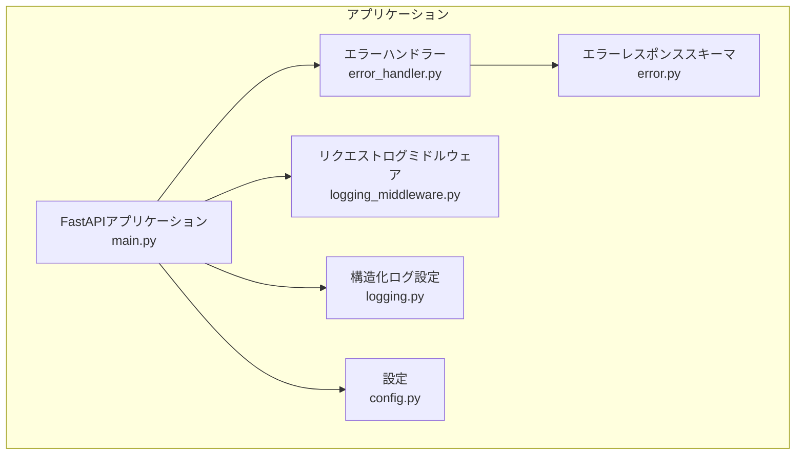
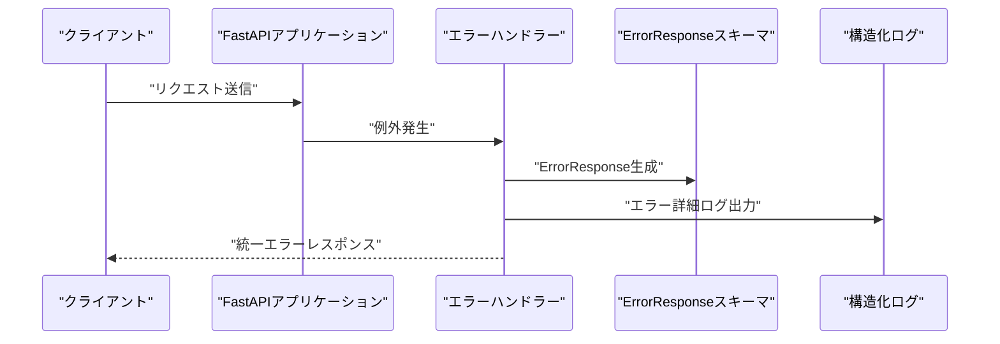
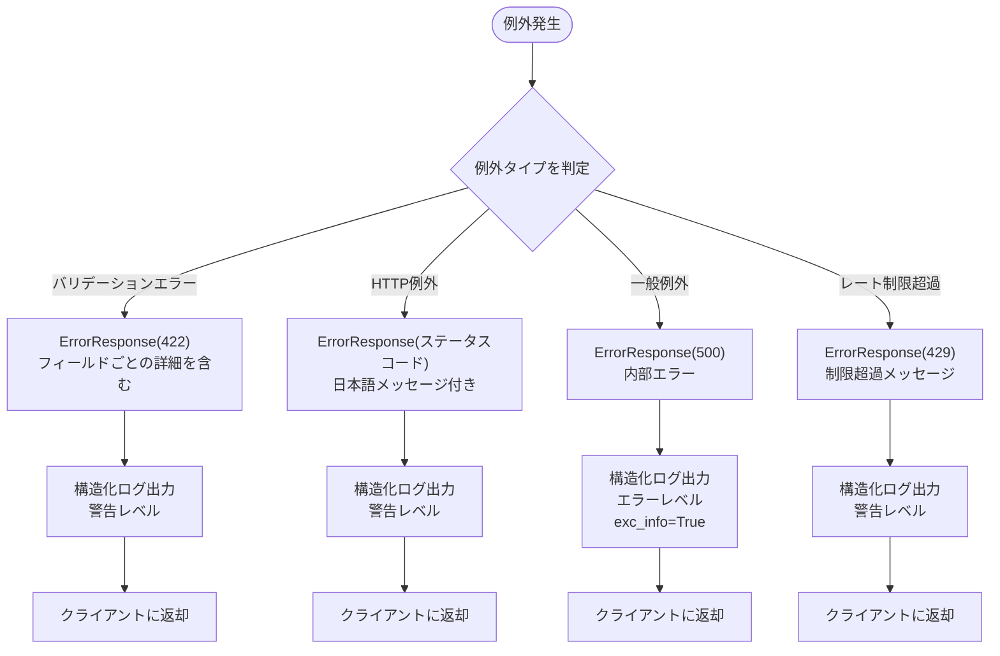
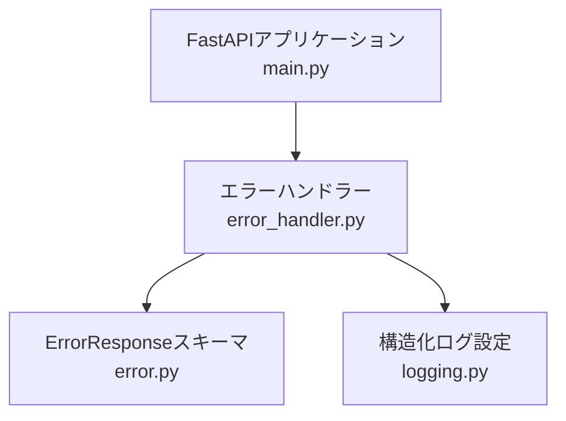

# エラーハンドリングのセキュリティ

<cite>
**この文書で参照されるファイル**   
- [error_handler.py](file://backend/app/middleware/error_handler.py)
- [error.py](file://backend/app/schemas/error.py)
- [logging.py](file://backend/app/core/logging.py)
- [main.py](file://backend/app/main.py)
- [logging_middleware.py](file://backend/app/middleware/logging.py)
- [config.py](file://backend/app/core/config.py)
- [test_errors.py](file://backend/tests/test_errors.py)
</cite>

## 目次
1. [はじめに](#はじめに)
2. [プロジェクト構造](#プロジェクト構造)
3. [コアコンポーネント](#コアコンポーネント)
4. [アーキテクチャ概観](#アーキテクチャ概観)
5. [詳細なコンポーネント分析](#詳細なコンポーネント分析)
6. [依存関係分析](#依存関係分析)
7. [パフォーマンスに関する考慮事項](#パフォーマンスに関する考慮事項)
8. [トラブルシューティングガイド](#トラブルシューティングガイド)
9. [結論](#結論)

## はじめに
本ドキュメントは、Todo APIのエラーハンドリングにおけるセキュリティ対策について解説します。具体的には、例外処理の設計、情報漏洩防止のためのエラーメッセージの制御方法、スタックトレースの非表示処理、セキュリティ上重要なエラーのログ出力、開発時と本番環境でのエラーハンドリングの違い、脆弱性情報の隠蔽策について詳しく述べます。

## プロジェクト構造
バックエンドはFastAPIフレームワークを用いており、エラーハンドリングはミドルウェアと例外ハンドラーによって統一的に処理されています。構造化ログ出力はJSONフォーマットで行われており、本番環境での監視・分析に適した形式となっています。

**図の出典**
- [main.py:49-128](file://backend/app/main.py#L49-L128)
- [error_handler.py:15-148](file://backend/app/middleware/error_handler.py#L15-L148)
- [error.py:5-23](file://backend/app/schemas/error.py#L5-L23)
- [logging.py:6-35](file://backend/app/core/logging.py#L6-L35)
- [logging_middleware.py:10-66](file://backend/app/middleware/logging.py#L10-L66)
- [config.py:4-91](file://backend/app/core/config.py#L4-L91)

**節の出典**
- [main.py:11-26](file://backend/app/main.py#L11-L26)
- [main.py:28-29](file://backend/app/main.py#L28-L29)
- [main.py:49-128](file://backend/app/main.py#L49-L128)

## コアコンポーネント
- 統一エラーレスポンススキーマ：エラーレスポンスの構造を標準化し、クライアント側で一貫した処理が可能になります。
- 例外ハンドラー：バリデーションエラー、HTTP例外、一般例外、レート制限超過など、さまざまな例外を一元的に処理します。
- 構造化ログ：JSON形式でのログ出力により、本番環境での監視・分析が容易になります。
- リクエストログミドルウェア：リクエストの開始・完了・失敗を記録し、処理時間も含めた詳細な情報を提供します。

**節の出典**
- [error.py:5-23](file://backend/app/schemas/error.py#L5-L23)
- [error_handler.py:15-148](file://backend/app/middleware/error_handler.py#L15-L148)
- [logging.py:6-35](file://backend/app/core/logging.py#L6-L35)
- [logging_middleware.py:10-66](file://backend/app/middleware/logging.py#L10-L66)

## アーキテクチャ概観
エラーハンドリングの全体像は以下の通りです。FastAPIの例外ハンドラーが各例外タイプを捕捉し、統一されたErrorResponseスキーマに変換してクライアントに返却します。同時に、構造化ログとして詳細な情報を出力します。

**図の出典**
- [main.py:66-71](file://backend/app/main.py#L66-L71)
- [error_handler.py:15-148](file://backend/app/middleware/error_handler.py#L15-L148)
- [error.py:5-23](file://backend/app/schemas/error.py#L5-L23)
- [logging.py:6-35](file://backend/app/core/logging.py#L6-L35)

## 詳細なコンポーネント分析

### 例外処理の設計
- バリデーションエラー：Pydanticのバリデーションエラーを整形し、フィールド名、エラーメッセージ、入力値を詳細に記録します。
- HTTP例外：HTTPステータスコードに対応した日本語メッセージを提供し、クライアントにわかりやすいエラー内容を伝えます。
- 一般例外：予期しないエラーは500 Internal Server Errorとして安全にクライアントに返却します。
- レート制限超過：APIの過剰リクエストに対するエラーハンドリングを行い、クライアントに適切なメッセージを表示します。

**図の出典**
- [error_handler.py:15-148](file://backend/app/middleware/error_handler.py#L15-L148)
- [error.py:5-23](file://backend/app/schemas/error.py#L5-L23)
- [logging.py:6-35](file://backend/app/core/logging.py#L6-L35)

**節の出典**
- [error_handler.py:15-148](file://backend/app/middleware/error_handler.py#L15-L148)

### 情報漏洩防止のためのエラーメッセージの制御方法
- 公開メッセージ：クライアントに表示されるメッセージは、一般的な日本語メッセージのみを提供し、内部的な技術的詳細は含めません。
- 詳細情報：エラーハンドラーは、構造化ログに詳細な情報を出力する一方で、クライアントには最小限の情報のみを返却します。
- 例外の種類による分岐：バリデーションエラー、HTTP例外、一般例外、レート制限超過それぞれに対して適切なメッセージを提供し、情報漏洩のリスクを低減します。

**節の出典**
- [error_handler.py:15-148](file://backend/app/middleware/error_handler.py#L15-L148)

### スタックトレースの非表示処理
- 一般例外のログ出力：exc_info=Trueを設定することで、スタックトレースを含めた詳細なエラー情報を構造化ログに出力します。ただし、クライアントにはスタックトレースは含まれず、安全なメッセージのみが返却されます。
- リクエストログミドルウェア：例外発生時のログにもexc_info=Trueが使用され、スタックトレースを記録しながら、クライアントには安全なレスポンスを返却します。

**節の出典**
- [error_handler.py:83-92](file://backend/app/middleware/error_handler.py#L83-L92)
- [logging_middleware.py:52-66](file://backend/app/middleware/logging.py#L52-L66)

### セキュリティ上重要なエラーのログ出力
- 構造化ログ：python-json-loggerを使用して、JSON形式でログを出力します。これにより、本番環境での監視・分析が容易になります。
- ログレベル：エラー発生時はERRORレベルでログを出力し、問題の重大度を明確にします。
- 除外項目：クライアントに送信されない情報を含むため、セキュリティ上重要な情報が漏洩するリスクを軽減します。

**節の出典**
- [logging.py:6-35](file://backend/app/core/logging.py#L6-L35)
- [error_handler.py:36-44](file://backend/app/middleware/error_handler.py#L36-L44)
- [error_handler.py:62-71](file://backend/app/middleware/error_handler.py#L62-L71)
- [error_handler.py:83-92](file://backend/app/middleware/error_handler.py#L83-L92)
- [error_handler.py:135-143](file://backend/app/middleware/error_handler.py#L135-L143)

### 開発時と本番環境でのエラーハンドリングの違い
- 環境設定：Settingsクラスにより、開発環境か本番環境かを判別し、異なる振る舞いを提供します。
- CORS設定：本番環境ではBACKEND_CORS_ORIGINSが必須であり、開発環境とは異なる制御が可能です。
- 例外ハンドラー：本番環境では、より安全なエラーメッセージをクライアントに返却し、詳細な内部情報はログにのみ出力するよう設計されています。

**節の出典**
- [config.py:24-33](file://backend/app/core/config.py#L24-L33)
- [config.py:106-107](file://backend/app/core/config.py#L106-L107)
- [main.py:66-71](file://backend/app/main.py#L66-L71)

### 脆弱性情報の隠蔽策
- 入力値の隠蔽：バリデーションエラー時のdetailsには、入力値を含める可能性がありますが、クライアントには最小限の情報のみを返却します。
- 例外の分離：バリデーションエラー、HTTP例外、一般例外、レート制限超過それぞれに対して分離された処理を行うことで、特定の例外が示す脆弱性情報を隠蔽します。
- 構造化ログの利用：詳細なエラー情報はログにのみ出力され、クライアントには安全なレスポンスのみが返却されます。

**節の出典**
- [error_handler.py:15-49](file://backend/app/middleware/error_handler.py#L15-L49)
- [error_handler.py:52-76](file://backend/app/middleware/error_handler.py#L52-L76)
- [error_handler.py:79-104](file://backend/app/middleware/error_handler.py#L79-L104)
- [error_handler.py:125-148](file://backend/app/middleware/error_handler.py#L125-L148)

## 依存関係分析
エラーハンドリングの依存関係は以下の通りです。エラーハンドラーはErrorResponseスキーマに依存し、構造化ログ設定に依存してログを出力します。FastAPIアプリケーションはこれらのコンポーネントを統合して動作します。

**図の出典**
- [error_handler.py:10](file://backend/app/middleware/error_handler.py#L10)
- [error.py:5-23](file://backend/app/schemas/error.py#L5-L23)
- [logging.py:6-35](file://backend/app/core/logging.py#L6-L35)
- [main.py:66-71](file://backend/app/main.py#L66-L71)

**節の出典**
- [error_handler.py:10](file://backend/app/middleware/error_handler.py#L10)
- [main.py:66-71](file://backend/app/main.py#L66-L71)

## パフォーマンスに関する考慮事項
- 処理時間の計測：リクエストログミドルウェアにより、リクエストの処理時間を計測し、パフォーマンスの監視に役立てることができます。
- 例外処理のオーバーヘッド：例外発生時のログ出力には一定のオーバーヘッドが伴いますが、セキュリティと可視性のために必要なコストです。
- 構造化ログの出力：JSON形式でのログ出力は、解析の利便性を高める一方で、I/Oのオーバーヘッドも考慮する必要があります。

**節の出典**
- [logging_middleware.py:15-66](file://backend/app/middleware/logging.py#L15-L66)
- [logging.py:6-35](file://backend/app/core/logging.py#L6-L35)

## トラブルシューティングガイド
- 404エラーの確認：エラーテストケースにより、存在しないエンドポイントへのアクセスが404エラーとなることを確認できます。
- ヘルスチェックの実施：/healthエンドポイントを通じて、データベース接続などのシステム健全性を確認できます。
- 例外発生時のログ：エラーハンドラーは、例外発生時に構造化ログに出力するため、問題の原因を特定するためにログを確認してください。

**節の出典**
- [test_errors.py:33-38](file://backend/tests/test_errors.py#L33-L38)
- [main.py:134-167](file://backend/app/main.py#L134-L167)
- [error_handler.py:83-92](file://backend/app/middleware/error_handler.py#L83-L92)

## 結論
Todo APIのエラーハンドリングは、セキュリティを重視した設計となっています。クライアントには最小限の情報のみを返却し、詳細なエラー情報は構造化ログにのみ出力することで、情報漏洩のリスクを低減しています。また、開発時と本番環境での差異を意識した設定により、運用環境での安全性を確保しています。これらの設計は、堅牢なエラーハンドリングとセキュリティ対策を実現しています。