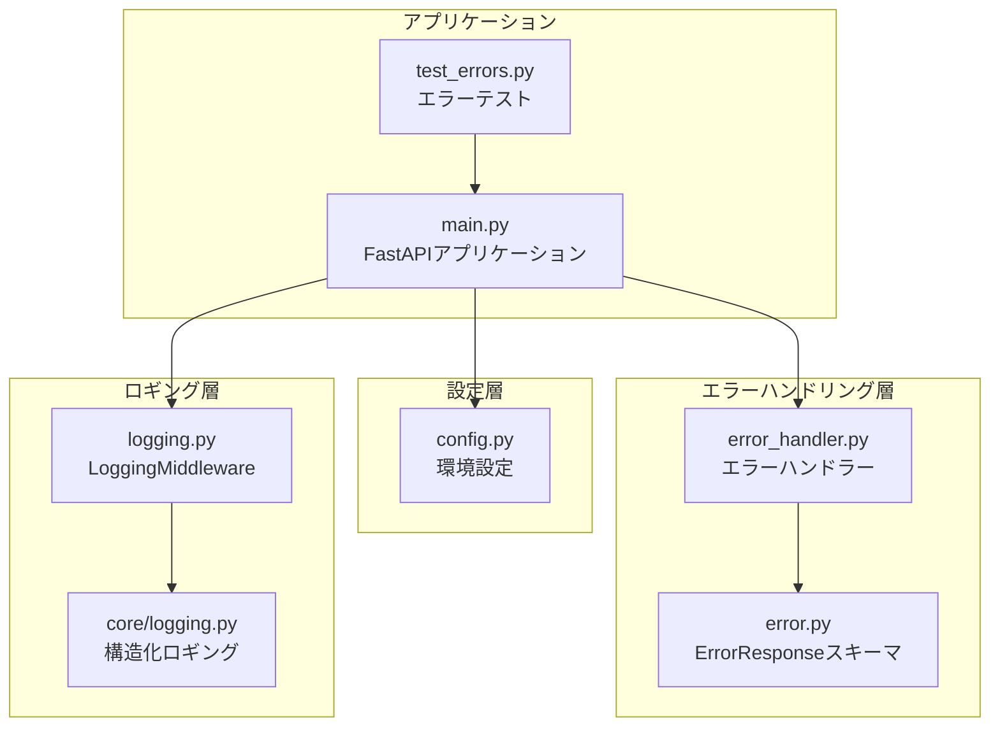
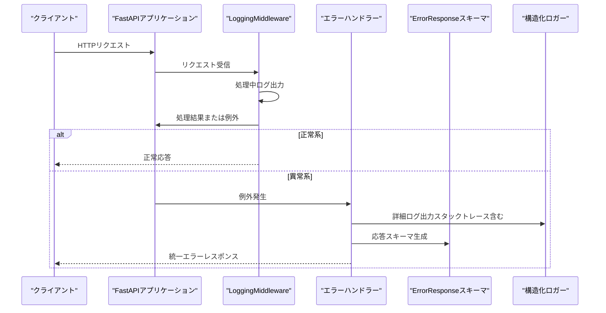
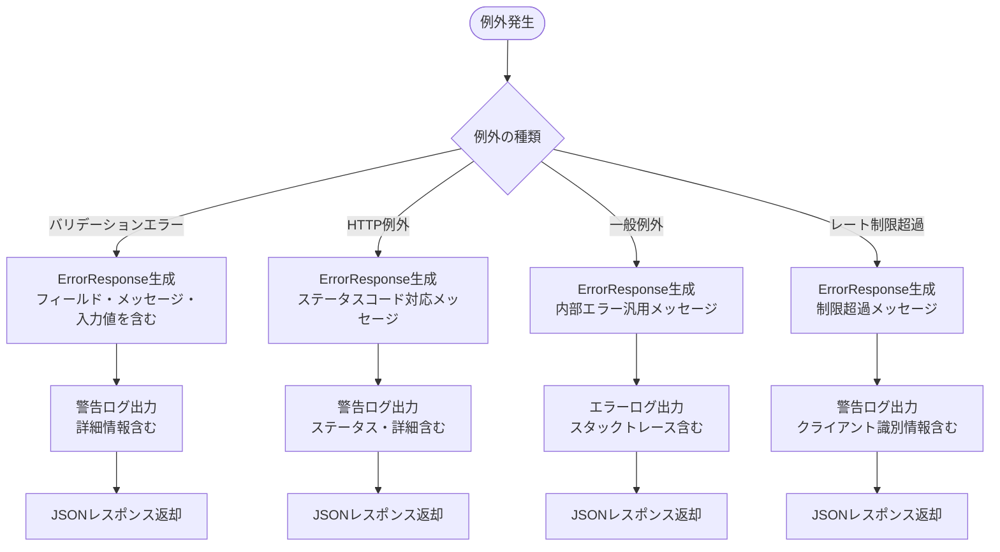
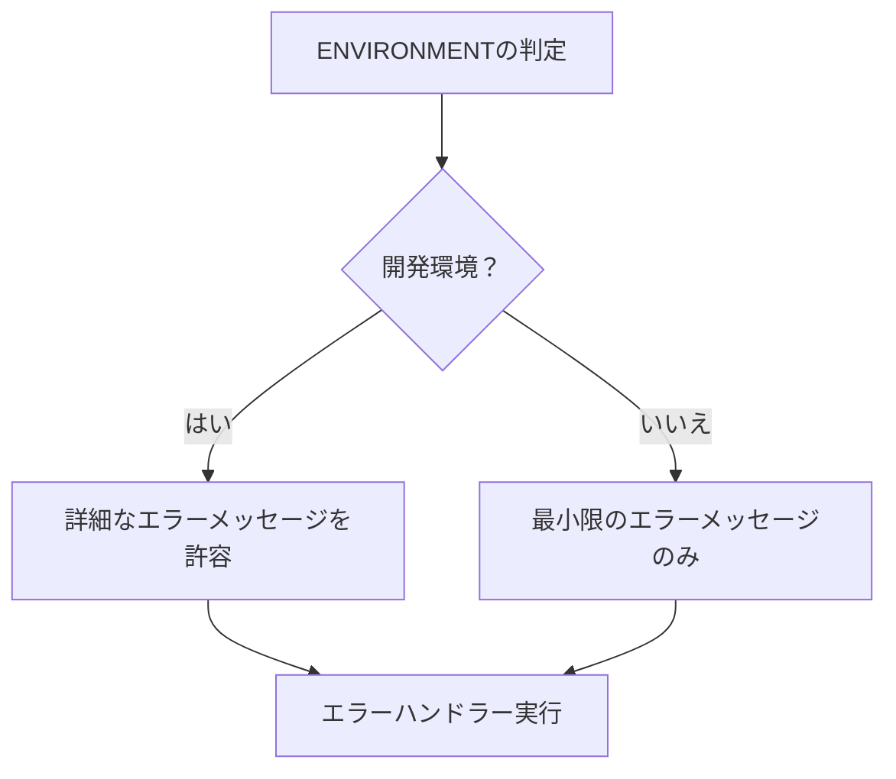
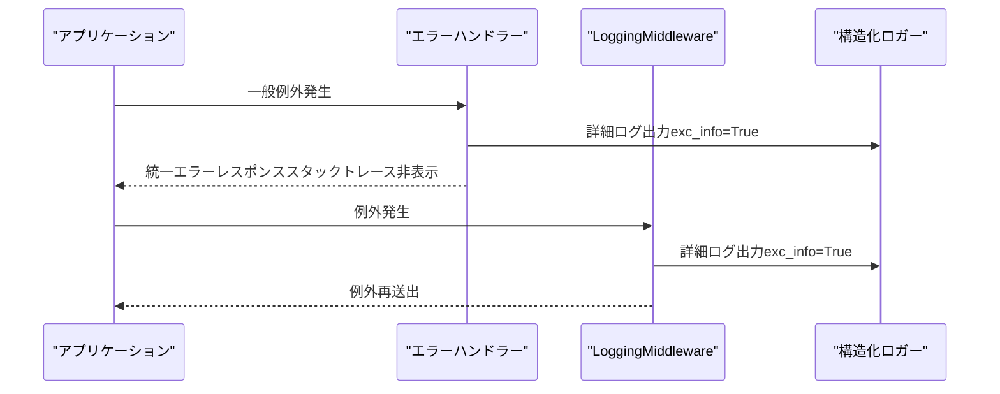
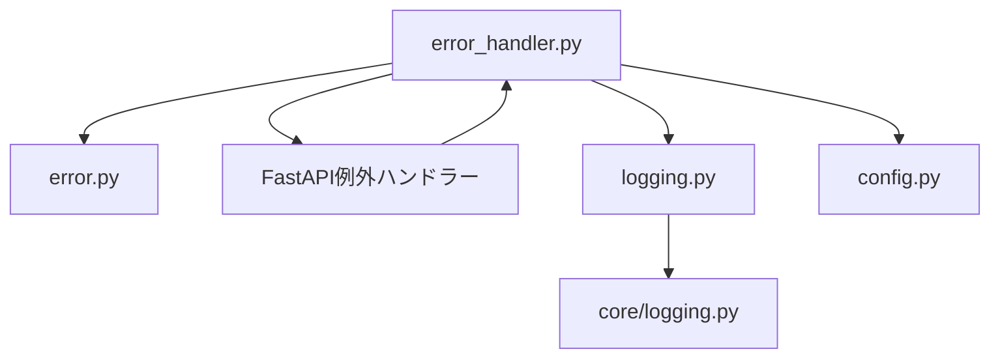

# エラーメッセージ制御

<cite>
**この文書で参照されたファイル**   
- [error_handler.py](file://backend/app/middleware/error_handler.py)
- [error.py](file://backend/app/schemas/error.py)
- [config.py](file://backend/app/core/config.py)
- [logging.py](file://backend/app/middleware/logging.py)
- [logging.py](file://backend/app/core/logging.py)
- [main.py](file://backend/app/main.py)
- [test_errors.py](file://backend/tests/test_errors.py)
</cite>

## 目次
1. [はじめに](#はじめに)
2. [プロジェクト構造](#プロジェクト構造)
3. [コアコンポーネント](#コアコンポーネント)
4. [アーキテクチャ概観](#アーキテクチャ概観)
5. [詳細コンポーネント分析](#詳細コンポーネント分析)
6. [依存関係分析](#依存関係分析)
7. [パフォーマンス考慮事項](#パフォーマンス考慮事項)
8. [トラブルシューティングガイド](#トラブルシューティングガイド)
9. [結論](#結論)

## はじめに
本ドキュメントは、APIにおけるエラーメッセージのセキュリティ上重要な情報を隠蔽するための制御方法について詳しく説明します。開発環境と本番環境でのエラーメッセージの違い、スタックトレースの非表示処理、ユーザーに表示すべきエラーメッセージと表示すべきでないエラーの区別について解説し、具体的な実装例とベストプラクティスを示します。

## プロジェクト構造
バックエンドはFastAPIフレームワークを採用し、エラーハンドリング、ロギング、設定管理をモジュール単位で分離しています。エラーハンドリングはミドルウェアとして実装され、統一されたレスポンススキーマを介してクライアントに返されます。

**図の出典**
- [error_handler.py:1-149](file://backend/app/middleware/error_handler.py#L1-L149)
- [error.py:1-23](file://backend/app/schemas/error.py#L1-L23)
- [config.py:1-91](file://backend/app/core/config.py#L1-L91)
- [logging.py:1-67](file://backend/app/middleware/logging.py#L1-L67)
- [logging.py:1-35](file://backend/app/core/logging.py#L1-L35)
- [main.py:1-168](file://backend/app/main.py#L1-L168)
- [test_errors.py:1-38](file://backend/tests/test_errors.py#L1-L38)

**節の出典**
- [main.py:1-168](file://backend/app/main.py#L1-L168)
- [config.py:1-91](file://backend/app/core/config.py#L1-L91)

## コアコンポーネント
- 統一エラーレスポンススキーマ：ErrorResponseとValidationErrorDetailを定義し、すべてのエラーを標準化された形式で返却します。
- エラーハンドラー：バリデーションエラー、HTTP例外、一般例外、レート制限超過に対応するハンドラーを提供します。
- 環境設定：ENVIRONMENT変数により開発環境と本番環境を切り替え、設定値を動的に取得します。
- 構造化ロギング：JSONフォーマットによる構造化ログを出力し、スタックトレースを安全に扱います。

**節の出典**
- [error.py:5-23](file://backend/app/schemas/error.py#L5-L23)
- [error_handler.py:15-149](file://backend/app/middleware/error_handler.py#L15-L149)
- [config.py:24-34](file://backend/app/core/config.py#L24-L34)
- [logging.py:1-35](file://backend/app/core/logging.py#L1-L35)

## アーキテクチャ概観
エラーハンドリングはFastAPIの例外ハンドラー機構とカスタムミドルウェアを組み合わせて実現されています。クライアントからのリクエストはLoggingMiddlewareで処理され、エラー発生時はエラーハンドラーが統一されたレスポンスを返します。構造化ロギングにより、スタックトレースや詳細情報は安全に保存されますが、クライアントには最小限の情報のみが表示されます。

**図の出典**
- [main.py:66-71](file://backend/app/main.py#L66-L71)
- [logging.py:10-67](file://backend/app/middleware/logging.py#L10-L67)
- [error_handler.py:15-149](file://backend/app/middleware/error_handler.py#L15-L149)
- [error.py:5-23](file://backend/app/schemas/error.py#L5-L23)
- [logging.py:1-35](file://backend/app/core/logging.py#L1-L35)

## 詳細コンポーネント分析

### エラーハンドラーの設計とセキュリティ
エラーハンドラーは以下の4つのケースに対応し、それぞれ異なるセキュリティ戦略を採用しています：
- バリデーションエラー：フィールド名、エラーメッセージ、入力値を詳細に含めつつ、クライアントに表示可能な日本語メッセージを提供します。
- HTTP例外：ステータスコードに応じた日本語メッセージを返し、内部的な詳細情報は隠れます。
- 一般例外：予期しないエラーに対しては内部エラーを示す汎用メッセージのみを返します。
- レート制限超過：クライアントに制限超過を通知しつつ、IPアドレスなどの識別情報をログに記録します。

**図の出典**
- [error_handler.py:15-149](file://backend/app/middleware/error_handler.py#L15-L149)
- [error.py:5-23](file://backend/app/schemas/error.py#L5-L23)

**節の出典**
- [error_handler.py:15-149](file://backend/app/middleware/error_handler.py#L15-L149)

### 環境別のエラーメッセージ制御
環境設定はENVIRONMENT変数によって開発環境か本番環境かを判定し、以下のようなセキュリティ上の違いを実現しています：
- 開発環境：より詳細なエラーメッセージやスタックトレースを含める可能性があります。
- 本番環境：最小限の情報のみをクライアントに返し、内部的な詳細情報は隠れます。

**図の出典**
- [config.py:24-34](file://backend/app/core/config.py#L24-L34)

**節の出典**
- [config.py:24-34](file://backend/app/core/config.py#L24-L34)

### スタックトレースの非表示処理
エラーハンドラーは以下の方法でスタックトレースを安全に扱っています：
- 一般例外の場合、exc_info=Trueでスタックトレースをログに出力しますが、クライアントには表示されません。
- LoggingMiddlewareもexc_info=Trueでエラー発生時のスタックトレースを記録します。
- 構造化ロギングにより、JSON形式でログを出力し、機械可読性を高めます。

**図の出典**
- [error_handler.py:83-92](file://backend/app/middleware/error_handler.py#L83-L92)
- [logging.py:52-66](file://backend/app/middleware/logging.py#L52-L66)
- [logging.py:22-28](file://backend/app/core/logging.py#L22-L28)

**節の出典**
- [error_handler.py:83-92](file://backend/app/middleware/error_handler.py#L83-L92)
- [logging.py:52-66](file://backend/app/middleware/logging.py#L52-L66)
- [logging.py:22-28](file://backend/app/core/logging.py#L22-L28)

### ユーザーに表示すべきエラーメッセージと表示すべきでないエラーの区別
以下の表は、エラーメッセージの表示に関する区分とその理由を示します：

| エラー種別 | 表示すべき内容 | 表示すべきでない内容 | 理由 |
|------------|----------------|----------------------|------|
| バリデーションエラー | 日本語の要約メッセージ | 入力値の詳細 | 入力値が漏洩するリスクを回避 |
| HTTP例外（401/403/404） | 認証・権限・存在に関する要約 | 内部的な詳細 | 認証情報や内部構造の漏洩を防ぐ |
| 一般例外（500） | 一般的な障害通知 | システム内部の詳細 | セキュリティリスクを軽減 |
| レート制限超過 | 制限超過の要約 | IPアドレス等の識別情報 | 誰かのアクセス履歴を隠蔽 |

**節の出典**
- [error_handler.py:29-49](file://backend/app/middleware/error_handler.py#L29-L49)
- [error_handler.py:57-76](file://backend/app/middleware/error_handler.py#L57-L76)
- [error_handler.py:94-104](file://backend/app/middleware/error_handler.py#L94-L104)
- [error_handler.py:129-148](file://backend/app/middleware/error_handler.py#L129-L148)

### 実装例とベストプラクティス
- 統一レスポンススキーマの使用：ErrorResponseとValidationErrorDetailを活用し、クライアント側で一貫した処理が可能になります。
- 環境設定の活用：ENVIRONMENT変数を用いて開発環境と本番環境での振る舞いを切り替えます。
- 構造化ロギング：JSON形式のログを出力し、スタックトレースを安全に保存します。
- 最小情報原則：クライアントには必要最小限の情報のみを返し、内部的な詳細は隠します。

**節の出典**
- [error.py:5-23](file://backend/app/schemas/error.py#L5-L23)
- [config.py:24-34](file://backend/app/core/config.py#L24-L34)
- [logging.py:22-28](file://backend/app/core/logging.py#L22-L28)

## 依存関係分析
エラーハンドリングの依存関係は以下の通りです。エラーハンドラーはErrorResponseスキーマに依存し、FastAPIの例外ハンドラー機構とLoggingMiddlewareと連携して動作します。

**図の出典**
- [error_handler.py:10](file://backend/app/middleware/error_handler.py#L10)
- [error.py:1-23](file://backend/app/schemas/error.py#L1-L23)
- [main.py:66-71](file://backend/app/main.py#L66-L71)
- [logging.py:1-67](file://backend/app/middleware/logging.py#L1-L67)
- [logging.py:1-35](file://backend/app/core/logging.py#L1-L35)
- [config.py:1-91](file://backend/app/core/config.py#L1-L91)

**節の出典**
- [main.py:66-71](file://backend/app/main.py#L66-L71)
- [error_handler.py:10](file://backend/app/middleware/error_handler.py#L10)

## パフォーマンス考慮事項
- ログ出力のオーバーヘッド：構造化ロギングはJSON変換のオーバーヘッドがあります。本番環境ではログレベルを適切に設定し、不要なログを抑制することが重要です。
- 例外処理のコスト：エラー発生時のスタックトレース出力はコストがかかります。頻繁に発生するエラーについては、監視と対策を検討してください。
- レスポンスサイズ：バリデーションエラーの詳細情報はレスポンスに含まれます。大量のエラー詳細を返すとレスポンスサイズが大きくなるため、クライアント側での処理に注意が必要です。

## トラブルシューティングガイド
- エラーメッセージが表示されない場合：本番環境では最小限の情報しか表示されないため、開発環境で確認するか、ログを確認してください。
- スタックトレースが見えない場合：一般例外やLoggingMiddlewareのエラー発生時にexc_info=Trueで出力されるため、ログを確認してください。
- 環境設定の確認：ENVIRONMENT変数が正しく設定されているか確認し、開発環境と本番環境での振る舞いの違いを理解してください。

**節の出典**
- [logging.py:52-66](file://backend/app/middleware/logging.py#L52-L66)
- [error_handler.py:83-92](file://backend/app/middleware/error_handler.py#L83-L92)
- [config.py:24-34](file://backend/app/core/config.py#L24-L34)

## 結論
本プロジェクトでは、エラーメッセージのセキュリティ上重要な情報を隠蔽するために、統一されたエラーレスポンススキーマ、環境別の設定、構造化ロギング、そして最小情報原則を採用しています。これにより、開発環境では詳細な情報を提供しつつ、本番環境ではセキュリティを重視した最小限の情報を提供することが実現されています。今後の改善点として、エラーメッセージの多言語対応や、より詳細な監視・アラート機能の導入が考えられます。