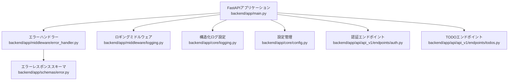
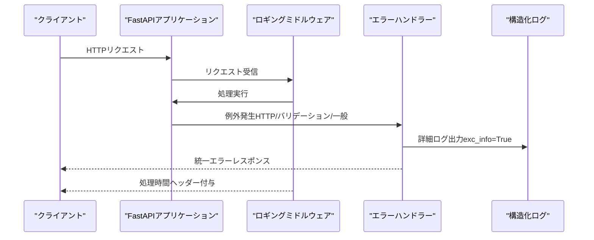
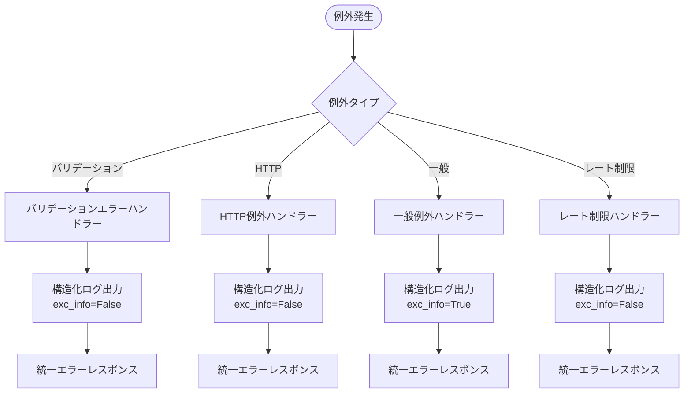
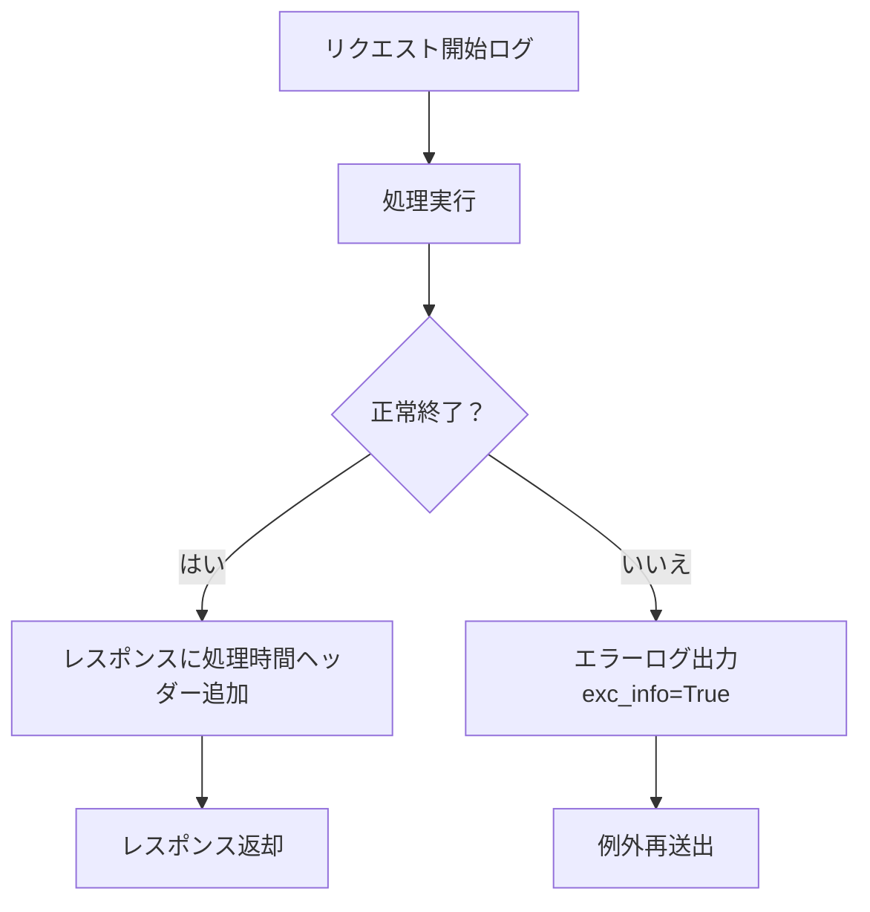
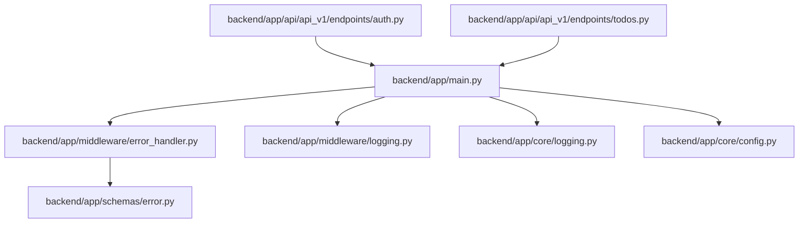

# スタックトレース保護

<cite>
**この文書で参照されるファイル**
- [backend/app/main.py](file://backend/app/main.py)
- [backend/app/middleware/error_handler.py](file://backend/app/middleware/error_handler.py)
- [backend/app/middleware/logging.py](file://backend/app/middleware/logging.py)
- [backend/app/core/logging.py](file://backend/app/core/logging.py)
- [backend/app/schemas/error.py](file://backend/app/schemas/error.py)
- [backend/app/core/config.py](file://backend/app/core/config.py)
- [backend/app/api/api_v1/endpoints/auth.py](file://backend/app/api/api_v1/endpoints/auth.py)
- [backend/app/api/api_v1/endpoints/todos.py](file://backend/app/api/api_v1/endpoints/todos.py)
- [backend/tests/test_errors.py](file://backend/tests/test_errors.py)
- [backend/pyproject.toml](file://backend/pyproject.toml)
- [backend/pytest.ini](file://backend/pytest.ini)
</cite>

## 目次
1. [はじめに](#はじめに)
2. [プロジェクト構造](#プロジェクト構造)
3. [コアコンポーネント](#コアコンポーネント)
4. [アーキテクチャ概要](#アーキテクチャ概要)
5. [詳細コンポーネント分析](#詳細コンポーネント分析)
6. [依存関係分析](#依存関係分析)
7. [パフォーマンス考慮事項](#パフォーマンス考慮事項)
8. [トラブルシューティングガイド](#トラブルシューティングガイド)
9. [結論](#結論)

## はじめに
本プロジェクトにおけるスタックトレース保護は、セキュリティリスクを軽減し、開発時と本番環境での適切なエラーハンドリングを実現するために設計されています。本番環境では技術的なスタックトレース情報を公開せず、代わりにユーザーに親しみやすいメッセージと、管理者向けの構造化ログのみを出力するよう構成されています。

## プロジェクト構造
バックエンドはFastAPIフレームワークを基盤としており、ミドルウェアと例外ハンドラーを通じてエラーレスポンスを統一的に管理しています。設定は環境変数ベースで管理され、開発環境と本番環境の差分を吸収する仕組みが整っています。

**図の出典**
- [backend/app/main.py:1-168](file://backend/app/main.py#L1-L168)
- [backend/app/middleware/error_handler.py:1-149](file://backend/app/middleware/error_handler.py#L1-L149)
- [backend/app/middleware/logging.py:1-67](file://backend/app/middleware/logging.py#L1-L67)
- [backend/app/core/logging.py:1-36](file://backend/app/core/logging.py#L1-L36)
- [backend/app/schemas/error.py:1-23](file://backend/app/schemas/error.py#L1-L23)
- [backend/app/core/config.py:1-91](file://backend/app/core/config.py#L1-L91)
- [backend/app/api/api_v1/endpoints/auth.py:1-117](file://backend/app/api/api_v1/endpoints/auth.py#L1-L117)
- [backend/app/api/api_v1/endpoints/todos.py:1-102](file://backend/app/api/api_v1/endpoints/todos.py#L1-L102)

**節の出典**
- [backend/app/main.py:1-168](file://backend/app/main.py#L1-L168)
- [backend/app/core/config.py:1-91](file://backend/app/core/config.py#L1-L91)

## コアコンポーネント
- 構造化ログ設定：JSONフォーマットによる標準出力への出力を行い、開発・本番共通のログ出力を統一します。
- 例外ハンドラー：バリデーションエラー、HTTP例外、一般例外、レート制限超過に対して統一されたレスポンススキーマを適用します。
- ロギングミドルウェア：リクエスト開始・完了・失敗時のログ出力と、処理時間のヘッダー付与を実施します。
- 認証・TODOエンドポイント：認証エラー、404、バリデーションエラーなどの典型的なエラー発生場所を網羅的にカバーします。

**節の出典**
- [backend/app/core/logging.py:1-36](file://backend/app/core/logging.py#L1-L36)
- [backend/app/middleware/error_handler.py:1-149](file://backend/app/middleware/error_handler.py#L1-L149)
- [backend/app/middleware/logging.py:1-67](file://backend/app/middleware/logging.py#L1-L67)
- [backend/app/api/api_v1/endpoints/auth.py:1-117](file://backend/app/api/api_v1/endpoints/auth.py#L1-L117)
- [backend/app/api/api_v1/endpoints/todos.py:1-102](file://backend/app/api/api_v1/endpoints/todos.py#L1-L102)

## アーキテクチャ概要
エラーハンドリングのフローは、FastAPIの例外ハンドラーとミドルウェアの組み合わせによって実現されます。エラー発生時には、例外ハンドラーが統一されたJSONレスポンスを返し、ロギングミドルウェアが詳細な構造化ログを出力します。これにより、ユーザーには安全なメッセージのみが表示され、管理者にはスタックトレース情報なしで問題の特定が可能になります。

**図の出典**
- [backend/app/middleware/logging.py:10-67](file://backend/app/middleware/logging.py#L10-L67)
- [backend/app/middleware/error_handler.py:52-104](file://backend/app/middleware/error_handler.py#L52-L104)
- [backend/app/core/logging.py:6-36](file://backend/app/core/logging.py#L6-L36)

## 詳細コンポーネント分析

### 例外ハンドラーの設計
- バリデーションエラー：Pydanticエラーを整形し、フィールド名・メッセージ・入力値を詳細に記録。
- HTTP例外：ステータスコードに応じた日本語メッセージを返し、警告レベルでログ出力。
- 一般例外：内部エラーを500で返し、エラー詳細を含む構造化ログを出力。
- レート制限超過：429を返し、警告レベルでログ出力。

**図の出典**
- [backend/app/middleware/error_handler.py:15-148](file://backend/app/middleware/error_handler.py#L15-L148)
- [backend/app/schemas/error.py:5-23](file://backend/app/schemas/error.py#L5-L23)

**節の出典**
- [backend/app/middleware/error_handler.py:15-148](file://backend/app/middleware/error_handler.py#L15-L148)
- [backend/app/schemas/error.py:5-23](file://backend/app/schemas/error.py#L5-L23)

### ロギングミドルウェアの設計
- リクエスト開始：メソッド、URL、クライアントIPをログ出力。
- 処理成功：ステータスコード、処理時間をヘッダーに追加。
- 処理失敗：エラー内容、処理時間を含むエラーログを出力（exc_info=True）。

**図の出典**
- [backend/app/middleware/logging.py:15-67](file://backend/app/middleware/logging.py#L15-L67)

**節の出典**
- [backend/app/middleware/logging.py:15-67](file://backend/app/middleware/logging.py#L15-L67)

### 構造化ログ設定
- JSONフォーマットで標準出力へ出力。
- 必要なメタ情報（タイムスタンプ、ロガー名、レベル、ファイル名、関数名、行番号）を含む。
- アプリケーションロガーの設定と初期化を実施。

**節の出典**
- [backend/app/core/logging.py:6-36](file://backend/app/core/logging.py#L6-L36)

### 認証エンドポイントにおけるエラー処理
- 重複したメールアドレス：400エラーを返し、詳細メッセージを含む。
- 認証失敗：401エラーをWWW-Authenticateヘッダーとともに返す。
- トークンの有効性：400または404エラーを返し、詳細メッセージを含む。

**節の出典**
- [backend/app/api/api_v1/endpoints/auth.py:27-117](file://backend/app/api/api_v1/endpoints/auth.py#L27-L117)

### TODOエンドポイントにおけるエラー処理
- 存在しないTODO：404エラーを返す。
- 入力バリデーションエラー：422エラーを返し、詳細なフィールド情報を含む。

**節の出典**
- [backend/app/api/api_v1/endpoints/todos.py:65-102](file://backend/app/api/api_v1/endpoints/todos.py#L65-L102)

## 依存関係分析
- FastAPIアプリケーションは、エラーハンドラー、ロギングミドルウェア、構造化ログ設定、設定管理に依存。
- 例外ハンドラーは、エラーレスポンススキーマに依存。
- 認証・TODOエンドポイントは、DBセッション、CRUD、スキーマに依存。

**図の出典**
- [backend/app/main.py:11-26](file://backend/app/main.py#L11-L26)
- [backend/app/middleware/error_handler.py:10](file://backend/app/middleware/error_handler.py#L10)
- [backend/app/schemas/error.py:1-23](file://backend/app/schemas/error.py#L1-L23)

**節の出典**
- [backend/app/main.py:11-26](file://backend/app/main.py#L11-L26)
- [backend/app/middleware/error_handler.py:10](file://backend/app/middleware/error_handler.py#L10)
- [backend/app/schemas/error.py:1-23](file://backend/app/schemas/error.py#L1-L23)

## パフォーマンス考慮事項
- 処理時間のヘッダー付与：クライアント側での遅延分析に役立ちます。
- 構造化ログの出力：JSONフォーマットにより、外部監視システムとの連携が容易です。
- 例外発生時のログ出力：exc_info=Trueによりスタックトレースを詳細に出力可能ですが、本番環境ではセキュリティリスクを考慮した運用が必要です。

[本節は一般的なガイダンスを提供しており、特定のファイルを直接分析していません]

## トラブルシューティングガイド
- 404エラーの確認：ヘルスチェックエンドポイントのテストで、データベース接続の状態を確認できます。
- ルートエンドポイントの動作確認：ルートエンドポイントが200を返すことを確認します。
- バリデーションエラーの確認：空のリクエストでバリデーションエラーが発生し、401または422を返すことを確認します。

**節の出典**
- [backend/tests/test_errors.py:4-38](file://backend/tests/test_errors.py#L4-L38)

## 結論
本プロジェクトでは、スタックトレース情報をセキュリティリスクとして認識し、本番環境では技術的な詳細を公開しない設計となっています。エラーハンドラーは統一されたレスポンススキーマを適用し、ロギングミドルウェアは管理者向けの構造化ログのみを出力することで、ユーザーへの影響を最小限に抑えつつ、問題の迅速な特定を実現しています。開発時と本番環境での設定差分（環境変数）を適切に管理し、運用プロセスに組み込むことで、堅牢なエラーハンドリング体制を維持できます。