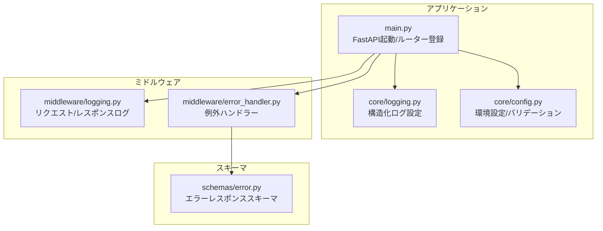
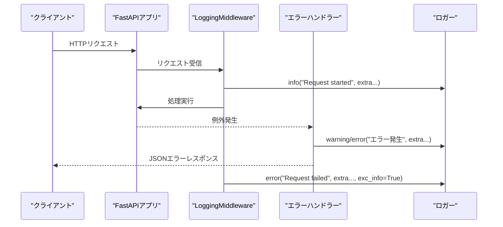
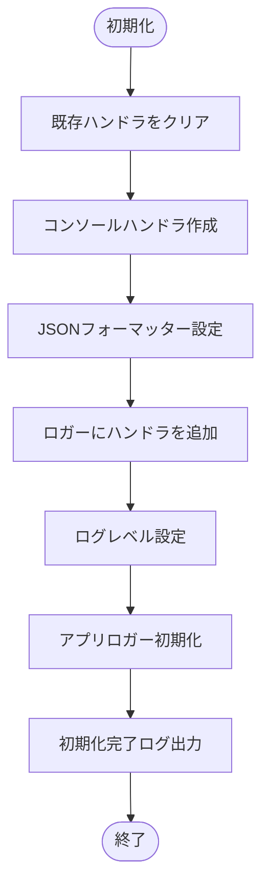
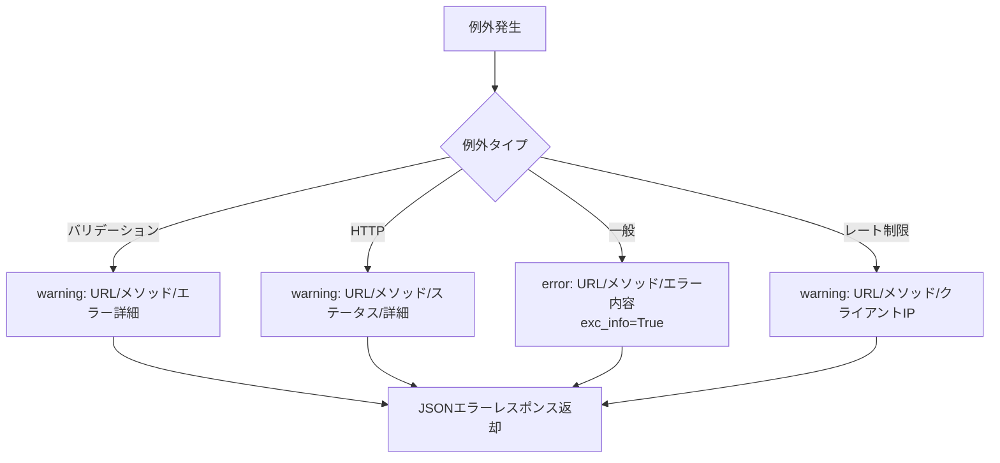
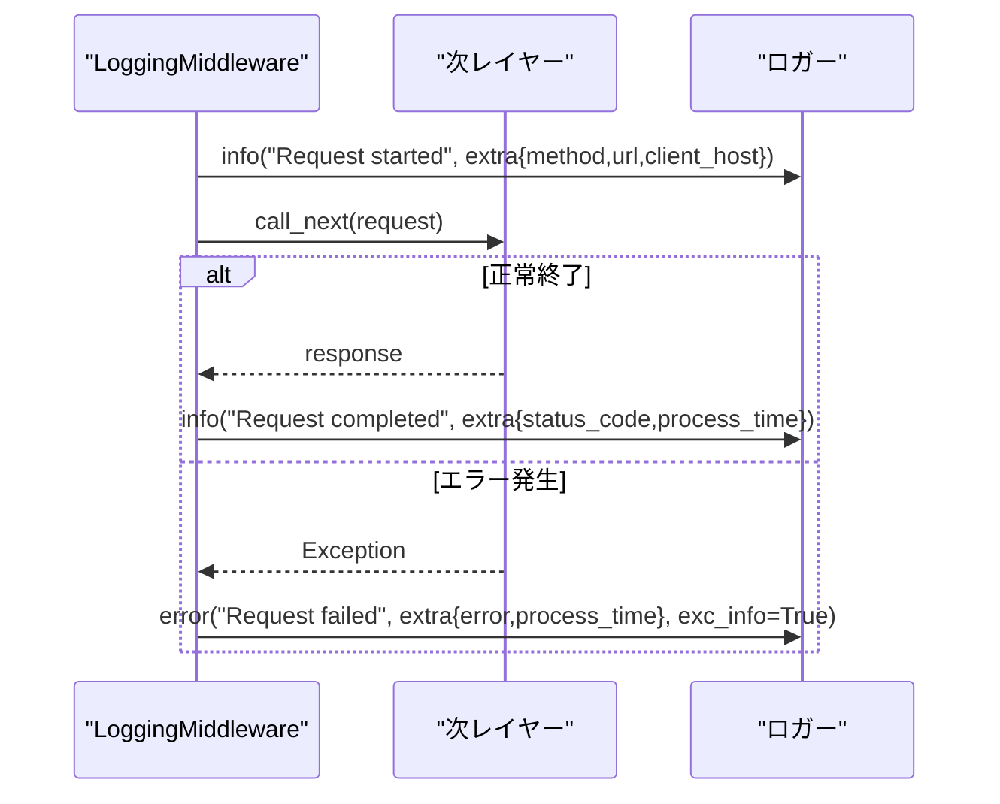
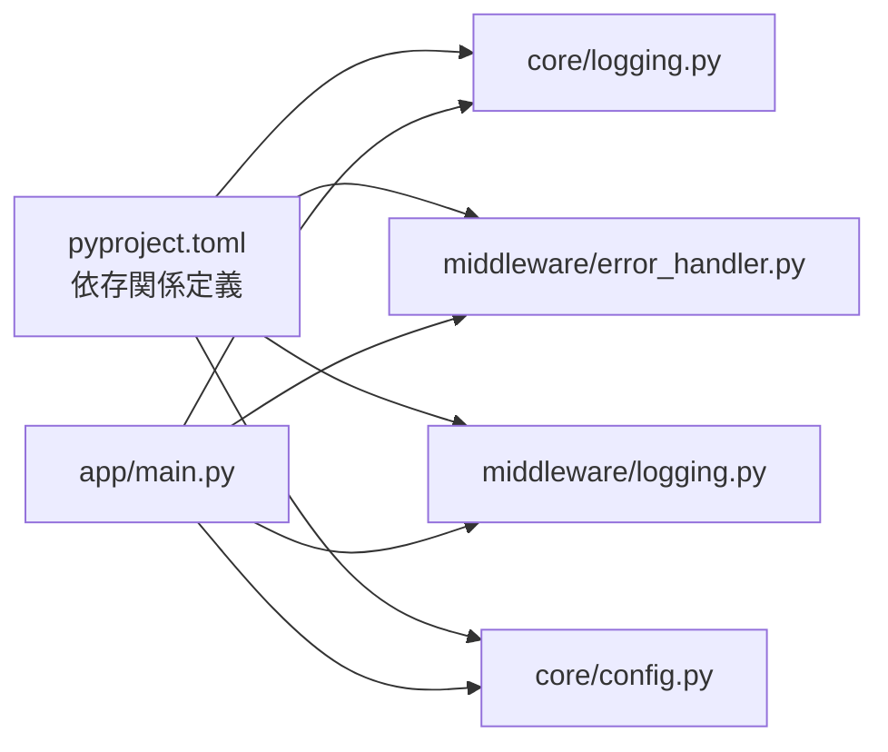

# ログ出力セキュリティ

<cite>
**本文で参照するファイル**
- [backend/app/core/logging.py](file://backend/app/core/logging.py)
- [backend/app/middleware/error_handler.py](file://backend/app/middleware/error_handler.py)
- [backend/app/middleware/logging.py](file://backend/app/middleware/logging.py)
- [backend/app/schemas/error.py](file://backend/app/schemas/error.py)
- [backend/app/core/config.py](file://backend/app/core/config.py)
- [backend/app/main.py](file://backend/app/main.py)
- [backend/tests/test_errors.py](file://backend/tests/test_errors.py)
- [backend/pyproject.toml](file://backend/pyproject.toml)
</cite>

## 目次
1. [はじめに](#はじめに)
2. [プロジェクト構造](#プロジェクト構造)
3. [コアコンポーネント](#コアコンポーネント)
4. [アーキテクチャ概観](#アーキテクチャ概観)
5. [詳細コンポーネント分析](#詳細コンポーネント分析)
6. [依存関係分析](#依存関係分析)
7. [パフォーマンス考慮事項](#パフォーマンス考慮事項)
8. [トラブルシューティングガイド](#トラブルシューティングガイド)
9. [結論](#結論)

## はじめに
本ドキュメントは、エラー発生時のログ出力におけるセキュリティ対策について解説します。具体的には、機微情報の含まれるデータのログ出力防止、ログレベルの適切な設定、セキュリティイベントの記録方法、ログの機密性管理、アクセス制限、監査追跡のためのログ設計について、実装例に基づいて詳しく説明します。

## プロジェクト構造
バックエンドはFastAPIフレームワークを用い、ミドルウェアと例外ハンドラーを通じてエラーログを収集・整形しています。構造化ログ（JSON）を標準出力に出力し、アプリケーションロガーは「app」名前空間で管理されています。設定は環境変数から読み込まれ、本番環境での設定漏れを防ぐためのバリデーションも実装されています。

**図の出典**
- [backend/app/main.py:1-168](file://backend/app/main.py#L1-L168)
- [backend/app/core/logging.py:1-36](file://backend/app/core/logging.py#L1-L36)
- [backend/app/middleware/logging.py:1-67](file://backend/app/middleware/logging.py#L1-L67)
- [backend/app/middleware/error_handler.py:1-149](file://backend/app/middleware/error_handler.py#L1-L149)
- [backend/app/schemas/error.py:1-23](file://backend/app/schemas/error.py#L1-L23)
- [backend/app/core/config.py:1-91](file://backend/app/core/config.py#L1-L91)

**節の出典**
- [backend/app/main.py:1-168](file://backend/app/main.py#L1-L168)
- [backend/app/core/logging.py:1-36](file://backend/app/core/logging.py#L1-L36)
- [backend/app/core/config.py:1-91](file://backend/app/core/config.py#L1-L91)

## コアコンポーネント
- 構造化ログ設定
  - 標準出力へのJSONフォーマット出力、ログレベルの設定、アプリケーションロガーの初期化を担当。
  - 参考: [backend/app/core/logging.py:6-36](file://backend/app/core/logging.py#L6-L36)

- 例外ハンドラー
  - バリデーションエラー、HTTP例外、一般例外、レート制限超過に対応。
  - 各ハンドラーはセキュリティイベントとして適切なレベル（警告/エラー）でログ出力し、機微情報は出力しないよう設計。
  - 参考: [backend/app/middleware/error_handler.py:15-149](file://backend/app/middleware/error_handler.py#L15-L149)

- リクエスト/レスポンスログミドルウェア
  - すべてのリクエストに対して開始・完了のログを出力し、エラー発生時は例外スタックトレース付きでエラーログを出力。
  - 参考: [backend/app/middleware/logging.py:10-67](file://backend/app/middleware/logging.py#L10-L67)

- 環境設定
  - 本番環境での必須項目（CORSオリジン、シークレットキーなど）のバリデーション。
  - 参考: [backend/app/core/config.py:24-88](file://backend/app/core/config.py#L24-L88)

**節の出典**
- [backend/app/core/logging.py:6-36](file://backend/app/core/logging.py#L6-L36)
- [backend/app/middleware/error_handler.py:15-149](file://backend/app/middleware/error_handler.py#L15-L149)
- [backend/app/middleware/logging.py:10-67](file://backend/app/middleware/logging.py#L10-L67)
- [backend/app/core/config.py:24-88](file://backend/app/core/config.py#L24-L88)

## アーキテクチャ概観
エラーログの流れは、ミドルウェアによるリクエスト/レスポンスログ、例外ハンドラーによるエラーレスポンス整形、構造化ログ出力の3層構造です。エラーハンドラーは、機微情報（リクエストボディなど）をログに出さないように設計されています。

**図の出典**
- [backend/app/middleware/logging.py:15-67](file://backend/app/middleware/logging.py#L15-L67)
- [backend/app/middleware/error_handler.py:15-149](file://backend/app/middleware/error_handler.py#L15-L149)
- [backend/app/core/logging.py:6-36](file://backend/app/core/logging.py#L6-L36)

**節の出典**
- [backend/app/middleware/logging.py:15-67](file://backend/app/middleware/logging.py#L15-L67)
- [backend/app/middleware/error_handler.py:15-149](file://backend/app/middleware/error_handler.py#L15-L149)
- [backend/app/core/logging.py:6-36](file://backend/app/core/logging.py#L6-L36)

## 詳細コンポーネント分析

### 構造化ログ設定（機微情報保護）
- JSONフォーマットで出力し、機微情報（パスワード、JWTなど）を含まないフィールドのみをextraとしてログ出力。
- ログレベルは環境設定から柔軟に変更可能。
- 参考: [backend/app/core/logging.py:6-36](file://backend/app/core/logging.py#L6-L36)

**図の出典**
- [backend/app/core/logging.py:6-36](file://backend/app/core/logging.py#L6-L36)

**節の出典**
- [backend/app/core/logging.py:6-36](file://backend/app/core/logging.py#L6-L36)

### 例外ハンドラー（セキュリティイベント記録）
- バリデーションエラー: 入力値を除外したエラー詳細を出力。
- HTTP例外: ステータスコードとURLを記録。
- 一般例外: 例外内容とURLを記録し、exc_info=Trueでスタックトレースを出力。
- レート制限超過: URL、メソッド、クライアントIPを記録。
- 参考: [backend/app/middleware/error_handler.py:15-149](file://backend/app/middleware/error_handler.py#L15-L149)

**図の出典**
- [backend/app/middleware/error_handler.py:15-149](file://backend/app/middleware/error_handler.py#L15-L149)

**節の出典**
- [backend/app/middleware/error_handler.py:15-149](file://backend/app/middleware/error_handler.py#L15-L149)

### リクエスト/レスポンスログミドルウェア（処理時間・エラー追跡）
- info: 開始時刻、URL、メソッド、クライアントIPを記録。
- info: 処理時間、ステータスコードを記録。
- error: 処理時間、エラー内容、exc_info=True。
- 参考: [backend/app/middleware/logging.py:10-67](file://backend/app/middleware/logging.py#L10-L67)

**図の出典**
- [backend/app/middleware/logging.py:15-67](file://backend/app/middleware/logging.py#L15-L67)

**節の出典**
- [backend/app/middleware/logging.py:15-67](file://backend/app/middleware/logging.py#L15-L67)

### 環境設定（本番環境でのセキュリティ強化）
- 本番環境ではCORSオリジンが必須であり、設定されていない場合は即座にエラーを送出。
- SECRET_KEYやALGORITHMなどの機微情報は.envから読み込まれるため、ファイル権限管理が必要。
- 参考: [backend/app/core/config.py:24-88](file://backend/app/core/config.py#L24-L88)

**節の出典**
- [backend/app/core/config.py:24-88](file://backend/app/core/config.py#L24-L88)

### APIエンドポイント（機微情報の取り扱い）
- 認証・ユーザー管理・パスワードリセット等のエンドポイントでは、パスワードやJWTトークンを直接ログに出さないよう設計されている。
- 参考: [backend/app/api/api_v1/endpoints/auth.py:1-117](file://backend/app/api/api_v1/endpoints/auth.py#L1-L117)

**節の出典**
- [backend/app/api/api_v1/endpoints/auth.py:1-117](file://backend/app/api/api_v1/endpoints/auth.py#L1-L117)

## 依存関係分析
- logging.py は標準ライブラリのloggingとpython-json-loggerに依存。
- error_handler.py はFastAPIの例外型、Pydanticスキーマ、slowapiのレート制限例外に依存。
- logging.py はミドルウェアとエラーハンドラーから利用されるロガーを提供。
- main.py は設定、ロギング、ミドルウェア、例外ハンドラーを統合。

**図の出典**
- [backend/pyproject.toml:7-25](file://backend/pyproject.toml#L7-L25)
- [backend/app/main.py:1-168](file://backend/app/main.py#L1-L168)

**節の出典**
- [backend/pyproject.toml:7-25](file://backend/pyproject.toml#L7-L25)
- [backend/app/main.py:1-168](file://backend/app/main.py#L1-L168)

## パフォーマンス考慮事項
- 構造化ログ（JSON）は解析・集計に優れていますが、大量のエラーログが発生するとI/O負荷が増加します。適切なローテーションと保存先の選定が必要です。
- 例外発生時のexc_info=Trueはスタックトレースを出力するため、パフォーマンスへの影響があります。本番環境では必要に応じてオフにする運用を検討してください。

## トラブルシューティングガイド
- 404エラーテスト
  - 存在しないエンドポイントにアクセスし、404エラーが発生するかを確認できます。
  - 参考: [backend/tests/test_errors.py:34-38](file://backend/tests/test_errors.py#L34-L38)
- ヘルスチェックエラー
  - DB接続失敗時にエラーログが出力され、全体ステータスがerrorになることを確認できます。
  - 参考: [backend/app/main.py:154-159](file://backend/app/main.py#L154-L159)

**節の出典**
- [backend/tests/test_errors.py:34-38](file://backend/tests/test_errors.py#L34-L38)
- [backend/app/main.py:154-159](file://backend/app/main.py#L154-L159)

## 結論
本プロジェクトでは、エラー発生時のログ出力において以下のセキュリティ対策が実装されています：
- 機微情報のログ出力防止：バリデーションエラーの詳細は入力値を除外し、HTTP例外・一般例外・レート制限は機微情報を含まないフィールドのみを出力。
- ログレベルの適切な設定：warning/errorレベルを適切に使い分け、本番環境での可視性と監査追跡を両立。
- セキュリティイベントの記録：リクエスト/レスポンスログ、例外ログ、ヘルスチェックログを通じて、アクセス・エラー・障害の追跡を可能に。
- 機密性管理・アクセス制限：環境設定での本番必須項目のバリデーション、シークレットキーの外部管理、CORSオリジンの厳格な設定。
- 監査追跡：JSON構造化ログにより、URL、メソッド、ステータスコード、処理時間、クライアントIP、エラー内容を一貫して記録。