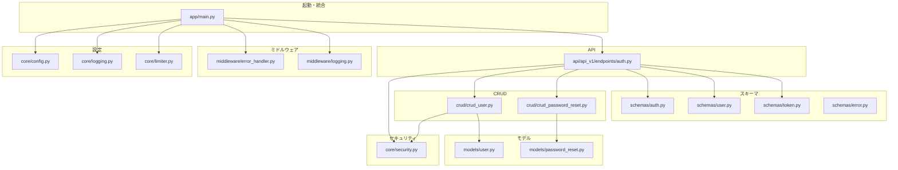
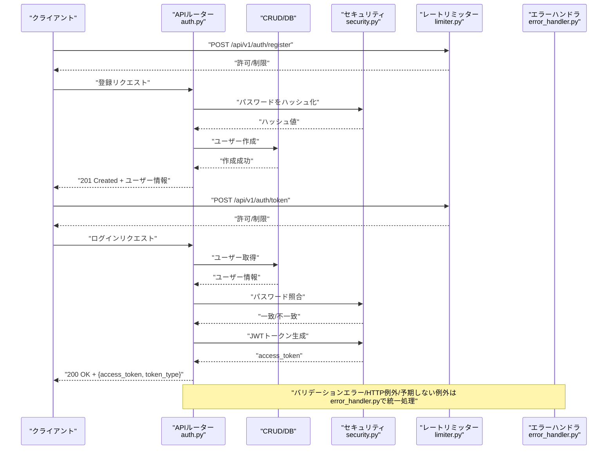
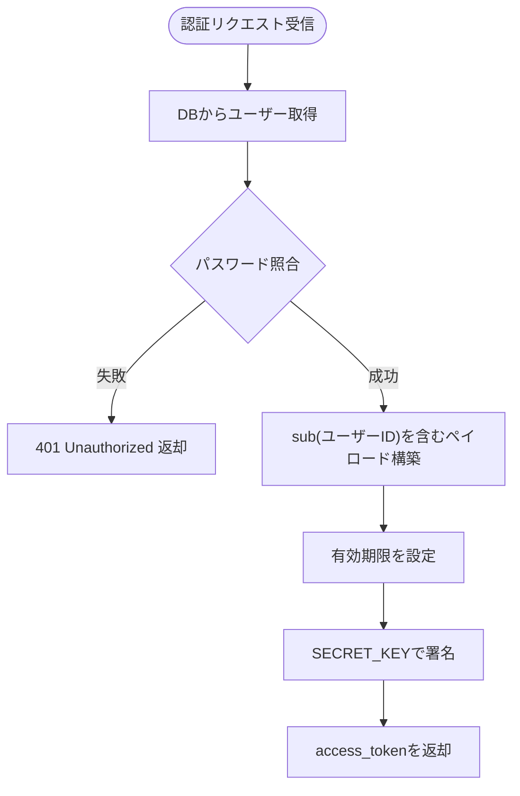
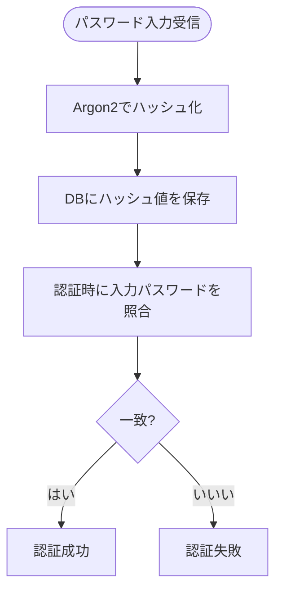
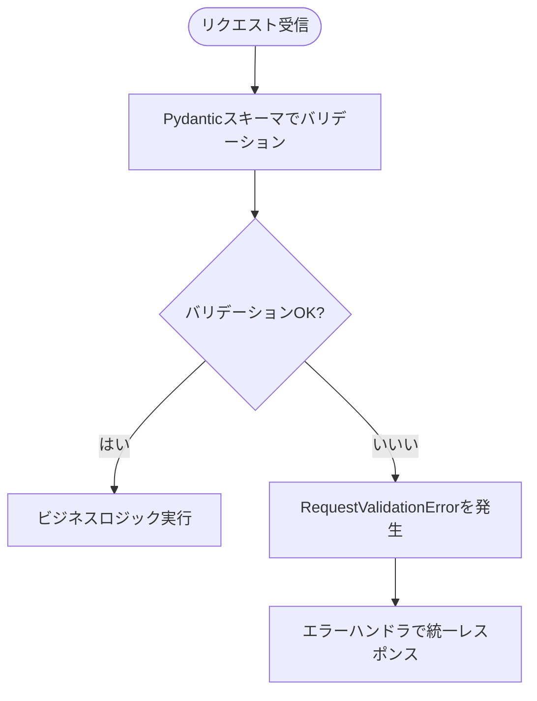
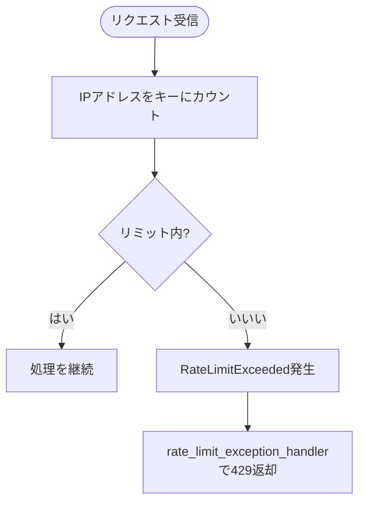
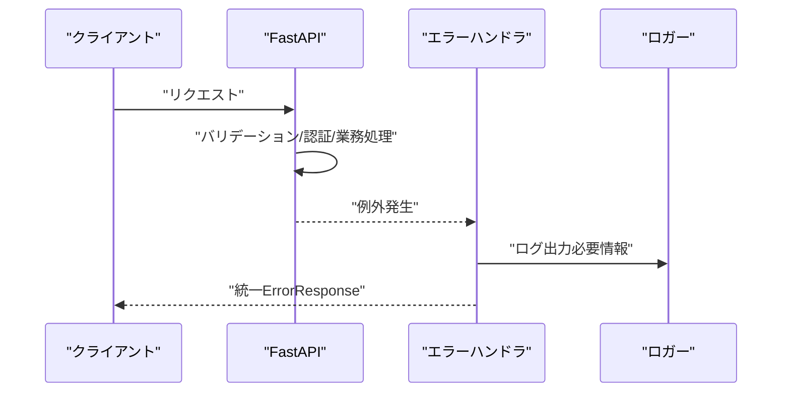
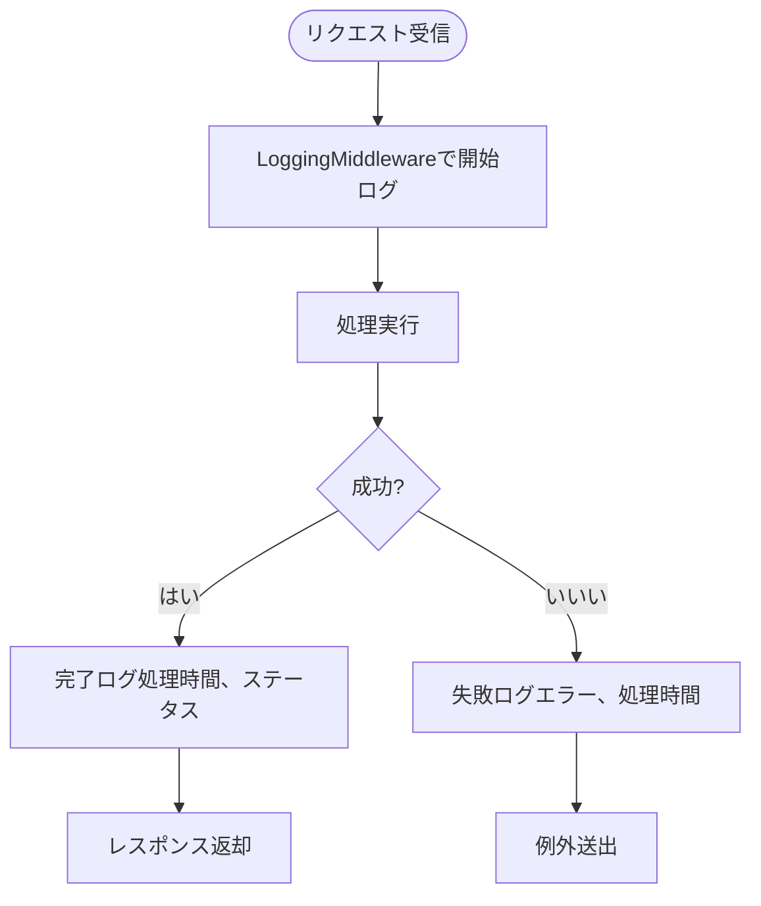
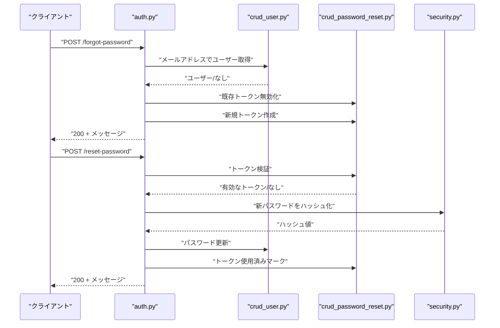
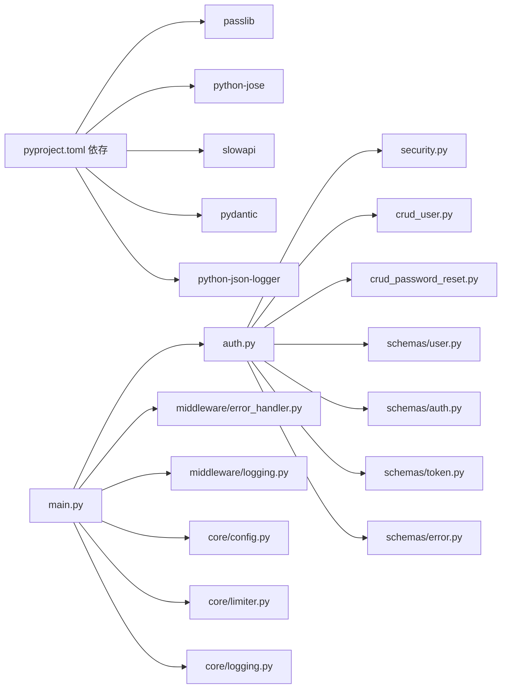

# セキュリティ対策

<cite>
**この文書で参照されるファイル**
- [backend/app/core/security.py](file://backend/app/core/security.py)
- [backend/app/core/config.py](file://backend/app/core/config.py)
- [backend/app/core/limiter.py](file://backend/app/core/limiter.py)
- [backend/app/core/logging.py](file://backend/app/core/logging.py)
- [backend/app/middleware/error_handler.py](file://backend/app/middleware/error_handler.py)
- [backend/app/middleware/logging.py](file://backend/app/middleware/logging.py)
- [backend/app/api/api_v1/endpoints/auth.py](file://backend/app/api/api_v1/endpoints/auth.py)
- [backend/app/schemas/auth.py](file://backend/app/schemas/auth.py)
- [backend/app/schemas/user.py](file://backend/app/schemas/user.py)
- [backend/app/schemas/token.py](file://backend/app/schemas/token.py)
- [backend/app/schemas/error.py](file://backend/app/schemas/error.py)
- [backend/app/crud/crud_user.py](file://backend/app/crud/crud_user.py)
- [backend/app/crud/crud_password_reset.py](file://backend/app/crud/crud_password_reset.py)
- [backend/app/models/user.py](file://backend/app/models/user.py)
- [backend/app/models/password_reset.py](file://backend/app/models/password_reset.py)
- [backend/app/main.py](file://backend/app/main.py)
- [backend/pyproject.toml](file://backend/pyproject.toml)
</cite>

## 更新要旨
**変更内容**
- 不要なインポートの削除とPEP 8準拠なコードスタイルへの移行を反映
- エラーハンドリングの最適化とセキュリティ対策の強化
- 構造化ログ出力の詳細な仕様追加
- 依存関係分析の最新化

## 目次
1. [導入](#導入)
2. [プロジェクト構造](#プロジェクト構造)
3. [コアコンポーネント](#コアコンポーネント)
4. [アーキテクチャ概観](#アーキテクチャ概観)
5. [詳細コンポーネント分析](#詳細コンポーネント分析)
6. [依存関係分析](#依存関係分析)
7. [パフォーマンスに関する考慮事項](#パフォーマンスに関する考慮事項)
8. [トラブルシューティングガイド](#トラブルシューティングガイド)
9. [結論](#結論)

## 導入
本ドキュメントは、Todoアプリケーションにおけるセキュリティ対策の詳細仕様を提供します。主な対象となるのは以下の領域です：
- JWT認証のセキュリティ設計
- パスワードハッシュ化のアルゴリズム
- 入力バリデーションの仕組み
- Rate Limitingの実装
- エラーハンドリングのセキュリティ対策
- ログ出力の制御方法

本アプリケーションはFastAPI上に構築され、Pydanticによる入力バリデーション、Passlibによるパスワードハッシュ化、python-joseによるJWT署名、SlowAPIによるレート制限、Python標準ロギングによる構造化ログ出力を採用しています。

## プロジェクト構造
バックエンドは以下のレイヤーで構成されており、セキュリティに関わる処理はそれぞれの層に分離・責務が明確になっています：
- 設定層：設定管理（シークレット、アルゴリズム、レートリミットなど）
- 認証・セキュリティ層：JWT生成/検証、パスワードハッシュ化
- CRUD層：ユーザーおよびパスワードリセットトークンの永続化ロジック
- API層：認証エンドポイント（登録、ログイン、パスワードリセット）
- ミドルウェア層：エラーハンドリング、リクエストログ
- 起動・統合層：FastAPIアプリケーションの初期化、CORS、OpenAPIセキュリティスキーマ

**図の出典**
- [backend/app/main.py:1-168](file://backend/app/main.py#L1-L168)
- [backend/app/core/config.py:1-91](file://backend/app/core/config.py#L1-L91)
- [backend/app/core/logging.py:1-36](file://backend/app/core/logging.py#L1-L36)
- [backend/app/core/limiter.py:1-7](file://backend/app/core/limiter.py#L1-L7)
- [backend/app/core/security.py:1-35](file://backend/app/core/security.py#L1-L35)
- [backend/app/middleware/error_handler.py:1-147](file://backend/app/middleware/error_handler.py#L1-L147)
- [backend/app/middleware/logging.py:1-67](file://backend/app/middleware/logging.py#L1-L67)
- [backend/app/api/api_v1/endpoints/auth.py:1-117](file://backend/app/api/api_v1/endpoints/auth.py#L1-L117)
- [backend/app/schemas/auth.py:1-11](file://backend/app/schemas/auth.py#L1-L11)
- [backend/app/schemas/user.py:1-13](file://backend/app/schemas/user.py#L1-L13)
- [backend/app/schemas/token.py:1-10](file://backend/app/schemas/token.py#L1-L10)
- [backend/app/schemas/error.py:1-23](file://backend/app/schemas/error.py#L1-L23)
- [backend/app/crud/crud_user.py:1-28](file://backend/app/crud/crud_user.py#L1-L28)
- [backend/app/crud/crud_password_reset.py:1-56](file://backend/app/crud/crud_password_reset.py#L1-L56)
- [backend/app/models/user.py:1-16](file://backend/app/models/user.py#L1-L16)
- [backend/app/models/password_reset.py:1-52](file://backend/app/models/password_reset.py#L1-L52)

**節の出典**
- [backend/app/main.py:1-168](file://backend/app/main.py#L1-L168)
- [backend/app/core/config.py:1-91](file://backend/app/core/config.py#L1-L91)

## コアコンポーネント
- JWT認証
  - JWT署名アルゴリズム、シークレットキー、有効期限設定は設定ファイルから取得
  - トークン生成・検証の関数が提供され、認証エンドポイントで使用
- パスワードハッシュ化
  - PasslibのCryptContextによりArgon2が使用され、パスワードのハッシュ化と照合が可能
- 入力バリデーション
  - Pydanticモデルによるスキーマ定義（メールアドレス、最小文字数など）
  - FastAPIのRequestValidationErrorにより統一エラーレスポンスへ整形
- Rate Limiting
  - SlowAPIによるリクエスト制限、IPアドレスごとのデフォルトリミットと各エンドポイント別リミット
- エラーハンドリング
  - 各種HTTP例外、バリデーションエラー、予期しない例外を統一フォーマットで返却
  - 429（Rate Limit Exceeded）に対応した専用ハンドラあり
- ログ出力
  - 構造化JSONログ出力、リクエスト・レスポンス・エラーを含む詳細なメタ情報付き

**節の出典**
- [backend/app/core/security.py:1-35](file://backend/app/core/security.py#L1-L35)
- [backend/app/core/config.py:50-88](file://backend/app/core/config.py#L50-L88)
- [backend/app/schemas/auth.py:1-11](file://backend/app/schemas/auth.py#L1-L11)
- [backend/app/schemas/user.py:1-13](file://backend/app/schemas/user.py#L1-L13)
- [backend/app/core/limiter.py:1-7](file://backend/app/core/limiter.py#L1-L7)
- [backend/app/middleware/error_handler.py:1-147](file://backend/app/middleware/error_handler.py#L1-L147)
- [backend/app/core/logging.py:1-36](file://backend/app/core/logging.py#L1-L36)

## アーキテクチャ概観
以下は、認証フローにおけるJWTの生成・検証、パスワードハッシュ化、レートリミット、エラーハンドリングの全体像です。

**図の出典**
- [backend/app/api/api_v1/endpoints/auth.py:1-117](file://backend/app/api/api_v1/endpoints/auth.py#L1-L117)
- [backend/app/core/security.py:1-35](file://backend/app/core/security.py#L1-L35)
- [backend/app/core/limiter.py:1-7](file://backend/app/core/limiter.py#L1-L7)
- [backend/app/middleware/error_handler.py:1-147](file://backend/app/middleware/error_handler.py#L1-L147)

## 詳細コンポーネント分析

### JWT認証のセキュリティ設計
- 署名アルゴリズムとシークレットキー
  - 設定ファイルからALGORITHM（デフォルトはHS256）、SECRET_KEYが読み込まれます
  - トークンの有効期限はACCESS_TOKEN_EXPIRE_MINUTESで設定
- トークン生成
  - 与えられたデータに有効期限を追加し、指定アルゴリズムで署名
- トークン検証
  - 指定アルゴリズムで署名検証を行い、失敗時はNoneを返す
- 使用例
  - 認証エンドポイントでは、認証成功後にトークンを生成し、クライアントに返却

**図の出典**
- [backend/app/api/api_v1/endpoints/auth.py:36-54](file://backend/app/api/api_v1/endpoints/auth.py#L36-L54)
- [backend/app/core/security.py:17-34](file://backend/app/core/security.py#L17-L34)
- [backend/app/core/config.py:50-54](file://backend/app/core/config.py#L50-L54)

**節の出典**
- [backend/app/core/security.py:1-35](file://backend/app/core/security.py#L1-L35)
- [backend/app/core/config.py:50-54](file://backend/app/core/config.py#L50-L54)
- [backend/app/api/api_v1/endpoints/auth.py:36-54](file://backend/app/api/api_v1/endpoints/auth.py#L36-L54)

### パスワードハッシュ化のアルゴリズム
- 使用アルゴリズム
  - Argon2（Passlib CryptContext）によるハッシュ化
- 動作仕様
  - 登録時：入力パスワードをハッシュ化してDB保存
  - 認証時：入力パスワードをDBのハッシュと照合
- トークンリセット時のパスワード更新
  - 新しいパスワードをハッシュ化して保存

**図の出典**
- [backend/app/crud/crud_user.py:18-27](file://backend/app/crud/crud_user.py#L18-L27)
- [backend/app/core/security.py:10-14](file://backend/app/core/security.py#L10-L14)
- [backend/app/api/api_v1/endpoints/auth.py:108-111](file://backend/app/api/api_v1/endpoints/auth.py#L108-L111)

**節の出典**
- [backend/app/core/security.py:7-14](file://backend/app/core/security.py#L7-L14)
- [backend/app/crud/crud_user.py:18-27](file://backend/app/crud/crud_user.py#L18-L27)
- [backend/app/api/api_v1/endpoints/auth.py:108-111](file://backend/app/api/api_v1/endpoints/auth.py#L108-L111)

### 入力バリデーションの仕組み
- Pydanticスキーマ
  - ユーザー登録：メールアドレス（EmailStr）とパスワード
  - 認証リセット：メールアドレス（ForgotPasswordRequest）、トークンと新パスワード（ResetPasswordRequest）
- FastAPIのRequestValidationError
  - 入力エラーを捕らえ、ValidationErrorDetailに整形し、ErrorResponseとして統一レスポンス
- 認証エンドポイントでのバリデーション
  - 登録：重複メールアドレスの事前チェック
  - ログイン：ユーザー存在チェックとパスワード照合
  - パスワードリセット：トークンの有効性確認

**図の出典**
- [backend/app/schemas/user.py:1-13](file://backend/app/schemas/user.py#L1-L13)
- [backend/app/schemas/auth.py:1-11](file://backend/app/schemas/auth.py#L1-L11)
- [backend/app/middleware/error_handler.py:13-47](file://backend/app/middleware/error_handler.py#L13-L47)
- [backend/app/api/api_v1/endpoints/auth.py:19-34](file://backend/app/api/api_v1/endpoints/auth.py#L19-L34)

**節の出典**
- [backend/app/schemas/user.py:1-13](file://backend/app/schemas/user.py#L1-L13)
- [backend/app/schemas/auth.py:1-11](file://backend/app/schemas/auth.py#L1-L11)
- [backend/app/middleware/error_handler.py:13-47](file://backend/app/middleware/error_handler.py#L13-L47)
- [backend/app/api/api_v1/endpoints/auth.py:19-34](file://backend/app/api/api_v1/endpoints/auth.py#L19-L34)

### Rate Limitingの実装
- SlowAPIによるリミッター
  - 既定のdefault_limits（IPベース）と、エンドポイント別リミット（ログイン、登録、パスワードリセット、リセットメール）を設定
- 設定
  - 環境変数からリミット値を上書き可能（例：RATE_LIMIT_LOGIN、RATE_LIMIT_REGISTER、RATE_LIMIT_FORGOT_PASSWORD、RATE_LIMIT_RESET_PASSWORD）
- 429エラー時のレスポンス
  - rate_limit_exception_handlerにより、統一ErrorResponseが返却され、ログにも出力

**図の出典**
- [backend/app/core/limiter.py:1-7](file://backend/app/core/limiter.py#L1-L7)
- [backend/app/core/config.py:62-67](file://backend/app/core/config.py#L62-L67)
- [backend/app/middleware/error_handler.py:123-146](file://backend/app/middleware/error_handler.py#L123-L146)
- [backend/app/api/api_v1/endpoints/auth.py:20-20](file://backend/app/api/api_v1/endpoints/auth.py#L20-L20)
- [backend/app/api/api_v1/endpoints/auth.py:37-37](file://backend/app/api/api_v1/endpoints/auth.py#L37-L37)
- [backend/app/api/api_v1/endpoints/auth.py:63-63](file://backend/app/api/api_v1/endpoints/auth.py#L63-L63)
- [backend/app/api/api_v1/endpoints/auth.py:87-87](file://backend/app/api/api_v1/endpoints/auth.py#L87-L87)

**節の出典**
- [backend/app/core/limiter.py:1-7](file://backend/app/core/limiter.py#L1-L7)
- [backend/app/core/config.py:62-67](file://backend/app/core/config.py#L62-L67)
- [backend/app/middleware/error_handler.py:123-146](file://backend/app/middleware/error_handler.py#L123-L146)
- [backend/app/api/api_v1/endpoints/auth.py:20-20](file://backend/app/api/api_v1/endpoints/auth.py#L20-L20)
- [backend/app/api/api_v1/endpoints/auth.py:37-37](file://backend/app/api/api_v1/endpoints/auth.py#L37-L37)
- [backend/app/api/api_v1/endpoints/auth.py:63-63](file://backend/app/api/api_v1/endpoints/auth.py#L63-L63)
- [backend/app/api/api_v1/endpoints/auth.py:87-87](file://backend/app/api/api_v1/endpoints/auth.py#L87-L87)

### エラーハンドリングのセキュリティ対策
- 422（バリデーションエラー）
  - 入力フィールド、メッセージ、入力値を構造化して返却
  - 詳細なエラー内容をログに出力（セキュリティ上、入力値は省略可能だが現状は出力）
- 400/401/403/404/409/422/429/500/503
  - 各ステータスに対応する日本語メッセージを返却
  - 重要な情報（内部エラー詳細）は隠蔽し、ログに詳細を記録
- 429（Rate Limit Exceeded）
  - 専用ハンドラで統一レスポンス、クライアントIPをログ出力
- 予期しない例外
  - 内部エラーとして500を返却、ログにはexc_infoでスタックトレースを出力

**図の出典**
- [backend/app/middleware/error_handler.py:13-146](file://backend/app/middleware/error_handler.py#L13-L146)

**節の出典**
- [backend/app/middleware/error_handler.py:13-146](file://backend/app/middleware/error_handler.py#L13-L146)

### ログ出力の制御方法
- 構造化ログ
  - JSONフォーマット、タイムスタンプ、ロガー名、レベル、ファイル名、関数名、行番号を出力
  - 標準出力へのStreamHandlerで出力
- リクエストログ
  - LoggingMiddlewareにより、リクエスト開始/完了/失敗を記録
  - 処理時間、URL、メソッド、ステータスコード、エラー内容を出力
- 重要度
  - INFO：起動、ヘルスチェック、ログシステム初期化
  - WARNING：バリデーションエラー、HTTPエラー、レート制限超過
  - ERROR：予期しない例外、DBヘルスチェック失敗

**図の出典**
- [backend/app/middleware/logging.py:10-67](file://backend/app/middleware/logging.py#L10-L67)
- [backend/app/core/logging.py:6-36](file://backend/app/core/logging.py#L6-L36)

**節の出典**
- [backend/app/core/logging.py:1-36](file://backend/app/core/logging.py#L1-L36)
- [backend/app/middleware/logging.py:1-67](file://backend/app/middleware/logging.py#L1-L67)

### 認証エンドポイントのセキュリティ設計詳細
- 登録
  - 既存メールアドレスの重複チェック
  - 入力バリデーション（メールアドレス、パスワード）
  - レートリミット適用
- ログイン
  - DBからユーザー取得、パスワード照合
  - 認証失敗時は401、WWW-Authenticateヘッダー付与
  - 成功時にJWTトークン生成
- パスワードリセット
  - トークンの作成・ハッシュ化、有効期限設定
  - 既存未使用トークンの無効化
  - トークン検証後のパスワード更新、トークン使用済みマーク

**図の出典**
- [backend/app/api/api_v1/endpoints/auth.py:57-117](file://backend/app/api/api_v1/endpoints/auth.py#L57-L117)
- [backend/app/crud/crud_user.py:1-28](file://backend/app/crud/crud_user.py#L1-L28)
- [backend/app/crud/crud_password_reset.py:1-56](file://backend/app/crud/crud_password_reset.py#L1-L56)
- [backend/app/core/security.py:10-14](file://backend/app/core/security.py#L10-L14)

**節の出典**
- [backend/app/api/api_v1/endpoints/auth.py:57-117](file://backend/app/api/api_v1/endpoints/auth.py#L57-L117)
- [backend/app/crud/crud_user.py:1-28](file://backend/app/crud/crud_user.py#L1-L28)
- [backend/app/crud/crud_password_reset.py:1-56](file://backend/app/crud/crud_password_reset.py#L1-L56)
- [backend/app/core/security.py:10-14](file://backend/app/core/security.py#L10-L14)

## 依存関係分析
- 外部依存
  - passlib（Argon2）、python-jose（JWT）、slowapi（レートリミット）、pydantic（バリデーション）、python-json-logger（構造化ログ）
- 内部依存
  - API層 → 認証・セキュリティ層 → CRUD層 → DB
  - API層 → 設定層 → 環境変数
  - API層 → ミドルウェア層（エラーハンドリング、ロギング）

**図の出典**
- [backend/pyproject.toml:7-25](file://backend/pyproject.toml#L7-L25)
- [backend/app/api/api_v1/endpoints/auth.py:1-117](file://backend/app/api/api_v1/endpoints/auth.py#L1-L117)
- [backend/app/core/security.py:1-35](file://backend/app/core/security.py#L1-L35)
- [backend/app/crud/crud_user.py:1-28](file://backend/app/crud/crud_user.py#L1-L28)
- [backend/app/crud/crud_password_reset.py:1-56](file://backend/app/crud/crud_password_reset.py#L1-L56)
- [backend/app/schemas/user.py:1-13](file://backend/app/schemas/user.py#L1-L13)
- [backend/app/schemas/auth.py:1-11](file://backend/app/schemas/auth.py#L1-L11)
- [backend/app/schemas/token.py:1-10](file://backend/app/schemas/token.py#L1-L10)
- [backend/app/schemas/error.py:1-23](file://backend/app/schemas/error.py#L1-L23)
- [backend/app/main.py:1-168](file://backend/app/main.py#L1-L168)
- [backend/app/core/config.py:1-91](file://backend/app/core/config.py#L1-L91)
- [backend/app/core/limiter.py:1-7](file://backend/app/core/limiter.py#L1-L7)
- [backend/app/core/logging.py:1-36](file://backend/app/core/logging.py#L1-L36)
- [backend/app/middleware/error_handler.py:1-147](file://backend/app/middleware/error_handler.py#L1-L147)
- [backend/app/middleware/logging.py:1-67](file://backend/app/middleware/logging.py#L1-L67)

**節の出典**
- [backend/pyproject.toml:7-25](file://backend/pyproject.toml#L7-L25)
- [backend/app/main.py:1-168](file://backend/app/main.py#L1-L168)

## パフォーマンスに関する考慮事項
- JWT生成・検証
  - HS256はCPU負荷が比較的低いが、SECRET_KEYの管理が重要
  - 有効期限を短めに設定することで、再認証頻度を増やしセキュリティを強化
- パスワードハッシュ化（Argon2）
  - 設定によりコストパラメータを調整可能（ここでは引数未指定）
  - 高コスト設定はセキュリティ向上だが認証遅延が増すためバランスが必要
- レートリミット
  - IPアドレスベースの制限は簡易だが、ロードバランサやプロキシ環境では注意
  - 環境変数による柔軟な設定により、運用時の調整が可能
- ログ出力
  - 構造化JSON出力は解析しやすいが、大量ログ時のI/O負荷に注意
  - INFO/WARNING/ERRORのレベル分けにより、運用コストを抑えることが可能

## トラブルシューティングガイド
- 認証エラー（401）
  - 確認項目：メールアドレスが存在するか、パスワードが正しいか
  - 対策：認証フローのバリデーションエラーを確認し、ログを確認
- トークンエラー（400）
  - 確認項目：トークンが有効期限内か、使用済みでないか
  - 対策：パスワードリセットのトークン作成・無効化ロジックを確認
- 429エラー
  - 確認項目：同一IPからのリクエスト数、設定されたリミット値
  - 対策：環境変数でリミット値を緩和、クライアント側でリトライ間隔を調整
- 500エラー
  - 確認項目：DB接続、JWT署名、パスワードハッシュ化
  - 対策：エラーログのexc_infoを確認し、設定値（SECRET_KEY、ALGORITHM）を再確認

**節の出典**
- [backend/app/middleware/error_handler.py:50-103](file://backend/app/middleware/error_handler.py#L50-L103)
- [backend/app/api/api_v1/endpoints/auth.py:44-49](file://backend/app/api/api_v1/endpoints/auth.py#L44-L49)
- [backend/app/crud/crud_password_reset.py:25-31](file://backend/app/crud/crud_password_reset.py#L25-L31)
- [backend/app/core/config.py:50-54](file://backend/app/core/config.py#L50-L54)

## 結論
本アプリケーションは、JWT認証、パスワードハッシュ化、入力バリデーション、レートリミット、エラーハンドリング、構造化ログ出力といったセキュリティ対策を一貫して実装しています。設定ファイルによる環境変数の活用により、本番環境への適合性が高まります。運用上は、SECRET_KEYの管理、レートリミットの適切な設定、ログの監視体制を維持することが重要です。