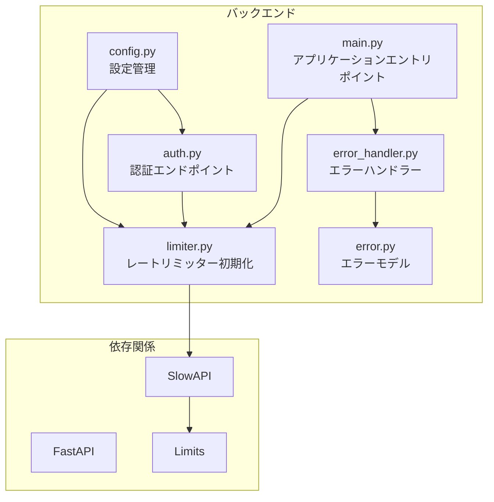
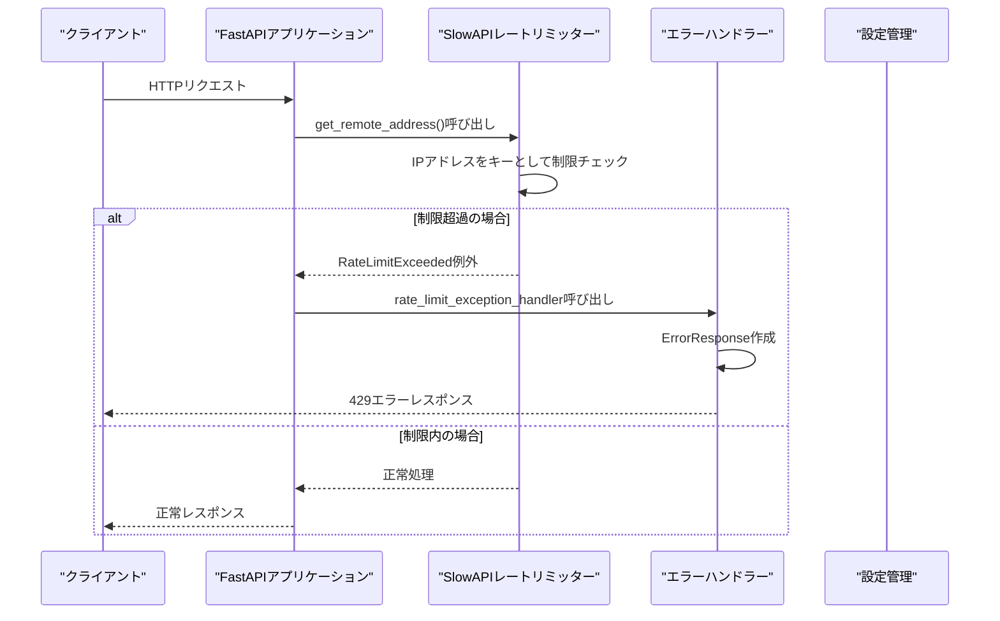
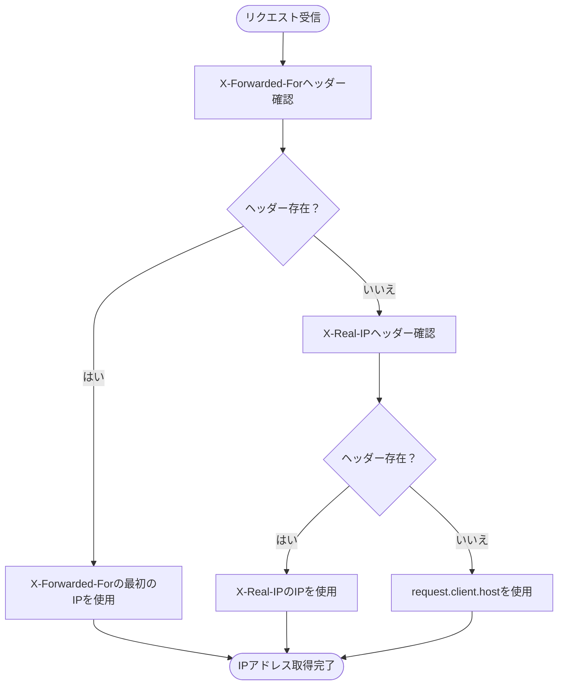
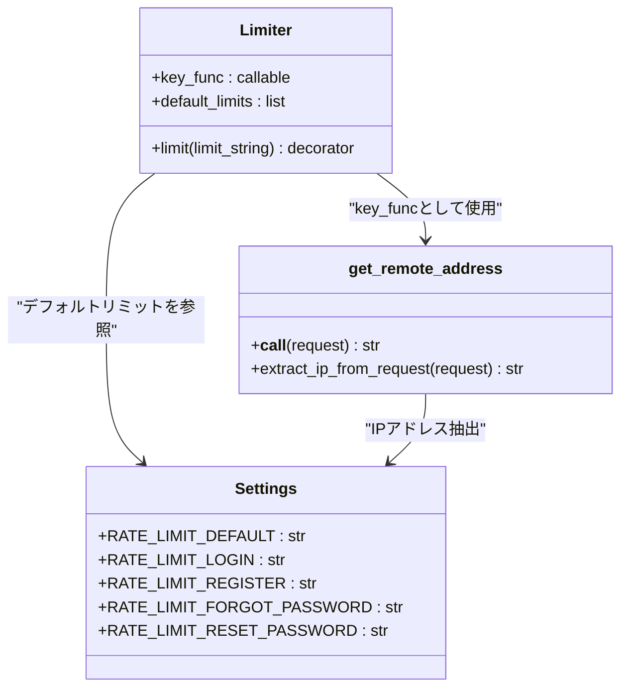
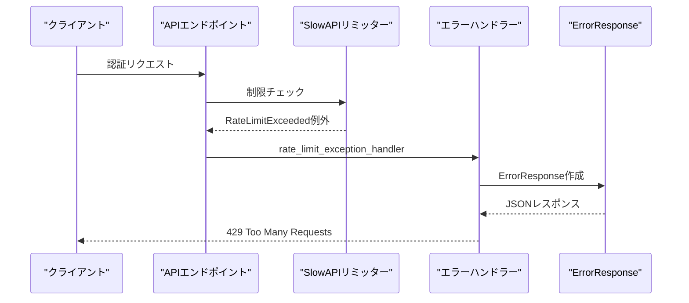
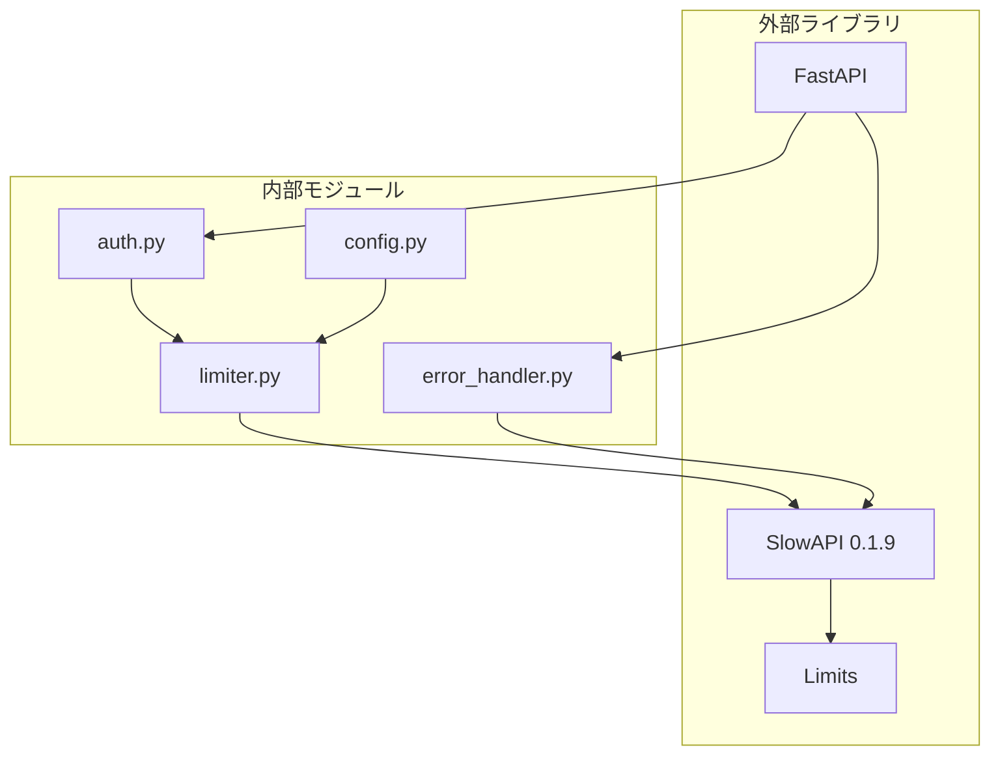

# IPアドレスベースの制限

<cite>
**この文書で参照されるファイル**
- [limiter.py](file://backend/app/core/limiter.py)
- [error_handler.py](file://backend/app/middleware/error_handler.py)
- [auth.py](file://backend/app/api/api_v1/endpoints/auth.py)
- [main.py](file://backend/app/main.py)
- [config.py](file://backend/app/core/config.py)
- [error.py](file://backend/app/schemas/error.py)
- [pyproject.toml](file://backend/pyproject.toml)
</cite>

## 目次
1. [導入](#導入)
2. [プロジェクト構造](#プロジェクト構造)
3. [コアコンポーネント](#コアコンポーネント)
4. [アーキテクチャ概要](#アーキテクチャ概要)
5. [詳細コンポーネント分析](#詳細コンポーネント分析)
6. [依存関係分析](#依存関係分析)
7. [パフォーマンス考慮事項](#パフォーマンス考慮事項)
8. [トラブルシューティングガイド](#トラブルシューティングガイド)
9. [結論](#結論)

## 導入
本ドキュメントは、Todo APIにおけるIPアドレスベースのレート制限の実装方法について説明します。SlowAPIライブラリを使用したDDoS攻撃対策としてのIP制限の仕組み、get_remote_address関数によるIP取得方法、SlowAPIのkey_funcパラメータの仕組み、制限超過時のエラーレスポンスについて詳しく解説します。また、エラーハンドリングの方法、制限解除までの待機時間についても述べます。

## プロジェクト構造
Todo APIはFastAPIフレームワークを基盤としたマイクロサービスアーキテクチャを採用しており、レート制限機能は以下のモジュール構成で実装されています。



**図の出典**
- [main.py:1-168](file://backend/app/main.py#L1-L168)
- [limiter.py:1-7](file://backend/app/core/limiter.py#L1-L7)
- [pyproject.toml:22](file://backend/pyproject.toml#L22)

**節の出典**
- [main.py:1-168](file://backend/app/main.py#L1-L168)
- [pyproject.toml:1-51](file://backend/pyproject.toml#L1-L51)

## コアコンポーネント
IPアドレスベースのレート制限を実現するための主要なコンポーネントは以下の通りです：

### 1. レートリミッターの初期化
SlowAPIのLimiterクラスを使用して、IPアドレスベースのレート制限を設定します。key_funcパラメータにget_remote_address関数を指定することで、リクエスト元のIPアドレスをキーとして制限を適用します。

### 2. 認証エンドポイントでの制限適用
認証関連のエンドポイント（ユーザー登録、ログイン、パスワードリセットなど）に対して個別のレート制限を適用します。

### 3. エラーハンドリング
SlowAPIのRateLimitExceeded例外を捕捉し、統一されたエラーレスポンスを返却します。

**節の出典**
- [limiter.py:1-7](file://backend/app/core/limiter.py#L1-L7)
- [auth.py:19-117](file://backend/app/api/api_v1/endpoints/auth.py#L19-L117)
- [error_handler.py:125-148](file://backend/app/middleware/error_handler.py#L125-L148)

## アーキテクチャ概要
IPアドレスベースのレート制限は、以下のようなフローで動作します。



**図の出典**
- [limiter.py:6](file://backend/app/core/limiter.py#L6)
- [error_handler.py:125-148](file://backend/app/middleware/error_handler.py#L125-L148)
- [main.py:71](file://backend/app/main.py#L71)

## 詳細コンポーネント分析

### IPアドレス取得メカニズム
get_remote_address関数はSlowAPIの標準ユーティリティ関数であり、リクエストの送信元IPアドレスを取得します。この関数は以下の方法でIPアドレスを決定します：

1. X-Forwarded-Forヘッダーの値をチェック
2. X-Real-IPヘッダーの値をチェック  
3. FastAPIのrequest.client.hostプロパティを使用
4. プロキシ環境に対応するための優先順位付け



**図の出典**
- [limiter.py:2](file://backend/app/core/limiter.py#L2)

**節の出典**
- [limiter.py:1-7](file://backend/app/core/limiter.py#L1-L7)

### SlowAPIのkey_funcパラメータ仕組み
SlowAPIのkey_funcパラメータは、レート制限のキーとなる値を決定する関数です。IPアドレスベースの制限では以下の仕組みで動作します：



**図の出典**
- [limiter.py:6](file://backend/app/core/limiter.py#L6)
- [config.py:62-67](file://backend/app/core/config.py#L62-L67)

**節の出典**
- [limiter.py:1-7](file://backend/app/core/limiter.py#L1-L7)
- [config.py:62-67](file://backend/app/core/config.py#L62-L67)

### 認証エンドポイントでの制限適用
認証関連のエンドポイントには個別のレート制限が適用されており、それぞれのエンドポイントごとに異なる制限が設定されています：

| エンドポイント | 制限設定 | 説明 |
|---------------|----------|------|
| POST /api/v1/auth/register | RATE_LIMIT_REGISTER | 新規ユーザー登録 |
| POST /api/v1/auth/token | RATE_LIMIT_LOGIN | ログイン認証 |
| POST /api/v1/auth/forgot-password | RATE_LIMIT_FORGOT_PASSWORD | パスワードリセットメール送信 |
| POST /api/v1/auth/reset-password | RATE_LIMIT_RESET_PASSWORD | パスワードリセット |

**節の出典**
- [auth.py:19-117](file://backend/app/api/api_v1/endpoints/auth.py#L19-L117)
- [config.py:62-67](file://backend/app/core/config.py#L62-L67)

### 制限超過時のエラーレスポンス
SlowAPIのRateLimitExceeded例外は、rate_limit_exception_handlerによって捕捉され、ErrorResponseスキーマに従った統一されたエラーレスポンスが返却されます。



**図の出典**
- [error_handler.py:125-148](file://backend/app/middleware/error_handler.py#L125-L148)
- [error.py:5-23](file://backend/app/schemas/error.py#L5-L23)

**節の出典**
- [error_handler.py:125-148](file://backend/app/middleware/error_handler.py#L125-L148)
- [error.py:5-23](file://backend/app/schemas/error.py#L5-L23)

## 依存関係分析
レート制限機能の実装には以下の外部依存関係が関与しています。



**図の出典**
- [pyproject.toml:22](file://backend/pyproject.toml#L22)
- [limiter.py:1-7](file://backend/app/core/limiter.py#L1-L7)

**節の出典**
- [pyproject.toml:1-51](file://backend/pyproject.toml#L1-L51)
- [limiter.py:1-7](file://backend/app/core/limiter.py#L1-L7)

## パフォーマンス考慮事項
IPアドレスベースのレート制限は以下の点でパフォーマンスに影響を与える可能性があります：

### 1. Redisキャッシュの活用
SlowAPIはデフォルトでRedisをキャッシュとして使用します。Redisを使用することで、レート制限の状態を分散環境で共有でき、スケーラビリティを向上させます。

### 2. IPアドレスの抽出コスト
get_remote_address関数は複数のヘッダーをチェックするため、リクエスト処理にわずかなオーバーヘッドが発生します。ただし、これは通常のネットワーク処理と比較すると無視できる程度です。

### 3. 設定の最適化
- **デフォルトリミット**: RATE_LIMIT_DEFAULTを適切な値に設定することで、全体的なリクエスト量を制御できます
- **エンドポイント別制限**: 特に脆弱なエンドポイント（ログイン）にはより厳しい制限を適用すべきです
- **タイムウィンドウ**: 秒単位から分単位への設定により、柔軟な制御が可能です

## トラブルシューティングガイド

### 1. 制限超過時のエラーメッセージ
制限超過時に表示されるエラーメッセージは以下の通りです：
- "リクエスト制限を超過しました。しばらく待ってから再度お試しください"
- HTTPステータスコード: 429 Too Many Requests
- エラーコード: RATE_LIMIT_EXCEEDED

### 2. IPアドレスの誤認識
プロキシ環境でIPアドレスが正しく取得されない場合があります。以下の対応を検討してください：

- **X-Forwarded-Forヘッダーの設定**: ロードバランサーやプロキシサーバーで正しいIPアドレスを設定
- **X-Real-IPヘッダーの設定**: Nginxなどのプロキシでreal ipを設定
- **FastAPIのproxy_headers設定**: `forwarded_allow_ips`を適切に設定

### 3. 制限解除までの待機時間
制限解除までの待機時間は、SlowAPIの設定で制御されます。デフォルトでは以下の設定が適用されています：

- **デフォルトリミット**: 100リクエスト/分
- **ログイン制限**: 5リクエスト/分  
- **新規登録制限**: 5リクエスト/分
- **パスワードリセット制限**: 3リクエスト/時間

### 4. 設定の確認方法
環境変数経由で設定を変更できます：

```bash
# 全体の制限を緩和
export RATE_LIMIT_DEFAULT="200/minute"

# ログイン制限を緩和
export RATE_LIMIT_LOGIN="10/minute"

# 新規登録制限を緩和
export RATE_LIMIT_REGISTER="10/minute"

# パスワードリセット制限を緩和
export RATE_LIMIT_FORGOT_PASSWORD="5/hour"
```

**節の出典**
- [error_handler.py:118](file://backend/app/middleware/error_handler.py#L118)
- [config.py:62-67](file://backend/app/core/config.py#L62-L67)

## 結論
IPアドレスベースのレート制限は、Todo APIのDDoS攻撃対策として重要な役割を果たしています。SlowAPIのkey_funcパラメータとget_remote_address関数を活用することで、リクエスト元のIPアドレスを正確に識別し、柔軟な制限を適用することが可能になります。各エンドポイントごとの個別制限設定により、特に脆弱な認証エンドポイントに対する保護を強化し、システム全体の安定性を確保しています。

エラーハンドリングを通じて統一されたエラーレスポンスを提供することで、クライアント側にも明確なフィードバックが得られ、運用上の問題の早期発見が可能になります。Redisキャッシュの活用により、スケーラブルなレート制限が実現されており、本番環境での運用にも適した設計となっています。