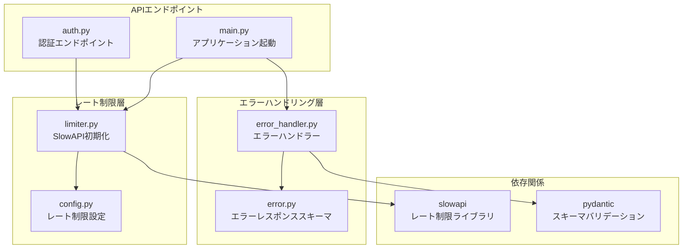
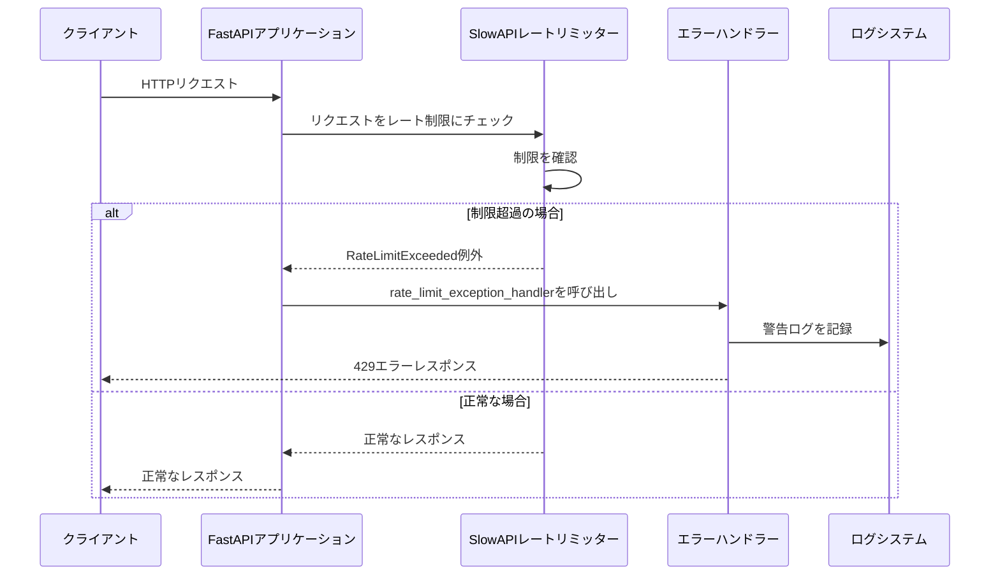
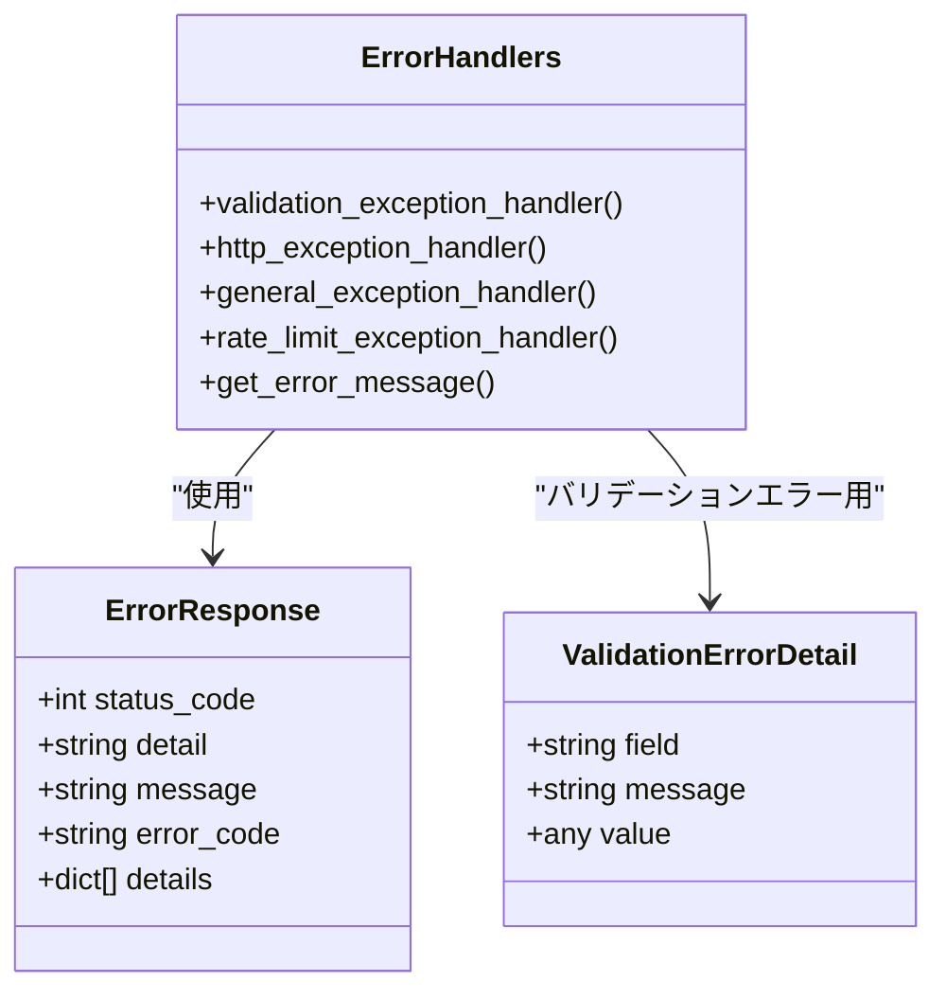
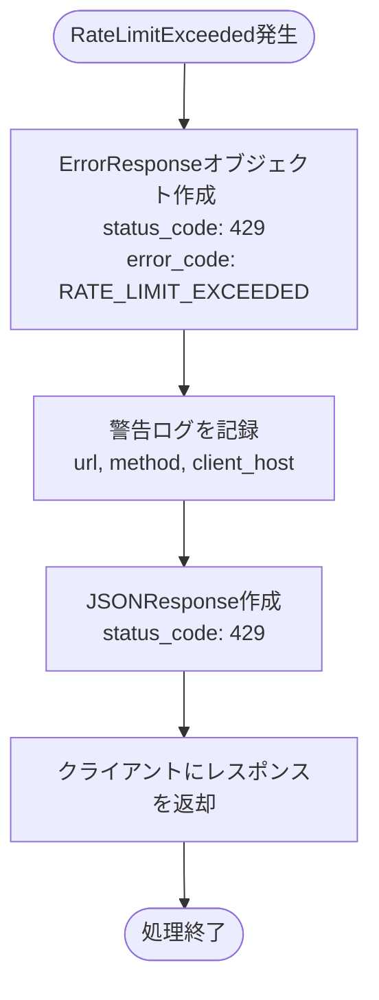
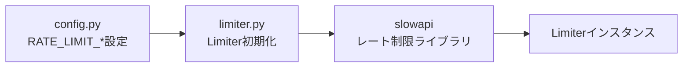
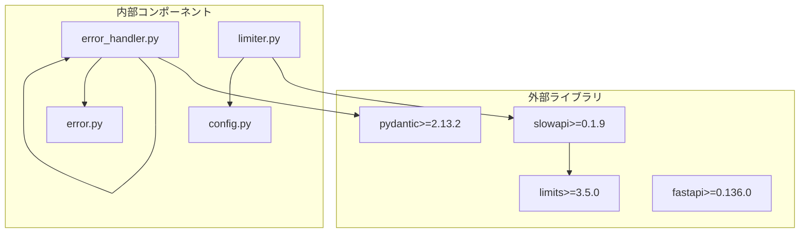
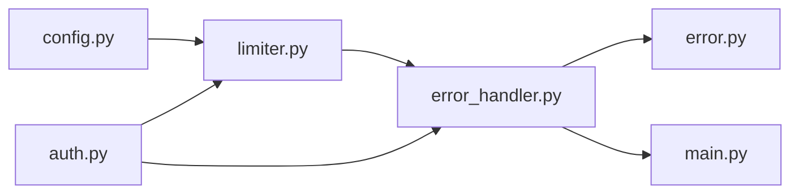
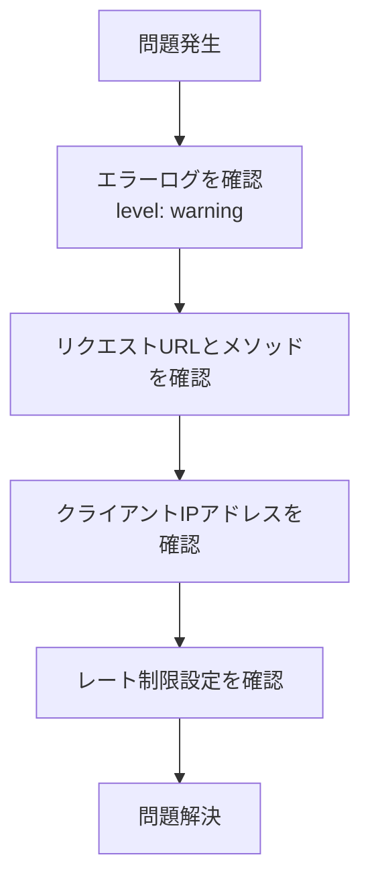

# エラーハンドリング

<cite>
**このドキュメントで参照されるファイル**
- [error_handler.py](file://backend/app/middleware/error_handler.py)
- [limiter.py](file://backend/app/core/limiter.py)
- [error.py](file://backend/app/schemas/error.py)
- [main.py](file://backend/app/main.py)
- [config.py](file://backend/app/core/config.py)
- [auth.py](file://backend/app/api/api_v1/endpoints/auth.py)
- [pyproject.toml](file://backend/pyproject.toml)
</cite>

## 目次
1. [導入](#導入)
2. [プロジェクト構造](#プロジェクト構造)
3. [コアコンポーネント](#コアコンポーネント)
4. [アーキテクチャ概要](#アーキテクチャ概要)
5. [詳細コンポーネント分析](#詳細コンポーネント分析)
6. [依存関係分析](#依存関係分析)
7. [パフォーマンス考慮事項](#パフォーマンス考慮事項)
8. [トラブルシューティングガイド](#トラブルシューティングガイド)
9. [結論](#結論)

## 導入

本ドキュメントは、レート制限超過時のエラーハンドリングとレスポンス処理について詳細に説明します。FastAPIフレームワーク上で実装されたSlowAPIを使用したレート制限機能を基に、429 Too Many Requestsエラーの生成、エラーメッセージのフォーマット、クライアントへの適切なフィードバック方法について解説します。また、レート制限の状態管理、リセット時間の計算、エラーログの記録方法についても述べます。

## プロジェクト構造

レート制限機能は以下の主要なコンポーネントで構成されています：



**図の出典**
- [error_handler.py:1-149](file://backend/app/middleware/error_handler.py#L1-L149)
- [limiter.py:1-7](file://backend/app/core/limiter.py#L1-L7)
- [config.py:62-67](file://backend/app/core/config.py#L62-L67)
- [auth.py:19-87](file://backend/app/api/api_v1/endpoints/auth.py#L19-L87)

**セクションの出典**
- [error_handler.py:1-149](file://backend/app/middleware/error_handler.py#L1-L149)
- [limiter.py:1-7](file://backend/app/core/limiter.py#L1-L7)
- [config.py:62-67](file://backend/app/core/config.py#L62-L67)
- [auth.py:19-87](file://backend/app/api/api_v1/endpoints/auth.py#L19-L87)

## コアコンポーネント

### エラーハンドリングコンポーネント

エラーハンドリングは、統一されたErrorResponseスキーマを使用してクライアントにエラーレスポンスを提供します。主なコンポーネントは以下の通りです：

- **ErrorResponseスキーマ**: すべてのエラーレスポンスの共通フォーマット
- **ValidationErrorDetail**: バリデーションエラーの詳細情報
- **エラーメッセージマッピング**: ステータスコードごとの日本語メッセージ

### レート制限コンポーネント

レート制限はSlowAPIを使用して実装されており、以下の要素で構成されています：

- **SlowAPI初期化**: IPアドレスベースのキー関数とデフォルトリミット
- **設定管理**: 環境変数からのレート制限設定の読み込み
- **エンドポイントレベルの制限**: 各認証エンドポイントごとの異なる制限

**セクションの出典**
- [error.py:5-23](file://backend/app/schemas/error.py#L5-L23)
- [limiter.py:1-7](file://backend/app/core/limiter.py#L1-L7)
- [config.py:62-67](file://backend/app/core/config.py#L62-L67)

## アーキテクチャ概要

レート制限とエラーハンドリングの全体像は以下のようになります：



**図の出典**
- [error_handler.py:125-148](file://backend/app/middleware/error_handler.py#L125-L148)
- [limiter.py:1-7](file://backend/app/core/limiter.py#L1-L7)
- [main.py:66-71](file://backend/app/main.py#L66-L71)

## 詳細コンポーネント分析

### エラーハンドリングシステム

#### ErrorResponseスキーマ

ErrorResponseスキーマは、すべてのエラーレスポンスに共通の構造を持ちます：



**図の出典**
- [error.py:5-23](file://backend/app/schemas/error.py#L5-L23)
- [error_handler.py:15-148](file://backend/app/middleware/error_handler.py#L15-L148)

#### レート制限エラーハンドラー

rate_limit_exception_handler関数は、SlowAPIのRateLimitExceeded例外を処理します：



**図の出典**
- [error_handler.py:125-148](file://backend/app/middleware/error_handler.py#L125-L148)

**セクションの出典**
- [error_handler.py:125-148](file://backend/app/middleware/error_handler.py#L125-L148)
- [error.py:5-23](file://backend/app/schemas/error.py#L5-L23)

### レート制限システム

#### SlowAPI初期化

SlowAPIはIPアドレスをキーとして使用するリミッターを初期化します：



**図の出典**
- [limiter.py:1-7](file://backend/app/core/limiter.py#L1-L7)
- [config.py:62-67](file://backend/app/core/config.py#L62-L67)

#### 設定管理

レート制限設定は環境変数から読み込まれ、以下のような種類があります：

- **デフォルトリミット**: 全体的なリクエスト制限
- **ログイン制限**: `/api/v1/auth/token`の制限
- **登録制限**: `/api/v1/auth/register`の制限
- **パスワードリセット制限**: `/api/v1/auth/forgot-password`と`/api/v1/auth/reset-password`の制限

**セクションの出典**
- [limiter.py:1-7](file://backend/app/core/limiter.py#L1-L7)
- [config.py:62-67](file://backend/app/core/config.py#L62-L67)

### APIエンドポイントでのレート制限

認証関連のエンドポイントにはそれぞれ異なるレート制限が適用されています：

```mermaid
graph TB
subgraph "認証エンドポイント"
Register[/api/v1/auth/register<br/>5/minute]
Login[/api/v1/auth/token<br/>5/minute]
ForgotPassword[/api/v1/auth/forgot-password<br/>3/hour]
ResetPassword[/api/v1/auth/reset-password<br/>5/minute]
end
subgraph "レートリミッター"
Limiter[limiter.py<br/>SlowAPIリミッター]
end
Register --> Limiter
Login --> Limiter
ForgotPassword --> Limiter
ResetPassword --> Limiter
```

**図の出典**
- [auth.py:19-87](file://backend/app/api/api_v1/endpoints/auth.py#L19-L87)
- [limiter.py:1-7](file://backend/app/core/limiter.py#L1-L7)

**セクションの出典**
- [auth.py:19-87](file://backend/app/api/api_v1/endpoints/auth.py#L19-L87)

## 依存関係分析

### 外部依存関係



**図の出典**
- [pyproject.toml:7-25](file://backend/pyproject.toml#L7-L25)
- [error_handler.py:1-149](file://backend/app/middleware/error_handler.py#L1-L149)
- [limiter.py:1-7](file://backend/app/core/limiter.py#L1-L7)

### 内部依存関係



**図の出典**
- [config.py:62-67](file://backend/app/core/config.py#L62-L67)
- [limiter.py:1-7](file://backend/app/core/limiter.py#L1-L7)
- [error_handler.py:1-149](file://backend/app/middleware/error_handler.py#L1-L149)
- [auth.py:19-87](file://backend/app/api/api_v1/endpoints/auth.py#L19-L87)

**セクションの出典**
- [pyproject.toml:7-25](file://backend/pyproject.toml#L7-L25)
- [main.py:66-71](file://backend/app/main.py#L66-L71)

## パフォーマンス考慮事項

### レート制限のパフォーマンス特性

1. **メモリ効率**: SlowAPIはRedisなどの外部ストレージを使用することで、メモリ効率の良いレート制限を実現できます
2. **スケーラビリティ**: 複数のアプリケーションインスタンス間でレート制限情報を共有可能
3. **パフォーマンスオーバーヘッド**: 各リクエストに対して1回のRedisアクセスが必要

### ログ出力のパフォーマンス

- **非同期ログ出力**: Pythonのloggingライブラリは非同期に動作し、パフォーマンスへの影響を最小限に抑える
- **ログレベルの選択**: 警告レベルのログのみを記録することで、I/Oのオーバーヘッドを削減

## トラブルシューティングガイド

### 一般的な問題と解決策

#### 429エラーが頻繁に発生する場合

1. **設定の確認**
   - 環境変数`RATE_LIMIT_*`の値を確認
   - 各エンドポイントのレート制限設定を確認

2. **クライアント側の対応**
   - `Retry-After`ヘッダーの値を確認し、それに従ってリクエストを遅らせる
   - 一時的なアクセスを避けるために指数バックオフを使用

#### ログの確認方法



**図の出典**
- [error_handler.py:136-143](file://backend/app/middleware/error_handler.py#L136-L143)

#### 例外処理の確認

1. **エラーハンドラーの登録状況を確認**
   - FastAPIアプリケーションの例外ハンドラー登録を確認

2. **ErrorResponseスキーマのバリデーション**
   - 必須フィールドが正しく設定されているか確認

**セクションの出典**
- [error_handler.py:136-143](file://backend/app/middleware/error_handler.py#L136-L143)
- [main.py:66-71](file://backend/app/main.py#L66-L71)

### 常駐型の問題点

- **Redis接続の問題**: Redisが利用できない場合、レート制限が機能しない可能性がある
- **設定の誤り**: 環境変数の設定ミスにより、予期せぬレート制限が適用される可能性がある
- **ログ出力の問題**: ログ出力が失敗すると、問題の診断が困難になる

## 結論

本システムは、SlowAPIを使用した堅牢なレート制限機能と、統一されたエラーハンドリングメカニズムを備えています。429 Too Many Requestsエラーは適切に生成され、クライアントに明確なフィードバックが提供されます。エラーメッセージは日本語で提供され、エラーログは詳細な情報を含んで記録されます。

主な特徴は以下の通りです：
- 環境変数による柔軟なレート制限設定
- 各エンドポイントごとの異なる制限設定
- 統一されたErrorResponseスキーマ
- 詳細なエラーログ出力
- 非常に高い拡張性とメンテナンス性

今後の改善点としては、Redisを使用した分散型レート制限の導入や、より詳細な統計情報の収集が考えられます。