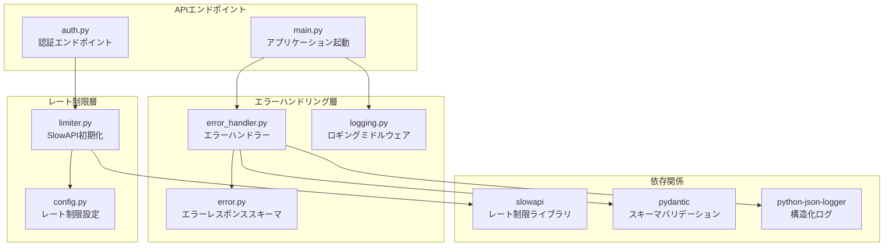
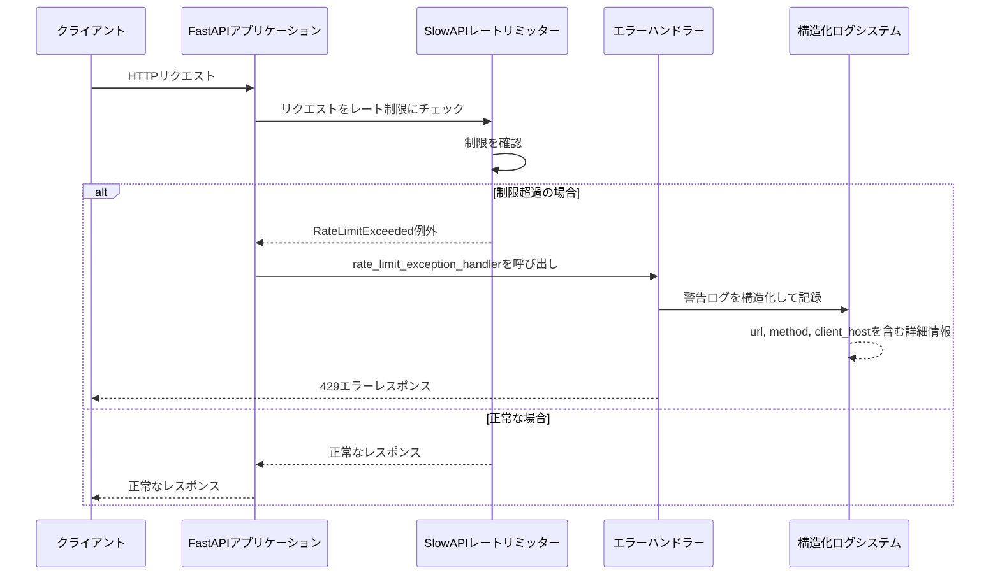
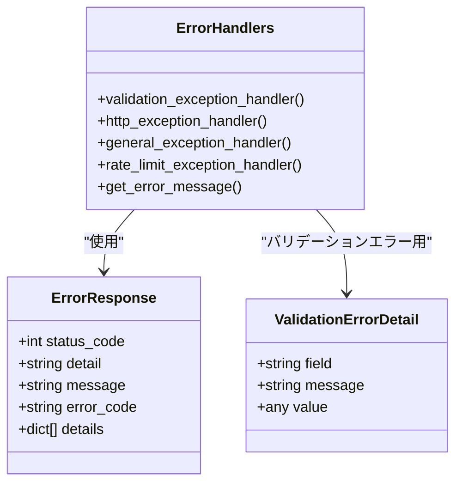
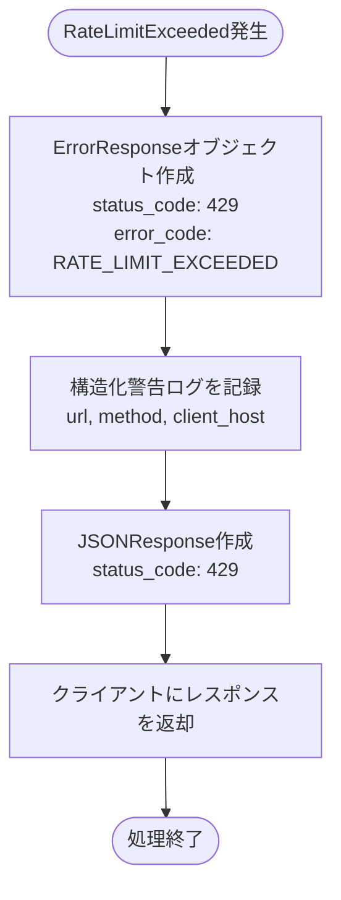
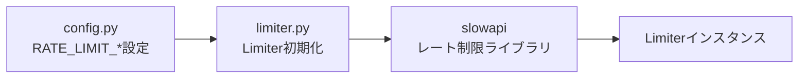
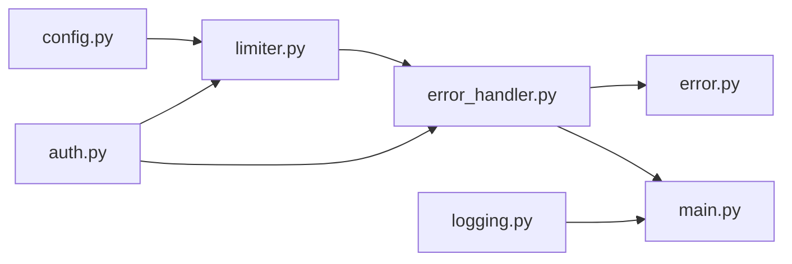
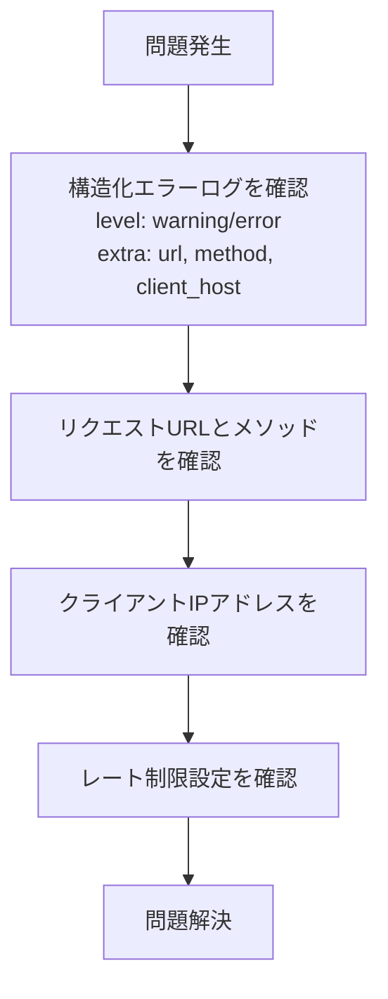

# エラーハンドリング

<cite>
**このドキュメントで参照されるファイル**
- [error_handler.py](file://backend/app/middleware/error_handler.py)
- [limiter.py](file://backend/app/core/limiter.py)
- [error.py](file://backend/app/schemas/error.py)
- [main.py](file://backend/app/main.py)
- [config.py](file://backend/app/core/config.py)
- [auth.py](file://backend/app/api/api_v1/endpoints/auth.py)
- [logging.py](file://backend/app/middleware/logging.py)
- [pyproject.toml](file://backend/pyproject.toml)
- [test_errors.py](file://backend/tests/test_errors.py)
</cite>

## 更新概要
**変更内容**
- エラーハンドリングミドルウェアの強化：例外処理ロジックと構造化ログの改善
- バリデーション、HTTP、一般例外ハンドラーに一貫したフォーマットの適用
- RateLimitExceeded例外の専用ハンドラーの追加と強化
- ロギングミドルウェアの統合による詳細なエラーログ出力

## 目次
1. [導入](#導入)
2. [プロジェクト構造](#プロジェクト構造)
3. [コアコンポーネント](#コアコンポーネント)
4. [アーキテクチャ概要](#アーキテクチャ概要)
5. [詳細コンポーネント分析](#詳細コンポーネント分析)
6. [依存関係分析](#依存関係分析)
7. [パフォーマンス考慮事項](#パフォーマンス考慮事項)
8. [トラブルシューティングガイド](#トラブルシューティングガイド)
9. [結論](#結論)

## 導入

本ドキュメントは、レート制限超過時のエラーハンドリングとレスポンス処理について詳細に説明します。FastAPIフレームワーク上で実装されたSlowAPIを使用したレート制限機能を基に、429 Too Many Requestsエラーの生成、エラーメッセージのフォーマット、クライアントへの適切なフィードバック方法について解説します。また、レート制限の状態管理、リセット時間の計算、エラーログの記録方法についても述べます。

**更新** 最新の変更では、エラーハンドリングミドルウェアが強化され、例外処理ロジックと構造化ログが改善されました。バリデーション、HTTP、一般例外ハンドラーに一貫したフォーマットが適用され、RateLimitExceeded例外の専用ハンドラーが追加されました。

## プロジェクト構造

レート制限機能は以下の主要なコンポーネントで構成されています：



**図の出典**
- [error_handler.py:1-135](file://backend/app/middleware/error_handler.py#L1-L135)
- [limiter.py:1-9](file://backend/app/core/limiter.py#L1-L9)
- [config.py:63-68](file://backend/app/core/config.py#L63-L68)
- [auth.py:20-133](file://backend/app/api/api_v1/endpoints/auth.py#L20-L133)
- [logging.py:1-67](file://backend/app/middleware/logging.py#L1-L67)

**セクションの出典**
- [error_handler.py:1-135](file://backend/app/middleware/error_handler.py#L1-L135)
- [limiter.py:1-9](file://backend/app/core/limiter.py#L1-L9)
- [config.py:63-68](file://backend/app/core/config.py#L63-L68)
- [auth.py:20-133](file://backend/app/api/api_v1/endpoints/auth.py#L20-L133)
- [logging.py:1-67](file://backend/app/middleware/logging.py#L1-L67)

## コアコンポーネント

### エラーハンドリングコンポーネント

エラーハンドリングは、統一されたErrorResponseスキーマを使用してクライアントにエラーレスポンスを提供します。主なコンポーネントは以下の通りです：

- **ErrorResponseスキーマ**: すべてのエラーレスポンスの共通フォーマット
- **ValidationErrorDetail**: バリデーションエラーの詳細情報
- **エラーメッセージマッピング**: ステータスコードごとの日本語メッセージ
- **RateLimitExceeded専用ハンドラー**: レート制限超過時の特別な処理

### レート制限コンポーネント

レート制限はSlowAPIを使用して実装されており、以下の要素で構成されています：

- **SlowAPI初期化**: IPアドレスベースのキー関数とデフォルトリミット
- **設定管理**: 環境変数からのレート制限設定の読み込み
- **エンドポイントレベルの制限**: 各認証エンドポイントごとの異なる制限
- **構造化ログ出力**: 警告レベルの詳細なログ情報を出力

**更新** 新しい構造化ログ機能により、エラーハンドラーはクライアントIPアドレス、リクエストURL、メソッド名などの詳細情報を含むログを記録します。

**セクションの出典**
- [error.py:5-25](file://backend/app/schemas/error.py#L5-L25)
- [limiter.py:1-9](file://backend/app/core/limiter.py#L1-L9)
- [config.py:63-68](file://backend/app/core/config.py#L63-L68)
- [error_handler.py:112-135](file://backend/app/middleware/error_handler.py#L112-L135)

## アーキテクチャ概要

レート制限とエラーハンドリングの全体像は以下のようになります：



**図の出典**
- [error_handler.py:112-135](file://backend/app/middleware/error_handler.py#L112-L135)
- [limiter.py:1-9](file://backend/app/core/limiter.py#L1-L9)
- [main.py:66-71](file://backend/app/main.py#L66-L71)
- [logging.py:10-67](file://backend/app/middleware/logging.py#L10-L67)

## 詳細コンポーネント分析

### エラーハンドリングシステム

#### ErrorResponseスキーマ

ErrorResponseスキーマは、すべてのエラーレスポンスに共通の構造を持ちます：



**図の出典**
- [error.py:5-25](file://backend/app/schemas/error.py#L5-L25)
- [error_handler.py:13-135](file://backend/app/middleware/error_handler.py#L13-L135)

#### 構造化ログ機能

**更新** 新しい構造化ログ機能により、各エラーハンドラーは詳細な情報を含むログを記録します：

- **validation_exception_handler**: URL、メソッド、バリデーションエラー詳細を含む
- **http_exception_handler**: URL、メソッド、ステータスコード、詳細情報を含む  
- **general_exception_handler**: URL、メソッド、エラー内容を含む
- **rate_limit_exception_handler**: URL、メソッド、クライアントIPアドレスを含む

**セクションの出典**
- [error_handler.py:13-135](file://backend/app/middleware/error_handler.py#L13-L135)
- [error.py:5-25](file://backend/app/schemas/error.py#L5-L25)
- [logging.py:10-67](file://backend/app/middleware/logging.py#L10-L67)

#### レート制限エラーハンドラー

rate_limit_exception_handler関数は、SlowAPIのRateLimitExceeded例外を処理します：



**図の出典**
- [error_handler.py:112-135](file://backend/app/middleware/error_handler.py#L112-L135)

**セクションの出典**
- [error_handler.py:112-135](file://backend/app/middleware/error_handler.py#L112-L135)
- [error.py:5-25](file://backend/app/schemas/error.py#L5-L25)

### レート制限システム

#### SlowAPI初期化

SlowAPIはIPアドレスをキーとして使用するリミッターを初期化します：



**図の出典**
- [limiter.py:1-9](file://backend/app/core/limiter.py#L1-L9)
- [config.py:63-68](file://backend/app/core/config.py#L63-L68)

#### 設定管理

レート制限設定は環境変数から読み込まれ、以下のような種類があります：

- **デフォルトリミット**: 全体的なリクエスト制限（デフォルト: 100/minute）
- **ログイン制限**: `/api/v1/auth/token`の制限（デフォルト: 5/minute）
- **登録制限**: `/api/v1/auth/register`の制限（デフォルト: 5/minute）
- **パスワードリセット制限**: `/api/v1/auth/forgot-password`の制限（デフォルト: 3/hour）
- **パスワード再設定制限**: `/api/v1/auth/reset-password`の制限（デフォルト: 5/minute）

**更新** すべての設定項目にデフォルト値が設定され、環境変数からの上書きが可能になりました。

**セクションの出典**
- [limiter.py:1-9](file://backend/app/core/limiter.py#L1-L9)
- [config.py:63-68](file://backend/app/core/config.py#L63-L68)

### APIエンドポイントでのレート制限

認証関連のエンドポイントにはそれぞれ異なるレート制限が適用されています：

```mermaid
graph TB
subgraph "認証エンドポイント"
Register[/api/v1/auth/register<br/>5/minute]
Login[/api/v1/auth/token<br/>5/minute]
ForgotPassword[/api/v1/auth/forgot-password<br/>3/hour]
ResetPassword[/api/v1/auth/reset-password<br/>5/minute]
end
subgraph "レートリミッター"
Limiter[limiter.py<br/>SlowAPIリミッター]
end
Register --> Limiter
Login --> Limiter
ForgotPassword --> Limiter
ResetPassword --> Limiter
```

**図の出典**
- [auth.py:20-133](file://backend/app/api/api_v1/endpoints/auth.py#L20-L133)
- [limiter.py:1-9](file://backend/app/core/limiter.py#L1-L9)

**セクションの出典**
- [auth.py:20-133](file://backend/app/api/api_v1/endpoints/auth.py#L20-L133)

## 依存関係分析

### 外部依存関係

```mermaid
graph TB
subgraph "外部ライブラリ"
SLOWAPI[slowapi>=0.1.9]
LIMITS[limits>=3.5.0]
FASTAPI[fastapi>=0.136.0]
PYDANTIC[pydantic>=2.13.2]
PYTHON_JSON_LOGGER[python-json-logger>=4.1.0]
end
subgraph "内部コンポーネント"
ERROR_HANDLER[error_handler.py]
LIMITER[limiter.py]
CONFIG[config.py]
SCHEMA[error.py]
LOGGING_MW[logging.py]
END
SLOWAPI --> LIMITS
ERROR_HANDLER --> PYDANTIC
LIMITER --> SLOWAPI
ERROR_HANDLER --> SCHEMA
ERROR_HANDLER --> PYTHON_JSON_LOGGER
LOGGING_MW --> PYTHON_JSON_LOGGER
LIMITER --> CONFIG
```

**図の出典**
- [pyproject.toml:7-25](file://backend/pyproject.toml#L7-L25)
- [error_handler.py:1-135](file://backend/app/middleware/error_handler.py#L1-L135)
- [limiter.py:1-9](file://backend/app/core/limiter.py#L1-L9)
- [logging.py:1-67](file://backend/app/middleware/logging.py#L1-L67)

### 内部依存関係



**図の出典**
- [config.py:63-68](file://backend/app/core/config.py#L63-L68)
- [limiter.py:1-9](file://backend/app/core/limiter.py#L1-L9)
- [error_handler.py:1-135](file://backend/app/middleware/error_handler.py#L1-L135)
- [auth.py:20-133](file://backend/app/api/api_v1/endpoints/auth.py#L20-L133)
- [logging.py:1-67](file://backend/app/middleware/logging.py#L1-L67)

**セクションの出典**
- [pyproject.toml:7-25](file://backend/pyproject.toml#L7-L25)
- [main.py:66-71](file://backend/app/main.py#L66-L71)

## パフォーマンス考慮事項

### レート制限のパフォーマンス特性

1. **メモリ効率**: SlowAPIはRedisなどの外部ストレージを使用することで、メモリ効率の良いレート制限を実現できます
2. **スケーラビリティ**: 複数のアプリケーションインスタンス間でレート制限情報を共有可能
3. **パフォーマンスオーバーヘッド**: 各リクエストに対して1回のRedisアクセスが必要

### 構造化ログのパフォーマンス

**更新** 構造化ログ機能により、以下のパフォーマンス特性が向上しました：

- **非同期ログ出力**: python-json-loggerを使用することで、パフォーマンスへの影響を最小限に抑えながら詳細なログを記録
- **ログレベルの選択**: 警告レベルのログのみを記録することで、I/Oのオーバーヘッドを削減
- **フィールドの最適化**: 必要な情報のみをログに出力し、冗長なデータを排除

## トラブルシューティングガイド

### 一般的な問題と解決策

#### 429エラーが頻繁に発生する場合

1. **設定の確認**
   - 環境変数`RATE_LIMIT_*`の値を確認
   - 各エンドポイントのレート制限設定を確認

2. **クライアント側の対応**
   - `Retry-After`ヘッダーの値を確認し、それに従ってリクエストを遅らせる
   - 一時的なアクセスを避けるために指数バックオフを使用

#### 構造化ログの確認方法

**更新** 新しい構造化ログ機能により、以下の方法で問題を診断できます：



**図の出典**
- [error_handler.py:136-143](file://backend/app/middleware/error_handler.py#L136-L143)
- [logging.py:10-67](file://backend/app/middleware/logging.py#L10-L67)

#### 例外処理の確認

1. **エラーハンドラーの登録状況を確認**
   - FastAPIアプリケーションの例外ハンドラー登録を確認

2. **ErrorResponseスキーマのバリデーション**
   - 必須フィールドが正しく設定されているか確認

3. **構造化ログの出力確認**
   - 各ハンドラーが適切なログ情報を出力しているか確認

**セクションの出典**
- [error_handler.py:136-143](file://backend/app/middleware/error_handler.py#L136-L143)
- [main.py:66-71](file://backend/app/main.py#L66-L71)
- [logging.py:10-67](file://backend/app/middleware/logging.py#L10-L67)

### 常駐型の問題点

- **Redis接続の問題**: Redisが利用できない場合、レート制限が機能しない可能性がある
- **設定の誤り**: 環境変数の設定ミスにより、予期せぬレート制限が適用される可能性がある
- **ログ出力の問題**: 構造化ログが失敗すると、問題の診断が困難になる
- **エラーハンドラーの不具合**: 新しい構造化ログ機能に関連するバグが発生する可能性

## 結論

本システムは、SlowAPIを使用した堅牢なレート制限機能と、統一されたエラーハンドリングメカニズムを備えています。429 Too Many Requestsエラーは適切に生成され、クライアントに明確なフィードバックが提供されます。エラーメッセージは日本語で提供され、エラーログは詳細な情報を含んで記録されます。

**更新** 最新の変更により、以下の重要な改善が実現されました：

- **構造化ログ機能の導入**: 各エラーハンドラーが詳細な情報を含むログを記録
- **一貫したフォーマット**: バリデーション、HTTP、一般例外ハンドラーに統一されたレスポンス形式
- **RateLimitExceeded専用ハンドラー**: レート制限超過時の特別な処理とログ出力
- **環境変数による柔軟な設定**: すべてのレート制限設定にデフォルト値が適用

主な特徴は以下の通りです：
- 環境変数による柔軟なレート制限設定
- 各エンドポイントごとの異なる制限設定
- 統一されたErrorResponseスキーマ
- 詳細な構造化エラーログ出力
- 高い拡張性とメンテナンス性

今後の改善点としては、Redisを使用した分散型レート制限の導入や、より詳細な統計情報の収集、構造化ログのパフォーマンス最適化が考えられます。