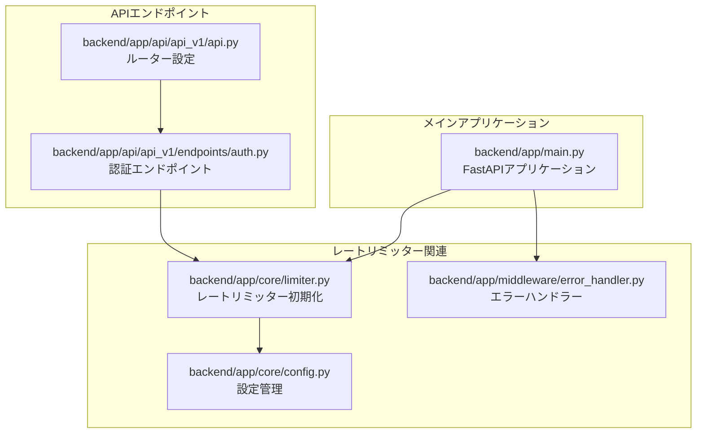
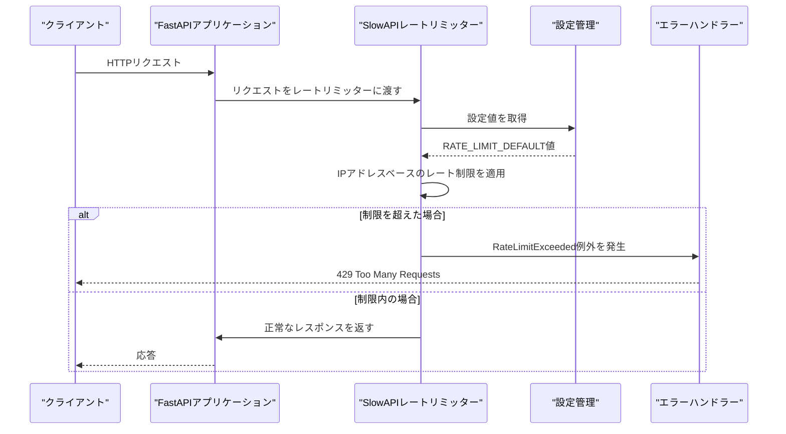
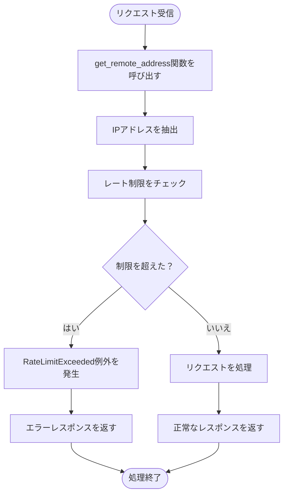
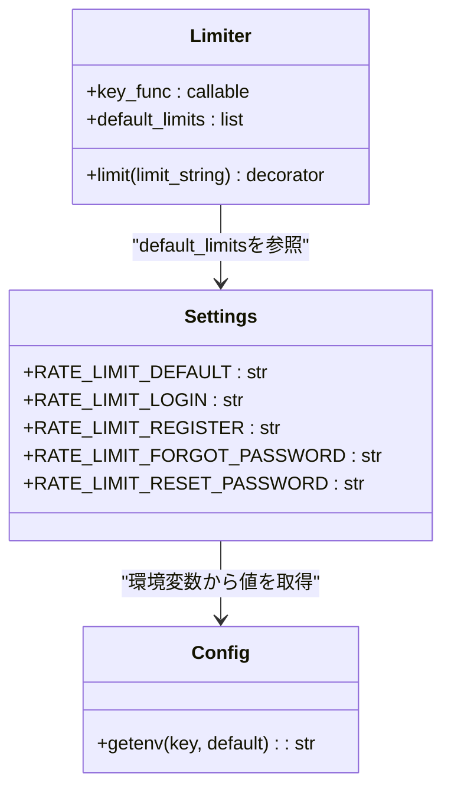
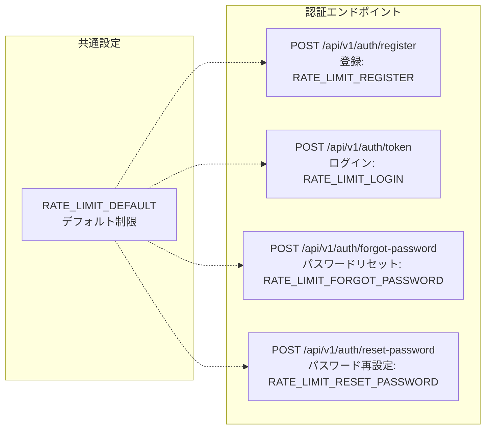
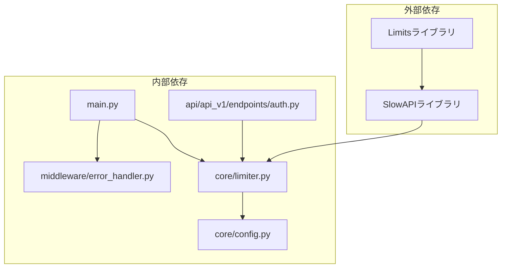

# レートリミッターの設定

<cite>
**このドキュメントで参照されるファイル**
- [limiter.py](file://backend/app/core/limiter.py)
- [config.py](file://backend/app/core/config.py)
- [main.py](file://backend/app/main.py)
- [error_handler.py](file://backend/app/middleware/error_handler.py)
- [auth.py](file://backend/app/api/api_v1/endpoints/auth.py)
- [api.py](file://backend/app/api/api_v1/api.py)
</cite>

## 目次
1. [はじめに](#はじめに)
2. [プロジェクト構造](#プロジェクト構造)
3. [コアコンポーネント](#コアコンポーネント)
4. [アーキテクチャ概要](#アーキテクチャ概要)
5. [詳細コンポーネント分析](#詳細コンポーネント分析)
6. [依存関係分析](#依存関係分析)
7. [パフォーマンス考慮事項](#パフォーマンス考慮事項)
8. [トラブルシューティングガイド](#トラブルシューティングガイド)
9. [結論](#結論)

## はじめに

このドキュメントは、SlowAPIを使用したレートリミッターの初期化と設定方法について詳しく説明します。SlowAPIはFastAPIのためのレートリミッターで、リクエストの制限を実装するために使用されます。本プロジェクトでは、IPアドレスベースのレート制限を設定し、特定のエンドポイントに対して異なる制限を適用しています。

レートリミッターの基本的な動作原理、IPアドレス取得方法、設定値の意味について、具体的なコード例を交えて説明します。

## プロジェクト構造

SlowAPIレートリミッターに関連する主要なファイル構造は以下の通りです：

**図の出典**
- [limiter.py:1-7](file://backend/app/core/limiter.py#L1-L7)
- [config.py:62-67](file://backend/app/core/config.py#L62-L67)
- [main.py:24-26](file://backend/app/main.py#L24-L26)

**セクションの出典**
- [limiter.py:1-7](file://backend/app/core/limiter.py#L1-L7)
- [config.py:62-67](file://backend/app/core/config.py#L62-L67)
- [main.py:24-26](file://backend/app/main.py#L24-L26)

## コアコンポーネント

### レートリミッターの初期化

SlowAPIレートリミッターは、`backend/app/core/limiter.py`ファイルで初期化されています。このファイルには以下の重要な要素があります：

- **SlowAPI Limiterのインポート**: `from slowapi import Limiter`でレートリミッタークラスをインポート
- **IPアドレス取得関数のインポート**: `from slowapi.util import get_remote_address`でリモートアドレスを取得する関数をインポート
- **設定からのデフォルト制限の取得**: `from app.core.config import settings`で設定オブジェクトをインポート
- **レートリミッターの初期化**: `limiter = Limiter(key_func=get_remote_address, default_limits=[settings.RATE_LIMIT_DEFAULT])`でレートリミッターを初期化

**セクションの出典**
- [limiter.py:1-7](file://backend/app/core/limiter.py#L1-L7)

### 設定管理

レートリミッターの設定は、`backend/app/core/config.py`ファイルの`Settings`クラスで管理されています。重要な設定項目は以下の通りです：

- **デフォルトレート制限**: `RATE_LIMIT_DEFAULT: str = os.getenv("RATE_LIMIT_DEFAULT", "100/minute")`
- **ログインレート制限**: `RATE_LIMIT_LOGIN: str = os.getenv("RATE_LIMIT_LOGIN", "5/minute")`
- **登録レート制限**: `RATE_LIMIT_REGISTER: str = os.getenv("RATE_LIMIT_REGISTER", "5/minute")`
- **パスワードリセットレート制限**: `RATE_LIMIT_FORGOT_PASSWORD: str = os.getenv("RATE_LIMIT_FORGOT_PASSWORD", "3/hour")`
- **パスワード再設定レート制限**: `RATE_LIMIT_RESET_PASSWORD: str = os.getenv("RATE_LIMIT_RESET_PASSWORD", "5/minute")`

これらの設定は環境変数から読み込まれ、指定されていない場合はデフォルト値が使用されます。

**セクションの出典**
- [config.py:62-67](file://backend/app/core/config.py#L62-L67)

### エラーハンドリング

レートリミッターのエラー処理は、`backend/app/middleware/error_handler.py`ファイルで行われています。特に`rate_limit_exception_handler`関数が重要です。

**セクションの出典**
- [error_handler.py:125-148](file://backend/app/middleware/error_handler.py#L125-L148)

## アーキテクチャ概要

SlowAPIレートリミッターの全体的なアーキテクチャは以下のようになります：

**図の出典**
- [main.py:24-26](file://backend/app/main.py#L24-L26)
- [limiter.py:6](file://backend/app/core/limiter.py#L6)
- [config.py:63](file://backend/app/core/config.py#L63)

## 詳細コンポーネント分析

### get_remote_address関数の使用

`get_remote_address`関数はSlowAPIのユーティリティ関数で、リモートクライアントのIPアドレスを取得するために使用されます。この関数はレートリミッターのキー関数として設定され、各リクエストの識別に使用されます。

**図の出典**
- [limiter.py:2](file://backend/app/core/limiter.py#L2)

**セクションの出典**
- [limiter.py:2](file://backend/app/core/limiter.py#L2)

### default_limitsの設定

`default_limits`パラメータは、レートリミッターのデフォルトの制限設定を指定するために使用されます。この設定は`settings.RATE_LIMIT_DEFAULT`から取得され、すべてのエンドポイントに適用されます。

**図の出典**
- [limiter.py:6](file://backend/app/core/limiter.py#L6)
- [config.py:62-67](file://backend/app/core/config.py#L62-L67)

**セクションの出典**
- [limiter.py:6](file://backend/app/core/limiter.py#L6)
- [config.py:62-67](file://backend/app/core/config.py#L62-L67)

### RATE_LIMIT_DEFAULT環境変数の役割

`RATE_LIMIT_DEFAULT`環境変数は、レートリミッターのデフォルト制限を設定するために使用されます。この環境変数の役割は以下の通りです：

1. **デフォルト制限の設定**: すべてのエンドポイントに適用される基本的なレート制限を定義
2. **環境変数からの値の取得**: `os.getenv("RATE_LIMIT_DEFAULT", "100/minute")`で環境変数から値を取得
3. **デフォルト値の提供**: 環境変数が設定されていない場合、"100/minute"というデフォルト値が使用される

環境変数の形式は「リクエスト数/時間単位」で、例えば：
- `"100/minute"` - 1分あたり100回
- `"1000/hour"` - 1時間あたり1000回
- `"10/day"` - 1日あたり10回

**セクションの出典**
- [config.py:63](file://backend/app/core/config.py#L63)

### 特定エンドポイントのレート制限

認証関連のエンドポイントでは、個別のレート制限が適用されています。これは`backend/app/api/api_v1/endpoints/auth.py`ファイルで行われています。

**図の出典**
- [auth.py:20](file://backend/app/api/api_v1/endpoints/auth.py#L20)
- [auth.py:37](file://backend/app/api/api_v1/endpoints/auth.py#L37)
- [auth.py:63](file://backend/app/api/api_v1/endpoints/auth.py#L63)
- [auth.py:87](file://backend/app/api/api_v1/endpoints/auth.py#L87)

**セクションの出典**
- [auth.py:20](file://backend/app/api/api_v1/endpoints/auth.py#L20)
- [auth.py:37](file://backend/app/api/api_v1/endpoints/auth.py#L37)
- [auth.py:63](file://backend/app/api/api_v1/endpoints/auth.py#L63)
- [auth.py:87](file://backend/app/api/api_v1/endpoints/auth.py#L87)

## 依存関係分析

SlowAPIレートリミッターの依存関係は以下の通りです：

**図の出典**
- [limiter.py:1](file://backend/app/core/limiter.py#L1)
- [main.py:24](file://backend/app/main.py#L24)
- [auth.py:10](file://backend/app/api/api_v1/endpoints/auth.py#L10)

**セクションの出典**
- [limiter.py:1](file://backend/app/core/limiter.py#L1)
- [main.py:24](file://backend/app/main.py#L24)
- [auth.py:10](file://backend/app/api/api_v1/endpoints/auth.py#L10)

## パフォーマンス考慮事項

レートリミッターのパフォーマンスに関する重要な考慮点は以下の通りです：

1. **Redisなどのストレージの使用**: 高スケールな環境では、レートリミッターの状態をRedisなどの外部ストレージに保存することが推奨されます。

2. **メモリ使用量**: 大規模なトラフィックの場合、レートリミッターの状態をメモリに保持するとメモリ使用量が増加する可能性があります。

3. **ネットワーク遅延**: 外部ストレージを使用する場合、ネットワーク遅延がレスポンスタイムに影響を与える可能性があります。

4. **設定の最適化**: 環境に応じてレート制限の設定を調整することで、パフォーマンスとセキュリティのバランスを取ることができます。

## トラブルシューティングガイド

レートリミッターに関するよくある問題とその解決方法は以下の通りです：

### 1. RateLimitExceededエラーの発生

**症状**: 429 Too Many Requestsエラーが頻繁に発生する

**原因**: 
- RATE_LIMIT_DEFAULTの値が低すぎる
- 特定のエンドポイントのレート制限が適切でない
- 複数のクライアントが同じIPアドレスを使用している

**解決方法**:
- 環境変数`RATE_LIMIT_DEFAULT`の値を増やす
- 特定のエンドポイントのレート制限を調整する
- CDNやロードバランサーを使用してIPアドレスを分散させる

**セクションの出典**
- [error_handler.py:125-148](file://backend/app/middleware/error_handler.py#L125-L148)

### 2. IPアドレスの取得に失敗する

**症状**: レートリミッターがIPアドレスを正しく取得できない

**原因**:
- CDNやロードバランサー経由でアクセスしている
- IPv6アドレスを使用している
- X-Forwarded-Forヘッダーが正しく設定されていない

**解決方法**:
- `get_remote_address`関数のカスタマイズ
- FastAPIの`forwarded_allow_ips`設定の確認
- CDNの設定を確認し、正しいIPアドレスを転送するように設定

### 3. 設定が反映されない

**症状**: 環境変数を変更してもレート制限が変わらない

**原因**:
- FastAPIアプリケーションの再起動が必要
- 環境変数の名前が間違っている
- 設定の読み込み順序に問題がある

**解決方法**:
- アプリケーションを再起動する
- 環境変数名を確認し、`RATE_LIMIT_DEFAULT`が正しいか確認
- 設定の読み込み順序を確認し、適切なタイミングで設定を読み込む

**セクションの出典**
- [config.py:63](file://backend/app/core/config.py#L63)

## 結論

SlowAPIレートリミッターは、FastAPIアプリケーションに効果的なリクエスト制限を提供するための強力なツールです。以下のポイントが重要です：

1. **初期化方法**: `get_remote_address`関数を使用してIPアドレスベースのレート制限を設定し、`RATE_LIMIT_DEFAULT`環境変数からデフォルト制限を取得する

2. **設定の柔軟性**: 環境変数を使用することで、開発、ステージング、本番環境で異なるレート制限を簡単に設定できる

3. **エンドポイントごとの調整**: 特定のエンドポイントに対して個別のレート制限を適用することで、セキュリティとユーザーエクスペリエンスのバランスを取れる

4. **エラーハンドリング**: `RateLimitExceeded`例外を適切に処理することで、ユーザーに明確なエラーメッセージを表示できる

レートリミッターの設定は、アプリケーションのセキュリティとパフォーマンスに大きな影響を与えるため、環境に応じて慎重に調整することが重要です。適切な設定を行うことで、悪意のあるアクセスを防ぎながらも、正当なユーザーのアクセスを妨げることなく運用できます。