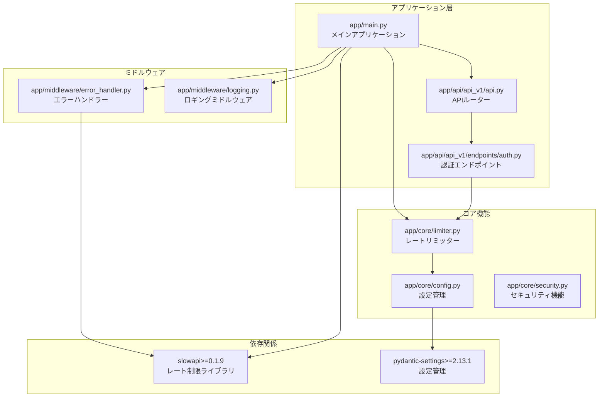
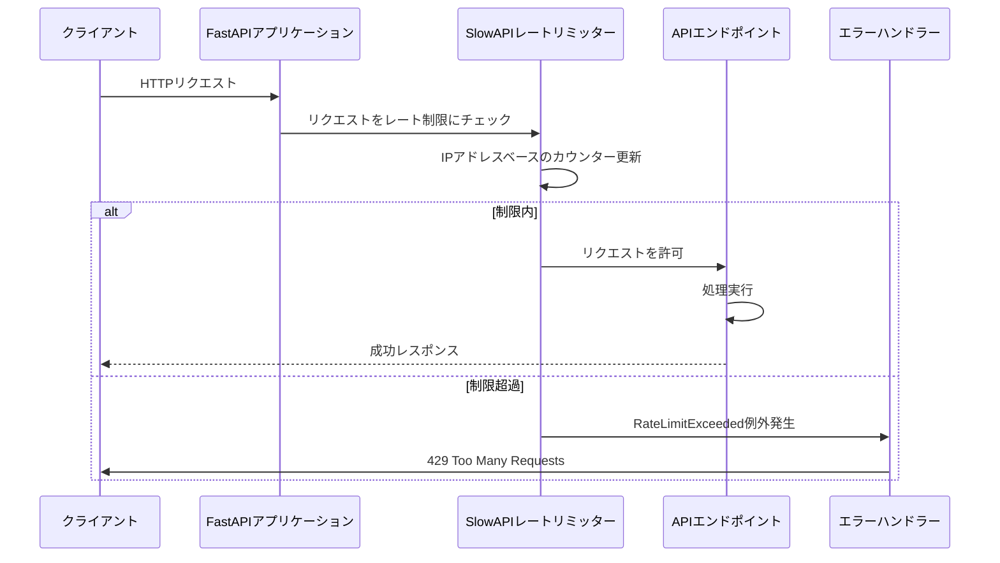
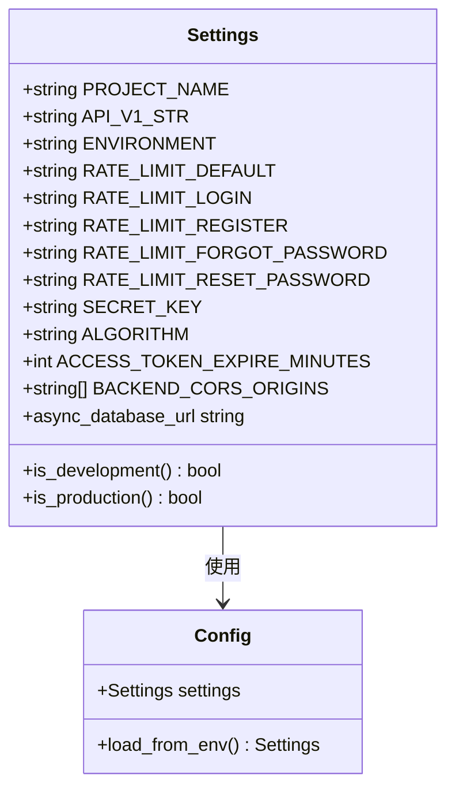
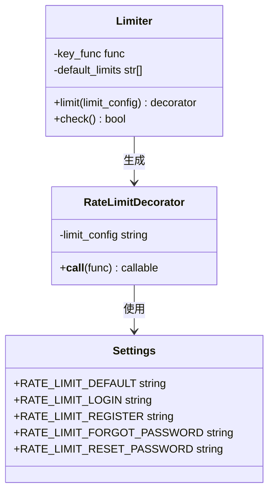
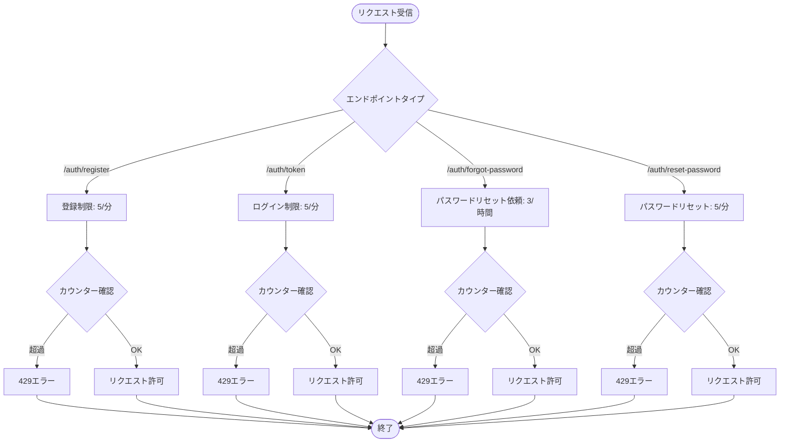
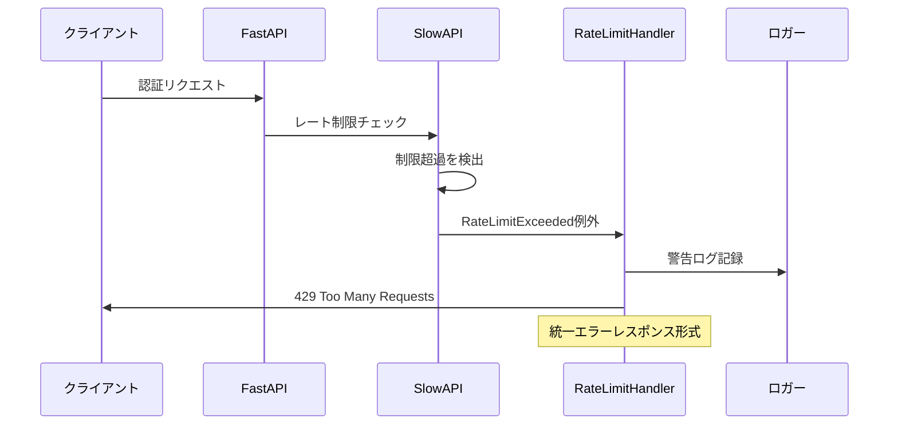
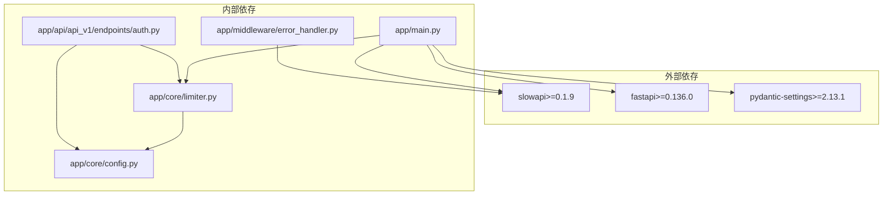
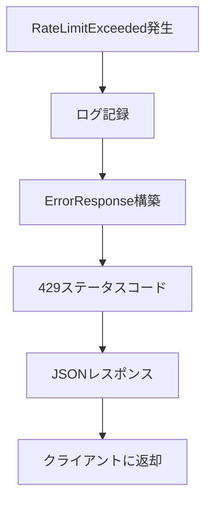

# レート制限

<cite>
**この文書で参照されるファイル**
- [backend/app/core/limiter.py](file://backend/app/core/limiter.py)
- [backend/app/core/config.py](file://backend/app/core/config.py)
- [backend/app/api/api_v1/endpoints/auth.py](file://backend/app/api/api_v1/endpoints/auth.py)
- [backend/app/middleware/error_handler.py](file://backend/app/middleware/error_handler.py)
- [backend/app/main.py](file://backend/app/main.py)
- [backend/pyproject.toml](file://backend/pyproject.toml)
- [backend/app/api/api_v1/api.py](file://backend/app/api/api_v1/api.py)
- [backend/app/api/deps.py](file://backend/app/api/deps.py)
- [backend/app/middleware/logging.py](file://backend/app/middleware/logging.py)
- [backend/app/schemas/error.py](file://backend/app/schemas/error.py)
</cite>

## 更新概要
**変更内容**
- SlowAPIを使用したレート制限の導入に伴うセキュリティ対策の更新
- エンドポイント別レート制限設定（登録: 5回/分、ログイン: 5回/分、パスワードリセット: 3回/時間、5回/分）の詳細反映
- RateLimitExceeded例外用の専用エラーハンドラーの実装

## 目次
1. [はじめに](#はじめに)
2. [プロジェクト構造](#プロジェクト構造)
3. [コアコンポーネント](#コアコンポーネント)
4. [アーキテクチャ概要](#アーキテクチャ概要)
5. [詳細コンポーネント分析](#詳細コンポーネント分析)
6. [依存関係分析](#依存関係分析)
7. [パフォーマンス考慮事項](#パフォーマンス考慮事項)
8. [トラブルシューティングガイド](#トラブルシューティングガイド)
9. [結論](#結論)

## はじめに
本ドキュメントは、Todo APIにおけるAPIレート制限の実装とセキュリティ対策について説明します。SlowAPIを使用したレート制限の設定方法、IPアドレスベースの制限、ユーザー認証状態別の制限設定について解説します。また、DDoS攻撃対策としてのレート制限の役割、制限超過時のエラーハンドリング、パフォーマンスへの影響について述べます。

## プロジェクト構造
FastAPIベースのバックエンドアプリケーションで、SlowAPIによるレート制限機能を統合しています。全体の構造は以下の通りです：

**図の出典**
- [backend/app/main.py:1-175](file://backend/app/main.py#L1-L175)
- [backend/app/core/limiter.py:1-7](file://backend/app/core/limiter.py#L1-L7)
- [backend/app/core/config.py:1-91](file://backend/app/core/config.py#L1-L91)

**節の出典**
- [backend/app/main.py:1-175](file://backend/app/main.py#L1-L175)
- [backend/app/core/config.py:1-91](file://backend/app/core/config.py#L1-L91)

## コアコンポーネント
レート制限システムは以下の主要コンポーネントで構成されています：

### 設定管理コンポーネント
設定は環境変数から読み込まれ、以下のようなレート制限設定を提供します：
- 通常アクセス: 100リクエスト/分
- ログイン: 5リクエスト/分
- 登録: 5リクエスト/分
- パスワードリセット依頼: 3リクエスト/時間
- パスワードリセット: 5リクエスト/分

**更新** 新しい設定項目として、`RATE_LIMIT_FORGOT_PASSWORD`（3/hour）が追加されました。

### レートリミッター
SlowAPIを使用したIPアドレスベースのレート制限を実装。デフォルトの制限は設定から取得され、各エンドポイントごとにカスタム制限を適用可能。

### エラーハンドリング
RateLimitExceeded例外を専用のハンドラーで処理し、統一されたエラーレスポンスを返す。

**更新** RateLimitExceeded例外用の専用ハンドラーが実装され、429 Too Many Requestsエラーが一貫して処理されるようになりました。

**節の出典**
- [backend/app/core/config.py:62-67](file://backend/app/core/config.py#L62-L67)
- [backend/app/core/limiter.py:1-7](file://backend/app/core/limiter.py#L1-L7)
- [backend/app/middleware/error_handler.py:125-149](file://backend/app/middleware/error_handler.py#L125-L149)

## アーキテクチャ概要
レート制限システムはミドルウェア層に統合され、FastAPIのルーティングと連携して動作します。

**図の出典**
- [backend/app/main.py:66-71](file://backend/app/main.py#L66-L71)
- [backend/app/core/limiter.py:6](file://backend/app/core/limiter.py#L6)
- [backend/app/middleware/error_handler.py:125-149](file://backend/app/middleware/error_handler.py#L125-L149)

## 詳細コンポーネント分析

### 設定管理システム
設定はPydantic Settingsを使用して環境変数から読み込まれ、以下のように定義されています：

**図の出典**
- [backend/app/core/config.py:4-91](file://backend/app/core/config.py#L4-L91)

**節の出典**
- [backend/app/core/config.py:62-67](file://backend/app/core/config.py#L62-L67)

### レートリミッター実装
SlowAPIのLimiterクラスを使用してIPアドレスベースのレート制限を実装：

**図の出典**
- [backend/app/core/limiter.py:1-7](file://backend/app/core/limiter.py#L1-L7)
- [backend/app/api/api_v1/endpoints/auth.py:20](file://backend/app/api/api_v1/endpoints/auth.py#L20)

**節の出典**
- [backend/app/core/limiter.py:1-7](file://backend/app/core/limiter.py#L1-L7)

### 認証エンドポイントのレート制限
認証関連エンドポイントには個別のレート制限が設定されています：

**更新** 新しいエンドポイント「パスワードリセット依頼」（/auth/forgot-password）に3/hourの制限が追加されました。

**図の出典**
- [backend/app/api/api_v1/endpoints/auth.py:19-117](file://backend/app/api/api_v1/endpoints/auth.py#L19-L117)
- [backend/app/core/config.py:63-67](file://backend/app/core/config.py#L63-L67)

**節の出典**
- [backend/app/api/api_v1/endpoints/auth.py:19-117](file://backend/app/api/api_v1/endpoints/auth.py#L19-L117)

### エラーハンドリングシステム
RateLimitExceeded例外は専用のハンドラーで処理され、統一されたエラーレスポンスを返します：

**更新** RateLimitExceeded例外用の専用ハンドラーが実装され、429エラーの処理が一貫性を持つようになりました。

**図の出典**
- [backend/app/middleware/error_handler.py:125-149](file://backend/app/middleware/error_handler.py#L125-L149)

**節の出典**
- [backend/app/middleware/error_handler.py:125-149](file://backend/app/middleware/error_handler.py#L125-L149)

## 依存関係分析
レート制限システムの依存関係は以下の通りです：

**更新** `slowapi>=0.1.9` が新しい依存関係として追加されました。

**図の出典**
- [backend/pyproject.toml:22](file://backend/pyproject.toml#L22)
- [backend/app/main.py:24-26](file://backend/app/main.py#L24-L26)

**節の出典**
- [backend/pyproject.toml:1-51](file://backend/pyproject.toml#L1-L51)

## パフォーマンス考慮事項
レート制限のパフォーマンスへの影響を最小限に抑えるための設計方針：

### 1. 非同期処理
- SlowAPIは非同期に対応しており、レート制限チェックも非同期で実行される
- Redisなどの外部ストレージを使用することで、スケーラビリティを確保

### 2. 設定最適化
- IPアドレスベースの制限は軽量な処理で実現可能
- 設定は環境変数から読み込まれるため、起動時に一度だけ評価される

### 3. メモリ効率
- 各IPアドレスのカウンターはRedisなどの外部ストレージに保存される
- メモリ使用量を制限するために、適切なTTL設定が推奨される

### 4. ロギングの影響
- レート制限超過時のログは警告レベルで記録されるため、パフォーマンスへの影響は最小限
- 処理時間の計測はロギングミドルウェアで行われ、レート制限処理とは分離されている

## トラブルシューティングガイド

### 1. 制限超過時のエラーハンドリング
RateLimitExceeded例外は以下の手順で処理されます：

**更新** RateLimitExceeded例外用の専用ハンドラーが実装され、429エラーの処理が一貫性を持つようになりました。

**図の出典**
- [backend/app/middleware/error_handler.py:125-149](file://backend/app/middleware/error_handler.py#L125-L149)

### 2. 設定の確認方法
- 環境変数の確認: `RATE_LIMIT_DEFAULT`, `RATE_LIMIT_LOGIN`, `RATE_LIMIT_REGISTER`, `RATE_LIMIT_FORGOT_PASSWORD`, `RATE_LIMIT_RESET_PASSWORD`
- 設定の反映確認: `settings.RATE_LIMIT_*`プロパティの値を確認

### 3. デバッグ手法
- ロギングミドルウェアの情報を確認
- FastAPIの標準エラーハンドラーの動作を確認
- SlowAPIのカウンター状態の確認方法

**節の出典**
- [backend/app/middleware/error_handler.py:125-149](file://backend/app/middleware/error_handler.py#L125-L149)
- [backend/app/middleware/logging.py:10-67](file://backend/app/middleware/logging.py#L10-L67)

## 結論
本システムはSlowAPIを活用した堅牢なレート制限機能を実装しており、以下の特徴を持っています：

1. **柔軟な設定**: 環境変数ベースの設定により、運用環境に応じた調整が可能
2. **セキュリティ対策**: IPアドレスベースの制限と認証状態別の制限設定により、DDoS攻撃やブルートフォース攻撃への耐性を強化
3. **統一されたエラーハンドリング**: RateLimitExceeded例外は専用のハンドラーで処理され、クライアントに一貫したエラーレスポンスを提供
4. **パフォーマンスの最適化**: 非同期処理と外部ストレージの使用により、パフォーマンスへの影響を最小限に抑えています
5. **エンドポイント別制限**: 登録、ログイン、パスワードリセットなど、各エンドポイントに適切な制限が適用されている

これらの設計により、Todo APIは高信頼性で安全なサービスを提供することが可能となっています。

**更新** 新しいSlowAPIの導入により、より細かい粒度でのレート制限制御が可能になり、セキュリティとパフォーマンスのバランスがさらに向上しました。