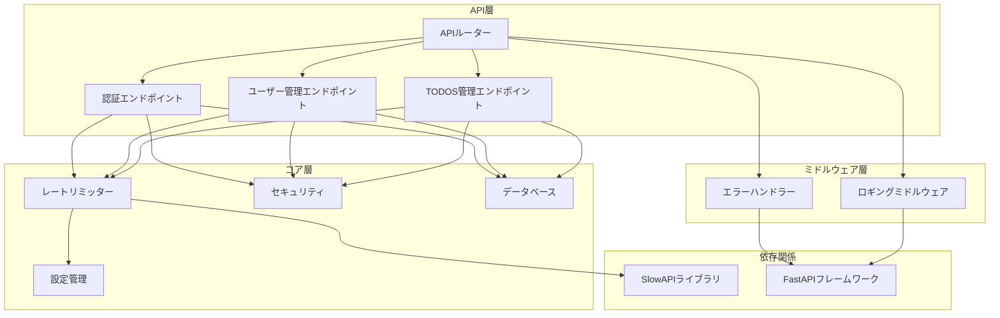
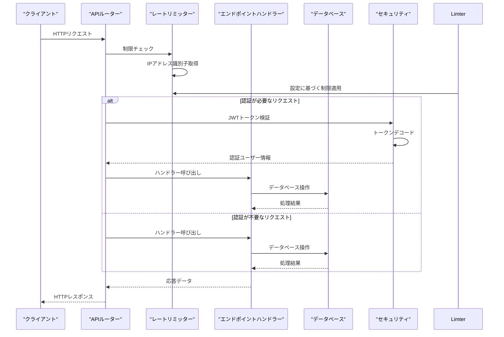
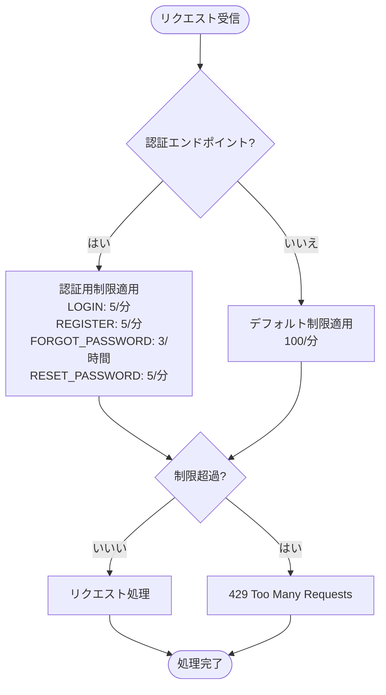
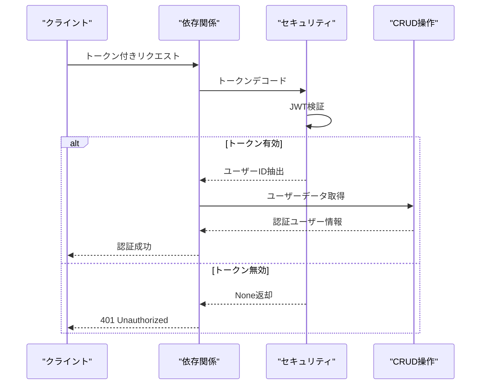
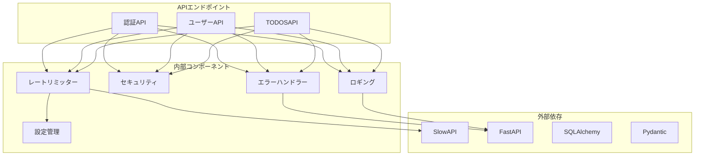

# 認証状態別の制限

<cite>
**本文で参照されるファイル**
- [limiter.py](file://backend/app/core/limiter.py)
- [config.py](file://backend/app/core/config.py)
- [auth.py](file://backend/app/api/api_v1/endpoints/auth.py)
- [users.py](file://backend/app/api/api_v1/endpoints/users.py)
- [todos.py](file://backend/app/api/api_v1/endpoints/todos.py)
- [deps.py](file://backend/app/api/deps.py)
- [security.py](file://backend/app/core/security.py)
- [main.py](file://backend/app/main.py)
- [error_handler.py](file://backend/app/middleware/error_handler.py)
- [logging.py](file://backend/app/middleware/logging.py)
- [db.py](file://backend/app/core/db.py)
- [pyproject.toml](file://backend/pyproject.toml)
</cite>

## 目次
1. [導入](#導入)
2. [プロジェクト構造](#プロジェクト構造)
3. [コアコンポーネント](#コアコンポーネント)
4. [アーキテクチャ概要](#アーキテクチャ概要)
5. [詳細コンポーネント分析](#詳細コンポーネント分析)
6. [依存関係分析](#依存関係分析)
7. [パフォーマンス考慮事項](#パフォーマンス考慮事項)
8. [トラブルシューティングガイド](#トラブルシューティングガイド)
9. [結論](#結論)

## 導入
本ドキュメントは、Todo APIにおける認証ユーザーとゲストユーザーの異なるレート制限設定について説明します。システムはSlowAPIを使用してリクエスト制限を実装しており、認証状態に応じて異なる制限を適用します。認証情報をもとに制限を変更する仕組み、APIエンドポイントごとの個別設定、認証状態の判定ロジックについて詳しく解説します。

## プロジェクト構造
バックエンドアプリケーションはFastAPIフレームワークを使用し、以下の主要なコンポーネントで構成されています：

**図の出典**
- [main.py:1-168](file://backend/app/main.py#L1-L168)
- [api.py:1-8](file://backend/app/api/api_v1/api.py#L1-L8)

**節の出典**
- [main.py:1-168](file://backend/app/main.py#L1-L168)
- [api.py:1-8](file://backend/app/api/api_v1/api.py#L1-L8)

## コアコンポーネント
システムのレート制限機能は以下の主要コンポーネントで構成されています：

### レートリミッター設定
SlowAPIを使用したレート制限の基本設定が行われています。デフォルトの制限は設定から取得され、IPアドレスベースの識別子を使用します。

### 認証状態判定ロジック
JWTトークンを使用した認証状態の判定ロジックが実装されており、有効なトークンを持つユーザーのみが認証ユーザーとして扱われます。

### APIエンドポイントごとの個別設定
各エンドポイントに対して個別のレート制限設定が適用されており、認証が必要な操作とそうでない操作で異なる制限が設定されています。

**節の出典**
- [limiter.py:1-7](file://backend/app/core/limiter.py#L1-L7)
- [config.py:62-67](file://backend/app/core/config.py#L62-L67)
- [deps.py:13-37](file://backend/app/api/deps.py#L13-L37)

## アーキテクチャ概要
システムは以下のアーキテクチャパターンに従って設計されています：

**図の出典**
- [main.py:24-71](file://backend/app/main.py#L24-L71)
- [auth.py:19-34](file://backend/app/api/api_v1/endpoints/auth.py#L19-L34)
- [deps.py:13-37](file://backend/app/api/deps.py#L13-L37)

## 詳細コンポーネント分析

### 認証エンドポイントのレート制限
認証関連のエンドポイントは特に厳しく制限されています。これはセキュリティリスクを低減するためです。

**図の出典**
- [auth.py:20](file://backend/app/api/api_v1/endpoints/auth.py#L20)
- [auth.py:37](file://backend/app/api/api_v1/endpoints/auth.py#L37)
- [auth.py:63](file://backend/app/api/api_v1/endpoints/auth.py#L63)
- [auth.py:87](file://backend/app/api/api_v1/endpoints/auth.py#L87)

#### 認証エンドポイントの個別設定
- `/api/v1/auth/register`: 5回/分
- `/api/v1/auth/token`: 5回/分  
- `/api/v1/auth/forgot-password`: 3回/時間
- `/api/v1/auth/reset-password`: 5回/分

**節の出典**
- [auth.py:19-34](file://backend/app/api/api_v1/endpoints/auth.py#L19-L34)
- [auth.py:36-54](file://backend/app/api/api_v1/endpoints/auth.py#L36-L54)
- [auth.py:57-78](file://backend/app/api/api_v1/endpoints/auth.py#L57-L78)
- [auth.py:81-116](file://backend/app/api/api_v1/endpoints/auth.py#L81-L116)

### 認証状態判定ロジック
認証状態の判定はJWTトークンを使用して行われます。有効なトークンが存在する場合にのみ認証ユーザーとして扱われます。

**図の出典**
- [deps.py:13-37](file://backend/app/api/deps.py#L13-L37)
- [security.py:29-35](file://backend/app/core/security.py#L29-L35)

**節の出典**
- [deps.py:13-37](file://backend/app/api/deps.py#L13-L37)
- [security.py:17-35](file://backend/app/core/security.py#L17-L35)

### 認証ユーザーへの優遇措置
認証ユーザーには以下の優遇措置が適用されています：

1. **デフォルト制限の緩和**: 認証ユーザーのデフォルト制限は100回/分
2. **認証エンドポイントの個別設定**: 認証関連操作は5回/分まで許可
3. **認証状態の維持**: 有効なJWTトークンにより継続的な認証状態を維持

### ゲストユーザーの制限強化
ゲストユーザー（認証されていないユーザー）には以下の制限が適用されます：

1. **デフォルト制限**: 100回/分（非常に高い制限）
2. **認証エンドポイントの制限**: 5回/分（認証操作のみ）
3. **認証が必要なエンドポイント**: 401 Unauthorizedエラー

**節の出典**
- [config.py:63-67](file://backend/app/core/config.py#L63-L67)
- [deps.py:18-23](file://backend/app/api/deps.py#L18-L23)

## 依存関係分析
システムの依存関係は以下の通りです：

**図の出典**
- [pyproject.toml:7-25](file://backend/pyproject.toml#L7-L25)
- [main.py:1-168](file://backend/app/main.py#L1-L168)

**節の出典**
- [pyproject.toml:1-51](file://backend/pyproject.toml#L1-L51)
- [main.py:1-168](file://backend/app/main.py#L1-L168)

## パフォーマンス考慮事項
レート制限のパフォーマンス特性について以下の点が重要です：

### 制限の適用タイミング
- 各リクエストに対してリアルタイムで制限が適用されます
- IPアドレスベースの識別子を使用しているため、ロードバランス環境でも正確に制限できます
- 設定は環境変数から動的に読み込まれるため、運用時に柔軟に調整可能です

### 認証状態の影響
- 認証ユーザーは通常のAPI操作に対して制限を受けるが、認証エンドポイントは制限が緩和されている
- 認証されていないユーザーは認証が必要な操作に対して即座に失敗する
- JWTトークンの検証は軽量な操作であり、パフォーマンスへの影響は最小限

## トラブルシューティングガイド
レート制限に関する問題のトラブルシューティング手順：

### 429 Too Many Requestsエラーの対処
1. **リクエスト頻度の確認**: 1分間あたりのリクエスト数が制限を超えていないか確認
2. **認証状態の確認**: 認証が必要な操作を行う場合は適切なJWTトークンを使用
3. **設定の確認**: 環境変数`RATE_LIMIT_*`の値が適切か確認

### 認証エラーの対処
1. **JWTトークンの検証**: トークンが有効期限内か、正しい形式か確認
2. **認証フローの確認**: 正しい認証フローに従っているか確認
3. **セキュリティ設定の確認**: `SECRET_KEY`や`ALGORITHM`の設定が正しいか確認

**節の出典**
- [error_handler.py:125-148](file://backend/app/middleware/error_handler.py#L125-L148)
- [deps.py:18-23](file://backend/app/api/deps.py#L18-L23)

## 結論
Todo APIのレート制限システムは、認証状態に応じた適切な制御を実現しています。認証ユーザーには優遇措置を適用しつつ、セキュリティリスクを適切に管理するバランスを取っています。SlowAPIの使用により柔軟な制限設定が可能となり、環境変数を通じて運用時の調整も容易です。認証状態の判定ロジックは軽量で効率的であり、システム全体のパフォーマンスに悪影響を与えることなく安全な運用を実現しています。