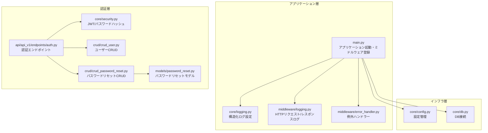
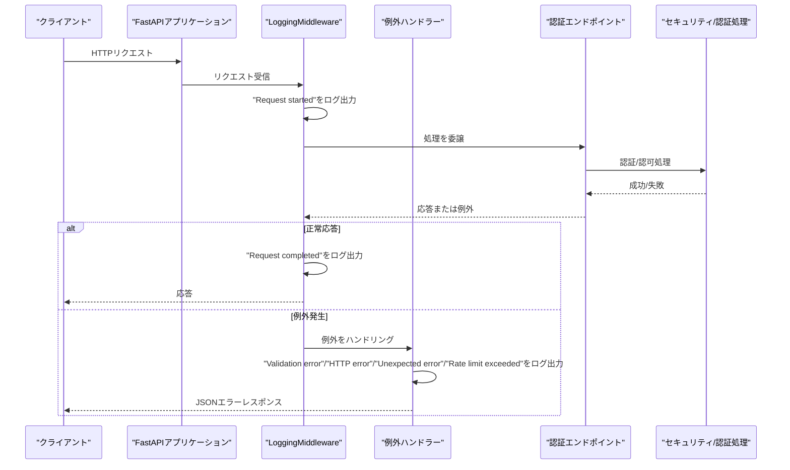
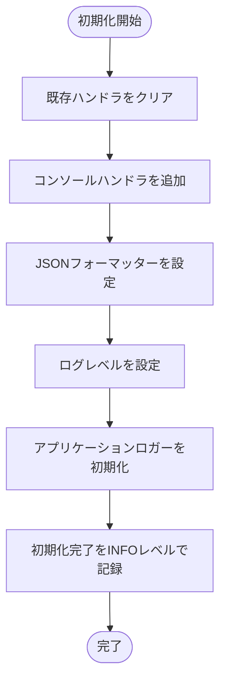
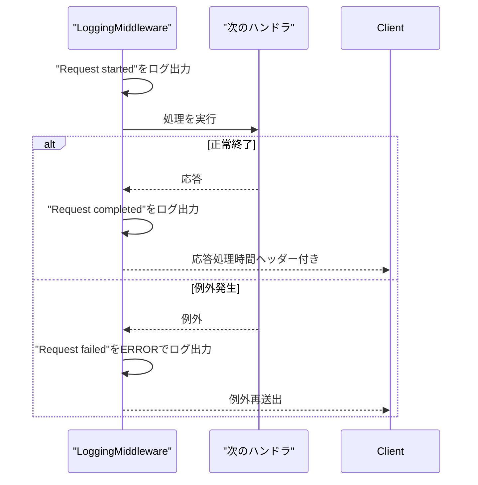
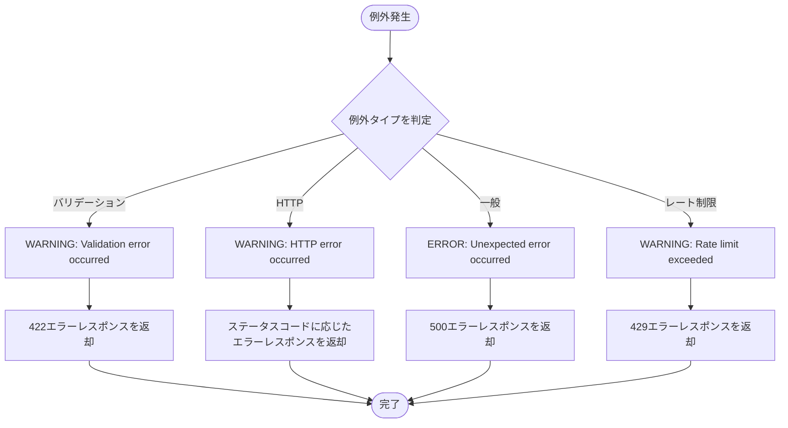
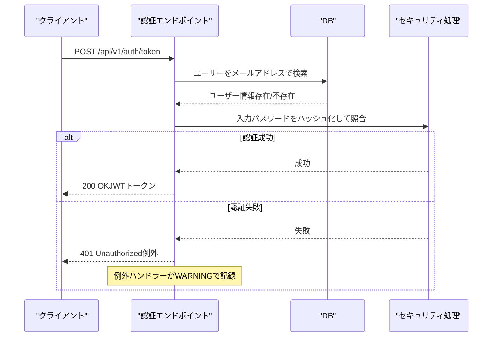
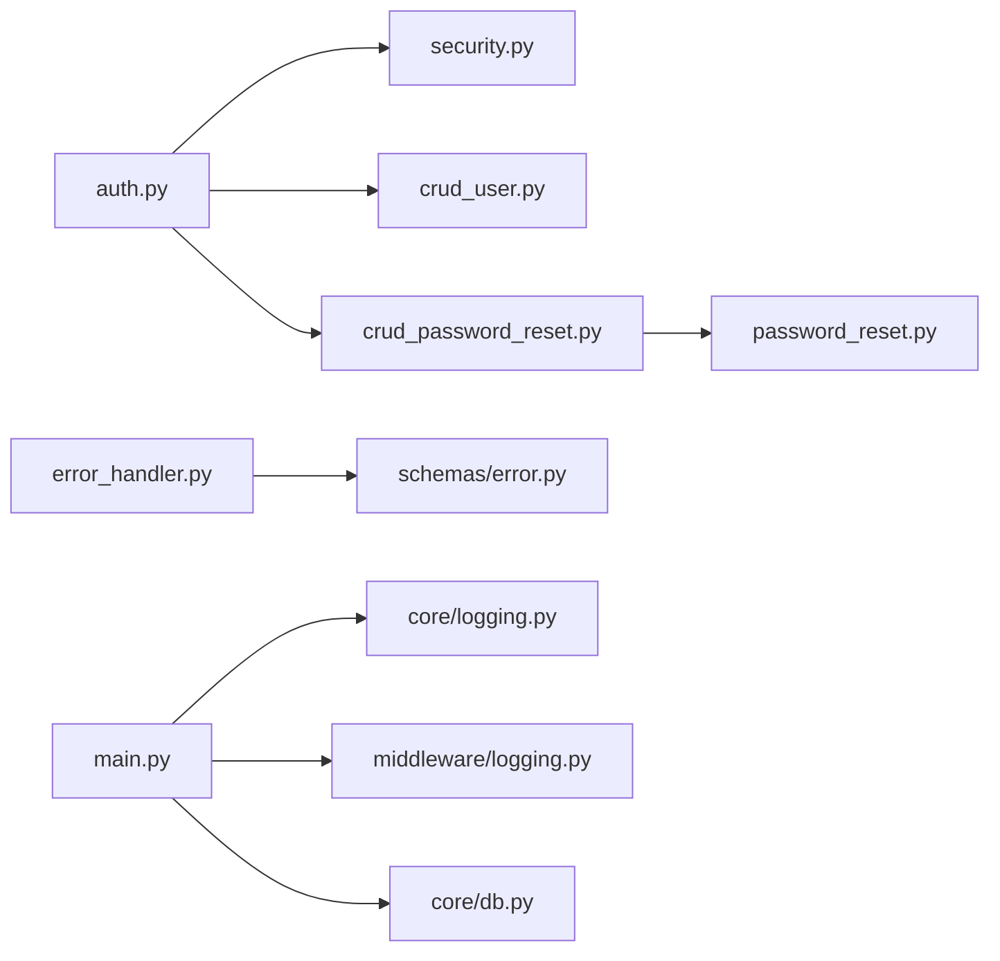

# セキュリティイベントの記録

<cite>
**本文で参照するファイル**   
- [backend/app/main.py](file://backend/app/main.py)
- [backend/app/core/logging.py](file://backend/app/core/logging.py)
- [backend/app/middleware/logging.py](file://backend/app/middleware/logging.py)
- [backend/app/middleware/error_handler.py](file://backend/app/middleware/error_handler.py)
- [backend/app/api/api_v1/endpoints/auth.py](file://backend/app/api/api_v1/endpoints/auth.py)
- [backend/app/core/security.py](file://backend/app/core/security.py)
- [backend/app/core/config.py](file://backend/app/core/config.py)
- [backend/app/crud/crud_user.py](file://backend/app/crud/crud_user.py)
- [backend/app/crud/crud_password_reset.py](file://backend/app/crud/crud_password_reset.py)
- [backend/app/models/password_reset.py](file://backend/app/models/password_reset.py)
- [backend/app/schemas/error.py](file://backend/app/schemas/error.py)
- [backend/app/core/db.py](file://backend/app/core/db.py)
- [backend/tests/test_auth.py](file://backend/tests/test_auth.py)
</cite>

## 目次
1. [はじめに](#はじめに)
2. [プロジェクト構造](#プロジェクト構造)
3. [コアコンポーネント](#コアコンポーネント)
4. [アーキテクチャ概要](#アーキテクチャ概要)
5. [詳細コンポーネント分析](#詳細コンポーネント分析)
6. [依存関係分析](#依存関係分析)
7. [パフォーマンスに関する考慮](#パフォーマンスに関する考慮)
8. [トラブルシューティングガイド](#トラブルシューティングガイド)
9. [結論](#結論)

## はじめに
本ドキュメントは、Todo APIにおける「セキュリティイベントのログ記録」について、実際のコードに基づいて詳しく説明します。認証失敗、不正アクセス試行、権限違反、データベースエラーなどのセキュリティ関連イベントをどのように記録し、どの重要度レベルで記録するか、イベントのカテゴリ分け、そして監視ツールとの連携方法について、具体的なコード例とともに解説します。

## プロジェクト構造
本プロジェクトのバックエンドはFastAPIで構成されており、セキュリティイベントの記録は以下のレイヤーで実装されています：
- 構造化ログ設定：アプリケーション全体のログ出力形式をJSONに統一
- HTTPリクエスト・レスポンスログ：ミドルウェアによるリクエストフローの記録
- 例外ハンドリング：バリデーションエラー、HTTP例外、予期せぬエラー、レート制限超過の記録
- 認証処理：JWT認証、パスワードハッシュ化、トークン管理
- 認証エンドポイント：認証失敗や不正アクセス試行の検知と記録
- 認証例外処理：トークン無効、権限不足、リソース不存在などの記録
- DB接続とヘルスチェック：DBエラーの検知と記録

**図の出典**
- [backend/app/main.py:1-168](file://backend/app/main.py#L1-L168)
- [backend/app/core/logging.py:1-36](file://backend/app/core/logging.py#L1-L36)
- [backend/app/middleware/logging.py:1-67](file://backend/app/middleware/logging.py#L1-L67)
- [backend/app/middleware/error_handler.py:1-149](file://backend/app/middleware/error_handler.py#L1-L149)
- [backend/app/api/api_v1/endpoints/auth.py:1-117](file://backend/app/api/api_v1/endpoints/auth.py#L1-L117)
- [backend/app/core/security.py:1-35](file://backend/app/core/security.py#L1-L35)
- [backend/app/crud/crud_user.py:1-28](file://backend/app/crud/crud_user.py#L1-L28)
- [backend/app/crud/crud_password_reset.py:1-56](file://backend/app/crud/crud_password_reset.py#L1-L56)
- [backend/app/models/password_reset.py:1-52](file://backend/app/models/password_reset.py#L1-L52)
- [backend/app/core/config.py:1-91](file://backend/app/core/config.py#L1-L91)
- [backend/app/core/db.py:1-17](file://backend/app/core/db.py#L1-L17)

**節の出典**
- [backend/app/main.py:1-168](file://backend/app/main.py#L1-L168)
- [backend/app/core/logging.py:1-36](file://backend/app/core/logging.py#L1-L36)

## コアコンポーネント
- 構造化ログ設定：JSONフォーマットでログを出力し、アプリケーションロガーを初期化します。これにより、監視ツールとの連携が容易になります。
- HTTPリクエスト・レスポンスログ：リクエスト開始、完了、エラー発生時のログを記録し、処理時間も含めます。
- 例外ハンドラー：バリデーションエラー、HTTP例外、予期せぬエラー、レート制限超過を一貫した形式で記録します。
- 認証エンドポイント：認証失敗（401）や不正アクセス試行（404など）を検知し、適切な重要度で記録します。
- 認証例外処理：トークン無効、権限不足、リソース不存在などのセキュリティイベントを記録します。
- DBヘルスチェック：DB接続エラーを検知し、エラーログを記録します。

**節の出典**
- [backend/app/middleware/logging.py:1-67](file://backend/app/middleware/logging.py#L1-L67)
- [backend/app/middleware/error_handler.py:1-149](file://backend/app/middleware/error_handler.py#L1-L149)
- [backend/app/api/api_v1/endpoints/auth.py:1-117](file://backend/app/api/api_v1/endpoints/auth.py#L1-L117)
- [backend/app/main.py:134-168](file://backend/app/main.py#L134-L168)

## アーキテクチャ概要
以下は、セキュリティイベントの記録に関与する主なフローの概観です：

**図の出典**
- [backend/app/middleware/logging.py:1-67](file://backend/app/middleware/logging.py#L1-L67)
- [backend/app/middleware/error_handler.py:1-149](file://backend/app/middleware/error_handler.py#L1-L149)
- [backend/app/api/api_v1/endpoints/auth.py:1-117](file://backend/app/api/api_v1/endpoints/auth.py#L1-L117)

## 詳細コンポーネント分析

### 構造化ログ設定（JSON）
- 役割：標準出力へのコンソールハンドラを設定し、JSON形式のログを出力します。
- 重要度：INFOレベルで初期化完了を記録。
- 監視ツールとの連携：JSON出力により、Prometheus、ELKスタック、CloudWatch Logsなどのツールで容易に解析できます。

**図の出典**
- [backend/app/core/logging.py:1-36](file://backend/app/core/logging.py#L1-L36)

**節の出典**
- [backend/app/core/logging.py:1-36](file://backend/app/core/logging.py#L1-L36)

### HTTPリクエスト・レスポンスログ（ミドルウェア）
- 役割：リクエスト開始/完了/エラー発生時にログを記録し、処理時間をレスポンスヘッダーにも含めます。
- 重要度：成功時はINFO、エラー時はERROR。
- 認証失敗の検知：認証エンドポイントで401エラーが発生した場合、ミドルウェアのエラーログとして記録されます。

**図の出典**
- [backend/app/middleware/logging.py:1-67](file://backend/app/middleware/logging.py#L1-L67)

**節の出典**
- [backend/app/middleware/logging.py:1-67](file://backend/app/middleware/logging.py#L1-L67)

### 例外ハンドラー（バリデーション/HTTP/一般/レート制限）
- 役割：各例外タイプに対応するハンドラーで、統一されたエラーレスポンスを返し、ログを記録します。
- 重要度：バリデーションエラー/レート制限超過はWARNING、HTTP例外はWARNING、予期せぬエラーはERROR。
- 認証失敗の検知：401エラー（認証失敗）はHTTP例外として記録され、クライアントには日本語メッセージが含まれます。

**図の出典**
- [backend/app/middleware/error_handler.py:1-149](file://backend/app/middleware/error_handler.py#L1-L149)

**節の出典**
- [backend/app/middleware/error_handler.py:1-149](file://backend/app/middleware/error_handler.py#L1-L149)
- [backend/app/schemas/error.py:1-23](file://backend/app/schemas/error.py#L1-L23)

### 認証エンドポイント（認証失敗・不正アクセス試行）
- 役割：メールアドレスとパスワードの照合を行い、認証失敗時には401エラーを発生させます。
- 重要度：認証失敗はHTTP例外として例外ハンドラーによってWARNINGで記録されます。
- 不正アクセス試行：存在しないユーザーへのパスワードリセットやトークンの無効化、期限切れの検知も行われ、エラーレスポンスとともに記録されます。

**図の出典**
- [backend/app/api/api_v1/endpoints/auth.py:1-117](file://backend/app/api/api_v1/endpoints/auth.py#L1-L117)
- [backend/app/core/security.py:1-35](file://backend/app/core/security.py#L1-L35)
- [backend/app/crud/crud_user.py:1-28](file://backend/app/crud/crud_user.py#L1-L28)

**節の出典**
- [backend/app/api/api_v1/endpoints/auth.py:1-117](file://backend/app/api/api_v1/endpoints/auth.py#L1-L117)
- [backend/app/core/security.py:1-35](file://backend/app/core/security.py#L1-L35)
- [backend/app/crud/crud_user.py:1-28](file://backend/app/crud/crud_user.py#L1-L28)

### 認証例外処理（権限違反・リソース不存在）
- 役割：トークン無効、権限不足、リソース不存在（404）などのセキュリティイベントを記録します。
- 重要度：WARNING（401/403/404）、ERROR（その他の予期せぬエラー）。
- 認証エンドポイントからのHTTP例外は、ミドルウェア経由で例外ハンドラーに渡され、適切な重要度で記録されます。

**節の出典**
- [backend/app/middleware/error_handler.py:1-149](file://backend/app/middleware/error_handler.py#L1-L149)
- [backend/tests/test_auth.py:1-66](file://backend/tests/test_auth.py#L1-L66)

### DBヘルスチェック（データベースエラー）
- 役割：/healthエンドポイントでDB接続を確認し、エラー発生時はERRORで記録します。
- 重要度：エラー発生時はERROR、正常時はINFO。
- 認証失敗や権限違反の影響を受けたDB操作も、同様のエラーログとして記録されます。

**節の出典**
- [backend/app/main.py:134-168](file://backend/app/main.py#L134-L168)
- [backend/app/core/db.py:1-17](file://backend/app/core/db.py#L1-L17)

## 依存関係分析
- 認証エンドポイントはセキュリティ処理（JWT/パスワードハッシュ）とDB操作（ユーザーCRUD、パスワードリセット）に依存しています。
- 例外ハンドラーはエラーレスポンススキーマ（ErrorResponse）に依存し、ミドルウェア経由でアプリケーションロガーに記録されます。
- DBヘルスチェックはDB接続設定（engine）に依存し、エラー発生時はアプリケーションロガーに記録されます。

**図の出典**
- [backend/app/api/api_v1/endpoints/auth.py:1-117](file://backend/app/api/api_v1/endpoints/auth.py#L1-L117)
- [backend/app/core/security.py:1-35](file://backend/app/core/security.py#L1-L35)
- [backend/app/crud/crud_user.py:1-28](file://backend/app/crud/crud_user.py#L1-L28)
- [backend/app/crud/crud_password_reset.py:1-56](file://backend/app/crud/crud_password_reset.py#L1-L56)
- [backend/app/models/password_reset.py:1-52](file://backend/app/models/password_reset.py#L1-L52)
- [backend/app/middleware/error_handler.py:1-149](file://backend/app/middleware/error_handler.py#L1-L149)
- [backend/app/schemas/error.py:1-23](file://backend/app/schemas/error.py#L1-L23)
- [backend/app/main.py:1-168](file://backend/app/main.py#L1-L168)
- [backend/app/core/logging.py:1-36](file://backend/app/core/logging.py#L1-L36)
- [backend/app/middleware/logging.py:1-67](file://backend/app/middleware/logging.py#L1-L67)
- [backend/app/core/db.py:1-17](file://backend/app/core/db.py#L1-L17)

**節の出典**
- [backend/app/api/api_v1/endpoints/auth.py:1-117](file://backend/app/api/api_v1/endpoints/auth.py#L1-L117)
- [backend/app/middleware/error_handler.py:1-149](file://backend/app/middleware/error_handler.py#L1-L149)
- [backend/app/main.py:1-168](file://backend/app/main.py#L1-L168)

## パフォーマンスに関する考慮
- 構造化ログ（JSON）は、解析・フィルタリングに優れていますが、大量のログを出力する場合はI/O負荷に注意が必要です。必要に応じてログレベルを調整し、重要なイベントのみを記録することを推奨します。
- HTTPリクエスト・レスポンスログには処理時間が含まれますが、過剰なログ出力はパフォーマンスに悪影響を与える可能性があります。トレースIDや相対的な処理時間の記録に留めることで、コストと可視性のバランスを取ることが重要です。
- 例外ハンドラーはエラーメッセージをJSON形式で出力するため、パフォーマンスへの影響は最小限ですが、エラーログの量が増えるとストレージやネットワークの負荷が増加します。

[この節では具体的なファイル分析を行っていません]

## トラブルシューティングガイド
- 認証失敗（401）の記録確認
  - 状況：クライアントが無効な資格情報で認証エンドポイントにアクセスした場合
  - 記録内容：HTTP例外としてWARNINGで記録され、URL、メソッド、ステータスコード、詳細が含まれます
  - 参考：[backend/app/api/api_v1/endpoints/auth.py:44-49](file://backend/app/api/api_v1/endpoints/auth.py#L44-L49)、[backend/app/middleware/error_handler.py:52-76](file://backend/app/middleware/error_handler.py#L52-L76)
- 不正アクセス試行（404）の記録確認
  - 状況：存在しないリソースへのアクセスや、トークンが無効な状態での認可エラー
  - 記録内容：WARNINGで記録され、ステータスコードや詳細が含まれます
  - 参考：[backend/app/middleware/error_handler.py:52-76](file://backend/app/middleware/error_handler.py#L52-L76)、[backend/tests/test_auth.py:58-66](file://backend/tests/test_auth.py#L58-L66)
- 権限違反（403）の記録確認
  - 状況：認可エラー（権限不足）が発生した場合
  - 記録内容：WARNINGで記録され、ステータスコードや詳細が含まれます
  - 参考：[backend/app/middleware/error_handler.py:52-76](file://backend/app/middleware/error_handler.py#L52-L76)
- レート制限超過（429）の記録確認
  - 状況：認証・登録・パスワードリセットなどのエンドポイントでレート制限を超えた場合
  - 記録内容：WARNINGで記録され、URL、メソッド、クライアントIPなどが含まれます
  - 参考：[backend/app/middleware/error_handler.py:125-148](file://backend/app/middleware/error_handler.py#L125-L148)
- 予期せぬエラー（500）の記録確認
  - 状況：アプリケーション内部で例外が発生した場合
  - 記録内容：ERRORで記録され、トレース情報を含む可能性があります
  - 参考：[backend/app/middleware/error_handler.py:79-104](file://backend/app/middleware/error_handler.py#L79-L104)
- DBエラーの記録確認
  - 状況：/healthエンドポイントでDB接続に失敗した場合
  - 記録内容：ERRORで記録され、エラー内容が含まれます
  - 参考：[backend/app/main.py:158-159](file://backend/app/main.py#L158-L159)

**節の出典**
- [backend/app/api/api_v1/endpoints/auth.py:44-49](file://backend/app/api/api_v1/endpoints/auth.py#L44-L49)
- [backend/app/middleware/error_handler.py:52-148](file://backend/app/middleware/error_handler.py#L52-L148)
- [backend/tests/test_auth.py:58-66](file://backend/tests/test_auth.py#L58-L66)
- [backend/app/main.py:158-159](file://backend/app/main.py#L158-L159)

## 結論
本プロジェクトでは、認証失敗、不正アクセス試行、権限違反、データベースエラーなどのセキュリティイベントを、適切な重要度レベル（WARNING/ERROR）で構造化ログ（JSON）として記録しています。HTTPリクエスト・レスポンスログ、例外ハンドラー、認証エンドポイント、DBヘルスチェックを通じて、多層的な監視が実現されています。監視ツールとの連携を強化するため、JSON形式のログ出力と、URL、メソッド、ステータスコード、処理時間、クライアントIPなどの詳細なフィールドを活用することが推奨されます。