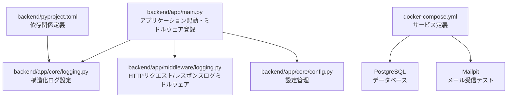
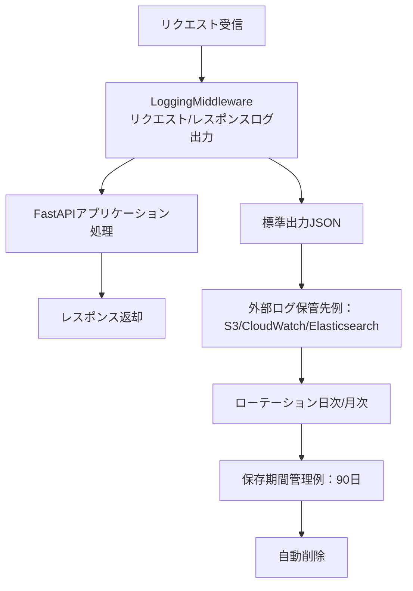
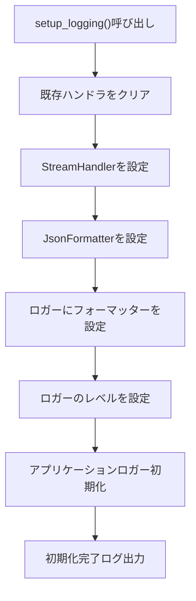
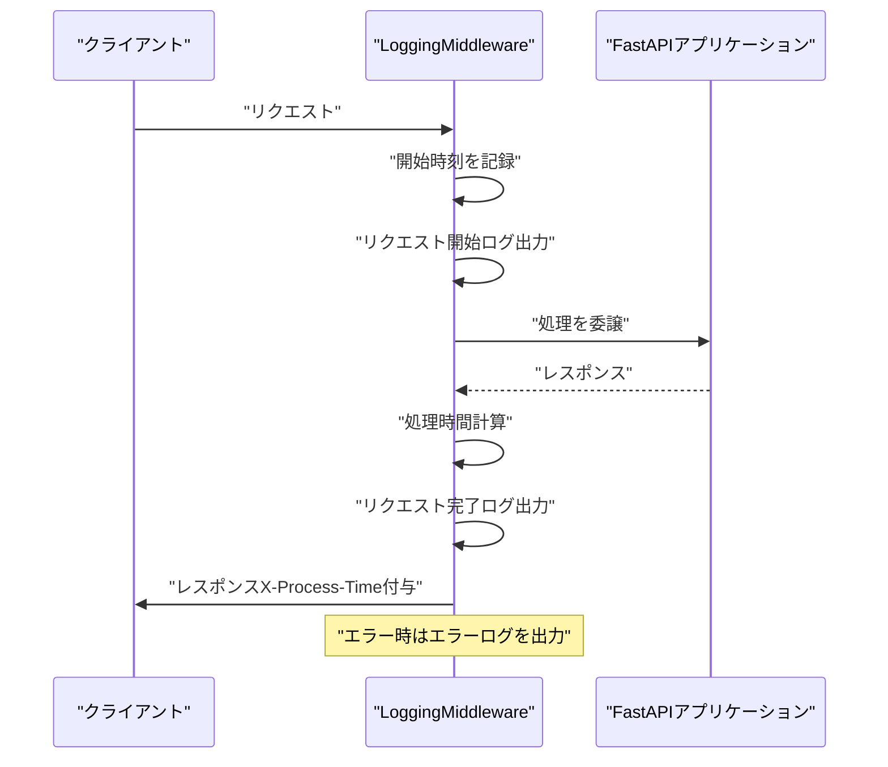
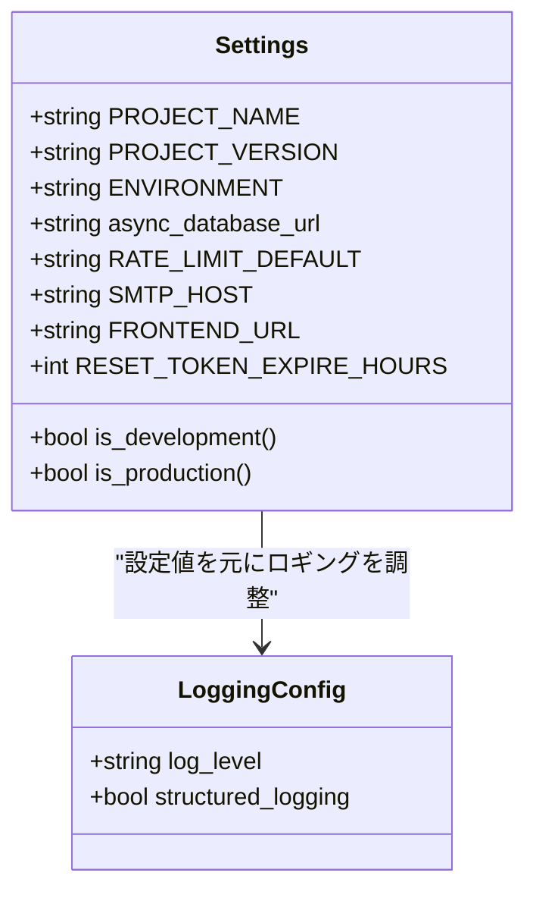
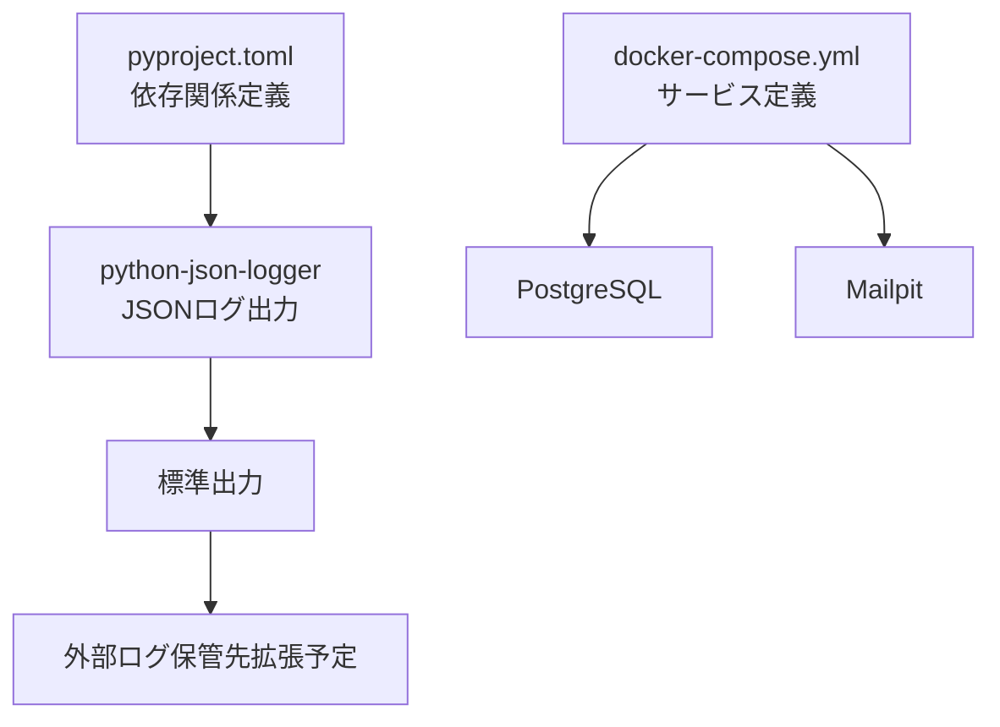

# ログの保存期間管理

<cite>
**この文書で参照されるファイル**
- [backend/app/core/logging.py](file://backend/app/core/logging.py)
- [backend/app/middleware/logging.py](file://backend/app/middleware/logging.py)
- [backend/app/main.py](file://backend/app/main.py)
- [backend/app/core/config.py](file://backend/app/core/config.py)
- [backend/pyproject.toml](file://backend/pyproject.toml)
- [docker-compose.yml](file://docker-compose.yml)
- [README.md](file://README.md)
</cite>

## 目次
1. [はじめに](#はじめに)
2. [プロジェクト構造](#プロジェクト構造)
3. [コアコンポーネント](#コアコンポーネント)
4. [アーキテクチャ概観](#アーキテクチャ概観)
5. [詳細コンポーネント解析](#詳細コンポーネント解析)
6. [依存関係解析](#依存関係解析)
7. [性能に関する考慮事項](#性能に関する考慮事項)
8. [トラブルシューティングガイド](#トラブルシューティングガイド)
9. [結論](#結論)

## はじめに
本ドキュメントは、Todo APIプロジェクトにおける「ログの保存期間管理ポリシー」について説明します。具体的には、法的要件や企業の方針に基づくログ保持期間の設定方法、ローテーション戦略、自動削除の実装方法について解説します。また、ストレージ容量の最適化、パフォーマンスへの影響、監査要件とのバランスについても述べます。

現在の実装では、構造化ログ（JSON形式）がコンソール出力に送られています。保存期間管理のための外部ストレージ（例：S3、CloudWatch Logs、ELKスタックなど）への統合や、ローテーション・自動削除の仕組みは本リポジトリには含まれていません。そのため、本ドキュメントでは「現状の実装」と「それを拡張するための設計案」の2つの視点で説明します。

## プロジェクト構造
バックエンドはFastAPIで構成され、構造化ログ設定、HTTPリクエスト/レスポンスログミドルウェア、設定管理、Dockerコンテナ化が行われています。以下の図は、ログに関連する主なファイルとその役割を示します。

**図の出典**
- [backend/app/main.py:28-29](file://backend/app/main.py#L28-L29)
- [backend/app/core/logging.py:6-35](file://backend/app/core/logging.py#L6-L35)
- [backend/app/middleware/logging.py:10-67](file://backend/app/middleware/logging.py#L10-L67)
- [backend/app/core/config.py:4-90](file://backend/app/core/config.py#L4-L90)
- [backend/pyproject.toml:19](file://backend/pyproject.toml#L19)
- [docker-compose.yml:1-29](file://docker-compose.yml#L1-L29)

**節の出典**
- [backend/app/main.py:28-29](file://backend/app/main.py#L28-L29)
- [backend/app/core/logging.py:6-35](file://backend/app/core/logging.py#L6-L35)
- [backend/app/middleware/logging.py:10-67](file://backend/app/middleware/logging.py#L10-L67)
- [backend/app/core/config.py:4-90](file://backend/app/core/config.py#L4-L90)
- [backend/pyproject.toml:19](file://backend/pyproject.toml#L19)
- [docker-compose.yml:1-29](file://docker-compose.yml#L1-L29)

## コアコンポーネント
- 構造化ログ設定
  - JSONフォーマットのログを標準出力に出力する設定を提供します。ログレベルは設定から取得され、アプリケーションロガーも初期化されます。
  - 関連コード: [backend/app/core/logging.py:6-35](file://backend/app/core/logging.py#L6-L35)

- HTTPリクエスト/レスポンスログミドルウェア
  - 各リクエストの開始・完了・エラーを記録し、処理時間（秒）をレスポンスヘッダーに追加します。
  - 関連コード: [backend/app/middleware/logging.py:10-67](file://backend/app/middleware/logging.py#L10-L67)

- 設定管理
  - 環境変数から各種設定（例：環境種別、CORSオリジン、SMTP設定、JWT設定など）を読み込みます。ログの保存期間管理ポリシーを適用する際の基準となる設定値をここに追加・統合します。
  - 関連コード: [backend/app/core/config.py:4-90](file://backend/app/core/config.py#L4-L90)

- アプリケーション起動
  - 起動・シャットダウン時のイベントログを出力し、ミドルウェア（特にログミドルウェア）を登録します。
  - 関連コード: [backend/app/main.py:28-47](file://backend/app/main.py#L28-L47), [backend/app/main.py:117-118](file://backend/app/main.py#L117-L118)

**節の出典**
- [backend/app/core/logging.py:6-35](file://backend/app/core/logging.py#L6-L35)
- [backend/app/middleware/logging.py:10-67](file://backend/app/middleware/logging.py#L10-L67)
- [backend/app/core/config.py:4-90](file://backend/app/core/config.py#L4-L90)
- [backend/app/main.py:28-47](file://backend/app/main.py#L28-L47)
- [backend/app/main.py:117-118](file://backend/app/main.py#L117-L118)

## アーキテクチャ概観
以下は、ログの流れを示す概念図です。現状では標準出力への出力ですが、保存期間管理ポリシーを適用するには、外部ログ保管先への転送・ローテーション・自動削除の仕組みが必要です。

[この図は概念図であり、実際のコード構造をマッピングしていません]

## 詳細コンポーネント解析

### 構造化ログ設定の解析
- 機能
  - 標準出力へのJSON形式ログ出力
  - ログレベルの柔軟な設定
  - アプリケーションロガーの初期化
- 複雑度
  - 時間計算: O(1)
  - 空間計算: O(1)
- 注意点
  - 現状では標準出力のみ対応しており、保存期間管理ポリシーの適用はできません。

**図の出典**
- [backend/app/core/logging.py:6-35](file://backend/app/core/logging.py#L6-L35)

**節の出典**
- [backend/app/core/logging.py:6-35](file://backend/app/core/logging.py#L6-L35)

### HTTPリクエスト/レスポンスログミドルウェアの解析
- 機能
  - リクエスト開始・完了・エラーのログ出力
  - 処理時間の計算とレスポンスヘッダーへの追加
- 複雑度
  - 時間計算: O(1)
  - 空間計算: O(1)
- 注意点
  - 現状では標準出力への出力のみ。保存期間管理ポリシーを適用するには、外部ログ保管先への統合が必要です。

**図の出典**
- [backend/app/middleware/logging.py:15-66](file://backend/app/middleware/logging.py#L15-L66)

**節の出典**
- [backend/app/middleware/logging.py:15-66](file://backend/app/middleware/logging.py#L15-L66)

### 設定管理の解析
- 機能
  - 環境変数から設定値を読み込み
  - 本番/開発環境の判定
  - 依存ライブラリ（例：python-json-logger）の利用
- 複雑度
  - 時間計算: O(1)
  - 空間計算: O(1)
- 保存期間管理ポリシーとの関連
  - 環境変数経由でポリシー値（例：LOG_RETENTION_DAYS）を設定可能にすることで、運用時に柔軟に変更できるようになります。

**図の出典**
- [backend/app/core/config.py:4-90](file://backend/app/core/config.py#L4-L90)

**節の出典**
- [backend/app/core/config.py:4-90](file://backend/app/core/config.py#L4-L90)

## 依存関係解析
- 構造化ログライブラリ
  - python-json-loggerが依存関係に含まれており、JSON形式のログ出力が可能です。
  - 関連コード: [backend/pyproject.toml:19](file://backend/pyproject.toml#L19)

- Docker環境
  - PostgreSQLとMailpitがコンテナとして提供されており、これらもログの出力先として考慮できます。
  - 関連コード: [docker-compose.yml:1-29](file://docker-compose.yml#L1-L29)

**図の出典**
- [backend/pyproject.toml:19](file://backend/pyproject.toml#L19)
- [docker-compose.yml:1-29](file://docker-compose.yml#L1-L29)

**節の出典**
- [backend/pyproject.toml:19](file://backend/pyproject.toml#L19)
- [docker-compose.yml:1-29](file://docker-compose.yml#L1-L29)

## 性能に関する考慮事項
- 現状の実装では標準出力への出力のみであり、CPU/メモリへの影響は最小限です。
- 外部ログ保管先への統合（例：非同期書き込み、バッチ処理、圧縮）を導入することで、I/O負荷を分散させることができます。
- 処理時間（X-Process-Time）をヘッダーに含めることで、パフォーマンスのモニタリングが可能になります。

[本節は一般的なガイダンスであり、特定のファイルを直接分析していません]

## トラブルシューティングガイド
- 構造化ログが標準出力に出力されることを確認してください。
  - 関連コード: [backend/app/core/logging.py:6-35](file://backend/app/core/logging.py#L6-L35)

- HTTPリクエスト/レスポンスログが正しく出力されているか確認してください。
  - 関連コード: [backend/app/middleware/logging.py:15-66](file://backend/app/middleware/logging.py#L15-L66)

- 起動・シャットダウン時のイベントログを確認してください。
  - 関連コード: [backend/app/main.py:28-47](file://backend/app/main.py#L28-L47)

- 外部ログ保管先への統合が必要な場合は、以下の手順を検討してください。
  - 標準出力から外部サービスへのパイプライン構築（例：Fluent Bit、Filebeat、AWS FireLens）
  - ローテーション戦略（日次/月次のログファイル作成）
  - 自動削除（保存期間を超えたログの定期削除）

[本節は一般的なガイダンスであり、特定のファイルを直接分析していません]

## 結論
- 現状の実装では、構造化ログ（JSON）が標準出力に出力されるのみであり、保存期間管理ポリシー（ローテーション・自動削除）は適用されていません。
- 保存期間管理ポリシーを実装するには、外部ログ保管先への統合（例：S3、CloudWatch Logs、Elasticsearch）と、その上で行うローテーション・自動削除の仕組みを追加する必要があります。
- 設定管理（Settings）を活用して、環境変数経由でポリシー値（例：LOG_RETENTION_DAYS）を柔軟に変更できるようにすると、運用の柔軟性が向上します。
- 性能面では、非同期・バッチ処理・圧縮などの工夫により、I/O負荷を分散させることを推奨します。

[本節は要約であり、特定のファイルを直接分析していません]