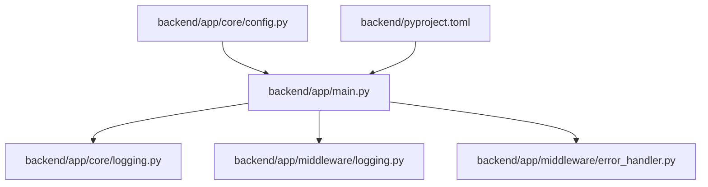
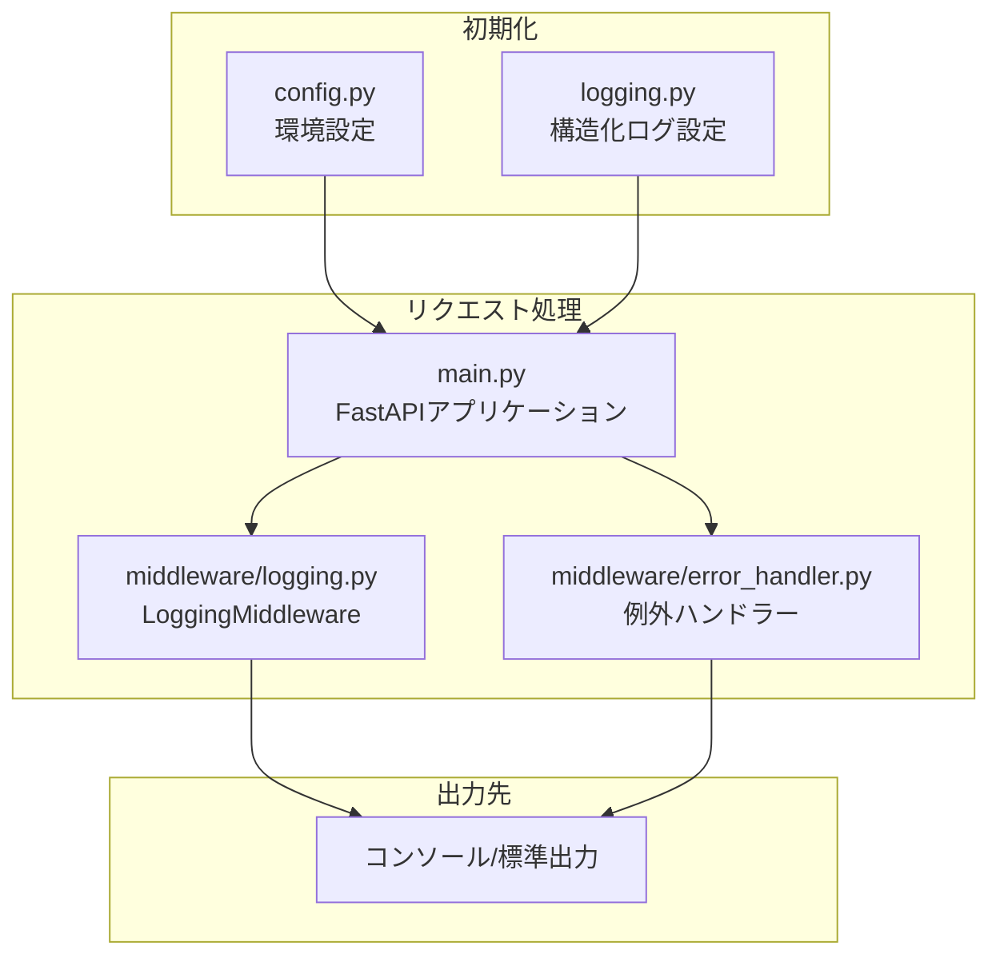
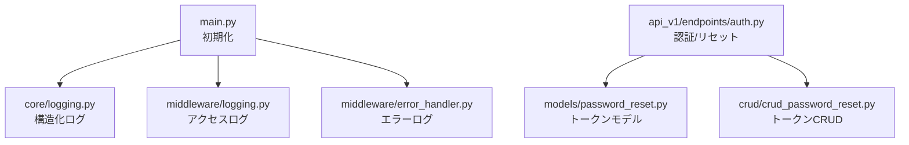

# ログ出力のセキュリティ

<cite>
**本文で参照するファイル**   
- [backend/app/core/logging.py](file://backend/app/core/logging.py)
- [backend/app/middleware/logging.py](file://backend/app/middleware/logging.py)
- [backend/app/main.py](file://backend/app/main.py)
- [backend/app/middleware/error_handler.py](file://backend/app/middleware/error_handler.py)
- [backend/app/core/config.py](file://backend/app/core/config.py)
- [backend/app/api/api_v1/endpoints/auth.py](file://backend/app/api/api_v1/endpoints/auth.py)
- [backend/app/models/password_reset.py](file://backend/app/models/password_reset.py)
- [backend/app/crud/crud_password_reset.py](file://backend/app/crud/crud_password_reset.py)
- [backend/pyproject.toml](file://backend/pyproject.toml)
</cite>

## 目次
1. [はじめに](#はじめに)
2. [プロジェクト構造](#プロジェクト構造)
3. [コアコンポーネント](#コアコンポーネント)
4. [アーキテクチャ概要](#アーキテクチャ概要)
5. [詳細コンポーネント分析](#詳細コンポーネント分析)
6. [依存関係分析](#依存関係分析)
7. [パフォーマンス考慮事項](#パフォーマンス考慮事項)
8. [トラブルシューティングガイド](#トラブルシューティングガイド)
9. [結論](#結論)
10. [付録](#付録)

## はじめに
本ドキュメントは、Todo API システムにおける「ログ出力のセキュリティ」についての包括的なガイドです。具体的には、以下の観点を網羅的に解説します：
- 構造化ログの実装方法
- 機密情報の除外処理
- ログレベルの適切な設定
- セキュリティイベントの記録方法
- アクセスログの監視
- ログのセキュリティ保護策
- ログの保存期間管理と削除ポリシー

本プロジェクトでは、FastAPI に基づくバックエンドにおいて、ミドルウェアによるリクエスト/レスポンスログ、エラーハンドリングによる統一エラーログ、構造化JSON出力による可読性向上と解析容易さを重視した設計が採用されています。

## プロジェクト構造
バックエンドアプリケーションの主なログ関連ファイルは以下の通りです：

**図の出典**
- [backend/app/main.py:28-29](file://backend/app/main.py#L28-L29)
- [backend/app/core/logging.py:6-36](file://backend/app/core/logging.py#L6-L36)
- [backend/app/middleware/logging.py:10-67](file://backend/app/middleware/logging.py#L10-L67)
- [backend/app/middleware/error_handler.py:15-149](file://backend/app/middleware/error_handler.py#L15-L149)
- [backend/app/core/config.py:4-91](file://backend/app/core/config.py#L4-L91)
- [backend/pyproject.toml:1-51](file://backend/pyproject.toml#L1-L51)

**節の出典**
- [backend/app/main.py:28-29](file://backend/app/main.py#L28-L29)
- [backend/app/core/logging.py:6-36](file://backend/app/core/logging.py#L6-L36)
- [backend/app/middleware/logging.py:10-67](file://backend/app/middleware/logging.py#L10-L67)
- [backend/app/middleware/error_handler.py:15-149](file://backend/app/middleware/error_handler.py#L15-L149)
- [backend/app/core/config.py:4-91](file://backend/app/core/config.py#L4-L91)
- [backend/pyproject.toml:1-51](file://backend/pyproject.toml#L1-L51)

## コアコンポーネント
- 構造化ログ設定
  - 構造化ログフォーマッターの設定、コンソール出力への適用、ログレベルの設定、アプリケーションロガーの初期化が含まれます。
  - 参考：[backend/app/core/logging.py:6-36](file://backend/app/core/logging.py#L6-L36)

- HTTPリクエスト/レスポンスログミドルウェア
  - 各リクエストの開始/完了/エラーを記録し、処理時間、ステータスコード、クライアントIPなどのメタ情報を出力します。
  - 参考：[backend/app/middleware/logging.py:10-67](file://backend/app/middleware/logging.py#L10-L67)

- 例外ハンドリングとエラーログ
  - 入力バリデーションエラー、HTTP例外、一般例外、レート制限超過など、統一されたエラーレスポンスとともにログを出力します。
  - 参考：[backend/app/middleware/error_handler.py:15-149](file://backend/app/middleware/error_handler.py#L15-L149)

- 起動/シャットダウン/ヘルスチェックログ
  - アプリケーションライフサイクルとヘルスチェック結果を記録し、状況把握を支援します。
  - 参考：[backend/app/main.py:33-47](file://backend/app/main.py#L33-L47), [backend/app/main.py:134-167](file://backend/app/main.py#L134-L167)

**節の出典**
- [backend/app/core/logging.py:6-36](file://backend/app/core/logging.py#L6-L36)
- [backend/app/middleware/logging.py:10-67](file://backend/app/middleware/logging.py#L10-L67)
- [backend/app/middleware/error_handler.py:15-149](file://backend/app/middleware/error_handler.py#L15-L149)
- [backend/app/main.py:33-47](file://backend/app/main.py#L33-L47)
- [backend/app/main.py:134-167](file://backend/app/main.py#L134-L167)

## アーキテクチャ概要
以下は、ログ出力に関する主要なフローを示すものです。構造化ログの初期化、リクエスト/レスポンスログ、エラーハンドリングの3つの層が連携しています。

**図の出典**
- [backend/app/core/logging.py:6-36](file://backend/app/core/logging.py#L6-L36)
- [backend/app/core/config.py:4-91](file://backend/app/core/config.py#L4-L91)
- [backend/app/middleware/logging.py:10-67](file://backend/app/middleware/logging.py#L10-L67)
- [backend/app/middleware/error_handler.py:15-149](file://backend/app/middleware/error_handler.py#L15-L149)
- [backend/app/main.py:28-29](file://backend/app/main.py#L28-L29)

## 詳細コンポーネント分析

### 構造化ログの実装方法
- 構造化ログの目的
  - JSON形式でのログ出力により、機械可読性を高め、ログ収集・分析ツールとの連携を容易にします。
  - 参考：[backend/app/core/logging.py:22-25](file://backend/app/core/logging.py#L22-L25)

- ログレベルの設定
  - 初期化時にログレベルを設定可能にし、開発/本番環境での出力粒度を調整できます。
  - 参考：[backend/app/core/logging.py:29](file://backend/app/core/logging.py#L29)

- アプリケーションロガーの初期化
  - 名前付きロガー "app" を作成し、初期化完了を記録します。
  - 参考：[backend/app/core/logging.py:32-36](file://backend/app/core/logging.py#L32-L36)

- 起動時のログ出力
  - 起動・シャットダウン、ヘルスチェック結果など、重要なイベントを構造化ログとして出力します。
  - 参考：[backend/app/main.py:36](file://backend/app/main.py#L36), [backend/app/main.py:47](file://backend/app/main.py#L47), [backend/app/main.py:162-165](file://backend/app/main.py#L162-L165)

**節の出典**
- [backend/app/core/logging.py:22-25](file://backend/app/core/logging.py#L22-L25)
- [backend/app/core/logging.py:29](file://backend/app/core/logging.py#L29)
- [backend/app/core/logging.py:32-36](file://backend/app/core/logging.py#L32-L36)
- [backend/app/main.py:36](file://backend/app/main.py#L36)
- [backend/app/main.py:47](file://backend/app/main.py#L47)
- [backend/app/main.py:162-165](file://backend/app/main.py#L162-L165)

### 機密情報の除外処理
- 現状のログ出力における機密情報の取り扱い
  - HTTPリクエスト/レスポンスログでは、URL、メソッド、ステータスコード、処理時間、クライアントIPなどの情報のみを出力しており、認証情報やパスワードは直接ログに出力されていません。
  - 参考：[backend/app/middleware/logging.py:20-45](file://backend/app/middleware/logging.py#L20-L45), [backend/app/middleware/logging.py:56-66](file://backend/app/middleware/logging.py#L56-L66)

- 認証・トークン関連のセキュリティ
  - 認証フローでは、JWTトークンの生成・検証、パスワードのハッシュ化、パスワードリセットトークンのハッシュ化が行われています。これらの処理はログには出力されません。
  - 参考：[backend/app/core/security.py:16-34](file://backend/app/core/security.py#L16-L34), [backend/app/models/password_reset.py:16-18](file://backend/app/models/password_reset.py#L16-L18)

- 例外発生時のログ出力
  - 一般例外発生時はエラー内容を出力しますが、パスワードやトークンなどの機密情報は含まれないよう設計されています。
  - 参考：[backend/app/middleware/error_handler.py:84-92](file://backend/app/middleware/error_handler.py#L84-L92)

- 建議：機密情報の除外ポリシー
  - 任意の追加フィールドをログ出力する際は、機密情報（パスワード、JWT、APIキー、個人識別子）を除外するポリシーを定め、必要に応じてマスキング/ハッシュ化を検討してください。

**節の出典**
- [backend/app/middleware/logging.py:20-45](file://backend/app/middleware/logging.py#L20-L45)
- [backend/app/middleware/logging.py:56-66](file://backend/app/middleware/logging.py#L56-L66)
- [backend/app/core/security.py:16-34](file://backend/app/core/security.py#L16-L34)
- [backend/app/models/password_reset.py:16-18](file://backend/app/models/password_reset.py#L16-L18)
- [backend/app/middleware/error_handler.py:84-92](file://backend/app/middleware/error_handler.py#L84-L92)

### ログレベルの適切な設定
- 適切なログレベルの選択
  - 開発環境：DEBUG 〜 INFO で詳細なトレースを取得
  - 本番環境：ERROR 〜 WARNING で異常のみを記録し、パフォーマンスとプライバシーを考慮
  - 参考：[backend/app/core/logging.py:29](file://backend/app/core/logging.py#L29)

- 設定の適用
  - 構造化ログ設定関数は引数でログレベルを指定可能であり、環境設定から取得した値を適用できます。
  - 参考：[backend/app/core/logging.py:6-12](file://backend/app/core/logging.py#L6-L12), [backend/app/core/config.py:24-34](file://backend/app/core/config.py#L24-L34)

**節の出典**
- [backend/app/core/logging.py:6-12](file://backend/app/core/logging.py#L6-L12)
- [backend/app/core/logging.py:29](file://backend/app/core/logging.py#L29)
- [backend/app/core/config.py:24-34](file://backend/app/core/config.py#L24-L34)

### セキュリティイベントの記録方法
- 認証イベント
  - 認証成功/失敗、パスワードリセットの開始/完了、トークンの使用状況変更などを記録することで、セキュリティ監査が可能になります。
  - 参考：[backend/app/api/api_v1/endpoints/auth.py:38-54](file://backend/app/api/api_v1/endpoints/auth.py#L38-L54), [backend/app/api/api_v1/endpoints/auth.py:64-78](file://backend/app/api/api_v1/endpoints/auth.py#L64-L78), [backend/app/api/api_v1/endpoints/auth.py:88-116](file://backend/app/api/api_v1/endpoints/auth.py#L88-L116)

- トークン管理イベント
  - トークンの作成、検証、使用済み化、無効化の各ステップで、必要に応じてログを出力することで、不正使用の兆候を検出できます。
  - 参考：[backend/app/models/password_reset.py:34-52](file://backend/app/models/password_reset.py#L34-L52), [backend/app/crud/crud_password_reset.py:9-37](file://backend/app/crud/crud_password_reset.py#L9-L37), [backend/app/crud/crud_password_reset.py:40-56](file://backend/app/crud/crud_password_reset.py#L40-L56)

**節の出典**
- [backend/app/api/api_v1/endpoints/auth.py:38-54](file://backend/app/api/api_v1/endpoints/auth.py#L38-L54)
- [backend/app/api/api_v1/endpoints/auth.py:64-78](file://backend/app/api/api_v1/endpoints/auth.py#L64-L78)
- [backend/app/api/api_v1/endpoints/auth.py:88-116](file://backend/app/api/api_v1/endpoints/auth.py#L88-L116)
- [backend/app/models/password_reset.py:34-52](file://backend/app/models/password_reset.py#L34-L52)
- [backend/app/crud/crud_password_reset.py:9-37](file://backend/app/crud/crud_password_reset.py#L9-L37)
- [backend/app/crud/crud_password_reset.py:40-56](file://backend/app/crud/crud_password_reset.py#L40-L56)

### アクセスログの監視
- 訪問ログの記録内容
  - HTTPメソッド、URL、クライアントIP、ステータスコード、処理時間などを構造化ログとして出力し、アクセス傾向や異常トラフィックの監視が可能です。
  - 参考：[backend/app/middleware/logging.py:20-45](file://backend/app/middleware/logging.py#L20-L45)

- 処理時間の追加
  - 応答時間の可視化により、パフォーマンスの劣化や攻撃時の遅延を検知できます。
  - 参考：[backend/app/middleware/logging.py:47-48](file://backend/app/middleware/logging.py#L47-L48)

- 例外発生時のアクセスログ
  - エラー発生時のログにはエラー内容と処理時間が含まれ、異常なアクセスパターンの特定に役立ちます。
  - 参考：[backend/app/middleware/logging.py:56-66](file://backend/app/middleware/logging.py#L56-L66)

**節の出典**
- [backend/app/middleware/logging.py:20-45](file://backend/app/middleware/logging.py#L20-L45)
- [backend/app/middleware/logging.py:47-48](file://backend/app/middleware/logging.py#L47-L48)
- [backend/app/middleware/logging.py:56-66](file://backend/app/middleware/logging.py#L56-L66)

### ログのセキュリティ保護策
- 構造化ログの利用
  - JSON形式での出力により、外部ツールによる解析が容易になり、セキュリティ監視システムとの連携が強化されます。
  - 参考：[backend/app/core/logging.py:22-25](file://backend/app/core/logging.py#L22-L25)

- 例外発生時のログ出力
  - 一般例外発生時はエラー内容を出力しますが、機密情報は含まれないよう設計されています。必要に応じて、例外スタックトレースの出力を制限することも検討してください。
  - 参考：[backend/app/middleware/error_handler.py:84-92](file://backend/app/middleware/error_handler.py#L84-L92)

- 依存関係とライブラリ
  - 構造化ログ出力に必要な依存ライブラリが pyproject.toml に定義されています。
  - 参考：[backend/pyproject.toml:19](file://backend/pyproject.toml#L19)

**節の出典**
- [backend/app/core/logging.py:22-25](file://backend/app/core/logging.py#L22-L25)
- [backend/app/middleware/error_handler.py:84-92](file://backend/app/middleware/error_handler.py#L84-L92)
- [backend/pyproject.toml:19](file://backend/pyproject.toml#L19)

## 依存関係分析
- 構造化ログ設定 → FastAPI初期化
  - 起動時に構造化ログ設定が実行され、以降のミドルウェア・エラーハンドラーがそのロガーを利用します。
  - 参考：[backend/app/main.py:28-29](file://backend/app/main.py#L28-L29), [backend/app/core/logging.py:6-36](file://backend/app/core/logging.py#L6-L36)

- 認証・パスワードリセット → トークン管理
  - 認証エンドポイントからパスワードリセットトークンの作成・検証・使用済み化が呼び出され、これらはセキュリティ監査に必要なイベントとして記録できます。
  - 参考：[backend/app/api/api_v1/endpoints/auth.py:64-78](file://backend/app/api/api_v1/endpoints/auth.py#L64-L78), [backend/app/crud/crud_password_reset.py:9-37](file://backend/app/crud/crud_password_reset.py#L9-L37), [backend/app/crud/crud_password_reset.py:40-56](file://backend/app/crud/crud_password_reset.py#L40-L56)

**図の出典**
- [backend/app/main.py:28-29](file://backend/app/main.py#L28-L29)
- [backend/app/core/logging.py:6-36](file://backend/app/core/logging.py#L6-L36)
- [backend/app/middleware/logging.py:10-67](file://backend/app/middleware/logging.py#L10-L67)
- [backend/app/middleware/error_handler.py:15-149](file://backend/app/middleware/error_handler.py#L15-L149)
- [backend/app/api/api_v1/endpoints/auth.py:64-78](file://backend/app/api/api_v1/endpoints/auth.py#L64-L78)
- [backend/app/models/password_reset.py:21-52](file://backend/app/models/password_reset.py#L21-L52)
- [backend/app/crud/crud_password_reset.py:9-56](file://backend/app/crud/crud_password_reset.py#L9-L56)

**節の出典**
- [backend/app/main.py:28-29](file://backend/app/main.py#L28-L29)
- [backend/app/core/logging.py:6-36](file://backend/app/core/logging.py#L6-L36)
- [backend/app/middleware/logging.py:10-67](file://backend/app/middleware/logging.py#L10-L67)
- [backend/app/middleware/error_handler.py:15-149](file://backend/app/middleware/error_handler.py#L15-L149)
- [backend/app/api/api_v1/endpoints/auth.py:64-78](file://backend/app/api/api_v1/endpoints/auth.py#L64-L78)
- [backend/app/models/password_reset.py:21-52](file://backend/app/models/password_reset.py#L21-L52)
- [backend/app/crud/crud_password_reset.py:9-56](file://backend/app/crud/crud_password_reset.py#L9-L56)

## パフォーマンス考慮事項
- 構造化ログの出力コスト
  - JSON出力は軽量ですが、大量のアクセスログを即時出力するとI/O負荷が増加する可能性があります。必要に応じてバッファリングや非同期出力の導入を検討してください。
- 処理時間の計測
  - 各リクエストの処理時間はミドルウェア内で計測され、レスポンスヘッダーにも追加されます。これにより、パフォーマンスの可視化が可能になります。
  - 参考：[backend/app/middleware/logging.py:34-48](file://backend/app/middleware/logging.py#L34-L48)

**節の出典**
- [backend/app/middleware/logging.py:34-48](file://backend/app/middleware/logging.py#L34-L48)

## トラブルシューティングガイド
- 構造化ログが有効になっていない場合
  - 起動時に初期化処理が実行されているか確認してください。
  - 参考：[backend/app/main.py:28-29](file://backend/app/main.py#L28-L29), [backend/app/core/logging.py:35](file://backend/app/core/logging.py#L35)

- 認証エラーが発生した場合
  - 例外ハンドラーがエラーレスポンスとともにログを出力します。該当するステータスコードに対応するメッセージを確認してください。
  - 参考：[backend/app/middleware/error_handler.py:52-76](file://backend/app/middleware/error_handler.py#L52-L76), [backend/app/middleware/error_handler.py:107-122](file://backend/app/middleware/error_handler.py#L107-L122)

- 一般例外が発生した場合
  - 例外内容とスタックトレースがログに出力されます。必要に応じて、機密情報を含まないように注意してください。
  - 参考：[backend/app/middleware/error_handler.py:79-104](file://backend/app/middleware/error_handler.py#L79-L104), [backend/app/middleware/error_handler.py:84-92](file://backend/app/middleware/error_handler.py#L84-L92)

**節の出典**
- [backend/app/main.py:28-29](file://backend/app/main.py#L28-L29)
- [backend/app/core/logging.py:35](file://backend/app/core/logging.py#L35)
- [backend/app/middleware/error_handler.py:52-76](file://backend/app/middleware/error_handler.py#L52-L76)
- [backend/app/middleware/error_handler.py:107-122](file://backend/app/middleware/error_handler.py#L107-L122)
- [backend/app/middleware/error_handler.py:79-104](file://backend/app/middleware/error_handler.py#L79-L104)
- [backend/app/middleware/error_handler.py:84-92](file://backend/app/middleware/error_handler.py#L84-L92)

## 結論
本プロジェクトでは、構造化ログの導入、ミドルウェアによるアクセスログ、例外ハンドリングによる統一エラーログを通じて、セキュリティ監視・運用保守を強化しています。機密情報の除外ポリシー、適切なログレベル設定、セキュリティイベントの記録方法、アクセスログの監視、および保存期間管理・削除ポリシーの策定が重要です。今後の改善として、ログ出力の監視・分析ツールとの連携、機密情報の除外ポリシーの文書化、保存期間の自動削除機構の導入が挙げられます。

## 付録
- 依存ライブラリ（構造化ログ）
  - python-json-logger が利用されており、JSON形式のログ出力が可能です。
  - 参考：[backend/pyproject.toml:19](file://backend/pyproject.toml#L19)

**節の出典**
- [backend/pyproject.toml:19](file://backend/pyproject.toml#L19)